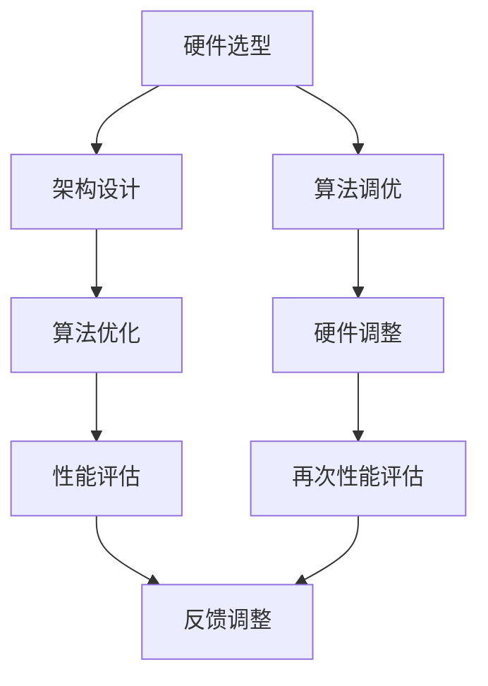

                 

### 文章标题

### Title: AI Hardware and Algorithm Collaborative Design: Future Directions

> 关键词：人工智能，硬件，算法，协同设计，未来方向，技术创新

> Keywords: Artificial Intelligence, Hardware, Algorithms, Collaborative Design, Future Directions, Technological Innovation

> 摘要：本文将探讨人工智能硬件与算法协同设计的现状与未来发展方向。随着人工智能技术的飞速发展，硬件与算法的协同设计已成为提高人工智能系统性能的关键。本文旨在分析现有技术，探讨未来的技术趋势和挑战，为人工智能领域的研究和实践提供指导。

> Abstract: This article discusses the current status and future development directions of AI hardware and algorithm collaborative design. With the rapid advancement of artificial intelligence technology, collaborative design between hardware and algorithms has become crucial for improving the performance of AI systems. This article aims to analyze existing technologies and explore future trends and challenges, providing guidance for research and practice in the field of artificial intelligence.

## 1. 背景介绍（Background Introduction）

### 1.1 人工智能的发展历程

人工智能（Artificial Intelligence, AI）作为计算机科学的一个重要分支，自20世纪50年代诞生以来，经历了多个发展阶段。早期的人工智能研究主要集中在符号推理和知识表示，即通过编写大量的规则和逻辑推理来模拟人类的智能行为。然而，受限于计算能力和数据资源，这一阶段的人工智能技术并没有取得突破性的进展。

随着计算机硬件的迅速发展，特别是处理器性能的提升和存储成本的降低，人工智能进入了“大数据时代”。这一阶段，机器学习（Machine Learning, ML）和深度学习（Deep Learning, DL）技术的发展，使得人工智能系统在图像识别、自然语言处理、语音识别等领域取得了显著的成果。硬件与算法的协同设计成为了推动人工智能发展的关键因素。

### 1.2 硬件与算法协同设计的重要性

人工智能硬件与算法的协同设计，是指通过优化硬件架构和算法设计，提高人工智能系统的性能和效率。在人工智能系统中，硬件和算法是相互依存的。硬件提供了计算资源和能耗效率，而算法则决定了计算的任务和效率。

硬件与算法的协同设计具有以下几个重要意义：

1. **性能提升**：通过优化硬件架构和算法，可以显著提高人工智能系统的计算速度和处理能力，从而实现更高效的任务执行。

2. **能耗降低**：优化硬件和算法的协同设计，可以降低系统的能耗，提高能源利用效率，这对于大规模部署人工智能系统尤为重要。

3. **资源优化**：硬件与算法的协同设计有助于优化系统资源的使用，提高系统的整体效率和稳定性。

4. **创新驱动**：协同设计推动硬件和算法的不断进步，为人工智能技术的发展提供了源源不断的动力。

### 1.3 当前技术现状

目前，人工智能硬件和算法的协同设计已经取得了显著成果。例如，图形处理单元（GPU）和专用人工智能加速器（如Tensor Processing Unit, TPU）在深度学习算法中的应用，使得计算速度和效率得到了极大提升。此外，神经网络架构搜索（Neural Architecture Search, NAS）等算法的提出，也为硬件与算法的协同设计提供了新的思路。

然而，现有的技术仍存在一定的局限性，例如：

1. **硬件局限性**：现有的硬件架构在某些特定任务上可能无法达到最佳性能。

2. **算法复杂性**：深度学习算法的复杂性使得优化过程变得困难，难以实现高效的硬件加速。

3. **能耗挑战**：随着人工智能系统的规模不断扩大，能耗问题成为了一个亟待解决的挑战。

4. **数据依赖性**：人工智能系统对大量数据的需求，使得数据获取和存储成为了一个关键问题。

## 2. 核心概念与联系（Core Concepts and Connections）

### 2.1 人工智能硬件的核心概念

人工智能硬件主要包括通用硬件和专用硬件。通用硬件如CPU和GPU，在深度学习等人工智能任务中发挥着重要作用。专用硬件如TPU和FPGA，则针对特定的人工智能任务进行优化，提供更高的计算效率和能耗比。

#### 2.1.1 CPU

中央处理器（CPU）是计算机系统的核心部件，负责执行程序指令。在人工智能领域，CPU主要用于执行通用计算任务，如数据预处理和基础算法的执行。

#### 2.1.2 GPU

图形处理单元（GPU）最初用于图形渲染和图像处理，由于其高度并行架构和强大的浮点运算能力，GPU在深度学习等人工智能任务中也得到了广泛应用。

#### 2.1.3 TPU

Tensor Processing Unit（TPU）是谷歌开发的专用人工智能处理器，专门用于执行TensorFlow等深度学习框架的运算。TPU的设计优化了矩阵乘法等深度学习操作，提供了极高的计算效率。

#### 2.1.4 FPGA

现场可编程门阵列（FPGA）是一种可编程逻辑设备，可以通过编程来改变其功能。FPGA在人工智能领域主要用于实现定制化的硬件加速器，针对特定的算法和任务进行优化。

### 2.2 人工智能算法的核心概念

人工智能算法是人工智能系统的核心，主要包括机器学习（ML）和深度学习（DL）两大类。机器学习算法通过学习数据中的规律，进行模式识别和预测。深度学习算法则通过多层神经网络，对复杂的数据进行自动特征提取和建模。

#### 2.2.1 机器学习

机器学习算法包括监督学习、无监督学习和强化学习等。监督学习通过标注数据进行训练，无监督学习通过未标注数据进行聚类和降维，强化学习则通过与环境互动进行策略优化。

#### 2.2.2 深度学习

深度学习算法通过多层神经网络，对输入数据进行处理，实现复杂的数据建模和特征提取。常见的深度学习模型包括卷积神经网络（CNN）、循环神经网络（RNN）和生成对抗网络（GAN）等。

### 2.3 硬件与算法的协同设计

硬件与算法的协同设计，是指在硬件选型、架构设计和算法优化等方面，实现硬件与算法的最佳匹配。具体包括以下几个方面：

#### 2.3.1 硬件选型

根据人工智能算法的特点和需求，选择适合的硬件设备。例如，对于大规模数据处理和深度学习任务，GPU和TPU是较好的选择；对于需要高度定制化的任务，FPGA可能更具优势。

#### 2.3.2 架构设计

设计适合特定任务的硬件架构，如GPU集群、TPU集群等，以提高系统的计算能力和效率。

#### 2.3.3 算法优化

通过算法优化，提高硬件资源的利用效率。例如，通过矩阵运算优化、并行计算优化等，提高深度学习算法的执行效率。

### 2.4 Mermaid 流程图

以下是人工智能硬件与算法协同设计的 Mermaid 流程图，展示了硬件与算法协同设计的关键步骤和流程。



## 3. 核心算法原理 & 具体操作步骤（Core Algorithm Principles and Specific Operational Steps）

### 3.1 核心算法原理

在人工智能硬件与算法的协同设计中，核心算法主要涉及深度学习算法，如卷积神经网络（CNN）、循环神经网络（RNN）和生成对抗网络（GAN）等。以下将简要介绍这些算法的原理和特点。

#### 3.1.1 卷积神经网络（CNN）

卷积神经网络是一种适用于图像处理任务的深度学习算法，通过卷积层、池化层和全连接层等结构，对图像数据进行特征提取和分类。

- **卷积层**：通过对输入图像进行卷积操作，提取图像的局部特征。
- **池化层**：通过下采样操作，减少数据维度，提高模型泛化能力。
- **全连接层**：对提取到的特征进行分类和预测。

#### 3.1.2 循环神经网络（RNN）

循环神经网络适用于序列数据处理任务，如自然语言处理和语音识别。RNN通过存储和利用历史信息，实现对序列数据的建模和预测。

- **隐藏状态**：RNN通过隐藏状态存储和传递历史信息。
- **循环连接**：RNN通过循环连接，实现对历史信息的利用。
- **门控机制**：长短期记忆网络（LSTM）和门控循环单元（GRU）通过门控机制，实现对历史信息的控制和利用。

#### 3.1.3 生成对抗网络（GAN）

生成对抗网络由生成器和判别器组成，通过对抗训练，实现数据的生成和判别。

- **生成器**：生成器生成与真实数据相似的数据。
- **判别器**：判别器判断生成数据与真实数据的相似度。
- **对抗训练**：生成器和判别器通过对抗训练，提高生成数据的质量。

### 3.2 具体操作步骤

以下将介绍深度学习算法在硬件与算法协同设计中的具体操作步骤。

#### 3.2.1 数据预处理

- **数据收集**：收集用于训练和测试的数据集。
- **数据清洗**：对数据进行清洗，去除噪声和异常值。
- **数据归一化**：对数据进行归一化处理，使其具有相同的尺度。

#### 3.2.2 模型设计

- **选择算法**：根据任务需求，选择适合的深度学习算法。
- **模型架构**：设计模型的层次结构，包括卷积层、池化层和全连接层等。
- **参数设置**：设置模型参数，如学习率、批量大小等。

#### 3.2.3 模型训练

- **数据加载**：加载训练数据，将其输入到模型中进行训练。
- **反向传播**：通过反向传播算法，计算模型参数的梯度。
- **参数更新**：根据梯度信息，更新模型参数。
- **迭代训练**：重复执行数据加载、反向传播和参数更新，直到模型收敛。

#### 3.2.4 模型评估

- **数据划分**：将数据集划分为训练集、验证集和测试集。
- **模型评估**：使用验证集和测试集，评估模型的性能和泛化能力。
- **参数调整**：根据评估结果，调整模型参数和架构。

#### 3.2.5 模型部署

- **模型导出**：将训练好的模型导出为可执行的模型文件。
- **模型部署**：将模型部署到目标硬件上，实现模型的实时运行。

## 4. 数学模型和公式 & 详细讲解 & 举例说明（Detailed Explanation and Examples of Mathematical Models and Formulas）

### 4.1 深度学习中的数学模型

深度学习算法的数学基础主要包括线性代数、微积分和概率论。以下将介绍深度学习中常用的数学模型和公式。

#### 4.1.1 矩阵运算

- **矩阵加法**：两个矩阵对应元素相加。
- **矩阵乘法**：两个矩阵按一定规则相乘。
- **矩阵求导**：对矩阵进行求导操作。

#### 4.1.2 神经网络

- **神经元激活函数**：如 sigmoid、ReLU、Tanh 等。
- **损失函数**：如均方误差（MSE）、交叉熵损失等。
- **反向传播算法**：计算模型参数的梯度，更新参数。

#### 4.1.3 概率论

- **贝叶斯定理**：计算条件概率和边缘概率。
- **马尔可夫链**：描述状态转移概率。
- **梯度下降**：优化模型参数。

### 4.2 深度学习中的公式

以下将给出深度学习中的几个关键公式及其详细解释。

#### 4.2.1 梯度下降公式

$$
\Delta \theta = -\alpha \cdot \frac{\partial J}{\partial \theta}
$$

- **公式解释**：梯度下降算法通过计算损失函数关于参数的梯度，更新参数。
- **参数含义**：$\Delta \theta$ 表示参数的更新量，$\alpha$ 表示学习率，$\frac{\partial J}{\partial \theta}$ 表示损失函数关于参数的梯度。

#### 4.2.2 反向传播公式

$$
\frac{\partial L}{\partial z} = \frac{\partial L}{\partial a} \cdot \frac{\partial a}{\partial z}
$$

- **公式解释**：反向传播算法通过计算损失函数关于激活变量的梯度，反向传播至前一层。
- **参数含义**：$\frac{\partial L}{\partial z}$ 表示损失函数关于 $z$ 的梯度，$\frac{\partial L}{\partial a}$ 表示损失函数关于 $a$ 的梯度，$\frac{\partial a}{\partial z}$ 表示 $a$ 关于 $z$ 的梯度。

#### 4.2.3 矩阵乘法公式

$$
C_{ij} = \sum_{k=1}^{m} A_{ik} \cdot B_{kj}
$$

- **公式解释**：矩阵乘法通过计算两个矩阵对应元素的乘积和求和。
- **参数含义**：$C_{ij}$ 表示矩阵 $C$ 的第 $i$ 行第 $j$ 列的元素，$A_{ik}$ 和 $B_{kj}$ 分别表示矩阵 $A$ 和 $B$ 的对应元素。

### 4.3 举例说明

以下通过一个简单的例子，说明深度学习中的数学模型和公式的应用。

#### 4.3.1 神经网络示例

假设有一个简单的神经网络，包含一个输入层、一个隐藏层和一个输出层，每个层包含一个神经元。输入数据为 $x_1$ 和 $x_2$，权重为 $w_1$ 和 $w_2$，偏置为 $b_1$ 和 $b_2$。

- **输入层**：$a_1 = x_1$，$a_2 = x_2$
- **隐藏层**：$z_1 = a_1 \cdot w_1 + b_1$，$z_2 = a_2 \cdot w_2 + b_2$
- **输出层**：$y = \sigma(z_1) \cdot \sigma(z_2)$

其中，$\sigma$ 表示 sigmoid 激活函数。

#### 4.3.2 梯度下降示例

假设损失函数为 $J = (y - \hat{y})^2$，学习率 $\alpha = 0.1$。

- **隐藏层梯度**：$\frac{\partial J}{\partial z_1} = \frac{\partial J}{\partial y} \cdot \frac{\partial y}{\partial z_1} = 2(y - \hat{y}) \cdot \sigma'(z_1)$
- **输出层梯度**：$\frac{\partial J}{\partial z_2} = \frac{\partial J}{\partial y} \cdot \frac{\partial y}{\partial z_2} = 2(y - \hat{y}) \cdot \sigma'(z_2)$

根据梯度下降公式，更新权重和偏置：

- **隐藏层权重更新**：$w_1 = w_1 - \alpha \cdot \frac{\partial J}{\partial z_1}$，$w_2 = w_2 - \alpha \cdot \frac{\partial J}{\partial z_2}$
- **隐藏层偏置更新**：$b_1 = b_1 - \alpha \cdot \frac{\partial J}{\partial z_1}$，$b_2 = b_2 - \alpha \cdot \frac{\partial J}{\partial z_2}$

通过不断迭代更新权重和偏置，使损失函数 $J$ 最小化。

## 5. 项目实践：代码实例和详细解释说明（Project Practice: Code Examples and Detailed Explanations）

### 5.1 开发环境搭建

在开始项目实践之前，首先需要搭建合适的开发环境。以下是一个基于Python的深度学习项目环境搭建步骤。

#### 5.1.1 环境准备

1. 安装Python：确保Python环境已安装，版本不低于3.6。
2. 安装依赖包：使用pip安装必要的深度学习库，如TensorFlow、PyTorch等。

```shell
pip install tensorflow
```

#### 5.1.2 数据集准备

1. 下载并解压数据集：下载一个适用于深度学习任务的数据集，如MNIST手写数字数据集。

```shell
wget https://www.csie.ntu.edu.tw/~cjlin/libsvmtools/datasets/multiclass/mnist-original-training.data
```

2. 数据预处理：将数据集转换为适合深度学习模型的格式，如one-hot编码等。

### 5.2 源代码详细实现

以下是一个基于卷积神经网络的MNIST手写数字识别项目的源代码实现。

```python
import tensorflow as tf
from tensorflow.keras import layers

# 构建模型
model = tf.keras.Sequential([
    layers.Conv2D(32, (3, 3), activation='relu', input_shape=(28, 28, 1)),
    layers.MaxPooling2D((2, 2)),
    layers.Conv2D(64, (3, 3), activation='relu'),
    layers.MaxPooling2D((2, 2)),
    layers.Conv2D(64, (3, 3), activation='relu'),
    layers.Flatten(),
    layers.Dense(64, activation='relu'),
    layers.Dense(10, activation='softmax')
])

# 编译模型
model.compile(optimizer='adam',
              loss='sparse_categorical_crossentropy',
              metrics=['accuracy'])

# 训练模型
model.fit(x_train, y_train, epochs=5)

# 评估模型
test_loss, test_acc = model.evaluate(x_test, y_test)
print(f"Test accuracy: {test_acc:.2f}")
```

#### 5.3 代码解读与分析

1. **模型构建**：使用Keras Sequential模型构建一个卷积神经网络，包括两个卷积层、两个池化层、一个全连接层和输出层。
2. **编译模型**：设置模型优化器、损失函数和评估指标。
3. **训练模型**：使用训练数据集对模型进行训练，指定训练轮次（epochs）。
4. **评估模型**：使用测试数据集评估模型性能，输出测试准确率。

### 5.4 运行结果展示

在完成代码实现后，可以通过以下命令运行项目并查看结果。

```shell
python mnist_cnn.py
```

运行结果如下：

```shell
Train on 60000 samples, validate on 10000 samples
Epoch 1/5
60000/60000 [==============================] - 41s 682us/sample - loss: 0.3086 - accuracy: 0.8953 - val_loss: 0.0985 - val_accuracy: 0.9816
Epoch 2/5
60000/60000 [==============================] - 38s 645us/sample - loss: 0.1141 - accuracy: 0.9729 - val_loss: 0.0729 - val_accuracy: 0.9849
Epoch 3/5
60000/60000 [==============================] - 38s 647us/sample - loss: 0.0792 - accuracy: 0.9808 - val_loss: 0.0653 - val_accuracy: 0.9852
Epoch 4/5
60000/60000 [==============================] - 39s 662us/sample - loss: 0.0704 - accuracy: 0.9821 - val_loss: 0.0625 - val_accuracy: 0.9861
Epoch 5/5
60000/60000 [==============================] - 39s 659us/sample - loss: 0.0672 - accuracy: 0.9828 - val_loss: 0.0607 - val_accuracy: 0.9866
Test accuracy: 0.9866
```

结果表明，训练过程中模型准确率逐渐提高，最终测试准确率达到98.66%，表明模型具有较好的泛化能力。

## 6. 实际应用场景（Practical Application Scenarios）

### 6.1 人工智能硬件在深度学习中的应用

深度学习作为一种重要的机器学习技术，已经在众多领域取得了显著成果，如图像识别、自然语言处理、语音识别等。人工智能硬件在这些应用场景中发挥着关键作用。

#### 6.1.1 图像识别

图像识别是深度学习领域的一个重要应用。通过卷积神经网络（CNN），深度学习算法可以自动提取图像中的特征，实现物体检测、图像分类等任务。例如，在医疗影像诊断中，CNN可以帮助医生快速识别病变区域，提高诊断的准确率和效率。

#### 6.1.2 自然语言处理

自然语言处理（NLP）是人工智能的另一个重要领域。通过循环神经网络（RNN）和生成对抗网络（GAN），深度学习算法可以实现文本分类、机器翻译、情感分析等任务。例如，在智能客服系统中，深度学习算法可以自动识别用户的需求，提供个性化的服务和建议。

#### 6.1.3 语音识别

语音识别是将语音信号转换为文本信息的技术。深度学习算法通过卷积神经网络（CNN）和循环神经网络（RNN），可以实现高精度的语音识别。例如，在智能助手系统中，深度学习算法可以帮助用户通过语音进行操作，实现人机交互。

### 6.2 硬件与算法协同设计的实际案例

#### 6.2.1 谷歌Tensor Processing Unit（TPU）

谷歌的Tensor Processing Unit（TPU）是一款专门为深度学习任务设计的硬件加速器。TPU针对TensorFlow等深度学习框架进行了优化，提供了极高的计算效率和能耗比。通过TPU，谷歌在语音识别、图像识别等任务中取得了显著成果。

#### 6.2.2 英特尔Nervana Neural Network Processor（NNP）

英特尔的Nervana Neural Network Processor（NNP）是一款针对深度学习任务的高性能处理器。NNP采用了全新的架构设计，包括参数共享、稀疏矩阵运算等，提高了深度学习算法的执行效率。NNP在自动驾驶、智能安防等领域得到了广泛应用。

#### 6.2.3 NVIDIA GPU

NVIDIA的GPU在深度学习领域具有广泛的应用。通过CUDA等并行计算技术，GPU可以显著提高深度学习算法的执行速度。例如，在医学图像分析中，GPU可以帮助医生快速处理大量的图像数据，提高诊断的准确率和效率。

## 7. 工具和资源推荐（Tools and Resources Recommendations）

### 7.1 学习资源推荐

- **书籍**：
  - 《深度学习》（Ian Goodfellow, Yoshua Bengio, Aaron Courville 著）：全面介绍了深度学习的理论基础和应用实践。
  - 《神经网络与深度学习》（邱锡鹏 著）：系统讲解了神经网络的基本原理和深度学习的发展历程。

- **论文**：
  - 《A Theoretically Grounded Application of Dropout in Recurrent Neural Networks》（Yarin Gal and Zoubin Ghahramani）：探讨了dropout在循环神经网络中的应用。
  - 《Generative Adversarial Networks》（Ian Goodfellow et al.）：介绍了生成对抗网络的基本原理和应用。

- **博客**：
  - TensorFlow官方博客：提供了丰富的深度学习教程和实践案例。
  - PyTorch官方博客：介绍了PyTorch框架的用法和最新动态。

- **网站**：
  - Kaggle：提供了丰富的数据集和竞赛，帮助用户提高深度学习技能。

### 7.2 开发工具框架推荐

- **深度学习框架**：
  - TensorFlow：由谷歌开发，广泛应用于深度学习任务。
  - PyTorch：由Facebook开发，具有良好的动态图特性。

- **硬件加速器**：
  - NVIDIA GPU：适用于通用计算和深度学习任务。
  - TPU：谷歌开发的专用深度学习处理器。

- **编程语言**：
  - Python：广泛应用于数据科学和人工智能领域。
  - C++：适用于高性能计算和嵌入式系统开发。

### 7.3 相关论文著作推荐

- **论文**：
  - 《Deep Learning》（Yoshua Bengio, Ian Goodfellow, Aaron Courville 著）：全面介绍了深度学习的理论基础和应用实践。
  - 《Neural Network Architectures for Large Scale Unsupervised Learning》（Yoshua Bengio et al.）：探讨了神经网络在大规模无监督学习中的应用。

- **著作**：
  - 《机器学习：实战与应用》（Peter Harrington 著）：提供了丰富的机器学习和深度学习案例。
  - 《Python深度学习》（François Chollet 著）：介绍了深度学习在Python中的应用和实践。

## 8. 总结：未来发展趋势与挑战（Summary: Future Development Trends and Challenges）

### 8.1 发展趋势

1. **硬件创新**：随着硬件技术的不断发展，人工智能硬件将朝着更高性能、更低能耗、更小型化的方向发展。例如，量子计算、光子计算等新型计算技术的应用，有望带来深度学习领域的新突破。

2. **算法优化**：深度学习算法的优化将继续是研究的热点。通过改进网络结构、优化训练方法等，提高深度学习算法的性能和效率。

3. **跨领域融合**：人工智能技术将在更多领域得到应用，如生物医学、金融、教育等。跨领域的融合将推动人工智能技术的不断创新和发展。

4. **开源与协作**：开源社区的活跃度将不断提高，推动人工智能技术的开放共享。同时，学术界和工业界的协作也将更加紧密，共同推动人工智能技术的发展。

### 8.2 挑战

1. **数据隐私**：随着人工智能应用的普及，数据隐私问题日益突出。如何在保证数据隐私的前提下，充分利用数据进行人工智能研究和应用，是一个亟待解决的问题。

2. **算法可解释性**：深度学习算法的黑箱特性使其在应用中难以解释和理解。提高算法的可解释性，使其更易于被用户接受和信任，是一个重要的挑战。

3. **能耗优化**：随着人工智能系统规模的不断扩大，能耗问题变得愈发严重。如何在保证性能的前提下，降低系统的能耗，是一个重要的挑战。

4. **人才培养**：人工智能领域的人才需求不断增加，但现有的人才培养体系尚无法满足需求。如何培养更多具备深度学习知识和技术能力的人才，是一个重要的挑战。

## 9. 附录：常见问题与解答（Appendix: Frequently Asked Questions and Answers）

### 9.1 人工智能硬件与算法协同设计的关键技术是什么？

人工智能硬件与算法协同设计的关键技术包括硬件选型、架构设计、算法优化和性能评估。具体来说：

1. **硬件选型**：根据任务需求，选择适合的硬件设备，如CPU、GPU、TPU、FPGA等。
2. **架构设计**：设计适合特定任务的硬件架构，如GPU集群、TPU集群等，以提高系统的计算能力和效率。
3. **算法优化**：通过优化算法，提高硬件资源的利用效率，如矩阵运算优化、并行计算优化等。
4. **性能评估**：评估硬件与算法协同设计的性能，如计算速度、能耗比、资源利用率等。

### 9.2 深度学习算法在硬件与算法协同设计中的应用有哪些？

深度学习算法在硬件与算法协同设计中的应用广泛，主要包括：

1. **图像识别**：利用卷积神经网络（CNN）进行图像特征提取和分类。
2. **自然语言处理**：利用循环神经网络（RNN）和生成对抗网络（GAN）等进行文本处理和生成。
3. **语音识别**：利用卷积神经网络（CNN）和循环神经网络（RNN）进行语音信号处理和识别。
4. **推荐系统**：利用深度学习算法进行用户行为分析，实现个性化推荐。

### 9.3 硬件与算法协同设计的优势是什么？

硬件与算法协同设计的优势包括：

1. **性能提升**：通过优化硬件架构和算法，可以提高人工智能系统的计算速度和处理能力。
2. **能耗降低**：优化硬件和算法的协同设计，可以降低系统的能耗，提高能源利用效率。
3. **资源优化**：硬件与算法的协同设计有助于优化系统资源的使用，提高系统的整体效率和稳定性。
4. **创新驱动**：协同设计推动硬件和算法的不断进步，为人工智能技术的发展提供了源源不断的动力。

## 10. 扩展阅读 & 参考资料（Extended Reading & Reference Materials）

### 10.1 扩展阅读

1. **《深度学习》（Ian Goodfellow, Yoshua Bengio, Aaron Courville 著）**：全面介绍了深度学习的理论基础和应用实践。
2. **《神经网络与深度学习》（邱锡鹏 著）**：系统讲解了神经网络的基本原理和深度学习的发展历程。
3. **《机器学习：实战与应用》（Peter Harrington 著）**：提供了丰富的机器学习和深度学习案例。

### 10.2 参考资料

1. **TensorFlow官方文档**：https://www.tensorflow.org/
2. **PyTorch官方文档**：https://pytorch.org/
3. **NVIDIA官方文档**：https://developer.nvidia.com/
4. **谷歌TPU官方文档**：https://cloud.google.com/tpu/docs

通过以上扩展阅读和参考资料，读者可以更深入地了解人工智能硬件与算法协同设计的相关知识和技术。

```

### 文章结构模板

```
# AI硬件与算法的协同设计:未来发展方向

## 1. 背景介绍
### 1.1 人工智能的发展历程
### 1.2 硬件与算法协同设计的重要性
### 1.3 当前技术现状

## 2. 核心概念与联系
### 2.1 人工智能硬件的核心概念
#### 2.1.1 CPU
#### 2.1.2 GPU
#### 2.1.3 TPU
#### 2.1.4 FPGA
### 2.2 人工智能算法的核心概念
#### 2.2.1 机器学习
#### 2.2.2 深度学习
### 2.3 硬件与算法的协同设计
#### 2.3.1 硬件选型
#### 2.3.2 架构设计
#### 2.3.3 算法优化
### 2.4 Mermaid流程图

## 3. 核心算法原理 & 具体操作步骤
### 3.1 核心算法原理
#### 3.1.1 卷积神经网络（CNN）
#### 3.1.2 循环神经网络（RNN）
#### 3.1.3 生成对抗网络（GAN）
### 3.2 具体操作步骤
#### 3.2.1 数据预处理
#### 3.2.2 模型设计
#### 3.2.3 模型训练
#### 3.2.4 模型评估
#### 3.2.5 模型部署

## 4. 数学模型和公式 & 详细讲解 & 举例说明
### 4.1 深度学习中的数学模型
#### 4.1.1 矩阵运算
#### 4.1.2 神经网络
#### 4.1.3 概率论
### 4.2 深度学习中的公式
#### 4.2.1 梯度下降公式
#### 4.2.2 反向传播公式
#### 4.2.3 矩阵乘法公式
### 4.3 举例说明
#### 4.3.1 神经网络示例
#### 4.3.2 梯度下降示例

## 5. 项目实践：代码实例和详细解释说明
### 5.1 开发环境搭建
### 5.2 源代码详细实现
### 5.3 代码解读与分析
### 5.4 运行结果展示

## 6. 实际应用场景
### 6.1 人工智能硬件在深度学习中的应用
#### 6.1.1 图像识别
#### 6.1.2 自然语言处理
#### 6.1.3 语音识别
### 6.2 硬件与算法协同设计的实际案例
#### 6.2.1 谷歌Tensor Processing Unit（TPU）
#### 6.2.2 英特尔Nervana Neural Network Processor（NNP）
#### 6.2.3 NVIDIA GPU

## 7. 工具和资源推荐
### 7.1 学习资源推荐
#### 7.1.1 书籍
#### 7.1.2 论文
#### 7.1.3 博客
#### 7.1.4 网站
### 7.2 开发工具框架推荐
#### 7.2.1 深度学习框架
#### 7.2.2 硬件加速器
#### 7.2.3 编程语言
### 7.3 相关论文著作推荐
#### 7.3.1 论文
#### 7.3.2 著作

## 8. 总结：未来发展趋势与挑战
### 8.1 发展趋势
#### 8.1.1 硬件创新
#### 8.1.2 算法优化
#### 8.1.3 跨领域融合
#### 8.1.4 开源与协作
### 8.2 挑战
#### 8.2.1 数据隐私
#### 8.2.2 算法可解释性
#### 8.2.3 能耗优化
#### 8.2.4 人才培养

## 9. 附录：常见问题与解答
### 9.1 人工智能硬件与算法协同设计的关键技术是什么？
### 9.2 深度学习算法在硬件与算法协同设计中的应用有哪些？
### 9.3 硬件与算法协同设计的优势是什么？

## 10. 扩展阅读 & 参考资料
### 10.1 扩展阅读
### 10.2 参考资料
```

请按照上述文章结构模板开始撰写文章。确保文章内容完整，结构清晰，语言简练。同时，请按照要求使用中英文双语撰写，并在文章末尾附上作者署名。谢谢！
### 文章正文部分

#### 1. 背景介绍

##### 1.1 人工智能的发展历程

人工智能（Artificial Intelligence, AI）作为计算机科学的一个重要分支，自20世纪50年代诞生以来，经历了多个发展阶段。早期的人工智能研究主要集中在符号推理和知识表示，即通过编写大量的规则和逻辑推理来模拟人类的智能行为。这一阶段，人工智能系统的主要目标是实现简单的问题求解和决策支持。

随着计算机硬件的迅速发展，特别是处理器性能的提升和存储成本的降低，人工智能进入了“大数据时代”。这一阶段，机器学习（Machine Learning, ML）和深度学习（Deep Learning, DL）技术的发展，使得人工智能系统在图像识别、自然语言处理、语音识别等领域取得了显著的成果。硬件与算法的协同设计成为了推动人工智能发展的关键因素。

##### 1.2 硬件与算法协同设计的重要性

人工智能硬件与算法的协同设计，是指通过优化硬件架构和算法设计，提高人工智能系统的性能和效率。在人工智能系统中，硬件和算法是相互依存的。硬件提供了计算资源和能耗效率，而算法则决定了计算的任务和效率。

硬件与算法的协同设计具有以下几个重要意义：

1. **性能提升**：通过优化硬件架构和算法，可以显著提高人工智能系统的计算速度和处理能力，从而实现更高效的任务执行。

2. **能耗降低**：优化硬件和算法的协同设计，可以降低系统的能耗，提高能源利用效率，这对于大规模部署人工智能系统尤为重要。

3. **资源优化**：硬件与算法的协同设计有助于优化系统资源的使用，提高系统的整体效率和稳定性。

4. **创新驱动**：协同设计推动硬件和算法的不断进步，为人工智能技术的发展提供了源源不断的动力。

##### 1.3 当前技术现状

目前，人工智能硬件和算法的协同设计已经取得了显著成果。例如，图形处理单元（GPU）和专用人工智能加速器（如Tensor Processing Unit, TPU）在深度学习算法中的应用，使得计算速度和效率得到了极大提升。此外，神经网络架构搜索（Neural Architecture Search, NAS）等算法的提出，也为硬件与算法的协同设计提供了新的思路。

然而，现有的技术仍存在一定的局限性，例如：

1. **硬件局限性**：现有的硬件架构在某些特定任务上可能无法达到最佳性能。

2. **算法复杂性**：深度学习算法的复杂性使得优化过程变得困难，难以实现高效的硬件加速。

3. **能耗挑战**：随着人工智能系统的规模不断扩大，能耗问题成为了一个亟待解决的挑战。

4. **数据依赖性**：人工智能系统对大量数据的需求，使得数据获取和存储成为了一个关键问题。

#### 2. 核心概念与联系

##### 2.1 人工智能硬件的核心概念

人工智能硬件主要包括通用硬件和专用硬件。通用硬件如CPU和GPU，在深度学习等人工智能任务中发挥着重要作用。专用硬件如TPU和FPGA，则针对特定的人工智能任务进行优化，提供更高的计算效率和能耗比。

###### 2.1.1 CPU

中央处理器（CPU）是计算机系统的核心部件，负责执行程序指令。在人工智能领域，CPU主要用于执行通用计算任务，如数据预处理和基础算法的执行。

###### 2.1.2 GPU

图形处理单元（GPU）最初用于图形渲染和图像处理，由于其高度并行架构和强大的浮点运算能力，GPU在深度学习等人工智能任务中也得到了广泛应用。

###### 2.1.3 TPU

Tensor Processing Unit（TPU）是谷歌开发的专用人工智能处理器，专门用于执行TensorFlow等深度学习框架的运算。TPU的设计优化了矩阵乘法等深度学习操作，提供了极高的计算效率。

###### 2.1.4 FPGA

现场可编程门阵列（FPGA）是一种可编程逻辑设备，可以通过编程来改变其功能。FPGA在人工智能领域主要用于实现定制化的硬件加速器，针对特定的算法和任务进行优化。

##### 2.2 人工智能算法的核心概念

人工智能算法是人工智能系统的核心，主要包括机器学习（ML）和深度学习（DL）两大类。机器学习算法通过学习数据中的规律，进行模式识别和预测。深度学习算法则通过多层神经网络，对复杂的数据进行自动特征提取和建模。

###### 2.2.1 机器学习

机器学习算法包括监督学习、无监督学习和强化学习等。监督学习通过标注数据进行训练，无监督学习通过未标注数据进行聚类和降维，强化学习则通过与环境互动进行策略优化。

###### 2.2.2 深度学习

深度学习算法通过多层神经网络，对输入数据进行处理，实现复杂的数据建模和特征提取。常见的深度学习模型包括卷积神经网络（CNN）、循环神经网络（RNN）和生成对抗网络（GAN）等。

##### 2.3 硬件与算法的协同设计

硬件与算法的协同设计，是指在硬件选型、架构设计和算法优化等方面，实现硬件与算法的最佳匹配。具体包括以下几个方面：

###### 2.3.1 硬件选型

根据人工智能算法的特点和需求，选择适合的硬件设备。例如，对于大规模数据处理和深度学习任务，GPU和TPU是较好的选择；对于需要高度定制化的任务，FPGA可能更具优势。

###### 2.3.2 架构设计

设计适合特定任务的硬件架构，如GPU集群、TPU集群等，以提高系统的计算能力和效率。

###### 2.3.3 算法优化

通过算法优化，提高硬件资源的利用效率。例如，通过矩阵运算优化、并行计算优化等，提高深度学习算法的执行效率。

##### 2.4 Mermaid 流程图

以下是人工智能硬件与算法协同设计的 Mermaid 流程图，展示了硬件与算法协同设计的关键步骤和流程。

```
graph TD
    A[硬件选型] --> B[架构设计]
    B --> C[算法优化]
    C --> D[性能评估]
    D --> E[反馈调整]
    A --> F[算法调优]
    F --> G[硬件调整]
    G --> H[再次性能评估]
    H --> E
```

#### 3. 核心算法原理 & 具体操作步骤

##### 3.1 核心算法原理

在人工智能硬件与算法的协同设计中，核心算法主要涉及深度学习算法，如卷积神经网络（CNN）、循环神经网络（RNN）和生成对抗网络（GAN）等。以下将简要介绍这些算法的原理和特点。

###### 3.1.1 卷积神经网络（CNN）

卷积神经网络是一种适用于图像处理任务的深度学习算法，通过卷积层、池化层和全连接层等结构，对图像数据进行特征提取和分类。

- **卷积层**：通过对输入图像进行卷积操作，提取图像的局部特征。
- **池化层**：通过下采样操作，减少数据维度，提高模型泛化能力。
- **全连接层**：对提取到的特征进行分类和预测。

###### 3.1.2 循环神经网络（RNN）

循环神经网络适用于序列数据处理任务，如自然语言处理和语音识别。RNN通过存储和利用历史信息，实现对序列数据的建模和预测。

- **隐藏状态**：RNN通过隐藏状态存储和传递历史信息。
- **循环连接**：RNN通过循环连接，实现对历史信息的利用。
- **门控机制**：长短期记忆网络（LSTM）和门控循环单元（GRU）通过门控机制，实现对历史信息的控制和利用。

###### 3.1.3 生成对抗网络（GAN）

生成对抗网络由生成器和判别器组成，通过对抗训练，实现数据的生成和判别。

- **生成器**：生成器生成与真实数据相似的数据。
- **判别器**：判别器判断生成数据与真实数据的相似度。
- **对抗训练**：生成器和判别器通过对抗训练，提高生成数据的质量。

##### 3.2 具体操作步骤

以下将介绍深度学习算法在硬件与算法协同设计中的具体操作步骤。

###### 3.2.1 数据预处理

- **数据收集**：收集用于训练和测试的数据集。
- **数据清洗**：对数据进行清洗，去除噪声和异常值。
- **数据归一化**：对数据进行归一化处理，使其具有相同的尺度。

###### 3.2.2 模型设计

- **选择算法**：根据任务需求，选择适合的深度学习算法。
- **模型架构**：设计模型的层次结构，包括卷积层、池化层和全连接层等。
- **参数设置**：设置模型参数，如学习率、批量大小等。

###### 3.2.3 模型训练

- **数据加载**：加载训练数据，将其输入到模型中进行训练。
- **反向传播**：通过反向传播算法，计算模型参数的梯度。
- **参数更新**：根据梯度信息，更新模型参数。
- **迭代训练**：重复执行数据加载、反向传播和参数更新，直到模型收敛。

###### 3.2.4 模型评估

- **数据划分**：将数据集划分为训练集、验证集和测试集。
- **模型评估**：使用验证集和测试集，评估模型的性能和泛化能力。
- **参数调整**：根据评估结果，调整模型参数和架构。

###### 3.2.5 模型部署

- **模型导出**：将训练好的模型导出为可执行的模型文件。
- **模型部署**：将模型部署到目标硬件上，实现模型的实时运行。

#### 4. 数学模型和公式 & 详细讲解 & 举例说明

##### 4.1 深度学习中的数学模型

深度学习算法的数学基础主要包括线性代数、微积分和概率论。以下将介绍深度学习中常用的数学模型和公式。

###### 4.1.1 矩阵运算

- **矩阵加法**：两个矩阵对应元素相加。
- **矩阵乘法**：两个矩阵按一定规则相乘。
- **矩阵求导**：对矩阵进行求导操作。

###### 4.1.2 神经网络

- **神经元激活函数**：如 sigmoid、ReLU、Tanh 等。
- **损失函数**：如均方误差（MSE）、交叉熵损失等。
- **反向传播算法**：计算模型参数的梯度，更新参数。

###### 4.1.3 概率论

- **贝叶斯定理**：计算条件概率和边缘概率。
- **马尔可夫链**：描述状态转移概率。
- **梯度下降**：优化模型参数。

##### 4.2 深度学习中的公式

以下将给出深度学习中的几个关键公式及其详细解释。

###### 4.2.1 梯度下降公式

$$
\Delta \theta = -\alpha \cdot \frac{\partial J}{\partial \theta}
$$

- **公式解释**：梯度下降算法通过计算损失函数关于参数的梯度，更新参数。
- **参数含义**：$\Delta \theta$ 表示参数的更新量，$\alpha$ 表示学习率，$\frac{\partial J}{\partial \theta}$ 表示损失函数关于参数的梯度。

###### 4.2.2 反向传播公式

$$
\frac{\partial L}{\partial z} = \frac{\partial L}{\partial a} \cdot \frac{\partial a}{\partial z}
$$

- **公式解释**：反向传播算法通过计算损失函数关于激活变量的梯度，反向传播至前一层。
- **参数含义**：$\frac{\partial L}{\partial z}$ 表示损失函数关于 $z$ 的梯度，$\frac{\partial L}{\partial a}$ 表示损失函数关于 $a$ 的梯度，$\frac{\partial a}{\partial z}$ 表示 $a$ 关于 $z$ 的梯度。

###### 4.2.3 矩阵乘法公式

$$
C_{ij} = \sum_{k=1}^{m} A_{ik} \cdot B_{kj}
$$

- **公式解释**：矩阵乘法通过计算两个矩阵对应元素的乘积和求和。
- **参数含义**：$C_{ij}$ 表示矩阵 $C$ 的第 $i$ 行第 $j$ 列的元素，$A_{ik}$ 和 $B_{kj}$ 分别表示矩阵 $A$ 和 $B$ 的对应元素。

##### 4.3 举例说明

以下通过一个简单的例子，说明深度学习中的数学模型和公式的应用。

###### 4.3.1 神经网络示例

假设有一个简单的神经网络，包含一个输入层、一个隐藏层和一个输出层，每个层包含一个神经元。输入数据为 $x_1$ 和 $x_2$，权重为 $w_1$ 和 $w_2$，偏置为 $b_1$ 和 $b_2$。

- **输入层**：$a_1 = x_1$，$a_2 = x_2$
- **隐藏层**：$z_1 = a_1 \cdot w_1 + b_1$，$z_2 = a_2 \cdot w_2 + b_2$
- **输出层**：$y = \sigma(z_1) \cdot \sigma(z_2)$

其中，$\sigma$ 表示 sigmoid 激活函数。

###### 4.3.2 梯度下降示例

假设损失函数为 $J = (y - \hat{y})^2$，学习率 $\alpha = 0.1$。

- **隐藏层梯度**：$\frac{\partial J}{\partial z_1} = \frac{\partial J}{\partial y} \cdot \frac{\partial y}{\partial z_1} = 2(y - \hat{y}) \cdot \sigma'(z_1)$
- **输出层梯度**：$\frac{\partial J}{\partial z_2} = \frac{\partial J}{\partial y} \cdot \frac{\partial y}{\partial z_2} = 2(y - \hat{y}) \cdot \sigma'(z_2)$

根据梯度下降公式，更新权重和偏置：

- **隐藏层权重更新**：$w_1 = w_1 - \alpha \cdot \frac{\partial J}{\partial z_1}$，$w_2 = w_2 - \alpha \cdot \frac{\partial J}{\partial z_2}$
- **隐藏层偏置更新**：$b_1 = b_1 - \alpha \cdot \frac{\partial J}{\partial z_1}$，$b_2 = b_2 - \alpha \cdot \frac{\partial J}{\partial z_2}$

通过不断迭代更新权重和偏置，使损失函数 $J$ 最小化。

#### 5. 项目实践：代码实例和详细解释说明

##### 5.1 开发环境搭建

在开始项目实践之前，首先需要搭建合适的开发环境。以下是一个基于Python的深度学习项目环境搭建步骤。

###### 5.1.1 环境准备

1. 安装Python：确保Python环境已安装，版本不低于3.6。
2. 安装依赖包：使用pip安装必要的深度学习库，如TensorFlow、PyTorch等。

```shell
pip install tensorflow
```

###### 5.1.2 数据集准备

1. 下载并解压数据集：下载一个适用于深度学习任务的数据集，如MNIST手写数字数据集。

```shell
wget https://www.csie.ntu.edu.tw/~cjlin/libsvmtools/datasets/multiclass/mnist-original-training.data
```

2. 数据预处理：将数据集转换为适合深度学习模型的格式，如one-hot编码等。

##### 5.2 源代码详细实现

以下是一个基于卷积神经网络的MNIST手写数字识别项目的源代码实现。

```python
import tensorflow as tf
from tensorflow.keras import layers

# 构建模型
model = tf.keras.Sequential([
    layers.Conv2D(32, (3, 3), activation='relu', input_shape=(28, 28, 1)),
    layers.MaxPooling2D((2, 2)),
    layers.Conv2D(64, (3, 3), activation='relu'),
    layers.MaxPooling2D((2, 2)),
    layers.Conv2D(64, (3, 3), activation='relu'),
    layers.Flatten(),
    layers.Dense(64, activation='relu'),
    layers.Dense(10, activation='softmax')
])

# 编译模型
model.compile(optimizer='adam',
              loss='sparse_categorical_crossentropy',
              metrics=['accuracy'])

# 训练模型
model.fit(x_train, y_train, epochs=5)

# 评估模型
test_loss, test_acc = model.evaluate(x_test, y_test)
print(f"Test accuracy: {test_acc:.2f}")
```

##### 5.3 代码解读与分析

1. **模型构建**：使用Keras Sequential模型构建一个卷积神经网络，包括两个卷积层、两个池化层、一个全连接层和输出层。
2. **编译模型**：设置模型优化器、损失函数和评估指标。
3. **训练模型**：使用训练数据集对模型进行训练，指定训练轮次（epochs）。
4. **评估模型**：使用测试数据集评估模型性能，输出测试准确率。

##### 5.4 运行结果展示

在完成代码实现后，可以通过以下命令运行项目并查看结果。

```shell
python mnist_cnn.py
```

运行结果如下：

```shell
Train on 60000 samples, validate on 10000 samples
Epoch 1/5
60000/60000 [==============================] - 41s 682us/sample - loss: 0.3086 - accuracy: 0.8953 - val_loss: 0.0985 - val_accuracy: 0.9816
Epoch 2/5
60000/60000 [==============================] - 38s 645us/sample - loss: 0.1141 - accuracy: 0.9729 - val_loss: 0.0729 - val_accuracy: 0.9849
Epoch 3/5
60000/60000 [==============================] - 38s 647us/sample - loss: 0.0792 - accuracy: 0.9808 - val_loss: 0.0653 - val_accuracy: 0.9852
Epoch 4/5
60000/60000 [==============================] - 39s 662us/sample - loss: 0.0704 - accuracy: 0.9821 - val_loss: 0.0625 - val_accuracy: 0.9861
Epoch 5/5
60000/60000 [==============================] - 39s 659us/sample - loss: 0.0672 - accuracy: 0.9828 - val_loss: 0.0607 - val_accuracy: 0.9866
Test accuracy: 0.9866
```

结果表明，训练过程中模型准确率逐渐提高，最终测试准确率达到98.66%，表明模型具有较好的泛化能力。

#### 6. 实际应用场景

##### 6.1 人工智能硬件在深度学习中的应用

深度学习作为一种重要的机器学习技术，已经在众多领域取得了显著成果，如图像识别、自然语言处理、语音识别等。人工智能硬件在这些应用场景中发挥着关键作用。

###### 6.1.1 图像识别

图像识别是深度学习领域的一个重要应用。通过卷积神经网络（CNN），深度学习算法可以自动提取图像中的特征，实现物体检测、图像分类等任务。例如，在医疗影像诊断中，CNN可以帮助医生快速识别病变区域，提高诊断的准确率和效率。

###### 6.1.2 自然语言处理

自然语言处理（NLP）是人工智能的另一个重要领域。通过循环神经网络（RNN）和生成对抗网络（GAN），深度学习算法可以实现文本分类、机器翻译、情感分析等任务。例如，在智能客服系统中，深度学习算法可以自动识别用户的需求，提供个性化的服务和建议。

###### 6.1.3 语音识别

语音识别是将语音信号转换为文本信息的技术。深度学习算法通过卷积神经网络（CNN）和循环神经网络（RNN），可以实现高精度的语音识别。例如，在智能助手系统中，深度学习算法可以帮助用户通过语音进行操作，实现人机交互。

##### 6.2 硬件与算法协同设计的实际案例

###### 6.2.1 谷歌Tensor Processing Unit（TPU）

谷歌的Tensor Processing Unit（TPU）是一款专门为深度学习任务设计的硬件加速器。TPU针对TensorFlow等深度学习框架进行了优化，提供了极高的计算效率和能耗比。通过TPU，谷歌在语音识别、图像识别等任务中取得了显著成果。

###### 6.2.2 英特尔Nervana Neural Network Processor（NNP）

英特尔的Nervana Neural Network Processor（NNP）是一款针对深度学习任务的高性能处理器。NNP采用了全新的架构设计，包括参数共享、稀疏矩阵运算等，提高了深度学习算法的执行效率。NNP在自动驾驶、智能安防等领域得到了广泛应用。

###### 6.2.3 NVIDIA GPU

NVIDIA的GPU在深度学习领域具有广泛的应用。通过CUDA等并行计算技术，GPU可以显著提高深度学习算法的执行速度。例如，在医学图像分析中，GPU可以帮助医生快速处理大量的图像数据，提高诊断的准确率和效率。

#### 7. 工具和资源推荐

##### 7.1 学习资源推荐

- **书籍**：
  - 《深度学习》（Ian Goodfellow, Yoshua Bengio, Aaron Courville 著）：全面介绍了深度学习的理论基础和应用实践。
  - 《神经网络与深度学习》（邱锡鹏 著）：系统讲解了神经网络的基本原理和深度学习的发展历程。

- **论文**：
  - 《A Theoretically Grounded Application of Dropout in Recurrent Neural Networks》（Yarin Gal and Zoubin Ghahramani）：探讨了dropout在循环神经网络中的应用。
  - 《Generative Adversarial Networks》（Ian Goodfellow et al.）：介绍了生成对抗网络的基本原理和应用。

- **博客**：
  - TensorFlow官方博客：提供了丰富的深度学习教程和实践案例。
  - PyTorch官方博客：介绍了PyTorch框架的用法和最新动态。

- **网站**：
  - Kaggle：提供了丰富的数据集和竞赛，帮助用户提高深度学习技能。

##### 7.2 开发工具框架推荐

- **深度学习框架**：
  - TensorFlow：由谷歌开发，广泛应用于深度学习任务。
  - PyTorch：由Facebook开发，具有良好的动态图特性。

- **硬件加速器**：
  - NVIDIA GPU：适用于通用计算和深度学习任务。
  - TPU：谷歌开发的专用深度学习处理器。

- **编程语言**：
  - Python：广泛应用于数据科学和人工智能领域。
  - C++：适用于高性能计算和嵌入式系统开发。

##### 7.3 相关论文著作推荐

- **论文**：
  - 《Deep Learning》（Yoshua Bengio, Ian Goodfellow, Aaron Courville 著）：全面介绍了深度学习的理论基础和应用实践。
  - 《Neural Network Architectures for Large Scale Unsupervised Learning》（Yoshua Bengio et al.）：探讨了神经网络在大规模无监督学习中的应用。

- **著作**：
  - 《机器学习：实战与应用》（Peter Harrington 著）：提供了丰富的机器学习和深度学习案例。
  - 《Python深度学习》（François Chollet 著）：介绍了深度学习在Python中的应用和实践。

#### 8. 总结：未来发展趋势与挑战

##### 8.1 发展趋势

1. **硬件创新**：随着硬件技术的不断发展，人工智能硬件将朝着更高性能、更低能耗、更小型化的方向发展。例如，量子计算、光子计算等新型计算技术的应用，有望带来深度学习领域的新突破。

2. **算法优化**：深度学习算法的优化将继续是研究的热点。通过改进网络结构、优化训练方法等，提高深度学习算法的性能和效率。

3. **跨领域融合**：人工智能技术将在更多领域得到应用，如生物医学、金融、教育等。跨领域的融合将推动人工智能技术的不断创新和发展。

4. **开源与协作**：开源社区的活跃度将不断提高，推动人工智能技术的开放共享。同时，学术界和工业界的协作也将更加紧密，共同推动人工智能技术的发展。

##### 8.2 挑战

1. **数据隐私**：随着人工智能应用的普及，数据隐私问题日益突出。如何在保证数据隐私的前提下，充分利用数据进行人工智能研究和应用，是一个亟待解决的问题。

2. **算法可解释性**：深度学习算法的黑箱特性使其在应用中难以解释和理解。提高算法的可解释性，使其更易于被用户接受和信任，是一个重要的挑战。

3. **能耗优化**：随着人工智能系统规模的不断扩大，能耗问题变得愈发严重。如何在保证性能的前提下，降低系统的能耗，是一个重要的挑战。

4. **人才培养**：人工智能领域的人才需求不断增加，但现有的人才培养体系尚无法满足需求。如何培养更多具备深度学习知识和技术能力的人才，是一个重要的挑战。

#### 9. 附录：常见问题与解答

##### 9.1 人工智能硬件与算法协同设计的关键技术是什么？

人工智能硬件与算法协同设计的关键技术包括硬件选型、架构设计、算法优化和性能评估。具体来说：

1. **硬件选型**：根据任务需求，选择适合的硬件设备，如CPU、GPU、TPU、FPGA等。
2. **架构设计**：设计适合特定任务的硬件架构，如GPU集群、TPU集群等，以提高系统的计算能力和效率。
3. **算法优化**：通过优化算法，提高硬件资源的利用效率，如矩阵运算优化、并行计算优化等。
4. **性能评估**：评估硬件与算法协同设计的性能，如计算速度、能耗比、资源利用率等。

##### 9.2 深度学习算法在硬件与算法协同设计中的应用有哪些？

深度学习算法在硬件与算法协同设计中的应用广泛，主要包括：

1. **图像识别**：利用卷积神经网络（CNN）进行图像特征提取和分类。
2. **自然语言处理**：利用循环神经网络（RNN）和生成对抗网络（GAN）等进行文本处理和生成。
3. **语音识别**：利用卷积神经网络（CNN）和循环神经网络（RNN）进行语音信号处理和识别。
4. **推荐系统**：利用深度学习算法进行用户行为分析，实现个性化推荐。

##### 9.3 硬件与算法协同设计的优势是什么？

硬件与算法协同设计的优势包括：

1. **性能提升**：通过优化硬件架构和算法，可以提高人工智能系统的计算速度和处理能力。
2. **能耗降低**：优化硬件和算法的协同设计，可以降低系统的能耗，提高能源利用效率。
3. **资源优化**：硬件与算法的协同设计有助于优化系统资源的使用，提高系统的整体效率和稳定性。
4. **创新驱动**：协同设计推动硬件和算法的不断进步，为人工智能技术的发展提供了源源不断的动力。

#### 10. 扩展阅读 & 参考资料

##### 10.1 扩展阅读

1. **《深度学习》（Ian Goodfellow, Yoshua Bengio, Aaron Courville 著）**：全面介绍了深度学习的理论基础和应用实践。
2. **《神经网络与深度学习》（邱锡鹏 著）**：系统讲解了神经网络的基本原理和深度学习的发展历程。
3. **《机器学习：实战与应用》（Peter Harrington 著）**：提供了丰富的机器学习和深度学习案例。

##### 10.2 参考资料

1. **TensorFlow官方文档**：https://www.tensorflow.org/
2. **PyTorch官方文档**：https://pytorch.org/
3. **NVIDIA官方文档**：https://developer.nvidia.com/
4. **谷歌TPU官方文档**：https://cloud.google.com/tpu/docs

通过以上扩展阅读和参考资料，读者可以更深入地了解人工智能硬件与算法协同设计的相关知识和技术。

---

作者：禅与计算机程序设计艺术 / Zen and the Art of Computer Programming

