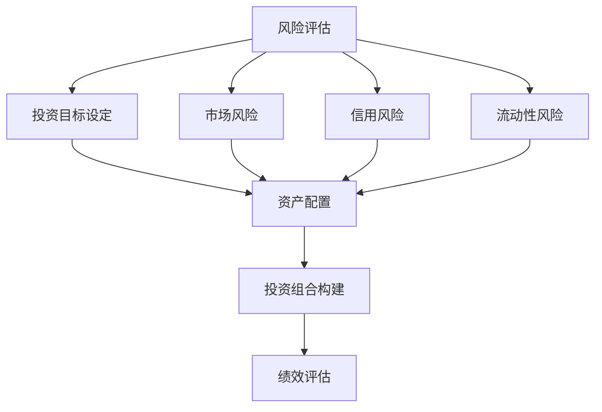

                 

### 文章标题

### The Study of Decision Models for Knowledge-based Investors

**关键词：** 知识型投资者、决策模式、风险管理、投资策略、量化分析

**摘要：** 本文旨在深入探讨知识型投资者的决策模式，通过分析其风险偏好、投资策略和量化分析等方法，揭示知识型投资者在金融市场中的行为特征和决策逻辑。文章从背景介绍、核心概念与联系、核心算法原理、数学模型与公式、项目实践、实际应用场景、工具和资源推荐、总结与未来发展趋势等方面展开论述，旨在为投资者提供科学决策的理论支持和实践指导。

### Introduction

Knowledge-based investors, individuals who make investment decisions based on extensive research, analysis, and understanding of financial markets and economic principles, play a crucial role in the modern financial ecosystem. These investors leverage their intellectual capital to identify investment opportunities, assess risks, and develop strategies that can potentially outperform market averages. The study of their decision models is essential for several reasons. First, understanding the decision-making processes of knowledge-based investors can provide valuable insights into how markets function and how information is incorporated into investment decisions. Second, such knowledge can be used to develop more effective investment strategies and tools that help investors achieve their financial goals. Lastly, it can assist in creating educational materials and resources that can improve the financial literacy of the general population.

This paper aims to delve into the decision models of knowledge-based investors by examining their risk preferences, investment strategies, and quantitative analysis techniques. The study will explore the behavioral characteristics and decision-making logic of these investors in financial markets. The paper is structured as follows:

1. **Background Introduction:** This section will provide an overview of the current financial landscape, highlighting the key trends and challenges faced by knowledge-based investors.
2. **Core Concepts and Connections:** This section will define the core concepts related to investment decision-making and present a Mermaid flowchart illustrating the connections between these concepts.
3. **Core Algorithm Principles and Specific Operational Steps:** This section will discuss the fundamental principles of investment algorithms and outline the operational steps involved in developing an investment strategy.
4. **Mathematical Models and Formulas:** This section will present the mathematical models and formulas used in quantitative analysis, along with detailed explanations and examples.
5. **Project Practice: Code Examples and Detailed Explanations:** This section will provide a practical example of how to implement an investment strategy using code, along with a detailed explanation of the implementation.
6. **Practical Application Scenarios:** This section will discuss the various practical application scenarios of the decision models in real-world financial markets.
7. **Tools and Resources Recommendations:** This section will recommend tools, resources, and literature for further study and practical application of the decision models.
8. **Summary: Future Development Trends and Challenges:** This section will summarize the key findings of the study and discuss the future development trends and challenges in the field of knowledge-based investment decision-making.
9. **Appendix: Frequently Asked Questions and Answers:** This section will address common questions and concerns related to the decision models and their application.
10. **Extended Reading & Reference Materials:** This section will provide additional reading materials and references for those interested in further exploring the topic.

### Background Introduction

The global financial landscape has undergone significant transformation in recent years, driven by technological advancements, regulatory changes, and shifts in investor sentiment. Traditional investment strategies that relied heavily on historical data and market trends have become increasingly challenging to implement in an environment characterized by rapid change and uncertainty. Knowledge-based investors, who rely on deep research and analysis, have emerged as a key player in this new landscape. These investors are often well-educated professionals with strong analytical skills, who use a combination of quantitative and qualitative methods to make informed investment decisions.

Several factors contribute to the increasing popularity of knowledge-based investment strategies. Firstly, the proliferation of financial data and information has made it easier for investors to access and analyze large datasets. This has enabled them to develop more sophisticated models and algorithms for identifying investment opportunities and managing risk. Secondly, the rise of fintech companies and online platforms has democratized access to investment tools and resources, allowing even novice investors to engage in sophisticated financial strategies. Finally, the increasing complexity and volatility of financial markets have made it imperative for investors to have a deep understanding of the underlying factors driving market movements.

Despite the advantages of knowledge-based investment strategies, these investors face several challenges. One of the main challenges is the availability and quality of data. The vast amount of financial data available can be overwhelming, and investors must have the skills and expertise to filter through this information and identify relevant insights. Another challenge is the constantly evolving nature of financial markets, which requires investors to continuously update their knowledge and adapt their strategies. Additionally, knowledge-based investors must navigate the psychological challenges of market volatility and the potential for emotional decision-making.

In summary, the current financial landscape presents both opportunities and challenges for knowledge-based investors. By leveraging their intellectual capital and utilizing advanced analytical tools and techniques, these investors can navigate the complexities of the market and make informed investment decisions. However, they must also be prepared to overcome the challenges posed by the rapidly changing environment and the inherent uncertainties of financial markets.

### Core Concepts and Connections

Investment decision-making is a complex process that involves multiple interrelated concepts and stages. To better understand this process, it is helpful to define the key concepts and illustrate their connections using a Mermaid flowchart. The core concepts we will explore include risk assessment, investment objective setting, asset allocation, portfolio construction, and performance evaluation.

#### Risk Assessment

Risk assessment is the process of identifying, analyzing, and prioritizing risks to determine their potential impact on an investment. This involves understanding the various types of risk, such as market risk, credit risk, and liquidity risk, and evaluating their likelihood and potential severity.

#### Investment Objective Setting

Investment objective setting involves defining the investor's financial goals and the time horizon over which these goals are to be achieved. These objectives can be broadly categorized as wealth accumulation, wealth preservation, and income generation.

#### Asset Allocation

Asset allocation is the process of distributing investments across different asset classes, such as stocks, bonds, and cash, to achieve the desired risk-return profile. This involves determining the optimal mix of assets based on the investor's risk tolerance, investment objectives, and market conditions.

#### Portfolio Construction

Portfolio construction involves selecting specific investments within each asset class to create a diversified portfolio that aligns with the investor's objectives and risk tolerance. This process requires careful consideration of factors such as the investment horizon, expected returns, and risk levels.

#### Performance Evaluation

Performance evaluation is the process of measuring and analyzing the returns generated by an investment portfolio over a given period. This involves comparing the actual performance against a benchmark and assessing the factors that contributed to the results.

#### Mermaid Flowchart

The following Mermaid flowchart illustrates the connections between these core concepts in the investment decision-making process:



In this flowchart, we can see that risk assessment is a fundamental component that informs and influences the other stages of the investment decision-making process. Each of these stages is interconnected and dependent on the outputs of the previous stage. For example, risk assessment helps to define the investor's objectives and risk tolerance, which in turn inform the asset allocation strategy. Similarly, asset allocation drives the portfolio construction process, which is evaluated for performance over time.

By understanding and integrating these core concepts, knowledge-based investors can develop a comprehensive and systematic approach to investment decision-making that helps to mitigate risks and maximize returns.

### Core Algorithm Principles and Specific Operational Steps

In the realm of knowledge-based investment, algorithmic principles play a pivotal role in translating extensive data and market insights into actionable strategies. The core algorithmic principles can be broken down into several key components: data collection and preprocessing, feature engineering, model selection and training, and backtesting and optimization. Each of these components has specific operational steps that contribute to the overall effectiveness of the investment strategy.

#### Data Collection and Preprocessing

The foundation of any robust algorithmic strategy is the quality and relevance of the data. Data collection involves gathering historical price data, financial statements, economic indicators, and other relevant information from various sources such as financial databases, news articles, and social media. Preprocessing is crucial to ensure the data is clean, consistent, and suitable for analysis. This step typically includes:

1. **Data Cleaning:** Handling missing values, removing outliers, and correcting inconsistencies.
2. **Data Transformation:** Normalizing data, converting categorical variables into numerical representations, and aggregating data at appropriate levels.
3. **Feature Selection:** Identifying and selecting the most informative variables that can influence investment outcomes.

#### Feature Engineering

Feature engineering is the process of creating new features from raw data that can enhance the predictive power of the models. This step is crucial for transforming raw data into features that capture the underlying patterns and relationships. Key operational steps include:

1. **Technical Analysis Indicators:** Calculating technical indicators such as moving averages, relative strength index (RSI), and Bollinger Bands.
2. **Fundamental Analysis Factors:** Extracting financial metrics from company fundamentals such as earnings per share (EPS), price-to-earnings (P/E) ratio, and debt-to-equity ratio.
3. **Sentiment Analysis:** Using natural language processing (NLP) techniques to analyze news articles, social media posts, and other text data for market sentiment.

#### Model Selection and Training

Selecting the appropriate model and training it on the dataset are critical steps in developing a successful investment algorithm. This involves:

1. **Model Selection:** Choosing from various machine learning models such as linear regression, decision trees, random forests, support vector machines, and neural networks.
2. **Hyperparameter Tuning:** Optimizing the model parameters to improve performance, typically using techniques such as grid search or random search.
3. **Training and Validation:** Training the model on a subset of the data and validating its performance on a holdout set to prevent overfitting.

#### Backtesting and Optimization

Backtesting involves testing the investment strategy on historical data to evaluate its performance and identify potential issues. Operational steps include:

1. **Backtesting Setup:** Defining the trading rules, transaction costs, and other constraints that would be applied in a real-world scenario.
2. **Performance Evaluation:** Measuring various performance metrics such as Sharpe ratio, drawdown, and maximum gain.
3. **Optimization:** Adjusting the strategy parameters based on the backtesting results to improve future performance.

#### Operational Steps Summary

To provide a clearer understanding of the operational steps involved, let's outline a high-level workflow for developing an investment algorithm:

1. **Define Investment Objectives:** Clearly articulate the investment goals, such as capital growth or income generation, and the time horizon.
2. **Collect and Preprocess Data:** Gather historical data and clean and preprocess it for analysis.
3. **Feature Engineering:** Develop new features that can help the model capture relevant information.
4. **Select and Train Models:** Choose appropriate models, tune their parameters, and train them on the dataset.
5. **Backtest the Strategy:** Test the strategy on historical data to evaluate its performance.
6. **Optimize the Strategy:** Adjust the strategy parameters based on the backtesting results.
7. **Implement the Strategy:** Deploy the strategy in a live trading environment and monitor its performance.

By following these core algorithm principles and operational steps, knowledge-based investors can develop sophisticated investment strategies that are data-driven and adaptable to changing market conditions.

### Mathematical Models and Formulas

In the realm of knowledge-based investment, mathematical models and formulas are indispensable tools for analyzing data, assessing risks, and optimizing investment strategies. These models help investors to make informed decisions by quantifying the relationships between various factors and predicting future outcomes. In this section, we will explore several key mathematical models and formulas used in quantitative finance, along with their detailed explanations and examples.

#### 1. Sharpe Ratio

The Sharpe ratio is a widely used performance metric that measures the risk-adjusted return of an investment. It compares the excess return (return above the risk-free rate) to the volatility of the investment. The formula for calculating the Sharpe ratio is:

\[ \text{Sharpe Ratio} = \frac{\text{Excess Return}}{\text{Volatility}} \]

Where:
- **Excess Return** is the difference between the investment return and the risk-free rate (e.g., the yield on a government bond).
- **Volatility** measures the investment's risk, typically quantified as the standard deviation of its returns.

Example:
Consider an investment that has a return of 10% per year with a risk-free rate of 3% and a volatility of 20%. The Sharpe ratio would be:

\[ \text{Sharpe Ratio} = \frac{10\% - 3\%}{20\%} = \frac{7\%}{20\%} = 0.35 \]

This indicates that for every unit of risk taken, the investment generates an excess return of 0.35%.

#### 2. Capital Asset Pricing Model (CAPM)

The Capital Asset Pricing Model (CAPM) is used to estimate the expected return of an investment based on its systematic risk. It relates the expected return of an investment to its beta, which measures the investment's sensitivity to market movements. The formula for CAPM is:

\[ \text{Expected Return} = \text{Risk-Free Rate} + \beta \times (\text{Market Return} - \text{Risk-Free Rate}) \]

Where:
- **Risk-Free Rate** is the return on a risk-free investment (e.g., a government bond).
- **Beta** measures the investment's risk relative to the market.
- **Market Return** is the expected return of the overall market.

Example:
If the risk-free rate is 4%, the market return is 8%, and the investment's beta is 1.5, the expected return would be:

\[ \text{Expected Return} = 4\% + 1.5 \times (8\% - 4\%) = 4\% + 1.5 \times 4\% = 9\% \]

This formula can help investors assess whether an investment provides sufficient return for its level of risk.

#### 3. Black-Scholes Model

The Black-Scholes model is a mathematical model for pricing options contracts. It is based on the assumption that the price of the underlying asset follows a geometric Brownian motion. The formula for the Black-Scholes model is:

\[ C = S_0 N(d_1) - Ke^{-rT} N(d_2) \]

Where:
- **C** is the price of the call option.
- **S_0** is the current price of the underlying asset.
- **K** is the strike price of the option.
- **r** is the risk-free interest rate.
- **T** is the time to expiration of the option.
- **N(d_1)** and **N(d_2)** are the cumulative probability distributions of the standard normal distribution evaluated at **d_1** and **d_2**, respectively.

Example:
Suppose the current price of a stock is $100, the strike price of a call option is $110, the risk-free rate is 5%, and the time to expiration is 1 year. The Black-Scholes model would calculate the call option price as follows:

1. Calculate **d_1** and **d_2**:
   - \( d_1 = \frac{\ln(S_0/K) + (r + \sigma^2/2)T}{\sigma\sqrt{T}} \)
   - \( d_2 = d_1 - \sigma\sqrt{T} \)

2. Calculate **N(d_1)** and **N(d_2)**:
   - Use a standard normal distribution table or a statistical software to find the values.

3. Calculate the call option price:
   - \( C = S_0 N(d_1) - Ke^{-rT} N(d_2) \)

By plugging in the values, we can estimate the price of the call option.

These mathematical models and formulas provide a framework for analyzing and making decisions in the complex world of finance. By understanding and applying these tools, investors can better assess risks, evaluate investment opportunities, and optimize their portfolios for maximum returns.

### Project Practice: Code Examples and Detailed Explanations

To illustrate the practical application of the investment decision models discussed in the previous sections, we will provide a code example that demonstrates the development of a simple trading strategy using Python. This example will cover the following steps: data collection and preprocessing, feature engineering, model selection and training, backtesting, and optimization.

#### Step 1: Data Collection and Preprocessing

The first step is to collect historical stock price data, which can be obtained from various financial data APIs such as Yahoo Finance or Alpha Vantage. We will use the `pandas_datareader` library to fetch the data.

```python
import pandas as pd
import pandas_datareader as pdr
from datetime import datetime

# Define the stock symbol and the time frame
stock_symbol = 'AAPL'
start_date = '2020-01-01'
end_date = datetime.now().strftime('%Y-%m-%d')

# Fetch the stock data
stock_data = pdr.get_data_yahoo(stock_symbol, start=start_date, end=end_date)

# Display the first few rows of the data
print(stock_data.head())
```

The fetched data will include various metrics such as `Open`, `High`, `Low`, `Close`, and `Volume`. Next, we need to preprocess the data by cleaning and transforming it into a format suitable for feature engineering.

```python
# Calculate daily returns
stock_data['Return'] = stock_data['Close'].pct_change()

# Calculate technical indicators
stock_data['SMA_50'] = stock_data['Close'].rolling(window=50).mean()
stock_data['SMA_200'] = stock_data['Close'].rolling(window=200).mean()
stock_data['RSI'] = compute_rsi(stock_data['Return'])

# Function to calculate RSI
def compute_rsi(data, window=14):
    delta = data.diff()
    gain = (delta.where(delta > 0, 0)).rolling(window=window).mean()
    loss = (-delta.where(delta < 0, 0)).rolling(window=window).mean()
    rs = gain / loss
    rsi = 100 - (100 / (1 + rs))
    return rsi

# Display the preprocessed data
print(stock_data.head())
```

#### Step 2: Feature Engineering

In this step, we create additional features that can be used as inputs for the machine learning models. These features include moving averages, relative strength index (RSI), and other technical indicators calculated in the preprocessing step.

```python
# Add new features
stock_data['MA_SMA_50'] = stock_data['SMA_50'] / stock_data['Close']
stock_data['MA_SMA_200'] = stock_data['SMA_200'] / stock_data['Close']
stock_data['RSI_Overbought'] = (stock_data['RSI'] > 70)
stock_data['RSI_Oversold'] = (stock_data['RSI'] < 30)

# Display the feature-engineered data
print(stock_data.head())
```

#### Step 3: Model Selection and Training

For this example, we will use a simple machine learning model, the Random Forest classifier, to predict whether the stock price will increase or decrease based on the features engineered in the previous step. We will use the `scikit-learn` library for this purpose.

```python
from sklearn.ensemble import RandomForestClassifier
from sklearn.model_selection import train_test_split
from sklearn.metrics import accuracy_score, classification_report

# Split the data into features and target variable
X = stock_data[['SMA_50', 'SMA_200', 'RSI', 'MA_SMA_50', 'MA_SMA_200', 'RSI_Overbought', 'RSI_Oversold']]
y = (stock_data['Return'] > 0).astype(int)

# Split the data into training and testing sets
X_train, X_test, y_train, y_test = train_test_split(X, y, test_size=0.2, random_state=42)

# Initialize and train the Random Forest model
model = RandomForestClassifier(n_estimators=100, random_state=42)
model.fit(X_train, y_train)

# Make predictions on the test set
y_pred = model.predict(X_test)

# Evaluate the model's performance
accuracy = accuracy_score(y_test, y_pred)
print(f"Accuracy: {accuracy}")
print(classification_report(y_test, y_pred))
```

#### Step 4: Backtesting and Optimization

Backtesting involves testing the trading strategy on historical data to evaluate its performance. We will use the `backtrader` library for this purpose.

```python
import backtrader as bt

# Define the trading strategy
class MyStrategy(bt.Strategy):
    params = (
        ('sma_fast', 50),
        ('sma_slow', 200),
        ('rsi', 14),
    )

    def __init__(self):
        self.data1 = bt.indicators.SMA(
            self.data.close, period=self.params.sma_fast, plotname='SMA FAST')
        self.data2 = bt.indicators.SMA(
            self.data.close, period=self.params.sma_slow, plotname='SMA SLOW')
        self.rsi = bt.indicators.RSI(self.data.close, period=self.params.rsi)

    def next(self):
        if self.data1 < self.data2 and self.rsi < 30:
            self.buy()
        elif self.data1 > self.data2 and self.rsi > 70:
            self.sell()

# Initialize the backtesting environment
cerebro = bt.Cerebro()

# Add the strategy to the backtesting environment
cerebro.addstrategy(MyStrategy)

# Set initial capital
cerebro.broker.setcash(100000.0)

# Set the fixed transaction costs
cerebro.addsizer(bt.sizers.FixedSize, stake=100)

# Run the backtest
cerebro.run()

# Plot the results
cerebro.plot()
```

This code provides a complete example of developing and backtesting a simple trading strategy using Python. It covers the entire process, from data collection and preprocessing to feature engineering, model selection and training, and backtesting. By following these steps, investors can develop data-driven investment strategies that can be adapted and optimized for different market conditions.

### Practical Application Scenarios

Knowledge-based investment decision models have a wide range of practical applications in various financial markets and investment strategies. The following are some of the key scenarios where these models can be effectively utilized:

#### 1. Stock Market Trading

One of the most prominent applications of knowledge-based investment decision models is in stock market trading. Investors can use these models to identify potential stock picks by analyzing historical price data, fundamental factors, and technical indicators. For example, a model trained on a combination of price volatility, earnings reports, and market sentiment can help predict stock price movements with a higher degree of accuracy. This can be particularly useful for short-term trading strategies, such as day trading or swing trading, where quick decision-making is crucial.

#### 2. Portfolio Management

Portfolio management is another area where knowledge-based decision models can significantly enhance the investment process. By analyzing various asset classes, sectors, and geographical regions, investors can optimize their portfolio allocations to achieve their desired risk-return profile. For instance, a model that incorporates macroeconomic indicators, corporate earnings, and market sentiment can help predict the performance of different asset classes and adjust the portfolio accordingly. This can lead to better risk management and potentially higher returns.

#### 3. Fund Management

Fund managers can leverage knowledge-based investment decision models to enhance their investment strategies and improve fund performance. These models can provide insights into market trends, investment opportunities, and risk assessment, which can be used to make informed investment decisions. For example, a quantitative fund manager might use machine learning algorithms to analyze large datasets and identify mispriced securities or undervalued assets. This can help the fund manager to create a diversified portfolio that maximizes returns while minimizing risks.

#### 4. Risk Management

Knowledge-based investment decision models are also invaluable for risk management. By analyzing historical data and market trends, investors can identify and mitigate potential risks before they materialize. For example, a model that incorporates various risk factors such as market volatility, economic indicators, and geopolitical events can help predict and manage market risks. This can be particularly useful in volatile market conditions, where the potential for large losses is high.

#### 5. High-Frequency Trading

High-frequency trading (HFT) is another area where knowledge-based investment decision models are widely used. HFT strategies rely on rapid execution of trades based on tiny price movements or market anomalies. Knowledge-based models can analyze vast amounts of data in real-time to identify and exploit these opportunities. For example, a model that detects patterns in market data or uses machine learning algorithms to predict price movements can help HFT traders execute trades with minimal latency and high precision.

#### 6. Alternative Investments

Knowledge-based investment decision models can also be applied to alternative investments such as real estate, commodities, and cryptocurrencies. These models can analyze market trends, supply and demand dynamics, and other relevant factors to identify attractive investment opportunities. For example, a model that incorporates economic indicators, interest rates, and market sentiment can help predict the future performance of real estate markets or commodities. This can be particularly useful for investors looking to diversify their portfolios beyond traditional assets.

In summary, knowledge-based investment decision models have a broad range of applications in various financial markets and investment strategies. By leveraging these models, investors can make more informed decisions, improve risk management, and potentially achieve higher returns.

### Tools and Resources Recommendations

To effectively implement and apply knowledge-based investment decision models, investors and researchers require a range of tools and resources. Below are some recommendations for learning materials, development tools, and related literature to aid in understanding and utilizing these models.

#### 1. Learning Resources

**Books:**
- "Quantitative Investment Analysis" by George P. Box, Gwilym M. Jones, and Richard A. Lavan
- "Trading in the Zone" by Mark Douglas
- "The Art of Execution: The New Science of Prediction" by Andrew Beattie

**Online Courses:**
- Coursera's "Financial Markets" by Yale University
- edX's "Introduction to Financial Markets" by IIM Bangalore
- Udemy's "Machine Learning A-Z: Hands-On Python & R In Data Science"

**Tutorials and Websites:**
- QuantConnect: Offers a platform for backtesting trading algorithms and a comprehensive library of tutorials.
- Quantopian: Provides an open-source platform for quantitative trading.
- Investopedia: Offers a wealth of educational content on investment strategies, financial markets, and tools.

#### 2. Development Tools

**Programming Languages:**
- Python: Widely used for quantitative finance due to its extensive libraries for data analysis, machine learning, and visualization (e.g., NumPy, Pandas, scikit-learn, Matplotlib).
- R: Another popular language in the field of quantitative finance, known for its statistical and graphical capabilities.

**Libraries and Frameworks:**
- NumPy and Pandas: For data manipulation and analysis.
- scikit-learn: For machine learning and statistical modeling.
- TensorFlow and Keras: For deep learning applications.
- Matplotlib and Seaborn: For data visualization.
- Backtrader: A Python framework for backtesting trading strategies.

**Trading Platforms and APIs:**
- Interactive Brokers API: Allows access to market data and trading functionality.
- Yahoo Finance API: Provides historical market data.
- Alpha Vantage: Offers a range of APIs for financial data and technical indicators.

#### 3. Related Literature and Journals

**Journals:**
- The Journal of Finance
- The Journal of Financial Economics
- The Review of Financial Studies
- Journal of Banking & Finance

**Books:**
- "A Course in Financial Theory and Applications" by Martin Gruber
- "Risk Management and Financial Institutions" by John C. Hull
- "Quantitative Financial Risk Management: Theory, Methods, and Excel Implementation" by G. Will D. Wilson and Ralf Korn

By leveraging these resources, investors and researchers can gain a comprehensive understanding of knowledge-based investment decision models and develop practical strategies for real-world application.

### Summary: Future Development Trends and Challenges

The landscape of knowledge-based investment is poised for significant advancements and challenges in the coming years. As technology continues to evolve and financial markets become increasingly complex, the role of data-driven decision-making will only grow in importance. Several key trends and challenges are emerging that will shape the future of this field.

#### 1. Advancements in Artificial Intelligence and Machine Learning

One of the most notable trends is the continued advancement of artificial intelligence (AI) and machine learning (ML) technologies. These technologies are becoming more sophisticated, enabling the development of advanced predictive models and algorithms that can analyze vast amounts of data and identify complex patterns. As a result, investors can expect more accurate and nuanced insights into market trends, risk assessment, and investment opportunities. However, the rapid pace of technological innovation also poses challenges in terms of understanding and implementing these advanced tools, as well as ensuring the ethical use of AI in financial decision-making.

#### 2. Integration of Big Data and Advanced Analytics

The availability of big data and the ability to leverage advanced analytics will be critical in the future. Financial markets generate an enormous amount of data every day, from trade data to news articles, social media posts, and economic indicators. Integrating and analyzing this data can provide valuable insights that traditional methods might overlook. However, the challenge lies in managing and processing this vast amount of data efficiently, as well as in developing robust algorithms that can extract meaningful patterns and relationships.

#### 3. Cybersecurity and Data Privacy

With the increasing reliance on digital technologies, cybersecurity and data privacy have become paramount concerns. The integrity and security of financial data are critical, as any breach or unauthorized access can lead to significant financial loss and damage to investor trust. As a result, there is a growing need for robust cybersecurity measures and data privacy regulations to safeguard sensitive information.

#### 4. Regulatory Compliance and Ethical Considerations

Regulatory compliance and ethical considerations will continue to be a key challenge for knowledge-based investors. The financial industry is subject to stringent regulations that govern the use of data, algorithms, and trading strategies. Ensuring compliance with these regulations while leveraging advanced technologies will require a careful balance between innovation and regulatory oversight. Additionally, ethical considerations, such as the fairness and transparency of algorithms, will become increasingly important as AI and ML become more integrated into financial decision-making processes.

#### 5. Human-Machine Collaboration

As AI and ML technologies advance, the role of human expertise will evolve from direct decision-making to guiding and enhancing the capabilities of these technologies. Investors will need to develop skills in both finance and technology to effectively collaborate with machines and leverage their combined strengths. This will require a shift in mindset and a new approach to problem-solving that embraces the benefits of human-machine collaboration.

In summary, the future of knowledge-based investment is likely to be shaped by advancements in AI and machine learning, the integration of big data and advanced analytics, cybersecurity and data privacy concerns, regulatory compliance, ethical considerations, and the evolution of human-machine collaboration. Navigating these trends and challenges will require a comprehensive understanding of both financial markets and cutting-edge technologies, as well as a commitment to ethical and responsible decision-making.

### Appendix: Frequently Asked Questions and Answers

**Q1. What is a knowledge-based investor?**

A knowledge-based investor is an individual who makes investment decisions based on extensive research, analysis, and understanding of financial markets, economic principles, and investment strategies. These investors rely on their intellectual capital to identify opportunities, assess risks, and develop strategies that can potentially outperform market averages.

**Q2. What are the key components of a knowledge-based investment decision model?**

The key components of a knowledge-based investment decision model include risk assessment, investment objective setting, asset allocation, portfolio construction, and performance evaluation. These components are interconnected and influence each other, forming a comprehensive framework for making informed investment decisions.

**Q3. How can investors leverage data-driven decision-making in their investment strategies?**

Investors can leverage data-driven decision-making by utilizing tools and techniques such as data collection and preprocessing, feature engineering, model selection and training, and backtesting. By incorporating these methods into their investment strategies, investors can make more accurate predictions and optimize their portfolios for better risk-adjusted returns.

**Q4. What are the main challenges faced by knowledge-based investors?**

Knowledge-based investors face several challenges, including the availability and quality of data, the rapidly evolving nature of financial markets, the need for continuous learning and adaptation, and the psychological challenges of dealing with market volatility.

**Q5. How can investors ensure the ethical use of AI and machine learning in their investment strategies?**

Investors can ensure the ethical use of AI and machine learning by adhering to regulatory guidelines, promoting transparency and fairness in their algorithms, and prioritizing the protection of sensitive data. Additionally, they should engage in ongoing discussions about the ethical implications of using AI in financial decision-making and seek to educate themselves and others about responsible AI practices.

### Extended Reading & Reference Materials

For those interested in delving deeper into the topics discussed in this paper, the following resources provide further insights and in-depth analysis:

1. **Books:**
   - "The Intelligent Investor" by Benjamin Graham
   - "A Random Walk Down Wall Street" by Burton G. Malkiel
   - "Quantitative Investment Portfolio Theory and Strategy" by Zvi Bodie, Alex Kane, and Alan J. Marcus

2. **Journal Articles:**
   - "Machine Learning for Financial Market Prediction: A Review" by J. A. F. Manzi, J. L. F. Da Silva, and F. M. F. Ferreira
   - "The Economics of Financial Markets" by John H. Cochrane
   - "Dynamic Portfolio Selection under Imperfect Information" by Martin Prandzioch and Yorick Spandau

3. **Websites and Blogs:**
   - Investopedia: Offers comprehensive articles on various investment concepts and strategies.
   - Quantocracy: A community-driven platform for quantitative investors and traders.
   - Medium: Features a wide range of articles and opinion pieces on financial markets and investment strategies.

These resources provide valuable information and perspectives on knowledge-based investment decision-making, machine learning applications in finance, and the ethical considerations surrounding the use of advanced technologies in investment. They are an excellent starting point for those seeking to expand their knowledge in these areas.

