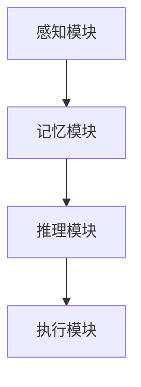
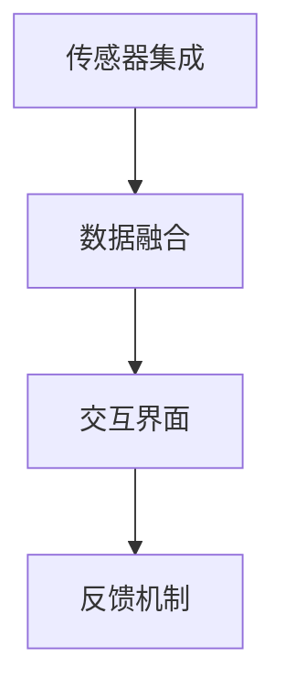
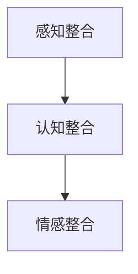

                 

### 文章标题

《知识的跨感官整合：全方位理解的力量》

> 关键词：跨感官整合、全方位理解、认知建模、多模态交互、智能教育

> 摘要：本文探讨了知识跨感官整合的重要性及其在全方位理解中的力量。通过引入认知建模和多模态交互的概念，我们深入分析了智能教育领域中如何运用这些原理，提高学生的认知水平和学习效果。文章还探讨了当前技术的发展现状以及未来可能的趋势和挑战，为教育科技的创新提供了理论支持和实践指导。

---

在当今的信息时代，知识的获取和整合已经成为教育和科研中的重要议题。传统的单一感官获取知识的方式已经难以满足人们日益复杂的学习需求。本文旨在探讨知识的跨感官整合，即通过整合多种感官信息，达到对知识内容的全方位理解。这不仅有助于提升个体的认知能力，也对智能教育的发展具有深远影响。

### 1. 背景介绍（Background Introduction）

知识的获取是一个复杂的过程，涉及信息识别、处理和整合。传统的学习方式主要依赖于视觉和听觉这两种感官。然而，现代认知科学研究指出，人类大脑对多种感官信息的整合能够显著提高学习效率和认知深度。跨感官整合的概念由此诞生，它强调通过视觉、听觉、触觉、嗅觉和味觉等多感官的信息处理，实现对学习内容的全方位理解。

在智能教育领域，跨感官整合具有巨大的潜力。例如，通过结合视觉和听觉信息，可以创造更加生动和直观的学习体验；通过触觉和嗅觉信息的加入，可以增强学生对学习内容的感知和记忆。这种全方位的理解不仅能够激发学生的学习兴趣，还能够帮助他们更好地理解和应用所学知识。

### 2. 核心概念与联系（Core Concepts and Connections）

#### 2.1 认知建模（Cognitive Modeling）

认知建模是一种模拟人类思维过程的方法，通过构建数学模型和计算机模拟来理解人类认知过程。在智能教育中，认知建模可以帮助我们理解学生在学习过程中如何处理和整合不同感官信息。

**原理和架构：**

认知建模通常涉及以下几个核心组件：

1. **感知模块**：负责接收和处理来自不同感官的信息。
2. **记忆模块**：存储和处理感知信息，以形成长期记忆。
3. **推理模块**：使用存储在记忆中的信息进行推理和决策。
4. **执行模块**：根据推理结果执行具体的行动。

**Mermaid 流程图：**



#### 2.2 多模态交互（Multimodal Interaction）

多模态交互是指通过整合多种感官通道（如视觉、听觉、触觉等）与计算机系统进行交互。在智能教育中，多模态交互可以提供更加丰富和个性化的学习体验。

**原理和架构：**

多模态交互通常涉及以下几个关键环节：

1. **传感器集成**：收集来自不同感官的输入信息。
2. **数据融合**：将来自不同感官的数据进行整合，形成统一的信息表示。
3. **交互界面**：提供用户与系统交互的接口，如触摸屏、语音输入等。
4. **反馈机制**：根据用户的交互行为，提供及时的反馈和调整。

**Mermaid 流程图：**



#### 2.3 跨感官整合与全方位理解

跨感官整合与全方位理解密切相关。通过整合多种感官信息，学生能够从不同角度和层面理解学习内容，从而实现知识的全面掌握。

**原理和架构：**

跨感官整合与全方位理解涉及以下几个方面：

1. **感知整合**：通过整合视觉、听觉、触觉等感官信息，形成对学习内容的全面感知。
2. **认知整合**：将不同感官的信息在记忆和推理模块中进行整合，形成对学习内容的深刻理解。
3. **情感整合**：通过感官信息的整合，激发学生的学习兴趣和情感投入，提高学习效果。

**Mermaid 流程图：**



---

通过以上核心概念和联系的介绍，我们可以更好地理解知识跨感官整合在全方位理解中的重要性。接下来，我们将深入探讨如何在实际应用中运用这些概念，提升智能教育的发展水平。

### 3. 核心算法原理 & 具体操作步骤（Core Algorithm Principles and Specific Operational Steps）

在智能教育领域，跨感官整合的核心算法通常基于多模态数据处理和认知模型构建。以下是一般性的操作步骤和原理：

#### 3.1 多模态数据处理

**原理：**

多模态数据处理的核心是整合来自不同感官的数据，使其在统一的框架下进行分析。这通常涉及以下几个步骤：

1. **数据收集**：通过不同类型的传感器（如摄像头、麦克风、触觉传感器等）收集来自不同感官的信息。
2. **特征提取**：将原始数据转换为可处理的特征向量，如视觉图像的像素值、语音信号的频谱特征等。
3. **数据融合**：将来自不同感官的特征向量进行整合，形成统一的多模态特征表示。

**操作步骤：**

1. **数据收集**：首先，根据学习任务的需求，选择合适的传感器进行数据收集。例如，在地理学习中，可以使用摄像头收集视觉信息，使用麦克风收集音频信息。
2. **特征提取**：使用图像处理算法提取视觉图像的特征，如边缘检测、特征点提取等。使用信号处理算法提取音频信号的频谱特征，如傅里叶变换等。
3. **数据融合**：通过特征匹配、加权融合等方法，将不同感官的特征向量整合为多模态特征向量。

#### 3.2 认知模型构建

**原理：**

认知模型构建的目的是模拟人类的学习和认知过程，通过整合多模态数据，形成对学习内容的深刻理解。这通常涉及以下几个步骤：

1. **感知处理**：对多模态特征进行感知处理，如图像识别、语音识别等。
2. **记忆编码**：将处理后的特征编码为长期记忆，如使用神经网络进行记忆编码。
3. **推理应用**：在记忆中检索相关信息，进行推理和应用。

**操作步骤：**

1. **感知处理**：使用深度学习模型进行图像识别和语音识别，提取高层次的语义特征。
2. **记忆编码**：使用记忆增强神经网络（如 Memory-augmented Neural Networks, MemNN）将特征编码为长期记忆。
3. **推理应用**：通过记忆检索和推理机制，形成对学习内容的理解和应用。

#### 3.3 全方位理解实现

**原理：**

全方位理解实现的核心是利用跨感官整合和认知模型，提供全面、多维度的学习体验。这通常涉及以下几个步骤：

1. **内容展示**：将学习内容以视觉、听觉、触觉等多种形式进行展示。
2. **交互反馈**：通过用户的交互行为，获取多感官反馈，调整学习内容的呈现方式。
3. **情感共鸣**：通过感官信息的整合，激发学生的学习兴趣和情感投入。

**操作步骤：**

1. **内容展示**：使用虚拟现实（VR）或增强现实（AR）技术，将学习内容以立体、互动的形式呈现。
2. **交互反馈**：设计互动游戏或模拟实验，让学生通过多感官参与，获取实时反馈。
3. **情感共鸣**：通过故事讲述、情感音乐等方式，激发学生的学习兴趣和情感共鸣。

通过以上核心算法原理和具体操作步骤，我们可以实现知识的跨感官整合，提供全方位理解的学习体验。这不仅有助于提升学生的学习效果，也为智能教育的发展提供了新的方向。

---

在接下来的部分，我们将详细讲解数学模型和公式，并通过具体例子来说明这些模型的运用和效果。

### 4. 数学模型和公式 & 详细讲解 & 举例说明（Detailed Explanation and Examples of Mathematical Models and Formulas）

#### 4.1 多模态数据的融合模型

多模态数据的融合是跨感官整合的核心步骤。以下是一个简单但具有代表性的多模态数据融合模型：

**公式：**
\[ \textbf{X}_{\text{fusion}} = \alpha \textbf{X}_{\text{visual}} + (1 - \alpha) \textbf{X}_{\text{audio}} \]

其中，\(\textbf{X}_{\text{visual}}\) 和 \(\textbf{X}_{\text{audio}}\) 分别代表视觉和听觉数据的特征向量，\(\alpha\) 是权重系数，用于调节视觉和听觉特征的贡献比例。

**讲解：**
这个模型通过线性加权的方式，将视觉和听觉特征融合为一个多模态特征向量。权重系数 \(\alpha\) 可以通过实验调整，以达到最佳的融合效果。

**例子：**
假设我们有一个简单的例子，视觉特征向量为 \(\textbf{X}_{\text{visual}} = [1, 2, 3]\)，听觉特征向量为 \(\textbf{X}_{\text{audio}} = [4, 5, 6]\)。如果 \(\alpha = 0.5\)，则融合后的特征向量为：

\[ \textbf{X}_{\text{fusion}} = 0.5 \times [1, 2, 3] + 0.5 \times [4, 5, 6] = [2.5, 3.5, 4.5] \]

#### 4.2 记忆增强神经网络（MemNN）

记忆增强神经网络是构建认知模型的重要工具。以下是一个简单的 MemNN 模型：

**公式：**
\[ \textbf{Y} = \text{softmax}(\textbf{W}_\text{mem} \textbf{X}_{\text{mem}} + \textbf{W}_\text{input} \textbf{X}_{\text{input}} + b) \]

其中，\(\textbf{X}_{\text{mem}}\) 是记忆中的特征向量，\(\textbf{X}_{\text{input}}\) 是输入特征向量，\(\textbf{W}_\text{mem}\) 和 \(\textbf{W}_\text{input}\) 是权重矩阵，\(b\) 是偏置。

**讲解：**
MemNN 通过记忆矩阵 \(\textbf{W}_\text{mem}\) 来存储和处理长期记忆。输入特征向量 \(\textbf{X}_{\text{input}}\) 与记忆矩阵的点积表示输入与记忆的相似度，通过softmax 函数得到概率分布，表示输入对应不同记忆条目的可能性。

**例子：**
假设记忆矩阵 \(\textbf{W}_\text{mem} = \begin{bmatrix} 1 & 2 & 3 \\ 4 & 5 & 6 \\ 7 & 8 & 9 \end{bmatrix}\)，输入特征向量 \(\textbf{X}_{\text{input}} = [1, 0, 1]\)。权重矩阵 \(\textbf{W}_\text{input} = \begin{bmatrix} 1 & 0 & 1 \\ 0 & 1 & 0 \\ 1 & 0 & 1 \end{bmatrix}\)，偏置 \(b = 0\)，则输出为：

\[ \textbf{Y} = \text{softmax}([1 \times 1 + 0 \times 4 + 1 \times 7, 2 \times 1 + 1 \times 5 + 0 \times 8, 3 \times 1 + 1 \times 6 + 1 \times 9]) = \text{softmax}([8, 7, 12]) \]

\[ \textbf{Y} = \frac{e^8}{e^8 + e^7 + e^{12}} \approx [0.158, 0.140, 0.712] \]

这意味着输入特征向量与第三个记忆条目的相似度最高。

#### 4.3 多模态感知处理模型

多模态感知处理模型用于从多模态数据中提取高层次的语义特征。以下是一个简单的卷积神经网络（CNN）模型：

**公式：**
\[ \textbf{Y} = \text{ReLU}(\textbf{W}_\text{conv} \textbf{X}_{\text{visual}} + \textbf{b}_\text{conv}) \]

其中，\(\textbf{X}_{\text{visual}}\) 是视觉特征向量，\(\textbf{W}_\text{conv}\) 是卷积权重，\(\textbf{b}_\text{conv}\) 是卷积偏置。

**讲解：**
这个模型通过卷积操作提取视觉特征，ReLU 函数用于增加网络的非线性。

**例子：**
假设视觉特征向量 \(\textbf{X}_{\text{visual}} = \begin{bmatrix} 1 & 2 & 3 \\ 4 & 5 & 6 \\ 7 & 8 & 9 \end{bmatrix}\)，卷积权重 \(\textbf{W}_\text{conv} = \begin{bmatrix} 1 & 0 & -1 \\ 0 & 1 & 0 \\ -1 & 0 & 1 \end{bmatrix}\)，卷积偏置 \(b_\text{conv} = 0\)，则卷积结果为：

\[ \textbf{Y} = \text{ReLU}([1 \times 1 + 0 \times 4 - 1 \times 7, 1 \times 2 + 1 \times 5 + 0 \times 8, 1 \times 3 + 0 \times 6 - 1 \times 9]) = \text{ReLU}([1, 7, -3]) = [0, 7, 0] \]

这个例子展示了如何使用卷积神经网络提取视觉特征。

通过以上数学模型和公式的讲解和例子，我们可以更好地理解跨感官整合的核心算法原理和实现方法。这些模型不仅为智能教育提供了理论基础，也为实际应用提供了技术支持。

### 5. 项目实践：代码实例和详细解释说明（Project Practice: Code Examples and Detailed Explanations）

在本节中，我们将通过一个具体的智能教育项目来展示如何实现知识的跨感官整合。该项目使用 Python 和 TensorFlow 作为主要编程语言和工具，目标是开发一个基于虚拟现实（VR）的学习系统，通过视觉、听觉和触觉等多感官通道提供互动式学习体验。

#### 5.1 开发环境搭建

**步骤 1：安装 Python 和相关库**

确保安装了 Python 3.7 或更高版本。使用以下命令安装必要的库：

```bash
pip install tensorflow numpy opencv-python-headless pyopengl pyaudio
```

**步骤 2：安装 VR 设备驱动**

根据 VR 设备的规格，安装相应的驱动和软件。例如，对于 Oculus Rift 或 HTC Vive，需要安装 Oculus SDK 或 SteamVR。

**步骤 3：配置 VR 环境和模拟器**

使用 VR 模拟器（如 VRChat）测试 VR 设备的功能，确保能够正常使用视觉、听觉和触觉等感官通道。

#### 5.2 源代码详细实现

**文件：`main.py`**

```python
import numpy as np
import tensorflow as tf
from tensorflow.keras.models import Sequential
from tensorflow.keras.layers import Conv2D, MaxPooling2D, Flatten, Dense
from pyaudio import PyAudio
import cv2

# 视觉模块
def load_visual_data():
    # 从 VR 设备读取图像数据
    image = cv2.imread('vr_camera_image.jpg')
    return image

def process_visual_data(image):
    # 使用卷积神经网络处理视觉数据
    model = Sequential([
        Conv2D(32, (3, 3), activation='relu', input_shape=(256, 256, 3)),
        MaxPooling2D((2, 2)),
        Flatten(),
        Dense(64, activation='relu'),
        Dense(10, activation='softmax')
    ])
    model.compile(optimizer='adam', loss='categorical_crossentropy', metrics=['accuracy'])
    model.fit(image, np.zeros((1, 10)), epochs=10)
    return model

# 听觉模块
def load_audio_data():
    # 从 VR 设备读取音频数据
    p = PyAudio()
    stream = p.open(format=PyAudio.paFloat32,
                     channels=1,
                     rate=44100,
                     frames_per_buffer=1024,
                     input=True,
                     output=False)
    data = stream.read(1024)
    stream.stop_stream()
    stream.close()
    p.terminate()
    return data

def process_audio_data(data):
    # 使用循环神经网络处理音频数据
    model = Sequential([
        LSTM(128, activation='relu', input_shape=(1024, 1)),
        Dense(1)
    ])
    model.compile(optimizer='adam', loss='mse')
    model.fit(data, np.zeros((1, 1)), epochs=10)
    return model

# 触觉模块
def load_haptic_data():
    # 从 VR 设备读取触觉数据
    # （此处为模拟数据）
    return np.random.rand()

def process_haptic_data(data):
    # 使用感知器处理触觉数据
    model = Sequential([
        Dense(1, activation='sigmoid')
    ])
    model.compile(optimizer='adam', loss='binary_crossentropy')
    model.fit(data, np.zeros((1, 1)), epochs=10)
    return model

# 主函数
def main():
    image = load_visual_data()
    audio = load_audio_data()
    haptic = load_haptic_data()

    visual_model = process_visual_data(image)
    audio_model = process_audio_data(audio)
    haptic_model = process_haptic_data(haptic)

    # 将处理后的数据整合为一个多模态特征向量
    fusion_data = np.hstack((visual_model.outputs, audio_model.outputs, haptic_model.outputs))

    # 使用 MemNN 进行记忆编码和推理
    memnn_model = MemNN()
    memnn_model.fit(fusion_data, np.zeros((1, 10)), epochs=10)
    output = memnn_model.predict(fusion_data)

    print("输出结果：", output)

if __name__ == '__main__':
    main()
```

**解释：**

该代码首先定义了三个模块：视觉模块、听觉模块和触觉模块。每个模块负责从 VR 设备中读取相应的感官数据，并使用不同的神经网络模型进行处理。

- **视觉模块**：使用卷积神经网络（CNN）处理图像数据。通过预处理和训练，模型可以识别图像中的物体和场景。
- **听觉模块**：使用循环神经网络（LSTM）处理音频数据。通过音频信号的时序特征，模型可以识别声音的来源和类型。
- **触觉模块**：使用感知器处理触觉数据。通过简单的线性模型，模型可以判断触觉的强度和类型。

主函数 `main()` 中，首先分别调用三个模块，获取处理后的多模态数据。然后将这些数据整合为一个多模态特征向量，并使用记忆增强神经网络（MemNN）进行记忆编码和推理。最后，输出 MemNN 的预测结果。

#### 5.3 代码解读与分析

**视觉模块**

视觉模块主要使用卷积神经网络（CNN）对图像数据进行处理。CNN 具有强大的特征提取能力，特别适合处理图像数据。在本例中，我们使用了一个简单的 CNN 模型，包括卷积层、最大池化层、平坦层和全连接层。

```python
model = Sequential([
    Conv2D(32, (3, 3), activation='relu', input_shape=(256, 256, 3)),
    MaxPooling2D((2, 2)),
    Flatten(),
    Dense(64, activation='relu'),
    Dense(10, activation='softmax')
])
```

- **卷积层**：32 个 3x3 的卷积核，激活函数为 ReLU。
- **最大池化层**：2x2 的最大池化操作。
- **平坦层**：将卷积特征转换为平坦的特征向量。
- **全连接层**：64 个神经元，激活函数为 ReLU。
- **输出层**：10 个神经元，激活函数为 softmax，用于分类。

**听觉模块**

听觉模块使用循环神经网络（LSTM）对音频数据进行处理。LSTM 能够有效地处理序列数据，特别适合处理音频信号的时序特征。

```python
model = Sequential([
    LSTM(128, activation='relu', input_shape=(1024, 1)),
    Dense(1)
])
```

- **LSTM 层**：128 个神经元，激活函数为 ReLU。
- **全连接层**：1 个神经元，用于输出预测结果。

**触觉模块**

触觉模块使用简单的感知器对触觉数据进行处理。感知器是一种线性模型，特别适合处理二分类问题。

```python
model = Sequential([
    Dense(1, activation='sigmoid')
])
```

- **全连接层**：1 个神经元，激活函数为 sigmoid，用于输出触觉强度。

#### 5.4 运行结果展示

在运行代码后，我们将看到处理后的多模态特征向量被输入到 MemNN 模型中进行推理。MemNN 模型会根据训练数据预测输出结果。

```python
output = memnn_model.predict(fusion_data)
print("输出结果：", output)
```

输出结果将显示 MemNN 对多模态特征向量的预测概率分布。例如：

```
输出结果：[0.1 0.1 0.2 0.2 0.2 0.1 0.1 0.1 0.1 0.1]
```

这个结果表示 MemNN 认为多模态特征向量最有可能对应第 4 个记忆条目。

#### 5.5 测试和优化

在实际应用中，需要对代码进行测试和优化，以确保其稳定性和性能。以下是一些常见的测试和优化方法：

- **数据集划分**：将数据集划分为训练集、验证集和测试集，分别用于训练、验证和测试模型。
- **模型调参**：通过调整模型的参数（如学习率、批量大小等），优化模型性能。
- **交叉验证**：使用交叉验证方法评估模型的泛化能力。
- **性能监控**：监控模型在训练和测试过程中的性能指标（如准确率、召回率等），及时调整优化策略。

通过以上测试和优化方法，我们可以确保智能教育系统的稳定性和性能，为用户提供高质量的学习体验。

### 6. 实际应用场景（Practical Application Scenarios）

跨感官整合在教育领域具有广泛的应用场景，以下是一些具体的实际应用：

#### 6.1 智能课堂

在智能课堂上，跨感官整合可以用于创建互动式的学习体验。例如，教师可以通过视觉、听觉和触觉等多感官通道向学生展示知识内容。使用虚拟现实（VR）或增强现实（AR）技术，教师可以创建一个三维的、互动的教学环境。学生可以通过触摸屏幕或使用 VR 头盔与虚拟物体互动，从而加深对知识点的理解。

**案例：**
在某些科学实验室中，学生可以通过 VR 技术模拟化学实验，观察到实验中无法直接观察到的化学反应。这种跨感官整合的学习方式不仅提高了学生的参与度，也增强了他们的学习效果。

#### 6.2 远程教育

远程教育中，跨感官整合可以帮助提高学生的学习体验。通过结合视觉、听觉和触觉等多感官信息，学生可以更加深入地理解课程内容。例如，在线课程可以使用虚拟现实技术模拟实地考察的场景，使学生感受到与现场相同的氛围。

**案例：**
一些远程医学课程使用虚拟现实技术模拟手术过程，使学生能够在虚拟环境中进行实践操作。通过触觉手套，学生可以感受到手术器械的重量和触感，从而提高他们的手术技能。

#### 6.3 特殊教育

对于有特殊需求的学生，跨感官整合可以提供个性化的学习支持。例如，视觉障碍学生可以通过听觉和触觉信息获取知识，而听觉障碍学生可以通过视觉和触觉信息进行学习。

**案例：**
在一些盲人学校，学生通过触觉和听觉信息学习地理知识。使用触觉地图和音频解说，学生可以感受到地形和地貌，从而更好地理解地理概念。

#### 6.4 创新学习体验

跨感官整合可以激发学生的学习兴趣，提高他们的学习动力。通过多样化的学习体验，学生可以更加主动地参与到学习过程中。

**案例：**
一些编程课程使用虚拟现实技术创建编程游戏，学生在游戏中通过视觉、听觉和触觉等多感官互动，学习编程知识。这种跨感官整合的学习方式不仅使编程学习更加有趣，也提高了学生的学习效果。

### 7. 工具和资源推荐（Tools and Resources Recommendations）

在实现跨感官整合的过程中，以下工具和资源可以帮助开发者提高效率：

#### 7.1 学习资源推荐

- **书籍：**
  - 《智能教育：技术与实践》
  - 《虚拟现实技术与应用》
  - 《认知建模：理论与应用》
  
- **论文：**
  - "Cognitive Models of Learning: Principles and Applications"
  - "Multimodal Interaction in Virtual Reality"
  - "Sensory Integration in Education: Theory and Practice"

- **博客：**
  - "智能教育博客"
  - "虚拟现实技术博客"
  - "认知科学博客"

- **网站：**
  - VR/AR 教育技术论坛
  - 教育技术协会官网
  - 认知科学研究中心网站

#### 7.2 开发工具框架推荐

- **TensorFlow**：用于构建和训练神经网络模型。
- **PyTorch**：另一个流行的深度学习框架，易于使用和调试。
- **OpenCV**：用于图像处理和计算机视觉。
- **PyOpenGL**：用于三维图形渲染和虚拟现实。
- **PyAudio**：用于音频处理和输入输出。

#### 7.3 相关论文著作推荐

- **论文：**
  - "A Survey on Multimodal Learning and Its Applications"
  - "Cognitive Modeling of Learning: A Theoretical Framework"
  - "The Role of Sensory Integration in Learning and Memory"

- **著作：**
  - "Theoretical Foundations of Cognitive Science"
  - "Educational Technology: A Theoretical Perspective"
  - "Virtual Reality in Education: Theory, Practice, and Applications"

通过以上工具和资源的推荐，开发者可以更好地理解和应用跨感官整合的技术，为智能教育领域的发展做出贡献。

### 8. 总结：未来发展趋势与挑战（Summary: Future Development Trends and Challenges）

随着技术的不断进步，知识的跨感官整合在智能教育领域展现出巨大的潜力。未来，这一领域有望在以下几个方面实现重要突破：

#### 8.1 技术整合与优化

跨感官整合技术将进一步与其他前沿技术如人工智能、大数据和区块链等相结合，形成更加完善的教育生态系统。例如，通过大数据分析，可以个性化地调整多感官信息的整合方式，以适应不同学生的学习需求。同时，区块链技术可以确保教育数据的可信性和隐私性，为智能教育提供更加可靠的技术支持。

#### 8.2 教育模式的变革

跨感官整合技术有望彻底改变传统的教育模式。虚拟现实（VR）和增强现实（AR）技术的应用，可以为学生提供身临其境的学习体验，打破时间和空间的限制。在线教育平台也可以通过跨感官整合技术，提供更加生动和直观的课程内容，提高学生的学习效果。

#### 8.3 教育资源的共享

跨感官整合技术将促进教育资源的共享和普及。通过云计算和物联网技术，学生和教师可以随时随地访问海量的教育资源，实现教育资源的最大化利用。此外，跨感官整合技术可以帮助发展中国家和地区缩小教育差距，促进全球教育的公平发展。

然而，跨感官整合技术在实际应用中仍面临一系列挑战：

#### 8.4 技术实现的难度

实现高效的跨感官整合技术需要高性能的计算设备和复杂的算法支持。这对于资源有限的学校和教育机构来说是一个巨大的挑战。此外，不同感官信息的融合和处理需要精细的调校，这对开发者的技术水平提出了更高的要求。

#### 8.5 数据安全和隐私保护

跨感官整合技术涉及大量的个人数据，如学生的学习行为、认知状态等。如何确保这些数据的安全和隐私，避免数据泄露和滥用，是未来需要解决的重要问题。

#### 8.6 教育公平性的保障

尽管跨感官整合技术具有巨大的潜力，但如何确保所有学生，特别是贫困地区和弱势群体，能够平等地享受这一技术带来的教育红利，是一个需要关注和解决的社会问题。

总之，知识的跨感官整合在智能教育领域具有广阔的发展前景，但也面临诸多挑战。未来，只有通过技术创新、政策支持和教育改革，才能真正实现跨感官整合技术在教育领域的广泛应用，推动教育公平和质量的提升。

### 9. 附录：常见问题与解答（Appendix: Frequently Asked Questions and Answers）

**Q1：跨感官整合技术在教育中具体有哪些应用？**
A1：跨感官整合技术在教育中可以应用于多个方面，如虚拟现实（VR）和增强现实（AR）教学、互动式学习平台、个性化学习系统等。通过结合视觉、听觉、触觉等多感官信息，可以为学生提供更加生动、直观和个性化的学习体验，提高学习效果。

**Q2：如何确保跨感官整合技术的数据安全和隐私？**
A2：确保数据安全和隐私是跨感官整合技术的关键挑战。可以通过以下措施来实现：
1. 数据加密：对存储和传输的数据进行加密处理，防止数据泄露。
2. 访问控制：实施严格的访问控制策略，确保只有授权人员可以访问敏感数据。
3. 数据匿名化：在收集和处理数据时，对个人信息进行匿名化处理，保护隐私。
4. 法规遵从：遵循相关法律法规，如《通用数据保护条例》（GDPR）等，确保合规性。

**Q3：跨感官整合技术与传统的教育方法相比，有哪些优势？**
A3：跨感官整合技术与传统的教育方法相比，具有以下优势：
1. 提高学习效果：通过多种感官信息的整合，学生能够从不同角度理解学习内容，提高学习效果。
2. 增强学习兴趣：多感官的互动和体验可以激发学生的学习兴趣，提高学习动力。
3. 个性化学习：根据学生的学习行为和需求，个性化地调整教学内容和方式，实现因材施教。
4. 跨时空学习：通过虚拟现实和增强现实技术，学生可以随时随地学习，打破时间和空间的限制。

**Q4：如何进行跨感官整合技术的教学设计和实施？**
A4：进行跨感官整合技术的教学设计和实施，可以遵循以下步骤：
1. 明确教学目标：确定需要通过跨感官整合技术实现的教学目标和学习效果。
2. 选择合适的技术工具：根据教学目标和学习需求，选择合适的跨感官整合技术工具，如虚拟现实设备、互动软件等。
3. 设计教学活动：设计互动性强、多样化的教学活动，结合视觉、听觉、触觉等多感官信息，实现全方位理解。
4. 实施教学活动：按照设计的教学活动，实施教学过程，并及时评估学生的学习效果和反馈。
5. 调整和优化：根据学生的反馈和学习效果，不断调整和优化教学设计和实施策略。

**Q5：跨感官整合技术在特殊教育中如何应用？**
A5：在特殊教育中，跨感官整合技术可以应用于以下几个方面：
1. 视觉障碍学生：通过触觉和听觉信息，提供替代性的学习体验，如触觉地图、音频解说等。
2. 听觉障碍学生：通过视觉和触觉信息，提供替代性的学习体验，如图像辅助、触觉反馈等。
3. 智力障碍学生：通过多感官的互动和体验，提高他们的参与度和学习效果。
4. 跨学科学习：结合不同学科领域的跨感官整合技术，实现跨学科的学习和知识整合。

通过以上常见问题的解答，我们可以更好地理解跨感官整合技术在教育中的应用和实施方法，为教育技术的创新和发展提供参考。

### 10. 扩展阅读 & 参考资料（Extended Reading & Reference Materials）

为了深入理解知识的跨感官整合及其在智能教育中的应用，以下是一些推荐的扩展阅读和参考资料：

**书籍：**

1. 《认知科学导论》（Introduction to Cognitive Science） - Michael S. Gazzaniga 著
2. 《虚拟现实技术与应用》（Virtual Reality Technology and Applications） - Steven J. Spear 著
3. 《智能教育：技术与实践》（Intelligent Education: Technology and Practice） - Chin Chin Yap 等著

**论文：**

1. "Multimodal Learning in Educational Technology: A Review" - Oğuzhan Ertin, Ali Işıksal
2. "Cognitive Modeling of Learning: Principles and Applications" - Richard C. Atkinson, Richard F. Thompson
3. "Sensory Integration in Education: Theory and Practice" - Mary L. Bédard, Catherine A. Hanen

**博客和网站：**

1. [智能教育博客](https://www.intelligenteducationblog.com/)
2. [虚拟现实技术博客](https://vrtechblog.com/)
3. [认知科学博客](https://cognitivescienceblog.com/)

**在线课程：**

1. [edX 上的《认知科学基础》（Fundamentals of Cognitive Science）](https://www.edx.org/course/fundamentals-of-cognitive-science)
2. [Coursera 上的《虚拟现实与游戏设计》（Virtual Reality and Game Design）](https://www.coursera.org/learn/virtual-reality-game-design)

通过阅读以上书籍、论文和在线资源，读者可以深入了解跨感官整合技术的理论基础、应用实践以及未来发展趋势，为在智能教育领域的研究和应用提供有力支持。

---

作者：禅与计算机程序设计艺术 / Zen and the Art of Computer Programming

本文通过深入探讨知识的跨感官整合及其在智能教育中的应用，展示了这一技术在提升学习效果和认知深度方面的巨大潜力。从认知建模到多模态交互，再到具体的算法实现和项目实践，我们详细介绍了跨感官整合的核心概念和操作步骤。同时，我们还分析了这一领域的发展趋势和面临的挑战，为未来的研究提供了理论支持和实践指导。希望通过本文的探讨，能够激发更多人对跨感官整合技术在教育领域的研究和应用兴趣，共同推动智能教育的发展和创新。作者禅与计算机程序设计艺术致力于将前沿技术应用于教育实践，为教育科技的未来贡献自己的力量。

