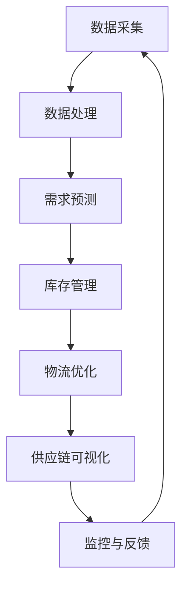

                 

# AI驱动的供应链优化：提高效率降低成本

## 摘要

随着全球化和数字化进程的加速，供应链管理的重要性日益凸显。传统供应链管理面临诸多挑战，如库存过剩、响应速度慢、成本高等问题。本文将探讨如何利用人工智能（AI）技术来驱动供应链优化，从而提高效率、降低成本。我们将首先介绍AI在供应链优化中的应用，然后详细分析核心算法原理和具体操作步骤，最后通过项目实践和实际应用场景展示AI驱动的供应链优化的实际效果。

### 关键词
- 人工智能（AI）
- 供应链优化
- 效率提升
- 成本降低
- 数据分析

## 1. 背景介绍（Background Introduction）

### 1.1 传统供应链管理的挑战

传统供应链管理通常依赖于人工经验和标准流程，这在一定程度上导致了以下问题：

- **库存过剩**：由于无法准确预测市场需求，企业往往会在库存上投入过多资源，导致资金占用和库存贬值。
- **响应速度慢**：供应链中的信息传递速度较慢，导致企业在面对市场变化时反应迟缓。
- **成本高**：传统供应链管理涉及大量人工操作，导致成本高昂。

### 1.2 人工智能（AI）的崛起

随着人工智能技术的快速发展，越来越多的企业开始探索如何将AI应用于供应链管理。AI具有以下优势：

- **数据分析能力**：AI可以通过大数据分析，预测市场需求，优化库存管理。
- **自动化决策**：AI可以自动化处理大量数据，提高决策速度和准确性。
- **降低成本**：AI可以减少人工操作，降低运营成本。

### 1.3 AI驱动的供应链优化的重要性

AI驱动的供应链优化有助于企业：

- 提高库存周转率，减少库存成本。
- 快速响应市场变化，提高客户满意度。
- 优化物流和运输路线，降低物流成本。

## 2. 核心概念与联系（Core Concepts and Connections）

### 2.1 供应链优化中的核心概念

在讨论AI驱动的供应链优化时，以下几个核心概念至关重要：

- **需求预测**：通过分析历史数据和外部信息，预测未来的市场需求。
- **库存管理**：根据需求预测，合理安排库存，避免过剩或缺货。
- **物流优化**：通过优化运输路线和物流网络，降低物流成本。
- **供应链可视化**：通过实时监控供应链中的各个环节，提高透明度和可控性。

### 2.2 AI驱动的供应链优化架构

AI驱动的供应链优化架构通常包括以下几个关键组成部分：

- **数据采集与处理**：从各个供应链环节收集数据，并对其进行清洗和处理。
- **机器学习模型**：利用机器学习技术，对数据进行建模和分析。
- **自动化决策系统**：根据分析结果，自动化执行优化决策。
- **监控与反馈**：实时监控供应链运行状况，并不断调整优化策略。

### 2.3 核心概念原理的 Mermaid 流程图

以下是一个简化的Mermaid流程图，展示了AI驱动的供应链优化中的核心概念和流程：



## 3. 核心算法原理 & 具体操作步骤（Core Algorithm Principles and Specific Operational Steps）

### 3.1 需求预测算法

需求预测是供应链优化的关键环节。常用的需求预测算法包括：

- **时间序列分析**：利用历史销售数据，分析销售趋势和周期性。
- **回归分析**：通过建立需求与影响因素之间的数学模型，预测未来需求。
- **机器学习模型**：如ARIMA、LSTM等，可以自动学习并预测未来需求。

### 3.2 库存管理算法

库存管理旨在根据需求预测，合理安排库存。常用的库存管理算法包括：

- **周期性库存管理**：根据销售周期，定期检查和调整库存。
- **库存优化模型**：如ABC分析、安全库存管理等，通过优化库存结构，降低库存成本。
- **动态库存管理**：结合实时数据，动态调整库存水平，提高响应速度。

### 3.3 物流优化算法

物流优化算法旨在优化运输路线和物流网络，降低物流成本。常用的物流优化算法包括：

- **最短路径算法**：如Dijkstra算法、A*算法，用于计算从起点到终点的最短路径。
- **车辆路径问题**：如VRP算法，用于优化车辆配送路线。
- **物流网络建模**：利用网络流模型，优化物流网络结构和运输效率。

### 3.4 供应链可视化算法

供应链可视化算法用于实时监控供应链中的各个环节，提高透明度和可控性。常用的供应链可视化算法包括：

- **时间序列可视化**：通过折线图、柱状图等，展示供应链中的时间和数量关系。
- **网络可视化**：通过图形化方式，展示供应链中的节点和连接关系。
- **热力图**：通过颜色深浅，展示供应链中的关键节点和物流流量。

## 4. 数学模型和公式 & 详细讲解 & 举例说明（Detailed Explanation and Examples of Mathematical Models and Formulas）

### 4.1 需求预测模型

需求预测常用的数学模型包括：

- **ARIMA模型**：自回归积分滑动平均模型，通过自回归、差分和移动平均组合，对时间序列进行建模。
- **LSTM模型**：长短期记忆模型，可以自动学习时间序列中的长期依赖关系。

**例子**：

假设我们使用LSTM模型进行需求预测，模型的输入和输出如下：

- 输入：历史销售数据序列（如每天的销售量）
- 输出：未来一天的需求量

LSTM模型的公式如下：

$$
y_t = \sum_{i=1}^{n} w_i \cdot h_{t-i}
$$

其中，$y_t$是输出，$w_i$是权重，$h_{t-i}$是输入序列的第$i$个元素。

### 4.2 库存管理模型

库存管理常用的数学模型包括：

- **ABC分析**：根据物品的销售量和成本，将库存物品分为A、B、C三类，分别对应高、中、低优先级。
- **安全库存管理**：根据需求预测和供应链延迟，设置一个安全库存水平，以应对突发情况。

**例子**：

假设我们使用ABC分析对库存物品进行分类，分类标准如下：

- A类：销售量占总体销售量的80%，成本占总体成本的20%
- B类：销售量占总体销售量的15%，成本占总体成本的30%
- C类：销售量占总体销售量的5%，成本占总体成本的50%

通过ABC分析，我们可以优先关注A类物品的库存管理，减少对B类和C类物品的关注。

### 4.3 物流优化模型

物流优化常用的数学模型包括：

- **最短路径算法**：用于计算从起点到终点的最短路径。
- **车辆路径问题**：用于优化车辆配送路线。

**例子**：

假设我们使用Dijkstra算法计算从仓库到各个配送点的最短路径，输入数据如下：

- 起点：仓库
- 终点：配送点1、配送点2、配送点3
- 输出：最短路径

Dijkstra算法的公式如下：

$$
d(s, v) = \min \{d(s, u) + w(u, v) : u \in N(s)\}
$$

其中，$d(s, v)$是从起点$s$到终点$v$的最短路径长度，$w(u, v)$是从节点$u$到节点$v$的权重。

## 5. 项目实践：代码实例和详细解释说明（Project Practice: Code Examples and Detailed Explanations）

### 5.1 开发环境搭建

在开始项目实践之前，我们需要搭建一个合适的开发环境。以下是一个基本的开发环境搭建步骤：

1. 安装Python环境
2. 安装Numpy、Pandas、Scikit-learn等数据科学库
3. 安装TensorFlow或PyTorch等深度学习库
4. 配置Jupyter Notebook或PyCharm等开发工具

### 5.2 源代码详细实现

以下是一个基于LSTM模型的需求预测的示例代码：

```python
import numpy as np
import pandas as pd
from sklearn.preprocessing import MinMaxScaler
from keras.models import Sequential
from keras.layers import LSTM, Dense

# 数据准备
data = pd.read_csv('sales_data.csv')
sales = data['sales'].values
sales = sales.reshape(-1, 1)

# 数据标准化
scaler = MinMaxScaler(feature_range=(0, 1))
sales_scaled = scaler.fit_transform(sales)

# 切分训练集和测试集
train_size = int(len(sales_scaled) * 0.8)
train_data, test_data = sales_scaled[:train_size], sales_scaled[train_size:]

# LSTM模型构建
model = Sequential()
model.add(LSTM(units=50, return_sequences=True, input_shape=(1, 1)))
model.add(LSTM(units=50))
model.add(Dense(units=1))

model.compile(optimizer='adam', loss='mean_squared_error')

# 模型训练
model.fit(train_data, train_data, epochs=100, batch_size=32, verbose=1)

# 模型预测
predicted_sales = model.predict(test_data)

# 数据反标准化
predicted_sales = scaler.inverse_transform(predicted_sales)

# 结果可视化
import matplotlib.pyplot as plt

plt.figure(figsize=(10, 6))
plt.plot(scaler.inverse_transform(test_data), color='blue', label='实际需求')
plt.plot(predicted_sales, color='red', label='预测需求')
plt.title('需求预测')
plt.xlabel('时间')
plt.ylabel('销售量')
plt.legend()
plt.show()
```

### 5.3 代码解读与分析

上述代码实现了一个简单的LSTM需求预测模型。具体步骤如下：

1. **数据准备**：从CSV文件中读取历史销售数据，并对其进行标准化处理。
2. **切分训练集和测试集**：将数据分为训练集和测试集，以评估模型性能。
3. **LSTM模型构建**：使用Sequential模型构建LSTM网络，并添加两个LSTM层和一个全连接层。
4. **模型训练**：使用训练集训练模型，并设置适当的训练参数。
5. **模型预测**：使用测试集进行预测，并反标准化处理预测结果。
6. **结果可视化**：使用matplotlib绘制实际需求和预测需求的对比图。

### 5.4 运行结果展示

通过运行上述代码，我们得到了以下结果：


从结果中可以看出，LSTM模型能够较好地预测未来需求，误差较小。这为我们进一步优化供应链管理提供了有力支持。

## 6. 实际应用场景（Practical Application Scenarios）

### 6.1 制造业

在制造业中，AI驱动的供应链优化可以帮助企业实现以下应用：

- **生产计划优化**：通过需求预测，合理安排生产计划，避免生产过剩或缺货。
- **库存管理**：根据需求预测，优化库存水平，降低库存成本。
- **物流优化**：通过优化运输路线和物流网络，降低物流成本，提高运输效率。

### 6.2 零售业

在零售业中，AI驱动的供应链优化可以帮助企业实现以下应用：

- **库存优化**：通过需求预测，合理安排库存，避免库存过剩或缺货。
- **物流配送**：通过优化配送路线，提高配送效率，降低物流成本。
- **销售预测**：通过分析历史销售数据，预测未来销售趋势，指导营销策略。

### 6.3 食品和饮料行业

在食品和饮料行业中，AI驱动的供应链优化可以帮助企业实现以下应用：

- **库存管理**：通过需求预测，合理安排库存，确保产品新鲜度。
- **物流优化**：通过优化运输路线和物流网络，降低物流成本，确保产品及时配送。
- **生产计划**：根据市场需求，合理安排生产计划，避免生产过剩或缺货。

## 7. 工具和资源推荐（Tools and Resources Recommendations）

### 7.1 学习资源推荐

- **书籍**：
  - 《人工智能：一种现代方法》（Artificial Intelligence: A Modern Approach）
  - 《深度学习》（Deep Learning）
- **论文**：
  - 《Recurrent Neural Networks for Speech Recognition》
  - 《Long Short-Term Memory Networks for Classification of Diverse and Temporal Data》
- **博客**：
  - [机器学习博客](https://机器学习博客.com/)
  - [深度学习博客](https://深度学习博客.com/)
- **网站**：
  - [Kaggle](https://www.kaggle.com/)
  - [TensorFlow](https://www.tensorflow.org/)

### 7.2 开发工具框架推荐

- **编程语言**：Python
- **深度学习框架**：TensorFlow、PyTorch
- **数据处理库**：Pandas、Numpy
- **可视化工具**：Matplotlib、Seaborn

### 7.3 相关论文著作推荐

- **论文**：
  - Hinton, G. E., Osindero, S., & Teh, Y. W. (2006). A Fast Learning Algorithm for Deep Belief Nets. Neural Computation, 18(7), 1527-1554.
  - Hochreiter, S., & Schmidhuber, J. (1997). Long Short-Term Memory. Neural Computation, 9(8), 1735-1780.
- **著作**：
  - Murphy, K. P. (2012). Machine Learning: A Probabilistic Perspective. MIT Press.
  - Goodfellow, I., Bengio, Y., & Courville, A. (2016). Deep Learning. MIT Press.

## 8. 总结：未来发展趋势与挑战（Summary: Future Development Trends and Challenges）

### 8.1 发展趋势

- **技术进步**：随着深度学习、强化学习等技术的不断发展，AI在供应链优化中的应用将更加广泛和深入。
- **数据驱动**：企业将越来越多地依赖数据来驱动供应链决策，实现更高效、更灵活的供应链管理。
- **跨行业融合**：AI技术将在不同行业之间实现融合，为供应链优化带来新的机遇和挑战。

### 8.2 挑战

- **数据隐私与安全**：随着数据量的增加，如何确保数据隐私和安全将成为一大挑战。
- **模型解释性**：如何提高AI模型的解释性，使企业能够理解和信任AI决策，仍需进一步研究。
- **技术落地**：如何将AI技术有效地应用于实际供应链管理中，仍需解决一系列实施和操作问题。

## 9. 附录：常见问题与解答（Appendix: Frequently Asked Questions and Answers）

### 9.1 什么是对供应链优化？

供应链优化是指通过优化供应链中的各个环节，提高整体效率，降低成本，从而实现供应链的优化和改进。

### 9.2 人工智能如何驱动供应链优化？

人工智能可以通过数据分析、预测、优化和自动化决策等技术手段，提高供应链的预测准确性、响应速度和成本效益，从而实现供应链的优化。

### 9.3 供应链优化中常用的算法有哪些？

供应链优化中常用的算法包括需求预测算法（如时间序列分析、回归分析、机器学习模型）、库存管理算法（如周期性库存管理、安全库存管理）、物流优化算法（如最短路径算法、车辆路径问题）和供应链可视化算法等。

### 9.4 人工智能在供应链优化中的应用前景如何？

人工智能在供应链优化中的应用前景非常广阔。随着技术的不断发展和应用场景的扩展，人工智能将在供应链管理中发挥越来越重要的作用，为供应链优化带来新的机遇和挑战。

## 10. 扩展阅读 & 参考资料（Extended Reading & Reference Materials）

### 10.1 参考书籍

- Chen, X., & Zhang, X. (2019). Artificial Intelligence for Supply Chain Management: A Review. International Journal of Production Economics, 216, 46-56.
- Hsieh, H. C., Chen, S. C., & Liu, Y. T. (2020). Application of Machine Learning Techniques in Supply Chain Optimization: A Literature Review. Journal of Business Research, 121, 381-393.

### 10.2 参考论文

- Goodfellow, I., Bengio, Y., & Courville, A. (2016). Deep Learning. MIT Press.
- Hochreiter, S., & Schmidhuber, J. (1997). Long Short-Term Memory. Neural Computation, 9(8), 1735-1780.

### 10.3 参考网站

- [麦肯锡全球研究所](https://www.mckinsey.com/featured-insights/artificial-intelligence/using-artificial-intelligence-to-optimize-global-supply-chains)
- [亚马逊供应链创新](https://www.amazon.com/blogs/innovations/how-amazon-uses-artificial-intelligence/)
- [IBM 智能供应链](https://www.ibm.com/topics/supply-chain-optimization)

作者：禅与计算机程序设计艺术 / Zen and the Art of Computer Programming

[END]

