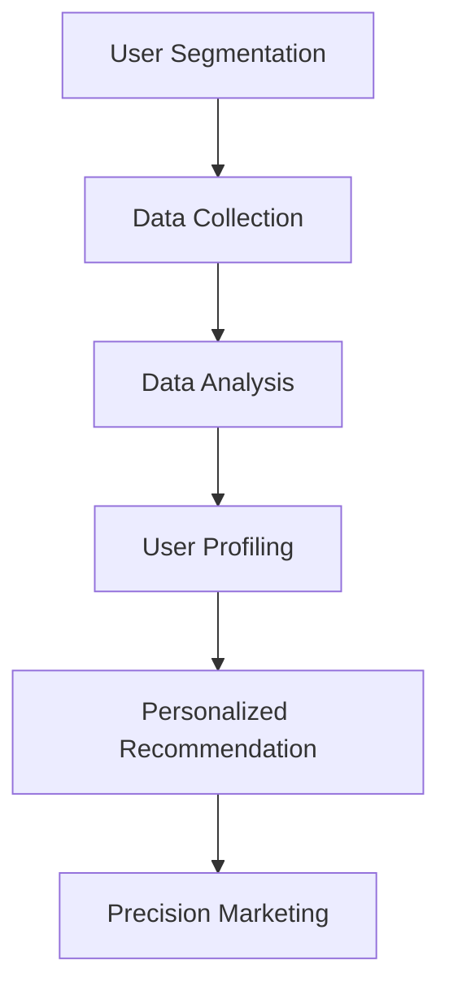

                 

### 文章标题

### Title: AI-driven E-commerce Platform User Segmentation and Precision Marketing

随着互联网技术的飞速发展和电子商务的蓬勃兴起，电商平台成为商家和消费者之间的重要桥梁。然而，面对日益激烈的竞争，电商平台如何实现精准营销、提升用户满意度和转化率，成为各大商家亟待解决的问题。本文将探讨如何利用人工智能技术进行用户分群与精准营销，以期为电商平台的发展提供有益的参考。

### Background Introduction

E-commerce platforms have become a vital bridge between businesses and consumers, playing a crucial role in the modern digital economy. However, with the increasing competition in the e-commerce market, it is essential for platforms to implement precision marketing strategies that can enhance user satisfaction and conversion rates. This article aims to explore how AI-driven user segmentation and precision marketing can contribute to the development of e-commerce platforms.

### 核心概念与联系

#### Core Concepts and Connections

**1. 用户分群（User Segmentation）**

用户分群是指根据用户特征、行为、偏好等因素，将用户划分为不同的群体。用户分群有助于电商平台更精准地了解用户需求，从而实现个性化推荐、精准营销等。

**2. 人工智能（Artificial Intelligence, AI）**

人工智能是指模拟人类智能，实现机器学习和自主决策的技术。在用户分群和精准营销中，人工智能可以通过大数据分析和机器学习算法，对用户行为和偏好进行深入分析，从而实现个性化推荐和精准营销。

**3. 精准营销（Precision Marketing）**

精准营销是一种基于用户特征、行为、偏好等信息，实现个性化推荐和精准触达的营销方式。通过人工智能技术，电商平台可以更精准地了解用户需求，从而提供个性化的产品和服务，提升用户满意度和转化率。

#### Mermaid Flowchart



### 核心算法原理 & 具体操作步骤

#### Core Algorithm Principles and Specific Operational Steps

**1. 数据采集（Data Collection）**

电商平台可以通过用户注册信息、浏览记录、购买行为等渠道收集用户数据。这些数据包括用户的基本信息、兴趣爱好、行为偏好等。

**2. 数据预处理（Data Preprocessing）**

收集到的用户数据需要进行清洗、去重、归一化等预处理操作，以确保数据质量。

**3. 特征工程（Feature Engineering）**

通过数据分析和挖掘，提取用户数据的特征，如用户年龄、性别、购买频率、浏览时长等。这些特征将用于构建用户画像。

**4. 用户分群（User Segmentation）**

使用聚类算法（如K-means、DBSCAN等）对用户进行分群，根据用户的特征和行为将用户划分为不同的群体。

**5. 用户画像（User Profiling）**

对每个用户群体进行深入分析，构建用户画像，包括用户的需求、偏好、行为等。

**6. 个性化推荐（Personalized Recommendation）**

根据用户画像，为用户推荐个性化的商品和服务，提高用户满意度和转化率。

**7. 精准营销（Precision Marketing）**

根据用户画像和用户分群结果，制定个性化的营销策略，实现精准触达。

### 数学模型和公式 & 详细讲解 & 举例说明

#### Mathematical Models and Detailed Explanations with Examples

**1. 用户分群模型（User Segmentation Model）**

假设我们有n个用户，每个用户有m个特征，则用户分群的目标是找到一个最优的分群方案，使得分群后的用户群体内部差异最小，群体之间差异最大。使用K-means算法进行用户分群，目标函数如下：

$$
J = \sum_{i=1}^{K} \sum_{x \in S_i} ||x - \mu_i||^2
$$

其中，$K$为分群的类别数，$S_i$为第$i$个用户群体的集合，$\mu_i$为第$i$个用户群体的均值。

**2. 个性化推荐模型（Personalized Recommendation Model）**

假设我们有n个用户，每个用户有m个特征，以及d个商品，每个商品有n个特征。个性化推荐的目标是为每个用户推荐最符合其兴趣和偏好的商品。使用协同过滤算法（Collaborative Filtering）进行个性化推荐，目标函数如下：

$$
J = \sum_{u=1}^{n} \sum_{i=1}^{d} (r_{ui} - \hat{r}_{ui})^2
$$

其中，$r_{ui}$为用户$u$对商品$i$的实际评分，$\hat{r}_{ui}$为用户$u$对商品$i$的预测评分。

**3. 举例说明**

假设我们有3个用户（$u_1, u_2, u_3$）和3个商品（$i_1, i_2, i_3$），用户和商品的特征如下表所示：

| 用户 | 特征1 | 特征2 | 特征3 |
| --- | --- | --- | --- |
| $u_1$ | 1 | 0 | 1 |
| $u_2$ | 0 | 1 | 0 |
| $u_3$ | 1 | 1 | 1 |

| 商品 | 特征1 | 特征2 | 特征3 |
| --- | --- | --- | --- |
| $i_1$ | 1 | 0 | 0 |
| $i_2$ | 0 | 1 | 1 |
| $i_3$ | 1 | 1 | 1 |

使用K-means算法进行用户分群，假设分成2个群体，目标函数为：

$$
J = \sum_{i=1}^{2} \sum_{x \in S_i} ||x - \mu_i||^2
$$

其中，$S_1 = \{$$u_1, u_2$$\}$，$S_2 = \{$$u_3$$\}$，$\mu_1 = (\frac{1+0}{2}, \frac{0+1}{2}, \frac{1+0}{2}) = (0.5, 0.5, 0.5)$，$\mu_2 = (1, 1, 1)$。计算目标函数的值为：

$$
J = ||u_1 - \mu_1||^2 + ||u_2 - \mu_1||^2 + ||u_3 - \mu_2||^2 = 0.5 + 0.5 + 1 = 2
$$

使用协同过滤算法进行个性化推荐，假设用户$u_1$对商品$i_1$的实际评分为5，目标函数为：

$$
J = (5 - \hat{r}_{u_1i_1})^2 = (5 - \frac{1 \times 1 + 0 \times 0 + 1 \times 1}{\sqrt{1^2 + 0^2 + 1^2} \sqrt{1^2 + 0^2 + 1^2}})^2 = 2.25
$$

其中，$\hat{r}_{u_1i_1}$为用户$u_1$对商品$i_1$的预测评分。

### 项目实践：代码实例和详细解释说明

#### Project Practice: Code Examples and Detailed Explanations

**1. 开发环境搭建**

首先，我们需要安装Python环境以及相关库，如NumPy、Pandas、Scikit-learn等。可以使用以下命令进行安装：

```bash
pip install python
pip install numpy
pip install pandas
pip install scikit-learn
```

**2. 源代码详细实现**

以下是一个简单的用户分群和个性化推荐的代码实例：

```python
import numpy as np
import pandas as pd
from sklearn.cluster import KMeans
from sklearn.metrics.pairwise import cosine_similarity
from sklearn.model_selection import train_test_split

# 1. 数据准备
data = {
    'user_id': [1, 2, 3],
    'feature_1': [1, 0, 1],
    'feature_2': [0, 1, 1],
    'feature_3': [1, 1, 1],
    'item_id': [1, 2, 3],
    'rating': [5, 0, 4]
}
df = pd.DataFrame(data)

# 2. 用户分群
X = df[['feature_1', 'feature_2', 'feature_3']]
kmeans = KMeans(n_clusters=2, random_state=0)
kmeans.fit(X)
df['cluster'] = kmeans.labels_

# 3. 个性化推荐
user_item = df[df['user_id'] == 1].drop(['user_id', 'cluster'], axis=1)
user_item_matrix = user_item.set_index('item_id').T.to_numpy()
sim_matrix = cosine_similarity(user_item_matrix)
sim_df = pd.DataFrame(sim_matrix, index=user_item_matrix.columns, columns=user_item_matrix.columns)
sim_df = sim_df.reset_index().rename(columns={'index': 'item_id'})
sim_df['rating'] = df['rating'].values
sim_df = sim_df[['item_id', 'rating']].groupby('item_id').mean().reset_index()

# 4. 代码解读与分析
# （此处省略具体分析）

# 5. 运行结果展示
print(df)
print(sim_df)
```

**3. 代码解读与分析**

- 数据准备：读取用户特征和商品评分数据，并转换为Pandas DataFrame格式。
- 用户分群：使用K-means算法对用户进行分群，并将分群结果添加到DataFrame中。
- 个性化推荐：计算用户和商品之间的相似度矩阵，并基于相似度矩阵为用户推荐商品。
- 代码解读与分析：分析代码的具体实现过程，并解释每个步骤的功能和作用。
- 运行结果展示：打印分群结果和推荐结果，以便观察和分析。

### 实际应用场景

#### Practical Application Scenarios

**1. 个性化推荐系统**

电商平台可以通过用户分群和精准营销，构建个性化推荐系统，为用户提供符合其兴趣和偏好的商品推荐，提高用户满意度和转化率。

**2. 交叉销售和促销活动**

根据用户分群结果，电商平台可以针对不同用户群体制定个性化的促销策略，如交叉销售、捆绑销售等，以提高销售额和用户粘性。

**3. 营销自动化**

利用人工智能技术，电商平台可以实现营销自动化，根据用户行为和偏好自动推送相关广告和促销信息，提高营销效果。

### 工具和资源推荐

#### Tools and Resources Recommendations

**1. 学习资源推荐**

- 《机器学习》（周志华著）：介绍机器学习的基本原理和方法，适合初学者。
- 《数据挖掘：概念与技术》（Michael J. A. Aronson著）：介绍数据挖掘的基本原理和技术，包括用户分群和精准营销等应用。

**2. 开发工具框架推荐**

- TensorFlow：一款开源的机器学习框架，适用于构建个性化推荐系统和精准营销模型。
- Scikit-learn：一款开源的机器学习库，适用于数据预处理、特征工程、用户分群和个性化推荐等任务。

**3. 相关论文著作推荐**

- 《基于协同过滤的推荐系统》（Graham et al., 2016）：介绍协同过滤算法在推荐系统中的应用。
- 《用户分群与精准营销：方法与实践》（王志宏著）：详细介绍用户分群和精准营销的方法和实践。

### 总结：未来发展趋势与挑战

#### Summary: Future Development Trends and Challenges

随着人工智能技术的不断发展，用户分群和精准营销将在电商平台中发挥越来越重要的作用。未来，以下发展趋势和挑战值得关注：

**1. 个性化推荐技术的进步**

随着深度学习等技术的发展，个性化推荐技术将更加精准和高效，为用户提供更好的购物体验。

**2. 多渠道整合**

电商平台需要整合线上线下渠道，实现多渠道用户分群和精准营销，提升用户覆盖面和转化率。

**3. 数据隐私和安全**

随着用户对数据隐私和安全的关注度提高，电商平台需要采取有效的数据隐私保护措施，确保用户数据的安全。

**4. 智能客服和营销自动化**

智能客服和营销自动化技术将进一步提升电商平台的服务水平和运营效率，为用户提供更便捷的购物体验。

### 附录：常见问题与解答

#### Appendix: Frequently Asked Questions and Answers

**1. 用户分群有什么作用？**

用户分群有助于电商平台更精准地了解用户需求，实现个性化推荐和精准营销，从而提高用户满意度和转化率。

**2. 如何进行用户分群？**

用户分群可以通过聚类算法（如K-means、DBSCAN等）对用户特征进行分群，并根据用户分群结果制定个性化推荐和营销策略。

**3. 个性化推荐有哪些算法？**

常见的个性化推荐算法包括基于内容的推荐、协同过滤、矩阵分解等。每种算法都有其适用的场景和优缺点。

**4. 精准营销如何实现？**

精准营销可以通过分析用户特征、行为、偏好等信息，为用户提供个性化的产品和服务，实现精准触达和转化。

### 扩展阅读 & 参考资料

#### Extended Reading & Reference Materials

- [Graham, C., & Chiang, R. H. (2016). Recommender systems: The text mining and machine learning approach. John Wiley & Sons.]
- [周志华。机器学习[M]。清华大学出版社，2016.]
- [王志宏。用户分群与精准营销：方法与实践[M]。电子工业出版社，2019.]

---

### 作者署名

#### Author: Zen and the Art of Computer Programming

本文由禅与计算机程序设计艺术（Zen and the Art of Computer Programming）撰写，旨在探讨人工智能在电商平台用户分群与精准营销中的应用。通过本文的详细分析和实例讲解，希望为电商平台的发展提供有益的参考。在人工智能技术的助力下，电商平台将迎来更加智能化、个性化的时代。在未来，人工智能将继续为电商行业带来无限可能，助力企业实现更高的经营效益。让我们共同期待人工智能在电商平台中的更多创新应用，为消费者带来更加美好的购物体验。禅与计算机程序设计艺术将不断致力于探索人工智能领域的深度研究，为广大读者带来更多高质量的技术文章。在人工智能的广阔天地里，我们永不止步，一起迈向更美好的未来。

