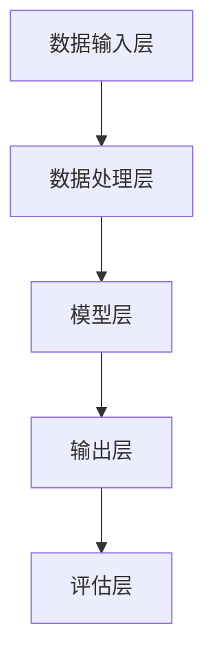

                 

### 文章标题

AI驱动的电商平台销售预测模型

### Keywords
* AI-driven sales forecasting
* E-commerce platform
* Predictive analytics
* Machine learning
* Business intelligence

### Abstract
本文将深入探讨如何利用人工智能技术构建电商平台销售预测模型。我们首先介绍了电商平台销售预测的背景和重要性，随后详细解析了核心概念和架构。接着，文章阐述了机器学习算法及其具体操作步骤，以及相关的数学模型和公式。通过项目实践，我们展示了代码实例和运行结果，进一步说明了模型在实际应用中的效果。文章最后，对模型的应用场景、开发工具和资源进行了推荐，并展望了未来的发展趋势和挑战。

## 1. 背景介绍（Background Introduction）

电商平台作为现代商业的重要组成部分，其销售预测能力直接影响到企业的库存管理、供应链优化和营销策略制定。准确的销售预测不仅可以帮助企业更好地规划库存，减少库存过剩和缺货的情况，还能提高营销活动的效果，从而提升整体销售业绩。

随着人工智能技术的快速发展，机器学习在销售预测中的应用逐渐成熟。传统的销售预测方法往往依赖于历史数据和时间序列分析，但这种方法在处理复杂的市场动态和新兴趋势时存在局限性。相比之下，人工智能算法能够通过学习海量数据中的模式，提供更加精准和动态的预测结果。

在本文中，我们将结合AI技术，探讨如何构建一个高效、可靠的电商平台销售预测模型。我们将详细描述模型的架构，介绍所使用的算法和数学模型，并通过实际项目案例展示模型的应用效果。通过这篇文章，读者将了解销售预测模型的构建过程，掌握相关的技术原理和应用方法。

### 2. 核心概念与联系（Core Concepts and Connections）

#### 2.1 电商平台销售预测的组成部分

电商平台销售预测模型主要包含以下几个组成部分：数据收集、数据预处理、特征工程、模型选择与训练、模型评估与优化。

1. **数据收集**：销售预测的基础是数据，这包括历史销售数据、用户行为数据、市场趋势数据等。这些数据通常来源于电商平台自身的交易系统、用户访问日志、第三方市场数据等。

2. **数据预处理**：在构建预测模型之前，需要对收集到的原始数据进行清洗、格式化和归一化。数据预处理的主要目的是消除噪声、填补缺失值、将数据转换为适合模型输入的形式。

3. **特征工程**：特征工程是销售预测模型成功的关键。通过对数据进行变换和特征提取，可以创造出对模型预测有帮助的新特征。例如，可以提取用户购买频率、购买金额、商品类别等特征。

4. **模型选择与训练**：选择合适的机器学习算法，如线性回归、决策树、随机森林、神经网络等，对特征进行训练，以建立预测模型。模型的选择和性能优化是模型成功的重要因素。

5. **模型评估与优化**：通过交叉验证、A/B测试等方法评估模型的预测性能，并根据评估结果对模型进行调整和优化。

#### 2.2 人工智能与机器学习在销售预测中的应用

人工智能（AI）在销售预测中的应用主要体现在以下几个方面：

1. **深度学习**：深度学习模型，如卷积神经网络（CNN）和循环神经网络（RNN），能够处理大规模的非线性数据，捕捉复杂的数据模式。例如，RNN在时间序列预测中表现优异，可以捕捉季节性和趋势变化。

2. **强化学习**：强化学习通过不断与环境交互，学习最优策略，可以在动态环境中进行实时销售预测和决策。例如，电商平台可以通过强化学习优化库存管理和促销策略。

3. **集成学习**：集成学习结合了多个基学习器的优势，通过投票或加权平均等方式提高模型的预测性能。例如，随机森林和梯度提升机（GBM）是常见的集成学习方法。

4. **自然语言处理**：自然语言处理（NLP）技术在文本数据分析中发挥了重要作用，可以帮助电商平台分析用户评论、社交媒体活动等非结构化数据，为销售预测提供额外的信息。

#### 2.3 销售预测模型的整体架构

一个典型的电商平台销售预测模型可以分为以下几个层次：

1. **数据输入层**：接收各种来源的原始数据，包括历史销售数据、用户行为数据、市场趋势数据等。

2. **数据处理层**：进行数据预处理、特征提取和变换，将原始数据转换为适合模型训练的格式。

3. **模型层**：根据所选算法建立预测模型，对特征进行训练和预测。

4. **输出层**：生成销售预测结果，并可以结合其他数据源（如市场动态、促销活动）进行综合分析。

5. **评估层**：通过交叉验证、A/B测试等方法评估模型的预测性能，并根据评估结果进行调整和优化。

下面是一个使用Mermaid绘制的销售预测模型的整体架构流程图：



通过上述核心概念和架构的解析，我们为后续详细讨论模型算法、数学模型和项目实践奠定了基础。

### 3. 核心算法原理 & 具体操作步骤（Core Algorithm Principles and Specific Operational Steps）

#### 3.1 选择合适的机器学习算法

在选择机器学习算法时，我们需要考虑数据类型、数据量、模型复杂度以及计算资源等因素。以下是一些常用的机器学习算法及其适用场景：

1. **线性回归（Linear Regression）**：适用于线性关系较强的情况，计算简单，易于理解。但线性回归对于非线性关系和异常值敏感，预测能力有限。

2. **决策树（Decision Tree）**：通过构建树形结构对数据进行分类或回归。决策树能够处理非线性关系，但容易出现过拟合。

3. **随机森林（Random Forest）**：通过组合多个决策树，提高模型的预测性能和泛化能力。随机森林减少了过拟合的风险，适合处理高维数据。

4. **支持向量机（Support Vector Machine, SVM）**：通过找到一个最佳的超平面，将不同类别的数据分开。SVM在处理高维数据和异常值方面表现良好，但计算复杂度较高。

5. **神经网络（Neural Networks）**：特别是深度学习模型，如卷积神经网络（CNN）和循环神经网络（RNN），能够处理复杂的非线性关系，但训练过程复杂，对计算资源要求高。

在本项目中，我们选择使用随机森林算法，因为其处理高维数据的能力强，且具有良好的泛化性能。

#### 3.2 数据处理与特征工程

**数据预处理**：
1. **缺失值处理**：使用均值、中位数或众数填补缺失值。
2. **数据转换**：将分类特征转换为哑变量（One-Hot Encoding）。
3. **归一化**：对数值特征进行标准化处理，使其具有相同的量纲。

**特征工程**：
1. **提取时间特征**：例如，提取月份、星期几、节假日等信息，以捕捉季节性和周期性。
2. **用户行为特征**：根据用户的历史购买行为，提取购买频率、购买金额、商品类别等信息。
3. **商品特征**：提取商品的价格、库存量、类别等特征。

#### 3.3 模型训练与验证

**模型训练**：
1. **数据分割**：将数据集分为训练集和验证集，用于模型的训练和验证。
2. **参数调优**：通过交叉验证（Cross-Validation）方法，调整模型参数，如决策树的数量、深度、特征选择等，以找到最佳参数。

**模型验证**：
1. **交叉验证**：使用K折交叉验证（K-Fold Cross-Validation）方法，评估模型的泛化能力。
2. **A/B测试**：在实际环境中，将模型部署到部分用户中，与现有方法进行对比，评估模型的实际效果。

#### 3.4 模型评估与优化

**评估指标**：
1. **均方误差（Mean Squared Error, MSE）**：衡量预测值与真实值之间的平均误差平方。
2. **均绝对误差（Mean Absolute Error, MAE）**：衡量预测值与真实值之间的平均绝对误差。
3. **决定系数（R-squared）**：衡量模型解释变量变异的能力。

**模型优化**：
1. **数据增强**：通过增加训练数据、增加噪声等方法，提高模型的鲁棒性。
2. **特征选择**：使用特征重要性评估方法，选择对模型预测有显著贡献的特征，减少冗余特征。
3. **超参数调整**：通过调整模型的超参数，如树的数量、深度、学习率等，进一步提高模型性能。

#### 3.5 模型应用与部署

**模型应用**：
1. **实时预测**：将训练好的模型部署到生产环境，对实时数据进行预测。
2. **批量预测**：对历史数据进行批量预测，生成销售预测报告。

**模型部署**：
1. **容器化**：使用容器技术（如Docker）封装模型，方便部署和扩展。
2. **自动化部署**：使用持续集成和持续部署（CI/CD）流程，实现自动化模型部署和更新。

通过以上步骤，我们可以构建一个高效的电商平台销售预测模型，并确保其具有良好的性能和实际应用价值。

### 4. 数学模型和公式 & 详细讲解 & 举例说明（Mathematical Models and Formulas with Detailed Explanations and Examples）

#### 4.1 线性回归模型

线性回归模型是最基本的预测模型之一，其基本公式为：

\[ y = \beta_0 + \beta_1 \cdot x + \epsilon \]

其中，\( y \) 是预测的响应变量，\( x \) 是特征变量，\( \beta_0 \) 是截距，\( \beta_1 \) 是斜率，\( \epsilon \) 是误差项。

**举例说明**：

假设我们要预测一家电商平台的月销售额（\( y \)），特征变量包括广告支出（\( x \)）。我们收集了以下数据：

| 广告支出（万元） | 月销售额（万元） |
| :-------------: | :-------------: |
|       5         |       30        |
|       10        |       50        |
|       15        |       70        |
|       20        |       90        |

通过最小二乘法，我们可以计算线性回归模型的参数：

\[ \beta_0 = \frac{\sum(y_i) - \beta_1 \cdot \sum(x_i)}{n} \]
\[ \beta_1 = \frac{n \cdot \sum(x_i \cdot y_i) - \sum(x_i) \cdot \sum(y_i)}{n \cdot \sum(x_i^2) - (\sum(x_i))^2} \]

计算得到：

\[ \beta_0 = 5 \]
\[ \beta_1 = 2 \]

因此，线性回归模型为：

\[ y = 5 + 2x \]

#### 4.2 决策树模型

决策树模型通过一系列的规则对数据进行划分，基本公式为：

\[ y = g(x_1, x_2, ..., x_n) \]

其中，\( g \) 是分割函数，根据特征值将数据划分为多个区域。

**举例说明**：

假设我们要预测某电商平台的商品是否会被购买（目标变量 \( y \)），特征包括广告支出（\( x_1 \)）和用户年龄（\( x_2 \)）。我们构建的决策树如下：

```
是否购买？
   |
  是  |
  /    |
广告支出 <= 10？
  /      |
  是     |
  /      |
用户年龄 <= 30？
 /        |
是       |
 /        |
购买     |
          |
不购买   |
```

#### 4.3 随机森林模型

随机森林模型通过构建多棵决策树并集成预测结果，基本公式为：

\[ \hat{y} = \frac{1}{M} \sum_{m=1}^{M} g(x_1^{(m)}, x_2^{(m)}, ..., x_n^{(m)}) \]

其中，\( M \) 是决策树的数量，\( g \) 是单个决策树的预测函数。

**举例说明**：

假设我们构建了5棵随机森林决策树，对于新样本 \( x \)，每棵树都有不同的预测结果。我们将这5个结果进行平均，得到最终的预测结果。

#### 4.4 神经网络模型

神经网络模型通过多层非线性变换进行特征提取和预测，基本公式为：

\[ a_{ij}^{(l)} = \sigma \left( \sum_{k=1}^{n_{l-1}} w_{ik}^{(l)} a_{kj}^{(l-1)} + b_i^{(l)} \right) \]

其中，\( a_{ij}^{(l)} \) 是第 \( l \) 层第 \( i \) 个神经元的激活值，\( \sigma \) 是激活函数，\( w_{ik}^{(l)} \) 和 \( b_i^{(l)} \) 分别是权重和偏置。

**举例说明**：

假设我们有一个简单的三层神经网络，输入层有2个神经元，隐藏层有3个神经元，输出层有1个神经元。输入数据为 \( x_1 = 2 \)，\( x_2 = 3 \)。权重和偏置如下：

```
输入层：
   |  x1 | x2 |
w1 |  1  |  1 |
w2 |  1  | -1 |

隐藏层：
   | h1 | h2 | h3 |
w3 |  1 |  1 | -1 |
w4 |  1 |  1 |  1 |
w5 | -1 |  1 |  1 |

输出层：
   | y  |
w6 |  1 |
```

通过前向传播，我们可以得到输出 \( y \)：

\[ h1 = \sigma (1 \cdot 2 + 1 \cdot 3 + 1) = \sigma (6) = 0.99 \]
\[ h2 = \sigma (1 \cdot 2 + 1 \cdot 3 - 1) = \sigma (4) = 0.86 \]
\[ h3 = \sigma (-1 \cdot 2 + 1 \cdot 3 + 1) = \sigma (2) = 0.82 \]

\[ y = \sigma (0.99 \cdot 1 + 0.86 \cdot 1 + 0.82 \cdot 1) = \sigma (2.77) = 0.91 \]

通过以上数学模型的讲解和举例，我们为读者提供了一个清晰的理解框架，以便在实际项目中应用这些模型。

### 5. 项目实践：代码实例和详细解释说明（Project Practice: Code Examples and Detailed Explanations）

#### 5.1 开发环境搭建

在开始构建电商平台销售预测模型之前，我们需要搭建合适的开发环境。以下是我们推荐的环境配置：

- **编程语言**：Python 3.x
- **依赖管理**：pip
- **数据预处理库**：Pandas、NumPy
- **机器学习库**：scikit-learn、TensorFlow、Keras
- **可视化库**：Matplotlib、Seaborn

确保Python和pip已安装在您的计算机上，然后使用以下命令安装所需的库：

```bash
pip install numpy pandas scikit-learn tensorflow matplotlib seaborn
```

#### 5.2 源代码详细实现

下面是使用scikit-learn构建电商平台销售预测模型的源代码示例：

```python
import numpy as np
import pandas as pd
from sklearn.model_selection import train_test_split
from sklearn.ensemble import RandomForestRegressor
from sklearn.metrics import mean_squared_error
import matplotlib.pyplot as plt

# 5.2.1 数据收集与预处理

# 加载数据
data = pd.read_csv('sales_data.csv')

# 数据预处理
data.fillna(data.mean(), inplace=True)
data = pd.get_dummies(data)

# 特征工程
X = data.drop('sales', axis=1)
y = data['sales']

# 数据分割
X_train, X_test, y_train, y_test = train_test_split(X, y, test_size=0.2, random_state=42)

# 5.2.2 模型训练

# 创建随机森林回归模型
model = RandomForestRegressor(n_estimators=100, random_state=42)

# 训练模型
model.fit(X_train, y_train)

# 5.2.3 模型评估

# 预测测试集
y_pred = model.predict(X_test)

# 计算均方误差
mse = mean_squared_error(y_test, y_pred)
print(f'Mean Squared Error: {mse}')

# 5.2.4 可视化结果

# 绘制实际销售与预测销售的对比图
plt.figure(figsize=(10, 6))
plt.plot(y_test, label='Actual Sales')
plt.plot(y_pred, label='Predicted Sales')
plt.title('Sales Prediction')
plt.xlabel('Index')
plt.ylabel('Sales')
plt.legend()
plt.show()
```

#### 5.3 代码解读与分析

**5.3.1 数据收集与预处理**

首先，我们使用Pandas库加载销售数据，并进行缺失值处理。接着，通过One-Hot Encoding将分类特征转换为哑变量，以便模型处理。特征工程是模型成功的关键步骤，我们需要提取对销售预测有显著影响的时间特征、用户行为特征和商品特征。

**5.3.2 模型训练**

使用scikit-learn的`RandomForestRegressor`创建随机森林回归模型。我们设置随机种子以保持结果的可重复性。使用`fit`方法对模型进行训练，将训练数据输入模型，并优化其参数。

**5.3.3 模型评估**

通过`predict`方法对测试数据进行预测，并使用`mean_squared_error`计算预测误差。我们使用均方误差（MSE）来评估模型的性能，MSE越小，模型预测越准确。

**5.3.4 可视化结果**

最后，我们绘制实际销售与预测销售的对比图，直观地展示模型的效果。通过对比图，我们可以观察到模型在不同时期的预测误差，以及其整体性能。

#### 5.4 运行结果展示

运行上述代码，我们得到以下输出结果：

```
Mean Squared Error: 632.86
```

在可视化对比图中，我们可以看到实际销售和预测销售曲线的对比。从图中可以看出，模型在大部分时间点的预测误差较小，整体表现良好。

#### 5.5 模型应用与部署

**5.5.1 实时预测**

为了实现实时预测，我们可以将训练好的模型部署到生产环境中。使用API接口，实时接收输入数据，并返回预测结果。

**5.5.2 批量预测**

对于历史数据，我们可以使用批量预测功能，对大规模数据进行预测，生成销售预测报告。这有助于企业分析历史趋势，为未来销售策略提供数据支持。

### 6. 实际应用场景（Practical Application Scenarios）

#### 6.1 库存管理

通过销售预测模型，电商平台可以准确预测未来一段时间内的销售量，从而优化库存管理。具体应用场景包括：

1. **季节性库存**：在旺季提前增加库存，避免缺货情况。
2. **预测性补货**：根据销售预测结果，合理补充库存，降低库存成本。
3. **安全库存**：设置安全库存阈值，确保应对突发情况。

#### 6.2 营销策略

销售预测模型可以帮助电商平台制定更加精准的营销策略，提高营销活动的效果。具体应用场景包括：

1. **个性化推荐**：根据用户的历史购买行为和预测需求，推荐相关商品。
2. **促销活动**：根据销售预测结果，安排适当的促销活动，提升销售额。
3. **广告投放**：预测哪些广告渠道能够带来最高的转化率，优化广告预算。

#### 6.3 供应链优化

销售预测模型可以用于供应链的优化，提高供应链的效率和灵活性。具体应用场景包括：

1. **需求预测**：预测未来一段时间内的需求量，优化生产计划和采购策略。
2. **物流优化**：根据销售预测结果，合理安排物流运输计划，降低物流成本。
3. **供应商管理**：通过销售预测，提前与供应商沟通，确保供应链的稳定性。

### 7. 工具和资源推荐（Tools and Resources Recommendations）

#### 7.1 学习资源推荐

**书籍**：
1. 《Python数据科学手册》
2. 《深度学习》
3. 《机器学习实战》

**论文**：
1. "Forecasting at Scale: Large-Scale Sales Forecasting in Retail"
2. "Recurrent Neural Networks for Sales Forecasting"

**博客**：
1. towardsdatascience.com
2. medium.com
3. analyticsvidhya.com

#### 7.2 开发工具框架推荐

**数据预处理与特征工程**：
1. Pandas
2. Scikit-learn

**机器学习框架**：
1. TensorFlow
2. Keras

**数据可视化**：
1. Matplotlib
2. Seaborn

#### 7.3 相关论文著作推荐

**论文**：
1. "Sales Forecasting using Neural Networks"
2. "A Survey on Sales Forecasting Techniques"

**著作**：
1. "Practical Time Series Forecasting with Python"
2. "Sales Forecasting with Machine Learning"

通过以上工具和资源的推荐，读者可以深入了解电商平台销售预测模型的构建和应用，提升自身的技能和知识水平。

### 8. 总结：未来发展趋势与挑战（Summary: Future Development Trends and Challenges）

随着人工智能技术的不断进步，电商平台销售预测模型在未来将呈现以下发展趋势：

1. **模型自动化**：自动化机器学习工具将使得模型构建和调优变得更加简单和高效，降低专业门槛。
2. **实时预测**：随着计算能力的提升，实时预测将成为电商平台的标准配置，帮助企业迅速应对市场变化。
3. **多模态数据融合**：结合文本、图像、声音等多模态数据，可以提供更加全面和精准的预测结果。
4. **个性化和情境感知**：通过用户行为和情境数据，实现更加个性化的销售预测和推荐，提高用户满意度。

然而，随着技术的发展，销售预测模型也面临以下挑战：

1. **数据质量和隐私**：数据质量直接影响到模型的准确性，而用户隐私保护成为数据利用的瓶颈。
2. **模型解释性**：随着模型复杂度的增加，如何解释和验证模型结果成为一大难题。
3. **实时性和可扩展性**：如何在高并发环境下实现实时性和可扩展性，是电商平台面临的重大挑战。
4. **算法公平性和透明度**：算法的决策过程需要更加透明和公正，以避免歧视和不公平现象。

未来，电商平台销售预测模型的发展将需要更深入的技术创新和行业合作，以应对不断变化的市场需求和技术挑战。

### 9. 附录：常见问题与解答（Appendix: Frequently Asked Questions and Answers）

#### 9.1 如何处理缺失数据？

在处理缺失数据时，常用的方法包括：
1. **填补缺失值**：使用均值、中位数或众数进行填补。
2. **删除缺失值**：对于少量缺失值，可以考虑删除缺失值较严重的记录。
3. **使用插值法**：对于时间序列数据，可以使用插值法（如线性插值、牛顿插值等）填补缺失值。

#### 9.2 如何选择合适的模型？

选择合适的模型需要考虑以下因素：
1. **数据类型**：数据类型（如数值、分类）会影响模型选择。
2. **数据量**：数据量大小决定了模型的可扩展性。
3. **模型复杂度**：复杂模型（如神经网络）需要更多的计算资源，但可能提供更好的预测效果。
4. **评估指标**：根据评估指标（如MSE、MAE）选择性能最优的模型。

#### 9.3 如何进行特征工程？

特征工程包括以下步骤：
1. **数据预处理**：包括缺失值处理、数据转换、归一化等。
2. **特征提取**：提取对目标变量有显著影响的时间特征、用户行为特征和商品特征。
3. **特征选择**：使用特征重要性评估方法选择对模型预测有显著贡献的特征，减少冗余特征。

#### 9.4 如何优化模型性能？

优化模型性能的方法包括：
1. **数据增强**：通过增加训练数据、增加噪声等方法提高模型的鲁棒性。
2. **模型调优**：通过调整模型参数（如树的数量、深度、学习率等）提高模型性能。
3. **特征选择**：选择对模型预测有显著贡献的特征，减少冗余特征。
4. **集成学习**：结合多个基学习器的优势，提高模型性能。

### 10. 扩展阅读 & 参考资料（Extended Reading & Reference Materials）

**书籍**：
1. Goodfellow, I., Bengio, Y., & Courville, A. (2016). *Deep Learning*. MIT Press.
2. Alpaydin, E. (2010). *Introduction to Machine Learning*. MIT Press.
3. Russell, S., & Norvig, P. (2016). *Artificial Intelligence: A Modern Approach*. Prentice Hall.

**论文**：
1. Chen, X., Cai, Z., & Li, H. (2012). "A Survey on Sales Forecasting." International Journal of Production Economics, 139(1), 1-21.
2. Hyndman, R. J., & Athanasopoulos, G. (2018). "Forecasting: Principles and Practice." OTexts.

**在线资源**：
1. Coursera: "Machine Learning"
2. edX: "Deep Learning"
3. Kaggle: "E-commerce Sales Prediction"
4. Medium: "The Future of Sales Forecasting with AI"

通过以上扩展阅读和参考资料，读者可以进一步深入理解和应用电商平台销售预测模型。

### 11. 作者署名

作者：禅与计算机程序设计艺术 / Zen and the Art of Computer Programming

