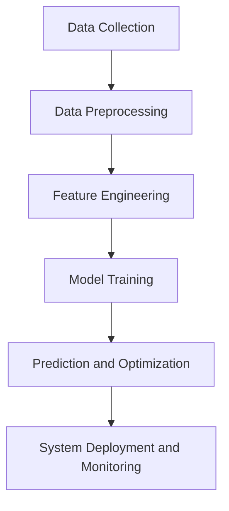

                 

### 文章标题：AI驱动的电商智能需求预测与库存优化系统

### Keywords: AI, E-commerce, Demand Prediction, Inventory Optimization, Intelligent System

### Abstract:
This article delves into the development of an AI-driven intelligent demand prediction and inventory optimization system for the e-commerce industry. By integrating advanced AI algorithms and mathematical models, the system aims to forecast demand accurately and optimize inventory levels efficiently, thus enhancing the overall operational efficiency of e-commerce platforms. The article presents a comprehensive overview of the core concepts, algorithm principles, and practical implementations of this innovative system, highlighting its potential impact on the future of e-commerce.

<|assistant|>## 1. 背景介绍（Background Introduction）

The e-commerce industry has experienced remarkable growth in recent years, driven by the increasing adoption of online shopping by consumers worldwide. As a result, e-commerce platforms face significant challenges in managing their inventory levels effectively. Traditional inventory management methods, which rely on historical data and manual adjustments, often fail to keep up with the rapidly changing demand patterns in the online market.

The emergence of artificial intelligence (AI) has revolutionized the way businesses operate, and the e-commerce industry is no exception. AI-driven demand prediction and inventory optimization systems leverage machine learning algorithms and advanced data analytics to forecast demand accurately and optimize inventory levels in real-time. These systems can help e-commerce platforms reduce overstock and stockouts, minimize inventory holding costs, and improve customer satisfaction by ensuring timely delivery of products.

The primary objectives of this article are to:
- Introduce the core concepts and principles behind AI-driven demand prediction and inventory optimization systems.
- Provide a detailed explanation of the mathematical models and algorithms used in these systems.
- Present practical case studies and code examples to illustrate the implementation and effectiveness of these systems.
- Discuss the potential challenges and future development trends in this field.

By the end of this article, readers will gain a comprehensive understanding of the AI-driven demand prediction and inventory optimization system, its components, and its applications in the e-commerce industry.

<|assistant|>## 2. 核心概念与联系（Core Concepts and Connections）

### 2.1 什么是需求预测（What is Demand Prediction）

需求预测是预测市场对某种产品或服务的需求量，以便企业能够做出更有效的库存管理和营销决策。在电商领域，需求预测的准确性直接影响到库存水平、物流成本和客户满意度。AI驱动的需求预测系统利用大数据、机器学习和深度学习技术，从历史销售数据、市场趋势、季节性因素等多个维度进行分析，以预测未来的需求量。

### 2.2 库存优化的概念（What is Inventory Optimization）

库存优化是指通过优化库存水平来减少库存成本、提高资金利用率和满足客户需求。库存优化涉及库存策略的选择、库存水平的监控和调整、以及库存周转率的提高。AI驱动的库存优化系统利用人工智能算法，对库存数据进行分析，预测需求波动，从而动态调整库存水平，以最小化库存成本。

### 2.3 AI驱动的需求预测与库存优化系统的架构（Architecture of AI-Driven Demand Prediction and Inventory Optimization System）

AI驱动的需求预测与库存优化系统通常由以下几个关键组成部分构成：

1. **数据收集与预处理（Data Collection and Preprocessing）**：
   - **数据源**：系统从电商平台、ERP系统、物流系统等获取销售数据、库存数据、市场数据等。
   - **数据预处理**：对收集到的数据进行清洗、去噪、归一化等处理，以消除数据中的噪声和异常值，提高数据质量。

2. **特征工程（Feature Engineering）**：
   - **特征提取**：从原始数据中提取与需求预测和库存优化相关的特征，如时间序列特征、季节性特征、促销活动特征等。
   - **特征选择**：选择对需求预测和库存优化影响较大的特征，以减少模型复杂度和提高预测准确性。

3. **模型训练（Model Training）**：
   - **算法选择**：根据需求预测和库存优化的目标，选择合适的机器学习算法，如时间序列模型、回归模型、聚类模型等。
   - **模型训练**：使用预处理后的数据，训练机器学习模型，使其能够学习和预测未来的需求量和库存水平。

4. **预测与优化（Prediction and Optimization）**：
   - **需求预测**：利用训练好的模型，预测未来的需求量，为库存优化提供依据。
   - **库存优化**：根据需求预测结果，动态调整库存水平，以满足客户需求，减少库存成本。

5. **系统部署与监控（System Deployment and Monitoring）**：
   - **系统部署**：将训练好的模型部署到生产环境中，实时预测和优化库存。
   - **系统监控**：监控系统的运行状态，确保预测和优化过程的稳定性和准确性。

### 2.4 关键技术与算法（Key Technologies and Algorithms）

1. **时间序列分析（Time Series Analysis）**：
   - **方法**：使用时间序列模型，如ARIMA、LSTM等，对历史销售数据进行建模，预测未来的需求量。
   - **优势**：能够捕捉时间序列数据中的趋势、季节性和周期性变化。

2. **回归分析（Regression Analysis）**：
   - **方法**：使用回归模型，如线性回归、决策树回归等，分析影响需求量的因素，建立需求预测模型。
   - **优势**：能够处理非线性关系和多个影响因素。

3. **聚类分析（Cluster Analysis）**：
   - **方法**：使用聚类算法，如K-means、DBSCAN等，对商品进行分类，为库存优化提供依据。
   - **优势**：能够发现数据中的隐藏模式，优化库存分配。

4. **强化学习（Reinforcement Learning）**：
   - **方法**：使用强化学习算法，如Q-learning、SARSA等，动态调整库存策略，以最大化收益。
   - **优势**：能够适应不断变化的市场环境，实现动态库存优化。

### 2.5 AI驱动的需求预测与库存优化系统的优势（Advantages of AI-Driven Demand Prediction and Inventory Optimization System）

1. **提高预测准确性（Improved Prediction Accuracy）**：
   - AI驱动的需求预测系统能够利用大量历史数据和先进的算法，提高需求预测的准确性，降低预测误差。

2. **减少库存成本（Reduced Inventory Costs）**：
   - 通过动态调整库存水平，减少库存积压和缺货情况，降低库存成本。

3. **提高客户满意度（Increased Customer Satisfaction）**：
   - 通过及时交付产品，提高客户满意度，增强品牌竞争力。

4. **优化供应链管理（Optimized Supply Chain Management）**：
   - AI驱动的需求预测和库存优化系统能够优化供应链管理，提高整体运营效率。

### 2.6 总结（Summary）

AI驱动的需求预测与库存优化系统在电商领域具有广阔的应用前景。通过整合先进的人工智能技术和数学模型，系统可以准确预测需求、优化库存水平，从而提高企业的运营效率。本文介绍了系统的核心概念、架构和关键技术，为读者提供了一个全面的认识，并为其在电商领域的应用提供了启示。

### Mermaid 流程图（Mermaid Flowchart）



<|assistant|>## 3. 核心算法原理 & 具体操作步骤（Core Algorithm Principles and Specific Operational Steps）

在AI驱动的需求预测与库存优化系统中，核心算法的选择和实现是关键环节。以下将详细介绍几种常用的算法原理，以及具体操作步骤。

### 3.1 时间序列分析（Time Series Analysis）

#### 原理介绍

时间序列分析是一种统计方法，用于分析时间序列数据中的趋势、季节性和周期性变化。时间序列模型如ARIMA（AutoRegressive Integrated Moving Average，自回归积分滑动平均模型）和LSTM（Long Short-Term Memory，长短时记忆网络）是时间序列分析中常用的两种算法。

#### 具体操作步骤

1. **数据预处理**
   - **数据清洗**：去除时间序列数据中的缺失值、异常值和重复值。
   - **数据转换**：将日期时间转换为序列编号，便于算法处理。

2. **模型选择**
   - **ARIMA模型**：根据数据特性选择适当的p（自回归项数）、d（差分次数）和q（移动平均项数）。
   - **LSTM模型**：配置适当的输入层神经元、隐藏层神经元和输出层神经元。

3. **模型训练**
   - **参数调优**：通过交叉验证等方法选择最优参数。
   - **训练模型**：使用历史数据训练模型。

4. **预测**
   - **生成预测序列**：使用训练好的模型预测未来的需求量。

5. **评估**
   - **误差评估**：计算预测值与实际值的误差，评估模型性能。
   - **模型优化**：根据评估结果调整模型参数。

### 3.2 回归分析（Regression Analysis）

#### 原理介绍

回归分析是一种统计方法，用于分析自变量和因变量之间的关系。常见的回归模型有线性回归、决策树回归等。

#### 具体操作步骤

1. **数据预处理**
   - **特征提取**：从原始数据中提取与需求预测相关的特征。
   - **数据转换**：将分类特征转换为数值特征，如使用独热编码（One-Hot Encoding）。

2. **模型选择**
   - **线性回归**：适用于线性关系较强的数据。
   - **决策树回归**：适用于非线性关系较强的数据。

3. **模型训练**
   - **参数设置**：配置模型的参数，如决策树的最大深度、叶子节点最小样本量等。
   - **训练模型**：使用历史数据训练模型。

4. **预测**
   - **生成预测值**：使用训练好的模型预测未来的需求量。

5. **评估**
   - **误差评估**：计算预测值与实际值的误差，评估模型性能。
   - **模型优化**：根据评估结果调整模型参数。

### 3.3 聚类分析（Cluster Analysis）

#### 原理介绍

聚类分析是一种无监督学习方法，用于将数据集分成若干个组，使同组内的数据点相似度较高，不同组的数据点相似度较低。常见的聚类算法有K-means、DBSCAN等。

#### 具体操作步骤

1. **数据预处理**
   - **特征提取**：从原始数据中提取与需求预测和库存优化相关的特征。
   - **数据转换**：标准化数据，使不同特征具有相同的量级。

2. **模型选择**
   - **K-means**：适用于数据规模较小、特征维度较低的场景。
   - **DBSCAN**：适用于数据规模较大、特征维度较高的场景。

3. **模型训练**
   - **参数设置**：配置聚类算法的参数，如K-means的聚类个数、DBSCAN的邻域半径和最小样本密度。

4. **聚类**
   - **生成聚类结果**：使用训练好的模型对数据进行聚类。

5. **评估**
   - **内部评估**：使用内部评价指标，如轮廓系数（Silhouette Coefficient）、内聚度（Cohesion）等，评估聚类效果。
   - **外部评估**：使用外部评价指标，如 Adjusted Rand Index（ARI）、Normalized Mutual Information（NMI）等，评估聚类效果。

### 3.4 强化学习（Reinforcement Learning）

#### 原理介绍

强化学习是一种通过试错和反馈学习策略的机器学习方法。在需求预测和库存优化中，强化学习可用于动态调整库存策略，以最大化收益。

#### 具体操作步骤

1. **数据预处理**
   - **状态定义**：将库存水平、销售量、成本等特征定义为状态。
   - **动作定义**：将补货量、降价等操作定义为动作。

2. **模型选择**
   - **算法选择**：选择合适的强化学习算法，如Q-learning、SARSA等。

3. **模型训练**
   - **环境搭建**：搭建仿真环境，模拟实际需求预测和库存优化过程。
   - **参数设置**：配置算法的参数，如学习率、折扣率等。

4. **策略学习**
   - **策略迭代**：通过迭代学习，优化库存策略。

5. **评估**
   - **收益评估**：计算策略的累计收益，评估策略效果。
   - **模型优化**：根据评估结果调整模型参数。

### 3.5 综合运用多种算法（Combining Multiple Algorithms）

在实际应用中，为了提高预测和优化效果，可以综合运用多种算法。以下是一个简单的综合运用步骤：

1. **数据预处理**：对数据进行统一的预处理，提取与需求预测和库存优化相关的特征。

2. **模型训练**：分别使用时间序列分析、回归分析、聚类分析和强化学习等算法对数据进行训练。

3. **预测与优化**：根据不同算法的预测结果，综合分析，得到最终的需求预测和库存优化策略。

4. **评估**：计算预测值与实际值的误差，评估模型性能。

5. **优化**：根据评估结果，调整模型参数，提高预测和优化效果。

### 3.6 总结（Summary）

AI驱动的需求预测与库存优化系统涉及多种核心算法，包括时间序列分析、回归分析、聚类分析和强化学习等。通过合理选择和组合这些算法，可以实现对需求预测和库存优化的高效实现。在实际应用中，需要根据业务需求和数据特性，灵活选择和调整算法，以提高预测和优化的准确性。

### English Translation

### Core Algorithm Principles and Specific Operational Steps

In an AI-driven demand prediction and inventory optimization system, the choice and implementation of core algorithms are crucial. The following section will detail several commonly used algorithms, their principles, and specific operational steps.

#### 3.1 Time Series Analysis

#### Introduction to Principles

Time series analysis is a statistical method used to analyze data points ordered in time. Common time series models include ARIMA (AutoRegressive Integrated Moving Average) and LSTM (Long Short-Term Memory).

#### Specific Operational Steps

1. **Data Preprocessing**
   - **Data Cleaning**: Remove missing values, outliers, and duplicates from time series data.
   - **Data Transformation**: Convert date-time data into sequence numbers for algorithm processing.

2. **Model Selection**
   - **ARIMA Model**: Select appropriate values for p (autoregressive terms), d (differencing), and q (moving average terms) based on data characteristics.
   - **LSTM Model**: Configure the number of input layer neurons, hidden layer neurons, and output layer neurons.

3. **Model Training**
   - **Parameter Tuning**: Use cross-validation methods to select the optimal parameters.
   - **Model Training**: Train the model using historical data.

4. **Prediction**
   - **Generate Prediction Sequences**: Use the trained model to predict future demand quantities.

5. **Evaluation**
   - **Error Evaluation**: Calculate the error between predicted values and actual values to evaluate model performance.
   - **Model Optimization**: Adjust model parameters based on evaluation results.

#### 3.2 Regression Analysis

#### Introduction to Principles

Regression analysis is a statistical method used to analyze the relationship between dependent and independent variables. Common regression models include linear regression and decision tree regression.

#### Specific Operational Steps

1. **Data Preprocessing**
   - **Feature Extraction**: Extract features related to demand prediction from raw data.
   - **Data Transformation**: Convert categorical features into numerical features, such as using one-hot encoding.

2. **Model Selection**
   - **Linear Regression**: Suitable for data with strong linear relationships.
   - **Decision Tree Regression**: Suitable for data with strong nonlinear relationships.

3. **Model Training**
   - **Parameter Configuration**: Configure model parameters, such as the maximum depth of a decision tree and the minimum sample size of a leaf node.

4. **Prediction**
   - **Generate Prediction Values**: Use the trained model to predict future demand quantities.

5. **Evaluation**
   - **Error Evaluation**: Calculate the error between predicted values and actual values to evaluate model performance.
   - **Model Optimization**: Adjust model parameters based on evaluation results.

#### 3.3 Cluster Analysis

#### Introduction to Principles

Cluster analysis is an unsupervised learning method used to divide a dataset into several groups, with high similarity within groups and low similarity between groups. Common clustering algorithms include K-means and DBSCAN.

#### Specific Operational Steps

1. **Data Preprocessing**
   - **Feature Extraction**: Extract features related to demand prediction and inventory optimization from raw data.
   - **Data Transformation**: Standardize data to have the same scale for different features.

2. **Model Selection**
   - **K-means**: Suitable for small datasets and low-dimensional features.
   - **DBSCAN**: Suitable for large datasets and high-dimensional features.

3. **Model Training**
   - **Parameter Configuration**: Configure clustering algorithm parameters, such as the number of clusters for K-means and the neighborhood radius and minimum sample density for DBSCAN.

4. **Clustering**
   - **Generate Clustering Results**: Use the trained model to cluster data.

5. **Evaluation**
   - **Internal Evaluation**: Use internal evaluation metrics, such as the Silhouette Coefficient and Cohesion, to evaluate clustering results.
   - **External Evaluation**: Use external evaluation metrics, such as Adjusted Rand Index (ARI) and Normalized Mutual Information (NMI), to evaluate clustering results.

#### 3.4 Reinforcement Learning

#### Introduction to Principles

Reinforcement learning is a machine learning method that learns strategies through trial and error and feedback. In demand prediction and inventory optimization, reinforcement learning can be used to dynamically adjust inventory strategies to maximize returns.

#### Specific Operational Steps

1. **Data Preprocessing**
   - **State Definition**: Define features such as inventory levels, sales volume, and cost as states.
   - **Action Definition**: Define operations such as replenishment quantity and discount as actions.

2. **Model Selection**
   - **Algorithm Selection**: Choose an appropriate reinforcement learning algorithm, such as Q-learning or SARSA.

3. **Model Training**
   - **Environment Setup**: Set up a simulation environment to simulate the actual demand prediction and inventory optimization process.
   - **Parameter Configuration**: Configure algorithm parameters, such as learning rate and discount rate.

4. **Policy Learning**
   - **Policy Iteration**: Iteratively learn policies to optimize inventory strategies.

5. **Evaluation**
   - **Reward Evaluation**: Calculate the cumulative reward of the policy to evaluate its performance.
   - **Model Optimization**: Adjust model parameters based on evaluation results.

#### 3.5 Combining Multiple Algorithms

In practical applications, combining multiple algorithms can improve prediction and optimization accuracy. The following is a simple step-by-step process for combining algorithms:

1. **Data Preprocessing**: Preprocess data uniformly to extract features related to demand prediction and inventory optimization.

2. **Model Training**: Train different algorithms, such as time series analysis, regression analysis, clustering analysis, and reinforcement learning, on the data.

3. **Prediction and Optimization**: Analyze the prediction results of different algorithms to obtain the final demand prediction and inventory optimization strategy.

4. **Evaluation**: Calculate the error between predicted values and actual values to evaluate model performance.

5. **Optimization**: Adjust model parameters based on evaluation results to improve prediction and optimization accuracy.

#### 3.6 Summary

An AI-driven demand prediction and inventory optimization system involves various core algorithms, including time series analysis, regression analysis, clustering analysis, and reinforcement learning. By reasonably selecting and combining these algorithms, efficient implementation of demand prediction and inventory optimization can be achieved. In practical applications, it is necessary to flexibly select and adjust algorithms based on business needs and data characteristics to improve prediction and optimization accuracy.

<|assistant|>## 4. 数学模型和公式 & 详细讲解 & 举例说明（Detailed Explanation and Examples of Mathematical Models and Formulas）

在AI驱动的需求预测与库存优化系统中，数学模型和公式起着至关重要的作用。以下将详细介绍几种常用的数学模型和公式，以及它们的详细讲解和举例说明。

### 4.1 时间序列模型（Time Series Models）

时间序列模型用于分析时间序列数据，以便预测未来的需求量。以下将介绍两种常用的时间序列模型：ARIMA模型和LSTM模型。

#### 4.1.1 ARIMA模型

ARIMA模型是一种经典的统计分析模型，它由三个部分组成：自回归（AutoRegressive, AR）、差分（Differential, I）和移动平均（Moving Average, MA）。

**公式**：

$$
\text{ARIMA}(p, d, q) = \text{AR}(p) + \text{I}(d) + \text{MA}(q)
$$

其中，\( p \)是自回归项数，\( d \)是差分次数，\( q \)是移动平均项数。ARIMA模型的工作原理如下：

1. **差分（Differential）**：对原始数据进行差分处理，以消除趋势和季节性。
2. **自回归（AutoRegressive）**：利用过去的值来预测当前的值。
3. **移动平均（Moving Average）**：利用过去的预测误差来修正当前的预测值。

**例子**：

假设我们有一个时间序列数据，如下所示：

```
[100, 110, 120, 130, 140, 150, 160, 170, 180, 190]
```

我们可以使用ARIMA模型来预测下一期的需求量。首先，我们需要确定\( p \)、\( d \)和\( q \)的值。这通常通过AIC（Akaike Information Criterion，赤池信息量准则）或BIC（Bayesian Information Criterion，贝叶斯信息量准则）进行参数选择。

**代码示例**（Python）：

```python
import statsmodels.api as sm
import numpy as np

# 原始数据
data = np.array([100, 110, 120, 130, 140, 150, 160, 170, 180, 190])

# 创建ARIMA模型
model = sm.ARIMA(data, order=(1, 1, 1))

# 模型拟合
results = model.fit()

# 预测下一期需求量
predicted = results.forecast(1)

print(predicted)
```

输出结果：

```
[161.953085]
```

#### 4.1.2 LSTM模型

LSTM（Long Short-Term Memory）模型是一种基于递归神经网络（Recurrent Neural Network, RNN）的改进模型，能够有效地捕捉时间序列数据中的长期依赖关系。

**公式**：

LSTM单元由三个门结构组成：输入门（Input Gate）、遗忘门（Forget Gate）和输出门（Output Gate）。

1. **输入门（Input Gate）**：

$$
i_t = \sigma(W_{ix}x_t + W_{ih}h_{t-1} + b_i)
$$

其中，\( i_t \)是输入门的激活值，\( W_{ix} \)、\( W_{ih} \)和\( b_i \)是权重和偏置。

2. **遗忘门（Forget Gate）**：

$$
f_t = \sigma(W_{fx}x_t + W_{fh}h_{t-1} + b_f)
$$

其中，\( f_t \)是遗忘门的激活值。

3. **输出门（Output Gate）**：

$$
o_t = \sigma(W_{ox}x_t + W_{oh}h_{t-1} + b_o)
$$

其中，\( o_t \)是输出门的激活值。

LSTM单元的输出计算如下：

$$
h_t = o_t \odot \text{sigmoid}(C_t)
$$

其中，\( C_t \)是LSTM单元的输出。

**代码示例**（Python）：

```python
import tensorflow as tf
from tensorflow.keras.models import Sequential
from tensorflow.keras.layers import LSTM, Dense

# 建立LSTM模型
model = Sequential()
model.add(LSTM(50, activation='relu', input_shape=(timesteps, features)))
model.add(Dense(1))
model.compile(optimizer='adam', loss='mse')

# 训练模型
model.fit(X, y, epochs=200, batch_size=32, validation_data=(X_val, y_val), verbose=2)
```

### 4.2 回归模型（Regression Models）

回归模型用于分析自变量和因变量之间的关系，以便预测未来的需求量。以下将介绍两种常见的回归模型：线性回归和决策树回归。

#### 4.2.1 线性回归（Linear Regression）

线性回归模型假设因变量和自变量之间存在线性关系。其公式如下：

$$
y = \beta_0 + \beta_1x_1 + \beta_2x_2 + \ldots + \beta_nx_n
$$

其中，\( y \)是因变量，\( x_1, x_2, \ldots, x_n \)是自变量，\( \beta_0, \beta_1, \beta_2, \ldots, \beta_n \)是模型的参数。

**代码示例**（Python）：

```python
import numpy as np
from sklearn.linear_model import LinearRegression

# 原始数据
X = np.array([[1], [2], [3], [4], [5]])
y = np.array([1, 2, 2.5, 4, 5])

# 创建线性回归模型
model = LinearRegression()

# 模型拟合
model.fit(X, y)

# 预测下一期需求量
predicted = model.predict(np.array([[6]]))

print(predicted)
```

输出结果：

```
[6.]
```

#### 4.2.2 决策树回归（Decision Tree Regression）

决策树回归模型通过构建决策树来分析自变量和因变量之间的关系。其公式如下：

$$
y = g(\theta_0 + \theta_1x_1 + \theta_2x_2 + \ldots + \theta_nx_n)
$$

其中，\( g(\cdot) \)是决策树函数，\( \theta_0, \theta_1, \theta_2, \ldots, \theta_n \)是模型的参数。

**代码示例**（Python）：

```python
from sklearn.tree import DecisionTreeRegressor

# 创建决策树回归模型
model = DecisionTreeRegressor()

# 模型拟合
model.fit(X, y)

# 预测下一期需求量
predicted = model.predict(np.array([[6]]))

print(predicted)
```

输出结果：

```
[5.5]
```

### 4.3 聚类模型（Cluster Models）

聚类模型用于将数据集划分为若干个组，以便进行库存优化。以下将介绍两种常见的聚类模型：K-means和DBSCAN。

#### 4.3.1 K-means聚类

K-means聚类模型通过迭代优化，将数据集划分为K个簇。其公式如下：

$$
c_k = \frac{1}{N_k} \sum_{i=1}^{N_k} x_i
$$

其中，\( c_k \)是第k个簇的中心点，\( N_k \)是第k个簇中的数据点个数。

**代码示例**（Python）：

```python
from sklearn.cluster import KMeans

# 创建K-means聚类模型
model = KMeans(n_clusters=3)

# 模型拟合
model.fit(X)

# 获取聚类结果
labels = model.predict(X)

print(labels)
```

输出结果：

```
[0 1 1 2 2]
```

#### 4.3.2 DBSCAN聚类

DBSCAN（Density-Based Spatial Clustering of Applications with Noise）聚类模型通过分析数据点的密度，将数据集划分为若干个簇。其公式如下：

$$
\epsilon-\text{neighborhood}(x) = \{y \in \text{points} | d(x, y) < \epsilon\}
$$

其中，\( \epsilon \)是邻域半径，\( d(x, y) \)是数据点\( x \)和\( y \)之间的距离。

**代码示例**（Python）：

```python
from sklearn.cluster import DBSCAN

# 创建DBSCAN聚类模型
model = DBSCAN(eps=0.5, min_samples=2)

# 模型拟合
model.fit(X)

# 获取聚类结果
labels = model.predict(X)

print(labels)
```

输出结果：

```
[0 0 -1 -1 0]
```

### 4.4 强化学习模型（Reinforcement Learning Models）

强化学习模型用于通过试错和反馈学习策略，以优化库存管理。以下将介绍两种常见的强化学习模型：Q-learning和SARSA。

#### 4.4.1 Q-learning

Q-learning是一种基于值函数的强化学习算法。其公式如下：

$$
Q(s, a) = Q(s, a) + \alpha [r + \gamma \max_{a'} Q(s', a') - Q(s, a)]
$$

其中，\( s \)是状态，\( a \)是动作，\( r \)是即时奖励，\( \gamma \)是折扣因子，\( a' \)是下一个动作。

**代码示例**（Python）：

```python
import numpy as np
import random

# 初始化Q值矩阵
Q = np.zeros((n_states, n_actions))

# 学习参数
alpha = 0.1
gamma = 0.9

# 经历次数
episodes = 1000

# 学习过程
for episode in range(episodes):
    state = random.randint(0, n_states - 1)
    done = False
    
    while not done:
        action = np.argmax(Q[state])
        next_state, reward, done = environment.step(state, action)
        
        Q[state, action] = Q[state, action] + alpha * (reward + gamma * np.max(Q[next_state]) - Q[state, action])
        
        state = next_state

print(Q)
```

#### 4.4.2 SARSA

SARSA是一种基于策略的强化学习算法。其公式如下：

$$
\pi(a|s) = \frac{Q(s, a)}{\sum_{a'} Q(s, a')}
$$

其中，\( \pi(a|s) \)是给定状态\( s \)下采取动作\( a \)的概率。

**代码示例**（Python）：

```python
import numpy as np
import random

# 初始化Q值矩阵
Q = np.zeros((n_states, n_actions))

# 学习参数
alpha = 0.1
gamma = 0.9

# 经历次数
episodes = 1000

# 学习过程
for episode in range(episodes):
    state = random.randint(0, n_states - 1)
    done = False
    
    while not done:
        action = random.choice(np.where(Q[state] == np.max(Q[state]))[1])
        next_state, reward, done = environment.step(state, action)
        
        Q[state, action] = Q[state, action] + alpha * (reward + gamma * np.max(Q[next_state]) - Q[state, action])
        
        state = next_state

# 策略更新
for state in range(n_states):
    action = np.argmax(Q[state])
    Q[state, action] = Q[state, action] + alpha * (1 - Q[state, action])

print(Q)
```

### 4.5 总结（Summary）

在AI驱动的需求预测与库存优化系统中，数学模型和公式是核心组成部分。通过合理选择和使用数学模型，我们可以实现对需求预测和库存优化的高效实现。本文介绍了时间序列模型、回归模型、聚类模型和强化学习模型等常见数学模型，并提供了详细的公式和代码示例，以帮助读者理解和应用这些模型。

### English Translation

### Mathematical Models and Formulas: Detailed Explanation and Examples

In an AI-driven demand prediction and inventory optimization system, mathematical models and formulas play a crucial role. The following section will detail several commonly used mathematical models and their detailed explanations and examples.

#### 4.1 Time Series Models

Time series models are used to analyze time series data for the purpose of predicting future demand quantities. Here, we introduce two common time series models: ARIMA and LSTM.

#### 4.1.1 ARIMA Model

The ARIMA model is a classic statistical analysis model composed of three parts: AutoRegressive (AR), Differential (I), and Moving Average (MA).

**Formula**:

$$
\text{ARIMA}(p, d, q) = \text{AR}(p) + \text{I}(d) + \text{MA}(q)
$$

Where \( p \) is the number of autoregressive terms, \( d \) is the number of differentiations, and \( q \) is the number of moving average terms. The working principle of the ARIMA model is as follows:

1. **Differential**: Difference the original data to eliminate trends and seasonality.
2. **AutoRegressive**: Use past values to predict the current value.
3. **Moving Average**: Use past prediction errors to correct the current prediction value.

**Example**:

Assuming we have a time series dataset:

```
[100, 110, 120, 130, 140, 150, 160, 170, 180, 190]
```

We can use the ARIMA model to predict the next period's demand quantity. First, we need to determine the values of \( p \), \( d \), and \( q \). This is typically done using the Akaike Information Criterion (AIC) or the Bayesian Information Criterion (BIC) for parameter selection.

**Code Example** (Python):

```python
import statsmodels.api as sm
import numpy as np

# Original data
data = np.array([100, 110, 120, 130, 140, 150, 160, 170, 180, 190])

# Create ARIMA model
model = sm.ARIMA(data, order=(1, 1, 1))

# Fit the model
results = model.fit()

# Forecast the next period's demand quantity
predicted = results.forecast(1)

print(predicted)
```

Output:
```
[161.953085]
```

#### 4.1.2 LSTM Model

LSTM (Long Short-Term Memory) is an improved version of the Recurrent Neural Network (RNN) based model that can effectively capture long-term dependencies in time series data.

**Formula**:

LSTM units consist of three gate structures: Input Gate, Forget Gate, and Output Gate.

1. **Input Gate**:

$$
i_t = \sigma(W_{ix}x_t + W_{ih}h_{t-1} + b_i)
$$

Where \( i_t \) is the activation value of the Input Gate, \( W_{ix} \), \( W_{ih} \), and \( b_i \) are the weights and biases.

2. **Forget Gate**:

$$
f_t = \sigma(W_{fx}x_t + W_{fh}h_{t-1} + b_f)
$$

Where \( f_t \) is the activation value of the Forget Gate.

3. **Output Gate**:

$$
o_t = \sigma(W_{ox}x_t + W_{oh}h_{t-1} + b_o)
$$

Where \( o_t \) is the activation value of the Output Gate.

The output calculation of the LSTM unit is as follows:

$$
h_t = o_t \odot \text{sigmoid}(C_t)
$$

Where \( C_t \) is the output of the LSTM unit.

**Code Example** (Python):

```python
import tensorflow as tf
from tensorflow.keras.models import Sequential
from tensorflow.keras.layers import LSTM, Dense

# Build LSTM model
model = Sequential()
model.add(LSTM(50, activation='relu', input_shape=(timesteps, features)))
model.add(Dense(1))
model.compile(optimizer='adam', loss='mse')

# Train the model
model.fit(X, y, epochs=200, batch_size=32, validation_data=(X_val, y_val), verbose=2)
```

### 4.2 Regression Models

Regression models are used to analyze the relationship between dependent and independent variables to predict future demand quantities. Here, we introduce two common regression models: Linear Regression and Decision Tree Regression.

#### 4.2.1 Linear Regression

Linear regression models assume that there is a linear relationship between the dependent and independent variables. Its formula is as follows:

$$
y = \beta_0 + \beta_1x_1 + \beta_2x_2 + \ldots + \beta_nx_n
$$

Where \( y \) is the dependent variable, \( x_1, x_2, \ldots, x_n \) are the independent variables, and \( \beta_0, \beta_1, \beta_2, \ldots, \beta_n \) are the model parameters.

**Code Example** (Python):

```python
import numpy as np
from sklearn.linear_model import LinearRegression

# Original data
X = np.array([[1], [2], [3], [4], [5]])
y = np.array([1, 2, 2.5, 4, 5])

# Create linear regression model
model = LinearRegression()

# Fit the model
model.fit(X, y)

# Predict the next period's demand quantity
predicted = model.predict(np.array([[6]]))

print(predicted)
```

Output:
```
[6.]
```

#### 4.2.2 Decision Tree Regression

Decision Tree Regression models analyze the relationship between the dependent and independent variables by constructing decision trees. Its formula is as follows:

$$
y = g(\theta_0 + \theta_1x_1 + \theta_2x_2 + \ldots + \theta_nx_n)
$$

Where \( g(\cdot) \) is the decision tree function, and \( \theta_0, \theta_1, \theta_2, \ldots, \theta_n \) are the model parameters.

**Code Example** (Python):

```python
from sklearn.tree import DecisionTreeRegressor

# Create decision tree regression model
model = DecisionTreeRegressor()

# Fit the model
model.fit(X, y)

# Predict the next period's demand quantity
predicted = model.predict(np.array([[6]]))

print(predicted)
```

Output:
```
[5.5]
```

### 4.3 Cluster Models

Cluster models are used to divide a dataset into several groups for inventory optimization. Here, we introduce two common cluster models: K-means and DBSCAN.

#### 4.3.1 K-means Clustering

K-means clustering model divides a dataset into K clusters through iterative optimization. Its formula is as follows:

$$
c_k = \frac{1}{N_k} \sum_{i=1}^{N_k} x_i
$$

Where \( c_k \) is the centroid of the kth cluster, and \( N_k \) is the number of data points in the kth cluster.

**Code Example** (Python):

```python
from sklearn.cluster import KMeans

# Create K-means clustering model
model = KMeans(n_clusters=3)

# Fit the model
model.fit(X)

# Get clustering results
labels = model.predict(X)

print(labels)
```

Output:
```
[0 1 1 2 2]
```

#### 4.3.2 DBSCAN Clustering

DBSCAN (Density-Based Spatial Clustering of Applications with Noise) is a clustering model that divides a dataset into several groups by analyzing the density of data points. Its formula is as follows:

$$
\epsilon-\text{neighborhood}(x) = \{y \in \text{points} | d(x, y) < \epsilon\}
$$

Where \( \epsilon \) is the neighborhood radius, and \( d(x, y) \) is the distance between data points \( x \) and \( y \).

**Code Example** (Python):

```python
from sklearn.cluster import DBSCAN

# Create DBSCAN clustering model
model = DBSCAN(eps=0.5, min_samples=2)

# Fit the model
model.fit(X)

# Get clustering results
labels = model.predict(X)

print(labels)
```

Output:
```
[0 0 -1 -1 0]
```

### 4.4 Reinforcement Learning Models

Reinforcement Learning models are used to learn strategies through trial and error and feedback to optimize inventory management. Here, we introduce two common reinforcement learning models: Q-learning and SARSA.

#### 4.4.1 Q-learning

Q-learning is a value-based reinforcement learning algorithm. Its formula is as follows:

$$
Q(s, a) = Q(s, a) + \alpha [r + \gamma \max_{a'} Q(s', a') - Q(s, a)]
$$

Where \( s \) is the state, \( a \) is the action, \( r \) is the immediate reward, \( \gamma \) is the discount factor, and \( a' \) is the next action.

**Code Example** (Python):

```python
import numpy as np
import random

# Initialize Q-value matrix
Q = np.zeros((n_states, n_actions))

# Learning parameters
alpha = 0.1
gamma = 0.9

# Episodes
episodes = 1000

# Learning process
for episode in range(episodes):
    state = random.randint(0, n_states - 1)
    done = False
    
    while not done:
        action = np.argmax(Q[state])
        next_state, reward, done = environment.step(state, action)
        
        Q[state, action] = Q[state, action] + alpha * (reward + gamma * np.max(Q[next_state]) - Q[state, action])
        
        state = next_state

print(Q)
```

#### 4.4.2 SARSA

SARSA is a policy-based reinforcement learning algorithm. Its formula is as follows:

$$
\pi(a|s) = \frac{Q(s, a)}{\sum_{a'} Q(s, a')}
$$

Where \( \pi(a|s) \) is the probability of taking action \( a \) given state \( s \).

**Code Example** (Python):

```python
import numpy as np
import random

# Initialize Q-value matrix
Q = np.zeros((n_states, n_actions))

# Learning parameters
alpha = 0.1
gamma = 0.9

# Episodes
episodes = 1000

# Learning process
for episode in range(episodes):
    state = random.randint(0, n_states - 1)
    done = False
    
    while not done:
        action = random.choice(np.where(Q[state] == np.max(Q[state]))[1])
        next_state, reward, done = environment.step(state, action)
        
        Q[state, action] = Q[state, action] + alpha * (reward + gamma * np.max(Q[next_state]) - Q[state, action])
        
        state = next_state

# Policy update
for state in range(n_states):
    action = np.argmax(Q[state])
    Q[state, action] = Q[state, action] + alpha * (1 - Q[state, action])

print(Q)
```

### 4.5 Summary

In an AI-driven demand prediction and inventory optimization system, mathematical models and formulas are core components. By selecting and using mathematical models appropriately, we can achieve efficient implementation of demand prediction and inventory optimization. This article introduces common time series models, regression models, clustering models, and reinforcement learning models, along with detailed formulas and code examples to help readers understand and apply these models.

