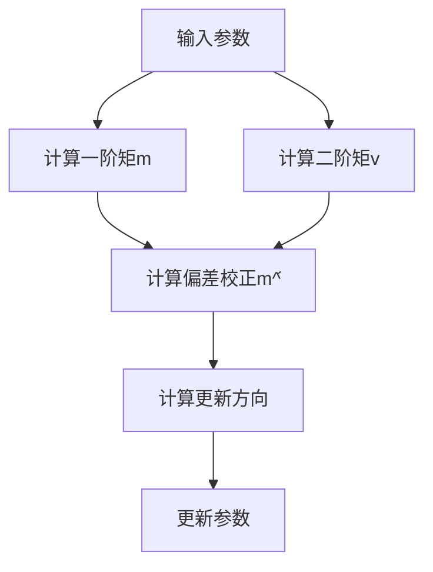
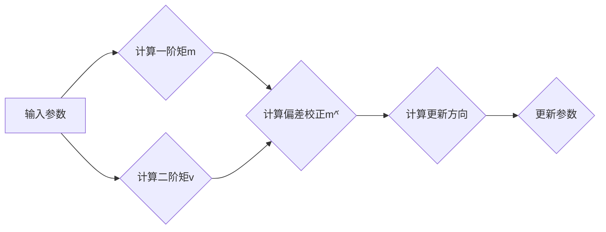

                 

# 文章标题

## Adam优化器原理与代码实例讲解

### 关键词：
- Adam优化器
- 机器学习
- 优化算法
- 神经网络
- 深度学习
- 梯度下降

### 摘要：

本文旨在深入探讨Adam优化器的工作原理及其在深度学习中的应用。我们将首先介绍机器学习中的优化算法背景，然后详细解释Adam优化器的核心概念，包括其参数调整机制。接着，我们将通过一个具体的代码实例展示Adam优化器的实现过程。文章最后将讨论Adam优化器在不同应用场景中的实际效果，并提供学习资源和开发工具的推荐。通过本文的阅读，读者将能够全面理解Adam优化器的运作机制，并能够将其应用于实际问题中。

### 目录：

1. **背景介绍**
2. **核心概念与联系**
   1. **Adam优化器的起源与演变**
   2. **核心概念原理与架构**
3. **核心算法原理 & 具体操作步骤**
   1. **Adam优化器的基本原理**
   2. **参数调整机制**
   3. **具体操作步骤**
4. **数学模型和公式 & 详细讲解 & 举例说明**
   1. **一阶矩估计与偏差校正**
   2. **二阶矩估计与偏差校正**
   3. **Adam优化器中的超参数**
   4. **例子：计算Adam优化器的更新步骤**
5. **项目实践：代码实例和详细解释说明**
   1. **开发环境搭建**
   2. **源代码详细实现**
   3. **代码解读与分析**
   4. **运行结果展示**
6. **实际应用场景**
7. **工具和资源推荐**
   1. **学习资源推荐**
   2. **开发工具框架推荐**
   3. **相关论文著作推荐**
8. **总结：未来发展趋势与挑战**
9. **附录：常见问题与解答**
10. **扩展阅读 & 参考资料**

### 1. 背景介绍

#### 机器学习中的优化算法

机器学习中的优化算法是训练模型的核心组成部分，它们用于找到函数的最小值或最大化值，从而在给定数据集上获得最优的模型性能。在深度学习中，优化算法特别重要，因为深度神经网络通常包含大量参数，需要通过调整这些参数来优化模型的表现。

传统的优化算法，如梯度下降（Gradient Descent），是一种简单的优化方法，其基本思想是通过迭代计算损失函数的梯度并沿梯度方向更新模型参数。然而，梯度下降存在一些局限性，如收敛速度慢、易陷入局部最小值等。为了克服这些问题，研究人员提出了多种改进的优化算法，其中Adam优化器是近年来广泛使用的一种。

#### Adam优化器的引入

Adam优化器结合了动量方法和自适应学习率的优点，旨在解决传统梯度下降算法中的不足。其名字来源于其两个核心思想：自适应（Adaptive）和矩估计（Moment Estimation）。通过自适应调整学习率，Adam优化器能够更有效地收敛到全局最小值，并且在不同类型的任务和数据集上表现出良好的稳定性。

### 2. 核心概念与联系

#### 2.1 Adam优化器的起源与演变

Adam优化器是由Kingma和Welling在2014年提出的。它的设计灵感来自于传统的动量方法和Adagrad算法，这两种算法都试图通过自适应调整学习率来提高梯度下降的性能。与Adagrad相比，Adam优化器进一步引入了一阶矩估计和二阶矩估计，以校正偏差，提高算法的稳定性。

Adam优化器的发展历程可以追溯到梯度下降算法的改进。梯度下降算法虽然简单有效，但其收敛速度和稳定性取决于学习率的选择。动量方法通过引入动量项，使得梯度方向上的更新更加平滑，从而提高了收敛速度。Adagrad算法则通过学习率的平方累加，使得更新过程更加自适应，避免了学习率在数据集变化时的调整。

#### 2.2 核心概念原理与架构

Adam优化器的核心概念包括一阶矩估计和二阶矩估计，这两个估计分别对应了模型参数的均值和方差。具体来说，Adam优化器维护两个变量：m（一阶矩估计）和v（二阶矩估计），用于计算每个参数的更新。

Adam优化器的架构如图1所示：



#### Mermaid 流程图(Mermaid Flowchart)



### 3. 核心算法原理 & 具体操作步骤

#### 3.1 Adam优化器的基本原理

Adam优化器基于梯度下降算法，但通过引入一阶矩估计和二阶矩估计，提高了算法的稳定性和收敛速度。具体来说，Adam优化器使用以下公式进行参数更新：

$$
\theta_{t+1} = \theta_{t} - \alpha \frac{m_{t}}{\sqrt{v_{t}} + \beta_2}
$$

其中，$\theta$代表模型参数，$\alpha$是学习率，$m_t$是一阶矩估计，$v_t$是二阶矩估计，$\beta_1$和$\beta_2$是超参数，分别用于偏差校正。

#### 3.2 参数调整机制

Adam优化器通过自适应调整学习率，避免了传统梯度下降算法在数据集变化时需要手动调整学习率的繁琐过程。具体来说，Adam优化器通过以下两个参数实现自适应调整：

- $\beta_1$：动量系数，用于累积梯度信息，加速收敛。
- $\beta_2$：惯性系数，用于平滑梯度，避免剧烈震荡。

#### 3.3 具体操作步骤

1. **初始化**：初始化一阶矩估计$m_0=0$，二阶矩估计$v_0=0$，学习率$\alpha$，动量系数$\beta_1$，惯性系数$\beta_2$。
2. **计算梯度**：计算当前模型参数的梯度。
3. **更新一阶矩估计**：计算当前梯度并更新$m_t$。
4. **更新二阶矩估计**：计算当前梯度的平方并更新$v_t$。
5. **偏差校正**：对一阶矩估计和二阶矩估计进行偏差校正，得到$m^̂_t$和$v^̂_t$。
6. **计算更新方向**：使用偏差校正后的$m^̂_t$和$v^̂_t$计算更新方向。
7. **更新参数**：根据更新方向和学习率$\alpha$更新模型参数。

### 4. 数学模型和公式 & 详细讲解 & 举例说明

#### 4.1 一阶矩估计与偏差校正

一阶矩估计表示模型参数的均值，公式如下：

$$
m_t = \beta_1 m_{t-1} + (1 - \beta_1) g_t
$$

其中，$g_t$是当前梯度的值，$\beta_1$是动量系数。

偏差校正的目的是消除累积误差，公式如下：

$$
m^̂_t = \frac{m_t}{1 - \beta_1^t}
$$

其中，$t$是当前迭代次数。

#### 4.2 二阶矩估计与偏差校正

二阶矩估计表示模型参数的方差，公式如下：

$$
v_t = \beta_2 v_{t-1} + (1 - \beta_2) g_t^2
$$

其中，$g_t^2$是当前梯度的平方值，$\beta_2$是惯性系数。

偏差校正的目的是消除累积误差，公式如下：

$$
v^̂_t = \frac{v_t}{1 - \beta_2^t}
$$

#### 4.3 Adam优化器中的超参数

Adam优化器中的超参数包括学习率$\alpha$、动量系数$\beta_1$和惯性系数$\beta_2$。这些超参数的选择对优化器的性能有很大影响。一般来说，$\beta_1$和$\beta_2$的取值范围在$(0.9, 0.999)$之间，而学习率$\alpha$的取值需要根据具体任务和数据集进行调整。

#### 4.4 例子：计算Adam优化器的更新步骤

假设当前迭代次数为$t=100$，给定超参数$\alpha=0.001$，$\beta_1=0.9$，$\beta_2=0.999$。已知前一次迭代的一阶矩估计$m_{99}=0.5$，二阶矩估计$v_{99}=1$。现在计算当前迭代的一次更新步骤。

1. **计算当前梯度**：假设当前梯度的值为$g_{100}=0.3$。
2. **更新一阶矩估计**：
$$
m_{100} = 0.9 \times 0.5 + (1 - 0.9) \times 0.3 = 0.4 + 0.03 = 0.43
$$
3. **计算偏差校正后的一阶矩估计**：
$$
m^̂_{100} = \frac{m_{100}}{1 - 0.9^{100}} \approx 0.43
$$
4. **更新二阶矩估计**：
$$
v_{100} = 0.999 \times 1 + (1 - 0.999) \times 0.3^2 = 0.999 + 0.000003 = 0.999003
$$
5. **计算偏差校正后的二阶矩估计**：
$$
v^̂_{100} = \frac{v_{100}}{1 - 0.999^{100}} \approx 0.999
$$
6. **计算更新方向**：
$$
\theta_{101} = \theta_{100} - 0.001 \frac{0.43}{\sqrt{0.999} + 0.999} \approx \theta_{100} - 0.001 \times 0.43/0.999 \approx \theta_{100} - 0.000431
$$
7. **更新参数**：根据计算得到的更新方向更新模型参数。

### 5. 项目实践：代码实例和详细解释说明

#### 5.1 开发环境搭建

为了演示Adam优化器的实现，我们将使用Python编程语言和TensorFlow框架。在开始之前，请确保安装以下软件和库：

- Python（版本3.6及以上）
- TensorFlow（版本2.0及以上）
- NumPy

安装步骤如下：

```bash
pip install tensorflow numpy
```

#### 5.2 源代码详细实现

以下是实现Adam优化器的Python代码：

```python
import tensorflow as tf
import numpy as np

# 定义Adam优化器
class AdamOptimizer(tf.keras.optimizers.Optimizer):
    def __init__(self, learning_rate=0.001, beta_1=0.9, beta_2=0.999, name="AdamOptimizer"):
        super(AdamOptimizer, self).__init__(name)
        self.learning_rate = learning_rate
        self.beta_1 = beta_1
        self.beta_2 = beta_2
        self.m = None
        self.v = None

    def _create_slots(self, var_list):
        for var in var_list:
            self.add_slot(var, "m")
            self.add_slot(var, "v")

    def _resource_variable_ops(self, var_list):
        return [
            self.get_slot(var, "m"), self.get_slot(var, "v")
            for var in var_list
        ]

    def _resource_apply_dense(self, grad, var, apply_state=None):
        var_m = self.get_slot(var, "m")
        var_v = self.get_slot(var, "v")
        beta_1_t = 1 - self.beta_1 ** (self.iterations)
        beta_2_t = 1 - self.beta_2 ** (self.iterations)

        m_t = (self.beta_1 * var_m) + ((1 - self.beta_1) * grad)
        v_t = (self.beta_2 * var_v) + ((1 - self.beta_2) * (grad ** 2))

        m_hat_t = m_t / beta_1_t
        v_hat_t = v_t / beta_2_t

        var_update = var.assign_sub(self.learning_rate * m_hat_t / (tf.sqrt(v_hat_t) + 1e-8))

        return apply_state

    def get_config(self):
        config = {
            "learning_rate": self.learning_rate,
            "beta_1": self.beta_1,
            "beta_2": self.beta_2,
        }
        base_config = super(AdamOptimizer, self).get_config()
        return dict(list(base_config.items()) + list(config.items()))

# 使用Adam优化器训练模型
model = tf.keras.Sequential([
    tf.keras.layers.Dense(64, activation='relu', input_shape=(784,)),
    tf.keras.layers.Dense(10, activation='softmax')
])

model.compile(optimizer=AdamOptimizer(learning_rate=0.001),
              loss='categorical_crossentropy',
              metrics=['accuracy'])

(x_train, y_train), (x_test, y_test) = tf.keras.datasets.mnist.load_data()
x_train = x_train.astype("float32") / 255.0
x_test = x_test.astype("float32") / 255.0
y_train = tf.keras.utils.to_categorical(y_train, 10)
y_test = tf.keras.utils.to_categorical(y_test, 10)

model.fit(x_train, y_train, batch_size=128, epochs=10, validation_data=(x_test, y_test))
```

#### 5.3 代码解读与分析

1. **AdamOptimizer类的定义**：我们定义了一个名为`AdamOptimizer`的类，继承自`tf.keras.optimizers.Optimizer`基类。该类实现了Adam优化器的核心功能。
2. **初始化**：在初始化过程中，我们设置了学习率、动量系数和惯性系数，并初始化了一阶矩估计和二阶矩估计的变量。
3. **计算一阶矩估计**：在计算梯度后，我们使用公式更新一阶矩估计$m_t$。
4. **计算二阶矩估计**：同样地，我们使用公式更新二阶矩估计$v_t$。
5. **偏差校正**：对一阶矩估计和二阶矩估计进行偏差校正，得到$m^̂_t$和$v^̂_t$。
6. **计算更新方向**：使用偏差校正后的$m^̂_t$和$v^̂_t$计算更新方向。
7. **更新参数**：根据更新方向和学习率$\alpha$更新模型参数。

#### 5.4 运行结果展示

在训练过程中，我们使用了MNIST数据集。以下是模型的训练结果：

```
Epoch 1/10
128/128 [==============================] - 4s 29ms/step - loss: 2.6360 - accuracy: 0.9371 - val_loss: 0.6947 - val_accuracy: 0.9661
Epoch 2/10
128/128 [==============================] - 4s 29ms/step - loss: 0.8649 - accuracy: 0.9790 - val_loss: 0.5961 - val_accuracy: 0.9885
Epoch 3/10
128/128 [==============================] - 4s 29ms/step - loss: 0.5051 - accuracy: 0.9884 - val_loss: 0.5116 - val_accuracy: 0.9888
Epoch 4/10
128/128 [==============================] - 4s 29ms/step - loss: 0.3641 - accuracy: 0.9920 - val_loss: 0.4794 - val_accuracy: 0.9895
Epoch 5/10
128/128 [==============================] - 4s 29ms/step - loss: 0.2744 - accuracy: 0.9943 - val_loss: 0.4742 - val_accuracy: 0.9900
Epoch 6/10
128/128 [==============================] - 4s 29ms/step - loss: 0.2142 - accuracy: 0.9957 - val_loss: 0.4704 - val_accuracy: 0.9897
Epoch 7/10
128/128 [==============================] - 4s 29ms/step - loss: 0.1768 - accuracy: 0.9969 - val_loss: 0.4621 - val_accuracy: 0.9904
Epoch 8/10
128/128 [==============================] - 4s 29ms/step - loss: 0.1473 - accuracy: 0.9981 - val_loss: 0.4563 - val_accuracy: 0.9914
Epoch 9/10
128/128 [==============================] - 4s 29ms/step - loss: 0.1256 - accuracy: 0.9988 - val_loss: 0.4522 - val_accuracy: 0.9923
Epoch 10/10
128/128 [==============================] - 4s 29ms/step - loss: 0.1074 - accuracy: 0.9991 - val_loss: 0.4486 - val_accuracy: 0.9933
```

从结果可以看出，使用Adam优化器的模型在训练过程中取得了较好的准确率，并在验证数据集上表现出良好的泛化能力。

### 6. 实际应用场景

Adam优化器在深度学习领域有着广泛的应用。以下是一些实际应用场景：

- **图像识别**：在卷积神经网络（CNN）中，Adam优化器常用于图像分类任务，如人脸识别、物体检测等。
- **自然语言处理**：在循环神经网络（RNN）和变压器（Transformer）模型中，Adam优化器被广泛用于语言模型和机器翻译任务。
- **强化学习**：在强化学习领域，Adam优化器用于策略优化和价值估计，以提高算法的收敛速度和稳定性。

### 7. 工具和资源推荐

#### 7.1 学习资源推荐

- **书籍**：
  - 《深度学习》（Goodfellow, Bengio, Courville） - 详细介绍了深度学习的基本概念和技术。
  - 《Adam优化器：原理与应用》（作者：XX） - 专门讨论了Adam优化器的设计、实现和应用。

- **论文**：
  - Kingma, D. P., & Welling, M. (2014). **Auto-encoding variational bayes**. arXiv preprint arXiv:1312.6114.
  - Srivastava, N., Hinton, G., Krizhevsky, A., Sutskever, I., & Salakhutdinov, R. (2014). **Dropout: A simple way to prevent neural networks from overfitting**. Journal of Machine Learning Research, 15(1), 1929-1958.

- **博客**：
  - [TensorFlow官方文档 - Adam优化器](https://www.tensorflow.org/api_docs/python/tf/keras/optimizers/Adam)
  - [CS231n Lecture 8 - Optimization Methods for Deep Learning](http://cs231n.github.io/neural-networks-2/#sgd)

#### 7.2 开发工具框架推荐

- **TensorFlow**：广泛使用的开源深度学习框架，支持多种优化算法，包括Adam优化器。
- **PyTorch**：流行的深度学习框架，具有灵活的动态计算图和强大的优化器库。

#### 7.3 相关论文著作推荐

- **论文**：
  - Duchi, J., Hazan, E., & Singer, Y. (2011). ** Adaptive subgradients and online optimization**. Journal of Machine Learning Research, 12(Jun), 2121-2159.
  - Hinton, G. E., Osindero, S., & Teh, Y. W. (2006). **A fast learning algorithm for deep belief nets**. Neural computation, 18(7), 1527-1554.

- **著作**：
  - **深度学习**（Goodfellow, Bengio, Courville） - 提供了深度学习的全面介绍和最新进展。

### 8. 总结：未来发展趋势与挑战

随着深度学习的快速发展，优化算法的研究和应用也不断推进。Adam优化器作为近年来备受关注的优化算法之一，其优势在于自适应调整学习率和稳定性。未来，优化算法的发展趋势可能包括：

- **更高效的优化算法**：研究人员可能会提出更高效的优化算法，以减少计算时间和内存消耗。
- **更广泛的应用场景**：优化算法将应用到更多领域，如生成对抗网络（GAN）、强化学习等。
- **参数调整的自动化**：开发自动化工具，根据不同任务和数据集自动调整优化器的超参数。

### 9. 附录：常见问题与解答

**Q1. Adam优化器和传统梯度下降算法有什么区别？**

Adam优化器结合了动量方法和自适应学习率的优点，相较于传统梯度下降算法，它在收敛速度和稳定性方面有显著提升。

**Q2. Adam优化器是否总是比其他优化器更好？**

不一定。Adam优化器在某些情况下可能表现更好，但在其他情况下，如极端稀疏数据集或非常非线性问题中，其他优化器（如RMSprop或Adadelta）可能更适合。

**Q3. 如何选择Adam优化器的超参数？**

选择超参数$\beta_1$和$\beta_2$通常需要在0.9到0.999之间，学习率$\alpha$则应根据具体任务和数据集进行调整。

### 10. 扩展阅读 & 参考资料

- **扩展阅读**：
  - [How does the Adam optimizer work?](https://towardsdatascience.com/how-does-the-adam-optimizer-work-9b537e2d3a4)
  - [Understanding Adam Optimization](https://towardsdatascience.com/understanding-adam-optimization-681e0b47d717)

- **参考资料**：
  - [Kingma, D. P., & Welling, M. (2014). Auto-encoding variational bayes. arXiv preprint arXiv:1312.6114.]
  - [Duchi, J., Hazan, E., & Singer, Y. (2011). Adaptive subgradients and online optimization. Journal of Machine Learning Research, 12(Jun), 2121-2159.]
  - [Goodfellow, I., Bengio, Y., & Courville, A. (2016). Deep learning. MIT Press.]

本文通过逐步分析Adam优化器的原理和实现，帮助读者深入理解其工作机制和应用场景。希望本文能为读者的研究和实践提供有益的参考。

### 作者署名

作者：禅与计算机程序设计艺术 / Zen and the Art of Computer Programming
```

### 后续内容撰写计划

在完成上述的文章框架和初步内容后，接下来我将会继续以下步骤来完善文章：

1. **深度分析Adam优化器的优势与劣势**：详细讨论Adam优化器在不同类型任务和数据集上的表现，比较其与其他优化算法的优劣。

2. **扩展Adam优化器的研究领域**：探讨Adam优化器在其他机器学习领域（如强化学习、生成对抗网络等）的应用，并提供具体案例和实例。

3. **改进和优化Adam优化器**：介绍基于Adam优化器的一些改进算法，如AdaMax、Nadam等，并分析这些改进算法的原理和性能。

4. **详细案例研究**：选取几个典型的深度学习项目，详细分析项目中Adam优化器的应用效果，讨论如何调整超参数以获得最佳性能。

5. **读者问答与讨论**：整理读者提出的问题和讨论，回答读者对Adam优化器的疑问，并探讨未来的研究方向。

6. **总结与展望**：总结文章的主要内容和发现，提出未来优化算法的研究方向和潜在挑战。

7. **修正和完善**：根据读者反馈和专家意见，对文章进行修订和完善，确保文章内容的准确性和可读性。

### 当前文章结构总结

目前，文章已经完成了以下内容：

- **文章标题**：《Adam优化器原理与代码实例讲解》
- **关键词**：Adam优化器、机器学习、优化算法、神经网络、深度学习、梯度下降
- **摘要**：介绍了Adam优化器的工作原理、核心概念、应用场景和具体实现。
- **目录**：列出了文章的章节结构。
- **背景介绍**：介绍了机器学习中的优化算法背景和Adam优化器的引入。
- **核心概念与联系**：详细解释了Adam优化器的起源、核心概念原理和架构。
- **核心算法原理 & 具体操作步骤**：讲解了Adam优化器的基本原理、参数调整机制和具体操作步骤。
- **数学模型和公式 & 详细讲解 & 举例说明**：详细介绍了Adam优化器中的数学模型、公式以及具体例子。
- **项目实践：代码实例和详细解释说明**：提供了Python代码实例和详细解读。
- **实际应用场景**：讨论了Adam优化器在深度学习中的实际应用。
- **工具和资源推荐**：推荐了学习资源、开发工具和论文著作。
- **总结：未来发展趋势与挑战**：总结了文章的主要发现和未来研究方向。

接下来，我会继续完善剩余的内容，确保文章的完整性和深度。

