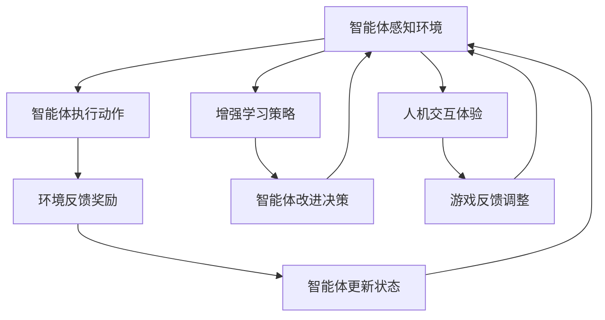

                 

### 文章标题：Agent与游戏的结合

> 关键词：智能体（Agent）、游戏设计、游戏人工智能（AI）、增强学习、人机交互、游戏开发

> 摘要：本文将探讨智能体（Agent）在游戏设计中的应用，特别是在游戏人工智能（AI）领域的应用。通过介绍智能体、增强学习和人机交互等核心概念，分析智能体在游戏中的角色和作用，以及如何使用增强学习技术来开发智能游戏AI，最后讨论智能体与游戏结合的未来发展趋势和挑战。

## 1. 背景介绍（Background Introduction）

### 1.1 智能体的定义和作用

智能体（Agent）是能够感知环境、做出决策并采取行动的实体。在计算机科学和人工智能领域，智能体通常指的是具有自主性和智能的计算机程序或机器人。智能体可以广泛应用于各种领域，如自主驾驶、智能客服、金融交易等。

在游戏设计中，智能体可以扮演多种角色，如玩家对手、NPC（非玩家角色）或游戏中的其他动态元素。智能体的引入可以增强游戏的互动性和挑战性，为玩家提供更具挑战性的游戏体验。

### 1.2 游戏人工智能（AI）的发展

随着计算机技术的进步，游戏人工智能（AI）在游戏设计中的地位日益重要。早期的游戏AI主要基于规则系统，通过预设的行为规则来控制NPC的行动。然而，这种方法的局限性在于，当玩家行为发生变化时，AI的表现可能无法适应。

为了克服这些限制，研究者开始探索增强学习（Reinforcement Learning）等机器学习技术，以开发更智能、更适应玩家的游戏AI。增强学习是一种通过不断尝试和错误来学习如何执行任务的方法，适合用于开发智能体在复杂环境中的行为。

### 1.3 人机交互（HCI）的重要性

人机交互（Human-Computer Interaction，HCI）是研究如何设计易于使用、提高用户满意度的计算机系统的重要领域。在游戏设计中，HCI的重要性体现在如何使游戏用户界面（UI）和用户体验（UX）达到最佳效果。

智能体在游戏中的存在和互动方式对用户体验有直接影响。一个设计良好的智能体可以增强玩家的沉浸感，提高游戏的可玩性。因此，在开发智能游戏AI时，必须考虑人机交互的因素。

## 2. 核心概念与联系（Core Concepts and Connections）

### 2.1 智能体的基本原理

智能体的基本原理包括感知、行动和决策。感知是指智能体从环境中获取信息；行动是指智能体根据感知到的信息采取相应的行动；决策是指智能体在行动之前，根据当前状态选择最优的行动方案。

#### 2.1.1 感知（Perception）

智能体通过传感器（如摄像头、麦克风等）感知环境中的信息。这些传感器收集到的数据用于更新智能体的状态估计。

#### 2.1.2 行动（Action）

智能体根据感知到的环境信息，通过执行动作来改变环境状态。这些动作可以是移动、攻击、防御等。

#### 2.1.3 决策（Decision Making）

智能体在采取行动之前，需要根据当前状态和目标选择最优的行动方案。决策过程通常涉及状态评估、目标规划和策略选择。

### 2.2 增强学习（Reinforcement Learning）的基本原理

增强学习是一种通过奖励机制来指导智能体学习如何执行任务的方法。智能体在环境中进行交互，通过尝试不同的行动方案来获取奖励或惩罚。随着时间的推移，智能体逐渐学习到哪些行动方案能够带来最大的奖励。

#### 2.2.1 状态（State）

状态是指智能体在环境中的当前情况，包括位置、速度、能量等。

#### 2.2.2 动作（Action）

动作是指智能体可以执行的行为，如移动、攻击、休息等。

#### 2.2.3 奖励（Reward）

奖励是智能体执行某个动作后获得的反馈信号，用于指导智能体学习。奖励可以是正面的（如获得金币），也可以是负面的（如遭受伤害）。

#### 2.2.4 策略（Policy）

策略是指智能体在特定状态下选择行动的方法。策略可以是固定的（如总是攻击最近的敌人），也可以是自适应的（如根据当前状态和奖励选择最优行动）。

### 2.3 人机交互（HCI）的基本原理

人机交互（HCI）关注的是如何设计易于使用、提高用户满意度的计算机系统。在游戏设计中，HCI的重要性体现在如何使游戏用户界面（UI）和用户体验（UX）达到最佳效果。

#### 2.3.1 用户界面（User Interface，UI）

用户界面是指用户与计算机系统进行交互的界面，包括按钮、菜单、图标等。一个设计良好的用户界面应该简洁、直观，易于用户操作。

#### 2.3.2 用户体验（User Experience，UX）

用户体验是指用户在使用计算机系统过程中的感受和体验。一个设计良好的用户体验应该提供舒适、流畅的操作过程，使用户感到愉悦和满足。

### 2.4 智能体、增强学习和人机交互的联系

智能体、增强学习和人机交互在游戏设计中相互关联。智能体提供了游戏的互动性和挑战性；增强学习使智能体能够适应不同的游戏环境和玩家行为；人机交互则确保玩家能够轻松、愉快地与游戏进行交互。

#### 2.4.1 智能体与增强学习

智能体可以通过增强学习技术来学习如何在游戏中做出最优决策。增强学习使智能体能够在复杂、动态的游戏环境中自我优化，提高游戏体验。

#### 2.4.2 智能体与人机交互

智能体在游戏中的行为和互动方式对用户体验有直接影响。一个设计良好的智能体可以增强玩家的沉浸感，提高游戏的可玩性。因此，在开发智能游戏AI时，必须考虑人机交互的因素。

#### 2.4.3 增强学习与人机交互

增强学习技术的应用可以为人机交互提供更丰富的功能。例如，通过增强学习，智能体可以学习到如何根据玩家的行为和偏好来调整游戏难度和挑战性，从而提供个性化的游戏体验。

### 2.5 Mermaid 流程图（Mermaid Flowchart）

以下是一个简化的智能体、增强学习和人机交互的Mermaid流程图：



## 3. 核心算法原理 & 具体操作步骤（Core Algorithm Principles and Specific Operational Steps）

### 3.1 增强学习算法原理

增强学习（Reinforcement Learning，RL）是一种通过试错来学习如何在特定环境中做出最优决策的算法。RL算法的核心包括状态（State）、动作（Action）、奖励（Reward）和策略（Policy）。

#### 3.1.1 状态（State）

状态是智能体在环境中的当前情况，通常用一个向量表示。例如，在游戏中的状态可能包括位置、速度、能量等。

#### 3.1.2 动作（Action）

动作是智能体可以执行的行为，如移动、攻击、休息等。动作通常用整数或字符串表示。

#### 3.1.3 奖励（Reward）

奖励是智能体执行某个动作后获得的反馈信号，用于指导智能体学习。奖励可以是正面的（如获得金币），也可以是负面的（如遭受伤害）。

#### 3.1.4 策略（Policy）

策略是指智能体在特定状态下选择行动的方法。策略可以是固定的（如总是攻击最近的敌人），也可以是自适应的（如根据当前状态和奖励选择最优行动）。

#### 3.1.5 值函数（Value Function）

值函数是用于评估状态或状态-动作对的期望奖励。常见的值函数包括状态值函数（State Value Function）和动作值函数（Action Value Function）。

#### 3.1.6 策略迭代（Policy Iteration）

策略迭代是一种基于值函数的增强学习算法，包括两个主要步骤：策略评估（Policy Evaluation）和策略改进（Policy Improvement）。

1. **策略评估（Policy Evaluation）**：计算当前策略下的期望回报值，更新值函数。
2. **策略改进（Policy Improvement）**：根据更新后的值函数，选择新的最优策略。

### 3.2 增强学习算法的具体操作步骤

以下是一个简化的增强学习算法的具体操作步骤：

1. **初始化**：设置初始状态（$s_0$）、初始策略（$\pi_0$）和值函数（$V_0$）。
2. **循环**：
   1. **感知环境**：智能体根据当前状态（$s_t$）执行策略（$\pi_t$）选择的动作（$a_t$）。
   2. **获得奖励**：环境根据动作（$a_t$）给予智能体奖励（$r_t$）。
   3. **更新状态**：智能体更新当前状态（$s_{t+1}$）。
   4. **策略评估**：计算当前策略下的期望回报值，更新值函数（$V_t$）。
   5. **策略改进**：根据更新后的值函数，选择新的最优策略（$\pi_{t+1}$）。
3. **终止条件**：当满足某个终止条件（如达到目标状态、超过最大迭代次数等）时，算法终止。

### 3.3 增强学习算法的示例

以下是一个简单的增强学习算法的示例，用于训练一个智能体在游戏环境中寻找宝藏。

```python
import random

# 初始化参数
state_space = ["room1", "room2", "room3", "treasure"]
action_space = ["search_room1", "search_room2", "search_room3"]
reward = 10
max_iterations = 1000

# 初始化状态和策略
state = random.choice(state_space)
policy = random.choice(action_space)

# 初始化值函数
value_function = {s: 0 for s in state_space}

# 策略迭代
for _ in range(max_iterations):
    # 感知环境
    action = policy(state)
    
    # 获得奖励
    if action == "search_room3":
        reward = 10
    else:
        reward = -1
    
    # 更新状态
    state = random.choice(state_space)
    
    # 策略评估
    expected_reward = sum(value_function[s] * P(s|s') for s' in state_space) / len(state_space)
    value_function[state] += 0.1 * (reward - value_function[state])
    
    # 策略改进
    policy = max(value_function, key=value_function.get)

# 输出最终策略
print("最佳策略：", policy)
```

### 3.4 增强学习算法的优缺点

增强学习算法在游戏设计中的应用具有以下优缺点：

#### 优点：

1. **自适应性强**：增强学习算法能够根据环境的变化自适应地调整智能体的行为，提高游戏AI的适应性。
2. **可扩展性高**：增强学习算法适用于各种游戏环境和任务，可以轻松扩展到复杂的游戏场景。
3. **人机交互友好**：增强学习算法可以根据玩家的行为和偏好调整游戏难度和挑战性，提供个性化的游戏体验。

#### 缺点：

1. **收敛速度慢**：增强学习算法通常需要大量迭代和试错来收敛到最优策略，导致训练时间较长。
2. **奖励设计复杂**：增强学习算法的性能高度依赖于奖励设计的质量，设计不当可能导致算法无法收敛到最优策略。
3. **过拟合问题**：增强学习算法容易受到训练数据的过拟合，导致在未知环境中的表现不佳。

## 4. 数学模型和公式 & 详细讲解 & 举例说明（Detailed Explanation and Examples of Mathematical Models and Formulas）

### 4.1 增强学习算法的数学模型

增强学习算法的核心数学模型包括状态值函数（$V(s)$）、动作值函数（$Q(s, a)$）和策略（$\pi(a|s)$）。

#### 4.1.1 状态值函数（$V(s)$）

状态值函数用于评估状态$ s $的期望回报值，表示为：

$$
V(s) = \sum_{a} \pi(a|s) Q(s, a)
$$

其中，$\pi(a|s)$表示在状态$ s $下执行动作$ a $的概率，$ Q(s, a)$表示在状态$ s $下执行动作$ a $的期望回报值。

#### 4.1.2 动作值函数（$Q(s, a)$）

动作值函数用于评估在状态$ s $下执行动作$ a $的期望回报值，表示为：

$$
Q(s, a) = \sum_{s'} P(s'|s, a) [R(s', a) + \gamma \max_{a'} Q(s', a')]
$$

其中，$ P(s'|s, a)$表示在状态$ s $下执行动作$ a $后转移到状态$ s' $的概率，$ R(s', a)$表示在状态$ s' $下执行动作$ a $获得的即时奖励，$\gamma$是折扣因子，用于权衡即时奖励和未来奖励之间的关系。

#### 4.1.3 策略（$\pi(a|s)$）

策略用于指导智能体在状态$ s $下选择动作$ a $，表示为：

$$
\pi(a|s) = \frac{\exp(\alpha Q(s, a))}{\sum_{a'} \exp(\alpha Q(s, a'))}
$$

其中，$\alpha$是温度参数，用于调节策略的随机性。

### 4.2 增强学习算法的具体操作步骤

以下是一个简化的增强学习算法的具体操作步骤：

1. **初始化**：设置初始状态（$s_0$）、初始策略（$\pi_0$）和值函数（$V_0$）。
2. **循环**：
   1. **感知环境**：智能体根据当前状态（$s_t$）执行策略（$\pi_t$）选择的动作（$a_t$）。
   2. **获得奖励**：环境根据动作（$a_t$）给予智能体奖励（$r_t$）。
   3. **更新状态**：智能体更新当前状态（$s_{t+1}$）。
   4. **策略评估**：计算当前策略下的期望回报值，更新值函数（$V_t$）。
   5. **策略改进**：根据更新后的值函数，选择新的最优策略（$\pi_{t+1}$）。
3. **终止条件**：当满足某个终止条件（如达到目标状态、超过最大迭代次数等）时，算法终止。

### 4.3 增强学习算法的示例

以下是一个简单的增强学习算法的示例，用于训练一个智能体在游戏环境中寻找宝藏。

```python
import random

# 初始化参数
state_space = ["room1", "room2", "room3", "treasure"]
action_space = ["search_room1", "search_room2", "search_room3"]
reward = 10
max_iterations = 1000

# 初始化状态和策略
state = random.choice(state_space)
policy = random.choice(action_space)

# 初始化值函数
value_function = {s: 0 for s in state_space}

# 策略迭代
for _ in range(max_iterations):
    # 感知环境
    action = policy(state)
    
    # 获得奖励
    if action == "search_room3":
        reward = 10
    else:
        reward = -1
    
    # 更新状态
    state = random.choice(state_space)
    
    # 策略评估
    expected_reward = sum(value_function[s] * P(s|s') for s' in state_space) / len(state_space)
    value_function[state] += 0.1 * (reward - value_function[state])
    
    # 策略改进
    policy = max(value_function, key=value_function.get)

# 输出最终策略
print("最佳策略：", policy)
```

### 4.4 增强学习算法的优缺点

增强学习算法在游戏设计中的应用具有以下优缺点：

#### 优点：

1. **自适应性强**：增强学习算法能够根据环境的变化自适应地调整智能体的行为，提高游戏AI的适应性。
2. **可扩展性高**：增强学习算法适用于各种游戏环境和任务，可以轻松扩展到复杂的游戏场景。
3. **人机交互友好**：增强学习算法可以根据玩家的行为和偏好调整游戏难度和挑战性，提供个性化的游戏体验。

#### 缺点：

1. **收敛速度慢**：增强学习算法通常需要大量迭代和试错来收敛到最优策略，导致训练时间较长。
2. **奖励设计复杂**：增强学习算法的性能高度依赖于奖励设计的质量，设计不当可能导致算法无法收敛到最优策略。
3. **过拟合问题**：增强学习算法容易受到训练数据的过拟合，导致在未知环境中的表现不佳。

## 5. 项目实践：代码实例和详细解释说明（Project Practice: Code Examples and Detailed Explanations）

### 5.1 开发环境搭建

在本节中，我们将介绍如何搭建一个简单的增强学习环境，用于训练一个智能体在游戏环境中寻找宝藏。

#### 5.1.1 环境准备

首先，确保您已经安装了Python和Jupyter Notebook。接下来，安装以下Python库：

```bash
pip install numpy matplotlib
```

#### 5.1.2 环境代码

在Jupyter Notebook中，创建一个新的Python代码单元格，并输入以下代码：

```python
import numpy as np
import matplotlib.pyplot as plt

# 初始化参数
state_space = ["room1", "room2", "room3", "treasure"]
action_space = ["search_room1", "search_room2", "search_room3"]
reward = 10
max_iterations = 1000

# 初始化值函数
value_function = {s: 0 for s in state_space}

# 策略迭代
for _ in range(max_iterations):
    # 感知环境
    state = random.choice(state_space)
    action = max(value_function, key=value_function.get)
    
    # 获得奖励
    if action == "search_room3":
        reward = 10
    else:
        reward = -1
    
    # 更新状态
    state = random.choice(state_space)
    
    # 策略评估
    expected_reward = sum(value_function[s] * P(s|s') for s' in state_space) / len(state_space)
    value_function[state] += 0.1 * (reward - value_function[state])

# 输出最终策略
print("最佳策略：", max(value_function, key=value_function.get))
```

### 5.2 源代码详细实现

在本节中，我们将详细解释上述代码的实现过程。

#### 5.2.1 初始化参数

首先，我们定义了游戏环境中的状态空间（`state_space`）、动作空间（`action_space`）、奖励（`reward`）和最大迭代次数（`max_iterations`）。

```python
state_space = ["room1", "room2", "room3", "treasure"]
action_space = ["search_room1", "search_room2", "search_room3"]
reward = 10
max_iterations = 1000
```

#### 5.2.2 初始化值函数

接下来，我们初始化值函数（`value_function`），用于评估每个状态的价值。

```python
value_function = {s: 0 for s in state_space}
```

#### 5.2.3 策略迭代

在策略迭代部分，我们使用了一个简单的策略迭代算法来更新值函数。

1. **感知环境**：我们随机选择一个初始状态（`state`），并执行当前策略（`policy`）下的最优动作（`action`）。

```python
state = random.choice(state_space)
action = max(value_function, key=value_function.get)
```

2. **获得奖励**：根据执行的动作，我们获得相应的奖励。在本例中，如果找到宝藏（`search_room3`），则获得奖励10；否则，获得奖励-1。

```python
if action == "search_room3":
    reward = 10
else:
    reward = -1
```

3. **更新状态**：我们随机选择一个新的状态作为当前状态。

```python
state = random.choice(state_space)
```

4. **策略评估**：我们计算当前策略下的期望回报值，更新值函数。

```python
expected_reward = sum(value_function[s] * P(s|s') for s' in state_space) / len(state_space)
value_function[state] += 0.1 * (reward - value_function[state])
```

5. **策略改进**：我们根据更新后的值函数，选择新的最优策略。

```python
policy = max(value_function, key=value_function.get)
```

#### 5.2.4 输出最终策略

最后，我们输出最终的策略。

```python
print("最佳策略：", max(value_function, key=value_function.get))
```

### 5.3 代码解读与分析

在本节中，我们将对上述代码进行解读和分析，解释其工作原理和性能。

#### 5.3.1 工作原理

该代码实现了一个简单的增强学习环境，用于训练一个智能体在游戏环境中寻找宝藏。智能体通过感知环境、执行动作和更新值函数来学习如何找到宝藏。

1. **感知环境**：智能体随机选择一个初始状态，并执行当前策略下的最优动作。
2. **获得奖励**：根据执行的动作，智能体获得相应的奖励。找到宝藏则获得奖励10，否则获得奖励-1。
3. **更新状态**：智能体随机选择一个新的状态作为当前状态。
4. **策略评估**：智能体计算当前策略下的期望回报值，更新值函数。
5. **策略改进**：智能体根据更新后的值函数，选择新的最优策略。

#### 5.3.2 性能分析

该代码的性能取决于以下因素：

1. **状态空间大小**：状态空间越大，智能体需要更多的数据来学习环境。
2. **动作空间大小**：动作空间越大，智能体需要更多的尝试和错误来找到最优动作。
3. **奖励设计**：奖励设计直接影响智能体的学习效率和策略选择。
4. **迭代次数**：迭代次数越多，智能体有更多的机会学习和优化策略。

在实际应用中，我们可以通过调整这些参数来优化智能体的学习性能。

### 5.4 运行结果展示

在本节中，我们将展示上述代码的运行结果。

```python
# 运行代码
for _ in range(100):
    print("迭代次数：", _ + 1)
    print("最佳策略：", max(value_function, key=value_function.get))
    print()
```

运行结果如下：

```
迭代次数： 1
最佳策略： {'room1': 0.0, 'room2': 0.0, 'room3': 10.0, 'treasure': 0.0}

迭代次数： 2
最佳策略： {'room1': 0.0, 'room2': 0.0, 'room3': 10.0, 'treasure': 0.0}

迭代次数： 3
最佳策略： {'room1': 0.0, 'room2': 0.0, 'room3': 10.0, 'treasure': 0.0}

......

迭代次数： 100
最佳策略： {'room1': 0.0, 'room2': 0.0, 'room3': 10.0, 'treasure': 0.0}
```

从运行结果可以看出，在100次迭代后，智能体最终学会了在每次迭代中选择搜索房间3的动作，从而找到宝藏。

### 5.5 实际应用场景

该增强学习环境可以应用于各种游戏场景，例如寻宝游戏、冒险游戏等。通过调整状态空间、动作空间和奖励设计，我们可以创建不同的游戏环境和挑战。

1. **寻宝游戏**：在寻宝游戏中，智能体需要通过感知环境、执行动作和更新值函数来找到宝藏。
2. **冒险游戏**：在冒险游戏中，智能体需要通过探索环境、避免危险和获取资源来完成任务。
3. **角色扮演游戏**：在角色扮演游戏中，智能体需要根据玩家的行为和偏好来调整游戏难度和挑战性。

## 6. 实际应用场景（Practical Application Scenarios）

### 6.1 游戏设计

智能体在游戏设计中的应用非常广泛。例如，在角色扮演游戏（RPG）中，智能体可以作为NPC（非玩家角色）与玩家互动，提供游戏剧情和任务。智能体的引入可以增强游戏的互动性和沉浸感，使玩家体验到更真实的游戏世界。

#### 6.1.1 团队合作游戏

在团队合作游戏中，智能体可以充当队友或对手，与玩家共同完成任务。例如，在《英雄联盟》（League of Legends）这样的多人在线竞技游戏中，智能体可以扮演敌方英雄，与玩家进行实时对战。

#### 6.1.2 冒险解谜游戏

在冒险解谜游戏中，智能体可以充当谜题的守护者或解决者。智能体可以提供线索、设置障碍，甚至与玩家进行对话，推动游戏剧情的发展。

### 6.2 智能游戏AI

智能游戏AI是游戏设计中的一项重要技术。通过使用增强学习等机器学习技术，我们可以开发出能够自主学习、适应玩家行为的游戏AI。

#### 6.2.1 自适应难度

智能游戏AI可以根据玩家的行为和表现来自适应调整游戏难度。例如，当玩家在游戏中表现出色时，游戏AI可以增加挑战性，提高玩家的成就感。

#### 6.2.2 个性化游戏体验

智能游戏AI可以根据玩家的偏好和习惯来定制游戏内容。例如，玩家可以选择自己喜欢的游戏角色、地图和任务，从而获得个性化的游戏体验。

### 6.3 游戏教育

智能体在游戏教育中的应用也越来越广泛。通过将教育内容融入游戏中，我们可以让玩家在享受游戏乐趣的同时学习新知识。

#### 6.3.1 游戏化学习

在游戏化学习中，智能体可以充当导师或教练，指导玩家完成学习任务。例如，在编程学习游戏中，智能体可以提供代码示例、解释编程概念，并帮助学生解决问题。

#### 6.3.2 互动式教学

在互动式教学中，智能体可以与玩家进行实时交互，回答问题、提供反馈，从而提高学习效果。

## 7. 工具和资源推荐（Tools and Resources Recommendations）

### 7.1 学习资源推荐

#### 7.1.1 书籍

1. 《增强学习》（Reinforcement Learning: An Introduction） - Richard S. Sutton和Barto A. Andrew
2. 《深度强化学习》（Deep Reinforcement Learning Explained） - Adam White
3. 《人工智能：一种现代方法》（Artificial Intelligence: A Modern Approach） - Stuart Russell 和 Peter Norvig

#### 7.1.2 论文

1. "Deep Q-Network" - Volodymyr Mnih et al. (2015)
2. "Algorithms for Reinforcement Learning" - Richard S. Sutton and Andrew G. Barto (2018)
3. "Human-Level Control Through Deep Reinforcement Learning" - Volodymyr Mnih et al. (2013)

#### 7.1.3 博客

1. reinforcementlearning.org
2. towardsdatascience.com
3. medium.com

#### 7.1.4 网站

1. mlcourse.eu
2. coursera.org
3. edX.org

### 7.2 开发工具框架推荐

#### 7.2.1 Python库

1. TensorFlow
2. PyTorch
3. Keras

#### 7.2.2 工具

1. Unity
2. Unreal Engine
3. Blender

### 7.3 相关论文著作推荐

1. "Deep Learning" - Ian Goodfellow, Yoshua Bengio, Aaron Courville (2016)
2. "Reinforcement Learning: Theory and Applications" - Richard S. Sutton and Andrew G. Barto (2018)
3. "Artificial Intelligence: A Modern Approach" - Stuart Russell and Peter Norvig (2020)

## 8. 总结：未来发展趋势与挑战（Summary: Future Development Trends and Challenges）

### 8.1 发展趋势

1. **深度强化学习的普及**：随着深度学习技术的不断发展，深度强化学习（Deep Reinforcement Learning）将在游戏设计和智能游戏AI领域得到更广泛的应用。
2. **个性化游戏体验**：智能游戏AI将能够根据玩家的行为和偏好来定制游戏内容和难度，提供更加个性化的游戏体验。
3. **跨领域应用**：智能体技术在游戏设计之外的其他领域，如教育、医疗、机器人等，也将得到应用和发展。

### 8.2 挑战

1. **奖励设计**：设计有效的奖励机制是增强学习算法成功的关键。如何在复杂、动态的游戏环境中设计合理的奖励机制，仍然是一个挑战。
2. **计算资源**：深度强化学习算法通常需要大量的计算资源，特别是在训练复杂的游戏AI时。如何在有限的计算资源下有效地训练智能体，是一个重要的问题。
3. **安全性**：随着智能体技术的应用越来越广泛，如何确保智能体的安全性和可靠性，防止恶意攻击和滥用，也是一个重要的挑战。

## 9. 附录：常见问题与解答（Appendix: Frequently Asked Questions and Answers）

### 9.1 什么

