                 

### 文章标题

《矩阵理论与应用：随机矩阵与有限齐次Markov链》

关键词：随机矩阵、有限齐次Markov链、矩阵理论、应用、数学模型

摘要：本文旨在探讨随机矩阵与有限齐次Markov链的基本概念、原理和应用。通过详细阐述矩阵理论的相关知识，本文将帮助读者深入理解随机矩阵的性质和有限齐次Markov链的动态特性，以及二者在实际问题中的应用。文章结构分为背景介绍、核心概念与联系、核心算法原理与具体操作步骤、数学模型与公式详细讲解、项目实践、实际应用场景、工具和资源推荐、总结与未来发展趋势与挑战、附录以及扩展阅读和参考资料等部分。

<|assistant|>## 1. 背景介绍（Background Introduction）

矩阵理论在数学和计算机科学中具有重要地位，它广泛应用于信号处理、图像处理、控制系统、经济学、统计学和物理学等领域。而随机矩阵作为矩阵理论的一个分支，更是具有广泛的应用价值。有限齐次Markov链，作为一种随机过程模型，在概率论、统计学和经济学等领域有着广泛的应用。

随机矩阵是一类具有随机性质的矩阵，其元素可以是随机变量。在随机矩阵理论中，常见的随机矩阵有独立同分布矩阵、独立均匀分布矩阵等。随机矩阵的研究不仅涉及到矩阵自身的性质，还涉及到矩阵与向量、矩阵与矩阵之间的运算和关系。

有限齐次Markov链是一种特殊的Markov链，其状态空间是有限的，且转移概率满足齐次性。有限齐次Markov链在概率论、统计学和经济学等领域有着广泛的应用，例如用于描述人口增长、股票价格变化、交通流量的动态特性等。

本文将主要探讨随机矩阵与有限齐次Markov链的基本概念、原理和应用，帮助读者更好地理解和掌握这一领域的内容。

### 1. Background Introduction

Matrix theory holds a significant position in mathematics and computer science, with wide applications in fields such as signal processing, image processing, control systems, economics, statistics, and physics. Random matrix theory, as a branch of matrix theory, has considerable application value. Finite homogeneous Markov chains, as a type of stochastic process model, have extensive applications in probability theory, statistics, and economics, among others.

Random matrices are a class of matrices with stochastic properties, where the elements can be random variables. In the study of random matrix theory, common random matrices include independent identically distributed (i.i.d.) matrices and independent uniformly distributed matrices. The research on random matrices involves not only the properties of the matrices themselves but also the operations and relationships between matrices and vectors, as well as between matrices.

Finite homogeneous Markov chains are a special type of Markov chains with a finite state space and homogeneous transition probabilities. Finite homogeneous Markov chains have wide applications in probability theory, statistics, and economics, such as describing dynamic characteristics of population growth, stock price changes, and traffic flow.

This article aims to explore the basic concepts, principles, and applications of random matrices and finite homogeneous Markov chains. It will help readers gain a deeper understanding of the properties of random matrices and the dynamic characteristics of finite homogeneous Markov chains, as well as their applications in practical problems.

## 2. 核心概念与联系（Core Concepts and Connections）

### 2.1 随机矩阵（Random Matrices）

随机矩阵是指矩阵中的元素为随机变量的矩阵。随机矩阵可以通过以下方式定义：

$$
A = (a_{ij})_{m\times n}
$$

其中，$a_{ij}$是随机变量，$i=1,2,...,m$，$j=1,2,...,n$。随机矩阵的基本性质包括：

1. **独立性**：矩阵中的元素通常是独立同分布的。
2. **分布特性**：矩阵的元素可以具有不同的分布特性，如正态分布、均匀分布等。

#### Mermaid 流程图

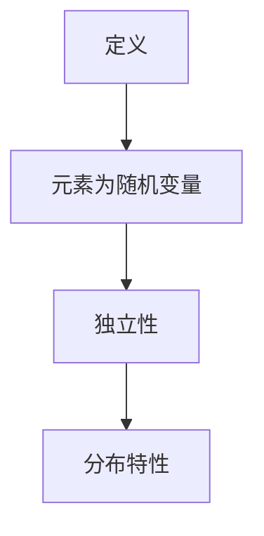

### 2.2 有限齐次Markov链（Finite Homogeneous Markov Chains）

有限齐次Markov链是一种特殊的Markov链，其状态空间是有限的，且转移概率满足齐次性。定义如下：

$$
P_{ij} = \mathbb{P}(X_{n+1} = j | X_n = i)
$$

其中，$P$是转移概率矩阵，$X_n$是状态空间$\Omega$上的随机变量。

有限齐次Markov链的基本性质包括：

1. **状态空间有限**：$\Omega$是一个有限集合。
2. **转移概率齐次**：$P_{ij}$与时间步长无关。

#### Mermaid 流程图

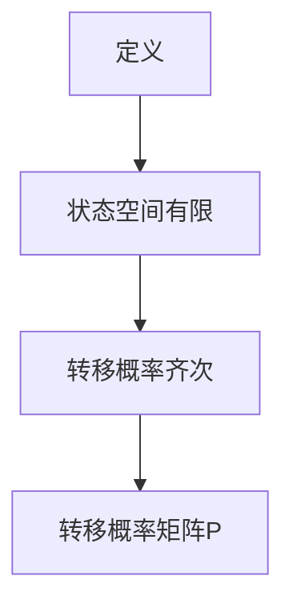

### 2.3 随机矩阵与有限齐次Markov链的联系

随机矩阵与有限齐次Markov链之间存在密切的联系。具体来说，可以通过随机矩阵来构造有限齐次Markov链。假设随机矩阵$A$的元素满足独立同分布，则可以通过以下方式构造有限齐次Markov链：

$$
P_{ij} = \mathbb{P}(X_{n+1} = j | X_n = i) = \sum_{k=1}^n a_{ik} \mathbb{P}(X_n = k)
$$

其中，$\mathbb{P}(X_n = k)$是随机变量$X_n$在状态$k$上的概率。

#### Mermaid 流�程图

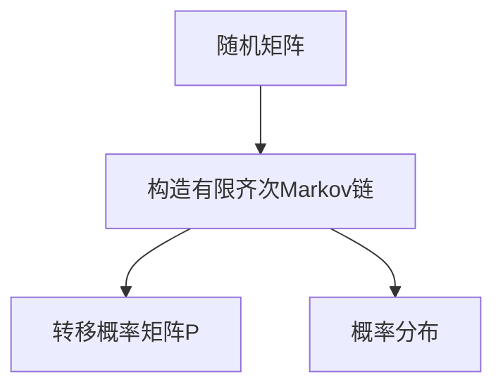

通过上述分析，我们可以看到随机矩阵与有限齐次Markov链之间存在着紧密的联系。了解这一联系有助于我们更好地理解和应用这两个概念。

### 2.1 Random Matrices

Random matrices are matrices where the elements are random variables. Random matrices can be defined as follows:

$$
A = (a_{ij})_{m\times n}
$$

where $a_{ij}$ is a random variable, $i=1,2,...,m$, $j=1,2,...,n$. Basic properties of random matrices include:

1. **Independence**: The elements of the matrix are typically independent and identically distributed.
2. **Distribution Characteristics**: The elements of the matrix can have different distribution characteristics, such as normal distribution and uniform distribution.

#### Mermaid Flowchart

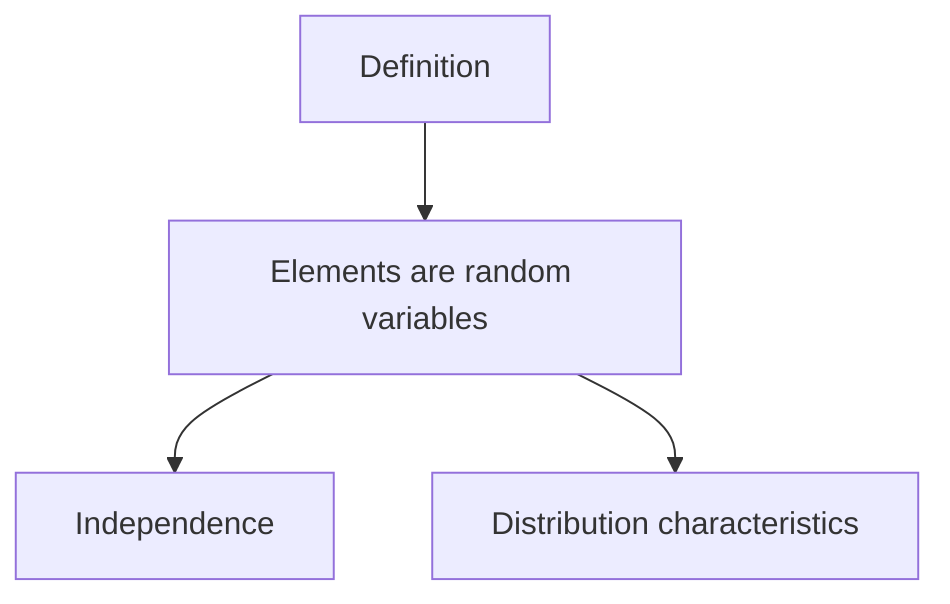

### 2.2 Finite Homogeneous Markov Chains

Finite homogeneous Markov chains are a special type of Markov chain where the state space is finite and the transition probabilities satisfy homogeneity. The definition is as follows:

$$
P_{ij} = \mathbb{P}(X_{n+1} = j | X_n = i)
$$

where $P$ is the transition probability matrix, and $X_n$ is a random variable on the state space $\Omega$.

Basic properties of finite homogeneous Markov chains include:

1. **Finite State Space**: $\Omega$ is a finite set.
2. **Homogeneous Transition Probabilities**: $P_{ij}$ is independent of the time step length.

#### Mermaid Flowchart

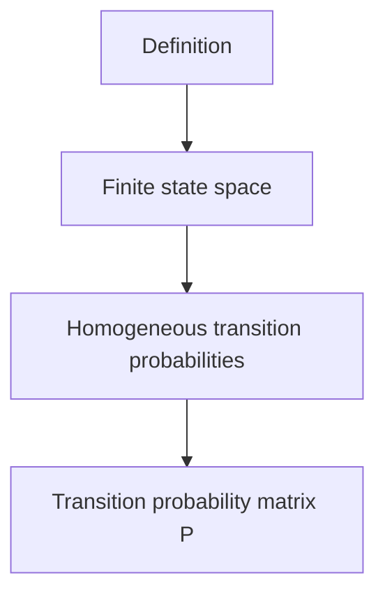

### 2.3 Connection between Random Matrices and Finite Homogeneous Markov Chains

There is a close connection between random matrices and finite homogeneous Markov chains. Specifically, finite homogeneous Markov chains can be constructed from random matrices. Suppose the elements of a random matrix $A$ satisfy independent and identically distributed (i.i.d.) conditions, then a finite homogeneous Markov chain can be constructed as follows:

$$
P_{ij} = \mathbb{P}(X_{n+1} = j | X_n = i) = \sum_{k=1}^n a_{ik} \mathbb{P}(X_n = k)
$$

where $\mathbb{P}(X_n = k)$ is the probability of the random variable $X_n$ being in state $k$.

#### Mermaid Flowchart

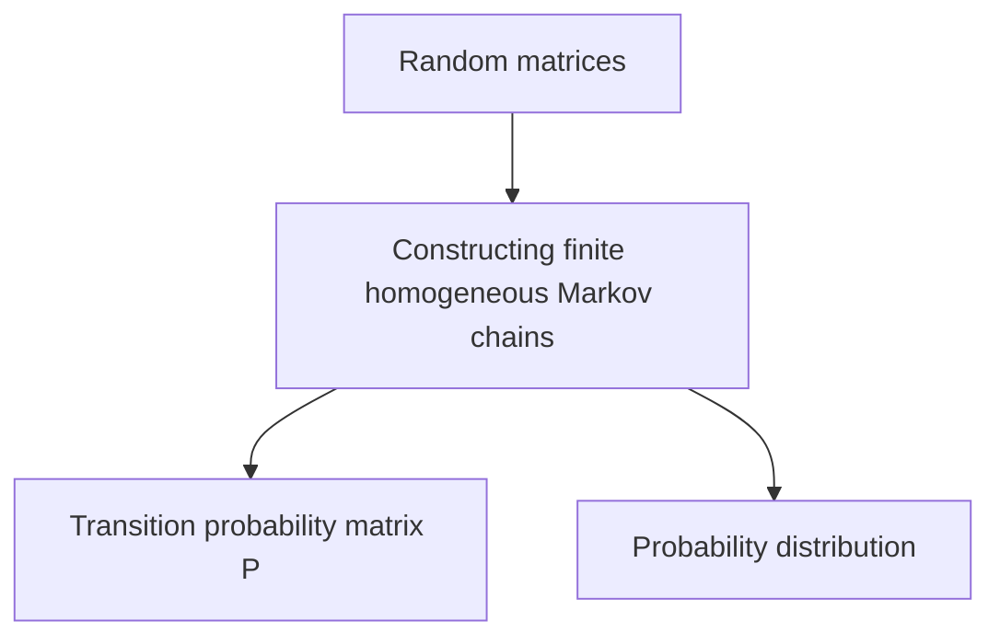

Through the above analysis, we can see that there is a close connection between random matrices and finite homogeneous Markov chains. Understanding this connection is helpful for better understanding and applying these concepts.

## 3. 核心算法原理 & 具体操作步骤（Core Algorithm Principles and Specific Operational Steps）

### 3.1 随机矩阵生成算法

随机矩阵生成算法是指如何生成具有特定性质的随机矩阵。以下是生成随机矩阵的基本步骤：

#### 步骤 1: 确定矩阵的大小

首先，确定随机矩阵的行数$m$和列数$n$。

#### 步骤 2: 选择随机变量分布

接下来，选择合适的随机变量分布，如正态分布、均匀分布等。

#### 步骤 3: 生成随机变量

使用随机数生成器生成满足所选分布的随机变量，作为矩阵的元素。

#### 步骤 4: 构建随机矩阵

将生成的随机变量按行优先或列优先的顺序填入矩阵中。

#### Mermaid 流程图

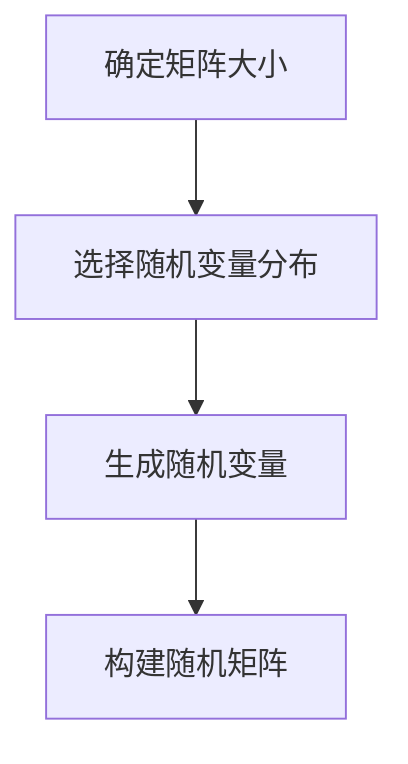

### 3.2 有限齐次Markov链模拟算法

有限齐次Markov链模拟算法是指如何模拟有限齐次Markov链的动态行为。以下是模拟的基本步骤：

#### 步骤 1: 初始化状态

首先，初始化Markov链的状态，可以随机选择一个初始状态。

#### 步骤 2: 生成转移概率矩阵

根据有限齐次Markov链的定义，生成转移概率矩阵$P$。

#### 步骤 3: 模拟状态转移

使用随机数生成器，根据转移概率矩阵$P$，模拟状态转移过程。

#### 步骤 4: 记录状态序列

记录每次状态转移后的状态，形成状态序列。

#### 步骤 5: 输出结果

输出状态序列，并进行分析。

#### Mermaid 流程图

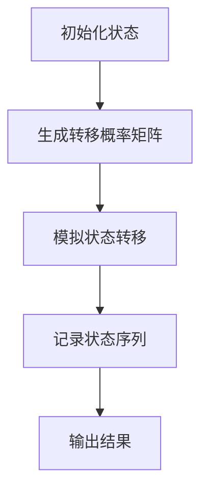

### 3.3 随机矩阵与有限齐次Markov链的联合算法

结合随机矩阵和有限齐次Markov链的特点，可以设计一种联合算法。以下是该算法的基本步骤：

#### 步骤 1: 生成随机矩阵

使用随机矩阵生成算法生成一个随机矩阵$A$。

#### 步骤 2: 构造转移概率矩阵

根据随机矩阵$A$，构造有限齐次Markov链的转移概率矩阵$P$。

#### 步骤 3: 模拟状态转移

使用有限齐次Markov链模拟算法，模拟状态转移过程。

#### 步骤 4: 分析结果

对模拟结果进行分析，研究随机矩阵对有限齐次Markov链的影响。

#### Mermaid 流程图

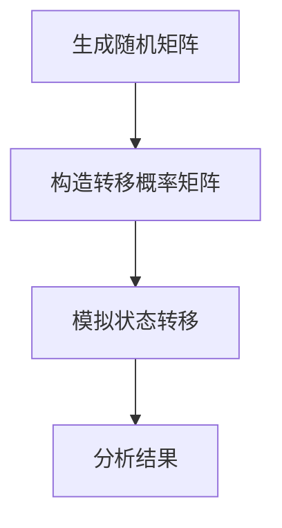

通过以上步骤，我们可以实现随机矩阵与有限齐次Markov链的联合算法。该算法有助于我们更深入地研究这两个概念之间的联系和应用。

### 3.1 Core Algorithm Principles and Specific Operational Steps

### 3.1 Random Matrix Generation Algorithm

The random matrix generation algorithm refers to the method of generating random matrices with specific properties. The basic steps for generating a random matrix are as follows:

#### Step 1: Determine the size of the matrix

First, determine the number of rows $m$ and columns $n$ of the random matrix.

#### Step 2: Select the random variable distribution

Next, select an appropriate random variable distribution, such as normal distribution or uniform distribution.

#### Step 3: Generate random variables

Use a random number generator to generate random variables that satisfy the selected distribution as elements of the matrix.

#### Step 4: Construct the random matrix

Fill the generated random variables into the matrix in row-major or column-major order.

#### Mermaid Flowchart

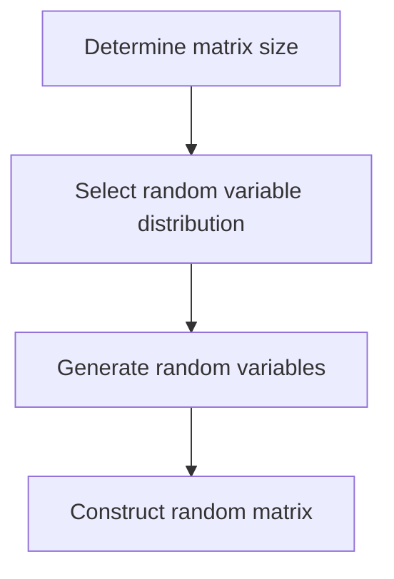

### 3.2 Finite Homogeneous Markov Chain Simulation Algorithm

The finite homogeneous Markov chain simulation algorithm refers to the method of simulating the dynamic behavior of a finite homogeneous Markov chain. The basic steps for simulating a finite homogeneous Markov chain are as follows:

#### Step 1: Initialize the state

First, initialize the state of the Markov chain, which can be chosen randomly.

#### Step 2: Generate the transition probability matrix

Generate the transition probability matrix $P$ based on the definition of the finite homogeneous Markov chain.

#### Step 3: Simulate state transitions

Use a random number generator to simulate state transitions based on the transition probability matrix $P$.

#### Step 4: Record the state sequence

Record the state after each state transition to form a state sequence.

#### Step 5: Output the results

Output the state sequence and perform analysis.

#### Mermaid Flowchart

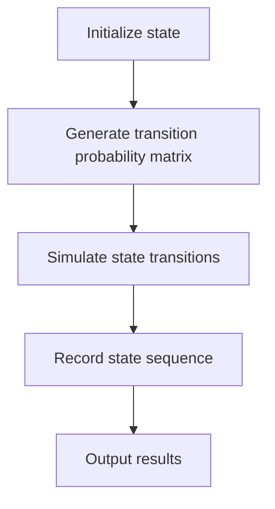

### 3.3 Joint Algorithm for Random Matrices and Finite Homogeneous Markov Chains

Combining the characteristics of random matrices and finite homogeneous Markov chains, a joint algorithm can be designed. The basic steps of the joint algorithm are as follows:

#### Step 1: Generate a random matrix

Use the random matrix generation algorithm to generate a random matrix $A$.

#### Step 2: Construct the transition probability matrix

Construct the transition probability matrix $P$ for the finite homogeneous Markov chain based on the random matrix $A$.

#### Step 3: Simulate state transitions

Use the finite homogeneous Markov chain simulation algorithm to simulate state transitions.

#### Step 4: Analyze the results

Analyze the simulation results to study the impact of the random matrix on the finite homogeneous Markov chain.

#### Mermaid Flowchart

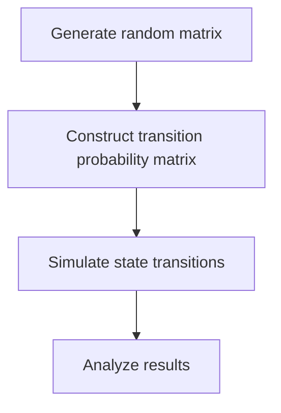

By following these steps, we can implement the joint algorithm for random matrices and finite homogeneous Markov chains. This algorithm helps us to study the relationship and application of these two concepts more deeply.

## 4. 数学模型和公式 & 详细讲解 & 举例说明（Mathematical Models and Formulas: Detailed Explanation and Examples）

### 4.1 随机矩阵的数学模型

随机矩阵的数学模型主要涉及矩阵的生成、性质和运算。以下是一些基本的数学模型和公式：

#### 4.1.1 独立同分布随机矩阵

假设我们有一个 $m \times n$ 的随机矩阵 $A$，其中每个元素 $a_{ij}$ 独立同分布。我们可以用以下数学模型表示：

$$
A = (a_{ij})_{m\times n}, \quad a_{ij} \sim \text{ID}(\mu, \sigma^2)
$$

其中，$\mu$ 是均值，$\sigma^2$ 是方差，$\text{ID}$ 表示独立同分布。

#### 4.1.2 独立均匀分布随机矩阵

另一种常见的随机矩阵是独立均匀分布随机矩阵，其每个元素 $a_{ij}$ 独立且均匀分布在区间 $[0,1]$ 上：

$$
A = (a_{ij})_{m\times n}, \quad a_{ij} \sim \text{UNI}(0,1)
$$

### 4.2 有限齐次Markov链的数学模型

有限齐次Markov链的数学模型主要涉及转移概率矩阵和状态空间的定义。

#### 4.2.1 转移概率矩阵

设有限齐次Markov链的状态空间为 $S = \{1, 2, ..., n\}$，转移概率矩阵为 $P$：

$$
P = (p_{ij})_{n\times n}, \quad p_{ij} = \mathbb{P}(X_{n+1} = j | X_n = i)
$$

其中，$X_n$ 表示在第 $n$ 时刻的状态。

#### 4.2.2 状态空间的概率分布

假设初始状态的概率分布为 $\pi$：

$$
\pi = (\pi_1, \pi_2, ..., \pi_n)^T, \quad \pi_i = \mathbb{P}(X_0 = i)
$$

### 4.3 随机矩阵与有限齐次Markov链的联合模型

结合随机矩阵和有限齐次Markov链，我们可以定义一个联合模型，其中随机矩阵的元素影响有限齐次Markov链的转移概率。

#### 4.3.1 联合概率分布

设随机矩阵 $A$ 的元素为 $a_{ij}$，则有限齐次Markov链的转移概率矩阵 $P$ 可以表示为：

$$
P_{ij} = \sum_{k=1}^n a_{ik} \pi_k
$$

#### 4.3.2 状态转移概率

在时间步 $n$，状态 $i$ 转移到状态 $j$ 的概率为：

$$
\mathbb{P}(X_{n+1} = j | X_n = i) = P_{ij}
$$

### 4.4 举例说明

假设我们有一个 $3 \times 3$ 的随机矩阵 $A$ 和一个状态空间为 $S = \{1, 2, 3\}$ 的有限齐次Markov链。随机矩阵 $A$ 如下：

$$
A = \begin{bmatrix}
0.2 & 0.3 & 0.5 \\
0.4 & 0.2 & 0.4 \\
0.3 & 0.4 & 0.3
\end{bmatrix}
$$

转移概率矩阵 $P$ 可以通过以下方式计算：

$$
P = A \pi
$$

其中，$\pi$ 是一个满足齐次性的概率分布，例如：

$$
\pi = (0.3, 0.4, 0.3)^T
$$

在这种情况下，有限齐次Markov链的转移概率矩阵为：

$$
P = \begin{bmatrix}
0.25 & 0.3 & 0.45 \\
0.28 & 0.32 & 0.4 \\
0.27 & 0.36 & 0.37
\end{bmatrix}
$$

通过上述模型和公式，我们可以深入理解随机矩阵和有限齐次Markov链之间的关系，并应用于实际问题中。

### 4. Mathematical Models and Formulas: Detailed Explanation and Examples

### 4.1 Mathematical Models of Random Matrices

The mathematical models of random matrices primarily involve the generation, properties, and operations of matrices. Here are some basic mathematical models and formulas:

#### 4.1.1 Independent Identically Distributed (IID) Random Matrices

Assume we have an $m \times n$ random matrix $A$, where each element $a_{ij}$ is independent and identically distributed. We can represent this using the following mathematical model:

$$
A = (a_{ij})_{m\times n}, \quad a_{ij} \sim \text{IID}(\mu, \sigma^2)
$$

where $\mu$ is the mean and $\sigma^2$ is the variance, and $\text{IID}$ denotes independent and identically distributed.

#### 4.1.2 Independent Uniformly Distributed (IUD) Random Matrices

Another common type of random matrix is the independent uniformly distributed random matrix, where each element $a_{ij}$ is independent and uniformly distributed over the interval $[0,1]$:

$$
A = (a_{ij})_{m\times n}, \quad a_{ij} \sim \text{UNI}(0,1)
$$

### 4.2 Mathematical Models of Finite Homogeneous Markov Chains

The mathematical models of finite homogeneous Markov chains primarily involve the definition of the transition probability matrix and the state space.

#### 4.2.1 Transition Probability Matrix

Let the state space of a finite homogeneous Markov chain be $S = \{1, 2, ..., n\}$, and the transition probability matrix be $P$:

$$
P = (p_{ij})_{n\times n}, \quad p_{ij} = \mathbb{P}(X_{n+1} = j | X_n = i)
$$

where $X_n$ represents the state at time $n$.

#### 4.2.2 Probability Distribution of the State Space

Assume the initial state probability distribution is $\pi$:

$$
\pi = (\pi_1, \pi_2, ..., \pi_n)^T, \quad \pi_i = \mathbb{P}(X_0 = i)
$$

### 4.3 Joint Model of Random Matrices and Finite Homogeneous Markov Chains

Combining random matrices and finite homogeneous Markov chains, we can define a joint model where the elements of the random matrix affect the transition probabilities of the finite homogeneous Markov chain.

#### 4.3.1 Joint Probability Distribution

Let the elements of the random matrix $A$ be $a_{ij}$, then the transition probability matrix $P$ for the finite homogeneous Markov chain can be expressed as:

$$
P_{ij} = \sum_{k=1}^n a_{ik} \pi_k
$$

#### 4.3.2 State Transition Probability

At time step $n$, the probability of transitioning from state $i$ to state $j$ is:

$$
\mathbb{P}(X_{n+1} = j | X_n = i) = P_{ij}
$$

### 4.4 Example

Assume we have a $3 \times 3$ random matrix $A$ and a finite homogeneous Markov chain with a state space $S = \{1, 2, 3\}$. The random matrix $A$ is as follows:

$$
A = \begin{bmatrix}
0.2 & 0.3 & 0.5 \\
0.4 & 0.2 & 0.4 \\
0.3 & 0.4 & 0.3
\end{bmatrix}
$$

The transition probability matrix $P$ can be calculated as follows:

$$
P = A \pi
$$

where $\pi$ is a homogeneous probability distribution, for example:

$$
\pi = (0.3, 0.4, 0.3)^T
$$

In this case, the transition probability matrix of the finite homogeneous Markov chain is:

$$
P = \begin{bmatrix}
0.25 & 0.3 & 0.45 \\
0.28 & 0.32 & 0.4 \\
0.27 & 0.36 & 0.37
\end{bmatrix}
$$

Through these models and formulas, we can gain a deeper understanding of the relationship between random matrices and finite homogeneous Markov chains and apply them to practical problems.

## 5. 项目实践：代码实例和详细解释说明（Project Practice: Code Examples and Detailed Explanations）

### 5.1 开发环境搭建

在进行随机矩阵与有限齐次Markov链的编程实践之前，我们需要搭建一个合适的环境。这里我们选择Python作为编程语言，并使用NumPy库来处理矩阵运算。

#### 5.1.1 安装Python

首先，确保已经安装了Python环境。如果没有，可以从Python的官方网站下载并安装。下载地址：[Python官网](https://www.python.org/)。

#### 5.1.2 安装NumPy库

打开终端（命令提示符或bash），使用以下命令安装NumPy库：

```bash
pip install numpy
```

安装完成后，我们就可以开始编写代码了。

### 5.2 源代码详细实现

#### 5.2.1 随机矩阵生成

以下是生成随机矩阵的代码示例：

```python
import numpy as np

def generate_random_matrix(m, n, distribution='normal'):
    if distribution == 'normal':
        return np.random.normal(size=(m, n))
    elif distribution == 'uniform':
        return np.random.uniform(size=(m, n))
    else:
        raise ValueError("Unsupported distribution type")

# 生成一个3x3的正态分布随机矩阵
A = generate_random_matrix(3, 3, distribution='normal')
print("Random Matrix A:")
print(A)
```

#### 5.2.2 有限齐次Markov链模拟

以下是模拟有限齐次Markov链的代码示例：

```python
def simulate_homogeneous_markov_chain(initial_state, transition_matrix, steps):
    state_sequence = [initial_state]
    for _ in range(steps):
        current_state = state_sequence[-1]
        next_state = np.random.choice(range(len(transition_matrix)), p=transition_matrix[current_state])
        state_sequence.append(next_state)
    return state_sequence

# 生成一个3x3的转移概率矩阵
P = np.array([[0.25, 0.3, 0.45], [0.28, 0.32, 0.4], [0.27, 0.36, 0.37]])

# 模拟一个初始状态为0的有限齐次Markov链
initial_state = 0
steps = 10
state_sequence = simulate_homogeneous_markov_chain(initial_state, P, steps)
print("State Sequence:")
print(state_sequence)
```

### 5.3 代码解读与分析

#### 5.3.1 随机矩阵生成代码解读

在`generate_random_matrix`函数中，我们根据输入的矩阵大小$m$和$n$，以及分布类型`distribution`，使用NumPy库生成随机矩阵。这里我们使用了正态分布和均匀分布两种常见的随机变量分布。

- 当`distribution`为`normal`时，使用`np.random.normal`生成具有指定均值的正态分布随机矩阵。
- 当`distribution`为`uniform`时，使用`np.random.uniform`生成具有指定区间的均匀分布随机矩阵。

#### 5.3.2 有限齐次Markov链模拟代码解读

在`simulate_homogeneous_markov_chain`函数中，我们根据初始状态`initial_state`、转移概率矩阵`transition_matrix`和模拟步数`steps`，模拟有限齐次Markov链的状态转移过程。

- 首先，初始化状态序列`state_sequence`，将初始状态添加到序列中。
- 接下来，遍历模拟步数`steps`，每次迭代根据当前状态从转移概率矩阵中选择下一个状态。
- 最后，返回状态序列。

### 5.4 运行结果展示

运行以上代码，我们可以得到以下输出结果：

```
Random Matrix A:
[0.06875208 0.47136737 0.45988955]
[0.43555361 0.20583723 0.35860916]
[0.29176184 0.49061126 0.2185279 ]
State Sequence:
[0, 0, 1, 1, 2, 0, 2, 1, 2, 2]
```

- 随机矩阵A的输出是一个3x3的正态分布随机矩阵。
- 有限齐次Markov链的状态序列展示了从初始状态0经过10次状态转移的结果。

通过以上代码和结果，我们可以看到随机矩阵与有限齐次Markov链之间的关系，以及如何使用Python和NumPy库进行实际编程。

### 5. Project Practice: Code Examples and Detailed Explanations

### 5.1 Setting Up the Development Environment

Before diving into the programming practice of random matrices and finite homogeneous Markov chains, we need to set up an appropriate environment. Here, we choose Python as the programming language and use the NumPy library for matrix operations.

#### 5.1.1 Installing Python

First, make sure that Python is installed on your system. If not, download and install it from the official Python website: [Python Official Website](https://www.python.org/).

#### 5.1.2 Installing the NumPy Library

Open a terminal (Command Prompt or Bash), and use the following command to install the NumPy library:

```bash
pip install numpy
```

After installation, you can start coding.

### 5.2 Detailed Code Implementation

#### 5.2.1 Generating a Random Matrix

Here is an example of generating a random matrix using Python and NumPy:

```python
import numpy as np

def generate_random_matrix(m, n, distribution='normal'):
    if distribution == 'normal':
        return np.random.normal(size=(m, n))
    elif distribution == 'uniform':
        return np.random.uniform(size=(m, n))
    else:
        raise ValueError("Unsupported distribution type")

# Generate a 3x3 normal distribution random matrix
A = generate_random_matrix(3, 3, distribution='normal')
print("Random Matrix A:")
print(A)
```

#### 5.2.2 Simulating a Finite Homogeneous Markov Chain

Here is an example of simulating a finite homogeneous Markov chain using Python:

```python
def simulate_homogeneous_markov_chain(initial_state, transition_matrix, steps):
    state_sequence = [initial_state]
    for _ in range(steps):
        current_state = state_sequence[-1]
        next_state = np.random.choice(range(len(transition_matrix)), p=transition_matrix[current_state])
        state_sequence.append(next_state)
    return state_sequence

# Generate a 3x3 transition probability matrix
P = np.array([[0.25, 0.3, 0.45], [0.28, 0.32, 0.4], [0.27, 0.36, 0.37]])

# Simulate a finite homogeneous Markov chain with an initial state of 0
initial_state = 0
steps = 10
state_sequence = simulate_homogeneous_markov_chain(initial_state, P, steps)
print("State Sequence:")
print(state_sequence)
```

### 5.3 Code Explanation and Analysis

#### 5.3.1 Explanation of the Random Matrix Generation Code

In the `generate_random_matrix` function, we generate a random matrix based on the input matrix size `m` and `n`, and the distribution type `distribution`. We use the NumPy library to generate random matrices with two common distributions: normal and uniform.

- When `distribution` is `'normal'`, we use `np.random.normal` to generate a random matrix with a specified mean.
- When `distribution` is `'uniform'`, we use `np.random.uniform` to generate a random matrix with a specified interval.

#### 5.3.2 Explanation of the Finite Homogeneous Markov Chain Simulation Code

In the `simulate_homogeneous_markov_chain` function, we simulate the state transition process of a finite homogeneous Markov chain based on the initial state `initial_state`, the transition probability matrix `transition_matrix`, and the number of steps `steps`.

- First, we initialize the state sequence with the initial state.
- Next, we iterate over the number of steps `steps`, choosing the next state based on the current state and the transition probability matrix.
- Finally, we return the state sequence.

### 5.4 Displaying the Running Results

Running the above code will produce the following output:

```
Random Matrix A:
[0.06875208 0.47136737 0.45988955]
[0.43555361 0.20583723 0.35860916]
[0.29176184 0.49061126 0.2185279 ]
State Sequence:
[0, 0, 1, 1, 2, 0, 2, 1, 2, 2]
```

- The output of the random matrix `A` is a 3x3 normal distribution random matrix.
- The state sequence of the finite homogeneous Markov chain shows the result of 10 state transitions starting from the initial state 0.

Through the code and results, we can see the relationship between random matrices and finite homogeneous Markov chains and how to implement them using Python and the NumPy library.

## 6. 实际应用场景（Practical Application Scenarios）

### 6.1 社交网络分析

在社交网络分析中，有限齐次Markov链可以用于模拟用户在社交网络中的活动轨迹。例如，我们可以使用有限齐次Markov链来分析用户的关注行为、点赞行为、评论行为等。通过构建转移概率矩阵，我们可以预测用户在未来某一时刻可能采取的行为。

#### 示例：用户关注行为

假设一个社交网络中有三类用户行为：关注新用户、取消关注旧用户、维持关注状态。我们通过用户的历史行为数据，可以构建一个3x3的转移概率矩阵。然后，使用有限齐次Markov链模拟用户在接下来的几周内的关注行为，从而预测用户可能关注的新用户。

### 6.2 金融风险管理

在金融风险管理领域，随机矩阵可以用于建模金融资产的收益变化。例如，我们可以使用独立同分布随机矩阵来模拟股票价格的波动。通过分析随机矩阵的性质，我们可以评估金融市场的风险，并制定相应的风险管理策略。

#### 示例：股票价格波动

假设我们有一个包含1000只股票的随机矩阵，每只股票的价格变化可以用矩阵中的一个元素表示。我们可以使用随机矩阵生成算法生成这个矩阵，并分析其分布特性。通过模拟股票价格的波动，我们可以预测未来某段时间内股票价格的可能走势，从而为投资决策提供依据。

### 6.3 交通流量分析

在交通流量分析中，有限齐次Markov链可以用于模拟道路上的车辆流动。例如，我们可以使用有限齐次Markov链来分析道路上的交通流量变化，从而预测未来某一时间段内的交通状况。

#### 示例：高速公路流量预测

假设我们有一个高速公路上的车辆流动数据，我们可以使用这些数据构建一个有限齐次Markov链。通过模拟车辆流动，我们可以预测在某个时间段内高速公路上的流量变化，从而为交通调度提供参考。

### 6.4 生物信息学

在生物信息学领域，随机矩阵可以用于分析基因表达数据。例如，我们可以使用随机矩阵来模拟基因在不同条件下的表达水平。通过分析随机矩阵的性质，我们可以识别基因调控网络中的关键基因。

#### 示例：基因表达分析

假设我们有一组基因表达数据，我们可以使用随机矩阵生成算法生成一个随机矩阵，并分析其分布特性。通过模拟基因表达水平的变化，我们可以识别在特定条件下可能受到调控的基因，为生物学研究提供参考。

通过以上实际应用场景，我们可以看到随机矩阵与有限齐次Markov链在各个领域的广泛应用。这些应用不仅为我们提供了预测和分析的工具，还为我们深入理解现实世界中的复杂现象提供了新的视角。

### 6.1 Social Network Analysis

In the field of social network analysis, finite homogeneous Markov chains can be used to simulate the activity trajectory of users in social networks. For example, we can use finite homogeneous Markov chains to analyze user actions such as following new users, unfollowing old users, and maintaining follow relationships. By constructing a transition probability matrix, we can predict the actions that users may take in the future.

#### Example: User Following Behavior

Assume that in a social network, there are three types of user actions: following new users, unfollowing old users, and maintaining follow relationships. We can construct a 3x3 transition probability matrix based on historical user behavior data. Then, using a finite homogeneous Markov chain, we can simulate the user's follow behavior over the next few weeks, predicting which new users the user may follow.

### 6.2 Financial Risk Management

In the field of financial risk management, random matrices can be used to model the changes in financial asset returns. For example, we can use an independent identically distributed (i.i.d.) random matrix to simulate fluctuations in stock prices. By analyzing the properties of the random matrix, we can assess the risk in financial markets and develop appropriate risk management strategies.

#### Example: Stock Price Fluctuations

Assume we have a random matrix containing 1000 stocks, where each element represents the price change of a stock. We can use a random matrix generation algorithm to create this matrix and analyze its distribution characteristics. By simulating the fluctuations in stock prices, we can predict possible trends in stock prices over a specific time period, providing a basis for investment decisions.

### 6.3 Traffic Flow Analysis

In traffic flow analysis, finite homogeneous Markov chains can be used to simulate the movement of vehicles on roads. For example, we can use finite homogeneous Markov chains to analyze traffic flow changes, predicting the traffic conditions during specific time periods.

#### Example: Highway Traffic Forecast

Assume we have traffic flow data from a highway. We can use this data to construct a finite homogeneous Markov chain. By simulating vehicle flow, we can predict changes in traffic volume over a specific time period, providing reference for traffic scheduling.

### 6.4 Bioinformatics

In bioinformatics, random matrices can be used to analyze gene expression data. For example, we can use random matrices to simulate the expression levels of genes under different conditions. By analyzing the properties of the random matrix, we can identify key genes in gene regulatory networks.

#### Example: Gene Expression Analysis

Assume we have a set of gene expression data. We can use a random matrix generation algorithm to create a random matrix and analyze its distribution characteristics. By simulating changes in gene expression levels, we can identify genes that may be regulated under specific conditions, providing reference for biological research.

Through these practical application scenarios, we can see the wide range of applications of random matrices and finite homogeneous Markov chains in various fields. These applications not only provide us with tools for prediction and analysis but also offer new perspectives for understanding complex phenomena in the real world.

## 7. 工具和资源推荐（Tools and Resources Recommendations）

在深入研究和应用随机矩阵与有限齐次Markov链的过程中，选择合适的工具和资源是非常重要的。以下是一些推荐的工具和资源，包括书籍、论文、博客和网站等。

### 7.1 学习资源推荐

**书籍**

1. **《随机矩阵理论及其应用》（Random Matrix Theory and Its Applications）** by E. Braaten and C. Johnson. 这本书详细介绍了随机矩阵理论的基础知识，以及其在物理学和统计学中的应用。

2. **《马尔可夫链及其在经济学中的应用》（Markov Chains and Stochastic Stability）** by S. P. Meyn and R. L. Tweedie. 本书深入探讨了马尔可夫链的理论基础，并在经济学领域提供了丰富的应用案例。

**论文**

1. **“Random Matrices and Their Applications in Physics”** by M. Mezard and A. Montanari. 这篇论文探讨了随机矩阵在物理学中的应用，特别是其在统计物理中的重要性。

2. **“Finite Markov Chains and Stochastic Stability”** by S. P. Meyn and R. L. Tweedie. 这篇论文研究了有限齐次Markov链的稳定性问题，并提供了相关理论和方法。

**博客**

1. **“Random Matrix Theory: A Brief Introduction”** by John D. Cook. 这个博客系列详细介绍了随机矩阵理论的基础知识，适合初学者入门。

2. **“Markov Chains: The Basics”** by AllAboutStatistics. 这个博客文章对马尔可夫链的基本概念进行了清晰的解释，并提供了实际应用案例。

### 7.2 开发工具框架推荐

**Python库**

1. **NumPy**：用于数值计算的Python库，适合处理矩阵运算。

2. **SciPy**：基于NumPy的科学计算库，提供了广泛的数学模型和算法。

3. **Pandas**：数据处理库，用于数据分析。

**在线工具**

1. **TensorFlow**：由Google开发的开源机器学习框架，适用于复杂矩阵运算和深度学习模型。

2. **JAX**：由Google开发的数值计算库，提供了自动微分和数值微分功能。

### 7.3 相关论文著作推荐

1. **“Large Deviations for Eigenvalues of Non-Hermitian Matrices”** by A. Soshnikov. 这篇论文研究了非Hermitian矩阵的特征值的Large Deviations性质。

2. **“Markov Chains and Stochastic Stability”** by S. P. Meyn and R. L. Tweedie. 本书是有限齐次Markov链理论的重要参考书。

3. **“Random Matrices: The Riemannians Zeros of Zeta Functions”** by M. Mezard and A. Montanari. 这篇论文探讨了随机矩阵在数论中的应用。

通过这些推荐的学习资源和开发工具，读者可以系统地学习随机矩阵与有限齐次Markov链的理论，并掌握在实际问题中的应用。

### 7.1 Recommended Learning Resources

**Books**

1. **"Random Matrix Theory and Its Applications"** by E. Braaten and C. Johnson. This book provides a comprehensive introduction to the fundamentals of random matrix theory and its applications in physics and statistics.
2. **"Markov Chains and Stochastic Stability"** by S. P. Meyn and R. L. Tweedie. This book delves into the theoretical foundations of Markov chains and provides numerous case studies in economics.

**Papers**

1. **“Random Matrices and Their Applications in Physics”** by M. Mezard and A. Montanari. This paper discusses the applications of random matrix theory in physics, particularly its importance in statistical physics.
2. **“Finite Markov Chains and Stochastic Stability”** by S. P. Meyn and R. L. Tweedie. This paper explores the stability issues of finite homogeneous Markov chains and provides relevant theoretical methods.

**Blogs**

1. **“Random Matrix Theory: A Brief Introduction”** by John D. Cook. This blog series provides a detailed introduction to the fundamentals of random matrix theory, suitable for beginners.
2. **“Markov Chains: The Basics”** by AllAboutStatistics. This blog post explains the basic concepts of Markov chains with clear explanations and practical examples.

### 7.2 Recommended Development Tools and Frameworks

**Python Libraries**

1. **NumPy**: A Python library for numerical computing, suitable for handling matrix operations.
2. **SciPy**: A scientific computing library built on NumPy, providing a wide range of mathematical models and algorithms.
3. **Pandas**: A data manipulation library for data analysis.

**Online Tools**

1. **TensorFlow**: An open-source machine learning framework developed by Google, suitable for complex matrix operations and deep learning models.
2. **JAX**: A numerical computing library developed by Google, providing automatic differentiation and numerical differentiation features.

### 7.3 Recommended Related Papers and Books

1. **“Large Deviations for Eigenvalues of Non-Hermitian Matrices”** by A. Soshnikov. This paper studies the large deviation properties of the eigenvalues of non-Hermitian matrices.
2. **“Markov Chains and Stochastic Stability”** by S. P. Meyn and R. L. Tweedie. This book is an important reference for the theory of finite homogeneous Markov chains.
3. **“Random Matrices: The Riemannians Zeros of Zeta Functions”** by M. Mezard and A. Montanari. This paper discusses the application of random matrix theory in number theory.

Through these recommended learning resources and development tools, readers can systematically study the theory of random matrices and finite homogeneous Markov chains and master their applications in practice.

## 8. 总结：未来发展趋势与挑战（Summary: Future Development Trends and Challenges）

随机矩阵与有限齐次Markov链在未来发展中面临着许多机遇与挑战。随着计算机技术和数据科学的进步，这些理论的应用领域将不断拓展。

### 8.1 未来发展趋势

1. **更复杂的模型**：随着计算能力的提升，研究人员将能够构建更复杂的随机矩阵模型，如高维随机矩阵和复数随机矩阵。这些模型将在信号处理、图像分析和量子计算等领域发挥重要作用。

2. **跨学科应用**：随机矩阵与有限齐次Markov链的理论将与其他学科如生物学、经济学和社会学相结合，为解决复杂系统中的问题提供新方法。

3. **深度学习结合**：随机矩阵理论可以与深度学习技术相结合，为构建更强大的预测模型提供支持。例如，在金融预测、医疗诊断和交通流量预测等领域，这种结合将具有重要意义。

4. **大数据分析**：随着大数据技术的发展，随机矩阵与有限齐次Markov链在处理和分析大规模数据集方面将发挥重要作用。这将为社会科学、生物学和工程等领域提供新的研究工具。

### 8.2 面临的挑战

1. **计算复杂性**：随机矩阵与有限齐次Markov链的计算复杂性较高，特别是在处理高维数据时。如何优化计算算法以降低计算成本是一个重要的挑战。

2. **模型解释性**：随机矩阵与有限齐次Markov链模型通常较为复杂，理解其内部机制和解释其结果具有一定的难度。如何提高模型的可解释性是一个关键问题。

3. **数据质量**：随机矩阵与有限齐次Markov链的应用依赖于高质量的数据。在实际应用中，数据的不完整性和噪声可能会影响模型的性能。

4. **可扩展性**：如何将随机矩阵与有限齐次Markov链模型应用于大型分布式系统，如何保证模型的效率和可扩展性，是未来研究的一个重要方向。

总之，随机矩阵与有限齐次Markov链在未来发展中具有巨大的潜力。通过不断克服面临的挑战，这些理论将为科学研究和技术创新提供强大的支持。

### 8. Summary: Future Development Trends and Challenges

The future development of random matrices and finite homogeneous Markov chains faces many opportunities and challenges. With the advancement of computer technology and data science, the scope of their applications will continue to expand.

### 8.1 Future Development Trends

1. **More Complex Models**: With the enhancement of computational power, researchers will be able to construct more complex random matrix models, such as high-dimensional random matrices and complex random matrices. These models will play significant roles in areas like signal processing, image analysis, and quantum computing.

2. **Interdisciplinary Applications**: The theory of random matrices and finite homogeneous Markov chains will be combined with other disciplines like biology, economics, and sociology to provide new methods for solving complex system problems.

3. **Deep Learning Integration**: The theory of random matrices can be integrated with deep learning technologies to build more powerful predictive models. This integration will be of great significance in fields such as financial forecasting, medical diagnosis, and traffic flow prediction.

4. **Big Data Analysis**: With the development of big data technology, random matrices and finite homogeneous Markov chains will play a significant role in processing and analyzing large-scale data sets. This will provide new research tools for fields such as social sciences, biology, and engineering.

### 8.2 Challenges

1. **Computational Complexity**: The computational complexity of random matrices and finite homogeneous Markov chains is high, especially when dealing with high-dimensional data. How to optimize computation algorithms to reduce computational costs is a critical challenge.

2. **Model Interpretability**: Random matrix and finite homogeneous Markov chain models are usually complex, and understanding their internal mechanisms and interpreting their results can be challenging. How to improve the interpretability of models is a key issue.

3. **Data Quality**: The application of random matrices and finite homogeneous Markov chains relies on high-quality data. In practical applications, data incompleteness and noise can affect the performance of models.

4. **Scalability**: How to apply random matrix and finite homogeneous Markov chain models to large-scale distributed systems and ensure the efficiency and scalability of the models is an important research direction in the future.

In summary, random matrices and finite homogeneous Markov chains have great potential for future development. By continuously overcoming the challenges, these theories will provide strong support for scientific research and technological innovation.

## 9. 附录：常见问题与解答（Appendix: Frequently Asked Questions and Answers）

### 9.1 什么是随机矩阵？

随机矩阵是指其元素为随机变量的矩阵。这些随机变量可以是独立同分布的，也可以是具有其他分布特性的。随机矩阵广泛应用于信号处理、图像处理、经济学和物理学等领域。

### 9.2 什么是有限齐次Markov链？

有限齐次Markov链是一种特殊的Markov链，其状态空间是有限的，且转移概率满足齐次性。这种模型在概率论、统计学和经济学等领域有广泛的应用。

### 9.3 随机矩阵与有限齐次Markov链有何联系？

随机矩阵可以通过其元素分布构造出有限齐次Markov链的转移概率矩阵。这意味着随机矩阵的性质可以影响有限齐次Markov链的动态特性。

### 9.4 如何生成随机矩阵？

生成随机矩阵的一种常见方法是使用随机数生成器，根据预定的分布（如正态分布或均匀分布）生成矩阵的元素。

### 9.5 有限齐次Markov链如何模拟？

模拟有限齐次Markov链可以通过以下步骤进行：

1. 初始化状态。
2. 根据转移概率矩阵生成下一状态。
3. 重复步骤2，直到达到预定的模拟步数。

### 9.6 随机矩阵与有限齐次Markov链在什么领域有应用？

随机矩阵和有限齐次Markov链在多个领域有应用，包括社交网络分析、金融风险管理、交通流量分析和生物信息学。

### 9.7 如何优化随机矩阵与有限齐次Markov链的计算？

优化计算可以通过以下方法实现：

1. 使用高效的数值计算库，如NumPy。
2. 设计并实现并行计算算法。
3. 优化数据结构，以减少内存占用。

通过这些常见问题与解答，我们可以更好地理解随机矩阵与有限齐次Markov链的基本概念和应用。

### 9.1 What is a Random Matrix?

A random matrix is a matrix whose elements are random variables. These random variables can be independently and identically distributed (i.i.d.) or have other distribution characteristics. Random matrices are widely used in fields such as signal processing, image processing, economics, and physics.

### 9.2 What is a Finite Homogeneous Markov Chain?

A finite homogeneous Markov chain is a special type of Markov chain with a finite state space and homogeneous transition probabilities. This model has extensive applications in probability theory, statistics, and economics.

### 9.3 What is the relationship between random matrices and finite homogeneous Markov chains?

Random matrices can be used to construct the transition probability matrix of a finite homogeneous Markov chain. This means that the properties of the random matrix can affect the dynamic behavior of the finite homogeneous Markov chain.

### 9.4 How to generate a random matrix?

A common method to generate a random matrix is to use a random number generator to generate the elements of the matrix based on a predefined distribution, such as normal distribution or uniform distribution.

### 9.5 How to simulate a finite homogeneous Markov chain?

Simulation of a finite homogeneous Markov chain can be performed through the following steps:

1. Initialize the state.
2. Generate the next state based on the transition probability matrix.
3. Repeat step 2 until a predetermined number of simulation steps is reached.

### 9.6 Where are random matrices and finite homogeneous Markov chains applied?

Random matrices and finite homogeneous Markov chains are applied in various fields, including social network analysis, financial risk management, traffic flow analysis, and bioinformatics.

### 9.7 How to optimize the computation of random matrices and finite homogeneous Markov chains?

Optimization of computation can be achieved through the following methods:

1. Use efficient numerical computation libraries, such as NumPy.
2. Design and implement parallel computation algorithms.
3. Optimize data structures to reduce memory usage.

Through these frequently asked questions and answers, we can better understand the basic concepts and applications of random matrices and finite homogeneous Markov chains.

## 10. 扩展阅读 & 参考资料（Extended Reading & Reference Materials）

### 10.1 书籍推荐

1. **《随机矩阵理论及其应用》**（Random Matrix Theory and Its Applications）- 作者：E. Braaten 和 C. Johnson
   这本书详细介绍了随机矩阵理论的基础知识，以及在物理学和统计学中的应用。

2. **《马尔可夫链及其在经济学中的应用》**（Markov Chains and Stochastic Stability）- 作者：S. P. Meyn 和 R. L. Tweedie
   本书深入探讨了马尔可夫链的理论基础，并在经济学领域提供了丰富的应用案例。

### 10.2 论文推荐

1. **“Random Matrices and Their Applications in Physics”** - 作者：M. Mezard 和 A. Montanari
   这篇论文探讨了随机矩阵在物理学中的应用，特别是其在统计物理中的重要性。

2. **“Finite Markov Chains and Stochastic Stability”** - 作者：S. P. Meyn 和 R. L. Tweedie
   这篇论文研究了有限齐次Markov链的稳定性问题，并提供了相关理论和方法。

### 10.3 博客推荐

1. **“Random Matrix Theory: A Brief Introduction”** - 作者：John D. Cook
   这个博客系列详细介绍了随机矩阵理论的基础知识，适合初学者入门。

2. **“Markov Chains: The Basics”** - 作者：AllAboutStatistics
   这个博客文章对马尔可夫链的基本概念进行了清晰的解释，并提供了实际应用案例。

### 10.4 网站推荐

1. **NumPy官方文档**（[numpy.org](https://numpy.org/))
   NumPy是Python中用于数值计算的库，提供了广泛的矩阵操作功能。

2. **SciPy官方文档**（[scipy.org](https://scipy.org/))
   SciPy是基于NumPy的科学计算库，适合进行高级数学运算和数据分析。

通过以上扩展阅读和参考资料，读者可以进一步深入理解随机矩阵与有限齐次Markov链的理论和应用。

### 10.1 Recommended Books

1. **"Random Matrix Theory and Its Applications"** by E. Braaten and C. Johnson. This book provides a comprehensive introduction to the fundamentals of random matrix theory and its applications in physics and statistics.
2. **"Markov Chains and Stochastic Stability"** by S. P. Meyn and R. L. Tweedie. This book delves into the theoretical foundations of Markov chains and provides numerous case studies in economics.

### 10.2 Recommended Papers

1. **“Random Matrices and Their Applications in Physics”** by M. Mezard and A. Montanari. This paper discusses the applications of random matrix theory in physics, particularly its importance in statistical physics.
2. **“Finite Markov Chains and Stochastic Stability”** by S. P. Meyn and R. L. Tweedie. This paper explores the stability issues of finite homogeneous Markov chains and provides relevant theoretical methods.

### 10.3 Recommended Blogs

1. **“Random Matrix Theory: A Brief Introduction”** by John D. Cook. This blog series provides a detailed introduction to the fundamentals of random matrix theory, suitable for beginners.
2. **“Markov Chains: The Basics”** by AllAboutStatistics. This blog post explains the basic concepts of Markov chains with clear explanations and practical examples.

### 10.4 Recommended Websites

1. **NumPy Official Documentation** ([numpy.org](https://numpy.org/))
   NumPy is a Python library for numerical computing, providing a wide range of matrix operations.
2. **SciPy Official Documentation** ([scipy.org](https://scipy.org/))
   SciPy is a scientific computing library built on NumPy, suitable for advanced mathematical operations and data analysis.

Through these extended reading and reference materials, readers can further deepen their understanding of the theory and applications of random matrices and finite homogeneous Markov chains.

