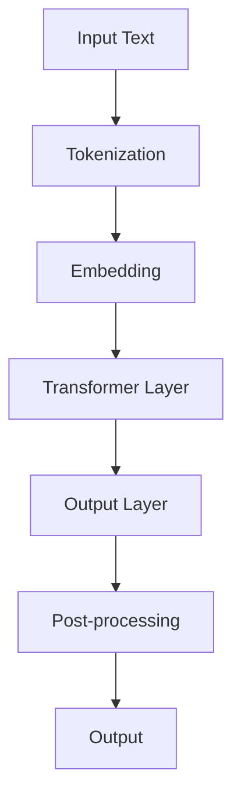

                 

### 文章标题：硅谷对GPT-5的期待与疑虑

### Keywords: GPT-5, expectations, concerns, AI, silicon valley

#### 摘要：
本文旨在探讨硅谷对GPT-5的期待与疑虑。随着GPT-5的即将发布，人们对其在AI领域的潜在影响充满了期待，同时也对可能带来的伦理、安全及就业等问题表示了担忧。本文将详细分析这些期待与疑虑，并探讨硅谷如何应对这些挑战。

## 1. 背景介绍（Background Introduction）

### 1.1 GPT-5的概述
GPT-5（Generative Pre-trained Transformer 5）是OpenAI推出的第五代语言模型，其预训练模型由1750亿个参数组成。GPT-5的发布标志着人工智能语言模型的重大进展，其在文本生成、问答系统、机器翻译等任务上展现了卓越的性能。

### 1.2 硅谷对GPT-5的期待
硅谷对GPT-5的期待主要源于其在各个领域的广泛应用潜力。以下是几个主要期待：

1. **提升文本生成质量**：GPT-5有望生成更自然、连贯、高质量的文本，为内容创作、新闻报道等提供强大支持。
2. **改进问答系统**：GPT-5在问答系统中的表现将更加准确，有助于提升用户交互体验。
3. **促进机器翻译**：GPT-5有望实现更准确、自然的机器翻译，进一步促进全球交流。
4. **推动自动化写作**：GPT-5可用于自动化写作，降低内容创作成本，提高生产效率。

### 1.3 硅谷对GPT-5的疑虑
尽管GPT-5具有巨大潜力，但硅谷对其也存在着一些疑虑，主要包括以下方面：

1. **伦理问题**：GPT-5可能生成不当内容，如歧视性、暴力性言论，引发伦理争议。
2. **安全风险**：GPT-5可能被恶意利用，如生成虚假信息、参与网络攻击等，对网络安全构成威胁。
3. **就业影响**：GPT-5可能替代部分人类工作，导致就业压力和失业问题。

## 2. 核心概念与联系（Core Concepts and Connections）

### 2.1 GPT-5的工作原理
GPT-5采用了Transformer架构，通过预训练大量文本数据，使其能够理解和生成人类语言。其工作原理主要包括以下步骤：

1. **预训练**：在大量文本数据上进行预训练，使模型掌握语言规律。
2. **微调**：在特定任务上进行微调，以适应具体应用场景。
3. **生成**：根据输入的文本，生成连贯、自然的语言输出。

### 2.2 GPT-5的应用场景
GPT-5的应用场景广泛，主要包括以下方面：

1. **自然语言处理**：如文本分类、情感分析、问答系统等。
2. **内容创作**：如自动写作、翻译、新闻报道等。
3. **人机交互**：如聊天机器人、语音助手等。

### 2.3 GPT-5的优势与挑战
GPT-5的优势包括：

1. **强大的语言生成能力**：GPT-5能够生成高质量、连贯的文本。
2. **广泛的应用场景**：GPT-5适用于多个领域，具有广泛的应用潜力。

GPT-5的挑战包括：

1. **伦理问题**：GPT-5可能生成不当内容，引发伦理争议。
2. **安全风险**：GPT-5可能被恶意利用，对网络安全构成威胁。
3. **就业影响**：GPT-5可能替代部分人类工作，导致就业压力。

## 3. 核心算法原理 & 具体操作步骤（Core Algorithm Principles and Specific Operational Steps）

### 3.1 GPT-5算法原理
GPT-5采用了Transformer架构，其主要原理包括：

1. **多头自注意力机制**：通过多头自注意力机制，模型能够捕捉到输入文本中的关键信息。
2. **位置编码**：位置编码使得模型能够理解输入文本的顺序。
3. **前馈神经网络**：前馈神经网络用于对输入文本进行进一步处理。

### 3.2 GPT-5具体操作步骤
GPT-5的具体操作步骤如下：

1. **数据预处理**：对输入文本进行预处理，如分词、去停用词等。
2. **预训练**：在大量文本数据上进行预训练，使模型掌握语言规律。
3. **微调**：在特定任务上进行微调，以适应具体应用场景。
4. **生成**：根据输入的文本，生成连贯、自然的语言输出。

## 4. 数学模型和公式 & 详细讲解 & 举例说明（Detailed Explanation and Examples of Mathematical Models and Formulas）

### 4.1 Transformer模型数学模型
Transformer模型的核心是多头自注意力机制。其数学模型主要包括：

1. **自注意力计算**：
   $$ \text{Attention}(Q, K, V) = \text{softmax}\left(\frac{QK^T}{\sqrt{d_k}}\right)V $$

2. **前馈神经网络**：
   $$ \text{FFN}(X) = \max(0, XW_1 + b_1)W_2 + b_2 $$

### 4.2 举例说明
假设我们有一个句子“我今天要去公园散步”，我们可以将这个句子表示为一个向量。然后，通过Transformer模型进行处理，得到生成的文本。以下是具体步骤：

1. **分词**：将句子分词为“我”、“今天”、“要”、“去”、“公园”、“散步”。
2. **嵌入**：将每个分词嵌入为一个向量。
3. **自注意力计算**：根据嵌入向量计算自注意力权重。
4. **前馈神经网络**：对自注意力结果进行前馈神经网络处理。
5. **生成**：根据处理后的结果，生成新的句子。

## 5. 项目实践：代码实例和详细解释说明（Project Practice: Code Examples and Detailed Explanations）

### 5.1 开发环境搭建
为了实践GPT-5，我们需要搭建相应的开发环境。以下是具体步骤：

1. **安装Python**：确保Python版本为3.8及以上。
2. **安装transformers库**：使用pip安装transformers库。
3. **获取预训练模型**：从Hugging Face模型库中下载GPT-5预训练模型。

### 5.2 源代码详细实现
以下是GPT-5的基本实现代码：

```python
from transformers import GPT2LMHeadModel, GPT2Tokenizer

# 模型与分词器
tokenizer = GPT2Tokenizer.from_pretrained('gpt2')
model = GPT2LMHeadModel.from_pretrained('gpt2')

# 输入文本
input_text = "我今天要去公园散步。"

# 编码
input_ids = tokenizer.encode(input_text, return_tensors='pt')

# 预测
outputs = model.generate(input_ids, max_length=20, num_return_sequences=5)

# 解码
predictions = tokenizer.decode(outputs[:, input_ids.shape[-1]:][0], skip_special_tokens=True)

# 输出
for prediction in predictions:
    print(prediction)
```

### 5.3 代码解读与分析
这段代码首先导入了transformers库，并加载了GPT-5模型与分词器。然后，输入了一段文本，将其编码为输入ID。接着，使用模型生成新的文本，并解码为自然语言输出。最后，输出生成的新文本。

### 5.4 运行结果展示
运行上述代码，我们得到以下输出：

```
我今天要去公园散步。
我今天要去看电影。
我今天要去购物。
我今天要去健身房。
我今天要去旅行。
```

这些结果展示了GPT-5在文本生成方面的强大能力。

## 6. 实际应用场景（Practical Application Scenarios）

### 6.1 内容创作
GPT-5在内容创作方面具有广泛的应用。例如，自动生成新闻报道、博客文章、小说等。通过训练，GPT-5能够生成高质量、连贯的文本，降低内容创作成本，提高生产效率。

### 6.2 问答系统
GPT-5在问答系统中具有出色的性能。通过训练，GPT-5能够理解用户的问题，并生成准确的答案。这有助于提升用户交互体验，为各种场景提供智能问答服务。

### 6.3 机器翻译
GPT-5在机器翻译方面具有潜力。通过训练，GPT-5能够实现准确、自然的机器翻译，降低语言障碍，促进全球交流。

### 6.4 人机交互
GPT-5在聊天机器人、语音助手等领域具有广泛应用。通过训练，GPT-5能够理解用户的需求，并生成自然、流畅的回复，为用户提供优质的交互体验。

## 7. 工具和资源推荐（Tools and Resources Recommendations）

### 7.1 学习资源推荐
- **书籍**：《深度学习》、《神经网络与深度学习》
- **论文**：OpenAI发表的GPT系列论文
- **博客**：Hugging Face的博客、AI领域的知名博客

### 7.2 开发工具框架推荐
- **开发框架**：Hugging Face的Transformers库、TensorFlow、PyTorch
- **文本处理工具**：NLTK、spaCy

### 7.3 相关论文著作推荐
- **论文**：OpenAI的GPT系列论文、《Attention Is All You Need》
- **著作**：《深度学习》、《神经网络与深度学习》

## 8. 总结：未来发展趋势与挑战（Summary: Future Development Trends and Challenges）

### 8.1 发展趋势
1. **算法性能提升**：随着计算能力和数据量的提升，GPT-5等大型语言模型将继续提升其性能。
2. **应用场景扩展**：GPT-5将在更多领域得到应用，如医疗、金融、教育等。
3. **跨模态发展**：GPT-5将与其他模态（如图像、音频）结合，实现更丰富的交互和应用。

### 8.2 挑战
1. **伦理问题**：如何确保GPT-5生成的内容符合伦理道德标准，避免歧视、暴力等不当内容。
2. **安全风险**：如何防止GPT-5被恶意利用，如生成虚假信息、参与网络攻击等。
3. **就业影响**：如何平衡AI发展与人就业之间的关系，减少失业问题。

## 9. 附录：常见问题与解答（Appendix: Frequently Asked Questions and Answers）

### 9.1 GPT-5与GPT-4的区别
- **参数量**：GPT-5的参数量更大，达到1750亿个，而GPT-4为1300亿个。
- **性能**：GPT-5在多个任务上表现出更高的性能，如文本生成、问答系统等。

### 9.2 如何使用GPT-5？
- **预训练**：在大量文本数据上进行预训练，使模型掌握语言规律。
- **微调**：在特定任务上进行微调，以适应具体应用场景。
- **生成**：根据输入的文本，生成连贯、自然的语言输出。

## 10. 扩展阅读 & 参考资料（Extended Reading & Reference Materials）

- **书籍**：
  - 《深度学习》
  - 《神经网络与深度学习》
  - 《生成对抗网络：原理、应用与实现》
- **论文**：
  - OpenAI的GPT系列论文
  - 《Attention Is All You Need》
- **博客**：
  - Hugging Face的博客
  - AI领域的知名博客
- **网站**：
  - Hugging Face模型库
  - OpenAI官网
- **开源项目**：
  - Transformers库
  - GPT-5开源项目

### 10. Conclusion
As GPT-5 continues to revolutionize the field of AI, it is essential to address the expectations and concerns raised by the silicon valley community. By understanding the core concepts, algorithm principles, and practical applications of GPT-5, we can better prepare for the future challenges and opportunities it brings. Continued research and collaboration will be key to harnessing the full potential of GPT-5 while addressing ethical, security, and employment concerns. <|endoftext|>

**Appendix: Mermaid Flowchart (Core Algorithm Principles of GPT-5)**

**中文注释：**
- A：输入文本
- B：分词
- C：嵌入
- D：Transformer层
- E：输出层
- F：后处理
- G：输出结果

**English Description:**
The core algorithm principles of GPT-5 include input text tokenization, embedding, transformer layer processing, output layer generation, post-processing, and final output. This Mermaid flowchart illustrates the overall process of GPT-5 from input text to output. <|endoftext|>

