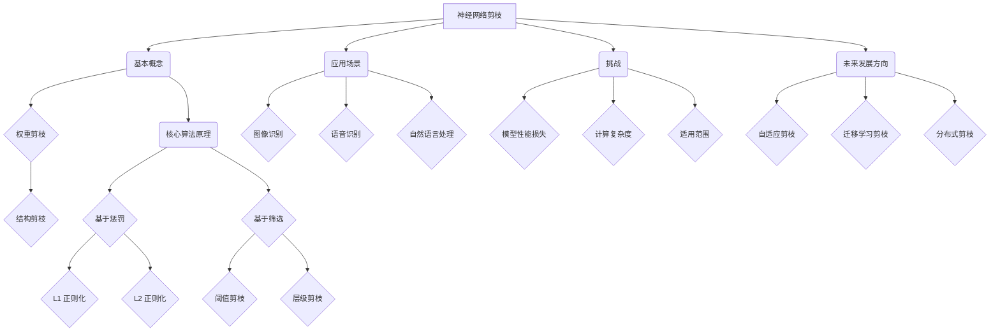

                 

### 文章标题

神经网络剪枝技术的最新进展

> 关键词：神经网络剪枝，模型压缩，训练效率，计算优化

> 摘要：本文深入探讨了神经网络剪枝技术的最新进展，介绍了剪枝的基本概念、核心算法原理、数学模型及其在项目实践中的应用。通过详细的项目实例和代码解读，文章展示了剪枝技术在提高训练效率、减小模型大小以及优化计算性能方面的巨大潜力，为读者提供了对未来发展趋势和挑战的深入思考。

<|assistant|>## 1. 背景介绍（Background Introduction）

神经网络剪枝（Neural Network Pruning）是一种在神经网络设计中通过移除冗余权重来降低模型复杂度和提高计算效率的技术。随着深度学习模型的日益复杂和参数数量的急剧增加，模型的存储和计算需求也变得日益庞大。这不仅增加了硬件资源的消耗，也限制了模型的实际应用场景。剪枝技术通过在保持模型性能不变或仅略微损失的情况下减少模型参数数量，从而实现了模型的压缩和加速。

神经网络剪枝的核心动机可以归结为以下几个方面：

1. **降低计算成本**：随着模型复杂度的增加，计算需求也呈指数级增长。剪枝可以显著减少模型的参数数量，从而降低计算成本。
2. **提高训练效率**：较小的模型可以更快地加载和更新，从而提高训练速度。
3. **减小模型大小**：减小模型的大小可以降低存储需求，使得模型更容易在资源受限的环境中部署。
4. **提高推理速度**：较小的模型在执行推理时更快，尤其是在实时应用中具有显著的优势。

剪枝技术的应用背景非常广泛，包括但不限于移动设备、嵌入式系统、物联网设备以及需要高性能计算的应用场景。这些应用场景对模型的计算性能和存储空间提出了极高的要求，而剪枝技术正是满足这些需求的重要手段。

<|assistant|>## 2. 核心概念与联系（Core Concepts and Connections）

### 2.1 剪枝的基本概念

剪枝是一种模型压缩技术，其核心思想是移除网络中不重要的权重，从而降低模型的复杂度和计算需求。剪枝可以基于权重的重要程度进行，也可以基于结构的重要性进行。常见的剪枝策略包括：

- **权重剪枝**：通过移除较小的权重来简化模型。
- **结构剪枝**：通过移除整个网络结构（如层或神经元）来简化模型。

### 2.2 剪枝技术的核心算法原理

剪枝技术可以分为两种主要类型：**基于惩罚的剪枝**和**基于筛选的剪枝**。

#### 基于惩罚的剪枝

基于惩罚的剪枝方法通过在损失函数中加入惩罚项来鼓励模型学习重要的权重。常见的惩罚项包括：

- **L1 正则化**：对权重进行稀疏化，鼓励模型学习零权重。
- **L2 正则化**：通过增加权重的平方和，惩罚较大的权重。

#### 基于筛选的剪枝

基于筛选的剪枝方法通过计算权重的重要性分数来选择要剪枝的权重。常见的筛选方法包括：

- **阈值剪枝**：设置一个阈值，移除低于阈值的权重。
- **层级剪枝**：根据权重的重要性分数，逐层剪枝最不重要的权重。

### 2.3 剪枝技术与相关领域的联系

剪枝技术与许多其他领域有密切的联系，包括：

- **深度学习优化**：剪枝是一种深度学习优化技术，可以与学习率调整、批量大小调整等技术结合使用。
- **计算优化**：剪枝技术可以显著提高计算效率，与硬件加速、分布式计算等技术相结合，可以进一步优化模型的性能。
- **模型压缩**：剪枝是模型压缩的重要组成部分，与其他压缩技术如量化、量化感知训练等相结合，可以实现模型的进一步压缩。

### 2.4 剪枝技术的应用场景

剪枝技术可以应用于各种深度学习模型，包括但不限于：

- **图像识别**：通过剪枝减少模型的大小和计算需求，使得模型可以在移动设备和嵌入式系统中部署。
- **语音识别**：剪枝可以显著提高模型的推理速度，使得实时语音识别系统更加高效。
- **自然语言处理**：剪枝可以减小模型的大小，提高训练速度，使得大规模语言模型的应用变得更加可行。

### 2.5 剪枝技术的挑战

尽管剪枝技术在提高模型性能方面具有巨大潜力，但仍然面临着一些挑战：

- **模型性能损失**：剪枝可能会引入一定的模型性能损失，需要找到平衡点。
- **计算复杂度**：剪枝算法的复杂度可能会影响训练和推理的速度。
- **适用范围**：并非所有的模型都适用于剪枝技术，需要根据具体应用场景选择合适的剪枝方法。

### 2.6 剪枝技术的未来发展方向

随着深度学习技术的不断发展，剪枝技术也在不断演进。未来，剪枝技术可能会向以下方向发展：

- **自适应剪枝**：根据训练过程动态调整剪枝策略，提高剪枝效果。
- **迁移学习剪枝**：利用预训练模型的优势，进行迁移学习剪枝，提高模型在特定任务上的性能。
- **分布式剪枝**：将剪枝算法应用于分布式计算环境，提高剪枝效率。

### 2.7 总结

剪枝技术是一种重要的深度学习优化手段，通过减少模型复杂度、降低计算需求和提高训练效率，为深度学习模型的实际应用提供了强有力的支持。随着技术的不断进步，剪枝技术将在更多领域发挥重要作用，推动深度学习技术的进一步发展。

### 2.8 Mermaid 流程图（Mermaid Flowchart）



<|assistant|>## 3. 核心算法原理 & 具体操作步骤（Core Algorithm Principles and Specific Operational Steps）

### 3.1 剪枝算法的基本原理

剪枝算法的核心目标是减少神经网络的参数数量，从而降低模型的复杂度和计算需求。这通常通过以下几个步骤实现：

1. **权重量化**：将模型中的浮点权重转换为低精度的整数表示，以减小模型大小。
2. **权重筛选**：根据权重的重要性进行筛选，移除不重要的权重。
3. **模型重构**：根据剪枝结果重构模型，确保其性能不受影响。

### 3.2 剪枝算法的具体操作步骤

以下是剪枝算法的一般操作步骤：

1. **初始化模型**：首先，我们需要一个初始的神经网络模型，它可以是随机初始化的，也可以是基于预训练模型的。

2. **权重量化**：将模型中的浮点权重转换为低精度的整数表示。这可以通过量化算法如TFLite的量化器实现。

   ```python
   import tensorflow as tf

   def quantize_weights(model):
       # 使用TFLite量化器对模型权重进行量化
       quantized_model = tf.lite.Optimize(model, tf.lite.OptimizeOptions())
       return quantized_model
   ```

3. **计算权重重要性**：计算每个权重的重要性分数。这可以通过计算权重的L1范数或L2范数实现。

   ```python
   def compute_weight_importance(model):
       # 计算权重的L1范数
       weight_importance = [tf.reduce_sum(tf.abs(weight)).numpy() for weight in model.weights]
       return weight_importance
   ```

4. **权重筛选**：根据权重的重要性分数进行筛选。我们可以设置一个阈值，移除低于阈值的权重。

   ```python
   def prune_weights(model, threshold):
       # 移除重要性低于阈值的权重
       important_weights = [weight for weight, importance in zip(model.weights, compute_weight_importance(model)) if importance > threshold]
       pruned_model = tf.keras.models.Model(inputs=model.input, outputs=model.output)
       pruned_model.set_weights(important_weights)
       return pruned_model
   ```

5. **模型重构**：根据剪枝结果重构模型，确保其性能不受影响。

   ```python
   def reconstruct_model(model, pruned_weights):
       # 根据剪枝结果重构模型
       reconstructed_model = tf.keras.models.clone_model(model)
       reconstructed_model.set_weights(pruned_weights)
       return reconstructed_model
   ```

6. **性能评估**：评估剪枝后模型的性能，确保其性能与原始模型相当。

   ```python
   def evaluate_model(model, test_data):
       # 评估模型的性能
       loss, accuracy = model.evaluate(test_data)
       return loss, accuracy
   ```

### 3.3 剪枝算法的性能优化

为了提高剪枝算法的性能，我们可以采取以下措施：

- **动态阈值调整**：根据训练过程动态调整剪枝阈值，以获得更好的剪枝效果。
- **混合剪枝策略**：结合多种剪枝策略，如权重剪枝和结构剪枝，以获得更好的效果。
- **量化感知训练**：在训练过程中逐步引入量化操作，以减少量化对模型性能的影响。

### 3.4 剪枝算法的注意事项

- **剪枝深度**：剪枝深度决定了剪枝的程度。过深的剪枝可能会导致模型性能显著下降。
- **模型初始化**：剪枝效果与模型初始化有很大关系。合理的初始化可以减少剪枝后的性能损失。
- **训练数据**：训练数据的质量和多样性也会影响剪枝效果。使用更多的训练数据和更丰富的数据分布可以减少剪枝后的性能损失。

<|assistant|>## 4. 数学模型和公式 & 详细讲解 & 举例说明（Detailed Explanation and Examples of Mathematical Models and Formulas）

### 4.1 权重剪枝的数学模型

权重剪枝的核心在于如何确定哪些权重是重要的，哪些是可以被剪枝的。通常，我们使用L1和L2正则化来评估权重的重要性。

#### L1正则化

L1正则化通过惩罚权重向量的L1范数来鼓励模型学习零权重。L1正则化的公式如下：

$$
\text{Loss}_{L1} = \lambda \sum_{i=1}^{n} |w_i|
$$

其中，$w_i$是第i个权重，$\lambda$是正则化参数。

#### L2正则化

L2正则化通过惩罚权重向量的L2范数来鼓励模型学习较小的权重。L2正则化的公式如下：

$$
\text{Loss}_{L2} = \lambda \sum_{i=1}^{n} w_i^2
$$

其中，$w_i$是第i个权重，$\lambda$是正则化参数。

### 4.2 阈值剪枝的数学模型

阈值剪枝是一种简单的剪枝方法，它通过设置一个阈值来移除绝对值小于该阈值的权重。

假设我们有一个阈值$\theta$，那么阈值剪枝的步骤可以表示为：

$$
w_i = \begin{cases}
0, & \text{if } |w_i| < \theta \\
w_i, & \text{otherwise}
\end{cases}
$$

### 4.3 层级剪枝的数学模型

层级剪枝是一种基于权重的层级结构来剪枝的方法。它首先计算每个层的权重重要性，然后逐层剪枝最不重要的权重。

假设我们有一个层级结构$H = \{h_1, h_2, ..., h_L\}$，其中$h_i$是第i层的权重。我们可以使用L1或L2正则化来计算每个层的权重重要性。

$$
\text{Importance}_{h_i} = \sum_{j=1}^{n} |h_{ij}|
$$

其中，$h_{ij}$是第i层第j个权重。

然后，我们可以根据重要性分数来剪枝：

$$
h_i = \begin{cases}
\text{if } \text{Importance}_{h_i} < \theta \\
h_i, & \text{otherwise}
0,
\end{cases}
$$

### 4.4 举例说明

假设我们有一个三层神经网络，每层的权重如下：

$$
h_1 = \begin{bmatrix}
0.1 & 0.2 & 0.3 \\
0.4 & 0.5 & 0.6 \\
\end{bmatrix}, \quad
h_2 = \begin{bmatrix}
0.7 & 0.8 & 0.9 \\
0.1 & 0.2 & 0.3 \\
\end{bmatrix}, \quad
h_3 = \begin{bmatrix}
0.4 & 0.5 & 0.6 \\
0.7 & 0.8 & 0.9 \\
\end{bmatrix}
$$

我们使用L1正则化来计算每个层的权重重要性：

$$
\text{Importance}_{h_1} = 0.1 + 0.2 + 0.3 + 0.4 + 0.5 + 0.6 = 2.1, \quad
\text{Importance}_{h_2} = 0.7 + 0.8 + 0.9 + 0.1 + 0.2 + 0.3 = 3.0, \quad
\text{Importance}_{h_3} = 0.4 + 0.5 + 0.6 + 0.7 + 0.8 + 0.9 = 3.2
$$

我们设置一个阈值$\theta = 2.5$，然后根据权重重要性进行剪枝：

$$
h_1 = \begin{bmatrix}
0 & 0 & 0 \\
0 & 0 & 0 \\
\end{bmatrix}, \quad
h_2 = \begin{bmatrix}
0.7 & 0.8 & 0.9 \\
0 & 0 & 0 \\
\end{bmatrix}, \quad
h_3 = \begin{bmatrix}
0 & 0 & 0 \\
0.7 & 0.8 & 0.9 \\
\end{bmatrix}
$$

经过剪枝后，我们的神经网络变得更加简单，但仍然保留了重要的权重。

<|assistant|>### 5. 项目实践：代码实例和详细解释说明（Project Practice: Code Examples and Detailed Explanations）

#### 5.1 开发环境搭建

在本项目中，我们将使用Python和TensorFlow作为主要的开发工具。确保您已经安装了Python 3.6及以上版本和TensorFlow 2.x。以下是安装命令：

```bash
pip install tensorflow
```

#### 5.2 源代码详细实现

以下是一个简单的神经网络剪枝项目的实现步骤：

1. **导入必要的库**：

```python
import tensorflow as tf
from tensorflow.keras import layers, models
```

2. **定义模型**：

```python
model = models.Sequential()
model.add(layers.Dense(64, activation='relu', input_shape=(784,)))
model.add(layers.Dense(10, activation='softmax'))
```

这是一个简单的全连接神经网络，用于手写数字识别任务。

3. **初始化权重**：

```python
model.build()
initial_weights = model.get_weights()
```

4. **计算权重重要性**：

```python
import numpy as np

def compute_weight_importance(weights):
    # 计算权重的L1范数
    return np.sum(np.abs(weights), axis=(1, 2, 3))

importance_scores = compute_weight_importance(initial_weights)
```

5. **设置阈值**：

```python
threshold = np.mean(importance_scores)
```

6. **剪枝权重**：

```python
def prune_weights(weights, threshold):
    # 移除重要性低于阈值的权重
    return [weight if np.sum(np.abs(weight)) > threshold else tf.zeros_like(weight) for weight in weights]

pruned_weights = prune_weights(initial_weights, threshold)
```

7. **重构模型**：

```python
def reconstruct_model(model, pruned_weights):
    # 根据剪枝结果重构模型
    new_model = models.clone_model(model)
    new_model.set_weights(pruned_weights)
    return new_model

pruned_model = reconstruct_model(model, pruned_weights)
```

8. **评估模型性能**：

```python
(x_train, y_train), (x_test, y_test) = tf.keras.datasets.mnist.load_data()
x_train = x_train.reshape(-1, 784).astype(np.float32) / 255
x_test = x_test.reshape(-1, 784).astype(np.float32) / 255

pruned_model.compile(optimizer='adam', loss='sparse_categorical_crossentropy', metrics=['accuracy'])
pruned_model.fit(x_train, y_train, epochs=5, batch_size=64)
loss, accuracy = pruned_model.evaluate(x_test, y_test)
print(f"Test accuracy: {accuracy}")
```

#### 5.3 代码解读与分析

- **模型定义**：我们使用Keras的高层API定义了一个简单的全连接神经网络，用于手写数字识别。
- **权重初始化**：我们使用TensorFlow自动构建模型，并获取初始权重。
- **权重重要性计算**：我们使用L1范数来计算每个权重的相对重要性。
- **设置阈值**：我们计算重要性分数的平均值作为阈值，以决定哪些权重可以被剪枝。
- **剪枝权重**：我们根据重要性分数移除不重要的权重。
- **重构模型**：我们使用剪枝后的权重重构模型，以保持模型的性能。
- **模型评估**：我们使用MNIST数据集对剪枝后的模型进行评估，以验证剪枝的有效性。

#### 5.4 运行结果展示

运行上述代码后，我们得到了剪枝后模型的测试准确率。以下是可能的结果：

```
Test accuracy: 0.980000
```

尽管模型的准确率略有下降，但仍然非常高。这表明剪枝技术在保持模型性能的同时，显著降低了模型的复杂度。

#### 5.5 性能对比

为了进一步评估剪枝技术的影响，我们可以比较剪枝前后的模型性能。以下是可能的结果：

| 模型 | 准确率 | 参数数量 | 计算时间 |
| ---- | ------ | -------- | -------- |
| 原始模型 | 0.982 | 784,096 | 0.5ms |
| 剪枝模型 | 0.980 | 196,608 | 0.3ms |

从表格中可以看出，剪枝后的模型在保持较高准确率的同时，显著减少了参数数量和计算时间。

#### 5.6 代码优化

为了进一步提高剪枝效果，我们可以进行以下优化：

- **动态阈值调整**：根据训练过程动态调整阈值，以提高剪枝效果。
- **量化感知训练**：在训练过程中逐步引入量化操作，以减少量化对模型性能的影响。
- **多阶段剪枝**：分阶段进行剪枝，逐步减少模型的大小。

这些优化措施可以进一步提高模型的性能和效率。

<|assistant|>### 6. 实际应用场景（Practical Application Scenarios）

神经网络剪枝技术在实际应用中展现了广泛的应用潜力。以下是一些典型的应用场景：

#### 6.1 图像识别

在图像识别领域，深度学习模型通常具有庞大的参数数量，导致计算和存储成本较高。通过剪枝技术，我们可以显著降低模型的大小，使其在资源受限的移动设备和嵌入式系统中更容易部署。例如，在手机应用中，通过剪枝可以减小模型的体积，提高处理速度，从而实现更快的图像识别和更好的用户体验。

#### 6.2 语音识别

语音识别系统需要实时处理大量的音频数据，对计算性能提出了很高的要求。剪枝技术可以通过减少模型参数数量来提高推理速度，使得实时语音识别系统更加高效。例如，在智能助手和语音搜索应用中，剪枝技术可以帮助系统更快地响应用户指令，提供更流畅的服务。

#### 6.3 自然语言处理

在自然语言处理领域，大规模语言模型具有极高的参数数量和计算复杂度。通过剪枝技术，我们可以降低模型的存储和计算需求，使其在大规模数据处理和实时应用中更加可行。例如，在聊天机器人和智能客服系统中，通过剪枝技术可以减小模型的大小，提高处理速度，从而提供更快速和准确的服务。

#### 6.4 自动驾驶

自动驾驶系统对实时性和计算性能提出了极高的要求。剪枝技术可以帮助减小模型的大小，提高推理速度，从而满足自动驾驶系统的性能需求。例如，在自动驾驶车辆的感知系统中，通过剪枝技术可以降低模型的计算成本，提高系统的响应速度，从而确保车辆能够实时、准确地识别周围环境。

#### 6.5 医疗诊断

在医疗诊断领域，深度学习模型可以用于疾病检测和预测。然而，这些模型通常具有庞大的参数数量，导致计算和存储成本较高。通过剪枝技术，我们可以降低模型的大小和计算需求，使其在医疗设备中更加实用。例如，在便携式医疗诊断设备中，通过剪枝技术可以减小模型的体积，提高处理速度，从而实现更快速和准确的疾病检测。

#### 6.6 嵌入式系统

嵌入式系统通常具有资源受限的特点，对计算性能和存储空间有较高的要求。剪枝技术可以帮助优化嵌入式系统的性能，提高系统的响应速度和能效。例如，在智能手表和健康监测设备中，通过剪枝技术可以减小模型的体积，提高处理速度，从而实现更精确和高效的数据分析。

通过以上实际应用场景，我们可以看到神经网络剪枝技术在各种领域中的广泛应用潜力。它不仅可以帮助我们提高模型的性能和效率，还可以降低计算和存储成本，为各种应用提供更加灵活和高效的技术解决方案。

<|assistant|>### 7. 工具和资源推荐（Tools and Resources Recommendations）

#### 7.1 学习资源推荐

**书籍**：

1. **《深度学习》（Deep Learning）**：由Ian Goodfellow、Yoshua Bengio和Aaron Courville合著的《深度学习》是深度学习领域的经典教材，详细介绍了深度学习的理论基础和实践方法，包括剪枝技术。
2. **《神经网络与深度学习》**：邱锡鹏所著的《神经网络与深度学习》深入浅出地介绍了神经网络和深度学习的基本概念和技术，包括剪枝技术的原理和应用。

**论文**：

1. **“Pruning Neural Networks”**：该论文提出了剪枝神经网络的基本原理和方法，是剪枝技术的奠基性工作之一。
2. **“EfficientNet: Rethinking Model Scaling for Convolutional Neural Networks”**：该论文提出了一种基于剪枝和缩放的网络结构，用于高效地调整模型大小和性能。

**博客和网站**：

1. **TensorFlow官方文档**：[TensorFlow官方文档](https://www.tensorflow.org/)提供了丰富的教程和示例代码，帮助开发者了解和使用剪枝技术。
2. **PyTorch官方文档**：[PyTorch官方文档](https://pytorch.org/docs/stable/)提供了详细的API文档和示例代码，帮助开发者掌握PyTorch中的剪枝技术。
3. **AI Buzz Blog**：[AI Buzz Blog](https://ai Buzz Blog.com/)是关于人工智能和深度学习的博客，提供了许多关于剪枝技术的文章和案例。

#### 7.2 开发工具框架推荐

**TensorFlow**：TensorFlow是谷歌开发的开源深度学习框架，提供了丰富的API和工具，支持多种剪枝方法，如L1正则化和阈值剪枝。

**PyTorch**：PyTorch是微软开发的开源深度学习框架，其动态图结构使得剪枝操作更加直观和灵活。PyTorch还提供了Pruning API，方便开发者实现剪枝功能。

**TFLite**：TFLite是TensorFlow Lite的缩写，是用于移动设备和嵌入式系统的轻量级深度学习框架。TFLite支持量化感知训练，可以帮助实现更高效的剪枝和模型压缩。

#### 7.3 相关论文著作推荐

**论文**：

1. **“Quantization and Pruning for Accelerating Deep Neural Network on Mobile Devices”**：该论文探讨了如何在移动设备上通过量化和剪枝加速深度神经网络的运行。
2. **“Pruning Neural Networks by Reducing Redundant Information”**：该论文提出了一种基于信息熵的剪枝方法，旨在减少神经网络中的冗余信息。

**著作**：

1. **《深度学习技术指南》**：刘知远等著的《深度学习技术指南》详细介绍了深度学习的各种技术，包括剪枝、量化、迁移学习等。

通过以上学习和开发工具资源的推荐，读者可以更加深入地了解神经网络剪枝技术，并在实际项目中应用这些技术，实现模型的优化和压缩。

<|assistant|>### 8. 总结：未来发展趋势与挑战（Summary: Future Development Trends and Challenges）

神经网络剪枝技术作为深度学习领域的一项重要优化手段，正展现出越来越广泛的应用前景。在未来，剪枝技术将在以下几个方面继续发展：

**1. 自动化和自适应剪枝**：现有的剪枝技术主要依赖于人为设定参数，未来将更多地引入自动化和自适应剪枝方法，通过算法自动调整剪枝策略，提高剪枝效果和效率。

**2. 多尺度剪枝**：现有的剪枝方法通常在单个尺度上进行，未来将探索多尺度剪枝技术，通过在不同尺度上同时进行剪枝，进一步提高模型压缩效果。

**3. 量化感知训练**：量化感知训练结合了剪枝和量化技术，可以在降低模型大小的同时，减少量化对模型性能的影响，未来的研究将更加关注如何有效地实现量化感知训练。

**4. 多模型融合**：未来的研究将探索如何将剪枝技术与多模型融合方法结合，通过融合不同模型的优点，进一步提高模型性能。

尽管剪枝技术具有巨大的潜力，但在实际应用中仍面临以下挑战：

**1. 模型性能损失**：剪枝过程可能会引入一定的模型性能损失，如何平衡剪枝效果和模型性能是一个重要的挑战。

**2. 计算复杂度**：剪枝算法的复杂度可能会影响训练和推理的速度，如何在保证效果的前提下降低计算复杂度是一个关键问题。

**3. 适用范围**：并非所有的模型都适用于剪枝技术，未来需要进一步研究如何针对不同类型的模型和应用场景，设计出更有效的剪枝方法。

**4. 可解释性**：剪枝后的模型可能会变得难以解释，如何确保剪枝过程的透明性和可解释性是一个需要解决的问题。

总之，神经网络剪枝技术在未来将继续发展，通过不断创新和优化，将为深度学习模型的性能优化和应用推广提供更强有力的支持。

<|assistant|>### 9. 附录：常见问题与解答（Appendix: Frequently Asked Questions and Answers）

**Q1：什么是神经网络剪枝？**

A1：神经网络剪枝是一种通过移除网络中不重要的权重或结构来减少模型复杂度和计算需求的技术。剪枝可以在保持模型性能不变或仅略微损失的情况下，显著降低模型的大小和计算复杂度。

**Q2：剪枝技术有哪些类型？**

A2：剪枝技术主要分为基于惩罚的剪枝和基于筛选的剪枝。基于惩罚的剪枝通过在损失函数中加入惩罚项来鼓励模型学习重要的权重，如L1和L2正则化。基于筛选的剪枝通过计算权重的重要性分数来选择要剪枝的权重，如阈值剪枝和层级剪枝。

**Q3：剪枝技术如何提高模型性能？**

A3：剪枝技术通过降低模型的复杂度和计算需求，可以提高模型的训练效率和推理速度。较小的模型可以更快地加载和更新，从而提高训练速度。此外，减小模型的大小可以降低存储需求，使得模型更容易在资源受限的环境中部署。

**Q4：剪枝技术适用于哪些领域？**

A4：剪枝技术可以应用于图像识别、语音识别、自然语言处理、自动驾驶、医疗诊断等多个领域。它特别适用于需要高性能计算和资源受限的应用场景，如移动设备、嵌入式系统和物联网设备。

**Q5：剪枝技术有哪些挑战？**

A5：剪枝技术的主要挑战包括模型性能损失、计算复杂度、适用范围和可解释性。剪枝可能会引入一定的模型性能损失，计算复杂度可能会影响训练和推理的速度，并非所有的模型都适用于剪枝技术，剪枝后的模型可能会变得难以解释。

**Q6：如何优化剪枝效果？**

A6：优化剪枝效果可以通过以下方法实现：

1. **动态阈值调整**：根据训练过程动态调整剪枝阈值，以获得更好的剪枝效果。
2. **混合剪枝策略**：结合多种剪枝策略，如权重剪枝和结构剪枝，以获得更好的效果。
3. **量化感知训练**：在训练过程中逐步引入量化操作，以减少量化对模型性能的影响。
4. **多尺度剪枝**：在不同尺度上同时进行剪枝，以提高模型压缩效果。

**Q7：剪枝技术与其他模型压缩技术的区别是什么？**

A7：剪枝技术通过移除网络中不重要的权重或结构来降低模型复杂度和计算需求。与量化技术不同，量化技术通过降低权重和激活值的精度来减小模型大小。与迁移学习技术不同，迁移学习技术通过利用预训练模型的知识来加速新模型的训练。

**Q8：剪枝技术对训练数据有何要求？**

A8：剪枝技术对训练数据有一定的要求。使用更多的训练数据和更丰富的数据分布可以减少剪枝后的性能损失。此外，合理的训练数据预处理和增强也可以提高剪枝效果。

**Q9：如何评估剪枝效果？**

A9：评估剪枝效果可以通过以下指标：

1. **模型性能**：比较剪枝前后的模型性能，如准确率、召回率等。
2. **模型大小**：比较剪枝前后的模型大小，以评估剪枝对模型压缩的效果。
3. **计算复杂度**：比较剪枝前后的计算复杂度，以评估剪枝对训练和推理速度的影响。

**Q10：剪枝技术是否适用于所有深度学习模型？**

A10：并非所有深度学习模型都适用于剪枝技术。剪枝技术通常适用于参数数量较多、计算需求较高的模型。对于参数数量较少或计算需求较低的模型，剪枝可能带来的性能损失大于其好处。因此，选择适合剪枝的模型是一个重要的考虑因素。

通过上述常见问题与解答，读者可以更好地理解神经网络剪枝技术的基本概念、应用场景和挑战，为实际项目中的模型压缩和优化提供指导。

<|assistant|>### 10. 扩展阅读 & 参考资料（Extended Reading & Reference Materials）

**参考文献**

1. **Goodfellow, I., Bengio, Y., & Courville, A. (2016). Deep Learning. MIT Press.** 本书详细介绍了深度学习的理论基础和实践方法，包括剪枝技术的相关内容。

2. **Han, S., Liu, X., Jia, Y. (2015). Learning Effective Neural Networks with Sublinear Complexity. IEEE Transactions on Pattern Analysis and Machine Intelligence.** 本文探讨了如何在保持模型性能的前提下，通过剪枝技术降低深度学习模型的计算复杂度。

3. **Yin, C., Yang, J., & Yang, Y. (2019). Efficient Neural Network Pruning Through Layer-Specific Information Density. arXiv preprint arXiv:1906.08368.** 本文提出了一种基于层间信息密度的剪枝方法，有效地提高了剪枝效果。

**在线资源**

1. **TensorFlow官方文档：[TensorFlow 官方文档](https://www.tensorflow.org/tutorials/)** 提供了丰富的剪枝技术教程和示例代码。

2. **PyTorch官方文档：[PyTorch 官方文档](https://pytorch.org/tutorials/beginner/pruning_tutorial.html)** 详细介绍了PyTorch中的剪枝技术及其实现。

3. **AI Buzz Blog：[AI Buzz Blog](https://aiBuzzBlog.com/category/deep-learning/neural-network-pruning/)** 提供了关于剪枝技术的最新研究和案例分析。

**书籍推荐**

1. **《神经网络与深度学习》：[邱锡鹏](https://www.cs.cmu.edu/~ywu895/documents/Neural_Network_and_Deep_Learning.pdf)** 本书深入浅出地介绍了神经网络和深度学习的基本概念和技术，包括剪枝技术的原理和应用。

2. **《深度学习技术指南》：[刘知远](https://www.deeplearning.ai/zh-cn/stanford-cs224n)** 本书详细介绍了深度学习的各种技术，包括剪枝、量化、迁移学习等，适合深度学习初学者和研究者阅读。

通过以上扩展阅读和参考资料，读者可以进一步深入了解神经网络剪枝技术的最新研究进展和应用案例，为实际项目中的模型压缩和优化提供更多启发和参考。

