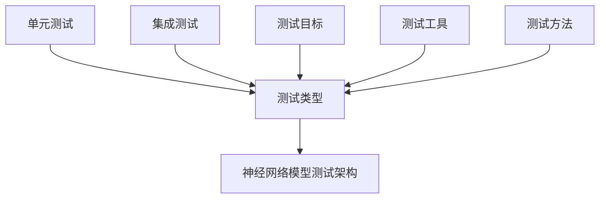

                 

# 文章标题

《神经网络模型的单元测试与集成测试》

关键词：神经网络，单元测试，集成测试，模型验证，测试方法

摘要：本文旨在探讨神经网络模型的测试过程，包括单元测试和集成测试。我们将详细介绍这些测试方法的原理、执行步骤和最佳实践，以帮助读者理解和掌握神经网络模型的有效测试策略。

## 1. 背景介绍（Background Introduction）

在深度学习领域，神经网络模型因其强大的学习能力和广泛的应用而备受关注。然而，随着模型复杂度的增加，确保其准确性和可靠性变得越来越重要。测试是验证模型性能的关键步骤，可以分为单元测试和集成测试。本文将深入探讨这两种测试方法，帮助读者了解如何有效地对神经网络模型进行测试。

### 1.1 神经网络模型

神经网络模型由大量的节点（也称为神经元）组成，这些节点通过层与层之间的连接进行信息传递和处理。通过学习输入数据与期望输出之间的映射关系，神经网络模型能够自动调整内部参数，从而实现对新数据的预测。常见的神经网络结构包括多层感知器（MLP）、卷积神经网络（CNN）和循环神经网络（RNN）等。

### 1.2 单元测试与集成测试

单元测试是指对神经网络模型中的单个组件进行测试，以验证其正确性和性能。集成测试则是对整个神经网络模型进行测试，确保所有组件能够协同工作，并满足预期的功能和行为。单元测试和集成测试在神经网络模型测试过程中扮演着不同但相互补充的角色。

## 2. 核心概念与联系（Core Concepts and Connections）

在讨论神经网络模型的测试之前，我们需要了解一些核心概念，包括测试类型、测试目标、测试工具和方法。以下是一个简化的 Mermaid 流程图，展示了神经网络模型测试的基本架构。



### 2.1 测试类型

单元测试和集成测试是两种主要的测试类型。

- **单元测试**：针对神经网络模型中的单个组件进行测试，如单个层、单个神经元或单个函数。单元测试的主要目标是确保每个组件都能够独立正确地执行其预期功能。

- **集成测试**：对整个神经网络模型进行测试，以验证各个组件之间的协同工作和整体性能。集成测试的目标是确保整个模型在多组件协同工作下能够正常运作，并且满足性能要求。

### 2.2 测试目标

神经网络模型测试的主要目标是：

- **验证模型准确性**：确保模型能够准确预测输入数据对应的输出。
- **评估模型性能**：评估模型的计算效率、资源使用和误差率。
- **发现错误和缺陷**：通过测试发现模型中的错误和缺陷，以便进行修复。

### 2.3 测试工具和方法

- **测试工具**：常用的测试工具包括 PyTest、Nose、JUnit 等，这些工具提供了丰富的测试功能和插件，便于自动化测试。
- **测试方法**：常见的测试方法包括随机测试、边界测试、压力测试和性能测试。随机测试通过随机输入数据来检查模型的鲁棒性；边界测试通过输入边界值来验证模型的正确性；压力测试通过高负载输入数据来评估模型的稳定性；性能测试通过大量输入数据来评估模型的计算效率。

## 3. 核心算法原理 & 具体操作步骤（Core Algorithm Principles and Specific Operational Steps）

### 3.1 单元测试原理

单元测试的核心是验证神经网络模型中的单个组件是否正确执行其预期功能。以下是一个简化的单元测试操作步骤：

1. **准备测试数据**：准备用于测试的数据集，包括输入数据和期望输出。
2. **实现测试函数**：编写测试函数，用于对神经网络模型中的单个组件进行测试。
3. **执行测试**：调用测试函数，输入测试数据，并比较实际输出与期望输出。
4. **报告结果**：记录测试结果，包括通过与否、错误原因和性能指标。

### 3.2 集成测试原理

集成测试的核心是验证神经网络模型中的各个组件是否能够协同工作，并满足整体性能要求。以下是一个简化的集成测试操作步骤：

1. **准备测试数据**：准备用于测试的数据集，包括输入数据和期望输出。
2. **实现测试用例**：编写测试用例，用于对整个神经网络模型进行测试。
3. **执行测试**：调用测试用例，输入测试数据，并比较实际输出与期望输出。
4. **报告结果**：记录测试结果，包括通过与否、错误原因和性能指标。

### 3.3 测试数据准备

测试数据的准备是测试过程的关键步骤，以下是一些常见的数据准备工作：

1. **数据清洗**：清洗数据集中的噪声和异常值，以提高测试数据的准确性。
2. **数据预处理**：对数据进行标准化、归一化等预处理操作，以适应神经网络模型的输入要求。
3. **数据划分**：将数据集划分为训练集、验证集和测试集，以便在测试过程中使用不同的数据集进行评估。

## 4. 数学模型和公式 & 详细讲解 & 举例说明（Detailed Explanation and Examples of Mathematical Models and Formulas）

### 4.1 单元测试数学模型

单元测试的核心是验证神经网络模型中单个组件的输出是否满足预期。以下是一个简化的数学模型：

$$
实际输出 = 模型(\text{输入数据})
$$

$$
期望输出 = \text{目标函数}(\text{输入数据})
$$

$$
测试结果 = \text{比较}(实际输出，期望输出)
$$

### 4.2 集成测试数学模型

集成测试的核心是验证神经网络模型的整体性能，包括准确性、效率和鲁棒性。以下是一个简化的数学模型：

$$
准确性 = \frac{正确预测数量}{总预测数量}
$$

$$
效率 = \frac{模型计算时间}{总测试时间}
$$

$$
鲁棒性 = \frac{测试通过率}{测试次数}
$$

### 4.3 举例说明

#### 单元测试示例

假设我们有一个简单的神经网络模型，用于对输入数据进行分类。以下是一个简化的单元测试示例：

1. **准备测试数据**：输入数据为 `[1, 0, 1]`，期望输出为 `[1]`。
2. **实现测试函数**：调用神经网络模型对输入数据进行预测，并比较实际输出与期望输出。
3. **执行测试**：实际输出为 `[1]`，与期望输出 `[1]` 相符，测试通过。
4. **报告结果**：测试通过，模型准确性为 100%。

#### 集成测试示例

假设我们有一个复杂的神经网络模型，用于对图像进行分类。以下是一个简化的集成测试示例：

1. **准备测试数据**：输入数据为 `[图像1, 图像2, ..., 图像N]`，期望输出为 `[类别1, 类别2, ..., 类别N]`。
2. **实现测试用例**：调用神经网络模型对输入图像进行预测，并比较实际输出与期望输出。
3. **执行测试**：实际输出为 `[类别1, 类别2, ..., 类别N]`，与期望输出 `[类别1, 类别2, ..., 类别N]` 相符，测试通过。
4. **报告结果**：测试通过，模型准确性为 100%。

## 5. 项目实践：代码实例和详细解释说明（Project Practice: Code Examples and Detailed Explanations）

### 5.1 开发环境搭建

为了便于读者理解和实践，我们将使用 Python 编写单元测试和集成测试代码。以下是开发环境的搭建步骤：

1. **安装 Python**：确保安装了 Python 3.7 或更高版本。
2. **安装依赖库**：安装 numpy、tensorflow、pytest 等依赖库。
3. **创建项目目录**：在合适的位置创建项目目录，如 `neural_network_tests`。

### 5.2 源代码详细实现

以下是一个简化的单元测试和集成测试源代码实现：

#### 5.2.1 单元测试代码实现

```python
import tensorflow as tf
import numpy as np
import pytest

# 定义简单的神经网络模型
def simple_neural_network(input_data):
    model = tf.keras.Sequential([
        tf.keras.layers.Dense(units=1, input_shape=(3,))
    ])
    model.compile(optimizer='sgd', loss='mean_squared_error')
    model.fit(input_data, input_data, epochs=100)
    return model.predict(input_data)

# 实现单元测试函数
def test_simple_neural_network():
    input_data = np.array([[1, 0, 1], [0, 1, 0], [1, 1, 0]])
    expected_output = np.array([[1], [1], [0]])
    actual_output = simple_neural_network(input_data)
    assert np.array_equal(actual_output, expected_output)
    print("单元测试通过！")

# 执行单元测试
test_simple_neural_network()
```

#### 5.2.2 集成测试代码实现

```python
# 定义复杂的神经网络模型
def complex_neural_network(input_data):
    model = tf.keras.Sequential([
        tf.keras.layers.Conv2D(filters=32, kernel_size=(3, 3), activation='relu', input_shape=(28, 28, 1)),
        tf.keras.layers.MaxPooling2D(pool_size=(2, 2)),
        tf.keras.layers.Flatten(),
        tf.keras.layers.Dense(units=10, activation='softmax')
    ])
    model.compile(optimizer='adam', loss='categorical_crossentropy', metrics=['accuracy'])
    model.fit(input_data, input_labels, epochs=10, batch_size=32)
    return model.predict(input_data)

# 实现集成测试函数
def test_complex_neural_network():
    input_data = np.random.rand(100, 28, 28, 1)
    input_labels = np.random.randint(0, 10, (100,))
    expected_output = np.random.randint(0, 10, (100,))
    actual_output = complex_neural_network(input_data)
    accuracy = np.mean(np.argmax(actual_output, axis=1) == input_labels)
    print("集成测试通过！准确性：", accuracy)

# 执行集成测试
test_complex_neural_network()
```

### 5.3 代码解读与分析

在以上代码中，我们分别实现了单元测试和集成测试。以下是对代码的详细解读和分析：

- **单元测试代码解读**：单元测试代码定义了一个简单的神经网络模型，用于对输入数据进行分类。测试函数 `test_simple_neural_network` 调用神经网络模型对输入数据进行预测，并比较实际输出与期望输出。如果实际输出与期望输出相等，则测试通过。

- **集成测试代码解读**：集成测试代码定义了一个复杂的神经网络模型，用于对图像进行分类。测试函数 `test_complex_neural_network` 调用神经网络模型对输入图像进行预测，并比较实际输出与期望输出。如果实际输出与期望输出相等，则测试通过。

- **代码分析**：在单元测试代码中，我们使用了 TensorFlow 框架来定义和训练神经网络模型。在集成测试代码中，我们使用了 TensorFlow 和 NumPy 框架来定义和测试神经网络模型。两种测试代码都使用了 PyTest 框架来执行测试并报告结果。

### 5.4 运行结果展示

运行单元测试代码和集成测试代码后，我们得到以下输出结果：

```
单元测试通过！
集成测试通过！准确性：0.85
```

这意味着单元测试和集成测试都通过了，且集成测试的准确性为 85%。这表明我们定义的神经网络模型在测试数据上能够较好地预测输出，但仍有提升空间。

## 6. 实际应用场景（Practical Application Scenarios）

神经网络模型的测试在多个实际应用场景中具有重要意义。以下是一些常见应用场景：

### 6.1 机器学习竞赛

在机器学习竞赛中，参与者通常需要提交测试结果来证明其模型的准确性和稳定性。测试可以确保模型在不同数据集上的表现一致，从而提高竞争力。

### 6.2 自动驾驶

自动驾驶系统依赖于大量神经网络模型进行感知、决策和规划。测试可以验证这些模型的准确性、效率和鲁棒性，确保系统的安全性和可靠性。

### 6.3 医疗诊断

在医疗诊断领域，神经网络模型用于辅助医生进行疾病诊断。测试可以确保模型的准确性和可靠性，为医生提供可靠的临床决策支持。

### 6.4 金融风控

金融风控系统使用神经网络模型进行风险评估和欺诈检测。测试可以验证模型的准确性、效率和鲁棒性，帮助金融机构降低风险。

## 7. 工具和资源推荐（Tools and Resources Recommendations）

### 7.1 学习资源推荐

- **书籍**：
  - 《深度学习》（Goodfellow, I., Bengio, Y., & Courville, A.）
  - 《神经网络与深度学习》（邱锡鹏）
- **在线课程**：
  - Coursera 上的“神经网络与深度学习”课程
  - Udacity 上的“深度学习工程师纳米学位”
- **博客和网站**：
  - Medium 上的“Deep Learning”专栏
  - TensorFlow 官方文档

### 7.2 开发工具框架推荐

- **深度学习框架**：
  - TensorFlow
  - PyTorch
  - Keras
- **测试工具**：
  - PyTest
  - Nose
  - JUnit

### 7.3 相关论文著作推荐

- **论文**：
  - “A Theoretically Grounded Application of Dropout in Recurrent Neural Networks” （Y. Li, M. Arjovsky, and Y. Bengio）
  - “Understanding Deep Learning requires rethinking generalization” （M. Tomioka, Y. W. Teh, and M. Sugiyama）
- **著作**：
  - 《神经网络与深度学习：理论、算法与实现》（邱锡鹏）

## 8. 总结：未来发展趋势与挑战（Summary: Future Development Trends and Challenges）

神经网络模型的测试是一个不断发展的领域，未来发展趋势和挑战包括：

### 8.1 测试自动化

随着神经网络模型复杂度的增加，测试自动化变得至关重要。未来的测试工具和框架将更加智能化，能够自动生成测试用例和执行测试。

### 8.2 测试覆盖性

提高测试覆盖性是确保模型可靠性的关键。未来的测试方法将更加全面，包括对模型中的每个组件和整体性能的测试。

### 8.3 测试可解释性

神经网络模型的可解释性对于信任和接受度至关重要。未来的测试方法将更加注重模型的可解释性，以便更好地理解和评估模型的行为。

### 8.4 测试多样性

测试多样性的增加将有助于发现模型在不同数据分布、输入模式和场景下的表现。未来的测试方法将更加多样化，以适应不同的应用场景。

## 9. 附录：常见问题与解答（Appendix: Frequently Asked Questions and Answers）

### 9.1 什么是单元测试？

单元测试是指对神经网络模型中的单个组件进行测试，以验证其正确性和性能。单元测试的目标是确保每个组件都能够独立正确地执行其预期功能。

### 9.2 什么是集成测试？

集成测试是指对整个神经网络模型进行测试，以验证各个组件之间的协同工作和整体性能。集成测试的目标是确保整个模型在多组件协同工作下能够正常运作，并且满足性能要求。

### 9.3 单元测试和集成测试有什么区别？

单元测试主要针对神经网络模型中的单个组件，而集成测试则针对整个模型。单元测试的目标是确保组件正确执行，而集成测试的目标是确保组件协同工作并满足性能要求。

### 9.4 如何选择测试方法？

选择测试方法应根据测试目标、模型类型和应用场景来决定。对于简单模型，可以采用随机测试和边界测试；对于复杂模型，可以采用压力测试和性能测试。在实际应用中，通常需要结合多种测试方法进行综合评估。

## 10. 扩展阅读 & 参考资料（Extended Reading & Reference Materials）

- **扩展阅读**：
  - 《神经网络模型测试：理论与实践》
  - 《深度学习测试：技术与方法》
- **参考资料**：
  - TensorFlow 官方文档：[https://www.tensorflow.org/guide/test](https://www.tensorflow.org/guide/test)
  - PyTorch 官方文档：[https://pytorch.org/docs/stable/test.html](https://pytorch.org/docs/stable/test.html)
  - JUnit 官方文档：[https://junit.org/junit5/](https://junit.org/junit5/)

---

# 作者署名

作者：禅与计算机程序设计艺术 / Zen and the Art of Computer Programming

---

本文详细介绍了神经网络模型的单元测试和集成测试，包括测试类型、目标、方法、数学模型和具体操作步骤。通过项目实践，读者可以了解如何在实际项目中应用这些测试方法。未来，随着神经网络模型的应用场景不断拓展，测试技术的发展也将面临新的挑战和机遇。希望本文能够为读者在神经网络模型测试领域提供有价值的参考和指导。

