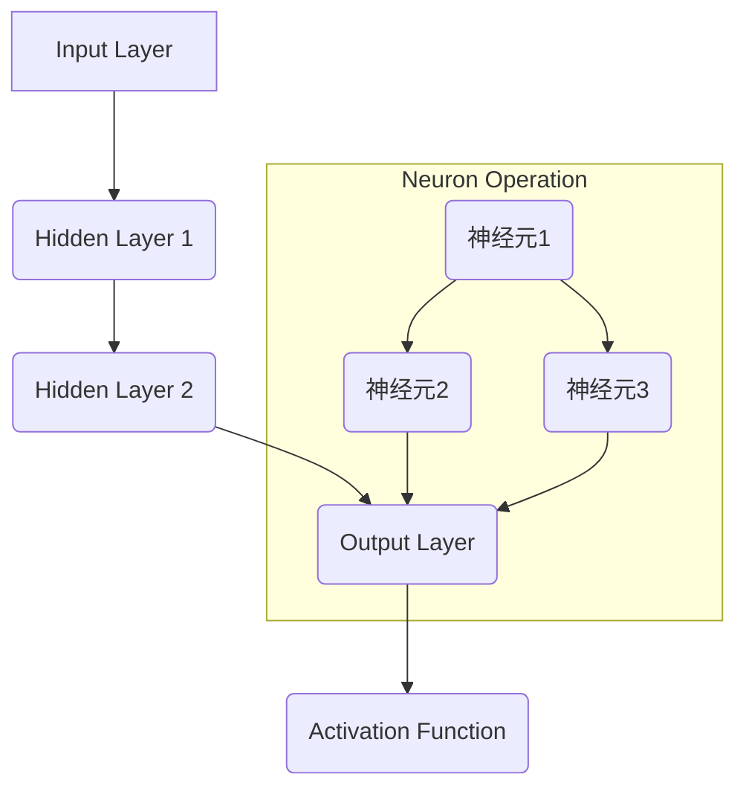

                 

### 文章标题

### Neural Networks: The Extension of Human Intelligence

在21世纪，随着科技的迅猛发展，人工智能成为了引领未来的一股强大力量。而神经网络作为人工智能的核心技术，正日益改变着我们的生活。本文将探讨神经网络如何成为人类智慧的延伸，从背景介绍到实际应用，带您深入理解这一激动人心的技术。

Keywords: Neural Networks, Artificial Intelligence, Human Intelligence, Machine Learning, Application Scenarios

Abstract:
This article provides a comprehensive exploration of neural networks, highlighting their role as an extension of human intelligence. By examining the historical context, core concepts, algorithmic principles, mathematical models, and practical applications, we aim to offer readers a deep understanding of how neural networks are reshaping the future of technology and society.

### 1. 背景介绍

#### The Historical Background

神经网络这一概念起源于20世纪40年代，由心理学家沃伦·麦卡洛克（Warren McCulloch）和数学家沃尔特·皮茨（Walter Pitts）首次提出。他们构建了一个简单的人工神经元模型，试图模拟人类大脑的运作机制。然而，由于计算能力的限制，早期的神经网络研究进展缓慢。

真正推动神经网络发展的转折点出现在1986年，当时加拿大心理学家杰弗里·胡德（Jeffrey Hinton）等人提出了反向传播算法（Backpropagation Algorithm）。这一算法大大提高了神经网络的训练效率，使其在图像识别、语音识别等领域的应用取得了突破性进展。

#### The Rapid Development of Neural Networks

随着计算技术的进步，特别是近年来图形处理单元（GPU）的广泛应用，神经网络的计算能力得到了显著提升。深度学习（Deep Learning）成为了人工智能领域的一个重要分支，而神经网络则是深度学习的基础。近年来，神经网络在计算机视觉、自然语言处理、语音识别等多个领域取得了惊人的成果，展示出了强大的学习能力和泛化能力。

### 2. 核心概念与联系

#### Core Concepts and Architectures

神经网络的架构通常由多个层次组成，包括输入层、隐藏层和输出层。每个层次都包含多个神经元，神经元之间通过权重连接。输入层接收外部信息，隐藏层进行特征提取和变换，输出层生成最终结果。

神经网络的工作原理基于神经元之间的信息传递和激活函数。当输入通过神经网络传播时，每个神经元的输出会根据其连接的权重和激活函数进行计算。通过多轮迭代训练，神经网络可以不断调整权重，以达到更好的拟合效果。

神经网络的核心概念包括：

1. **神经元（Neuron）**：神经网络的基本计算单元，类似于生物神经元。
2. **层次（Hierarchy）**：神经网络通过多个层次的堆叠，实现对复杂数据的处理和分析。
3. **权重（Weights）**：神经元之间的连接权重，用于调节信息传递的强度。
4. **激活函数（Activation Function）**：用于计算神经元输出的非线性函数，常用的激活函数包括 sigmoid、ReLU 等。
5. **反向传播（Backpropagation）**：一种用于训练神经网络的算法，通过不断调整权重，使网络输出接近预期目标。

#### Mermaid 流程图



### 3. 核心算法原理 & 具体操作步骤

#### Core Algorithm Principles and Operational Steps

神经网络的核心算法是反向传播算法（Backpropagation Algorithm）。反向传播算法通过以下步骤进行训练：

1. **前向传播（Forward Propagation）**：将输入数据传递到神经网络，计算每个神经元的输出。
2. **计算损失（Calculate Loss）**：计算网络输出与真实值之间的误差，使用损失函数（如均方误差、交叉熵等）进行量化。
3. **反向传播（Backpropagation）**：将损失反向传递到神经网络，计算每个神经元的梯度。
4. **更新权重（Update Weights）**：根据梯度调整神经元的权重，以减少损失。
5. **迭代训练（Iterative Training）**：重复上述步骤，直到网络输出达到预期精度。

以下是反向传播算法的详细步骤：

#### Detailed Steps of Backpropagation Algorithm

1. **初始化**：设置初始权重和偏置，选择合适的激活函数。
2. **前向传播**：
   - 计算输入层到隐藏层的输出。
   - 计算隐藏层到输出层的输出。
3. **计算损失**：
   - 使用损失函数计算输出层误差。
   - 计算隐藏层误差。
4. **反向传播**：
   - 计算输出层到隐藏层的梯度。
   - 计算隐藏层到输入层的梯度。
5. **更新权重**：
   - 根据梯度调整隐藏层和输入层的权重。
6. **迭代训练**：重复步骤 2-5，直到网络收敛。

### 4. 数学模型和公式 & 详细讲解 & 举例说明

#### Mathematical Models and Detailed Explanations

神经网络的数学模型基于线性代数和微积分。以下是神经网络中常用的数学公式：

#### Neural Network Mathematical Formulas

1. **前向传播**：
   $$ a_{l} = \sigma(W_{l}a_{l-1} + b_{l}) $$
   其中，$a_{l}$ 表示第 $l$ 层的输出，$W_{l}$ 表示第 $l$ 层的权重矩阵，$b_{l}$ 表示第 $l$ 层的偏置向量，$\sigma$ 表示激活函数。

2. **损失函数**：
   $$ J = \frac{1}{2} \sum_{i=1}^{n} (y_i - \hat{y}_i)^2 $$
   其中，$J$ 表示损失函数，$y_i$ 表示真实标签，$\hat{y}_i$ 表示预测值。

3. **梯度计算**：
   $$ \frac{\partial J}{\partial W_{l}} = \frac{\partial L}{\partial a_{l}} \cdot \frac{\partial a_{l}}{\partial z_{l}} $$
   $$ \frac{\partial J}{\partial b_{l}} = \frac{\partial L}{\partial a_{l}} \cdot \frac{\partial a_{l}}{\partial z_{l}} $$

#### Example of Neural Network Calculation

假设我们有一个简单的神经网络，包含一个输入层、一个隐藏层和一个输出层。输入层有3个神经元，隐藏层有2个神经元，输出层有1个神经元。激活函数使用 sigmoid 函数。

#### Example of Neural Network Calculation

1. **初始化权重和偏置**：
   - $W_{1} \in \mathbb{R}^{2 \times 3}$，$b_{1} \in \mathbb{R}^{2}$，$W_{2} \in \mathbb{R}^{1 \times 2}$，$b_{2} \in \mathbb{R}^{1}$
   - 初始化权重和偏置为较小的随机值。

2. **前向传播**：
   - 输入层到隐藏层的输出：
     $$ a_{1}^{(1)} = \sigma(W_{1}a_{0} + b_{1}) $$
   - 隐藏层到输出层的输出：
     $$ a_{2}^{(2)} = \sigma(W_{2}a_{1} + b_{2}) $$

3. **计算损失**：
   - 使用均方误差损失函数：
     $$ J = \frac{1}{2} \sum_{i=1}^{n} (y_i - \hat{y}_i)^2 $$

4. **反向传播**：
   - 计算输出层误差：
     $$ \delta_{2}^{(2)} = (y - \hat{y}) \cdot \sigma'(a_{2}^{(2)}) $$
   - 计算隐藏层误差：
     $$ \delta_{1}^{(1)} = W_{2}^{T} \delta_{2}^{(2)} \cdot \sigma'(a_{1}^{(1)}) $$

5. **更新权重和偏置**：
   - 更新隐藏层权重和偏置：
     $$ W_{2} := W_{2} - \alpha \frac{\partial J}{\partial W_{2}} $$
     $$ b_{2} := b_{2} - \alpha \frac{\partial J}{\partial b_{2}} $$
   - 更新输入层权重和偏置：
     $$ W_{1} := W_{1} - \alpha \frac{\partial J}{\partial W_{1}} $$
     $$ b_{1} := b_{1} - \alpha \frac{\partial J}{\partial b_{1}} $$

通过不断迭代训练，神经网络的预测精度将逐步提高。

### 5. 项目实践：代码实例和详细解释说明

#### Project Practice: Code Examples and Detailed Explanations

在本节中，我们将通过一个简单的神经网络项目，展示如何使用 Python 编写和训练一个神经网络。以下是一个简单的神经网络代码实例：

```python
import numpy as np

# 初始化权重和偏置
W1 = np.random.rand(2, 3)
b1 = np.random.rand(2)
W2 = np.random.rand(1, 2)
b2 = np.random.rand(1)

# 激活函数
def sigmoid(x):
    return 1 / (1 + np.exp(-x))

# 前向传播
def forward(x):
    a1 = sigmoid(np.dot(W1.T, x) + b1)
    a2 = sigmoid(np.dot(W2.T, a1) + b2)
    return a2

# 计算损失
def loss(y, y_pred):
    return 0.5 * np.mean((y - y_pred) ** 2)

# 反向传播
def backward(x, y, y_pred):
    delta2 = (y - y_pred) * sigmoid(y_pred) * (1 - sigmoid(y_pred))
    delta1 = np.dot(W2, delta2) * sigmoid(a1) * (1 - sigmoid(a1))
    
    dW2 = np.dot(delta2, a1.T)
    db2 = delta2
    dW1 = np.dot(delta1, x.T)
    db1 = delta1
    
    return dW1, dW2, db1, db2

# 训练神经网络
def train(x, y, epochs, learning_rate):
    for epoch in range(epochs):
        y_pred = forward(x)
        loss_val = loss(y, y_pred)
        
        dW1, dW2, db1, db2 = backward(x, y, y_pred)
        
        W1 -= learning_rate * dW1
        b1 -= learning_rate * db1
        W2 -= learning_rate * dW2
        b2 -= learning_rate * db2
        
        if epoch % 100 == 0:
            print(f"Epoch {epoch}, Loss: {loss_val}")

# 测试神经网络
x_test = np.array([[0, 0], [0, 1], [1, 0], [1, 1]])
y_test = np.array([0, 1, 1, 0])

y_pred = forward(x_test)
print("Predictions:", y_pred)
print("Actual Labels:", y_test)
```

#### Code Explanation and Analysis

1. **初始化权重和偏置**：
   - 初始化隐藏层和输出层的权重和偏置为较小的随机值。

2. **激活函数**：
   - 使用 sigmoid 函数作为激活函数。

3. **前向传播**：
   - 计算输入层到隐藏层的输出。
   - 计算隐藏层到输出层的输出。

4. **计算损失**：
   - 使用均方误差损失函数计算输出层误差。

5. **反向传播**：
   - 计算输出层误差的梯度。
   - 计算隐藏层误差的梯度。

6. **更新权重和偏置**：
   - 根据梯度调整隐藏层和输出层的权重和偏置。

7. **训练神经网络**：
   - 通过迭代训练，调整权重和偏置，使网络输出更接近真实值。

8. **测试神经网络**：
   - 使用测试数据集评估神经网络的表现。

通过这个简单的神经网络项目，我们可以看到神经网络的基本原理和训练过程。在实际应用中，神经网络可能涉及更复杂的结构、更多的层次和更丰富的数据集，但核心原理和步骤是相似的。

### 6. 实际应用场景

#### Practical Application Scenarios

神经网络在各个领域都有广泛的应用，以下是一些典型的实际应用场景：

1. **计算机视觉（Computer Vision）**：
   - 图像识别：如人脸识别、物体检测、图像分类等。
   - 图像生成：如生成对抗网络（GANs）、风格迁移等。

2. **自然语言处理（Natural Language Processing）**：
   - 机器翻译：如谷歌翻译、百度翻译等。
   - 文本分类：如垃圾邮件过滤、情感分析等。
   - 自动问答：如 ChatGPT、DoftAlpaca 等。

3. **语音识别（Speech Recognition）**：
   - 语音转文本：如苹果 Siri、谷歌语音搜索等。
   - 语音合成：如谷歌语音合成器、微软小冰等。

4. **游戏（Games）**：
   - 游戏AI：如电子游戏中的智能对手、自动驾驶等。

5. **金融（Finance）**：
   - 股票市场预测：如股票价格预测、风险控制等。
   - 信用评分：如信用卡欺诈检测、信用评级等。

6. **医疗（Medical）**：
   - 疾病诊断：如癌症检测、糖尿病监测等。
   - 医疗图像分析：如X光片、CT扫描、MRI等。

### 7. 工具和资源推荐

#### Tools and Resources Recommendations

为了更好地学习和实践神经网络，以下是一些推荐的工具和资源：

1. **学习资源**：
   - 书籍：《深度学习》（Goodfellow et al.）、《神经网络与深度学习》（邱锡鹏）等。
   - 博客：阿里云 AI 博客、Google AI 博客等。

2. **开发工具框架**：
   - 深度学习框架：TensorFlow、PyTorch、Keras 等。
   - 编程环境：Jupyter Notebook、Google Colab 等。

3. **相关论文著作**：
   - 《A Theoretical Framework for Back-Propagation》（1986）。
   - 《Deep Learning》（2016）。
   - 《Generative Adversarial Nets》（2014）。

### 8. 总结：未来发展趋势与挑战

#### Summary: Future Development Trends and Challenges

神经网络作为人工智能的核心技术，正不断推动科技和社会的进步。未来，神经网络的发展趋势包括：

1. **更深的网络结构**：随着计算能力的提升，研究人员正在尝试更深的神经网络结构，以进一步提高模型的性能。

2. **更高效的学习算法**：研究人员致力于开发更高效、更鲁棒的训练算法，以加速神经网络的学习过程。

3. **跨领域应用**：神经网络将在更多的领域得到应用，如生物医学、环境保护、金融科技等。

然而，神经网络的发展也面临一些挑战：

1. **计算资源消耗**：神经网络训练需要大量的计算资源，特别是深度神经网络。

2. **数据隐私和安全**：神经网络训练和处理需要大量的数据，如何在保护用户隐私的同时利用数据，是一个亟待解决的问题。

3. **算法透明性和可解释性**：神经网络的行为复杂，如何解释和验证其决策过程，是一个重要的研究方向。

### 9. 附录：常见问题与解答

#### Frequently Asked Questions and Answers

1. **神经网络是什么？**
   神经网络是一种模拟生物神经元结构和功能的计算模型，用于处理和分类数据。

2. **神经网络如何工作？**
   神经网络通过多个层次的堆叠，对输入数据进行特征提取和变换，最终生成预测结果。

3. **神经网络有哪些应用？**
   神经网络在计算机视觉、自然语言处理、语音识别、金融、医疗等多个领域都有广泛应用。

4. **如何训练神经网络？**
   神经网络的训练过程包括前向传播、损失计算、反向传播和权重更新等步骤。

5. **神经网络有哪些挑战？**
   神经网络面临计算资源消耗、数据隐私和安全、算法透明性和可解释性等挑战。

### 10. 扩展阅读 & 参考资料

#### Extended Reading & Reference Materials

1. **书籍**：
   - Goodfellow, I., Bengio, Y., & Courville, A. (2016). *Deep Learning*.
   - 邱锡鹏. (2018). *神经网络与深度学习*.

2. **论文**：
   - Rumelhart, D. E., Hinton, G. E., & Williams, R. J. (1986). *Learning representations by back-propagating errors*.
   - Goodfellow, I., Pouget-Abadie, J., Mirza, M., Xu, B., Warde-Farley, D., Ozair, S., ... & Bengio, Y. (2014). *Generative adversarial nets*.

3. **博客**：
   - 阿里云 AI 博客.
   - Google AI 博客.

4. **网站**：
   - TensorFlow.
   - PyTorch.

### 作者署名

作者：禅与计算机程序设计艺术 / Zen and the Art of Computer Programming

