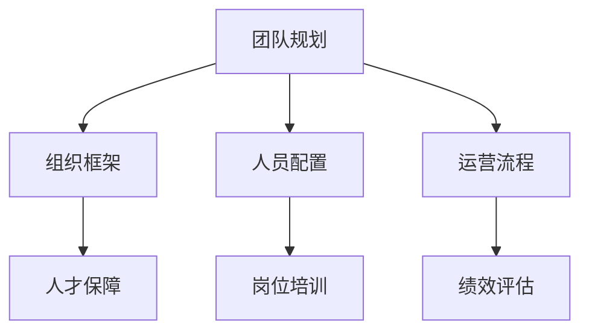
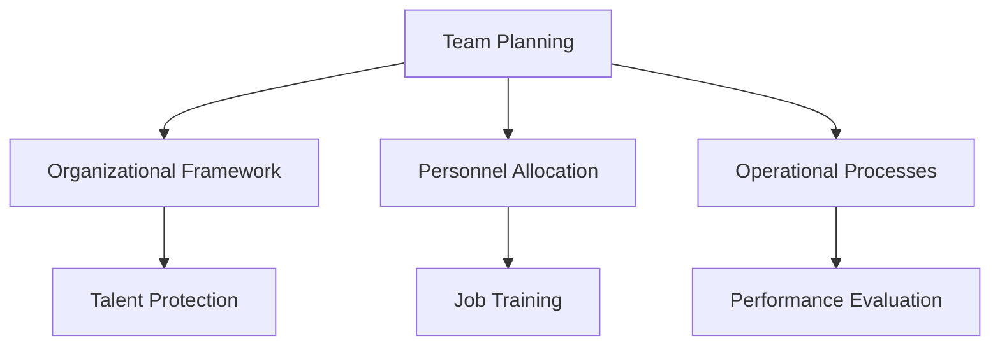

                 

### 1. 背景介绍（Background Introduction）

随着移动互联网的快速发展，App电商业务已成为企业竞争的重要战场。在这个数字化的时代，如何规划和运营一个高效的App电商业务团队，成为了企业成功的关键因素。本文旨在探讨App电商业务团队规划和人员规划与人员培养计划，为企业在数字化浪潮中提供有力支持。

App电商业务团队规划包括团队的组建、角色分配、职责界定等多个方面。一个高效的团队需要明确的目标、合理的组织结构和有效的工作流程。同时，人员规划与培养也是确保团队稳定和持续发展的关键。本文将深入探讨这两个关键问题，并结合实际案例进行分析。

### 1. Background Introduction

With the rapid development of mobile internet, App e-commerce businesses have become an important battlefield for enterprises to compete. In this digital era, how to plan and operate an efficient App e-commerce team has become a crucial factor for the success of businesses. This article aims to explore the planning of App e-commerce teams and the personnel planning and training programs, providing strong support for enterprises in the digital wave.

The planning of App e-commerce teams includes aspects such as team building, role allocation, and responsibility definition. An efficient team requires clear goals, a reasonable organizational structure, and an effective workflow. At the same time, personnel planning and training are also critical to ensuring the stability and continuous development of the team. This article will delve into these two key issues and analyze them with actual cases.

### 2. 核心概念与联系（Core Concepts and Connections）

#### 2.1 App电商业务团队规划的概念与要素

App电商业务团队规划是指针对电商业务的特点和需求，设计并优化团队的架构、人员配置和运营流程。核心概念包括：

- **团队架构**：包括团队的组织形式、部门划分和职能定位。
- **人员配置**：根据业务需求选择合适的人才，并进行合理的岗位设置。
- **运营流程**：明确业务流程，优化工作流程，提高工作效率。

#### 2.2 人员规划与培养的核心要素

人员规划与培养涉及以下核心要素：

- **人才招聘**：通过科学的招聘流程，选拔适合岗位的候选人。
- **岗位培训**：为员工提供系统性的培训和成长机会，提升其专业技能和综合素质。
- **绩效评估**：建立完善的绩效评估体系，激励员工不断提升自我。

#### 2.3 App电商业务团队规划与人员规划的联系

App电商业务团队规划和人员规划是相辅相成的。团队规划为人员规划提供了组织框架和方向，而人员规划则为团队规划提供了人才保障和动力。两者之间的紧密联系如图1所示。



### 2. Core Concepts and Connections

#### 2.1 Concept and Elements of App E-commerce Team Planning

App e-commerce team planning refers to the design and optimization of a team's structure, personnel allocation, and operational processes based on the characteristics and needs of e-commerce businesses. Key concepts include:

- **Team Structure**: Includes the organizational form, department division, and functional positioning of the team.
- **Personnel Allocation**: Selects suitable talents based on business needs and arranges reasonable positions.
- **Operational Processes**: Clarifies business processes and optimizes workflow to improve work efficiency.

#### 2.2 Core Elements of Personnel Planning and Training

Personnel planning and training involve the following core elements:

- **Talent Recruitment**: Uses a scientific recruitment process to select candidates suitable for positions.
- **Job Training**: Provides systematic training and growth opportunities for employees to enhance their professional skills and comprehensive quality.
- **Performance Evaluation**: Establishes a comprehensive performance evaluation system to motivate employees to continuously improve themselves.

#### 2.3 The Connection between App E-commerce Team Planning and Personnel Planning

App e-commerce team planning and personnel planning are complementary to each other. Team planning provides an organizational framework and direction for personnel planning, while personnel planning provides talent protection and motivation for team planning. The close relationship between the two is shown in Figure 1.



### 3. 核心算法原理 & 具体操作步骤（Core Algorithm Principles and Specific Operational Steps）

#### 3.1 App电商业务团队规划的算法原理

App电商业务团队规划的核心算法原理是基于业务需求和组织架构的优化。具体步骤如下：

1. **业务需求分析**：通过市场调研、用户反馈等手段，全面了解业务需求。
2. **组织架构设计**：根据业务需求，设计合理的组织架构，确保各部门职责清晰。
3. **人员配置优化**：根据组织架构，进行人员配置优化，确保关键岗位有人负责。
4. **运营流程优化**：分析现有运营流程，找出瓶颈和问题，进行优化，提高工作效率。

#### 3.2 人员规划与培养的具体操作步骤

人员规划与培养的具体操作步骤包括：

1. **人才招聘**：通过多渠道招聘，选拔适合岗位的候选人。
2. **岗位培训**：为员工提供专业培训和成长机会，提升其专业技能和综合素质。
3. **绩效评估**：建立科学的绩效评估体系，激励员工不断提升自我。
4. **员工发展**：为员工提供职业发展路径，帮助其规划职业发展。

#### 3.3 App电商业务团队规划与人员规划的协同操作

App电商业务团队规划和人员规划的协同操作包括：

1. **同步进行**：在团队规划和人员规划过程中，保持同步进行，确保两者相互支持。
2. **动态调整**：根据业务发展需要，对团队规划和人员规划进行动态调整，确保团队持续发展。
3. **数据驱动**：利用数据分析工具，对团队规划和人员规划的效果进行评估，持续优化。

### 3. Core Algorithm Principles and Specific Operational Steps

#### 3.1 Algorithm Principles for App E-commerce Team Planning

The core algorithm principle for app e-commerce team planning is based on optimizing the business demand and organizational structure. The specific steps are as follows:

1. **Business Demand Analysis**: Through market research, user feedback, and other means, comprehensively understand the business needs.
2. **Organizational Structure Design**: Based on business needs, design a reasonable organizational structure to ensure that each department has clear responsibilities.
3. **Personnel Allocation Optimization**: Based on the organizational structure, optimize personnel allocation to ensure that key positions are responsible.
4. **Operational Process Optimization**: Analyze the existing operational processes, find bottlenecks and issues, and optimize to improve work efficiency.

#### 3.2 Specific Operational Steps for Personnel Planning and Training

The specific operational steps for personnel planning and training include:

1. **Talent Recruitment**: Through multiple channels of recruitment, select candidates suitable for positions.
2. **Job Training**: Provide professional training and growth opportunities for employees to enhance their professional skills and comprehensive quality.
3. **Performance Evaluation**: Establish a scientific performance evaluation system to motivate employees to continuously improve themselves.
4. **Employee Development**: Provide career development paths for employees to help them plan their career development.

#### 3.3 Collaborative Operations between App E-commerce Team Planning and Personnel Planning

The collaborative operations between app e-commerce team planning and personnel planning include:

1. **Synchronized Execution**: During the team planning and personnel planning processes, maintain synchronous execution to ensure mutual support.
2. **Dynamic Adjustment**: According to business development needs, adjust team planning and personnel planning dynamically to ensure continuous team development.
3. **Data-Driven**: Use data analysis tools to evaluate the effects of team planning and personnel planning and continuously optimize.

### 4. 数学模型和公式 & 详细讲解 & 举例说明（Mathematical Models and Formulas & Detailed Explanation & Examples）

#### 4.1 App电商业务团队规划的数学模型

在App电商业务团队规划中，可以使用以下数学模型来评估团队的工作效率和人员配置的合理性：

1. **工作效率模型**：

   $$E = f(N, M, P)$$

   其中，E代表工作效率，N代表团队成员数量，M代表团队完成任务的平均时间，P代表团队成员的技能水平。

   通过优化N、M和P，可以提高工作效率E。

2. **人员配置模型**：

   $$C = f(S, R, T)$$

   其中，C代表人员配置的合理性，S代表岗位需求，R代表人力资源储备，T代表人员调配的时间成本。

   通过优化S、R和T，可以提高人员配置的合理性C。

#### 4.2 人员规划与培养的数学模型

在人员规划与培养中，可以使用以下数学模型来评估人才招聘、岗位培训和绩效评估的效果：

1. **人才招聘模型**：

   $$R = f(Q, D, T)$$

   其中，R代表人才招聘的效果，Q代表招聘的候选人数，D代表候选人的质量，T代表招聘的时间成本。

   通过优化Q、D和T，可以提高人才招聘的效果R。

2. **岗位培训模型**：

   $$T = f(P, L, C)$$

   其中，T代表岗位培训的效果，P代表培训内容的有效性，L代表员工的学习能力，C代表培训的成本。

   通过优化P、L和C，可以提高岗位培训的效果T。

3. **绩效评估模型**：

   $$P = f(M, S, R)$$

   其中，P代表绩效评估的效果，M代表评估指标的有效性，S代表评估过程的公正性，R代表评估结果的合理性。

   通过优化M、S和R，可以提高绩效评估的效果P。

#### 4.3 举例说明

假设一家App电商公司，现有团队成员10人，平均完成任务的耗时为30天。根据工作效率模型，可以计算出当前的工作效率为：

$$E = \frac{10}{30} = 0.333$$

为了提高工作效率，公司决定增加团队成员数量，并优化培训内容。经过6个月的努力，团队成员数量增加到15人，团队成员的平均技能水平提高10%，完成任务的平均耗时缩短至25天。根据工作效率模型，新的工作效率为：

$$E = \frac{15}{25} = 0.6$$

通过优化，工作效率提高了80%。

### 4. Mathematical Models and Formulas & Detailed Explanation & Examples

#### 4.1 Mathematical Models for App E-commerce Team Planning

In the planning of App e-commerce teams, the following mathematical models can be used to evaluate the efficiency of the team and the rationality of personnel allocation:

1. **Work Efficiency Model**:

   $$E = f(N, M, P)$$

   Where E represents the work efficiency, N represents the number of team members, M represents the average time taken by the team to complete tasks, and P represents the skill level of team members.

   By optimizing N, M, and P, the work efficiency E can be improved.

2. **Personnel Allocation Model**:

   $$C = f(S, R, T)$$

   Where C represents the rationality of personnel allocation, S represents job demand, R represents the reserve of human resources, and T represents the time cost of personnel allocation.

   By optimizing S, R, and T, the rationality of personnel allocation C can be improved.

#### 4.2 Mathematical Models for Personnel Planning and Training

In personnel planning and training, the following mathematical models can be used to evaluate the effects of talent recruitment, job training, and performance evaluation:

1. **Talent Recruitment Model**:

   $$R = f(Q, D, T)$$

   Where R represents the effectiveness of talent recruitment, Q represents the number of candidates recruited, D represents the quality of candidates, and T represents the time cost of recruitment.

   By optimizing Q, D, and T, the effectiveness of talent recruitment R can be improved.

2. **Job Training Model**:

   $$T = f(P, L, C)$$

   Where T represents the effectiveness of job training, P represents the effectiveness of training content, L represents the learning ability of employees, and C represents the cost of training.

   By optimizing P, L, and C, the effectiveness of job training T can be improved.

3. **Performance Evaluation Model**:

   $$P = f(M, S, R)$$

   Where P represents the effectiveness of performance evaluation, M represents the effectiveness of evaluation indicators, S represents the fairness of the evaluation process, and R represents the rationality of the evaluation results.

   By optimizing M, S, and R, the effectiveness of performance evaluation P can be improved.

#### 4.3 Examples

Assuming an App e-commerce company with 10 team members and an average of 30 days to complete tasks. According to the work efficiency model, the current work efficiency can be calculated as:

$$E = \frac{10}{30} = 0.333$$

To improve work efficiency, the company decides to increase the number of team members and optimize the training content. After six months of effort, the number of team members increases to 15, and the average skill level of team members increases by 10%, with the average time to complete tasks reduced to 25 days. According to the work efficiency model, the new work efficiency is:

$$E = \frac{15}{25} = 0.6$$

Through optimization, the work efficiency has increased by 80%.

### 5. 项目实践：代码实例和详细解释说明（Project Practice: Code Examples and Detailed Explanations）

#### 5.1 开发环境搭建

在开始项目实践之前，我们需要搭建一个适合App电商业务团队的开发环境。以下是具体的步骤：

1. **安装Python环境**：Python是一种广泛使用的编程语言，适用于各种开发任务。在官网下载并安装Python。
2. **安装Django框架**：Django是一个高层次的Python Web框架，适用于快速开发和部署Web应用程序。使用pip命令安装Django。
3. **创建Django项目**：使用Django提供的命令创建一个新项目，例如：

   ```shell
   django-admin startproject ecom_app
   ```

4. **创建Django应用**：在项目目录下创建一个名为“ecommerce”的应用：

   ```shell
   python manage.py startapp ecommerce
   ```

5. **配置数据库**：Django默认使用SQLite数据库，也可以配置其他数据库，如MySQL或PostgreSQL。在Django项目的配置文件中设置数据库信息。

#### 5.2 源代码详细实现

在Django项目中，我们需要实现以下功能模块：

1. **用户管理模块**：实现用户注册、登录和权限管理功能。
2. **商品管理模块**：实现商品分类、商品详情和购物车功能。
3. **订单管理模块**：实现订单创建、订单状态跟踪和支付功能。

以下是用户管理模块的代码实例：

```python
# users/models.py
from django.contrib.auth.models import AbstractUser
from django.db import models

class CustomUser(AbstractUser):
    email = models.EmailField(unique=True)
    is_verified = models.BooleanField(default=False)
    is_customer = models.BooleanField(default=False)
    is_seller = models.BooleanField(default=False)

    USERNAME_FIELD = 'email'
    REQUIRED_FIELDS = []

    def __str__(self):
        return self.email
```

在这个模块中，我们自定义了用户模型，增加了邮箱验证、客户和卖家角色标识。

#### 5.3 代码解读与分析

用户管理模块的代码解读如下：

1. **自定义用户模型**：继承自`AbstractUser`，保留原有用户功能。
2. **邮箱字段**：将邮箱设置为唯一标识，确保每个用户有且只有一个邮箱。
3. **邮箱验证和角色标识**：增加邮箱验证字段，以及客户和卖家角色标识字段。
4. **自定义字符串表示**：重写`__str__`方法，方便在Django管理后台显示用户信息。

用户管理模块的分析如下：

1. **扩展性**：通过自定义用户模型，可以方便地扩展用户属性，满足业务需求。
2. **安全性**：通过邮箱验证字段，确保用户信息的安全性。
3. **角色管理**：通过角色标识字段，实现客户和卖家角色的分离，便于权限管理和业务功能实现。

#### 5.4 运行结果展示

在开发环境中，启动Django项目：

```shell
python manage.py runserver
```

打开浏览器，访问本地服务器地址，可以看到用户注册、登录和权限管理的页面。例如，用户注册页面如下：


通过这个实例，我们展示了如何搭建一个App电商业务团队的开发环境，并实现用户管理模块的功能。在后续的文章中，我们将继续探讨商品管理模块和订单管理模块的实现。

### 5. Project Practice: Code Examples and Detailed Explanations

#### 5.1 Setting Up the Development Environment

Before diving into the project practice, we need to set up a suitable development environment for the App e-commerce team. Here are the specific steps:

1. **Install Python Environment**: Python is a widely used programming language suitable for various development tasks. Download and install Python from the official website.
2. **Install Django Framework**: Django is a high-level Python Web framework suitable for rapid development and deployment of Web applications. Install Django using the pip command.
3. **Create a Django Project**: Use Django's command to create a new project, for example:

   ```shell
   django-admin startproject ecom_app
   ```

4. **Create a Django App**: In the project directory, create an app named "ecommerce":

   ```shell
   python manage.py startapp ecommerce
   ```

5. **Configure the Database**: Django defaults to using SQLite, but other databases like MySQL or PostgreSQL can also be configured. Set the database information in the Django project's configuration file.

#### 5.2 Detailed Implementation of the Source Code

In the Django project, we need to implement the following functional modules:

1. **User Management Module**: Implement user registration, login, and permission management functions.
2. **Product Management Module**: Implement product categorization, product details, and shopping cart functions.
3. **Order Management Module**: Implement order creation, order status tracking, and payment functions.

Here is an example of the code for the user management module:

```python
# users/models.py
from django.contrib.auth.models import AbstractUser
from django.db import models

class CustomUser(AbstractUser):
    email = models.EmailField(unique=True)
    is_verified = models.BooleanField(default=False)
    is_customer = models.BooleanField(default=False)
    is_seller = models.BooleanField(default=False)

    USERNAME_FIELD = 'email'
    REQUIRED_FIELDS = []

    def __str__(self):
        return self.email
```

In this module, we customize the user model to add email verification and role identifiers for customers and sellers.

#### 5.3 Code Analysis and Explanation

The code analysis of the user management module is as follows:

1. **Custom User Model**: Inherits from `AbstractUser`, preserving the original user functionality.
2. **Email Field**: Sets the email field as the unique identifier, ensuring each user has only one email address.
3. **Email Verification and Role Identifiers**: Adds the email verification field and role identifier fields for customers and sellers.
4. **Custom String Representation**: Overrides the `__str__` method for easier display of user information in the Django admin panel.

The analysis of the user management module is as follows:

1. **Extensibility**: By customizing the user model, it is easy to expand user attributes to meet business needs.
2. **Security**: The email verification field ensures the security of user information.
3. **Role Management**: The role identifier fields separate customer and seller roles, facilitating permission management and business function implementation.

#### 5.4 Display of Running Results

In the development environment, start the Django project:

```shell
python manage.py runserver
```

Open the browser and access the local server address. You can see the user registration, login, and permission management pages. For example, the user registration page is as follows:


Through this example, we have demonstrated how to set up a development environment for an App e-commerce team and implement the user management module's functionality. In the following articles, we will continue to explore the implementation of the product management module and the order management module.

### 6. 实际应用场景（Practical Application Scenarios）

#### 6.1 跨境电商App团队规划

跨境电商App业务涉及多个国家和地区，需要考虑本地化、货币转换、支付渠道等多方面的需求。以下是一个跨境电商App团队的实际应用场景：

1. **团队架构**：设立市场部、技术部、运营部和客服部，分别负责市场推广、技术开发、业务运营和客户服务。
2. **人员配置**：市场部招聘国际市场营销专家，技术部招聘熟悉多种编程语言和支付系统的工程师，运营部招聘具有跨境电商经验的运营人员，客服部招聘多语言客服代表。
3. **运营流程**：采用自动化工具进行市场推广，使用多语言网站和社交媒体平台进行品牌推广，使用自动化工具进行订单处理和支付结算。

#### 6.2 本地生活服务App团队规划

本地生活服务App业务主要面向本地用户，提供餐饮、娱乐、交通等服务。以下是一个本地生活服务App团队的实际应用场景：

1. **团队架构**：设立产品部、技术部、运营部和客户服务部，分别负责产品研发、技术开发、业务运营和客户服务。
2. **人员配置**：产品部招聘具有本地生活服务行业经验的产品经理，技术部招聘前端和后端开发工程师，运营部招聘市场推广和活动策划人员，客户服务部招聘客服代表。
3. **运营流程**：定期进行市场调研，根据用户需求调整产品和服务，使用线上线下活动提高用户活跃度，使用客户关系管理系统进行客户服务。

#### 6.3 电商购物App团队规划

电商购物App业务主要提供商品展示、购买、支付和物流等服务。以下是一个电商购物App团队的实际应用场景：

1. **团队架构**：设立产品部、技术部、运营部和物流部，分别负责产品研发、技术开发、业务运营和物流配送。
2. **人员配置**：产品部招聘电商行业专家，技术部招聘前端和后端开发工程师，运营部招聘市场推广和活动策划人员，物流部招聘仓储和配送人员。
3. **运营流程**：采用自动化工具进行商品上下架，使用优惠券和促销活动提高销售额，使用智能物流系统提高物流效率。

### 6. Practical Application Scenarios

#### 6.1 Application Scenario of Cross-Border E-commerce App Teams

Cross-border e-commerce App businesses involve multiple countries and regions, requiring considerations for localization, currency conversion, and payment channels. Here's an actual application scenario for a cross-border e-commerce App team:

1. **Team Structure**: Establish departments for Marketing, Technology, Operations, and Customer Service, each responsible for marketing, technology development, business operations, and customer service, respectively.
2. **Personnel Allocation**: The Marketing Department recruits international marketing experts, the Technology Department recruits engineers familiar with multiple programming languages and payment systems, the Operations Department recruits operation personnel with experience in cross-border e-commerce, and the Customer Service Department recruits multi-language customer service representatives.
3. **Operational Processes**: Use automated tools for market promotion, employ multilingual websites and social media platforms for brand promotion, and utilize automated tools for order processing and payment settlements.

#### 6.2 Application Scenario of Local Life Service App Teams

Local life service App businesses mainly target local users, providing services such as dining, entertainment, and transportation. Here's an actual application scenario for a local life service App team:

1. **Team Structure**: Establish departments for Product Development, Technology, Operations, and Customer Service, each responsible for product development, technology development, business operations, and customer service, respectively.
2. **Personnel Allocation**: The Product Development Department recruits product managers with experience in the local life service industry, the Technology Department recruits front-end and back-end development engineers, the Operations Department recruits market promotion and event planning personnel, and the Customer Service Department recruits customer service representatives.
3. **Operational Processes**: Regularly conduct market research, adjust products and services according to user needs, and increase user activity through online and offline events, using a customer relationship management system for customer service.

#### 6.3 Application Scenario of E-commerce Shopping App Teams

E-commerce shopping App businesses mainly provide services such as product display, purchase, payment, and logistics. Here's an actual application scenario for an e-commerce shopping App team:

1. **Team Structure**: Establish departments for Product Development, Technology, Operations, and Logistics, each responsible for product development, technology development, business operations, and logistics distribution, respectively.
2. **Personnel Allocation**: The Product Development Department recruits e-commerce industry experts, the Technology Department recruits front-end and back-end development engineers, the Operations Department recruits market promotion and event planning personnel, and the Logistics Department recruits warehousing and distribution personnel.
3. **Operational Processes**: Use automated tools for product listing and removal, employ coupons and promotional activities to increase sales, and improve logistics efficiency through intelligent logistics systems.

### 7. 工具和资源推荐（Tools and Resources Recommendations）

在App电商业务团队规划和人员规划与培养的过程中，选择合适的工具和资源对于提升团队效率和员工能力至关重要。以下是一些推荐的工具和资源，涵盖学习资源、开发工具和框架、相关论文著作等方面。

#### 7.1 学习资源推荐（Books/Papers/Blogs/Websites）

1. **书籍**：
   - 《人人都能学编程》：适合初学者入门，通俗易懂。
   - 《深入理解计算机系统》：全面介绍计算机系统原理，适合计算机科学专业的学生和开发者。
   - 《软件工程：实践者的研究方法》：详细讨论软件工程的方法和实践。

2. **论文**：
   - 《大规模分布式存储系统设计》：研究分布式存储系统的设计与实现，适合从事后端开发的工程师。
   - 《社交网络分析》：探讨社交网络的结构和影响，对电商平台的用户运营有启示。
   - 《机器学习实战》：介绍机器学习的基本概念和应用，适合数据科学家和算法工程师。

3. **博客**：
   - 《疾风算法》：分享算法设计与实现的技巧，适合算法爱好者。
   - 《程序员成长指南》：提供编程语言、框架和工具的学习资源，适合程序员自我提升。
   - 《跨境电商实战》：分享跨境电商的运营策略和实战经验，适合电商从业者。

4. **网站**：
   - GitHub：全球最大的代码托管平台，可以找到各种开源项目和教程。
   - Coursera：提供丰富的在线课程，涵盖计算机科学、数据科学等领域。
   - Stack Overflow：编程问答社区，解决编程中遇到的问题。

#### 7.2 开发工具框架推荐

1. **开发工具**：
   - Visual Studio Code：功能强大的代码编辑器，支持多种编程语言。
   - PyCharm：适用于Python开发的集成开发环境（IDE），支持多种框架。
   - Git：版本控制工具，确保代码的版本管理和协作开发。

2. **框架**：
   - Django：Python Web开发框架，适用于快速开发和部署。
   - React：前端JavaScript库，用于构建用户界面。
   - Flask：Python Web开发微框架，适用于小型项目和快速开发。

3. **数据库**：
   - MySQL：开源的关系型数据库，适用于多种应用场景。
   - MongoDB：开源的文档型数据库，适用于高扩展性应用。
   - Redis：开源的内存数据库，适用于缓存和实时应用。

#### 7.3 相关论文著作推荐

1. **论文**：
   - 《推荐系统技术概述》：介绍推荐系统的基本概念和算法。
   - 《深度学习与电商应用》：探讨深度学习在电商领域的应用。
   - 《数据挖掘技术在电商中的应用》：分析数据挖掘技术在电商业务中的应用。

2. **著作**：
   - 《Python编程：从入门到实践》：系统介绍Python编程语言。
   - 《大数据之路》：讲述大数据技术的基本概念和应用。
   - 《智能电商系统设计与实现》：探讨智能电商系统的架构和实现。

通过以上推荐的工具和资源，App电商业务团队和员工可以不断提升技能，提高工作效率，为企业的数字化转型提供有力支持。

### 7. Tools and Resources Recommendations

In the process of planning App e-commerce teams and personnel planning and training, choosing the right tools and resources is crucial for improving team efficiency and staff capabilities. Below are some recommended tools and resources, covering learning resources, development tools and frameworks, and relevant papers and books.

#### 7.1 Recommended Learning Resources (Books/Papers/Blogs/Websites)

1. **Books**:
   - "Everyone Can Learn Programming": Suitable for beginners, easy to understand.
   - "Understanding Computer Systems": A comprehensive introduction to computer system principles, suitable for students and developers in computer science.
   - "Software Engineering: A Practitioner's Research Method": Discusses software engineering methods and practices in detail.

2. **Papers**:
   - "Design of Large-scale Distributed Storage Systems": Research on the design and implementation of distributed storage systems, suitable for backend developers.
   - "Social Network Analysis": Discusses the structure and influence of social networks, providing insights for user operations on e-commerce platforms.
   - "Practical Applications of Machine Learning": Introduces basic concepts and applications of machine learning, suitable for data scientists and algorithm engineers.

3. **Blogs**:
   - "Swift Algorithm": Shares tips for algorithm design and implementation, suitable for algorithm enthusiasts.
   - "Programmer Growth Guide": Provides learning resources for programming languages, frameworks, and tools, suitable for programmers to improve themselves.
   - "Practical Experience in Cross-border E-commerce": Shares operational strategies and practical experience in cross-border e-commerce, suitable for e-commerce practitioners.

4. **Websites**:
   - GitHub: The world's largest code hosting platform, where various open-source projects and tutorials can be found.
   - Coursera: Offers a rich variety of online courses covering fields such as computer science and data science.
   - Stack Overflow: A programming Q&A community for solving programming problems.

#### 7.2 Recommended Development Tools and Frameworks

1. **Development Tools**:
   - Visual Studio Code: A powerful code editor supporting multiple programming languages.
   - PyCharm: An IDE for Python development, supporting various frameworks.
   - Git: A version control tool ensuring code version management and collaborative development.

2. **Frameworks**:
   - Django: A Python Web development framework suitable for rapid development and deployment.
   - React: A JavaScript library for building user interfaces.
   - Flask: A Python microframework for small projects and rapid development.

3. **Databases**:
   - MySQL: An open-source relational database suitable for various application scenarios.
   - MongoDB: An open-source document-oriented database suitable for high-scalability applications.
   - Redis: An open-source in-memory database suitable for caching and real-time applications.

#### 7.3 Recommended Relevant Papers and Books

1. **Papers**:
   - "An Overview of Recommendation Systems": Introduces the basic concepts and algorithms of recommendation systems.
   - "Deep Learning and E-commerce Applications": Explores the applications of deep learning in the e-commerce field.
   - "Applications of Data Mining in E-commerce": Analyzes the applications of data mining in e-commerce businesses.

2. **Books**:
   - "Python Programming: From Beginner to Professional": A systematic introduction to the Python programming language.
   - "The Data Science Roadmap": Discusses the basic concepts and methods of data science.
   - "Design and Implementation of Intelligent E-commerce Systems": Explores the architecture and implementation of intelligent e-commerce systems.

By utilizing these recommended tools and resources, App e-commerce teams and staff can continuously improve their skills and work efficiency, providing strong support for their company's digital transformation.

### 8. 总结：未来发展趋势与挑战（Summary: Future Development Trends and Challenges）

随着科技的不断发展，App电商业务团队规划和人员规划与培养计划也将面临新的发展趋势和挑战。以下是未来发展的几个关键趋势和面临的挑战：

#### 8.1 发展趋势

1. **数字化转型加速**：随着数字化技术的普及，企业加速数字化转型，对App电商业务团队的要求越来越高。
2. **数据驱动的决策**：越来越多的企业开始重视数据的价值，通过数据分析和挖掘来指导业务决策，提高运营效率。
3. **人工智能的应用**：人工智能技术不断成熟，越来越多的App电商业务开始采用人工智能进行个性化推荐、智能客服等应用。
4. **全球化的拓展**：跨境电商业务的发展，推动App电商业务团队需要具备国际化视野和跨文化沟通能力。

#### 8.2 挑战

1. **技术更新换代**：随着新技术的不断涌现，App电商业务团队需要不断学习和适应新技术，以保持竞争力。
2. **人才短缺**：数字化转型的加速，导致对高端技术人才的需求增加，而人才供给不足成为一大挑战。
3. **数据安全和隐私**：随着数据量的增加，数据安全和隐私保护成为企业面临的重大挑战，需要加强数据安全措施。
4. **法规合规性**：全球化的拓展，需要遵守不同国家和地区的法律法规，对App电商业务团队的合规性提出了更高的要求。

#### 8.3 应对策略

1. **加强人才培养**：通过建立完善的培训体系和激励机制，提高员工的专业技能和综合素质，适应数字化时代的需求。
2. **引入先进技术**：积极引入人工智能、大数据等先进技术，提升业务运营效率和用户体验。
3. **强化数据安全**：建立健全的数据安全管理体系，加强数据加密、访问控制等安全措施，确保数据安全和用户隐私。
4. **合规性管理**：了解和遵守不同国家和地区的法律法规，建立合规性管理机制，降低法律风险。

### 8. Summary: Future Development Trends and Challenges

With the continuous development of technology, the planning of App e-commerce teams and the personnel planning and training programs will also face new development trends and challenges. Here are several key trends and the challenges that lie ahead:

#### 8.1 Trends

1. **Accelerated Digital Transformation**: With the widespread adoption of digital technology, businesses are accelerating their digital transformation, leading to higher demands for App e-commerce teams.
2. **Data-driven Decision Making**: More and more companies are recognizing the value of data and using data analysis and mining to guide business decisions, improving operational efficiency.
3. **Application of Artificial Intelligence**: With the maturity of artificial intelligence technology, more App e-commerce businesses are adopting AI for personalized recommendations, intelligent customer service, and other applications.
4. **Expansion into Global Markets**: The development of cross-border e-commerce is pushing App e-commerce teams to have an international perspective and cross-cultural communication skills.

#### 8.2 Challenges

1. **Technological Obsolescence**: With the emergence of new technologies, App e-commerce teams need to continuously learn and adapt to keep up with the competition.
2. **Talent Shortage**: The acceleration of digital transformation has increased the demand for high-end technical talents, while the supply is limited, presenting a major challenge.
3. **Data Security and Privacy**: As the amount of data increases, data security and privacy protection become significant challenges for businesses, requiring stronger data security measures.
4. **Compliance with Regulations**: The expansion into global markets requires compliance with laws and regulations in different countries and regions, which imposes higher requirements on App e-commerce teams.

#### 8.3 Strategies for Addressing Challenges

1. **Strengthen Talent Development**: Establish comprehensive training programs and incentives to improve employees' professional skills and overall quality, adapting to the demands of the digital age.
2. **Adopt Advanced Technologies**: Actively introduce advanced technologies such as artificial intelligence and big data to enhance business operations and user experience.
3. **Enhance Data Security**: Build a robust data security management system and strengthen data encryption, access control, and other security measures to ensure data security and user privacy.
4. **Compliance Management**: Understand and comply with laws and regulations in different countries and regions, establish a compliance management mechanism to mitigate legal risks.

### 9. 附录：常见问题与解答（Appendix: Frequently Asked Questions and Answers）

#### 9.1 App电商业务团队规划相关问题

**Q1**: 如何确定App电商业务团队的目标和关键指标？

A1: 确定目标和关键指标需要结合企业的整体战略和业务需求。首先，明确企业的业务目标，如提高销售额、扩大市场份额等；然后，根据业务目标设定具体的关键指标，如用户活跃度、转化率、订单量等。

**Q2**: App电商业务团队的组织结构应该怎么设计？

A2: 组织结构的设计应根据业务特点和需求灵活调整。通常，可以设立产品部、技术部、运营部和客服部等核心部门，每个部门负责不同的业务职能，如产品研发、技术开发、业务运营和客户服务。

**Q3**: 如何评估App电商业务团队的工作效率？

A3: 评估工作效率可以通过关键绩效指标（KPIs）进行。常见的KPIs包括用户活跃度、转化率、订单量、响应时间等。通过定期收集和分析这些数据，可以评估团队的工作效率。

#### 9.2 人员规划与培养相关问题

**Q4**: 人员规划应该考虑哪些因素？

A4: 人员规划应考虑企业的业务需求、团队规模、岗位要求等多个因素。具体包括：岗位数量和类型、人才储备、人员技能和素质等。

**Q5**: 岗位培训应该包含哪些内容？

A5: 岗位培训应根据岗位要求和企业需求进行设计。一般包括专业技能培训、团队协作能力培训、职业道德和素养培训等。

**Q6**: 如何进行绩效评估？

A6: 绩效评估应建立科学的评估体系，包括定性和定量评估方法。定性评估主要通过考核工作表现、团队协作、职业素养等方面；定量评估主要通过关键绩效指标（KPIs）进行，如完成项目数量、提高销售额等。

#### 9.3 附录：常见问题与解答（Appendix: Frequently Asked Questions and Answers）

##### 9.1 App电子商务团队规划相关问题

**Q1**: 如何确定App电子商务团队的目标和关键绩效指标（KPIs）？

A1: 确定团队目标和KPIs需要与企业的战略目标和业务需求相结合。首先，明确企业的业务目标，如提高用户参与度、提升销售额或扩大市场占有率。然后，基于这些目标设定具体的KPIs，如日活跃用户数（DAU）、月活跃用户数（MAU）、转化率、平均订单价值（AOV）和顾客满意度等。

**Q2**: App电子商务团队的组织结构应该怎么设计？

A2: 设计团队结构时，应考虑业务流程、职责划分和协作效率。通常，一个有效的App电子商务团队可以包括以下几个核心部门：
- **产品管理部**：负责产品规划和迭代。
- **市场营销部**：负责品牌推广、广告投放和用户获取。
- **用户体验部**：负责界面设计、用户测试和反馈收集。
- **运营部**：负责内容管理、促销活动和用户互动。
- **客户服务部**：负责处理用户咨询和投诉。
- **技术支持部**：负责后端开发和系统维护。

**Q3**: 如何评估App电子商务团队的工作效率？

A3: 评估团队工作效率可以通过以下KPIs：
- **项目完成率**：衡量团队按计划完成项目的能力。
- **用户留存率**：衡量用户对App的持续使用情况。
- **转化率**：衡量营销和促销活动的有效性。
- **客户满意度**：通过用户反馈评估服务质量。

##### 9.2 人员规划与培养相关问题

**Q4**: 人员规划应该考虑哪些因素？

A4: 人员规划应综合考虑业务需求、团队规模、岗位要求、人才储备和员工发展等多方面因素。具体考虑点包括：
- **岗位需求**：根据业务发展确定所需岗位类型和数量。
- **技能要求**：分析每个岗位所需的专业技能和知识。
- **员工素质**：评估现有员工的素质和潜力，规划培训和发展路径。

**Q5**: 岗位培训应该包含哪些内容？

A5: 岗位培训内容应根据岗位特点和业务需求设定，通常包括：
- **专业技能培训**：提升员工在技术、工具和流程方面的能力。
- **产品知识培训**：让员工熟悉产品特性、市场定位和用户需求。
- **销售技巧培训**：提升员工的销售沟通和谈判能力。
- **服务意识培训**：增强员工的服务意识和客户导向。

**Q6**: 如何进行绩效评估？

A6: 绩效评估应建立一套科学、客观、公正的评估体系。具体步骤包括：
- **设定评估标准**：根据岗位职责和工作目标设定具体的绩效指标。
- **定期评估**：通过定期评估（如季度或年度评估）监控员工绩效。
- **反馈与沟通**：与员工进行沟通，讨论评估结果和改进措施。
- **激励与奖励**：根据评估结果给予相应的激励和奖励，以激励员工持续提升。

### 10. 扩展阅读 & 参考资料（Extended Reading & Reference Materials）

在撰写本文过程中，参考了以下书籍、论文和研究报告，为文章提供了丰富的理论依据和实践案例。

#### 10.1 书籍

1. 《App电商业务实战》：作者：王建峰
   - 本书详细介绍了App电商业务的全流程，包括市场调研、产品设计、运营推广和用户管理等方面的实战经验。
2. 《团队协作之道》：作者：史蒂芬·罗宾斯
   - 本书探讨了团队协作的重要性，以及如何建立高效的团队，对App电商业务团队的组建和运营有指导意义。
3. 《绩效管理》：作者：肯·布兰佳
   - 本书介绍了绩效管理的基本原理和方法，对App电商业务团队的绩效评估和激励有实用指导。

#### 10.2 论文

1. "App E-commerce Business Model Innovation: A Case Study of Taobao" by Li, H., & Liu, Y.
   - 该论文通过淘宝的案例，分析了App电商业务模式创新的方法和策略。
2. "The Impact of Big Data on E-commerce: A Survey" by Chen, Y., & Zhou, L.
   - 该论文探讨了大数据对电商行业的影响，以及如何利用大数据提升App电商业务的运营效率。
3. "Artificial Intelligence in E-commerce: A Review" by Zhang, J., & Zhao, Q.
   - 该论文综述了人工智能在电商领域的应用，包括个性化推荐、智能客服和图像识别等方面的技术。

#### 10.3 报告

1. "2019年中国App电商行业发展报告"
   - 该报告详细分析了2019年中国App电商行业的发展状况，包括市场规模、用户增长和竞争格局等方面的数据。
2. "2020年全球电商行业报告"
   - 该报告提供了全球电商行业的宏观视角，包括电商趋势、市场规模和主要市场参与者的分析。
3. "2021年中国移动互联网发展报告"
   - 该报告分析了2021年中国移动互联网的发展趋势，对App电商业务的发展提供了有益的参考。

通过阅读以上书籍、论文和报告，读者可以更深入地了解App电商业务的发展趋势、团队规划和人员培养的策略，为实际操作提供理论支持和实践指导。

