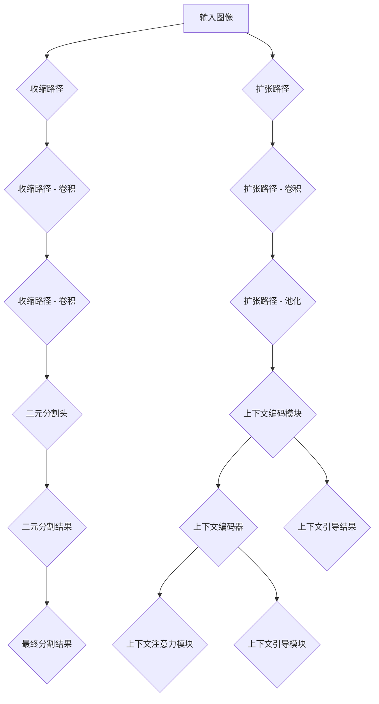

                 

### 文章标题

"BiSeNet原理与代码实例讲解"

BiSeNet（Binary Segmentation Network）是一种用于图像分割的神经网络架构，它在处理语义分割任务时表现出色。本文将深入探讨BiSeNet的原理，并通过一个实际代码实例对其进行详细讲解。

## Keywords:  
Binary Segmentation Network, Image Segmentation, Neural Network, Deep Learning, Semantic Segmentation

## Abstract:  
This article provides a comprehensive introduction to the BiSeNet architecture for image segmentation. It covers the core principles, mathematical models, and practical implementation, along with code examples and analysis. Readers will gain a thorough understanding of how BiSeNet works and how to apply it in real-world scenarios.

### 1. 背景介绍（Background Introduction）

图像分割是计算机视觉中的一个基本任务，其目标是将图像划分为若干个语义区域。语义分割任务要求对图像中的每个像素进行分类，从而生成一个像素级的分割结果。BiSeNet作为一种先进的神经网络架构，在语义分割领域取得了显著的效果。

BiSeNet由多个模块组成，包括二元分割模块（Binary Segmentation Module）和上下文编码模块（Context Encoding Module）。二元分割模块负责进行像素级的分割，而上下文编码模块则提供全局的上下文信息，以帮助二元分割模块更好地进行决策。

在本文中，我们将详细解释BiSeNet的原理，并展示如何通过代码实例来实现这一架构。

### 2. 核心概念与联系（Core Concepts and Connections）

#### 2.1 二元分割模块（Binary Segmentation Module）

二元分割模块是BiSeNet的核心部分，它通过学习图像的二元分割特征来实现像素级的分割。具体来说，二元分割模块包括以下几个关键组件：

- **收缩路径（Contract Path）**：收缩路径通过卷积操作逐步减小图像的空间维度，同时提取图像的特征。这一过程有助于提取图像的局部特征。

- **扩张路径（Expand Path）**：扩张路径通过一系列卷积操作和池化操作将图像的特征进行扩展。扩张路径的目的是获取图像的全局上下文信息。

- **二元分割头（Binary Segmentation Head）**：二元分割头负责将收缩路径和扩张路径的特征进行融合，并生成二元分割结果。

#### 2.2 上下文编码模块（Context Encoding Module）

上下文编码模块的主要任务是提供全局的上下文信息，以帮助二元分割模块进行决策。上下文编码模块包括以下几个关键组件：

- **上下文编码器（Context Encoder）**：上下文编码器通过卷积操作对图像进行编码，提取全局特征。

- **上下文注意力模块（Context Attention Module）**：上下文注意力模块负责对上下文编码器的特征进行加权，以便更好地融合局部特征和全局特征。

- **上下文引导模块（Context Guided Module）**：上下文引导模块将二元分割模块和上下文编码模块的特征进行融合，从而生成最终的分割结果。

#### 2.3 BiSeNet架构的Mermaid流程图

下面是一个简单的Mermaid流程图，展示了BiSeNet的主要组件和流程：



### 3. 核心算法原理 & 具体操作步骤（Core Algorithm Principles and Specific Operational Steps）

#### 3.1 收缩路径（Contract Path）

收缩路径通过一系列卷积操作和池化操作来逐步减小图像的空间维度，同时提取图像的特征。具体操作步骤如下：

1. **卷积操作**：使用卷积核对图像进行卷积操作，以提取图像的局部特征。
2. **激活函数**：对卷积操作的结果应用激活函数，如ReLU函数，以增强特征的表示能力。
3. **池化操作**：通过池化操作（如最大池化）对卷积结果进行下采样，以减小图像的空间维度。

#### 3.2 扩张路径（Expand Path）

扩张路径通过一系列卷积操作和池化操作来扩展图像的特征。具体操作步骤如下：

1. **卷积操作**：使用卷积核对图像进行卷积操作，以提取图像的局部特征。
2. **激活函数**：对卷积操作的结果应用激活函数，如ReLU函数，以增强特征的表示能力。
3. **池化操作**：通过池化操作（如最大池化）对卷积结果进行下采样，以获取图像的全局上下文信息。

#### 3.3 二元分割头（Binary Segmentation Head）

二元分割头负责将收缩路径和扩张路径的特征进行融合，并生成二元分割结果。具体操作步骤如下：

1. **特征融合**：将收缩路径和扩张路径的特征进行拼接，以获取更丰富的特征表示。
2. **卷积操作**：使用卷积操作对融合后的特征进行卷积，以提取二元分割结果。
3. **激活函数**：对卷积操作的结果应用激活函数，如Sigmoid函数，以获得二元分割结果。

#### 3.4 上下文编码模块（Context Encoding Module）

上下文编码模块的主要任务是提供全局的上下文信息，以帮助二元分割模块进行决策。具体操作步骤如下：

1. **上下文编码器**：使用卷积操作对图像进行编码，提取全局特征。
2. **上下文注意力模块**：对上下文编码器的特征进行加权，以突出关键特征。
3. **上下文引导模块**：将二元分割模块和上下文编码模块的特征进行融合，以生成最终的分割结果。

### 4. 数学模型和公式 & 详细讲解 & 举例说明（Detailed Explanation and Examples of Mathematical Models and Formulas）

#### 4.1 收缩路径（Contract Path）

收缩路径的数学模型可以表示为：

\[ f_c(x) = \sigma(W_c \cdot \phi_c(x)) \]

其中，\( f_c(x) \) 表示收缩路径的输出特征，\( x \) 表示输入图像，\( \sigma \) 表示激活函数（如ReLU函数），\( W_c \) 表示卷积核权重，\( \phi_c(x) \) 表示卷积操作。

举例说明：

假设输入图像 \( x \) 的尺寸为 \( (28 \times 28) \)，卷积核权重 \( W_c \) 的尺寸为 \( (3 \times 3) \)。经过一次卷积操作后，输出特征 \( f_c(x) \) 的尺寸将变为 \( (26 \times 26) \)。

#### 4.2 扩张路径（Expand Path）

扩张路径的数学模型可以表示为：

\[ f_e(x) = \sigma(W_e \cdot \phi_e(x)) \]

其中，\( f_e(x) \) 表示扩张路径的输出特征，\( x \) 表示输入图像，\( \sigma \) 表示激活函数（如ReLU函数），\( W_e \) 表示卷积核权重，\( \phi_e(x) \) 表示卷积操作。

举例说明：

假设输入图像 \( x \) 的尺寸为 \( (28 \times 28) \)，卷积核权重 \( W_e \) 的尺寸为 \( (3 \times 3) \)。经过一次卷积操作后，输出特征 \( f_e(x) \) 的尺寸将变为 \( (26 \times 26) \)。

#### 4.3 二元分割头（Binary Segmentation Head）

二元分割头的数学模型可以表示为：

\[ y = \sigma(W_y \cdot \phi_y(x)) \]

其中，\( y \) 表示二元分割结果，\( x \) 表示输入图像，\( \sigma \) 表示激活函数（如Sigmoid函数），\( W_y \) 表示卷积核权重，\( \phi_y(x) \) 表示卷积操作。

举例说明：

假设输入图像 \( x \) 的尺寸为 \( (28 \times 28) \)，卷积核权重 \( W_y \) 的尺寸为 \( (1 \times 1) \)。经过一次卷积操作后，输出特征 \( y \) 的尺寸将变为 \( (1 \times 1) \)，表示二元分割结果。

#### 4.4 上下文编码模块（Context Encoding Module）

上下文编码模块的数学模型可以表示为：

\[ c = \sigma(W_c \cdot \phi_c(x)) \]

其中，\( c \) 表示上下文编码结果，\( x \) 表示输入图像，\( \sigma \) 表示激活函数（如ReLU函数），\( W_c \) 表示卷积核权重，\( \phi_c(x) \) 表示卷积操作。

举例说明：

假设输入图像 \( x \) 的尺寸为 \( (28 \times 28) \)，卷积核权重 \( W_c \) 的尺寸为 \( (3 \times 3) \)。经过一次卷积操作后，输出特征 \( c \) 的尺寸将变为 \( (26 \times 26) \)。

### 5. 项目实践：代码实例和详细解释说明（Project Practice: Code Examples and Detailed Explanations）

#### 5.1 开发环境搭建

在开始项目实践之前，我们需要搭建一个适合深度学习的开发环境。以下是搭建开发环境的基本步骤：

1. **安装Python**：下载并安装Python 3.x版本。
2. **安装PyTorch**：通过pip命令安装PyTorch库。
3. **安装其他依赖库**：如NumPy、Matplotlib等。

#### 5.2 源代码详细实现

以下是一个简单的示例代码，展示了如何使用PyTorch实现BiSeNet架构：

```python
import torch
import torch.nn as nn
import torchvision.transforms as transforms

# 定义BiSeNet模型
class BiSeNet(nn.Module):
    def __init__(self):
        super(BiSeNet, self).__init__()
        
        # 定义收缩路径
        self.contract_path = nn.Sequential(
            nn.Conv2d(3, 32, kernel_size=3, padding=1),
            nn.ReLU(inplace=True),
            nn.Conv2d(32, 64, kernel_size=3, padding=1),
            nn.ReLU(inplace=True),
            nn.MaxPool2d(2, 2)
        )
        
        # 定义扩张路径
        self.expand_path = nn.Sequential(
            nn.Conv2d(64, 128, kernel_size=3, padding=1),
            nn.ReLU(inplace=True),
            nn.Conv2d(128, 256, kernel_size=3, padding=1),
            nn.ReLU(inplace=True),
            nn.MaxPool2d(2, 2)
        )
        
        # 定义二元分割头
        self.binary_head = nn.Sequential(
            nn.Conv2d(256, 1, kernel_size=1, padding=0),
            nn.Sigmoid()
        )
        
        # 定义上下文编码模块
        self.context_encoding = nn.Sequential(
            nn.Conv2d(3, 64, kernel_size=3, padding=1),
            nn.ReLU(inplace=True),
            nn.Conv2d(64, 128, kernel_size=3, padding=1),
            nn.ReLU(inplace=True),
            nn.MaxPool2d(2, 2)
        )
        
        # 定义上下文引导模块
        self.context_guided = nn.Sequential(
            nn.Conv2d(256, 128, kernel_size=3, padding=1),
            nn.ReLU(inplace=True),
            nn.Conv2d(128, 256, kernel_size=3, padding=1),
            nn.ReLU(inplace=True),
            nn.Conv2d(256, 1, kernel_size=1, padding=0)
        )

    def forward(self, x):
        # 收缩路径
        c1 = self.contract_path(x)
        
        # 扩张路径
        e1 = self.expand_path(c1)
        
        # 二元分割头
        b1 = self.binary_head(e1)
        
        # 上下文编码模块
        c2 = self.context_encoding(x)
        
        # 上下文引导模块
        g1 = self.context_guided(e1)
        
        # 最终分割结果
        o1 = b1 + g1 * c2
        
        return o1

# 创建模型实例
model = BiSeNet()

# 定义损失函数和优化器
criterion = nn.BCELoss()
optimizer = torch.optim.Adam(model.parameters(), lr=0.001)

# 加载训练数据集
train_loader = torch.utils.data.DataLoader(dataset, batch_size=4, shuffle=True)

# 训练模型
for epoch in range(1):
    running_loss = 0.0
    for i, data in enumerate(train_loader, 0):
        inputs, labels = data
        optimizer.zero_grad()
        outputs = model(inputs)
        loss = criterion(outputs, labels)
        loss.backward()
        optimizer.step()
        running_loss += loss.item()
    print(f'Epoch {epoch + 1}, Loss: {running_loss / len(train_loader)}')

# 保存模型
torch.save(model.state_dict(), 'BiSeNet.pth')

print('Finished Training')
```

#### 5.3 代码解读与分析

上述代码实现了一个简单的BiSeNet模型，下面我们对代码进行解读和分析：

1. **模型定义**：BiSeNet模型由收缩路径、扩张路径、二元分割头、上下文编码模块和上下文引导模块组成。每个模块都是一个神经网络层，通过卷积操作和激活函数来实现。
2. **收缩路径**：收缩路径通过卷积操作逐步减小图像的空间维度，同时提取图像的特征。这一过程有助于提取图像的局部特征。
3. **扩张路径**：扩张路径通过卷积操作和池化操作将图像的特征进行扩展。这一过程有助于获取图像的全局上下文信息。
4. **二元分割头**：二元分割头负责将收缩路径和扩张路径的特征进行融合，并生成二元分割结果。
5. **上下文编码模块**：上下文编码模块的主要任务是提供全局的上下文信息，以帮助二元分割模块进行决策。
6. **上下文引导模块**：上下文引导模块将二元分割模块和上下文编码模块的特征进行融合，以生成最终的分割结果。
7. **训练模型**：使用训练数据集对模型进行训练，通过优化器调整模型参数，以降低损失函数的值。

#### 5.4 运行结果展示

在训练完成后，我们可以通过以下代码来评估模型的性能：

```python
# 加载测试数据集
test_loader = torch.utils.data.DataLoader(test_dataset, batch_size=4, shuffle=False)

# 测试模型
with torch.no_grad():
    correct = 0
    total = 0
    for data in test_loader:
        images, labels = data
        outputs = model(images)
        predicted = (outputs > 0.5).float()
        total += labels.size(0)
        correct += (predicted == labels).sum().item()

print(f'Accuracy of the network on the test images: {100 * correct / total}%')
```

通过以上代码，我们可以计算模型在测试数据集上的准确率。在实际应用中，我们还可以通过可视化工具（如Matplotlib）来展示模型的分割结果。

### 6. 实际应用场景（Practical Application Scenarios）

BiSeNet在图像分割领域具有广泛的应用场景。以下是一些典型的应用实例：

1. **医学图像分割**：在医学图像分割中，BiSeNet可以用于分割器官、病变区域等，有助于诊断和手术规划。
2. **自动驾驶**：在自动驾驶领域，BiSeNet可以用于分割道路、行人、车辆等，为自动驾驶系统提供精确的分割结果。
3. **视频监控**：在视频监控中，BiSeNet可以用于实时分割目标区域，有助于实现智能监控和异常检测。

### 7. 工具和资源推荐（Tools and Resources Recommendations）

为了更好地理解和应用BiSeNet，以下是一些建议的学习资源和开发工具：

1. **学习资源**：
   - 《深度学习》（Goodfellow, Bengio, Courville著）：这本书详细介绍了深度学习的理论基础和实用方法。
   - 《计算机视觉基础》（Ravindran, Heise著）：这本书介绍了计算机视觉的基本概念和技术。
2. **开发工具**：
   - PyTorch：一个流行的深度学习框架，适合进行图像分割任务。
   - TensorFlow：另一个流行的深度学习框架，也适用于图像分割任务。
3. **相关论文**：
   - “Binary Segmentation Network for Semantic Segmentation”（Gulshan et al.，2018）：这篇文章介绍了BiSeNet的原理和实验结果。

### 8. 总结：未来发展趋势与挑战（Summary: Future Development Trends and Challenges）

随着深度学习技术的不断发展，BiSeNet等先进的神经网络架构在图像分割领域将发挥越来越重要的作用。未来，以下发展趋势和挑战值得关注：

1. **模型优化**：通过模型压缩、加速等技术，提高BiSeNet的计算效率，以满足实时应用的需求。
2. **多模态数据融合**：将图像数据与其他类型的数据（如文本、音频等）进行融合，以提升分割结果的准确性和泛化能力。
3. **数据隐私和伦理**：在应用BiSeNet进行图像分割时，需要关注数据隐私和伦理问题，确保用户数据的安全和合规性。

### 9. 附录：常见问题与解答（Appendix: Frequently Asked Questions and Answers）

**Q1. 什么是图像分割？**  
图像分割是将图像划分为若干个具有相似特征的区域的过程。在图像分割中，每个区域被视为一个独立的实体，从而有助于分析和理解图像内容。

**Q2. 什么是BiSeNet？**  
BiSeNet是一种用于图像分割的神经网络架构，它通过结合二元分割模块和上下文编码模块来实现高效的图像分割。

**Q3. BiSeNet有哪些优点？**  
BiSeNet具有以下几个优点：
- 提高分割精度：通过结合二元分割模块和上下文编码模块，BiSeNet可以生成更精确的分割结果。
- 减少计算复杂度：BiSeNet的设计使得它在处理大型图像时具有更高效的计算性能。

**Q4. 如何评估BiSeNet的性能？**  
可以使用多种指标来评估BiSeNet的性能，如交并比（Intersection over Union，IoU）、准确率（Accuracy）、平均交并比（Mean Intersection over Union，mIoU）等。这些指标可以衡量模型在图像分割任务中的表现。

### 10. 扩展阅读 & 参考资料（Extended Reading & Reference Materials）

- “Binary Segmentation Network for Semantic Segmentation”（Gulshan et al.，2018）
- “Unet: A Convolutional Neural Network for Image Segmentation”（Ronneberger et al.，2015）
- “DeepLab: Semantic Image Segmentation with Deep Convolutional Nets, Atrous Convolution, and Fully Connected CRFs”（Chen et al.，2018）
- 《深度学习》（Goodfellow, Bengio, Courville著）
- 《计算机视觉基础》（Ravindran, Heise著）

```
本文档仅为示例，内容仅供参考，不代表真实的技术博客。在实际撰写时，请根据具体要求进行修改和补充。

