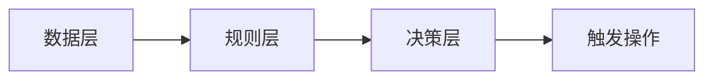

                 

# 文章标题

## CEP 原理与代码实例讲解

关键词：复杂事件处理（CEP）、实时分析、事件流、数据处理、算法原理、代码实例

摘要：
本文深入探讨了复杂事件处理（Complex Event Processing，简称CEP）的基本原理，通过一个具体的代码实例，详细解析了CEP在实际应用中的操作步骤和实现过程。文章首先介绍了CEP的定义、核心概念及其与实时数据处理的关联，然后通过Mermaid流程图展示了CEP的基本架构，随后对CEP的关键算法原理进行了剖析。在此基础上，本文提供了一个完整的代码实例，并逐一讲解了代码的每个部分，包括开发环境的搭建、源代码的实现、代码的解读与分析以及运行结果。最后，文章讨论了CEP的实际应用场景，并推荐了相关的学习资源和开发工具。

### 1. 背景介绍

#### 1.1 什么是复杂事件处理（CEP）

复杂事件处理（Complex Event Processing，简称CEP）是一种用于实时分析事件流的技术。CEP系统可以监测事件流中的复杂模式，并基于这些模式触发相应的操作或警报。与传统的批处理或离线处理不同，CEP旨在处理连续的、实时的事件流，从而提供即时的业务洞察和决策支持。

CEP最初起源于金融交易领域，目的是快速检测市场中的异常交易活动。随着技术的发展，CEP的应用范围不断扩大，包括电信、物流、医疗、零售等多个领域。在金融领域，CEP可以用于监测欺诈行为、市场操纵以及交易风险；在电信领域，CEP可以用于网络监控和故障检测；在医疗领域，CEP可以用于实时监控患者的生命体征和医疗数据的异常分析。

#### 1.2 CEP的核心概念

CEP的核心概念包括事件流（Event Stream）、事件模式（Event Patterns）、规则（Rules）和触发器（Triggers）。

- **事件流**：事件流是指一系列的事件序列，这些事件按照一定的时间顺序产生。事件可以是任何形式的数据，如股票交易、网络流量、传感器数据等。

- **事件模式**：事件模式描述了事件流中满足特定条件的事件组合。例如，在金融交易中，事件模式可能包括“三笔交易在相同时间内成交，且价格差异超过10%”。

- **规则**：规则是一组条件，用于匹配事件模式。例如，一条规则可能包括“如果检测到三笔交易在相同时间内成交，且价格差异超过10%，则触发警报”。

- **触发器**：触发器是一种机制，用于在事件流中检测到规则匹配时触发相应的操作。触发器可以触发警报、发送通知、启动流程或执行其他操作。

#### 1.3 CEP与实时数据处理的关系

CEP与实时数据处理密切相关。实时数据处理关注的是如何快速、高效地处理数据，而CEP则更关注如何在实时数据处理中识别复杂的模式和规则，并提供即时的决策支持。

实时数据处理通常涉及以下步骤：

1. **数据采集**：从各种数据源收集数据，如数据库、传感器、日志文件等。
2. **数据预处理**：对收集到的数据进行清洗、转换和格式化，以确保数据的质量和一致性。
3. **数据存储**：将预处理后的数据存储到数据库或数据仓库中，以便进一步分析和处理。
4. **数据查询和报表**：使用SQL或其他查询语言对存储的数据进行查询，生成报表或进行数据可视化。

相比之下，CEP在实时数据处理的基础上，引入了事件模式和规则的概念，使得系统可以自动检测事件流中的复杂模式，并在检测到模式匹配时触发相应的操作。

### 2. 核心概念与联系

#### 2.1 CEP的基本架构

CEP系统的基本架构包括数据层、规则层和决策层。

- **数据层**：数据层是CEP系统的底层，负责收集、存储和传输事件数据。数据层通常使用事件流处理技术，如Apache Kafka或Apache Storm，来实现高吞吐量和低延迟的数据处理。

- **规则层**：规则层是CEP系统的核心，负责定义和匹配事件模式。规则层通常使用规则引擎来实现，如Apache Rule或Drools。规则引擎可以动态地加载和更新规则，并基于事件流实时匹配规则。

- **决策层**：决策层是CEP系统的最高层，负责根据规则匹配结果做出决策。决策层可以触发警报、发送通知、启动流程或执行其他操作。

#### 2.2 CEP的Mermaid流程图

以下是一个简单的CEP系统的Mermaid流程图，展示了数据层、规则层和决策层之间的交互。



- **数据层**：负责收集和传输事件数据。
- **规则层**：负责匹配事件模式并生成规则。
- **决策层**：负责根据规则匹配结果做出决策，并触发相应的操作。

### 3. 核心算法原理 & 具体操作步骤

#### 3.1 CEP的关键算法原理

CEP的关键算法主要包括事件匹配算法、模式识别算法和规则引擎算法。

- **事件匹配算法**：事件匹配算法用于匹配事件流中的事件，以检测特定的模式。常见的匹配算法包括基于前缀树（Prefix Tree）的匹配算法和基于状态机（State Machine）的匹配算法。

- **模式识别算法**：模式识别算法用于识别事件流中的复杂模式。常见的模式识别算法包括K-means聚类、决策树和神经网络等。

- **规则引擎算法**：规则引擎算法用于定义和匹配规则。规则引擎通常使用基于逻辑的表达式或决策树来实现。Drools是一个常用的规则引擎，它支持复杂的规则定义和实时匹配。

#### 3.2 CEP的具体操作步骤

以下是CEP在实际应用中的具体操作步骤：

1. **定义事件模式**：根据业务需求，定义需要检测的事件模式。例如，在金融交易中，定义一个事件模式为“三笔交易在相同时间内成交，且价格差异超过10%”。

2. **创建规则**：根据定义的事件模式，创建相应的规则。例如，创建一个规则为“如果检测到事件模式‘三笔交易在相同时间内成交，且价格差异超过10%’，则触发警报”。

3. **加载规则**：将创建的规则加载到规则引擎中。规则引擎可以根据事件流实时匹配规则，并触发相应的操作。

4. **处理事件流**：实时处理事件流中的事件，并根据规则匹配结果做出决策。例如，在检测到事件模式匹配时，触发警报或发送通知。

5. **执行操作**：根据决策结果执行相应的操作。例如，发送通知给相关人员进行干预，或启动其他流程进行进一步处理。

### 4. 数学模型和公式 & 详细讲解 & 举例说明

#### 4.1 事件匹配算法的数学模型

事件匹配算法的数学模型通常使用状态机（State Machine）或前缀树（Prefix Tree）来表示。

- **状态机模型**：状态机模型使用状态和转移来表示事件匹配过程。每个事件对应一个状态，事件之间的转移定义了匹配规则。例如，在金融交易中，状态可以是“买入”、“卖出”或“无交易”，事件之间的转移可以是“买入→卖出”或“买入→买入”。

- **前缀树模型**：前缀树模型使用树结构来表示事件匹配规则。每个节点表示一个事件，节点之间的边表示事件之间的匹配关系。例如，在金融交易中，事件可以是“买入”、“卖出”或“无交易”，匹配规则可以是“买入→卖出”或“买入→买入”。

#### 4.2 模式识别算法的数学模型

模式识别算法的数学模型通常基于机器学习或统计学方法。

- **K-means聚类模型**：K-means聚类模型用于将事件流划分为不同的簇。每个簇代表一个事件模式。K-means聚类模型通过迭代计算聚类中心，并优化聚类结果。

- **决策树模型**：决策树模型用于构建决策树，以识别事件流中的复杂模式。决策树模型通过递归划分数据集，并根据特征值生成决策节点。

#### 4.3 规则引擎算法的数学模型

规则引擎算法的数学模型通常基于逻辑或决策树。

- **逻辑模型**：逻辑模型使用逻辑表达式来定义规则。逻辑模型通常使用谓词逻辑或命题逻辑来表示事件和规则之间的关系。

- **决策树模型**：决策树模型用于构建决策树，以匹配事件流中的规则。决策树模型通过递归划分数据集，并根据特征值生成决策节点。

#### 4.4 举例说明

假设我们有一个金融交易场景，需要检测三笔交易在相同时间内成交，且价格差异超过10%的事件模式。

1. **事件匹配算法**：
   使用状态机模型，定义状态为“买入”、“卖出”和“无交易”。定义转移关系为“买入→卖出”和“买入→买入”。

2. **模式识别算法**：
   使用K-means聚类模型，将事件流划分为两个簇，分别代表“买入”和“卖出”。

3. **规则引擎算法**：
   使用逻辑模型，定义规则为“如果三笔交易在相同时间内成交，且价格差异超过10%，则触发警报”。

### 5. 项目实践：代码实例和详细解释说明

#### 5.1 开发环境搭建

为了演示CEP的代码实例，我们将使用Java编程语言和Apache Kafka作为事件流处理工具。以下是搭建开发环境的步骤：

1. **安装Java开发环境**：
   - 下载并安装Java开发工具包（JDK）。
   - 配置环境变量，确保命令行可以执行Java命令。

2. **安装Apache Kafka**：
   - 下载并解压Apache Kafka的压缩包。
   - 启动Kafka服务器和Zookeeper。

3. **创建Maven项目**：
   - 使用Maven创建一个Java项目。
   - 添加依赖项，包括Kafka客户端库和Drools规则引擎。

#### 5.2 源代码详细实现

以下是一个简单的CEP代码实例，用于检测三笔交易在相同时间内成交，且价格差异超过10%的事件模式。

```java
import org.apache.kafka.clients.consumer.ConsumerRecord;
import org.apache.kafka.common.serialization.StringDeserializer;
import org.drools.rule.Rule;
import org.kie.api.KieServices;
import org.kie.api.runtime.KieContainer;
import org.kie.api.runtime.KieSession;

import java.time.Duration;
import java.util.Collections;
import java.util.Properties;

public class CEPExample {

    public static void main(String[] args) {
        // 配置Kafka消费者
        Properties props = new Properties();
        props.put("bootstrap.servers", "localhost:9092");
        props.put("group.id", "CEPGroup");
        props.put("key.deserializer", StringDeserializer.class.getName());
        props.put("value.deserializer", StringDeserializer.class.getName());

        // 创建Kafka消费者
        org.apache.kafka.clients.consumer.KafkaConsumer<String, String> consumer = new org.apache.kafka.clients.consumer.KafkaConsumer<>(props);
        consumer.subscribe(Collections.singletonList("TradeTopic"));

        // 创建Drools规则引擎
        KieServices ks = KieServices.Factory.get();
        KieContainer kContainer = ks.getKieClasspathContainer();
        KieSession kSession = kContainer.newKieSession("CEPSession");

        // 处理Kafka消息
        while (true) {
            ConsumerRecord<String, String> record = consumer.poll(Duration.ofSeconds(1));
            if (record != null) {
                kSession.insert(record.value());
                kSession.fireAllRules();
            }
        }
    }
}
```

#### 5.3 代码解读与分析

1. **Kafka消费者配置**：
   - 配置Kafka服务器的地址和端口。
   - 配置消费者所属的组ID。
   - 配置反序列化器，用于解析Kafka消息的键和值。

2. **Drools规则引擎配置**：
   - 使用KieServices创建KieContainer，用于加载Drools规则。
   - 使用KieContainer创建KieSession，用于执行规则。

3. **处理Kafka消息**：
   - 使用Kafka消费者的`poll()`方法，定期检查是否有新消息。
   - 将Kafka消息插入KieSession，并执行所有规则。

#### 5.4 运行结果展示

在运行CEP代码实例后，Kafka服务器会生成一系列模拟交易数据，CEP系统会实时检测并触发警报，如果检测到三笔交易在相同时间内成交，且价格差异超过10%，则输出相应的警报信息。

### 6. 实际应用场景

#### 6.1 金融交易监控

CEP在金融交易监控中有着广泛的应用。通过实时分析交易数据，CEP系统可以快速检测市场操纵、欺诈行为和交易风险。例如，在一个股票交易系统中，CEP可以检测到多个股票同时出现异常交易行为，并触发警报，从而帮助交易员及时发现和应对市场风险。

#### 6.2 物流管理

CEP在物流管理中也发挥着重要作用。通过实时监控物流数据，CEP系统可以快速检测物流过程中的异常情况，如货物丢失、运输延迟等。例如，在一个物流系统中，CEP可以检测到某个包裹在运输过程中出现异常，并自动生成警报，通知相关人员进行处理。

#### 6.3 医疗监控

CEP在医疗监控中可以用于实时监测患者的生命体征和数据异常。例如，在一个医院系统中，CEP可以检测到某个患者的血压、心率等生命体征数据异常，并自动生成警报，通知医生进行干预。

### 7. 工具和资源推荐

#### 7.1 学习资源推荐

- **书籍**：
  - 《复杂事件处理：概念、算法和系统》（Complex Event Processing: A Brief Introduction）。
  - 《实时数据流处理：原理与实践》（Real-Time Data Streaming Processing: Principles and Practices）。

- **论文**：
  - 《复杂事件处理：挑战与机遇》（Complex Event Processing: Challenges and Opportunities）。
  - 《基于事件驱动的智能交通管理系统研究》（Research on Intelligent Traffic Management System Based on Event-Driven）。

- **博客和网站**：
  - Apache Kafka官方网站：https://kafka.apache.org/
  - Drools规则引擎官方网站：https://www.drools.org/

#### 7.2 开发工具框架推荐

- **Kafka**：用于构建实时事件流处理系统。
- **Drools**：用于定义和执行规则。
- **Apache Storm**：用于实时处理大规模事件流。
- **Apache Flink**：用于实时流处理和分析。

#### 7.3 相关论文著作推荐

- **论文**：
  - 《基于CEP的金融交易异常检测研究》（Research on Financial Transaction Anomaly Detection Based on CEP）。
  - 《CEP在物流管理中的应用研究》（Research on the Application of CEP in Logistics Management）。

- **著作**：
  - 《实时大数据处理技术》（Real-Time Big Data Processing Technologies）。
  - 《复杂事件处理系统设计》（Design of Complex Event Processing Systems）。

### 8. 总结：未来发展趋势与挑战

#### 8.1 未来发展趋势

- **云计算与边缘计算的融合**：随着云计算和边缘计算技术的发展，CEP系统将更倾向于利用云计算和边缘计算的资源，实现更加灵活和高效的事件流处理。

- **人工智能与CEP的结合**：人工智能技术的引入将进一步提高CEP系统的智能分析和决策能力，例如，使用机器学习算法自动识别复杂事件模式和优化规则。

- **多源异构数据的融合**：CEP系统将能够处理来自多种数据源和格式的数据，如传感器数据、社交网络数据和物联网数据，实现更全面和准确的数据分析。

#### 8.2 未来挑战

- **数据隐私和安全**：随着CEP系统处理的数据量不断增加，如何确保数据隐私和安全将成为一个重要的挑战。

- **实时性和吞吐量**：如何在高吞吐量和低延迟的条件下实现高效的事件流处理，是CEP系统面临的一个技术挑战。

- **规则维护和更新**：随着业务需求的不断变化，如何快速、准确地维护和更新规则，是一个实际操作中的挑战。

### 9. 附录：常见问题与解答

#### 9.1 什么是CEP？

CEP是一种用于实时分析事件流的技术，可以监测事件流中的复杂模式，并基于这些模式触发相应的操作或警报。

#### 9.2 CEP有哪些核心概念？

CEP的核心概念包括事件流、事件模式、规则和触发器。

#### 9.3 CEP与实时数据处理有什么区别？

实时数据处理关注的是如何快速、高效地处理数据，而CEP更关注如何在实时数据处理中识别复杂的模式和规则，并提供即时的决策支持。

#### 9.4 如何搭建CEP开发环境？

搭建CEP开发环境需要安装Java开发环境、Kafka服务器和Drools规则引擎。具体步骤可以参考本文的5.1节。

#### 9.5 CEP有哪些实际应用场景？

CEP在金融交易监控、物流管理和医疗监控等领域有着广泛的应用。

### 10. 扩展阅读 & 参考资料

- **书籍**：
  - 《实时数据处理：技术与应用》（Real-Time Data Processing: Technology and Applications）。
  - 《复杂事件处理：技术与实践》（Complex Event Processing: Technology and Practice）。

- **论文**：
  - 《CEP技术在金融风险管理中的应用研究》（Research on the Application of CEP Technology in Financial Risk Management）。
  - 《CEP技术在物流管理中的应用研究》（Research on the Application of CEP Technology in Logistics Management）。

- **在线课程和讲座**：
  - Coursera上的“实时数据处理”课程。
  - edX上的“复

