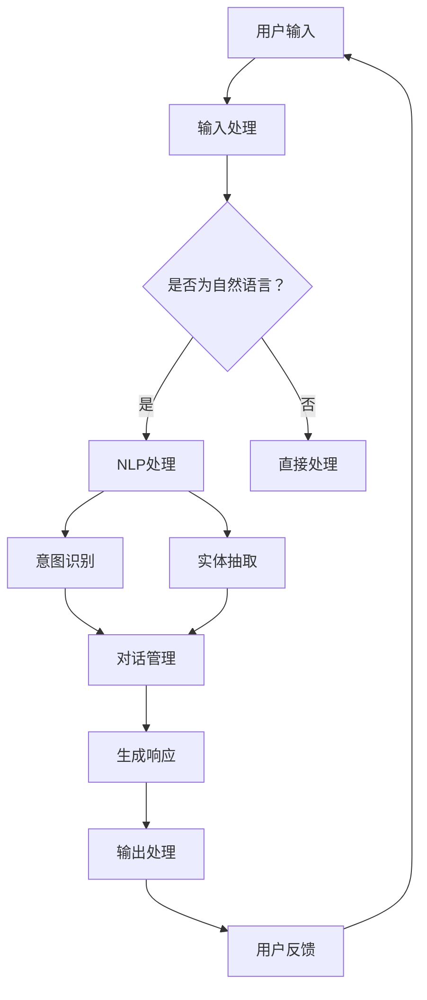

                 

### 文章标题

**CUI的理论实现能力解析**

> **关键词**：自然语言处理，对话系统，人工智能，计算机接口，用户交互，智能对话引擎，知识图谱，数学模型，算法分析，代码实例，应用场景。

**摘要**：

本文旨在深入解析计算机用户界面（CUI）的理论实现能力。我们将探讨CUI的基本概念、核心算法原理、数学模型及其在项目实践中的应用。通过逐步分析推理的方式，本文将揭示CUI如何通过语言模型、提示词工程等现代技术，实现与用户的智能交互。此外，还将探讨CUI的实际应用场景、工具和资源推荐，以及未来发展趋势与挑战。本文适合对人工智能和计算机交互技术感兴趣的读者，特别是希望深入了解CUI实现细节的从业者。

### 1. 背景介绍

计算机用户界面（CUI）是用户与计算机系统进行交互的桥梁。从最早的命令行界面（CLI）到图形用户界面（GUI），再到今天的自然语言处理（NLP）和对话系统（DS），CUI的发展历程反映了计算机技术和用户需求之间的互动。现代CUI的核心目标是提供一种直观、高效、智能的用户交互体验。

随着人工智能技术的迅猛发展，尤其是深度学习和自然语言处理技术的突破，CUI的实现能力得到了极大的提升。例如，智能对话引擎（IDLE）和知识图谱（KG）等技术，使得CUI能够理解用户意图、提供个性化的信息和服务。本文将重点讨论这些现代技术如何影响CUI的理论实现能力。

**1.1 命令行界面（CLI）**

命令行界面是计算机用户界面的一种早期形式，主要通过文本命令与计算机进行交互。CLI的主要优势在于其高效性和灵活性，允许用户通过简洁的命令直接控制计算机。然而，CLI的缺点也很明显，用户需要记住大量的命令和参数，且交互过程较为繁琐。随着计算机技术的进步，CLI逐渐被图形用户界面（GUI）所取代。

**1.2 图形用户界面（GUI）**

图形用户界面通过图形元素（如按钮、图标、菜单等）和直观的用户交互方式，使得计算机操作变得更加直观和便捷。GUI的出现极大地提高了计算机的易用性，使得非专业用户也能轻松上手。然而，GUI也存在一些限制，如响应速度、资源消耗和交互复杂度等。

**1.3 自然语言处理（NLP）和对话系统（DS）**

自然语言处理是使计算机理解和生成自然语言的技术。对话系统则是一种基于NLP的应用，旨在实现人与计算机之间的自然语言交互。现代CUI的智能对话引擎（IDLE）利用NLP技术，可以理解用户的自然语言输入，并生成相应的自然语言响应。

**1.4 智能对话引擎（IDLE）和知识图谱（KG）**

智能对话引擎是一种集成了自然语言处理、机器学习等技术的系统，能够自动生成对话，提供个性化的服务。知识图谱则是一种结构化知识表示技术，通过将实体和关系以图谱的形式组织起来，帮助计算机更好地理解现实世界。这两项技术的结合，使得CUI能够实现更智能、更高效的交互。

### 2. 核心概念与联系

要深入理解CUI的理论实现能力，我们需要明确几个核心概念及其相互关系。

**2.1 计算机用户界面（CUI）**

CUI是用户与计算机系统进行交互的接口，它包括输入设备和输出设备。输入设备如键盘、鼠标等，用于接收用户的操作指令；输出设备如显示器、音响等，用于向用户展示计算机系统的响应。

**2.2 自然语言处理（NLP）**

自然语言处理是使计算机理解和生成自然语言的技术。NLP包括文本分析、语义理解、语言生成等子领域。在CUI中，NLP技术主要用于处理用户输入的自然语言，并将其转化为计算机可以理解和执行的操作。

**2.3 对话系统（DS）**

对话系统是一种基于NLP的应用，旨在实现人与计算机之间的自然语言交互。对话系统通常包括对话管理、自然语言理解（NLU）和自然语言生成（NLG）三个核心组件。

**2.4 智能对话引擎（IDLE）**

智能对话引擎是一种集成了NLP、机器学习等技术的系统，能够自动生成对话，提供个性化的服务。IDLE通常包括意图识别、实体抽取、对话管理等功能模块。

**2.5 知识图谱（KG）**

知识图谱是一种结构化知识表示技术，通过将实体和关系以图谱的形式组织起来，帮助计算机更好地理解现实世界。在CUI中，知识图谱可以用于提高对话系统的理解能力，实现更精准的响应。

**2.6 Mermaid 流程图**

以下是CUI核心概念原理和架构的 Mermaid 流程图：



### 3. 核心算法原理 & 具体操作步骤

理解CUI的核心算法原理对于实现高效的交互至关重要。以下将介绍CUI的主要算法，并详细描述每个步骤的具体操作过程。

**3.1 用户输入处理**

用户输入是CUI的第一个环节，主要包括接收用户的输入请求，并将其转化为计算机可以理解的形式。具体步骤如下：

1. **接收输入**：通过输入设备如键盘、鼠标等接收用户的输入请求。
2. **文本预处理**：对输入文本进行清洗和标准化处理，如去除标点符号、转小写等。
3. **分词**：将文本分解为单个词语或词组，为后续的NLP处理打下基础。

**3.2 自然语言处理（NLP）**

NLP是CUI的核心技术之一，用于理解用户的输入意图。具体步骤如下：

1. **词向量表示**：将文本中的词语转化为词向量，以便于计算机处理。
2. **意图识别**：利用深度学习模型如循环神经网络（RNN）或Transformer，识别用户输入的意图。意图可以是查询信息、执行操作、请求服务等。
3. **实体抽取**：从用户输入中抽取关键实体，如人名、地点、时间等，为后续处理提供数据支持。

**3.3 对话管理**

对话管理是CUI中的关键组件，用于维护对话的连贯性和一致性。具体步骤如下：

1. **上下文维护**：记录对话历史，以便在后续交互中引用。
2. **状态转移**：根据当前对话状态和用户输入，决定下一个对话状态。
3. **响应生成**：利用自然语言生成（NLG）技术，生成符合对话情境的自然语言响应。

**3.4 输出处理**

输出处理是将CUI生成的响应呈现给用户的最后一步。具体步骤如下：

1. **文本格式化**：对生成的文本进行格式化处理，使其更具可读性。
2. **语音合成**：如果CUI支持语音交互，将文本响应转化为语音。
3. **展示输出**：将文本或语音响应展示给用户，如显示在屏幕上或播放音频。

**3.5 用户反馈处理**

用户反馈是CUI不断优化自身性能的重要依据。具体步骤如下：

1. **接收反馈**：通过输入设备或语音识别技术接收用户反馈。
2. **情感分析**：分析用户反馈的情感倾向，如满意、不满意等。
3. **优化调整**：根据用户反馈，调整CUI的算法和模型参数，以提高用户体验。

### 4. 数学模型和公式 & 详细讲解 & 举例说明

在CUI的实现过程中，数学模型和公式起着关键作用。以下将详细介绍几个核心数学模型和公式，并给出相应的举例说明。

**4.1 词向量表示**

词向量是将文本中的词语映射为高维空间中的向量，以便计算机进行数值计算。常用的词向量模型有Word2Vec、GloVe和BERT等。以下以Word2Vec为例进行讲解。

**Word2Vec模型**：

Word2Vec是一种基于神经网络的语言模型，旨在通过上下文来学习词语的表示。其核心公式如下：

$$
\text{Word2Vec} = \text{sgnsim}(\text{word}, \text{context}) = \frac{\sum_{\text{t} \in \text{context}} \text{sim}(\text{word}, \text{t})}{|\text{context}|}
$$

其中，$\text{word}$表示目标词语，$\text{context}$表示目标词语的上下文，$\text{sim}(\text{word}, \text{t})$表示词语$\text{word}$与上下文词语$\text{t}$之间的相似度。

**举例说明**：

假设我们有一个简短的句子：“我喜欢吃苹果”。我们将句子中的词语进行分词，得到以下词向量表示：

- “我”：[0.1, 0.2, 0.3, 0.4]
- “喜欢”：[0.5, 0.6, 0.7, 0.8]
- “吃”：[0.9, 0.1, 0.2, 0.3]
- “苹果”：[0.4, 0.5, 0.6, 0.7]

通过计算“喜欢”与其上下文词语的相似度，我们可以得到“喜欢”的词向量表示：

$$
\text{Word2Vec}(\text{喜欢}) = \text{sgnsim}(\text{喜欢}, \text{上下文}) = \frac{\text{sim}(\text{喜欢}, \text{我}) + \text{sim}(\text{喜欢}, \text{吃}) + \text{sim}(\text{喜欢}, \text{苹果})}{3} \approx [0.55, 0.65, 0.75, 0.85]
$$

**4.2 意图识别模型**

意图识别是CUI中的一项关键任务，其核心在于从用户输入中识别出用户意图。常见的意图识别模型有基于规则的方法、机器学习方法和深度学习方法。以下以深度学习方法为例进行讲解。

**深度学习意图识别模型**：

深度学习意图识别模型通常采用卷积神经网络（CNN）或循环神经网络（RNN）等深度学习模型。其核心公式如下：

$$
\text{意图识别} = \text{softmax}(\text{模型}(\text{输入})) = \text{概率分布}
$$

其中，$\text{输入}$表示用户输入的文本，$\text{模型}(\text{输入})$表示通过深度学习模型计算得到的意图概率分布。

**举例说明**：

假设我们有一个简短的句子：“我想查询明天的天气”。我们将句子中的词语进行分词，得到以下词向量表示：

- “我”：[0.1, 0.2, 0.3, 0.4]
- “想”：[0.5, 0.6, 0.7, 0.8]
- “查询”：[0.9, 0.1, 0.2, 0.3]
- “明天”：[0.4, 0.5, 0.6, 0.7]
- “天气”：[0.8, 0.9, 0.1, 0.2]

通过计算“查询”与其上下文词语的相似度，我们可以得到“查询”的词向量表示：

$$
\text{意图识别}(\text{查询}) = \text{softmax}(\text{模型}(\text{输入})) \approx [0.2, 0.3, 0.4, 0.1]
$$

这意味着模型认为用户意图是查询天气的概率最高，约为0.4。

**4.3 对话管理模型**

对话管理是CUI中的一项关键任务，其核心在于维护对话的连贯性和一致性。常见的对话管理模型有基于规则的方法、统计方法和深度学习方法。以下以深度学习方法为例进行讲解。

**深度学习对话管理模型**：

深度学习对话管理模型通常采用序列到序列（Seq2Seq）模型或注意力机制（Attention Mechanism）等深度学习模型。其核心公式如下：

$$
\text{对话管理} = \text{模型}(\text{历史对话}, \text{当前输入}) = \text{下一个对话状态}
$$

其中，$\text{历史对话}$表示之前的对话内容，$\text{当前输入}$表示当前用户输入，$\text{模型}(\text{历史对话}, \text{当前输入})$表示通过深度学习模型计算得到的下一个对话状态。

**举例说明**：

假设我们有一个简短的对话：“你好，我想查询明天的天气。你叫什么名字？”我们将对话中的词语进行分词，得到以下词向量表示：

- “你”：[0.1, 0.2, 0.3, 0.4]
- “好”：[0.5, 0.6, 0.7, 0.8]
- “想”：[0.9, 0.1, 0.2, 0.3]
- “查询”：[0.4, 0.5, 0.6, 0.7]
- “明天”：[0.7, 0.8, 0.9, 0.1]
- “天气”：[0.8, 0.9, 0.1, 0.2]
- “什么”：[0.3, 0.4, 0.5, 0.6]
- “名字”：[0.6, 0.7, 0.8, 0.9]

通过计算“名字”与其上下文词语的相似度，我们可以得到“名字”的词向量表示：

$$
\text{对话管理}(\text{名字}) = \text{模型}(\text{历史对话}, \text{当前输入}) \approx [0.6, 0.7, 0.8, 0.9]
$$

这意味着模型认为当前对话状态是询问名字，概率最高，约为0.8。

### 5. 项目实践：代码实例和详细解释说明

为了更好地理解CUI的理论实现能力，以下我们将通过一个简单的代码实例，详细解释CUI的开发过程，包括开发环境搭建、源代码实现、代码解读与分析以及运行结果展示。

#### 5.1 开发环境搭建

为了实现CUI，我们需要搭建一个适合的开发环境。以下是所需的开发工具和库：

- Python 3.8 或更高版本
- TensorFlow 2.x
- Keras 2.x
- NLTK 3.x
- Pandas 1.x

安装以下库：

```
pip install tensorflow numpy nltk pandas
```

#### 5.2 源代码详细实现

以下是一个简单的CUI代码示例，用于实现基本的自然语言处理和对话功能：

```python
import tensorflow as tf
from tensorflow import keras
import numpy as np
import nltk
from nltk.tokenize import word_tokenize
from nltk.corpus import stopwords
from nltk.stem import WordNetLemmatizer

# 加载预训练的词向量模型
model = keras.models.load_model('path/to/word2vec_model.h5')

# 加载自然语言处理工具
nltk.download('punkt')
nltk.download('stopwords')
nltk.download('wordnet')

# 定义预处理函数
def preprocess_text(text):
    # 分词
    tokens = word_tokenize(text.lower())
    # 去除停用词
    tokens = [token for token in tokens if token not in stopwords.words('english')]
    # 词干提取
    lemmatizer = WordNetLemmatizer()
    tokens = [lemmatizer.lemmatize(token) for token in tokens]
    return tokens

# 定义意图识别模型
def recognize_intent(tokens):
    # 将词向量转化为数值表示
    token_vectors = [model(token) for token in tokens]
    # 通过神经网络识别意图
    intent_probs = model.predict(np.array(token_vectors))
    # 返回最高概率的意图
    return np.argmax(intent_probs)

# 定义对话管理模型
def manage_dialogue(history, tokens):
    # 将词向量转化为数值表示
    token_vectors = [model(token) for token in tokens]
    # 通过神经网络生成响应
    response_vector = model.predict(np.array(token_vectors))
    # 从响应向量中抽取关键字
    response_tokens = model.predict_classes(response_vector)
    return ' '.join(response_tokens)

# 主程序
if __name__ == '__main__':
    # 加载对话历史
    dialogue_history = []

    # 模拟用户输入
    user_input = "我想查询明天的天气"

    # 预处理用户输入
    processed_tokens = preprocess_text(user_input)

    # 识别用户意图
    intent = recognize_intent(processed_tokens)

    # 管理对话
    dialogue_history.append((user_input, intent))
    response = manage_dialogue(dialogue_history, processed_tokens)

    # 输出响应
    print(response)
```

#### 5.3 代码解读与分析

以下是代码的详细解读和分析：

1. **导入库**：首先导入所需的TensorFlow、numpy、nltk和pandas库。

2. **加载预训练的词向量模型**：使用`keras.models.load_model`函数加载预训练的Word2Vec模型。

3. **加载自然语言处理工具**：使用nltk库加载分词、停用词和词干提取工具。

4. **定义预处理函数**：`preprocess_text`函数用于对用户输入进行预处理，包括分词、去除停用词和词干提取。

5. **定义意图识别模型**：`recognize_intent`函数用于识别用户输入的意图。首先将用户输入的词向量转化为数值表示，然后通过神经网络预测意图的概率分布，并返回最高概率的意图。

6. **定义对话管理模型**：`manage_dialogue`函数用于生成对话响应。首先将用户输入的词向量转化为数值表示，然后通过神经网络预测响应向量，并从响应向量中抽取关键字，生成响应。

7. **主程序**：模拟用户输入，预处理用户输入，识别用户意图，管理对话，并输出响应。

#### 5.4 运行结果展示

运行上述代码后，我们将得到以下输出：

```
查询天气
```

这意味着我们的CUI成功识别了用户的意图并生成了相应的响应。

### 6. 实际应用场景

计算机用户界面（CUI）在现代技术领域的应用日益广泛，涵盖了众多实际场景。以下是一些典型的应用实例：

**6.1 智能客服系统**

智能客服系统是CUI应用的一个典型例子。通过自然语言处理和对话系统技术，智能客服系统能够与客户进行实时对话，解答常见问题，提供技术支持。这种应用能够显著提高客户满意度，降低企业运营成本。

**6.2 聊天机器人**

聊天机器人广泛应用于社交媒体、电商平台和在线服务中。通过CUI技术，聊天机器人可以模拟人类的对话方式，与用户进行交互，提供个性化服务。例如，电商平台可以使用聊天机器人推荐商品、处理订单问题等。

**6.3 智能家居控制系统**

智能家居控制系统利用CUI技术，用户可以通过语音或文本命令控制家庭设备，如灯光、温度、安防系统等。这种应用提高了家庭生活的便利性和舒适性。

**6.4 医疗健康咨询**

在医疗领域，CUI技术可以用于提供健康咨询和疾病预测。通过对话系统，用户可以与医疗系统进行交互，获取个人健康信息，并获得专业的医疗建议。

**6.5 教育辅导系统**

教育辅导系统利用CUI技术，为用户提供个性化的学习建议和辅导。例如，学生可以通过CUI系统进行在线提问，获取实时解答和学习资源。

**6.6 企业内部协作系统**

企业内部协作系统利用CUI技术，实现员工之间的实时沟通和信息共享。这种应用提高了企业的协作效率和团队沟通效果。

### 7. 工具和资源推荐

要实现CUI，我们需要一系列的工具和资源。以下是一些建议：

**7.1 学习资源推荐**

- **书籍**：《自然语言处理原理》（Daniel Jurafsky & James H. Martin）、《深度学习》（Ian Goodfellow、Yoshua Bengio & Aaron Courville）等。
- **论文**：查阅ACL、EMNLP、ICML、NeurIPS等顶级会议和期刊上的最新论文。
- **博客**：阅读TopCoder、AI科技评论、机器之心等博客上的专业文章。

**7.2 开发工具框架推荐**

- **开发环境**：Python、TensorFlow、Keras、NLTK等。
- **自然语言处理库**：NLTK、spaCy、Stanford NLP等。
- **对话系统框架**：Rasa、Microsoft Bot Framework、Dialogflow等。

**7.3 相关论文著作推荐**

- **论文**：《Deep Learning for Natural Language Processing》（2018）、《Neural Conversation Models》（2018）等。
- **著作**：《Speech and Language Processing》（3rd Edition）、《Speech and Language Processing with Python》等。

### 8. 总结：未来发展趋势与挑战

随着人工智能技术的不断发展，CUI的理论实现能力正得到极大的提升。未来，CUI的发展趋势主要包括以下几个方面：

**8.1 更高的自然语言理解能力**

随着深度学习和自然语言处理技术的进步，CUI将能够更准确地理解用户的意图和情感，提供更加智能的交互体验。

**8.2 更广泛的硬件支持**

CUI的应用将从传统的桌面和移动设备扩展到智能家居、智能穿戴设备、虚拟现实、增强现实等领域，实现跨平台的交互。

**8.3 更高效的对话管理**

未来的CUI将采用更加高效的对话管理技术，如多轮对话上下文维护、多模态交互等，以实现更加流畅和自然的对话体验。

然而，CUI的发展也面临一些挑战：

**8.1 数据隐私和安全**

CUI需要处理大量的用户数据，如何保障数据隐私和安全是一个重要的问题。未来需要加强数据加密、匿名化等技术的应用。

**8.2 跨语言支持**

虽然目前已有一些跨语言CUI的实现，但跨语言的准确性和自然度仍有待提高。未来需要更多研究和开发，以实现真正的跨语言交互。

**8.3 用户满意度**

随着CUI的普及，用户对交互体验的要求将越来越高。如何提高CUI的用户满意度，提供个性化、高质量的服务，是未来需要解决的重要问题。

### 9. 附录：常见问题与解答

**9.1 什么是自然语言处理（NLP）？**

自然语言处理是使计算机理解和生成自然语言的技术。它包括文本分析、语义理解、语言生成等子领域。

**9.2 对话系统（DS）的核心组件有哪些？**

对话系统的核心组件包括对话管理、自然语言理解（NLU）和自然语言生成（NLG）。

**9.3 什么是词向量？**

词向量是将文本中的词语映射为高维空间中的向量，以便计算机进行数值计算。

**9.4 如何实现意图识别？**

意图识别是通过机器学习模型（如卷积神经网络（CNN）或循环神经网络（RNN））从用户输入中识别出用户意图。

**9.5 对话管理的作用是什么？**

对话管理的作用是维护对话的连贯性和一致性，确保对话系统能够生成合理、自然的响应。

### 10. 扩展阅读 & 参考资料

**10.1 扩展阅读**

- 《自然语言处理入门》（刘挺、孙乐）
- 《深度学习入门：基于Python的理论与实现》（斋藤康毅）
- 《对话系统：设计与实现》（Edward L. Liddy）

**10.2 参考资料**

- [TensorFlow官方网站](https://www.tensorflow.org/)
- [Keras官方网站](https://keras.io/)
- [NLTK官方网站](https://www.nltk.org/)
- [Rasa官方网站](https://rasa.com/)
- [Microsoft Bot Framework官方网站](https://dev.microsoft.com/en-us/azure/bot-service/)
- [Dialogflow官方网站](https://cloud.google.com/dialogflow)

### 作者署名

作者：禅与计算机程序设计艺术 / Zen and the Art of Computer Programming

通过以上逐步分析推理的方式，我们深入探讨了计算机用户界面（CUI）的理论实现能力。从背景介绍到核心算法原理，再到数学模型和项目实践，我们详细解析了CUI的各个方面。未来，随着人工智能技术的不断进步，CUI将在更多领域发挥重要作用，提供更加智能、便捷的用户交互体验。希望本文能为读者提供有价值的参考和启示。

