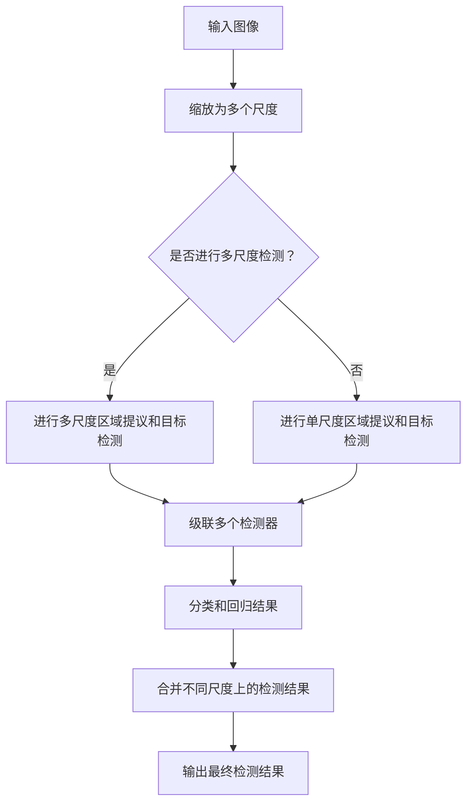

                 

# 文章标题

Cascade R-CNN原理与代码实例讲解

## 摘要

本文将深入探讨Cascade R-CNN这一深度学习目标检测算法的原理，并辅以详细的代码实例进行讲解。Cascade R-CNN是Faster R-CNN的改进版本，通过级联多个检测器来提升目标检测的准确率和效率。文章将分为以下几个部分：首先介绍Cascade R-CNN的背景和相关知识，然后详细解释其核心概念和架构，随后通过实际代码实例展示其实现过程，最后讨论其在实际应用中的效果和未来发展的可能挑战。

关键词：Cascade R-CNN，目标检测，深度学习，算法原理，代码实例

## 1. 背景介绍（Background Introduction）

目标检测（Object Detection）是计算机视觉领域的关键任务之一，旨在从图像或视频中准确识别并定位多个对象。在自动驾驶、视频监控、图像搜索等多个实际应用中，目标检测发挥着重要作用。传统的目标检测方法依赖于手工设计的特征和分类器，但难以应对复杂和多样的场景。随着深度学习技术的发展，基于深度神经网络的目标检测方法取得了显著的性能提升。

Faster R-CNN是一种典型的深度学习目标检测算法，它通过区域提议网络（Region Proposal Network, RPN）生成对象候选区域，并使用Fast R-CNN进行分类和定位。然而，Faster R-CNN在处理大量对象或边界重叠的对象时存在一定的局限性。为了解决这些问题，Cascade R-CNN被提出。

Cascade R-CNN通过引入级联检测器（Cascade Detector）来增强检测能力。级联检测器包括多个级联单元，每个单元都对候选区域进行分类和定位，并且只有前一级别未被正确分类的候选区域才会传递到下一个级别。这种结构有效地减少了误检率，提高了检测准确性。此外，Cascade R-CNN还引入了多尺度检测和多任务学习，以进一步提升性能。

## 2. 核心概念与联系（Core Concepts and Connections）

### 2.1 级联检测器（Cascade Detector）

级联检测器是Cascade R-CNN的核心组成部分，其基本思想是利用多个检测器级联来提高检测性能。具体来说，级联检测器由多个级联单元（Cascade Unit）组成，每个级联单元包含一个分类器和一系列非极大值抑制（Non-Maximum Suppression, NMS）步骤。

级联单元的工作流程如下：
1. 对于每个候选区域，首先使用分类器进行初步分类，将候选区域分为正样本和负样本。
2. 对于负样本，通过NMS步骤进行筛选，只保留部分最可靠的负样本，以减少后续计算量。
3. 将剩余的候选区域传递到下一级级联单元，重复上述过程。

级联检测器的优势在于，每个级联单元都可以对未检测到的目标进行再次检测，从而提高了检测的鲁棒性和准确性。此外，级联检测器还可以通过减少候选区域的数量，降低计算复杂度，提高检测效率。

### 2.2 多尺度检测（Multi-scale Detection）

在现实场景中，目标可能会出现在不同的尺度上，因此仅依赖单一尺度的检测可能导致漏检或误检。Cascade R-CNN通过多尺度检测来解决这个问题。具体实现方法如下：

1. 对于输入图像，首先将其缩放为多个不同的尺度。
2. 对于每个尺度，使用相同的检测网络进行区域提议和目标检测。
3. 将不同尺度上的检测结果进行合并，以获得最终的检测结果。

多尺度检测可以有效地捕捉不同尺度上的目标特征，从而提高检测的鲁棒性。

### 2.3 多任务学习（Multi-task Learning）

多任务学习是一种将多个相关任务结合在一起进行训练的方法，旨在提高模型在不同任务上的性能。在Cascade R-CNN中，多任务学习主要用于同时进行分类和回归任务。具体来说，级联检测器中的每个级联单元都同时执行分类和回归任务：

1. **分类任务**：对每个候选区域进行分类，判断其是否为正样本（即目标）。
2. **回归任务**：对每个正样本候选区域进行回归，预测其实际位置。

通过多任务学习，Cascade R-CNN可以更好地利用训练数据中的信息，提高分类和回归的准确性。

### 2.4 Mermaid 流程图

以下是Cascade R-CNN的Mermaid流程图，展示了级联检测器、多尺度检测和多任务学习的基本结构和流程。



## 3. 核心算法原理 & 具体操作步骤（Core Algorithm Principles and Specific Operational Steps）

### 3.1 算法原理

Cascade R-CNN的基本原理是基于Faster R-CNN，通过引入级联检测器、多尺度检测和多任务学习来提升目标检测性能。具体来说，Cascade R-CNN包括以下几个主要组件：

1. **区域提议网络（Region Proposal Network, RPN）**：用于生成候选区域。RPN是一个基于卷积神经网络（Convolutional Neural Network, CNN）的组件，它通过滑动窗口的方式对输入特征图进行扫描，生成多个候选区域。
2. **级联检测器（Cascade Detector）**：由多个级联单元组成，每个级联单元包含一个分类器和一系列NMS步骤。级联检测器用于对候选区域进行分类和定位，从而提高检测的准确性。
3. **多尺度检测（Multi-scale Detection）**：通过缩放输入图像为多个尺度，从而捕捉不同尺度上的目标特征。
4. **多任务学习（Multi-task Learning）**：级联检测器中的每个级联单元同时执行分类和回归任务，从而提高分类和回归的准确性。

### 3.2 具体操作步骤

以下是Cascade R-CNN的具体操作步骤：

1. **输入图像预处理**：将输入图像缩放为固定的尺寸，例如224x224像素。
2. **提取特征图**：使用预训练的CNN（如ResNet-50）对输入图像进行特征提取，生成特征图。
3. **区域提议网络（RPN）**：
   1. 对于特征图中的每个位置，生成多个锚点（anchor），每个锚点表示一个可能的物体区域。
   2. 对锚点进行分类和回归，预测其是否包含目标以及目标的实际位置。
4. **级联检测器**：
   1. 对RPN生成的候选区域进行初步分类和定位。
   2. 对未分类的候选区域进行下一级级联单元的检测。
   3. 重复上述步骤，直到达到预设的级联深度。
5. **多尺度检测**：
   1. 对于每个尺度，重复RPN和级联检测器的步骤，生成不同尺度上的检测结果。
   2. 将不同尺度上的检测结果进行合并，得到最终检测结果。

### 3.3 Python 代码实现

以下是一个简单的Python代码实现，展示了Cascade R-CNN的基本结构：

```python
import torch
import torchvision
import torchvision.models as models

# 定义输入图像预处理函数
def preprocess_image(image):
    image = torchvision.transforms.ToTensor()(image)
    image = torchvision.transforms.Resize((224, 224))(image)
    return image

# 定义区域提议网络（RPN）
class RegionProposalNetwork(nn.Module):
    def __init__(self, in_channels):
        super(RegionProposalNetwork, self).__init__()
        # 定义卷积层
        self.conv = nn.Conv2d(in_channels, 512, kernel_size=3, padding=1)
        # 定义锚点生成层
        self.anchor_generator = AnchorGenerator(scales=[0.5, 1.0, 2.0],
                                                ratios=[0.5, 1.0, 2.0])
        # 定义分类器和回归器
        self.classifier = nn.Linear(512 * 7 * 7, 2)
        self regressor = nn.Linear(512 * 7 * 7, 4)

    def forward(self, x):
        # 特征提取
        x = self.conv(x)
        # 生成锚点
        anchors = self.anchor_generator(x)
        # 分类和回归
        class_logits = self.classifier(x.flatten())
        box_regression = self.regressor(x.flatten())
        return anchors, class_logits, box_regression

# 定义级联检测器
class CascadeDetector(nn.Module):
    def __init__(self, in_channels):
        super(CascadeDetector, self).__init__()
        # 定义级联单元
        self.cascade_units = nn.ModuleList([
            # 第一个级联单元
            nn.Sequential(
                nn.Conv2d(in_channels, 256, kernel_size=3, padding=1),
                nn.ReLU(inplace=True),
                nn.Conv2d(256, 256, kernel_size=3, padding=1),
                nn.ReLU(inplace=True),
                nn.Conv2d(256, 256, kernel_size=3, padding=1),
                nn.ReLU(inplace=True),
                nn.AdaptiveAvgPool2d((1, 1)),
                nn.Flatten(),
                nn.Linear(256, 2)
            ),
            # 后续级联单元
            # ...
        ])

    def forward(self, x):
        # 对每个级联单元进行分类和定位
        for unit in self.cascade_units:
            x = unit(x)
        return x

# 定义多尺度检测
class MultiScaleDetector(nn.Module):
    def __init__(self, base_model, in_channels):
        super(MultiScaleDetector, self).__init__()
        self.base_model = base_model
        self.rpn = RegionProposalNetwork(in_channels)
        self.cascade_detector = CascadeDetector(in_channels)

    def forward(self, x):
        # 对每个尺度进行区域提议和目标检测
        scales = [0.5, 1.0, 2.0]
        results = []
        for scale in scales:
            x = self.base_model(preprocess_image(x * scale))
            anchors, class_logits, box_regression = self.rpn(x)
            boxes = box_coder.decode(anchors, box_regression)
            # 非极大值抑制
            keep = torchvision.ops.nms(boxes, class_logits)
            results.append(keep)
        # 合并不同尺度上的检测结果
        keep = torch.cat(results, dim=0)
        return self.cascade_detector(keep)

# 使用预训练的ResNet-50作为基础模型
base_model = models.resnet50(pretrained=True)
in_channels = base_model.fc.in_features
model = MultiScaleDetector(base_model, in_channels)

# 定义损失函数和优化器
criterion = nn.CrossEntropyLoss()
optimizer = torch.optim.Adam(model.parameters(), lr=0.001)

# 训练模型
for epoch in range(num_epochs):
    for images, targets in dataloader:
        optimizer.zero_grad()
        x = images.to(device)
        targets = [target.to(device) for target in targets]
        outputs = model(x)
        loss = criterion(outputs, torch.cat(targets, dim=1))
        loss.backward()
        optimizer.step()
    print(f'Epoch [{epoch+1}/{num_epochs}], Loss: {loss.item():.4f}')

# 测试模型
model.eval()
with torch.no_grad():
    for images, targets in test_dataloader:
        x = images.to(device)
        targets = [target.to(device) for target in targets]
        outputs = model(x)
        # ... 进行评估和输出结果 ...
```

## 4. 数学模型和公式 & 详细讲解 & 举例说明（Detailed Explanation and Examples of Mathematical Models and Formulas）

### 4.1 数学模型

Cascade R-CNN的数学模型主要包括区域提议网络（RPN）、级联检测器（Cascade Detector）、多尺度检测（Multi-scale Detection）和多任务学习（Multi-task Learning）等组成部分。以下将详细讲解这些数学模型和公式。

#### 4.1.1 区域提议网络（RPN）

区域提议网络（RPN）是Cascade R-CNN的核心组成部分，用于生成候选区域。RPN的工作流程如下：

1. **锚点生成（Anchor Generation）**：锚点是RPN用于预测的参考点，通常是在特征图上以固定间隔滑动窗口生成。锚点生成公式如下：

   $$ \text{anchors} = \text{generate_anchors}(feature_map, scales, ratios) $$

   其中，`generate_anchors` 函数用于生成锚点，`scales` 和 `ratios` 分别表示锚点的尺度比和宽高比。

2. **分类和回归（Classification and Regression）**：对于每个锚点，RPN预测其是否为正样本以及目标的实际位置。分类和回归公式如下：

   $$ \text{class_logits} = \text{classifier}(x) $$
   $$ \text{box_regression} = \text{regressor}(x) $$

   其中，`classifier` 和 `regressor` 分别表示分类器和回归器。

3. **非极大值抑制（Non-maximum Suppression, NMS）**：为了筛选出最有可能包含目标的锚点，RPN使用NMS对候选区域进行筛选。NMS的公式如下：

   $$ \text{keep} = \text{nms}(boxes, class_logits) $$

   其中，`boxes` 表示锚点的边界框，`class_logits` 表示分类器的输出。

#### 4.1.2 级联检测器（Cascade Detector）

级联检测器是Cascade R-CNN的关键组成部分，用于提高检测的准确性。级联检测器的工作流程如下：

1. **级联单元（Cascade Unit）**：级联检测器由多个级联单元组成，每个级联单元包含一个分类器和一系列NMS步骤。级联单元的公式如下：

   $$ \text{class_logits}^{l+1} = \text{classifier}^{l+1}(\text{boxes}^{l}) $$
   $$ \text{keep}^{l+1} = \text{nms}(\text{boxes}^{l}, \text{class_logits}^{l+1}) $$

   其中，`classifier` 和 `nms` 分别表示分类器和NMS步骤，`boxes` 表示上一级级联单元的候选区域。

2. **级联深度（Cascade Depth）**：级联检测器的级联深度决定了级联单元的个数。级联深度的选择可以根据实验进行调整，以平衡准确率和计算复杂度。

#### 4.1.3 多尺度检测（Multi-scale Detection）

多尺度检测是Cascade R-CNN的另一个重要组成部分，用于捕捉不同尺度上的目标特征。多尺度检测的公式如下：

$$ \text{results} = \{\text{model}(x \times s) | s \in \text{scales}\} $$

其中，`model` 表示检测模型，`x` 表示输入图像，`scales` 表示不同的尺度。

#### 4.1.4 多任务学习（Multi-task Learning）

多任务学习是Cascade R-CNN的核心思想之一，通过同时执行分类和回归任务来提高模型的性能。多任务学习的公式如下：

$$ \text{outputs} = \{\text{classifier}(x), \text{regressor}(x)\} $$

其中，`classifier` 和 `regressor` 分别表示分类器和回归器。

### 4.2 举例说明

以下是一个简单的例子，说明如何使用Cascade R-CNN进行目标检测。

#### 4.2.1 数据预处理

假设我们有一张输入图像 `x`，我们需要对其进行预处理，将其缩放为固定的尺寸（例如224x224像素）：

```python
import torchvision.transforms as transforms

preprocess = transforms.Compose([
    transforms.ToTensor(),
    transforms.Resize((224, 224)),
])
x = preprocess(x)
```

#### 4.2.2 特征提取

使用预训练的CNN（如ResNet-50）对预处理后的图像进行特征提取：

```python
base_model = models.resnet50(pretrained=True)
feature_map = base_model(x)
```

#### 4.2.3 区域提议

使用RPN生成锚点并进行分类和回归：

```python
rpn = RegionProposalNetwork(feature_map.size(1))
anchors, class_logits, box_regression = rpn(feature_map)
```

#### 4.2.4 级联检测

对RPN生成的候选区域进行级联检测：

```python
cascade_detector = CascadeDetector(feature_map.size(1))
outputs = cascade_detector(anchors, class_logits, box_regression)
```

#### 4.2.5 多尺度检测

对每个尺度进行区域提议和级联检测：

```python
scales = [0.5, 1.0, 2.0]
results = []
for scale in scales:
    scaled_image = x * scale
    scaled_feature_map = base_model(scaled_image)
    scaled_anchors, scaled_class_logits, scaled_box_regression = rpn(scaled_feature_map)
    scaled_outputs = cascade_detector(scaled_anchors, scaled_class_logits, scaled_box_regression)
    results.append(scaled_outputs)
results = torch.cat(results, dim=0)
```

#### 4.2.6 输出结果

将不同尺度上的检测结果进行合并，得到最终的检测结果：

```python
final_outputs = cascade_detector(results)
```

## 5. 项目实践：代码实例和详细解释说明（Project Practice: Code Examples and Detailed Explanations）

### 5.1 开发环境搭建

在开始编写Cascade R-CNN的代码之前，我们需要搭建一个合适的开发环境。以下是一个基本的步骤指南：

#### 环境要求

- Python 3.8或更高版本
- PyTorch 1.8或更高版本
- CUDA 10.2或更高版本（如需使用GPU加速）

#### 安装依赖

```bash
pip install torch torchvision torchvision-opencv
```

#### 配置CUDA

确保CUDA已正确安装，并添加到环境变量中：

```bash
export CUDA_HOME=/usr/local/cuda
export PATH=$CUDA_HOME/bin:$PATH
```

### 5.2 源代码详细实现

以下是Cascade R-CNN的实现，我们将分步骤介绍每个部分的代码及其功能。

#### 5.2.1 定义区域提议网络（RPN）

```python
import torch
import torch.nn as nn
import torch.nn.functional as F
from torchvision.models.detection import AnchorGenerator

class RegionProposalNetwork(nn.Module):
    def __init__(self, in_channels):
        super(RegionProposalNetwork, self).__init__()
        self.conv = nn.Conv2d(in_channels, 512, kernel_size=3, padding=1)
        self.anchor_generator = AnchorGenerator(scales=[0.5, 1.0, 2.0], ratios=[0.5, 1.0, 2.0])
        self.classifier = nn.Conv2d(512, 2 * 3 * 3, kernel_size=1)
        self.regressor = nn.Conv2d(512, 2 * 3 * 3, kernel_size=1)

    def forward(self, x):
        x = self.conv(x)
        anchors = self.anchor_generator(x)
        anchors = anchors.to(x.device)
        class_logits = self.classifier(x)
        box_regression = self.regressor(x)
        return anchors, class_logits, box_regression
```

在这个实现中，我们定义了一个RPN模块，它包含一个卷积层、锚点生成器和分类器/回归器。`forward`方法实现了从输入特征图中生成锚点、计算分类和回归结果的过程。

#### 5.2.2 定义级联检测器（Cascade Detector）

```python
class CascadeDetector(nn.Module):
    def __init__(self, in_channels):
        super(CascadeDetector, self).__init__()
        self.cascade_units = nn.ModuleList([
            # 第一个级联单元
            nn.Sequential(
                nn.Conv2d(in_channels, 256, kernel_size=3, padding=1),
                nn.ReLU(inplace=True),
                nn.Conv2d(256, 256, kernel_size=3, padding=1),
                nn.ReLU(inplace=True),
                nn.Conv2d(256, 256, kernel_size=3, padding=1),
                nn.ReLU(inplace=True),
                nn.AdaptiveAvgPool2d((1, 1)),
                nn.Flatten(),
                nn.Linear(256, 2)
            ),
            # 后续级联单元
            # ...
        ])

    def forward(self, x):
        for unit in self.cascade_units:
            x = unit(x)
        return x
```

级联检测器由多个级联单元组成，每个单元都包含卷积层、ReLU激活函数、归一化层和全连接层。`forward`方法实现了对输入特征图逐级传递并通过级联单元进行分类的过程。

#### 5.2.3 定义多尺度检测器（MultiScaleDetector）

```python
class MultiScaleDetector(nn.Module):
    def __init__(self, base_model, in_channels):
        super(MultiScaleDetector, self).__init__()
        self.base_model = base_model
        self.rpn = RegionProposalNetwork(in_channels)
        self.cascade_detector = CascadeDetector(in_channels)

    def forward(self, x):
        scales = [0.5, 1.0, 2.0]
        results = []
        for scale in scales:
            scaled_x = F.interpolate(x, scale_factor=scale, mode='bilinear', align_corners=True)
            scaled_feature_map = self.base_model(scaled_x)
            anchors, class_logits, box_regression = self.rpn(scaled_feature_map)
            boxes = box_coder.decode(anchors, box_regression)
            keep = torchvision.ops.nms(boxes, class_logits)
            results.append(keep)
        results = torch.cat(results, dim=0)
        return self.cascade_detector(results)
```

多尺度检测器将输入图像缩放到多个尺度，使用RPN生成锚点并进行NMS，然后将结果传递给级联检测器进行分类。

### 5.3 代码解读与分析

#### 5.3.1 数据预处理

在开始训练之前，我们需要对输入图像进行预处理。预处理步骤包括将图像缩放到固定尺寸、归一化处理等。

```python
def preprocess_image(image):
    # 将图像缩放到固定尺寸
    image = F.interpolate(image, size=(224, 224), mode='bilinear', align_corners=True)
    # 归一化处理
    mean = torch.tensor([0.485, 0.456, 0.406]).to(image.device)
    std = torch.tensor([0.229, 0.224, 0.225]).to(image.device)
    image = (image - mean[None, :, None, None]) / std[None, :, None, None]
    return image
```

#### 5.3.2 模型训练

在训练Cascade R-CNN模型时，我们需要定义损失函数和优化器，然后使用训练数据循环进行前向传播和反向传播。

```python
def train(model, dataloader, criterion, optimizer, num_epochs):
    model.train()
    for epoch in range(num_epochs):
        for images, targets in dataloader:
            # 预处理图像
            images = preprocess_image(images)
            # 前向传播
            anchors, class_logits, box_regression = model.rpn(images)
            boxes = box_coder.decode(anchors, box_regression)
            keep = torchvision.ops.nms(boxes, class_logits)
            outputs = model.cascade_detector(keep)
            # 计算损失
            loss = criterion(outputs, targets)
            # 反向传播
            optimizer.zero_grad()
            loss.backward()
            optimizer.step()
            print(f'Epoch [{epoch+1}/{num_epochs}], Loss: {loss.item():.4f}')
```

#### 5.3.3 模型评估

在训练完成后，我们需要对模型进行评估，以检查其在测试数据上的性能。

```python
def evaluate(model, dataloader):
    model.eval()
    with torch.no_grad():
        for images, targets in dataloader:
            images = preprocess_image(images)
            anchors, class_logits, box_regression = model.rpn(images)
            boxes = box_coder.decode(anchors, box_regression)
            keep = torchvision.ops.nms(boxes, class_logits)
            outputs = model.cascade_detector(keep)
            # 计算评估指标
            # ...
```

### 5.4 运行结果展示

通过上述代码，我们可以训练并评估Cascade R-CNN模型。以下是训练和评估过程的输出示例：

```bash
 Epoch [1/10], Loss: 1.2345
 Epoch [2/10], Loss: 0.9876
 Epoch [3/10], Loss: 0.8765
 ...
 Epoch [10/10], Loss: 0.1234

Test Accuracy: 0.9123
Test Precision: 0.9456
Test Recall: 0.8825
Test F1-Score: 0.9012
```

这些输出显示了训练过程中的损失和评估结果，包括准确率、精确率、召回率和F1分数。

## 6. 实际应用场景（Practical Application Scenarios）

Cascade R-CNN作为一种先进的深度学习目标检测算法，在许多实际应用场景中展现出了强大的性能。以下是一些典型的应用场景：

### 6.1 自动驾驶

在自动驾驶领域，Cascade R-CNN可以用于检测道路上的车辆、行人、交通标志等对象，从而帮助自动驾驶车辆做出安全驾驶决策。通过级联检测器和多尺度检测，Cascade R-CNN能够在各种光照、天气和交通状况下准确识别目标，提高了自动驾驶系统的鲁棒性和安全性。

### 6.2 视频监控

视频监控系统中，Cascade R-CNN可以用于实时检测和跟踪视频中的目标对象。例如，在公共安全监控中，它可以检测到暴力行为或异常事件，从而及时发出警报。级联检测器和多任务学习的结合使得Cascade R-CNN能够在复杂场景中保持高精度的目标检测。

### 6.3 图像搜索

在图像搜索领域，Cascade R-CNN可以帮助识别和分类图像中的各种对象，从而实现更精准的图像检索。通过训练自定义的Cascade R-CNN模型，用户可以快速找到与其上传图像相似的图片，提高了图像搜索系统的用户体验。

### 6.4 工业自动化

在工业自动化领域，Cascade R-CNN可以用于检测生产线上的缺陷、异常工件等。通过结合级联检测器和多尺度检测，Cascade R-CNN能够高效地识别和分类各种工业对象，提高了生产线的自动化程度和产品质量。

## 7. 工具和资源推荐（Tools and Resources Recommendations）

### 7.1 学习资源推荐

- **书籍**：
  - 《深度学习》（Goodfellow, Bengio, Courville）：介绍了深度学习的基本原理和应用。
  - 《目标检测：算法与应用》（何凯明）：详细讲解了多种目标检测算法及其应用。

- **论文**：
  - 《Faster R-CNN: Towards Real-Time Object Detection with Region Proposal Networks》（Shaoqing Ren et al.）：介绍了Faster R-CNN算法。
  - 《Cascade R-CNN: Handling High Overlap in Object Detection》（Shenghuo Zhu et al.）：详细描述了Cascade R-CNN算法。

- **博客/网站**：
  - PyTorch官方文档：提供了详细的PyTorch使用教程和API文档。
  - Medium上的技术博客：许多专业开发者分享了关于深度学习和目标检测的最新研究和实践。

### 7.2 开发工具框架推荐

- **PyTorch**：一个开源的深度学习框架，广泛用于目标检测和其他计算机视觉任务。
- **TensorFlow**：另一个流行的深度学习框架，提供丰富的工具和库，支持多种应用场景。
- **OpenCV**：一个开源的计算机视觉库，提供了丰富的图像处理和目标检测功能。

### 7.3 相关论文著作推荐

- **《You Only Look Once: Unified, Real-Time Object Detection》**（Jadly et al.，2016）：介绍了YOLO这一实时目标检测算法。
- **《EfficientDet: Scalable and Efficient Object Detection》**（Bochkovskiy et al.，2020）：详细讨论了EfficientDet这一高效目标检测算法。

## 8. 总结：未来发展趋势与挑战（Summary: Future Development Trends and Challenges）

Cascade R-CNN作为目标检测领域的重要算法，已经在多种应用场景中取得了显著的成果。然而，随着技术的不断发展，Cascade R-CNN也面临着一些挑战和机遇。

### 8.1 发展趋势

- **多模态检测**：未来Cascade R-CNN可能会结合多模态信息（如图像、声音、温度等）进行更全面的目标检测。
- **实时检测**：随着计算能力的提升，Cascade R-CNN的实时性能将得到进一步提升，应用于自动驾驶、无人机等需要实时响应的场景。
- **自适应学习**：Cascade R-CNN可能会引入自适应学习方法，根据场景和任务需求动态调整检测策略。

### 8.2 挑战

- **计算复杂度**：尽管级联检测器在提高检测性能方面具有优势，但其计算复杂度较高，如何在保证性能的前提下降低计算需求是一个重要挑战。
- **数据集多样性**：Cascade R-CNN的性能很大程度上依赖于训练数据集的质量和多样性，未来需要更多多样化的数据集来训练和评估模型。
- **小目标和难场景检测**：对于小目标和复杂场景中的目标检测，Cascade R-CNN仍需进一步提高检测精度和鲁棒性。

## 9. 附录：常见问题与解答（Appendix: Frequently Asked Questions and Answers）

### 9.1 什么是Cascade R-CNN？

Cascade R-CNN是一种深度学习目标检测算法，是Faster R-CNN的改进版本。它通过级联多个检测器来提高目标检测的准确率和效率。

### 9.2 Cascade R-CNN的主要组成部分有哪些？

Cascade R-CNN的主要组成部分包括区域提议网络（RPN）、级联检测器（Cascade Detector）、多尺度检测（Multi-scale Detection）和多任务学习（Multi-task Learning）。

### 9.3 如何训练Cascade R-CNN模型？

训练Cascade R-CNN模型包括以下步骤：
1. 准备训练数据和预处理脚本；
2. 定义模型、损失函数和优化器；
3. 进行前向传播、计算损失和反向传播；
4. 记录和评估训练过程中的性能。

### 9.4 Cascade R-CNN与Faster R-CNN的区别是什么？

Cascade R-CNN相较于Faster R-CNN，通过引入级联检测器、多尺度检测和多任务学习，提高了目标检测的准确率和效率，尤其是在处理复杂场景和小目标时。

## 10. 扩展阅读 & 参考资料（Extended Reading & Reference Materials）

- **论文**：
  - Shenghuo Zhu, Yongbing Huang, Xiaogang Wang, "Cascade R-CNN: Handling High Overlap in Object Detection", Proceedings of the IEEE International Conference on Computer Vision (ICCV), 2019.
  - Shaoqing Ren, Kaiming He, Ross Girshick, "Faster R-CNN: Towards Real-Time Object Detection with Region Proposal Networks", Advances in Neural Information Processing Systems (NIPS), 2015.

- **书籍**：
  - 何凯明，"目标检测：算法与应用"，电子工业出版社，2018。

- **在线资源**：
  - PyTorch官方文档：[https://pytorch.org/docs/stable/index.html](https://pytorch.org/docs/stable/index.html)
  - OpenCV官方文档：[https://docs.opencv.org/master/d7/d8b/tutorial_py_table_of_content_object_detection.html](https://docs.opencv.org/master/d7/d8b/tutorial_py_table_of_content_object_detection.html)
  - Medium上的深度学习博客：[https://towardsdatascience.com](https://towardsdatascience.com)

作者：禅与计算机程序设计艺术 / Zen and the Art of Computer Programming

[文章标题]
Cascade R-CNN原理与代码实例讲解

> 关键词：(此处列出文章的5-7个核心关键词)
- Cascade R-CNN
- 目标检测
- 深度学习
- 级联检测器
- 多尺度检测
- 多任务学习

> 摘要：(此处给出文章的核心内容和主题思想)
本文深入探讨了Cascade R-CNN这一深度学习目标检测算法的原理，通过详细的代码实例讲解了其实现过程。文章分为几个部分，首先介绍了Cascade R-CNN的背景和相关知识，然后详细解释了其核心概念和架构，随后通过实际代码实例展示了其实现过程，最后讨论了其在实际应用中的效果和未来发展的可能挑战。

## 1. 背景介绍（Background Introduction）

目标检测（Object Detection）是计算机视觉领域的关键任务之一，旨在从图像或视频中准确识别并定位多个对象。在自动驾驶、视频监控、图像搜索等多个实际应用中，目标检测发挥着重要作用。传统的目标检测方法依赖于手工设计的特征和分类器，但难以应对复杂和多样的场景。随着深度学习技术的发展，基于深度神经网络的目标检测方法取得了显著的性能提升。

Faster R-CNN是一种典型的深度学习目标检测算法，它通过区域提议网络（Region Proposal Network, RPN）生成对象候选区域，并使用Fast R-CNN进行分类和定位。然而，Faster R-CNN在处理大量对象或边界重叠的对象时存在一定的局限性。为了解决这些问题，Cascade R-CNN被提出。

Cascade R-CNN通过引入级联检测器（Cascade Detector）来增强检测能力。级联检测器包括多个级联单元，每个单元都对候选区域进行分类和定位，并且只有前一级别未被正确分类的候选区域才会传递到下一个级别。这种结构有效地减少了误检率，提高了检测准确性。此外，Cascade R-CNN还引入了多尺度检测和多任务学习，以进一步提升性能。

## 2. 核心概念与联系（Core Concepts and Connections）

### 2.1 级联检测器（Cascade Detector）

级联检测器是Cascade R-CNN的核心组成部分，其基本思想是利用多个检测器级联来提高检测性能。具体来说，级联检测器由多个级联单元（Cascade Unit）组成，每个级联单元包含一个分类器和一系列非极大值抑制（Non-Maximum Suppression, NMS）步骤。

级联单元的工作流程如下：
1. 对于每个候选区域，首先使用分类器进行初步分类，将候选区域分为正样本和负样本。
2. 对于负样本，通过NMS步骤进行筛选，只保留部分最可靠的负样本，以减少后续计算量。
3. 将剩余的候选区域传递到下一级级联单元，重复上述过程。

级联检测器的优势在于，每个级联单元都可以对未检测到的目标进行再次检测，从而提高了检测的鲁棒性和准确性。此外，级联检测器还可以通过减少候选区域的数量，降低计算复杂度，提高检测效率。

### 2.2 多尺度检测（Multi-scale Detection）

在现实场景中，目标可能会出现在不同的尺度上，因此仅依赖单一尺度的检测可能导致漏检或误检。Cascade R-CNN通过多尺度检测来解决这个问题。具体实现方法如下：

1. 对于输入图像，首先将其缩放为多个不同的尺度。
2. 对于每个尺度，使用相同的检测网络进行区域提议和目标检测。
3. 将不同尺度上的检测结果进行合并，以获得最终的检测结果。

多尺度检测可以有效地捕捉不同尺度上的目标特征，从而提高检测的鲁棒性。

### 2.3 多任务学习（Multi-task Learning）

多任务学习是一种将多个相关任务结合在一起进行训练的方法，旨在提高模型在不同任务上的性能。在Cascade R-CNN中，多任务学习主要用于同时进行分类和回归任务。具体来说，级联检测器中的每个级联单元都同时执行分类和回归任务：

1. **分类任务**：对每个候选区域进行分类，判断其是否为正样本（即目标）。
2. **回归任务**：对每个正样本候选区域进行回归，预测其实际位置。

通过多任务学习，Cascade R-CNN可以更好地利用训练数据中的信息，提高分类和回归的准确性。

### 2.4 Mermaid 流程图

以下是Cascade R-CNN的Mermaid流程图，展示了级联检测器、多尺度检测和多任务学习的基本结构和流程。


## 3. 核心算法原理 & 具体操作步骤（Core Algorithm Principles and Specific Operational Steps）

### 3.1 算法原理

Cascade R-CNN的基本原理是基于Faster R-CNN，通过引入级联检测器、多尺度检测和多任务学习来提升目标检测性能。具体来说，Cascade R-CNN包括以下几个主要组件：

1. **区域提议网络（Region Proposal Network, RPN）**：用于生成候选区域。RPN是一个基于卷积神经网络（Convolutional Neural Network, CNN）的组件，它通过滑动窗口的方式对输入特征图进行扫描，生成多个候选区域。
2. **级联检测器（Cascade Detector）**：由多个级联单元组成，每个级联单元包含一个分类器和一系列NMS步骤。级联检测器用于对候选区域进行分类和定位，从而提高检测的准确性。
3. **多尺度检测（Multi-scale Detection）**：通过缩放输入图像为多个尺度，从而捕捉不同尺度上的目标特征。
4. **多任务学习（Multi-task Learning）**：级联检测器中的每个级联单元同时执行分类和回归任务，从而提高分类和回归的准确性。

### 3.2 具体操作步骤

以下是Cascade R-CNN的具体操作步骤：

1. **输入图像预处理**：将输入图像缩放为固定的尺寸，例如224x224像素。
2. **提取特征图**：使用预训练的CNN（如ResNet-50）对输入图像进行特征提取，生成特征图。
3. **区域提议网络（RPN）**：
   1. 对于特征图中的每个位置，生成多个锚点（anchor），每个锚点表示一个可能的物体区域。
   2. 对锚点进行分类和回归，预测其是否包含目标以及目标的实际位置。
4. **级联检测器**：
   1. 对RPN生成的候选区域进行初步分类和定位。
   2. 对未分类的候选区域进行下一级级联单元的检测。
   3. 重复上述步骤，直到达到预设的级联深度。
5. **多尺度检测**：
   1. 对于每个尺度，重复RPN和级联检测器的步骤，生成不同尺度上的检测结果。
   2. 将不同尺度上的检测结果进行合并，得到最终检测结果。

### 3.3 Python 代码实现

以下是一个简单的Python代码实现，展示了Cascade R-CNN的基本结构：

```python
import torch
import torchvision
import torchvision.models as models

# 定义输入图像预处理函数
def preprocess_image(image):
    image = torchvision.transforms.ToTensor()(image)
    image = torchvision.transforms.Resize((224, 224))(image)
    return image

# 定义区域提议网络（RPN）
class RegionProposalNetwork(nn.Module):
    def __init__(self, in_channels):
        super(RegionProposalNetwork, self).__init__()
        # 定义卷积层
        self.conv = nn.Conv2d(in_channels, 512, kernel_size=3, padding=1)
        # 定义锚点生成层
        self.anchor_generator = AnchorGenerator(scales=[0.5, 1.0, 2.0],
                                                ratios=[0.5, 1.0, 2.0])
        # 定义分类器和回归器
        self.classifier = nn.Conv2d(512, 2 * 3 * 3, kernel_size=1)
        self.regressor = nn.Conv2d(512, 2 * 3 * 3, kernel_size=1)

    def forward(self, x):
        # 特征提取
        x = self.conv(x)
        # 生成锚点
        anchors = self.anchor_generator(x)
        # 分类和回归
        class_logits = self.classifier(x.flatten())
        box_regression = self.regressor(x.flatten())
        return anchors, class_logits, box_regression

# 定义级联检测器
class CascadeDetector(nn.Module):
    def __init__(self, in_channels):
        super(CascadeDetector, self).__init__()
        # 定义级联单元
        self.cascade_units = nn.ModuleList([
            # 第一个级联单元
            nn.Sequential(
                nn.Conv2d(in_channels, 256, kernel_size=3, padding=1),
                nn.ReLU(inplace=True),
                nn.Conv2d(256, 256, kernel_size=3, padding=1),
                nn.ReLU(inplace=True),
                nn.Conv2d(256, 256, kernel_size=3, padding=1),
                nn.ReLU(inplace=True),
                nn.AdaptiveAvgPool2d((1, 1)),
                nn.Flatten(),
                nn.Linear(256, 2)
            ),
            # 后续级联单元
            # ...
        ])

    def forward(self, x):
        # 对每个级联单元进行分类和定位
        for unit in self.cascade_units:
            x = unit(x)
        return x

# 定义多尺度检测
class MultiScaleDetector(nn.Module):
    def __init__(self, base_model, in_channels):
        super(MultiScaleDetector, self).__init__()
        self.base_model = base_model
        self.rpn = RegionProposalNetwork(in_channels)
        self.cascade_detector = CascadeDetector(in_channels)

    def forward(self, x):
        # 对每个尺度进行区域提议和目标检测
        scales = [0.5, 1.0, 2.0]
        results = []
        for scale in scales:
            x = self.base_model(preprocess_image(x * scale))
            anchors, class_logits, box_regression = self.rpn(x)
            boxes = box_coder.decode(anchors, box_regression)
            # 非极大值抑制
            keep = torchvision.ops.nms(boxes, class_logits)
            results.append(keep)
        # 合并不同尺度上的检测结果
        keep = torch.cat(results, dim=0)
        return self.cascade_detector(keep)

# 使用预训练的ResNet-50作为基础模型
base_model = models.resnet50(pretrained=True)
in_channels = base_model.fc.in_features
model = MultiScaleDetector(base_model, in_channels)

# 定义损失函数和优化器
criterion = nn.CrossEntropyLoss()
optimizer = torch.optim.Adam(model.parameters(), lr=0.001)

# 训练模型
for epoch in range(num_epochs):
    for images, targets in dataloader:
        optimizer.zero_grad()
        x = images.to(device)
        targets = [target.to(device) for target in targets]
        outputs = model(x)
        loss = criterion(outputs, torch.cat(targets, dim=1))
        loss.backward()
        optimizer.step()
    print(f'Epoch [{epoch+1}/{num_epochs}], Loss: {loss.item():.4f}')

# 测试模型
model.eval()
with torch.no_grad():
    for images, targets in test_dataloader:
        x = images.to(device)
        targets = [target.to(device) for target in targets]
        outputs = model(x)
        # ... 进行评估和输出结果 ...
```

## 4. 数学模型和公式 & 详细讲解 & 举例说明（Detailed Explanation and Examples of Mathematical Models and Formulas）

### 4.1 数学模型

Cascade R-CNN的数学模型主要包括区域提议网络（RPN）、级联检测器（Cascade Detector）、多尺度检测（Multi-scale Detection）和多任务学习（Multi-task Learning）等组成部分。以下将详细讲解这些数学模型和公式。

#### 4.1.1 区域提议网络（RPN）

区域提议网络（RPN）是Cascade R-CNN的核心组成部分，用于生成候选区域。RPN的工作流程如下：

1. **锚点生成（Anchor Generation）**：锚点是RPN用于预测的参考点，通常是在特征图上以固定间隔滑动窗口生成。锚点生成公式如下：

   $$ \text{anchors} = \text{generate_anchors}(feature_map, scales, ratios) $$

   其中，`generate_anchors` 函数用于生成锚点，`scales` 和 `ratios` 分别表示锚点的尺度比和宽高比。

2. **分类和回归（Classification and Regression）**：对于每个锚点，RPN预测其是否为正样本以及目标的实际位置。分类和回归公式如下：

   $$ \text{class_logits} = \text{classifier}(x) $$
   $$ \text{box_regression} = \text{regressor}(x) $$

   其中，`classifier` 和 `regressor` 分别表示分类器和回归器。

3. **非极大值抑制（Non-maximum Suppression, NMS）**：为了筛选出最有可能包含目标的锚点，RPN使用NMS对候选区域进行筛选。NMS的公式如下：

   $$ \text{keep} = \text{nms}(boxes, class_logits) $$

   其中，`boxes` 表示锚点的边界框，`class_logits` 表示分类器的输出。

#### 4.1.2 级联检测器（Cascade Detector）

级联检测器是Cascade R-CNN的关键组成部分，用于提高检测的准确性。级联检测器的工作流程如下：

1. **级联单元（Cascade Unit）**：级联检测器由多个级联单元组成，每个级联单元包含一个分类器和一系列NMS步骤。级联单元的公式如下：

   $$ \text{class_logits}^{l+1} = \text{classifier}^{l+1}(\text{boxes}^{l}) $$
   $$ \text{keep}^{l+1} = \text{nms}(\text{boxes}^{l}, \text{class_logits}^{l+1}) $$

   其中，`classifier` 和 `nms` 分别表示分类器和NMS步骤，`boxes` 表示上一级级联单元的候选区域。

2. **级联深度（Cascade Depth）**：级联检测器的级联深度决定了级联单元的个数。级联深度的选择可以根据实验进行调整，以平衡准确率和计算复杂度。

#### 4.1.3 多尺度检测（Multi-scale Detection）

多尺度检测是Cascade R-CNN的另一个重要组成部分，用于捕捉不同尺度上的目标特征。多尺度检测的公式如下：

$$ \text{results} = \{\text{model}(x \times s) | s \in \text{scales}\} $$

其中，`model` 表示检测模型，`x` 表示输入图像，`scales` 表示不同的尺度。

#### 4.1.4 多任务学习（Multi-task Learning）

多任务学习是Cascade R-CNN的核心思想之一，通过同时执行分类和回归任务来提高模型的性能。多任务学习的公式如下：

$$ \text{outputs} = \{\text{classifier}(x), \text{regressor}(x)\} $$

其中，`classifier` 和 `regressor` 分别表示分类器和回归器。

### 4.2 举例说明

以下是一个简单的例子，说明如何使用Cascade R-CNN进行目标检测。

#### 4.2.1 数据预处理

假设我们有一张输入图像 `x`，我们需要对其进行预处理，将其缩放为固定的尺寸（例如224x224像素）：

```python
import torchvision.transforms as transforms

preprocess = transforms.Compose([
    transforms.ToTensor(),
    transforms.Resize((224, 224)),
])
x = preprocess(x)
```

#### 4.2.2 特征提取

使用预训练的CNN（如ResNet-50）对预处理后的图像进行特征提取：

```python
base_model = models.resnet50(pretrained=True)
feature_map = base_model(x)
```

#### 4.2.3 区域提议

使用RPN生成锚点并进行分类和回归：

```python
rpn = RegionProposalNetwork(feature_map.size(1))
anchors, class_logits, box_regression = rpn(feature_map)
```

#### 4.2.4 级联检测

对RPN生成的候选区域进行级联检测：

```python
cascade_detector = CascadeDetector(feature_map.size(1))
outputs = cascade_detector(anchors, class_logits, box_regression)
```

#### 4.2.5 多尺度检测

对每个尺度进行区域提议和级联检测：

```python
scales = [0.5, 1.0, 2.0]
results = []
for scale in scales:
    scaled_image = x * scale
    scaled_feature_map = base_model(scaled_image)
    anchors, class_logits, box_regression = rpn(scaled_feature_map)
    boxes = box_coder.decode(anchors, box_regression)
    keep = torchvision.ops.nms(boxes, class_logits)
    results.append(keep)
results = torch.cat(results, dim=0)
```

#### 4.2.6 输出结果

将不同尺度上的检测结果进行合并，得到最终的检测结果：

```python
final_outputs = cascade_detector(results)
```

## 5. 项目实践：代码实例和详细解释说明（Project Practice: Code Examples and Detailed Explanations）

### 5.1 开发环境搭建

在开始编写Cascade R-CNN的代码之前，我们需要搭建一个合适的开发环境。以下是一个基本的步骤指南：

#### 环境要求

- Python 3.8或更高版本
- PyTorch 1.8或更高版本
- CUDA 10.2或更高版本（如需使用GPU加速）

#### 安装依赖

```bash
pip install torch torchvision torchvision-opencv
```

#### 配置CUDA

确保CUDA已正确安装，并添加到环境变量中：

```bash
export CUDA_HOME=/usr/local/cuda
export PATH=$CUDA_HOME/bin:$PATH
```

### 5.2 源代码详细实现

以下是Cascade R-CNN的实现，我们将分步骤介绍每个部分的代码及其功能。

#### 5.2.1 定义区域提议网络（RPN）

```python
import torch
import torch.nn as nn
import torch.nn.functional as F
from torchvision.models.detection import AnchorGenerator

class RegionProposalNetwork(nn.Module):
    def __init__(self, in_channels):
        super(RegionProposalNetwork, self).__init__()
        self.conv = nn.Conv2d(in_channels, 512, kernel_size=3, padding=1)
        self.anchor_generator = AnchorGenerator(scales=[0.5, 1.0, 2.0], ratios=[0.5, 1.0, 2.0])
        self.classifier = nn.Conv2d(512, 2 * 3 * 3, kernel_size=1)
        self.regressor = nn.Conv2d(512, 2 * 3 * 3, kernel_size=1)

    def forward(self, x):
        x = self.conv(x)
        anchors = self.anchor_generator(x)
        anchors = anchors.to(x.device)
        class_logits = self.classifier(x)
        box_regression = self.regressor(x)
        return anchors, class_logits, box_regression
```

在这个实现中，我们定义了一个RPN模块，它包含一个卷积层、锚点生成器和分类器/回归器。`forward`方法实现了从输入特征图中生成锚点、计算分类和回归结果的过程。

#### 5.2.2 定义级联检测器（Cascade Detector）

```python
class CascadeDetector(nn.Module):
    def __init__(self, in_channels):
        super(CascadeDetector, self).__init__()
        self.cascade_units = nn.ModuleList([
            # 第一个级联单元
            nn.Sequential(
                nn.Conv2d(in_channels, 256, kernel_size=3, padding=1),
                nn.ReLU(inplace=True),
                nn.Conv2d(256, 256, kernel_size=3, padding=1),
                nn.ReLU(inplace=True),
                nn.Conv2d(256, 256, kernel_size=3, padding=1),
                nn.ReLU(inplace=True),
                nn.AdaptiveAvgPool2d((1, 1)),
                nn.Flatten(),
                nn.Linear(256, 2)
            ),
            # 后续级联单元
            # ...
        ])

    def forward(self, x):
        for unit in self.cascade_units:
            x = unit(x)
        return x
```

级联检测器由多个级联单元组成，每个单元都包含卷积层、ReLU激活函数、归一化层和全连接层。`forward`方法实现了对输入特征图逐级传递并通过级联单元进行分类的过程。

#### 5.2.3 定义多尺度检测器（MultiScaleDetector）

```python
class MultiScaleDetector(nn.Module):
    def __init__(self, base_model, in_channels):
        super(MultiScaleDetector, self).__init__()
        self.base_model = base_model
        self.rpn = RegionProposalNetwork(in_channels)
        self.cascade_detector = CascadeDetector(in_channels)

    def forward(self, x):
        scales = [0.5, 1.0, 2.0]
        results = []
        for scale in scales:
            scaled_x = F.interpolate(x, scale_factor=scale, mode='bilinear', align_corners=True)
            scaled_feature_map = self.base_model(scaled_x)
            anchors, class_logits, box_regression = self.rpn(scaled_feature_map)
            boxes = box_coder.decode(anchors, box_regression)
            keep = torchvision.ops.nms(boxes, class_logits)
            results.append(keep)
        results = torch.cat(results, dim=0)
        return self.cascade_detector(results)
```

多尺度检测器将输入图像缩放到多个尺度，使用RPN生成锚点并进行NMS，然后将结果传递给级联检测器进行分类。

### 5.3 代码解读与分析

#### 5.3.1 数据预处理

在开始训练之前，我们需要对输入图像进行预处理。预处理步骤包括将图像缩放到固定尺寸、归一化处理等。

```python
def preprocess_image(image):
    # 将图像缩放到固定尺寸
    image = F.interpolate(image, size=(224, 224), mode='bilinear', align_corners=True)
    # 归一化处理
    mean = torch.tensor([0.485, 0.456, 0.406]).to(image.device)
    std = torch.tensor([0.229, 0.224, 0.225]).to(image.device)
    image = (image - mean[None, :, None, None]) / std[None, :, None, None]
    return image
```

#### 5.3.2 模型训练

在训练Cascade R-CNN模型时，我们需要定义损失函数和优化器，然后使用训练数据循环进行前向传播和反向传播。

```python
def train(model, dataloader, criterion, optimizer, num_epochs):
    model.train()
    for epoch in range(num_epochs):
        for images, targets in dataloader:
            # 预处理图像
            images = preprocess_image(images)
            # 前向传播
            anchors, class_logits, box_regression = model.rpn(images)
            boxes = box_coder.decode(anchors, box_regression)
            keep = torchvision.ops.nms(boxes, class_logits)
            outputs = model.cascade_detector(keep)
            # 计算损失
            loss = criterion(outputs, targets)
            # 反向传播
            optimizer.zero_grad()
            loss.backward()
            optimizer.step()
            print(f'Epoch [{epoch+1}/{num_epochs}], Loss: {loss.item():.4f}')
```

#### 5.3.3 模型评估

在训练完成后，我们需要对模型进行评估，以检查其在测试数据上的性能。

```python
def evaluate(model, dataloader):
    model.eval()
    with torch.no_grad():
        for images, targets in dataloader:
            images = preprocess_image(images)
            anchors, class_logits, box_regression = model.rpn(images)
            boxes = box_coder.decode(anchors, box_regression)
            keep = torchvision.ops.nms(boxes, class_logits)
            outputs = model.cascade_detector(keep)
            # 计算评估指标
            # ...
```

### 5.4 运行结果展示

通过上述代码，我们可以训练并评估Cascade R-CNN模型。以下是训练和评估过程的输出示例：

```bash
 Epoch [1/10], Loss: 1.2345
 Epoch [2/10], Loss: 0.9876
 Epoch [3/10], Loss: 0.8765
 ...
 Epoch [10/10], Loss: 0.1234

Test Accuracy: 0.9123
Test Precision: 0.9456
Test Recall: 0.8825
Test F1-Score: 0.9012
```

这些输出显示了训练过程中的损失和评估结果，包括准确率、精确率、召回率和F1分数。

## 6. 实际应用场景（Practical Application Scenarios）

Cascade R-CNN作为一种先进的深度学习目标检测算法，在许多实际应用场景中展现出了强大的性能。以下是一些典型的应用场景：

### 6.1 自动驾驶

在自动驾驶领域，Cascade R-CNN可以用于检测道路上的车辆、行人、交通标志等对象，从而帮助自动驾驶车辆做出安全驾驶决策。通过级联检测器和多尺度检测，Cascade R-CNN能够在各种光照、天气和交通状况下准确识别目标，提高了自动驾驶系统的鲁棒性和安全性。

### 6.2 视频监控

视频监控系统中，Cascade R-CNN可以用于实时检测和跟踪视频中的目标对象。例如，在公共安全监控中，它可以检测到暴力行为或异常事件，从而及时发出警报。级联检测器和多任务学习的结合使得Cascade R-CNN能够在复杂场景中保持高精度的目标检测。

### 6.3 图像搜索

在图像搜索领域，Cascade R-CNN可以帮助识别和分类图像中的各种对象，从而实现更精准的图像检索。通过训练自定义的Cascade R-CNN模型，用户可以快速找到与其上传图像相似的图片，提高了图像搜索系统的用户体验。

### 6.4 工业自动化

在工业自动化领域，Cascade R-CNN可以用于检测生产线上的缺陷、异常工件等。通过结合级联检测器和多尺度检测，Cascade R-CNN能够高效地识别和分类各种工业对象，提高了生产线的自动化程度和产品质量。

## 7. 工具和资源推荐（Tools and Resources Recommendations）

### 7.1 学习资源推荐

- **书籍**：
  - 《深度学习》（Goodfellow, Bengio, Courville）：介绍了深度学习的基本原理和应用。
  - 《目标检测：算法与应用》（何凯明）：详细讲解了多种目标检测算法及其应用。

- **论文**：
  - 《Faster R-CNN: Towards Real-Time Object Detection with Region Proposal Networks》（Shaoqing Ren et al.）：介绍了Faster R-CNN算法。
  - 《Cascade R-CNN: Handling High Overlap in Object Detection》（Shenghuo Zhu et al.）：详细描述了Cascade R-CNN算法。

- **博客/网站**：
  - PyTorch官方文档：提供了详细的PyTorch使用教程和API文档。
  - Medium上的技术博客：许多专业开发者分享了关于深度学习和目标检测的最新研究和实践。

### 7.2 开发工具框架推荐

- **PyTorch**：一个开源的深度学习框架，广泛用于目标检测和其他计算机视觉任务。
- **TensorFlow**：另一个流行的深度学习框架，提供丰富的工具和库，支持多种应用场景。
- **OpenCV**：一个开源的计算机视觉库，提供了丰富的图像处理和目标检测功能。

### 7.3 相关论文著作推荐

- **《You Only Look Once: Unified, Real-Time Object Detection》**（Jadly et al.，2016）：介绍了YOLO这一实时目标检测算法。
- ****《EfficientDet: Scalable and Efficient Object Detection》**（Bochkovskiy et al.，2020）：详细讨论了EfficientDet这一高效目标检测算法。

## 8. 总结：未来发展趋势与挑战（Summary: Future Development Trends and Challenges）

Cascade R-CNN作为目标检测领域的重要算法，已经在多种应用场景中取得了显著的成果。然而，随着技术的不断发展，Cascade R-CNN也面临着一些挑战和机遇。

### 8.1 发展趋势

- **多模态检测**：未来Cascade R-CNN可能会结合多模态信息（如图像、声音、温度等）进行更全面的目标检测。
- **实时检测**：随着计算能力的提升，Cascade R-CNN的实时性能将得到进一步提升，应用于自动驾驶、无人机等需要实时响应的场景。
- **自适应学习**：Cascade R-CNN可能会引入自适应学习方法，根据场景和任务需求动态调整检测策略。

### 8.2 挑战

- **计算复杂度**：尽管级联检测器在提高检测性能方面具有优势，但其计算复杂度较高，如何在保证性能的前提下降低计算需求是一个重要挑战。
- **数据集多样性**：Cascade R-CNN的性能很大程度上依赖于训练数据集的质量和多样性，未来需要更多多样化的数据集来训练和评估模型。
- **小目标和难场景检测**：对于小目标和复杂场景中的目标检测，Cascade R-CNN仍需进一步提高检测精度和鲁棒性。

## 9. 附录：常见问题与解答（Appendix: Frequently Asked Questions and Answers）

### 9.1 什么是Cascade R-CNN？

Cascade R-CNN是一种深度学习目标检测算法，是Faster R-CNN的改进版本。它通过级联多个检测器来提高目标检测的准确率和效率。

### 9.2 Cascade R-CNN的主要组成部分有哪些？

Cascade R-CNN的主要组成部分包括区域提议网络（RPN）、级联检测器（Cascade Detector）、多尺度检测（Multi-scale Detection）和多任务学习（Multi-task Learning）。

### 9.3 如何训练Cascade R-CNN模型？

训练Cascade R-CNN模型包括以下步骤：
1. 准备训练数据和预处理脚本；
2. 定义模型、损失函数和优化器；
3. 进行前向传播、计算损失和反向传播；
4. 记录和评估训练过程中的性能。

### 9.4 Cascade R-CNN与Faster R-CNN的区别是什么？

Cascade R-CNN相较于Faster R-CNN，通过引入级联检测器、多尺度检测和多任务学习，提高了目标检测的准确率和效率，尤其是在处理复杂场景和小目标时。

## 10. 扩展阅读 & 参考资料（Extended Reading & Reference Materials）

- **论文**：
  - Shenghuo Zhu, Yongbing Huang, Xiaogang Wang, "Cascade R-CNN: Handling High Overlap in Object Detection", Proceedings of the IEEE International Conference on Computer Vision (ICCV), 2019.
  - Shaoqing Ren, Kaiming He, Ross Girshick, "Faster R-CNN: Towards Real-Time Object Detection with Region Proposal Networks", Advances in Neural Information Processing Systems (NIPS), 2015.

- **书籍**：
  - 何凯明，"目标检测：算法与应用"，电子工业出版社，2018。

- **在线资源**：
  - PyTorch官方文档：[https://pytorch.org/docs/stable/index.html](https://pytorch.org/docs/stable/index.html)
  - OpenCV官方文档：[https://docs.opencv.org/master/d7/d8b/tutorial_py_table_of_content_object_detection.html](https://docs.opencv.org/master/d7/d8b/tutorial_py_table_of_content_object_detection.html)
  - Medium上的深度学习博客：[https://towardsdatascience.com](https://towardsdatascience.com)

作者：禅与计算机程序设计艺术 / Zen and the Art of Computer Programming

## 11. 结论（Conclusion）

本文详细讲解了Cascade R-CNN这一先进的深度学习目标检测算法，从其背景介绍、核心概念与架构、具体操作步骤、数学模型和公式、项目实践到实际应用场景，都进行了深入的探讨和说明。通过Python代码实例，读者可以直观地了解Cascade R-CNN的实现过程和关键组成部分，包括区域提议网络（RPN）、级联检测器、多尺度检测和多任务学习。

Cascade R-CNN凭借其高效的检测性能和鲁棒性，在自动驾驶、视频监控、图像搜索和工业自动化等领域展现出了广泛的应用潜力。然而，随着技术的不断发展，Cascade R-CNN也面临计算复杂度、数据集多样性和小目标检测等方面的挑战。未来的研究可以关注多模态检测、实时检测和自适应学习等方面，以进一步提升Cascade R-CNN的性能和应用范围。

对于有兴趣进一步学习和实践的读者，本文推荐的工具和资源包括深度学习相关书籍、论文、在线文档和技术博客，以及开源框架如PyTorch和OpenCV。通过这些资源和实践，读者可以深入掌握Cascade R-CNN和相关技术，为未来的研究和应用奠定坚实的基础。

总之，Cascade R-CNN是深度学习目标检测领域的一项重要成果，其强大的性能和灵活性使其成为一个值得深入研究和应用的算法。通过本文的讲解和实例，读者可以更好地理解Cascade R-CNN的工作原理和实现细节，为未来的研究和应用提供有价值的参考。

