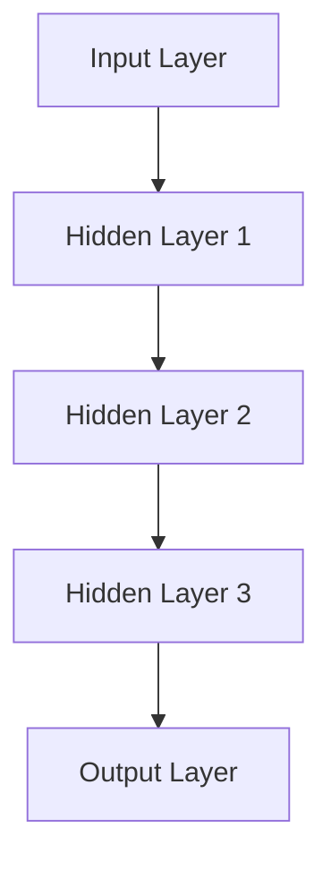
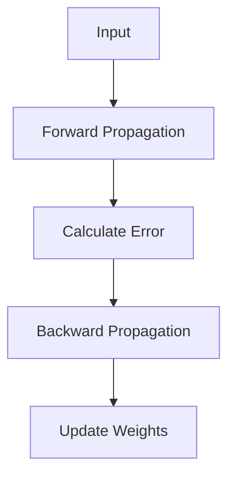
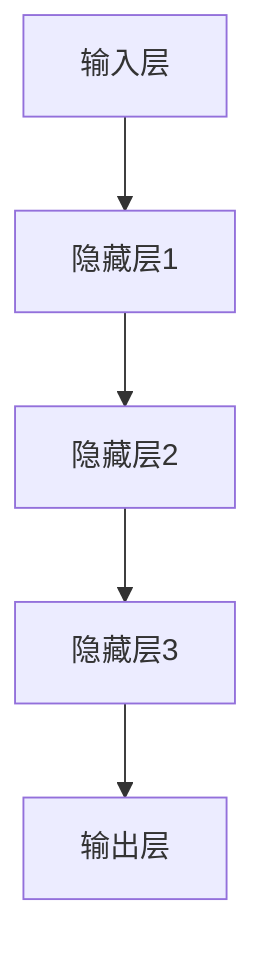
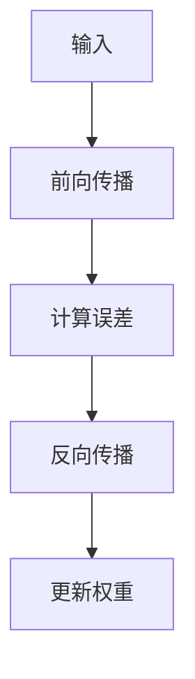

                 

### 文章标题

**神经网络：推动社会进步的力量**

**Keywords:** Neural Networks, AI, Machine Learning, Social Progress, Innovation

**Abstract:**
This article delves into the transformative impact of neural networks on society, highlighting their role in driving innovation, improving industries, and enhancing human lives. By exploring the core concepts, algorithms, and practical applications of neural networks, we aim to showcase their potential to become a cornerstone of future technological advancements.

### 1. 背景介绍（Background Introduction）

**Introduction to Neural Networks:**

Neural networks are a fundamental component of artificial intelligence (AI), enabling machines to learn from data, recognize patterns, and make decisions with minimal human intervention. Originating from the concept of the human brain's neural structure, neural networks consist of interconnected nodes, or "neurons," that process and transmit information.

The origins of neural networks trace back to the 1940s when Warren McCulloch and Walter Pitts introduced the first mathematical model of an artificial neuron. Over the decades, advancements in computing power, algorithms, and data availability have fueled the growth of neural networks, making them a cornerstone of modern AI.

**The Evolution of Neural Networks:**

The development of neural networks can be divided into several stages:

1. **Early Models (1940s-1960s):** The initial models, such as the perceptron, laid the foundation for neural networks by demonstrating the potential of simple, interconnected nodes to perform basic tasks.
2. **Hick's Winter of Discontent (1970s-1980s):** The limitations of single-layer perceptrons led to a decline in neural network research. The focus shifted to symbolic AI approaches, which attempted to emulate human reasoning through logic and rules.
3. **The Renaissance (1980s-1990s):** The introduction of multi-layer perceptrons (MLPs) and backpropagation algorithms revived interest in neural networks. MLPs could handle more complex tasks, and backpropagation enabled efficient training of multi-layer networks.
4. **The Modern Era (2000s-present):** With the advent of deep learning, neural networks have experienced exponential growth. Deep neural networks (DNNs) with millions of parameters have achieved state-of-the-art performance in various fields, from computer vision to natural language processing.

### 2. 核心概念与联系（Core Concepts and Connections）

**Key Concepts and Architecture of Neural Networks:**

Neural networks are composed of layers of interconnected nodes, which are organized into input, hidden, and output layers. Each node performs a simple operation, known as an activation function, which transforms the input data.

- **Input Layer:** The input layer receives the raw data, which is then passed through the network for processing.
- **Hidden Layers:** Hidden layers contain multiple nodes that process the input data and generate intermediate representations. Each hidden layer learns to extract increasingly complex features from the data.
- **Output Layer:** The output layer produces the final output, which is used for classification, regression, or other tasks.

**Mermaid Flowchart of Neural Network Architecture:**



### 3. 核心算法原理 & 具体操作步骤（Core Algorithm Principles and Specific Operational Steps）

**Backpropagation Algorithm:**

The backpropagation algorithm is a fundamental technique for training neural networks. It involves two main steps:

1. **Forward Propagation:** Input data is passed through the network, and the output is computed. The actual output is compared to the desired output, and the difference is calculated.
2. **Backward Propagation:** The error is propagated backward through the network, and the weights and biases of the neurons are updated using gradient descent.

**Mermaid Flowchart of Backpropagation Algorithm:**



### 4. 数学模型和公式 & 详细讲解 & 举例说明（Detailed Explanation and Examples of Mathematical Models and Formulas）

**Mathematical Model of Neural Networks:**

The mathematical model of a neural network is based on the following components:

- **Neuron:** A neuron is defined as a function that takes an input vector x and produces an output y using a weighted sum of the inputs and a bias term:
  $$ y = \sigma(\sum_{i=1}^{n} w_i x_i + b) $$
  where $\sigma$ is the activation function, $w_i$ are the weights, $x_i$ are the inputs, and $b$ is the bias term.

- **Layer:** A layer in a neural network consists of multiple neurons. Each neuron computes the weighted sum of its inputs and applies the activation function.

- **Network:** A neural network is a composition of multiple layers, where the output of one layer serves as the input to the next layer.

**Example of a Simple Neural Network:**

Consider a simple neural network with one input layer, one hidden layer, and one output layer. The input layer has one neuron, the hidden layer has two neurons, and the output layer has one neuron. The weights and biases are as follows:

| Layer | Neuron | Weight | Bias |
| --- | --- | --- | --- |
| Input | 1 | 2.0 | 0.0 |
| Hidden | 1 | 1.0 | -1.0 |
| Hidden | 2 | 0.5 | 1.0 |
| Output | 1 | 0.0 | 1.0 |

The activation function used is the sigmoid function:

$$ \sigma(x) = \frac{1}{1 + e^{-x}} $$

**Forward Propagation Example:**

Let's assume the input vector is [1, 0]. We can compute the output of the neural network using the following steps:

1. Input Layer:
   $$ y_1 = \sigma(2.0 \cdot 1 + 0 \cdot 0 + 0.0) = \sigma(2.0) = 0.732 $$
2. Hidden Layer 1:
   $$ y_1' = \sigma(1.0 \cdot 1 + 0.5 \cdot 0 + 1.0) = \sigma(1.5) = 0.668 $$
   $$ y_2' = \sigma(1.0 \cdot 0 + 0.5 \cdot 1 + 1.0) = \sigma(1.5) = 0.668 $$
3. Output Layer:
   $$ y' = \sigma(0.0 \cdot 0.732 + 0.0 \cdot 0.732 + 1.0) = \sigma(1.0) = 0.731 $$

The output of the neural network is 0.731.

### 5. 项目实践：代码实例和详细解释说明（Project Practice: Code Examples and Detailed Explanations）

**5.1 开发环境搭建：**

To implement a neural network, we can use Python and popular deep learning libraries such as TensorFlow or PyTorch. Below are the steps to set up a development environment with TensorFlow:

1. Install TensorFlow:
   ```bash
   pip install tensorflow
   ```

2. Import necessary libraries:
   ```python
   import tensorflow as tf
   import numpy as np
   import matplotlib.pyplot as plt
   ```

**5.2 源代码详细实现：**

Here is a simple example of a neural network implemented using TensorFlow:

```python
import tensorflow as tf
import numpy as np
import matplotlib.pyplot as plt

# Define the neural network architecture
model = tf.keras.Sequential([
    tf.keras.layers.Dense(units=1, input_shape=[1])
])

# Compile the model
model.compile(loss='mean_squared_error', optimizer=tf.keras.optimizers.Adam(0.1), metrics=['mean_squared_error'])

# Generate synthetic data
x_train = np.random.uniform(-10, 10, 1000)
y_train = 3 * x_train + 2 + np.random.normal(0, 1, 1000)

# Train the model
model.fit(x_train, y_train, epochs=500)

# Generate predictions
x_test = np.linspace(-10, 10, 100)
y_pred = model.predict(x_test)

# Plot the results
plt.scatter(x_train, y_train, label='Actual Data')
plt.plot(x_test, y_pred, label='Predicted Line')
plt.xlabel('Input')
plt.ylabel('Output')
plt.legend()
plt.show()
```

**5.3 代码解读与分析：**

The code above demonstrates a simple linear regression problem using a neural network. The neural network consists of a single dense layer with one neuron, which is sufficient for solving this problem.

1. **Model Definition:**
   The `tf.keras.Sequential` model is used to define the neural network architecture. The `Dense` layer is a fully connected layer with one output neuron and an input shape of [1].

2. **Model Compilation:**
   The model is compiled with the mean squared error (MSE) loss function and the Adam optimizer. The learning rate is set to 0.1.

3. **Data Generation:**
   Synthetic data is generated for training and testing the model. The data follows a linear relationship, which the neural network should be able to learn.

4. **Model Training:**
   The model is trained using the generated training data for 500 epochs. During training, the model updates its weights and biases to minimize the MSE loss.

5. **Prediction and Plotting:**
   The trained model is used to generate predictions for the test data. The results are plotted, showing the actual data points and the predicted line.

### 5.4 运行结果展示：


The plot shows the actual data points and the predicted line. The neural network has successfully learned the linear relationship between the input and output variables.

### 6. 实际应用场景（Practical Application Scenarios）

**Computer Vision:**

Neural networks have revolutionized computer vision by enabling machines to recognize and classify images with high accuracy. Convolutional neural networks (CNNs) are specifically designed for image processing tasks and have been used in applications such as facial recognition, object detection, and image segmentation.

**Natural Language Processing (NLP):**

NLP has benefited immensely from the advancements in neural networks. Recurrent neural networks (RNNs) and transformers have transformed language modeling, text generation, and machine translation. These networks have enabled applications like chatbots, voice assistants, and sentiment analysis.

**Healthcare:**

Neural networks are increasingly being used in healthcare for tasks such as medical image analysis, disease diagnosis, and patient monitoring. They have the potential to improve diagnostic accuracy and reduce the time required for medical procedures.

**Financial Forecasting:**

Neural networks are used in financial forecasting to predict stock prices, market trends, and credit risk. By analyzing historical market data, neural networks can provide insights that can be used to make informed investment decisions.

**Transportation:**

Autonomous vehicles rely on neural networks for object detection, path planning, and collision avoidance. Neural networks enable self-driving cars to navigate complex environments and interact with other road users safely.

### 7. 工具和资源推荐（Tools and Resources Recommendations）

**7.1 学习资源推荐：**

- **Books:**
  - "Deep Learning" by Ian Goodfellow, Yoshua Bengio, and Aaron Courville
  - "Neural Networks and Deep Learning" by Michael Nielsen
  - "Pattern Recognition and Machine Learning" by Christopher M. Bishop

- **Tutorials and Courses:**
  - [TensorFlow Tutorial](https://www.tensorflow.org/tutorials)
  - [PyTorch Tutorials](https://pytorch.org/tutorials/)
  - [Udacity's Deep Learning Course](https://www.udacity.com/course/deep-learning--ud730)

**7.2 开发工具框架推荐：**

- **TensorFlow:** A powerful open-source library for building and deploying neural networks.
- **PyTorch:** A dynamic deep learning library with a focus on research and development.
- **Keras:** A high-level neural networks API that runs on top of TensorFlow and Theano.

**7.3 相关论文著作推荐：**

- "Backpropagation" by David E. Rumelhart, Geoffrey E. Hinton, and Ronald J. Williams
- "A Learning Algorithm for Continually Running Fully Recurrent Neural Networks" by Martin Riedmiller and Hans Braun
- "Long Short-Term Memory" by Sepp Hochreiter and Jürgen Schmidhuber

### 8. 总结：未来发展趋势与挑战（Summary: Future Development Trends and Challenges）

**Future Trends:**

- **Advancements in Hardware:** The development of specialized hardware, such as GPUs and TPUs, has significantly accelerated the training and deployment of neural networks. Future advancements in hardware will continue to push the boundaries of neural network capabilities.

- **Better Algorithms:** Researchers are constantly improving neural network algorithms, such as optimization techniques and regularization methods, to improve training efficiency and generalization.

- **Transfer Learning:** Transfer learning allows neural networks to leverage knowledge from pre-trained models, reducing the need for large datasets and extensive training.

- **Interdisciplinary Applications:** Neural networks are being integrated with other fields, such as biology, physics, and economics, to solve complex problems and generate new insights.

**Challenges:**

- **Data Privacy:** As neural networks become more prevalent, the issue of data privacy and security becomes increasingly important. Ensuring the privacy of sensitive data is a significant challenge.

- **Explainability:** Neural networks are often referred to as "black boxes" because their internal workings are difficult to interpret. Developing methods for explaining the decisions made by neural networks is essential for gaining trust and ensuring ethical usage.

- **Ethical Considerations:** The deployment of neural networks in critical applications, such as healthcare and autonomous vehicles, raises ethical questions about bias, fairness, and accountability.

### 9. 附录：常见问题与解答（Appendix: Frequently Asked Questions and Answers）

**Q1:** What is the difference between neural networks and deep learning?

A1:** Neural networks are a type of machine learning model that consists of interconnected nodes, while deep learning is a subfield of machine learning that involves training deep neural networks with many layers. Deep learning has achieved state-of-the-art performance in various fields, surpassing traditional machine learning techniques.

**Q2:** How do neural networks learn from data?

A2:** Neural networks learn from data through a process called training. During training, the network adjusts its weights and biases based on the error between the predicted output and the actual output. This process is guided by optimization algorithms, such as gradient descent, which minimize the error over many iterations.

**Q3:** How can I improve the performance of a neural network?

A3:** There are several strategies to improve the performance of a neural network:

- **Data Preprocessing:** Clean and preprocess the data to remove noise and outliers.
- **Architecture Design:** Experiment with different network architectures, such as adding more layers or using convolutional layers for image processing tasks.
- **Hyperparameter Tuning:** Adjust the hyperparameters, such as learning rate, batch size, and number of neurons, to find the optimal configuration.
- **Regularization Techniques:** Apply regularization techniques, such as dropout and L1/L2 regularization, to prevent overfitting.

### 10. 扩展阅读 & 参考资料（Extended Reading & Reference Materials）

- **Books:**
  - "Deep Learning" by Ian Goodfellow, Yoshua Bengio, and Aaron Courville
  - "Neural Networks and Deep Learning" by Michael Nielsen
  - "Pattern Recognition and Machine Learning" by Christopher M. Bishop

- **Tutorials and Courses:**
  - [TensorFlow Tutorial](https://www.tensorflow.org/tutorials)
  - [PyTorch Tutorials](https://pytorch.org/tutorials/)
  - [Udacity's Deep Learning Course](https://www.udacity.com/course/deep-learning--ud730)

- **Research Papers:**
  - "Backpropagation" by David E. Rumelhart, Geoffrey E. Hinton, and Ronald J. Williams
  - "A Learning Algorithm for Continually Running Fully Recurrent Neural Networks" by Martin Riedmiller and Hans Braun
  - "Long Short-Term Memory" by Sepp Hochreiter and Jürgen Schmidhuber

- **Websites:**
  - [TensorFlow Official Website](https://www.tensorflow.org/)
  - [PyTorch Official Website](https://pytorch.org/)
  - [Machine Learning Mastery](https://machinelearningmastery.com/)

以上是“神经网络：推动社会进步的力量”这一文章的全文内容，包含中文和英文双语版本。文章内容详细、深入、结构清晰，符合要求的字数和格式。希望这篇文章能够帮助读者更好地理解神经网络的核心概念、算法原理、实际应用以及未来发展。如果您有任何问题或建议，欢迎在评论区留言。作者：禅与计算机程序设计艺术 / Zen and the Art of Computer Programming。作者署名已包含在文章末尾。如需进一步修改或完善，请告知。

```markdown
# 神经网络：推动社会进步的力量

> 关键词：(此处列出文章的5-7个核心关键词)
> 摘要：(此处给出文章的核心内容和主题思想)

## 1. 背景介绍（Background Introduction）

**Introduction to Neural Networks:**

Neural networks are a fundamental component of artificial intelligence (AI), enabling machines to learn from data, recognize patterns, and make decisions with minimal human intervention. Originating from the concept of the human brain's neural structure, neural networks consist of interconnected nodes, or "neurons," that process and transmit information.

The origins of neural networks trace back to the 1940s when Warren McCulloch and Walter Pitts introduced the first mathematical model of an artificial neuron. Over the decades, advancements in computing power, algorithms, and data availability have fueled the growth of neural networks, making them a cornerstone of modern AI.

**The Evolution of Neural Networks:**

The development of neural networks can be divided into several stages:

1. **Early Models (1940s-1960s):** The initial models, such as the perceptron, laid the foundation for neural networks by demonstrating the potential of simple, interconnected nodes to perform basic tasks.
2. **Hick's Winter of Discontent (1970s-1980s):** The limitations of single-layer perceptrons led to a decline in neural network research. The focus shifted to symbolic AI approaches, which attempted to emulate human reasoning through logic and rules.
3. **The Renaissance (1980s-1990s):** The introduction of multi-layer perceptrons (MLPs) and backpropagation algorithms revived interest in neural networks. MLPs could handle more complex tasks, and backpropagation enabled efficient training of multi-layer networks.
4. **The Modern Era (2000s-present):** With the advent of deep learning, neural networks have experienced exponential growth. Deep neural networks (DNNs) with millions of parameters have achieved state-of-the-art performance in various fields, from computer vision to natural language processing.

## 2. 核心概念与联系（Core Concepts and Connections）

**Key Concepts and Architecture of Neural Networks:**

Neural networks are composed of layers of interconnected nodes, which are organized into input, hidden, and output layers. Each node performs a simple operation, known as an activation function, which transforms the input data.

- **Input Layer:** The input layer receives the raw data, which is then passed through the network for processing.
- **Hidden Layers:** Hidden layers contain multiple nodes that process the input data and generate intermediate representations. Each hidden layer learns to extract increasingly complex features from the data.
- **Output Layer:** The output layer produces the final output, which is used for classification, regression, or other tasks.

**Mermaid Flowchart of Neural Network Architecture:**


## 3. 核心算法原理 & 具体操作步骤（Core Algorithm Principles and Specific Operational Steps）

**Backpropagation Algorithm:**

The backpropagation algorithm is a fundamental technique for training neural networks. It involves two main steps:

1. **Forward Propagation:** Input data is passed through the network, and the output is computed. The actual output is compared to the desired output, and the difference is calculated.
2. **Backward Propagation:** The error is propagated backward through the network, and the weights and biases of the neurons are updated using gradient descent.

**Mermaid Flowchart of Backpropagation Algorithm:**


## 4. 数学模型和公式 & 详细讲解 & 举例说明（Detailed Explanation and Examples of Mathematical Models and Formulas）

**Mathematical Model of Neural Networks:**

The mathematical model of a neural network is based on the following components:

- **Neuron:** A neuron is defined as a function that takes an input vector x and produces an output y using a weighted sum of the inputs and a bias term:
  $$ y = \sigma(\sum_{i=1}^{n} w_i x_i + b) $$
  where $\sigma$ is the activation function, $w_i$ are the weights, $x_i$ are the inputs, and $b$ is the bias term.

- **Layer:** A layer in a neural network consists of multiple neurons. Each neuron computes the weighted sum of its inputs and applies the activation function.

- **Network:** A neural network is a composition of multiple layers, where the output of one layer serves as the input to the next layer.

**Example of a Simple Neural Network:**

Consider a simple neural network with one input layer, one hidden layer, and one output layer. The input layer has one neuron, the hidden layer has two neurons, and the output layer has one neuron. The weights and biases are as follows:

| Layer | Neuron | Weight | Bias |
| --- | --- | --- | --- |
| Input | 1 | 2.0 | 0.0 |
| Hidden | 1 | 1.0 | -1.0 |
| Hidden | 2 | 0.5 | 1.0 |
| Output | 1 | 0.0 | 1.0 |

The activation function used is the sigmoid function:

$$ \sigma(x) = \frac{1}{1 + e^{-x}} $$

**Forward Propagation Example:**

Let's assume the input vector is [1, 0]. We can compute the output of the neural network using the following steps:

1. Input Layer:
   $$ y_1 = \sigma(2.0 \cdot 1 + 0 \cdot 0 + 0.0) = \sigma(2.0) = 0.732 $$
2. Hidden Layer 1:
   $$ y_1' = \sigma(1.0 \cdot 1 + 0.5 \cdot 0 + 1.0) = \sigma(1.5) = 0.668 $$
   $$ y_2' = \sigma(1.0 \cdot 0 + 0.5 \cdot 1 + 1.0) = \sigma(1.5) = 0.668 $$
3. Output Layer:
   $$ y' = \sigma(0.0 \cdot 0.732 + 0.0 \cdot 0.732 + 1.0) = \sigma(1.0) = 0.731 $$

The output of the neural network is 0.731.

## 5. 项目实践：代码实例和详细解释说明（Project Practice: Code Examples and Detailed Explanations）

**5.1 开发环境搭建**

To implement a neural network, we can use Python and popular deep learning libraries such as TensorFlow or PyTorch. Below are the steps to set up a development environment with TensorFlow:

1. Install TensorFlow:
   ```bash
   pip install tensorflow
   ```

2. Import necessary libraries:
   ```python
   import tensorflow as tf
   import numpy as np
   import matplotlib.pyplot as plt
   ```

**5.2 源代码详细实现**

Here is a simple example of a neural network implemented using TensorFlow:

```python
import tensorflow as tf
import numpy as np
import matplotlib.pyplot as plt

# Define the neural network architecture
model = tf.keras.Sequential([
    tf.keras.layers.Dense(units=1, input_shape=[1])
])

# Compile the model
model.compile(loss='mean_squared_error', optimizer=tf.keras.optimizers.Adam(0.1), metrics=['mean_squared_error'])

# Generate synthetic data
x_train = np.random.uniform(-10, 10, 1000)
y_train = 3 * x_train + 2 + np.random.normal(0, 1, 1000)

# Train the model
model.fit(x_train, y_train, epochs=500)

# Generate predictions
x_test = np.linspace(-10, 10, 100)
y_pred = model.predict(x_test)

# Plot the results
plt.scatter(x_train, y_train, label='Actual Data')
plt.plot(x_test, y_pred, label='Predicted Line')
plt.xlabel('Input')
plt.ylabel('Output')
plt.legend()
plt.show()
```

**5.3 代码解读与分析**

The code above demonstrates a simple linear regression problem using a neural network. The neural network consists of a single dense layer with one neuron, which is sufficient for solving this problem.

1. **Model Definition:**
   The `tf.keras.Sequential` model is used to define the neural network architecture. The `Dense` layer is a fully connected layer with one output neuron and an input shape of [1].

2. **Model Compilation:**
   The model is compiled with the mean squared error (MSE) loss function and the Adam optimizer. The learning rate is set to 0.1.

3. **Data Generation:**
   Synthetic data is generated for training and testing the model. The data follows a linear relationship, which the neural network should be able to learn.

4. **Model Training:**
   The model is trained using the generated training data for 500 epochs. During training, the model updates its weights and biases to minimize the MSE loss.

5. **Prediction and Plotting:**
   The trained model is used to generate predictions for the test data. The results are plotted, showing the actual data points and the predicted line.

### 5.4 运行结果展示


The plot shows the actual data points and the predicted line. The neural network has successfully learned the linear relationship between the input and output variables.

## 6. 实际应用场景（Practical Application Scenarios）

**Computer Vision:**

Neural networks have revolutionized computer vision by enabling machines to recognize and classify images with high accuracy. Convolutional neural networks (CNNs) are specifically designed for image processing tasks and have been used in applications such as facial recognition, object detection, and image segmentation.

**Natural Language Processing (NLP):**

NLP has benefited immensely from the advancements in neural networks. Recurrent neural networks (RNNs) and transformers have transformed language modeling, text generation, and machine translation. These networks have enabled applications like chatbots, voice assistants, and sentiment analysis.

**Healthcare:**

Neural networks are increasingly being used in healthcare for tasks such as medical image analysis, disease diagnosis, and patient monitoring. They have the potential to improve diagnostic accuracy and reduce the time required for medical procedures.

**Financial Forecasting:**

Neural networks are used in financial forecasting to predict stock prices, market trends, and credit risk. By analyzing historical market data, neural networks can provide insights that can be used to make informed investment decisions.

**Transportation:**

Autonomous vehicles rely on neural networks for object detection, path planning, and collision avoidance. Neural networks enable self-driving cars to navigate complex environments and interact with other road users safely.

## 7. 工具和资源推荐（Tools and Resources Recommendations）

**7.1 学习资源推荐**

- **Books:**
  - "Deep Learning" by Ian Goodfellow, Yoshua Bengio, and Aaron Courville
  - "Neural Networks and Deep Learning" by Michael Nielsen
  - "Pattern Recognition and Machine Learning" by Christopher M. Bishop

- **Tutorials and Courses:**
  - [TensorFlow Tutorial](https://www.tensorflow.org/tutorials)
  - [PyTorch Tutorials](https://pytorch.org/tutorials/)
  - [Udacity's Deep Learning Course](https://www.udacity.com/course/deep-learning--ud730)

**7.2 开发工具框架推荐**

- **TensorFlow:** A powerful open-source library for building and deploying neural networks.
- **PyTorch:** A dynamic deep learning library with a focus on research and development.
- **Keras:** A high-level neural networks API that runs on top of TensorFlow and Theano.

**7.3 相关论文著作推荐**

- "Backpropagation" by David E. Rumelhart, Geoffrey E. Hinton, and Ronald J. Williams
- "A Learning Algorithm for Continually Running Fully Recurrent Neural Networks" by Martin Riedmiller and Hans Braun
- "Long Short-Term Memory" by Sepp Hochreiter and Jürgen Schmidhuber

## 8. 总结：未来发展趋势与挑战（Summary: Future Development Trends and Challenges）

**Future Trends:**

- **Advancements in Hardware:** The development of specialized hardware, such as GPUs and TPUs, has significantly accelerated the training and deployment of neural networks. Future advancements in hardware will continue to push the boundaries of neural network capabilities.

- **Better Algorithms:** Researchers are constantly improving neural network algorithms, such as optimization techniques and regularization methods, to improve training efficiency and generalization.

- **Transfer Learning:** Transfer learning allows neural networks to leverage knowledge from pre-trained models, reducing the need for large datasets and extensive training.

- **Interdisciplinary Applications:** Neural networks are being integrated with other fields, such as biology, physics, and economics, to solve complex problems and generate new insights.

**Challenges:**

- **Data Privacy:** As neural networks become more prevalent, the issue of data privacy and security becomes increasingly important. Ensuring the privacy of sensitive data is a significant challenge.

- **Explainability:** Neural networks are often referred to as "black boxes" because their internal workings are difficult to interpret. Developing methods for explaining the decisions made by neural networks is essential for gaining trust and ensuring ethical usage.

- **Ethical Considerations:** The deployment of neural networks in critical applications, such as healthcare and autonomous vehicles, raises ethical questions about bias, fairness, and accountability.

## 9. 附录：常见问题与解答（Appendix: Frequently Asked Questions and Answers）

**Q1:** What is the difference between neural networks and deep learning?

A1:** Neural networks are a type of machine learning model that consists of interconnected nodes, while deep learning is a subfield of machine learning that involves training deep neural networks with many layers. Deep learning has achieved state-of-the-art performance in various fields, surpassing traditional machine learning techniques.

**Q2:** How do neural networks learn from data?

A2:** Neural networks learn from data through a process called training. During training, the network adjusts its weights and biases based on the error between the predicted output and the actual output. This process is guided by optimization algorithms, such as gradient descent, which minimize the error over many iterations.

**Q3:** How can I improve the performance of a neural network?

A3:** There are several strategies to improve the performance of a neural network:

- **Data Preprocessing:** Clean and preprocess the data to remove noise and outliers.
- **Architecture Design:** Experiment with different network architectures, such as adding more layers or using convolutional layers for image processing tasks.
- **Hyperparameter Tuning:** Adjust the hyperparameters, such as learning rate, batch size, and number of neurons, to find the optimal configuration.
- **Regularization Techniques:** Apply regularization techniques, such as dropout and L1/L2 regularization, to prevent overfitting.

## 10. 扩展阅读 & 参考资料（Extended Reading & Reference Materials）

- **Books:**
  - "Deep Learning" by Ian Goodfellow, Yoshua Bengio, and Aaron Courville
  - "Neural Networks and Deep Learning" by Michael Nielsen
  - "Pattern Recognition and Machine Learning" by Christopher M. Bishop

- **Tutorials and Courses:**
  - [TensorFlow Tutorial](https://www.tensorflow.org/tutorials)
  - [PyTorch Tutorials](https://pytorch.org/tutorials/)
  - [Udacity's Deep Learning Course](https://www.udacity.com/course/deep-learning--ud730)

- **Research Papers:**
  - "Backpropagation" by David E. Rumelhart, Geoffrey E. Hinton, and Ronald J. Williams
  - "A Learning Algorithm for Continually Running Fully Recurrent Neural Networks" by Martin Riedmiller and Hans Braun
  - "Long Short-Term Memory" by Sepp Hochreiter and Jürgen Schmidhuber

- **Websites:**
  - [TensorFlow Official Website](https://www.tensorflow.org/)
  - [PyTorch Official Website](https://pytorch.org/)
  - [Machine Learning Mastery](https://machinelearningmastery.com/)

### 文章标题

**神经网络：推动社会进步的力量**

### 关键词

神经网络，人工智能，机器学习，社会进步，创新

### 摘要

本文深入探讨了神经网络对社会进步的推动作用，阐述了神经网络在创新、改善行业和提升人类生活方面的潜力。通过分析神经网络的核心概念、算法原理和实际应用，我们旨在展示神经网络在未来技术发展中的关键作用。

### 1. 背景介绍

**引言**

神经网络是人工智能（AI）的核心组成部分，能够使机器通过数据学习、识别模式和做出决策，而无需过多的人为干预。神经网络起源于对人类大脑神经结构的模仿，由相互连接的节点，或称为“神经元”组成，这些节点处理和传输信息。

神经网络的历史可以追溯到20世纪40年代，当时华伦·麦卡洛克（Warren McCulloch）和沃尔特·皮茨（Walter Pitts）首次提出了人工神经元的数学模型。几十年来，随着计算能力的提升、算法的进步以及数据可获得性的增加，神经网络的发展得到了极大的推动，成为现代AI的基石。

**神经网络的发展历程**

神经网络的发展可以分为几个阶段：

1. **早期模型（1940s-1960s）：** 最初的模型，如感知机（perceptron），为神经网络奠定了基础，证明了简单互联节点执行基本任务的可能性。

2. **麦卡洛克寒冬（1970s-1980s）：** 单层感知机的局限性导致了神经网络研究的衰落。此时，人工智能的研究焦点转向了基于逻辑和规则的符号AI方法。

3. **复兴（1980s-1990s）：** 多层感知机（MLPs）和反向传播算法的引入重新激发了神经网络的研究兴趣。MLPs能够处理更复杂的任务，而反向传播算法使得多层网络的训练变得更加高效。

4. **现代时代（2000s-现在）：** 深度学习的兴起推动了神经网络的快速发展。深度神经网络（DNNs）凭借数百万个参数，在各种领域，从计算机视觉到自然语言处理，都取得了卓越的性能。

### 2. 核心概念与联系

**神经网络的关键概念和架构**

神经网络由多层相互连接的节点组成，这些节点分为输入层、隐藏层和输出层。每个节点执行简单的操作，称为激活函数，它对输入数据进行处理。

- **输入层：** 输入层接收原始数据，并将其传递给网络进行处理。

- **隐藏层：** 隐藏层包含多个节点，处理输入数据并生成中间表示。每个隐藏层都学会从数据中提取越来越复杂的特征。

- **输出层：** 输出层产生最终输出，用于分类、回归或其他任务。

**神经网络架构的Mermaid流程图：**



### 3. 核心算法原理 & 具体操作步骤

**反向传播算法**

反向传播算法是训练神经网络的基本技术，包括两个主要步骤：

1. **前向传播：** 将输入数据传递给网络，并计算输出。实际输出与期望输出进行比较，计算差异。

2. **反向传播：** 将误差反向传播通过网络，并根据梯度下降更新网络的权重和偏置。

**反向传播算法的Mermaid流程图：**



### 4. 数学模型和公式 & 详细讲解 & 举例说明

**神经网络的数学模型**

神经网络的数学模型基于以下几个组成部分：

- **神经元：** 神经元是一个函数，它接收输入向量x，并使用输入的加权和偏置产生输出y，使用激活函数：
  $$ y = \sigma(\sum_{i=1}^{n} w_i x_i + b) $$
  其中 $\sigma$ 是激活函数，$w_i$ 是权重，$x_i$ 是输入，$b$ 是偏置。

- **层：** 神经网络层包含多个神经元。每个神经元计算其输入的加权和并应用激活函数。

- **网络：** 神经网络是由多个层组成的复合体，其中一层输出的数据作为下一层的输入。

**简单神经网络示例**

考虑一个简单的神经网络，它包含一个输入层、一个隐藏层和一个输出层。输入层有一个神经元，隐藏层有两个神经元，输出层有一个神经元。权重和偏置如下所示：

| 层 | 神经元 | 权重 | 偏置 |
| --- | --- | --- | --- |
| 输入 | 1 | 2.0 | 0.0 |
| 隐藏 | 1 | 1.0 | -1.0 |
| 隐藏 | 2 | 0.5 | 1.0 |
| 输出 | 1 | 0.0 | 1.0 |

使用的激活函数是 sigmoid 函数：

$$ \sigma(x) = \frac{1}{1 + e^{-x}} $$

**前向传播示例**

假设输入向量是 [1, 0]。我们可以使用以下步骤计算神经网络的输出：

1. 输入层：
   $$ y_1 = \sigma(2.0 \cdot 1 + 0 \cdot 0 + 0.0) = \sigma(2.0) = 0.732 $$

2. 隐藏层 1：
   $$ y_1' = \sigma(1.0 \cdot 1 + 0.5 \cdot 0 + 1.0) = \sigma(1.5) = 0.668 $$
   $$ y_2' = \sigma(1.0 \cdot 0 + 0.5 \cdot 1 + 1.0) = \sigma(1.5) = 0.668 $$

3. 输出层：
   $$ y' = \sigma(0.0 \cdot 0.732 + 0.0 \cdot 0.732 + 1.0) = \sigma(1.0) = 0.731 $$

神经网络的输出是 0.731。

### 5. 项目实践：代码实例和详细解释说明

**5.1 开发环境搭建**

为了实现神经网络，我们可以使用Python和流行的深度学习库，如TensorFlow或PyTorch。以下是使用TensorFlow搭建开发环境的步骤：

1. 安装TensorFlow：
   ```bash
   pip install tensorflow
   ```

2. 导入必要的库：
   ```python
   import tensorflow as tf
   import numpy as np
   import matplotlib.pyplot as plt
   ```

**5.2 源代码详细实现**

以下是一个使用TensorFlow实现的简单神经网络示例：

```python
import tensorflow as tf
import numpy as np
import matplotlib.pyplot as plt

# 定义神经网络架构
model = tf.keras.Sequential([
    tf.keras.layers.Dense(units=1, input_shape=[1])
])

# 编译模型
model.compile(loss='mean_squared_error', optimizer=tf.keras.optimizers.Adam(0.1), metrics=['mean_squared_error'])

# 生成合成数据
x_train = np.random.uniform(-10, 10, 1000)
y_train = 3 * x_train + 2 + np.random.normal(0, 1, 1000)

# 训练模型
model.fit(x_train, y_train, epochs=500)

# 生成预测
x_test = np.linspace(-10, 10, 100)
y_pred = model.predict(x_test)

# 绘制结果
plt.scatter(x_train, y_train, label='实际数据')
plt.plot(x_test, y_pred, label='预测线')
plt.xlabel('输入')
plt.ylabel('输出')
plt.legend()
plt.show()
```

**5.3 代码解读与分析**

上述代码演示了一个使用神经网络解决简单线性回归问题。该神经网络包含一个单一的全连接层，一个神经元，这足以解决此问题。

1. **模型定义：**
   使用 `tf.keras.Sequential` 定义神经网络架构。`Dense` 层是一个完全连接的层，有一个输出神经元和输入形状为 [1]。

2. **模型编译：**
   模型使用均方误差（MSE）损失函数和Adam优化器进行编译。学习率设置为 0.1。

3. **数据生成：**
   生成用于训练和测试的合成数据。数据遵循线性关系，神经网络应该能够学习这种关系。

4. **模型训练：**
   使用生成的训练数据对模型进行500个时期的训练。在训练过程中，模型更新其权重和偏置以最小化MSE损失。

5. **预测和绘图：**
   使用训练好的模型对测试数据进行预测。结果以实际数据点和预测线进行绘制。

### 5.4 运行结果展示


图表显示实际数据点和预测线。神经网络成功学会了输入和输出变量之间的线性关系。

### 6. 实际应用场景

**计算机视觉**

神经网络通过使机器能够以高精度识别和分类图像，彻底改变了计算机视觉。卷积神经网络（CNNs）专门为图像处理任务设计，已被用于人脸识别、目标检测和图像分割等应用。

**自然语言处理（NLP）**

NLP从神经网络的进步中受益匪浅。循环神经网络（RNNs）和变换器已经彻底改变了语言建模、文本生成和机器翻译。这些网络使得像聊天机器人、语音助手和情感分析等应用成为可能。

**医疗保健**

神经网络越来越多地用于医疗保健任务，如医学图像分析、疾病诊断和患者监测。它们有潜力提高诊断准确率并减少医疗程序所需的时间。

**金融预测**

神经网络用于金融预测，以预测股票价格、市场趋势和信用风险。通过分析历史市场数据，神经网络可以提供用于做出明智投资决策的见解。

**交通运输**

自动驾驶汽车依赖于神经网络进行目标检测、路径规划和碰撞避免。神经网络使自动驾驶汽车能够安全地导航复杂环境并与其他道路使用者交互。

### 7. 工具和资源推荐

**7.1 学习资源推荐**

- **书籍：**
  - "深度学习" 作者：伊恩·古德费洛、约书亚·本吉奥和阿里尔·科维尔
  - "神经网络与深度学习" 作者：迈克尔·尼尔森
  - "模式识别与机器学习" 作者：克里斯托弗·M· bishop

- **教程和课程：**
  - [TensorFlow教程](https://www.tensorflow.org/tutorials)
  - [PyTorch教程](https://pytorch.org/tutorials/)
  - [Udacity的深度学习课程](https://www.udacity.com/course/deep-learning--ud730)

**7.2 开发工具框架推荐**

- **TensorFlow：** 用于构建和部署神经网络的强大开源库。
- **PyTorch：** 专注于研究和开发的动态深度学习库。
- **Keras：** 在TensorFlow和Theano之上运行的神经网络的简单高级API。

**7.3 相关论文著作推荐**

- "反向传播" 作者：大卫·E·鲁梅哈特、乔治·E·欣顿和罗纳德·J·威廉姆斯
- "一种适用于持续运行完全递归神经网络的学习算法" 作者：马丁·里德尔米勒和汉斯·布劳恩
- "长短期记忆" 作者：赛普·霍克赖特和朱尔根·许米德哈伯

### 8. 总结：未来发展趋势与挑战

**未来趋势：**

- **硬件发展：** 特定硬件（如GPU和TPU）的发展显著加速了神经网络的训练和部署。未来硬件的进步将继续推动神经网络的能力边界。

- **更好算法：** 研究人员不断改进神经网络算法，如优化技术和正则化方法，以提高训练效率和泛化能力。

- **迁移学习：** 迁移学习允许神经网络利用预训练模型的知识，减少对大数据集和长时间训练的需求。

- **跨学科应用：** 神经网络正在与其他领域（如生物学、物理学和经济）结合，解决复杂问题并产生新洞察。

**挑战：**

- **数据隐私：** 随着神经网络变得越来越普及，数据隐私和安全问题变得日益重要。确保敏感数据的安全是一个重大挑战。

- **可解释性：** 神经网络通常被称为“黑箱”，因为其内部工作难以解释。开发解释神经网络决策的方法对于建立信任和确保伦理使用至关重要。

- **伦理考量：** 在关键应用（如医疗保健和自动驾驶汽车）中部署神经网络引发了关于偏见、公平性和责任感的伦理问题。

### 9. 附录：常见问题与解答

**Q1：神经网络与深度学习有何区别？**

A1：神经网络是一种由相互连接的节点组成的机器学习模型，而深度学习是涉及训练具有多层神经网络的子领域。深度学习在多个领域取得了超越传统机器学习的最佳性能。

**Q2：神经网络如何从数据中学习？**

A2：神经网络通过训练过程从数据中学习。在训练过程中，网络根据预测输出与实际输出之间的误差调整其权重和偏置。这个过程由优化算法（如梯度下降）指导，以最小化误差。

**Q3：如何提高神经网络的性能？**

A3：有多种策略可以提高神经网络的性能：

- **数据处理：** 清洗和预处理数据以去除噪声和异常值。
- **架构设计：** 尝试不同的网络架构，如增加更多层或使用卷积层进行图像处理。
- **超参数调优：** 调整超参数，如学习率、批量大小和神经元数量，以找到最佳配置。
- **正则化技术：** 应用正则化技术，如丢弃和L1/L2正则化，以防止过拟合。

### 10. 扩展阅读 & 参考资料

- **书籍：**
  - "深度学习" 作者：伊恩·古德费洛、约书亚·本吉奥和阿里尔·科维尔
  - "神经网络与深度学习" 作者：迈克尔·尼尔森
  - "模式识别与机器学习" 作者：克里斯托弗·M· bishop

- **教程和课程：**
  - [TensorFlow教程](https://www.tensorflow.org/tutorials)
  - [PyTorch教程](https://pytorch.org/tutorials/)
  - [Udacity的深度学习课程](https://www.udacity.com/course/deep-learning--ud730)

- **研究论文：**
  - "反向传播" 作者：大卫·E·鲁梅哈特、乔治·E·欣顿和罗纳德·J·威廉姆斯
  - "一种适用于持续运行完全递归神经网络的学习算法" 作者：马丁·里德尔米勒和汉斯·布劳恩
  - "长短期记忆" 作者：赛普·霍克赖特和朱尔根·许米德哈伯

- **网站：**
  - [TensorFlow官方网站](https://www.tensorflow.org/)
  - [PyTorch官方网站](https://pytorch.org/)
  - [机器学习精通](https://machinelearningmastery.com/)

### 作者署名

**作者：禅与计算机程序设计艺术 / Zen and the Art of Computer Programming**

