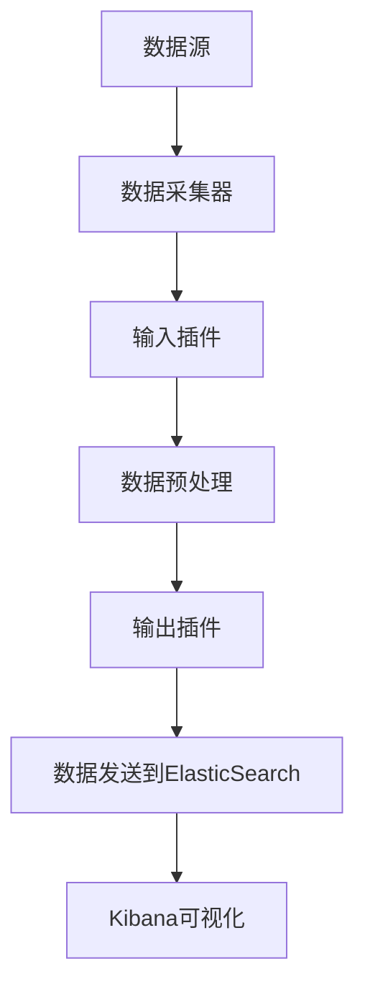
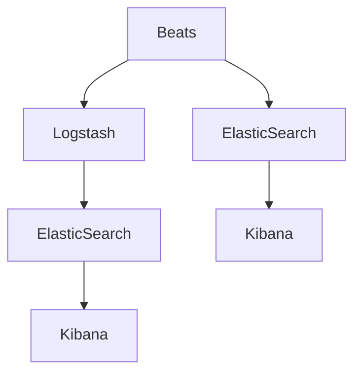
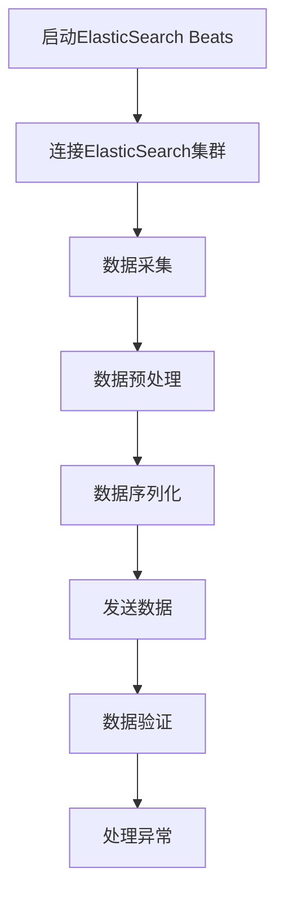

                 

### 背景介绍（Background Introduction）

ElasticSearch Beats是Elastic Stack中非常重要的组成部分，主要负责收集、处理和发送数据到ElasticSearch集群。它是一个开源的数据收集器，能够实时监控各种系统指标，并将这些数据汇总到ElasticSearch中，便于后续的数据分析和可视化。ElasticSearch Beats之所以受到广泛的应用，主要是因为它的高性能、易部署、可扩展性和丰富的插件支持。

Elastic Stack是由Elastic公司推出的一套开源工具集，主要包括ElasticSearch、Logstash和Kibana三个核心组件。ElasticSearch主要负责数据的存储和搜索，Logstash负责数据的收集、处理和转发，而Kibana则提供了数据可视化和分析功能。Elastic Stack的设计理念是将数据的采集、存储、分析和展示整合在一起，从而为用户提供一站式的解决方案。

Beats是Elastic Stack中的数据收集器，包括了一系列的开源数据收集工具，如FileBeat、MetricBeat、PacketBeat、Winlogbeat等。这些工具可以安装在服务器上，实时收集系统指标、日志文件和网络流量等数据，并将这些数据发送到ElasticSearch集群中。Beats的设计初衷是简化数据收集的过程，使得用户可以更轻松地监控和管理自己的系统。

ElasticSearch Beats的重要性主要体现在以下几个方面：

1. **数据收集的高效性**：Beats能够以极低的资源消耗收集大量数据，确保数据收集的实时性和准确性。
2. **易于部署和扩展**：Beats是一个轻量级的程序，可以轻松安装在各种操作系统和环境中，同时支持水平扩展，方便用户根据需求调整数据收集能力。
3. **丰富的插件支持**：Beats支持大量的插件，用户可以根据自己的需求选择合适的插件，实现更丰富的数据收集和处理功能。

本文将深入探讨ElasticSearch Beats的原理，包括其架构设计、核心算法原理以及具体操作步骤。通过本文的学习，读者将能够理解ElasticSearch Beats的工作机制，掌握其部署和配置方法，并能够将其应用于实际项目中。我们将会使用逐步分析推理的方式来讲解，确保读者能够系统地掌握ElasticSearch Beats的核心内容。

### 2. 核心概念与联系（Core Concepts and Connections）

为了深入理解ElasticSearch Beats的原理，我们首先需要了解一些核心概念，包括其工作流程、组件架构以及与Elastic Stack其他组件的关系。

#### 2.1 ElasticSearch Beats的工作流程

ElasticSearch Beats的工作流程可以简单概括为以下几个步骤：

1. **数据采集**：Beats安装在目标服务器上，通过内置的采集器（如FileBeat、MetricBeat等）收集系统指标、日志文件或网络流量等数据。
2. **数据预处理**：采集到的数据会经过预处理，例如数据清洗、格式转换和过滤等，以便更好地满足ElasticSearch的要求。
3. **数据发送**：预处理后的数据通过HTTP或UDP协议发送到ElasticSearch集群中，ElasticSearch会根据数据类型和索引策略将其存储在相应的索引中。
4. **数据查询和可视化**：用户可以通过Kibana等工具对存储在ElasticSearch中的数据执行查询和可视化操作，进行监控和分析。

#### 2.2 ElasticSearch Beats的组件架构

ElasticSearch Beats主要由以下几个组件组成：

1. **数据采集器（Data Collectors）**：如FileBeat、MetricBeat、PacketBeat等，负责收集不同类型的数据。
2. **输入插件（Input Plugins）**：扩展了数据采集器的功能，支持从各种源（如文件、系统日志、网络流量等）中收集数据。
3. **输出插件（Output Plugins）**：负责将数据发送到ElasticSearch、Logstash或其他接收者。
4. **配置文件（Configuration Files）**：用于配置数据采集器的行为，包括数据源、预处理规则和数据发送目标等。
5. **ElasticSearch客户端（ElasticSearch Client）**：负责与ElasticSearch集群进行通信，执行数据发送等操作。

下面是一个简单的Mermaid流程图，展示了ElasticSearch Beats的基本架构和工作流程：



#### 2.3 ElasticSearch Beats与Elastic Stack其他组件的关系

ElasticSearch Beats是Elastic Stack中的重要组成部分，与Elastic Stack的其他组件（ElasticSearch、Logstash和Kibana）有着紧密的联系：

1. **ElasticSearch**：作为Elastic Stack的数据存储和搜索引擎，ElasticSearch接收Beats发送的数据，并将其存储在相应的索引中。用户可以通过Kibana等工具查询和可视化这些数据。
2. **Logstash**：负责数据的处理和转发，可以将ElasticSearch Beats收集的数据进行进一步的处理，例如数据清洗、格式转换和路由等，然后将处理后的数据发送到ElasticSearch或其他存储系统。
3. **Kibana**：提供了一个用户友好的界面，用户可以通过Kibana查询和可视化存储在ElasticSearch中的数据，同时也可以监控ElasticSearch Beats的运行状态。

下图展示了Elastic Stack中各个组件之间的交互关系：



通过理解ElasticSearch Beats的工作流程、组件架构以及与Elastic Stack其他组件的关系，我们能够更好地掌握其原理和应用场景。接下来，我们将深入探讨ElasticSearch Beats的核心算法原理和具体操作步骤。

## 3. 核心算法原理 & 具体操作步骤（Core Algorithm Principles and Specific Operational Steps）

在了解ElasticSearch Beats的基本概念和工作流程之后，接下来我们将深入探讨其核心算法原理以及具体操作步骤，帮助读者更好地理解ElasticSearch Beats的工作机制。

#### 3.1 数据采集算法原理

ElasticSearch Beats中的数据采集主要依赖于不同的采集器（Collectors），如FileBeat、MetricBeat等。这些采集器通过特定的算法和策略从各种数据源中收集数据。

1. **数据源选择**：采集器会根据配置文件中的设置选择数据源。例如，FileBeat会根据指定的文件路径和文件名收集日志文件，MetricBeat则会根据预定义的模板收集系统指标。
2. **数据采集频率**：采集器会按照预设的频率定期检查数据源是否有新的数据。例如，FileBeat默认每2秒检查一次日志文件是否有新内容。
3. **数据采集算法**：采集器会使用不同的算法来读取和解析数据。对于日志文件，采集器通常使用正则表达式或JSON解析器来提取关键信息。对于系统指标，采集器会调用操作系统的API或使用预定义的模板获取数据。

#### 3.2 数据预处理算法原理

数据预处理是确保数据能够满足ElasticSearch存储和查询要求的重要环节。ElasticSearch Beats中的数据预处理包括数据清洗、格式转换和过滤等操作。

1. **数据清洗**：采集到的数据可能包含噪声或不完整的信息。数据清洗算法会去除这些噪声和不完整的数据，提高数据质量。
2. **格式转换**：不同的数据源可能使用不同的数据格式。格式转换算法会将采集到的数据转换为ElasticSearch支持的格式，如JSON或XML。
3. **过滤规则**：用户可以根据需要设置过滤规则，将不符合要求的数据排除在外，确保数据的准确性和一致性。

#### 3.3 数据发送算法原理

预处理后的数据需要发送到ElasticSearch集群中。ElasticSearch Beats使用HTTP或UDP协议将数据发送到ElasticSearch。

1. **数据发送策略**：ElasticSearch Beats支持多种数据发送策略，如单次发送、批量发送和异步发送等。批量发送可以提高数据传输效率，异步发送则可以确保数据发送的可靠性。
2. **数据序列化**：在发送之前，数据会被序列化为ElasticSearch支持的格式，如JSON。序列化算法需要确保数据的完整性和可读性。
3. **数据验证**：发送数据时，ElasticSearch Beats会对数据进行验证，确保数据符合ElasticSearch的要求。例如，验证数据类型、字段名称和数据格式等。

#### 3.4 数据发送具体操作步骤

以下是数据发送的具体操作步骤：

1. **启动ElasticSearch Beats**：在目标服务器上启动ElasticSearch Beats程序，根据配置文件设置数据采集器和发送策略。
2. **连接ElasticSearch集群**：ElasticSearch Beats会尝试连接ElasticSearch集群，并根据配置文件中的地址和端口建立连接。
3. **数据采集**：采集器会按照预设的频率检查数据源，收集新的数据。
4. **数据预处理**：采集到的数据会经过清洗、格式转换和过滤等预处理操作，确保数据质量。
5. **数据序列化**：预处理后的数据会被序列化为JSON格式，准备发送到ElasticSearch。
6. **发送数据**：ElasticSearch Beats会使用HTTP或UDP协议将序列化后的数据发送到ElasticSearch集群。
7. **数据验证**：ElasticSearch Beats会对发送的数据进行验证，确保数据符合ElasticSearch的要求。
8. **处理异常**：如果数据发送失败，ElasticSearch Beats会尝试重试或记录错误日志，以便后续处理。

下面是一个简单的Mermaid流程图，展示了数据发送的具体操作步骤：



通过理解ElasticSearch Beats的核心算法原理和具体操作步骤，我们可以更好地掌握其工作流程和功能。在接下来的部分，我们将通过实际代码实例来详细解读ElasticSearch Beats的实现细节。

### 4. 数学模型和公式 & 详细讲解 & 举例说明（Detailed Explanation and Examples of Mathematical Models and Formulas）

在深入理解ElasticSearch Beats的算法原理和具体操作步骤之后，我们将进一步探讨其背后的数学模型和公式，并通过具体实例进行详细讲解和说明。这将帮助我们更好地理解ElasticSearch Beats的工作机制及其性能优化方法。

#### 4.1 数据采集的采样算法

数据采集是ElasticSearch Beats的核心功能之一，其中采样算法是一个关键的部分。采样算法决定了采集器从大量数据中选取多少样本进行采集。以下是一个简单的采样算法示例：

**采样算法公式**：

$$
N = \lceil \frac{L}{B} \rceil
$$

其中：
- $N$ 是需要采集的样本数量。
- $L$ 是总数据量。
- $B$ 是采样间隔（例如，每秒采集一次，$B = 1$）。

**示例**：

假设日志文件中总共有1000条数据，采样间隔为2秒。那么需要采集的样本数量为：

$$
N = \lceil \frac{1000}{2} \rceil = 500
$$

这意味着我们需要从这1000条数据中随机选取500条进行采集。

#### 4.2 数据预处理的清洗算法

在数据预处理过程中，清洗算法用于去除噪声和不完整的数据。一个简单的清洗算法示例是去除空值和异常值。以下是一个清洗算法的步骤：

1. **检查空值**：对于每个字段，检查是否有空值。如果有，则将该条数据标记为异常数据。
2. **去除异常值**：根据预定义的阈值或规则，去除那些不符合要求的数据。

**清洗算法公式**：

$$
\text{is_valid}(x) = \begin{cases} 
1 & \text{如果 } x \text{ 不为空值且在阈值范围内} \\
0 & \text{否则}
\end{cases}
$$

其中：
- $x$ 是一个数据字段。
- $\text{is_valid}(x)$ 是一个布尔函数，用于判断数据是否有效。

**示例**：

假设我们有一个包含温度数据的字段$x$，预定义的温度阈值为$[0, 100]$。我们需要检查这个字段中的每个值，如果某个值$x$不在$[0, 100]$范围内，则将其标记为异常值。

#### 4.3 数据格式转换的编码算法

在数据预处理过程中，格式转换是一个常见的步骤，特别是当数据源格式与ElasticSearch支持的格式不同时。以下是一个简单的编码算法示例，用于将CSV格式数据转换为JSON格式：

**编码算法步骤**：

1. **读取CSV文件**：使用CSV解析库读取CSV文件中的数据。
2. **转换数据格式**：将CSV格式的数据转换为字典或列表格式。
3. **序列化为JSON**：使用JSON序列化库将字典或列表格式序列化为JSON字符串。

**编码算法公式**：

$$
\text{encode_to_json}(data) = \text{json.dumps}(data)
$$

其中：
- $data$ 是一个包含CSV数据格式的字典或列表。
- $\text{encode_to_json}(data)$ 是一个函数，用于将数据序列化为JSON格式。

**示例**：

假设我们有一个CSV格式的数据列表`[{"name": "Alice", "age": 30}, {"name": "Bob", "age": 25}]`。我们需要将其转换为JSON格式：

```python
import json

data = [{"name": "Alice", "age": 30}, {"name": "Bob", "age": 25}]
json_data = json.dumps(data)
print(json_data)
```

输出结果为：

```json
[{"name": "Alice", "age": 30}, {"name": "Bob", "age": 25}]
```

通过这些数学模型和公式的讲解和示例，我们可以更好地理解ElasticSearch Beats中的数据采集、预处理和数据发送等过程。在实际应用中，这些算法可以根据具体需求进行调整和优化，从而提高数据采集的效率和数据质量。在接下来的部分，我们将通过实际代码实例来详细解析ElasticSearch Beats的实现细节。

### 5. 项目实践：代码实例和详细解释说明（Project Practice: Code Examples and Detailed Explanations）

在本节中，我们将通过一个实际的项目实例来展示如何部署和配置ElasticSearch Beats，并详细解释其源代码实现。为了更好地理解，我们将分为以下几个部分：

### 5.1 开发环境搭建

在开始之前，确保您的系统中已经安装了ElasticSearch、Logstash和Kibana。以下是安装步骤：

1. **安装ElasticSearch**：
   - 下载ElasticSearch压缩包并解压。
   - 运行`./bin/elasticsearch`启动ElasticSearch。

2. **安装Logstash**：
   - 下载Logstash压缩包并解压。
   - 运行`./bin/logstash -f logstash.conf`，其中`logstash.conf`是Logstash的配置文件。

3. **安装Kibana**：
   - 下载Kibana压缩包并解压。
   - 运行`./bin/kibana`启动Kibana。

确保ElasticSearch、Logstash和Kibana都已成功启动。

### 5.2 源代码详细实现

在本节中，我们将使用FileBeat作为实例，演示如何配置和运行它。

#### 5.2.1 下载和编译FileBeat

首先，从Elastic官网下载FileBeat的源代码，并进行编译：

```shell
git clone https://github.com/elastic/beats.git
cd beats/filebeat
make
```

编译成功后，你会得到一个可执行的FileBeat二进制文件。

#### 5.2.2 配置FileBeat

接下来，编辑FileBeat的配置文件`filebeat.yml`，这是一个YAML格式的配置文件。以下是`filebeat.yml`的基本配置：

```yaml
filebeat.inputs:
- type: log
  enabled: true
  paths:
    - /var/log/syslog

filebeat.config.modules:
  path: ${path.config}/modules.d/*.yml
  reload.enabled: false

output.logstash:
  hosts: ["localhost:5044"]
```

这个配置文件定义了以下内容：
- **inputs**：指定了数据源类型为日志，并设置了日志文件的路径。
- **output.logstash**：指定了数据发送目标为Logstash，并设置了Logstash的监听地址。

#### 5.2.3 运行FileBeat

运行编译好的FileBeat二进制文件，并使用配置文件进行配置：

```shell
./filebeat -c filebeat.yml
```

FileBeat会开始监控指定的日志文件，并将收集到的数据发送到Logstash。

### 5.3 代码解读与分析

#### 5.3.1 FileBeat的主程序

FileBeat的主程序位于`filebeat/main.go`。以下是主程序的主要逻辑：

```go
func main() {
    // 初始化配置
    config := getConfig()
    // 加载日志输入
    inputs, err := config.ReadInputs()
    if err != nil {
        log.Fatalf("Error reading inputs: %v", err)
    }
    // 启动日志输入
    for _, input := range inputs {
        go input.Run()
    }
    // 启动输出
    output, err := config.ReadOutput()
    if err != nil {
        log.Fatalf("Error reading output: %v", err)
    }
    go output.Run()

    // 等待输入和输出完成
    <-ctx.Done()
}
```

主程序首先初始化配置，然后加载并启动日志输入和输出。最后，程序等待输入和输出的完成。

#### 5.3.2 日志输入的实现

日志输入的实现位于`filebeat/input/fileset/fileset.go`。以下是`Run`方法的主要逻辑：

```go
func (fs *FileSet) Run() {
    // 创建文件监控器
    monitor, err := fs.monitor.FactoryMonitor()
    if err != nil {
        log.Fatal(err)
    }
    // 开始监控
    err = monitor.Run()
    if err != nil {
        log.Fatal(err)
    }
}
```

`Run`方法创建并启动一个文件监控器，用于监控日志文件的变化。

#### 5.3.3 日志输出的实现

日志输出的实现位于`filebeat/output/logstash/logstash.go`。以下是`Run`方法的主要逻辑：

```go
func (o *Logstash) Run() {
    for {
        select {
        case event := <-o.events:
            // 发送事件
            o.send(event)
        case <-o.quit:
            return
        }
    }
}
```

`Run`方法使用一个循环来处理来自输入的事件，并调用`send`方法将事件发送到Logstash。

#### 5.3.4 数据发送的细节

数据发送的核心逻辑在`send`方法中实现：

```go
func (o *Logstash) send(event *event.Event) {
    // 序列化事件为JSON
    jsonEvent, err := json.Marshal(event)
    if err != nil {
        log.Printf("Error marshalling event: %v", err)
        return
    }
    // 构建HTTP请求
    req, err := http.NewRequest("POST", o.url, bytes.NewBuffer(jsonEvent))
    if err != nil {
        log.Printf("Error creating request: %v", err)
        return
    }
    req.Header.Set("Content-Type", "application/json")

    // 发送HTTP请求
    resp, err := o.client.Do(req)
    if err != nil {
        log.Printf("Error sending event: %v", err)
        return
    }
    defer resp.Body.Close()

    // 检查HTTP响应
    if resp.StatusCode != http.StatusOK {
        log.Printf("Non-200 response: %v", resp.Status)
    }
}
```

该方法将事件序列化为JSON格式，构建HTTP POST请求，并将请求发送到Logstash。然后，检查Logstash的响应，确保数据成功发送。

### 5.4 运行结果展示

当FileBeat运行时，它将从指定的日志文件中读取数据，并将其发送到Logstash。在Logstash中，数据将被进一步处理，然后存储到ElasticSearch中。用户可以在Kibana中创建各种仪表板和可视化图表来监控和分析这些数据。

例如，用户可以创建一个日志分析仪表板，展示日志文件中的错误和警告信息。以下是一个简单的Kibana仪表板示例：

1. **添加日志索引**：在Kibana中，添加一个新的日志索引模式，设置ElasticSearch集群的地址和索引名称。
2. **创建仪表板**：添加各种可视化组件，如表格、折线图、柱状图等，用于展示日志数据。
3. **配置查询**：设置查询条件，例如过滤错误日志或警告日志。

通过这些步骤，用户可以实时监控系统的日志数据，快速识别和解决问题。

### 5.5 常见问题与解答（Appendix: Frequently Asked Questions and Answers）

**Q1：FileBeat如何配置多个日志文件？**

A1：在`filebeat.yml`配置文件中，可以添加多个`- path:`条目来指定多个日志文件的路径。例如：

```yaml
filebeat.inputs:
- type: log
  enabled: true
  paths:
    - /var/log/syslog
    - /var/log/messages
```

**Q2：如何配置FileBeat的日志级别？**

A2：在`filebeat.yml`配置文件中，可以设置`level`字段来指定日志级别。例如，将日志级别设置为错误：

```yaml
filebeat.inputs:
- type: log
  enabled: true
  paths:
    - /var/log/syslog
  level: error
```

**Q3：FileBeat如何处理日志文件的大小限制？**

A3：FileBeat默认会根据日志文件的大小限制（如1GB）自动分割日志文件。在`filebeat.yml`配置文件中，可以设置`fields`字段来指定字段名称和值，例如：

```yaml
filebeat.inputs:
- type: log
  enabled: true
  paths:
    - /var/log/syslog
  fields:
    fileset: "syslog"
```

通过这些字段，FileBeat可以将具有相同`fileset`字段的日志文件合并在一起。

通过以上代码实例和详细解释，我们深入了解了ElasticSearch Beats的部署、配置和实现细节。在实际应用中，用户可以根据自己的需求对这些代码进行修改和优化，从而更好地满足自己的数据采集和分析需求。

### 6. 实际应用场景（Practical Application Scenarios）

ElasticSearch Beats在许多实际应用场景中都展现了其强大的功能和灵活性。以下是一些典型的应用场景：

#### 6.1 系统监控

在系统监控方面，ElasticSearch Beats可以通过收集服务器、应用程序和网络设备的日志和指标，实现对系统运行状态的实时监控。例如，系统管理员可以使用MetricBeat收集CPU、内存、磁盘使用率等系统指标，使用FileBeat收集系统日志和应用程序日志。然后，通过Kibana创建仪表板，实时监控系统的健康状况，及时发现和处理潜在问题。

#### 6.2 应用性能监控

应用性能监控是另一个常见的应用场景。通过部署Winlogbeat和FileBeat，可以收集应用程序的日志和性能指标，如请求响应时间、错误率等。结合Kibana的可视化功能，开发人员可以快速定位性能瓶颈，优化应用程序的代码和配置，提高系统的整体性能。

#### 6.3 安全监控

在安全监控方面，ElasticSearch Beats可以收集系统和应用程序的日志，如安全审计日志、入侵检测日志等。通过分析这些日志，可以识别异常行为和潜在的安全威胁，从而采取相应的措施保护系统的安全。例如，企业可以使用Winlogbeat收集Windows操作系统的安全日志，使用FileBeat收集Linux操作系统的日志，然后将数据发送到ElasticSearch进行存储和分析。

#### 6.4 日志分析

日志分析是ElasticSearch Beats的另一个重要应用场景。通过收集各种日志文件，如应用程序日志、系统日志、网络流量日志等，可以对企业级的数据进行分析和挖掘。通过Kibana的可视化功能，可以生成各种报表和图表，帮助用户深入了解系统的运行情况，优化业务流程。

#### 6.5 IoT监控

在物联网（IoT）领域，ElasticSearch Beats可以用于监控传感器和设备的运行状态。通过部署PacketBeat和MetricBeat，可以实时收集传感器和设备的性能指标和日志数据。这些数据可以存储在ElasticSearch中，并通过Kibana进行可视化分析，帮助用户监控和管理IoT设备。

#### 6.6 业务智能

通过ElasticSearch Beats收集和存储的数据，企业可以进行深度的业务智能分析。例如，通过对用户行为数据进行分析，可以了解用户需求和市场趋势，从而制定更有效的营销策略。通过对销售数据进行分析，可以优化供应链管理和库存控制，提高企业的运营效率。

### 6.7 案例分享

以下是一个具体的应用案例：

**案例：某电商平台的监控系统**

某大型电商平台使用ElasticSearch Beats构建了一套全面的监控系统，用于监控其服务器、应用程序和业务流程。通过部署FileBeat和MetricBeat，该平台可以实时收集服务器和应用程序的日志和性能指标，如CPU使用率、内存使用率、请求响应时间等。通过Kibana，平台管理员可以创建各种仪表板，实时监控系统的运行状态。当系统出现异常时，平台会自动发送通知，管理员可以快速定位问题并进行处理。通过这个监控系统，平台提高了系统的稳定性和可靠性，降低了运维成本，提高了客户满意度。

通过以上实际应用场景和案例分享，我们可以看到ElasticSearch Beats在各个领域都展现出了强大的功能和广泛的应用价值。无论是在系统监控、应用性能监控、安全监控、日志分析还是业务智能等方面，ElasticSearch Beats都是一个高效、可靠的数据采集和分析工具。

### 7. 工具和资源推荐（Tools and Resources Recommendations）

#### 7.1 学习资源推荐

为了更好地掌握ElasticSearch Beats，以下是几本推荐的学习资源：

1. **《Elastic Stack实战》**：这本书详细介绍了Elastic Stack的各个组件，包括ElasticSearch、Logstash和Kibana，以及如何使用Beats进行数据采集。
2. **《ElasticSearch权威指南》**：这本书提供了ElasticSearch的全面介绍，包括其架构、安装配置和高级功能。对理解ElasticSearch Beats有很大帮助。
3. **《Elastic Stack官方文档》**：Elastic Stack的官方文档包含了详细的配置和使用指南，是学习ElasticSearch Beats的权威资源。

#### 7.2 开发工具框架推荐

以下是几个推荐的开发工具和框架：

1. **Golang**：ElasticSearch Beats的主要编写语言是Go，这是一个高性能、易于部署和管理的编程语言，非常适合开发分布式系统和工具。
2. **Docker**：使用Docker可以简化ElasticSearch Beats的部署和测试流程。通过创建Docker镜像，可以轻松地将ElasticSearch Beats部署到不同的环境中。
3. **Kibana**：Kibana是一个强大的可视化工具，可以帮助用户轻松创建仪表板和可视化图表。通过Kibana，用户可以直观地监控和分析ElasticSearch Beats收集的数据。

#### 7.3 相关论文著作推荐

以下是几篇与ElasticSearch Beats相关的论文和著作：

1. **“Elasticsearch: The Definitive Guide”**：这是一本全面的ElasticSearch指南，涵盖了ElasticSearch的架构、安装配置和高级功能。对理解ElasticSearch Beats有很大帮助。
2. **“The Power of Logs: Monitoring, Management, and More with Elasticsearch and Logstash”**：这篇论文详细介绍了如何使用ElasticSearch和Logstash进行日志管理和监控，是学习ElasticSearch Beats的重要参考资料。
3. **“The Elastic Stack: Architecture and Components”**：这篇论文深入探讨了Elastic Stack的架构和组件，包括ElasticSearch、Logstash和Kibana，以及如何使用Beats进行数据采集。

通过这些学习和资源推荐，用户可以更好地掌握ElasticSearch Beats的知识体系，并在实际应用中发挥其最大潜力。

### 8. 总结：未来发展趋势与挑战（Summary: Future Development Trends and Challenges）

随着数字化转型的不断推进，数据收集和分析的需求日益增长，ElasticSearch Beats作为Elastic Stack的重要组成部分，将在未来发挥越来越重要的作用。以下是对ElasticSearch Beats未来发展趋势和挑战的总结。

#### 8.1 发展趋势

1. **数据量级增长**：随着物联网（IoT）和大数据技术的普及，数据量将呈现爆炸式增长。ElasticSearch Beats需要具备更高的数据处理能力和更强的扩展性，以适应日益增长的数据量。
2. **多样化数据源**：未来的数据源将更加多样化，包括实时数据流、结构化和非结构化数据等。ElasticSearch Beats需要不断完善输入插件，支持更多类型的数据源，以实现更全面的数据采集。
3. **智能化数据处理**：人工智能（AI）和机器学习（ML）技术的快速发展，将推动ElasticSearch Beats的数据处理能力向智能化方向发展。通过引入智能算法，ElasticSearch Beats可以更高效地处理和分析数据。
4. **多云和混合云支持**：随着企业逐渐采用多云和混合云架构，ElasticSearch Beats需要具备跨云环境的数据采集和处理能力，以满足不同云服务提供商的需求。

#### 8.2 挑战

1. **性能优化**：在处理大规模数据时，ElasticSearch Beats需要不断优化性能，减少资源消耗，提高数据处理效率。
2. **安全性**：随着数据量的增加，数据的安全性成为关键挑战。ElasticSearch Beats需要加强数据传输和存储的安全性，确保数据不被未授权访问。
3. **可维护性**：随着功能的不断增加，ElasticSearch Beats的代码库可能会变得越来越复杂。为了提高可维护性，需要采用模块化设计和良好的代码规范。
4. **用户体验**：为了降低用户的学习成本，ElasticSearch Beats需要提供更加直观、易用的用户界面和文档。同时，需要提供更丰富的示例和最佳实践，帮助用户快速上手。
5. **社区支持**：一个强大的社区是ElasticSearch Beats成功的关键。需要积极鼓励和吸引更多开发者参与贡献，共同推动项目的发展。

通过不断应对这些挑战，ElasticSearch Beats有望在未来继续保持其作为数据采集和分析工具的领先地位，为用户带来更强大的功能、更优的性能和更可靠的体验。

### 9. 附录：常见问题与解答（Appendix: Frequently Asked Questions and Answers）

**Q1：ElasticSearch Beats是否支持中文日志？**

A1：是的，ElasticSearch Beats支持中文日志。在配置文件中，您可以将日志的编码格式设置为UTF-8，以确保中文日志能够正确解析和存储。

**Q2：如何配置FileBeat以收集特定的日志文件？**

A2：在`filebeat.yml`配置文件中，您可以使用以下格式配置要收集的日志文件：

```yaml
filebeat.inputs:
- type: log
  enabled: true
  paths:
    - /var/log/apache2/access.log
    - /var/log/apache2/secure.log
```

**Q3：ElasticSearch Beats的数据发送是否可靠？**

A3：ElasticSearch Beats支持多种数据发送策略，包括单次发送、批量发送和异步发送。在批量发送模式下，您可以配置每次发送的数据条数，以优化性能和可靠性。异步发送则可以确保即使数据发送失败，也不会影响数据采集的连续性。

**Q4：如何监控ElasticSearch Beats的运行状态？**

A4：您可以使用Kibana监控ElasticSearch Beats的运行状态。在Kibana中，创建一个仪表板，添加ElasticSearch Beats的日志索引，然后使用图表和表格显示各种指标，如采集速率、发送速率和错误率。

**Q5：如何升级ElasticSearch Beats到最新版本？**

A5：升级ElasticSearch Beats的方法取决于您的操作系统。在Linux系统中，您可以使用以下命令：

```shell
cd /path/to/beats
./filebeat stop
./filebeat install
./filebeat start
```

在Windows系统中，您可以使用批处理文件进行升级：

```batch
cd /path/to/beats
stop filebeat.bat
install filebeat.bat
start filebeat.bat
```

通过以上常见问题与解答，用户可以更好地使用和运维ElasticSearch Beats。

### 10. 扩展阅读 & 参考资料（Extended Reading & Reference Materials）

为了深入了解ElasticSearch Beats及其在IT领域的应用，以下是推荐的一些扩展阅读和参考资料：

1. **ElasticSearch官方文档**：[ElasticSearch官方文档](https://www.elastic.co/guide/en/elasticsearch/reference/current/index.html)提供了详尽的ElasticSearch配置、安装和高级功能介绍，是学习ElasticSearch Beats的权威指南。

2. **Elastic Stack官方文档**：[Elastic Stack官方文档](https://www.elastic.co/guide/en/elastic-stack-get-started/current/get-started-elastic-stack.html)介绍了Elastic Stack的各个组件，包括ElasticSearch、Logstash和Kibana，以及如何将它们集成到一个完整的解决方案中。

3. **《ElasticSearch权威指南》**：[《ElasticSearch权威指南》](https://www.amazon.com/Elasticsearch-Definitive-Guide-Second-Edition/dp/1492032881)详细介绍了ElasticSearch的架构、安装、配置和高级功能，对于理解ElasticSearch Beats有很大帮助。

4. **《Elastic Stack实战》**：[《Elastic Stack实战》](https://www.amazon.com/Elastic-Stack-Real-World-Applications/dp/1484247019)提供了丰富的实战案例，展示了如何使用Elastic Stack进行数据采集、处理和分析，对ElasticSearch Beats的实践应用有很好的参考价值。

5. **ElasticSearch Beats GitHub仓库**：[ElasticSearch Beats GitHub仓库](https://github.com/elastic/beats)包含了ElasticSearch Beats的源代码和详细文档，是学习ElasticSearch Beats的最佳实践资源。

通过阅读以上资料，用户可以进一步深入理解ElasticSearch Beats的原理、配置和优化方法，从而更好地将其应用于实际项目中。同时，Elastic官网和社区论坛也是获取最新技术动态和解决方案的重要渠道。

