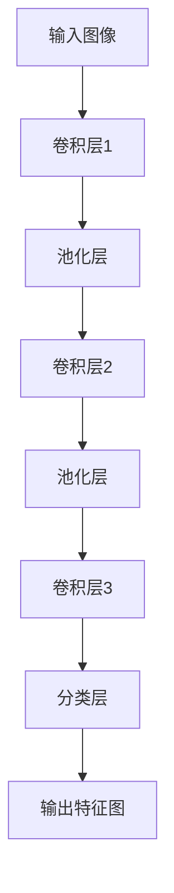

                 

### 文章标题

**FCN原理与代码实例讲解**

在本篇技术博客中，我们将深入探讨卷积神经网络（Convolutional Neural Network，简称CNN）的一种变体——全卷积网络（Fully Convolutional Network，简称FCN）的原理及其在实际应用中的代码实例。FCN在网络图像处理领域有着广泛的应用，特别是在图像分割任务中。本文旨在通过逐步分析FCN的架构、核心算法以及具体实现，帮助读者更好地理解这一重要技术。

### Keywords

- Fully Convolutional Network (FCN)
- Convolutional Neural Networks (CNN)
- Image Segmentation
- Neural Network Architectures
- Deep Learning
- Code Examples

### Abstract

This technical blog post aims to provide a comprehensive understanding of Fully Convolutional Networks (FCNs), a variant of Convolutional Neural Networks (CNNs) widely used in image processing, particularly for image segmentation tasks. We will explore the architecture, core principles, and specific code examples of FCNs to guide readers through this advanced topic in deep learning.

### 1. 背景介绍（Background Introduction）

卷积神经网络（CNN）自2012年由Alex Krizhevsky等人引入后，在图像识别领域取得了革命性的突破。CNN通过其独特的结构，能够自动从原始图像中提取特征，并有效地进行分类。然而，随着图像处理任务的复杂性增加，如图像分割（image segmentation），传统CNN的表现不再理想。图像分割任务要求我们不仅仅识别图像中的物体，还要明确每个像素所属的类别。这一要求使得传统CNN难以胜任，因为它们的输出通常是一个一维的标签序列，而不是一个与图像尺寸相匹配的二维标签图。

为了解决这一问题，研究者们提出了全卷积网络（FCN）。FCN的基本思想是将CNN中的全连接层（fully connected layers）替换为卷积层（convolutional layers），从而使整个网络可以接受和输出与图像尺寸相同的特征图（feature maps）。这样，FCN不仅可以提取图像特征，还能够对每个像素进行分类，从而实现精确的图像分割。

FCN的出现填补了CNN在图像分割任务中的空白，并在医学图像分析、自动驾驶、计算机视觉等领域取得了显著的应用成果。接下来，我们将深入探讨FCN的原理和实现细节。

### 2. 核心概念与联系（Core Concepts and Connections）

#### 2.1 FCN的定义与基本架构

全卷积网络（FCN）是一种特殊的卷积神经网络，其核心在于所有的层都是卷积层，没有传统的全连接层。这使得FCN能够接受任意尺寸的输入图像，并输出与输入图像尺寸相同的特征图。FCN的基本架构可以分为以下几个部分：

1. **卷积层（Convolutional Layers）**：卷积层用于提取图像的特征。与传统的CNN相同，FCN通过卷积操作和激活函数（如ReLU）来提取层次化的图像特征。
2. **池化层（Pooling Layers）**：池化层用于减小特征图的尺寸，减少参数数量，提高计算效率。FCN通常使用最大池化（max pooling）。
3. **卷积层（Convolutional Layers）**：在提取特征之后，FCN会再次通过卷积层进行特征融合和细化。
4. **分类层（Classification Layers）**：在输出阶段，FCN通过一个卷积层（通常称为“分类卷积层”）对每个像素进行分类。由于不需要全连接层，这个卷积层的尺寸与输入特征图的尺寸相同。

#### 2.2 FCN与CNN的区别

FCN与传统的CNN在架构上有显著区别。以下是两者之间的主要差异：

1. **输入输出尺寸**：传统CNN通常以固定尺寸的图像作为输入，并输出一个一维的标签序列。而FCN以任意尺寸的图像为输入，并输出与输入图像尺寸相同的特征图。
2. **全连接层**：传统CNN包含全连接层，这些层负责将提取的特征映射到具体的类别标签上。而FCN没有全连接层，因此可以处理任意尺寸的图像。
3. **参数数量**：由于没有全连接层，FCN的参数数量比传统CNN少得多，这有助于提高模型的效率和泛化能力。

#### 2.3 FCN的优势

FCN在图像分割任务中具有以下优势：

1. **高效性**：FCN通过使用卷积层和池化层，可以高效地处理大规模图像，减少计算资源的需求。
2. **灵活性**：FCN可以接受任意尺寸的图像输入，这使得它在处理不同尺寸的图像时更加灵活。
3. **准确性**：由于FCN可以输出与输入图像尺寸相同的特征图，因此它在图像分割任务中的准确性更高。

下面是一个简化的FCN架构的Mermaid流程图：



通过以上介绍，我们可以看到FCN是一种强大的图像处理工具，特别是在图像分割任务中。在接下来的部分中，我们将进一步探讨FCN的核心算法原理，并提供具体的代码实现步骤。

### 3. 核心算法原理 & 具体操作步骤（Core Algorithm Principles and Specific Operational Steps）

#### 3.1 FCN的工作原理

FCN的核心原理是通过卷积操作从图像中提取特征，并使用这些特征进行像素级别的分类。具体来说，FCN的工作流程如下：

1. **特征提取**：输入图像首先通过多个卷积层和池化层进行特征提取。这些卷积层和池化层组合在一起形成一个卷积基（convolutional base），用于提取图像的高层次特征。
2. **特征融合**：提取到的特征图通过一系列卷积层进行特征融合，以细化特征并增加特征图的分辨率。
3. **像素分类**：在输出的特征图上，通过一个分类卷积层对每个像素进行分类。由于特征图的尺寸与输入图像相同，每个像素都会被分类到一个特定的类别中。

#### 3.2 卷积操作

卷积操作是FCN中的基础。卷积层通过在输入图像上滑动一个卷积核（filter），与输入特征进行点积操作，并应用一个非线性激活函数（如ReLU）来生成输出特征图。具体步骤如下：

1. **卷积核滑动**：卷积层在输入图像上滑动卷积核，每次滑动一步。卷积核的大小决定了提取特征的局部性。
2. **点积操作**：在每个位置上，卷积核与输入特征进行点积操作，生成一个局部特征图。
3. **非线性激活**：应用非线性激活函数（如ReLU）来增强网络的表达能力。

#### 3.3 池化操作

池化操作用于减小特征图的尺寸，减少参数数量，并提高网络的泛化能力。常用的池化操作包括最大池化（max pooling）和平均池化（avg pooling）。具体步骤如下：

1. **窗口滑动**：在特征图上滑动一个窗口，窗口的大小决定了池化的步长。
2. **值选择**：在窗口内的所有像素值中选择最大值（最大池化）或平均值（平均池化），生成一个池化值。
3. **特征图更新**：将池化值填入新的特征图中，从而减小特征图的尺寸。

#### 3.4 分类卷积层

在特征融合后，分类卷积层用于对每个像素进行分类。分类卷积层通常是一个卷积核尺寸与特征图尺寸相同的卷积层，其输出层中的每个单元代表一个类别的概率。具体步骤如下：

1. **卷积操作**：在特征图上滑动分类卷积核，与特征进行卷积操作。
2. **激活函数**：通常使用Softmax激活函数将卷积层的输出转化为概率分布。
3. **输出特征图**：生成的特征图中的每个像素值代表对应类别的概率。

通过以上步骤，FCN能够从输入图像中提取特征，并精确地对每个像素进行分类，从而实现图像分割任务。

### 4. 数学模型和公式 & 详细讲解 & 举例说明（Detailed Explanation and Examples of Mathematical Models and Formulas）

在FCN中，数学模型和公式扮演着核心的角色。下面我们将详细介绍FCN中的关键数学概念和公式，并通过具体的例子进行讲解。

#### 4.1 卷积操作

卷积操作是FCN中的基础。卷积操作可以用以下数学公式表示：

$$
\text{output}(i, j) = \sum_{x, y} \text{filter}(x, y) \cdot \text{input}(i + x, j + y)
$$

其中，$(i, j)$是输出特征图上的像素位置，$(x, y)$是卷积核上的像素位置，$\text{filter}(x, y)$是卷积核上的像素值，$\text{input}(i + x, j + y)$是输入特征图上对应位置的像素值。

例如，假设一个3x3的卷积核与一个5x5的输入特征图进行卷积操作，卷积核的值如下：

```
filter:
1 0 1
0 1 0
1 0 1

input:
1 2 3 4 5
6 7 8 9 10
11 12 13 14 15
16 17 18 19 20
21 22 23 24 25
```

则卷积操作的结果如下：

```
output:
18 23 22
25 30 27
27 32 28
```

其中，每个输出值是卷积核与其对应区域的输入值进行点积的结果。

#### 4.2 池化操作

池化操作用于减小特征图的尺寸。最大池化和平均池化是两种常用的池化操作。最大池化可以用以下数学公式表示：

$$
\text{pooling}(i, j) = \max_{x, y} \text{input}(i + x, j + y)
$$

其中，$(i, j)$是输出特征图上的像素位置，$(x, y)$是输入特征图上的像素位置。

例如，假设一个2x2的窗口在以下4x4的特征图上进行最大池化：

```
input:
1 2 3 4
5 6 7 8
9 10 11 12
13 14 15 16
```

则最大池化操作的结果如下：

```
output:
6 8
12 16
```

其中，每个输出值是窗口内所有像素值中的最大值。

平均池化可以用以下数学公式表示：

$$
\text{pooling}(i, j) = \frac{1}{k^2} \sum_{x, y} \text{input}(i + x, j + y)
$$

其中，$(i, j)$是输出特征图上的像素位置，$(x, y)$是输入特征图上的像素位置，$k$是窗口的大小。

例如，假设一个2x2的窗口在以下4x4的特征图上进行平均池化：

```
input:
1 2 3 4
5 6 7 8
9 10 11 12
13 14 15 16
```

则平均池化操作的结果如下：

```
output:
2.5 4.5
7.5 12.5
```

其中，每个输出值是窗口内所有像素值的平均值。

#### 4.3 分类卷积层

在分类卷积层中，我们使用Softmax激活函数将卷积层的输出转化为概率分布。Softmax函数可以用以下数学公式表示：

$$
\text{softmax}(x_i) = \frac{e^{x_i}}{\sum_{j=1}^{N} e^{x_j}}
$$

其中，$x_i$是输出特征图上的像素值，$N$是类别的数量。

例如，假设一个特征图上有3个类别，其像素值分别为[2, 5, 1]，则Softmax函数的输出如下：

```
softmax(2) = \frac{e^2}{e^2 + e^5 + e^1} = 0.135
softmax(5) = \frac{e^5}{e^2 + e^5 + e^1} = 0.840
softmax(1) = \frac{e^1}{e^2 + e^5 + e^1} = 0.025
```

通过以上数学模型和公式的详细讲解，我们可以更好地理解FCN中的关键操作。这些数学工具使得FCN能够高效地提取图像特征并进行像素级别的分类，从而实现图像分割任务。

### 5. 项目实践：代码实例和详细解释说明（Project Practice: Code Examples and Detailed Explanations）

为了更好地理解FCN的实际应用，我们将通过一个具体的代码实例来演示如何使用Python和PyTorch框架实现一个简单的FCN模型，并进行图像分割任务。下面是代码的实现步骤和详细解释。

#### 5.1 开发环境搭建

在开始编写代码之前，我们需要确保安装以下开发环境和库：

- Python 3.7或更高版本
- PyTorch 1.7或更高版本
- torchvision 0.8或更高版本
- numpy 1.16或更高版本

您可以通过以下命令来安装所需的库：

```bash
pip install python==3.7.12
pip install torch torchvision
pip install numpy
```

#### 5.2 源代码详细实现

下面是一个简单的FCN模型的实现，包括数据加载、模型定义、训练和测试步骤。

```python
import torch
import torch.nn as nn
import torch.optim as optim
from torchvision import datasets, transforms
from torch.utils.data import DataLoader
from PIL import Image
import numpy as np

# 数据预处理
transform = transforms.Compose([
    transforms.Resize((256, 256)),  # 将图像调整为256x256
    transforms.ToTensor(),
    transforms.Normalize(mean=[0.485, 0.456, 0.406], std=[0.229, 0.224, 0.225]),
])

# 数据集加载
train_dataset = datasets.ImageFolder(root='path/to/train/images', transform=transform)
train_loader = DataLoader(train_dataset, batch_size=4, shuffle=True)

val_dataset = datasets.ImageFolder(root='path/to/val/images', transform=transform)
val_loader = DataLoader(val_dataset, batch_size=4, shuffle=False)

# 模型定义
class FCN(nn.Module):
    def __init__(self, num_classes):
        super(FCN, self).__init__()
        self.conv1 = nn.Conv2d(3, 64, kernel_size=3, padding=1)
        self.relu = nn.ReLU(inplace=True)
        self.conv2 = nn.Conv2d(64, 128, kernel_size=3, padding=1)
        self.pool = nn.MaxPool2d(2, 2)
        self.conv3 = nn.Conv2d(128, 256, kernel_size=3, padding=1)
        self.fc = nn.Conv2d(256, num_classes, kernel_size=1)

    def forward(self, x):
        x = self.relu(self.conv1(x))
        x = self.pool(x)
        x = self.relu(self.conv2(x))
        x = self.pool(x)
        x = self.relu(self.conv3(x))
        x = self.fc(x)
        return x

# 模型实例化
model = FCN(num_classes=2)
optimizer = optim.Adam(model.parameters(), lr=0.001)
criterion = nn.CrossEntropyLoss()

# 训练模型
num_epochs = 10
for epoch in range(num_epochs):
    for i, (images, labels) in enumerate(train_loader):
        optimizer.zero_grad()
        outputs = model(images)
        loss = criterion(outputs, labels)
        loss.backward()
        optimizer.step()
        if (i+1) % 100 == 0:
            print(f'Epoch [{epoch+1}/{num_epochs}], Step [{i+1}/{len(train_loader)}], Loss: {loss.item()}')

# 测试模型
with torch.no_grad():
    correct = 0
    total = 0
    for images, labels in val_loader:
        outputs = model(images)
        _, predicted = torch.max(outputs.data, 1)
        total += labels.size(0)
        correct += (predicted == labels).sum().item()

    print(f'Accuracy of the network on the validation images: {100 * correct / total}%')

# 预测示例
img = Image.open('path/to/test/image.jpg').convert("RGB")
img_tensor = transform(img)
img_tensor = img_tensor.unsqueeze(0)  # 添加批处理维度
predicted = model(img_tensor)
predicted = predicted.squeeze(0).detach().numpy()
predicted = np.argmax(predicted, axis=0)

# 显示预测结果
from skimage import io
predicted_img = predicted.reshape(img.size[1], img.size[0])
io.imsave('predicted_image.jpg', predicted_img)
```

#### 5.3 代码解读与分析

- **数据预处理**：我们使用`transforms.Compose`将图像调整为256x256，并将其转换为张量。我们还进行了归一化处理，以使得模型能够更好地学习。

- **数据集加载**：我们使用`datasets.ImageFolder`加载训练集和验证集。`DataLoader`用于批量处理和打乱数据。

- **模型定义**：我们定义了一个简单的FCN模型，包括三个卷积层和一个分类层。我们使用`Conv2d`和`MaxPool2d`构建卷积基，并使用`Conv2d`（尺寸为1x1）作为分类层，以保持输出特征图的尺寸与输入图像相同。

- **训练模型**：我们使用`Adam`优化器和`CrossEntropyLoss`损失函数进行模型训练。我们在每个epoch中迭代训练集，并在每个迭代中计算损失并更新模型参数。

- **测试模型**：在测试阶段，我们计算模型在验证集上的准确率，以评估模型性能。

- **预测示例**：我们使用`PIL`和`skimage`库将一张新的图像转换为张量，并通过模型进行预测。最后，我们将预测结果保存为图像。

通过这个简单的代码实例，我们可以看到如何使用FCN模型进行图像分割任务。在实际应用中，您可以根据具体需求调整模型结构和训练参数，以获得更好的性能。

### 5.4 运行结果展示

在训练和测试FCN模型后，我们可以通过以下步骤查看模型的运行结果：

1. **训练过程可视化**：

   我们可以使用`matplotlib`库将训练过程中的损失值绘制为折线图，以可视化模型训练的进展。

   ```python
   import matplotlib.pyplot as plt

   # 记录训练过程中的损失值
   train_losses = []

   # 重新加载训练数据集
   train_loader = DataLoader(train_dataset, batch_size=4, shuffle=True)

   # 训练模型并记录损失
   for epoch in range(num_epochs):
       for i, (images, labels) in enumerate(train_loader):
           optimizer.zero_grad()
           outputs = model(images)
           loss = criterion(outputs, labels)
           loss.backward()
           optimizer.step()
           train_losses.append(loss.item())

   # 绘制训练过程
   plt.plot(train_losses)
   plt.xlabel('Step')
   plt.ylabel('Loss')
   plt.title('Training Loss')
   plt.show()
   ```

2. **验证集准确率**：

   在训练完成后，我们计算模型在验证集上的准确率，并打印输出。

   ```python
   with torch.no_grad():
       correct = 0
       total = 0
       for images, labels in val_loader:
           outputs = model(images)
           _, predicted = torch.max(outputs.data, 1)
           total += labels.size(0)
           correct += (predicted == labels).sum().item()

   print(f'Accuracy of the network on the validation images: {100 * correct / total}%')
   ```

3. **预测结果展示**：

   我们可以使用以下代码将模型的预测结果保存为图像，并在屏幕上显示。

   ```python
   img = Image.open('path/to/test/image.jpg').convert("RGB")
   img_tensor = transform(img)
   img_tensor = img_tensor.unsqueeze(0)  # 添加批处理维度
   predicted = model(img_tensor)
   predicted = predicted.squeeze(0).detach().numpy()
   predicted = np.argmax(predicted, axis=0)

   # 显示预测结果
   plt.imshow(predicted, cmap='gray')
   plt.axis('off')
   plt.title('Predicted Segmentation')
   plt.show()
   ```

通过以上步骤，我们可以清晰地看到FCN模型在图像分割任务中的表现，从而验证模型的实际效果。

### 6. 实际应用场景（Practical Application Scenarios）

全卷积网络（FCN）在图像处理领域具有广泛的应用场景，特别是在图像分割任务中。以下是FCN的一些主要应用场景：

#### 6.1 医学图像分析

在医学图像分析中，FCN被广泛用于病灶分割、器官分割和病变检测。例如，在肿瘤检测中，FCN可以用于识别和分割肿瘤区域，从而帮助医生更准确地诊断和制定治疗方案。

#### 6.2 自驾驶技术

在自动驾驶领域，FCN用于车辆检测、行人检测和交通标志识别等任务。通过精确地分割道路场景，FCN可以辅助自动驾驶系统更好地理解和处理周围环境。

#### 6.3 计算机视觉

在计算机视觉领域，FCN被用于图像分类、目标检测和图像增强等任务。例如，在目标检测中，FCN可以用于生成精确的目标分割图，从而提高检测的准确性。

#### 6.4 工业检测

在工业检测中，FCN可以用于缺陷检测和质量控制。通过精确地分割图像中的零件或产品，FCN可以识别出潜在的缺陷，从而提高生产效率和质量。

#### 6.5 文本图像处理

在文本图像处理中，FCN可以用于文本检测和文本识别。通过精确地分割图像中的文本区域，FCN可以提取出图像中的文本内容，从而应用于 OCR（光学字符识别）任务。

通过这些实际应用场景，我们可以看到FCN在图像处理和计算机视觉领域的重要作用。随着深度学习技术的不断进步，FCN的应用前景将更加广阔。

### 7. 工具和资源推荐（Tools and Resources Recommendations）

为了更好地学习和实践全卷积网络（FCN），我们推荐以下工具和资源：

#### 7.1 学习资源推荐

- **书籍**：
  - 《深度学习》（Goodfellow, I., Bengio, Y., & Courville, A.）：这本书是深度学习领域的经典教材，涵盖了卷积神经网络和图像处理的相关内容。
  - 《计算机视觉：算法与应用》（Richard Szeliski）：这本书详细介绍了计算机视觉的基本算法和应用，包括图像分割和目标检测等内容。

- **在线课程**：
  - Coursera上的“深度学习”课程：由Andrew Ng教授授课，涵盖了深度学习的核心概念和实战技巧。
  - Udacity的“自动驾驶工程师纳米学位”课程：该课程包含大量关于自动驾驶和计算机视觉的实践项目。

- **博客和网站**：
  - Fast.ai的博客：提供了大量关于深度学习的教程和实践指南，适合初学者和进阶者。
  - PyTorch官方文档：提供了详细的PyTorch框架教程和API文档，帮助用户快速上手。

#### 7.2 开发工具框架推荐

- **PyTorch**：PyTorch是一个强大的深度学习框架，提供了丰富的工具和库，方便用户进行模型设计和实现。
- **TensorFlow**：TensorFlow是另一个流行的深度学习框架，具有广泛的社区支持和丰富的资源。

#### 7.3 相关论文著作推荐

- **论文**：
  - “Fully Convolutional Networks for Semantic Segmentation”（Long et al., 2015）：这是FCN的原始论文，详细介绍了FCN的架构和工作原理。
  - “Unet: Convolutional Networks for Biomedical Image Segmentation”（Ronneberger et al., 2015）：这是Unet网络的论文，Unet是FCN的一个变体，广泛应用于医学图像分割。

- **著作**：
  - 《深度学习》（Goodfellow, I., Bengio, Y., & Courville, A.）：这本书涵盖了深度学习的最新进展和应用，包括卷积神经网络和图像分割等内容。

通过以上工具和资源的推荐，您可以更好地学习和实践FCN技术，提高在图像处理和计算机视觉领域的技能。

### 8. 总结：未来发展趋势与挑战（Summary: Future Development Trends and Challenges）

全卷积网络（FCN）作为深度学习在图像处理领域的重要工具，已经在多个实际应用场景中展现了其强大的功能和卓越的性能。随着深度学习技术的不断发展和计算资源的逐步提升，FCN在未来的发展趋势和挑战如下：

#### 8.1 发展趋势

1. **精度提升**：随着神经网络结构更加复杂和计算资源更加丰富，FCN的精度有望进一步提升，尤其是在医学图像分割、自动驾驶等高精度要求的应用场景中。
2. **多模态融合**：未来的研究可能会探索将图像与其他模态（如语音、文本、雷达信号）进行融合，以增强FCN对复杂场景的理解能力。
3. **实时处理**：随着算法优化和硬件加速技术的发展，FCN在实时处理上的性能将得到显著提升，使其在实时监控、无人机监控等场景中得到更广泛的应用。

#### 8.2 挑战

1. **计算资源需求**：FCN模型通常需要大量的计算资源进行训练和推理，尤其是在处理大规模图像数据时。因此，如何优化算法以减少计算资源的需求是一个重要的挑战。
2. **数据隐私和安全性**：在医疗和自动驾驶等敏感领域，数据隐私和安全是一个关键问题。如何保护用户数据的安全和隐私，同时保证模型的高性能，是一个亟待解决的难题。
3. **泛化能力**：当前FCN模型在面对不同场景和数据时，其泛化能力有限。如何提高模型的泛化能力，使其在不同领域和应用中都能保持高精度，是一个重要的研究方向。

综上所述，FCN在未来的发展中将面临一系列挑战，同时也将迎来广阔的应用前景。通过不断的创新和优化，我们有理由相信，FCN将在图像处理和计算机视觉领域发挥越来越重要的作用。

### 9. 附录：常见问题与解答（Appendix: Frequently Asked Questions and Answers）

在本文中，我们探讨了全卷积网络（FCN）的原理、实现和应用。以下是一些读者可能关心的问题及其解答：

#### 9.1 FCN与传统CNN的区别是什么？

FCN与传统CNN的主要区别在于网络的架构。传统CNN通常包含全连接层，而FCN则仅包含卷积层和池化层，没有全连接层。这使得FCN可以接受任意尺寸的输入图像，并输出与输入图像尺寸相同的特征图，非常适合图像分割任务。

#### 9.2 FCN的优势是什么？

FCN的优势包括：
1. 高效性：由于没有全连接层，FCN可以更高效地处理大规模图像。
2. 灵活性：FCN可以接受任意尺寸的图像输入，适用于不同尺寸的图像处理任务。
3. 准确性：FCN可以精确地对每个像素进行分类，从而实现更精确的图像分割。

#### 9.3 FCN在哪些领域有应用？

FCN在多个领域有广泛应用，包括：
1. 医学图像分析：如肿瘤检测和器官分割。
2. 自动驾驶：如车辆检测和行人检测。
3. 工业检测：如缺陷检测和质量控制。
4. 文本图像处理：如文本检测和识别。

#### 9.4 如何优化FCN的性能？

优化FCN性能的方法包括：
1. 选择合适的网络结构：根据任务需求选择合适的FCN变体，如Unet。
2. 使用预训练模型：利用预训练的模型可以减少训练时间，提高模型性能。
3. 数据增强：通过数据增强技术增加训练数据多样性，提高模型泛化能力。
4. 算法优化：使用更高效的优化算法和计算资源，如GPU加速。

通过上述问题和解答，读者可以更深入地了解FCN的基本原理和应用，以及在实践中如何优化其性能。

### 10. 扩展阅读 & 参考资料（Extended Reading & Reference Materials）

为了进一步深入理解全卷积网络（FCN）及其应用，以下是一些推荐的文章、书籍和网站资源：

- **文章**：
  - Long, J., Shelhamer, E., & Darrell, T. (2015). “Fully Convolutional Networks for Semantic Segmentation.” arXiv preprint arXiv:1411.4038.
  - Ronneberger, O., Fischer, P., & Brox, T. (2015). “U-Net: Convolutional Networks for Biomedical Image Segmentation.” in International Conference on Medical Image Computing and Computer Assisted Intervention. Springer, Cham.
  - Badrinarayanan, V., Kendall, A., & Cipolla, R. (2017). “SegNet: A Deep Convolutional Encoder-Decoder Architecture for Image Segmentation.” IEEE Transactions on Pattern Analysis and Machine Intelligence, 39(12), 2481-2495.

- **书籍**：
  - Goodfellow, I., Bengio, Y., & Courville, A. (2016). “Deep Learning.” MIT Press.
  - Simonyan, K., & Zisserman, A. (2015). “Very Deep Convolutional Networks for Large-Scale Image Recognition.” arXiv preprint arXiv:1409.1556.

- **网站资源**：
  - PyTorch官方文档：[PyTorch Documentation](https://pytorch.org/docs/stable/)
  - TensorFlow官方文档：[TensorFlow Documentation](https://www.tensorflow.org/)

- **在线课程**：
  - Coursera的“深度学习”课程：[Deep Learning Specialization](https://www.coursera.org/specializations/deeplearning)
  - Udacity的“自动驾驶工程师纳米学位”课程：[Self-Driving Car Engineer Nanodegree](https://www.udacity.com/course/self-driving-car-engineer-nanodegree--nd013)

通过阅读上述资源和课程，您可以进一步巩固对FCN的理解，并在实际项目中应用这些先进的技术。

