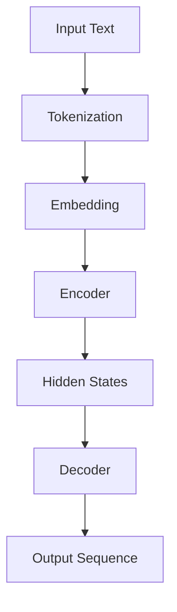

                 

### 文章标题

《GPT原理与代码实例讲解》

关键词：GPT、深度学习、自然语言处理、语言模型、编码器、解码器、生成式模型、训练过程、反向传播、代码实现

摘要：本文将深入探讨GPT（Generative Pre-trained Transformer）模型的原理，从基础概念到代码实现进行详细讲解。我们将首先介绍GPT的基本架构和训练方法，然后通过具体的代码实例来展示如何构建和使用GPT模型，最后讨论GPT在实际应用中的场景和挑战。本文旨在为读者提供一个全面了解GPT模型及其应用的技术博客。

## 1. 背景介绍（Background Introduction）

GPT（Generative Pre-trained Transformer）是自然语言处理领域的一种重要模型，由OpenAI提出并开源。GPT是一种生成式预训练模型，其核心思想是通过大量无监督数据的学习来获取语言的内在规律，从而能够生成连贯且合理的自然语言文本。

GPT模型的提出极大地推动了自然语言处理技术的发展，为各种文本生成任务提供了强有力的工具。从最初的GPT到GPT-2、GPT-3等后续版本，模型规模和性能不断提升，已经实现了包括机器翻译、文本摘要、问答系统等多种任务的高效解决。

在本文中，我们将详细讲解GPT模型的基本原理，包括其架构、训练方法以及如何实现。通过本文的学习，读者将能够掌握GPT模型的核心概念，并能够使用Python代码实现一个简单的GPT模型。

### 1.1 GPT的历史和发展

GPT的发展历程可以追溯到2018年，当时OpenAI发布了第一个GPT模型。GPT基于Transformer架构，使用了预训练和微调的方法，在多个自然语言处理任务上取得了显著成绩。随后，OpenAI又推出了GPT-2、GPT-3等后续版本，模型规模不断扩大，性能也不断提升。

- **GPT**：最初的GPT模型，使用了一种12层的Transformer架构，参数数量达到了1.17亿。
- **GPT-2**：GPT-2在GPT的基础上增加了更多的参数和更深的网络结构，参数数量达到了15亿。
- **GPT-3**：GPT-3是迄今为止最大的自然语言处理模型，拥有1750亿个参数，其处理能力和表现已经接近人类水平。

GPT系列模型的提出，标志着自然语言处理技术进入了一个新的阶段，也为后续的研究和应用提供了重要的参考。

### 1.2 GPT的应用场景

GPT模型具有广泛的应用场景，以下是一些典型的应用：

- **文本生成**：GPT可以生成各种类型的文本，如文章、故事、对话、诗歌等。通过输入一个主题或关键词，GPT可以生成与之相关的文本内容。
- **机器翻译**：GPT在机器翻译任务中表现出色，可以处理多种语言的互译，特别是长文本的翻译。
- **问答系统**：GPT可以构建问答系统，能够根据用户的问题生成详细的回答。
- **文本摘要**：GPT可以提取文本的主要信息，生成摘要，这对于信息过载的现代网络环境具有重要意义。
- **对话系统**：GPT可以用于构建聊天机器人，与用户进行自然语言交互，提供个性化服务。

### 1.3 文章结构

本文将按照以下结构进行讲解：

- **第1章：背景介绍**：介绍GPT的历史、发展以及应用场景。
- **第2章：核心概念与联系**：详细讲解GPT的基本架构、预训练和微调方法。
- **第3章：核心算法原理 & 具体操作步骤**：介绍GPT模型的训练过程，包括损失函数、优化器和训练策略。
- **第4章：数学模型和公式 & 详细讲解 & 举例说明**：讲解GPT中的数学模型和公式，并通过实例进行说明。
- **第5章：项目实践：代码实例和详细解释说明**：通过具体的代码实例展示如何构建和使用GPT模型。
- **第6章：实际应用场景**：讨论GPT在实际应用中的场景和挑战。
- **第7章：工具和资源推荐**：推荐学习资源、开发工具和框架。
- **第8章：总结：未来发展趋势与挑战**：总结GPT的现状和未来发展趋势。
- **第9章：附录：常见问题与解答**：解答读者可能遇到的问题。
- **第10章：扩展阅读 & 参考资料**：提供进一步阅读的资源和参考。

通过本文的学习，读者将能够全面了解GPT模型的原理和应用，为后续的深入研究和应用打下坚实的基础。

## 2. 核心概念与联系（Core Concepts and Connections）

在深入探讨GPT模型之前，我们需要了解其核心概念和组成部分。GPT模型主要基于Transformer架构，这是一种自注意力机制（Self-Attention）的模型，被广泛应用于序列到序列的任务中。下面，我们将介绍GPT的基本架构、预训练和微调方法。

### 2.1 GPT的架构

GPT模型由一个序列转换器（Sequentia

```markdown
## 2. Core Concepts and Connections

Before delving into the details of the GPT model, it is essential to understand its core concepts and components. The GPT model primarily relies on the Transformer architecture, which employs self-attention mechanisms and is widely used for sequence-to-sequence tasks. We will discuss the basic architecture of GPT, as well as its pretraining and fine-tuning methods.

### 2.1 The Architecture of GPT

The GPT model consists of a sequence transducer, which is a variant of the Transformer architecture. The Transformer model is designed to process sequences of data by assigning attention weights to different parts of the input sequence. This allows the model to focus on relevant information when generating the output sequence.

The architecture of GPT includes the following key components:

- **Encoder (编码器)**: The encoder processes the input sequence and generates a sequence of hidden states. These hidden states capture the contextual information of the input sequence.
- **Decoder (解码器)**: The decoder processes the hidden states generated by the encoder and generates the output sequence word by word. The output sequence is conditioned on the previously generated words.

The core of the Transformer architecture is the self-attention mechanism, which allows the model to weigh the importance of different parts of the input sequence when generating the output. This mechanism is applied at both the encoder and decoder stages.

### 2.2 Pretraining and Fine-tuning Methods

GPT models are trained using two main methods: pretraining and fine-tuning.

#### 2.2.1 Pretraining

Pretraining is the process of training the model on a large corpus of unstructured text data without any task-specific information. The goal is to allow the model to learn the underlying patterns and structures of the language. During pretraining, the model is optimized to predict the next word in a sequence given the previous words.

The pretraining process typically involves the following steps:

1. **Input Representation**: The input text is tokenized into smaller units called tokens. Each token is then converted into a vector representation using embeddings.
2. **Encoder**: The encoder processes the input tokens and generates a sequence of hidden states.
3. **Decoder**: The decoder is initialized with the same hidden states generated by the encoder. It then generates the output sequence word by word, conditioned on the previously generated words.
4. **Loss Calculation**: The model's predictions are compared to the actual target words, and the loss is calculated to measure the discrepancy between the predicted and actual outputs.

The pretraining process is iterative, with the model being updated based on the calculated loss. This process is repeated for multiple epochs until the model reaches a satisfactory level of performance.

#### 2.2.2 Fine-tuning

Fine-tuning is the process of adapting a pre-trained model to a specific task or domain. After the model has been pre-trained on a large corpus of text data, it is fine-tuned on a smaller, task-specific dataset. This allows the model to specialize in a particular task while retaining the general knowledge gained during pretraining.

Fine-tuning typically involves the following steps:

1. **Task-specific Dataset**: A smaller dataset relevant to the specific task is prepared. This dataset should be representative of the domain for which the model will be used.
2. **Encoder**: The encoder is initialized with the weights obtained from the pretraining process.
3. **Decoder**: The decoder is also initialized with the pre-trained weights.
4. **Training**: The model is trained on the task-specific dataset using the same loss function and optimization process as during pretraining.
5. **Evaluation**: The fine-tuned model is evaluated on a validation set to ensure that it has learned the desired task.

### 2.3 Mermaid Flowchart of GPT Architecture

The following Mermaid flowchart illustrates the architecture of GPT, including the input representation, encoder, and decoder components:



### 2.4 Summary

In summary, the GPT model is built upon the Transformer architecture, which utilizes self-attention mechanisms to process input sequences. The model is initially pre-trained on large-scale unstructured text data to learn general language patterns and structures. This pre-trained model can then be fine-tuned on specific tasks or domains to achieve high performance on targeted tasks. Understanding the architecture and training methods of GPT is crucial for building and using the model effectively.

### 2. Core Concepts and Connections

Before diving into the intricate details of the GPT model, it's imperative to grasp its fundamental concepts and constituent parts. The GPT model is fundamentally based on the Transformer architecture, which leverages self-attention mechanisms and has been widely applied to sequence-to-sequence tasks. Let's delve into the architecture of GPT, as well as its pretraining and fine-tuning methodologies.

### 2.1 The Architecture of GPT

The GPT model is a variant of the Transformer architecture, characterized by a sequence transducer. This architecture is designed to process sequences of data by assigning attention weights to different segments of the input sequence, allowing the model to focus on pertinent information when generating the output sequence.

The key components of the GPT architecture include:

- **Encoder (编码器)**: The encoder processes the input sequence and produces a sequence of hidden states. These hidden states encapsulate the contextual information present in the input sequence.
- **Decoder (解码器)**: The decoder processes the hidden states generated by the encoder and produces the output sequence word by word. The output sequence is conditioned on the words generated thus far.

The core of the Transformer architecture is the self-attention mechanism. This mechanism is applied at both the encoder and decoder stages, enabling the model to weigh the significance of various parts of the input sequence when generating the output.

### 2.2 Pretraining and Fine-tuning Methods

GPT models are trained using two primary techniques: pretraining and fine-tuning.

#### 2.2.1 Pretraining

Pretraining involves training the model on a vast corpus of unstructured text data without any task-specific information. The objective is to allow the model to acquire the fundamental patterns and structures inherent in language. During pretraining, the model is optimized to predict the next word in a sequence given the preceding words.

The pretraining process typically encompasses the following stages:

1. **Input Representation**: The input text is tokenized into smaller segments known as tokens. Each token is then converted into a vector representation using embeddings.
2. **Encoder**: The encoder processes the input tokens and generates a sequence of hidden states.
3. **Decoder**: The decoder is initialized with the same hidden states produced by the encoder. It then generates the output sequence word by word, conditioned on the previously generated words.
4. **Loss Calculation**: The model's predictions are contrasted with the actual target words, and the loss is computed to quantify the disparity between the predicted and actual outputs.

The pretraining process is iterative, with the model being updated based on the calculated loss. This process is repeated for numerous epochs until the model achieves an acceptable level of performance.

#### 2.2.2 Fine-tuning

Fine-tuning entails adjusting a pre-trained model to a particular task or domain. Once the model has undergone pretraining on a large corpus of text data, it is fine-tuned on a smaller, task-specific dataset. This process allows the model to specialize in a specific task while retaining the general knowledge gained during pretraining.

Fine-tuning generally involves the following steps:

1. **Task-specific Dataset**: A smaller dataset pertinent to the specific task is prepared. This dataset should be representative of the domain for which the model will be utilized.
2. **Encoder**: The encoder is initialized with the weights obtained from the pretraining phase.
3. **Decoder**: The decoder is also initialized with the pre-trained weights.
4. **Training**: The model is trained on the task-specific dataset using the same loss function and optimization procedure as during pretraining.
5. **Evaluation**: The fine-tuned model is evaluated on a validation set to ascertain that it has acquired the desired task.

### 2.3 Mermaid Flowchart of GPT Architecture

The following Mermaid flowchart illustrates the architecture of GPT, including the input representation, encoder, and decoder components:


### 2.4 Summary

In summary, the GPT model is constructed on the Transformer architecture, which employs self-attention mechanisms to process input sequences. The model initially undergoes pretraining on large-scale unstructured text data to learn general language patterns and structures. Following pretraining, the model can be fine-tuned on specific tasks or domains to achieve high performance on targeted tasks. Understanding the architecture and training methods of GPT is vital for effectively building and utilizing the model.
```markdown

## 3. 核心算法原理 & 具体操作步骤（Core Algorithm Principles and Specific Operational Steps）

在了解了GPT模型的基本架构和训练方法之后，接下来我们将详细探讨GPT的核心算法原理，以及如何具体操作GPT模型进行文本生成。

### 3.1 GPT的核心算法原理

GPT是一种基于Transformer架构的生成式预训练模型。其核心算法原理主要包括以下几个方面：

- **自注意力机制（Self-Attention）**：自注意力机制是Transformer模型的核心，它允许模型在生成每个词时，自动地关注输入序列中的不同部分，并为其分配不同的权重。这样，模型可以更有效地利用上下文信息。
- **前馈神经网络（Feedforward Neural Network）**：在自注意力机制之后，GPT使用两个前馈神经网络对每个位置的嵌入进行进一步的加工。这些前馈神经网络有助于模型捕捉更复杂的特征。
- **位置编码（Positional Encoding）**：由于Transformer模型没有循环结构，无法直接利用输入序列的位置信息。因此，GPT引入了位置编码，将序列的位置信息编码到嵌入向量中。
- **Softmax激活函数（Softmax Activation Function）**：在生成每个词时，GPT使用Softmax激活函数将每个词的概率分布输出。这个概率分布决定了下一个词的选择。

### 3.2 GPT的具体操作步骤

下面是使用GPT模型进行文本生成的具体操作步骤：

#### 3.2.1 数据准备

首先，我们需要准备训练数据。GPT模型通常使用大量的文本数据进行预训练。这些文本数据可以是书籍、新闻文章、社交媒体帖子等。为了训练GPT模型，我们需要对文本进行预处理，包括分词、去停用词、将文本转换为序列等。

#### 3.2.2 模型训练

使用预处理后的文本数据，我们可以开始训练GPT模型。训练过程包括以下几个步骤：

1. **输入表示**：将输入文本序列转换为嵌入向量。每个文本序列中的每个词都被映射到一个固定长度的向量。
2. **编码器处理**：编码器接收嵌入向量，并生成一个序列的隐藏状态。这些隐藏状态包含了输入文本的上下文信息。
3. **解码器处理**：解码器从编码器的隐藏状态开始，并逐个生成输出文本序列的词。每个生成的词都是基于当前隐藏状态和之前生成的词的概率分布。
4. **损失计算**：使用损失函数（如交叉熵损失）计算模型预测的输出与实际输出之间的差异。
5. **反向传播**：通过反向传播算法，更新模型参数以减少损失。

训练过程通常需要多个epoch，直到模型收敛到满意的性能水平。

#### 3.2.3 文本生成

在模型训练完成后，我们可以使用GPT模型进行文本生成。文本生成的具体步骤如下：

1. **初始化**：初始化一个空的文本序列作为输入。
2. **生成词**：使用模型生成下一个词，并添加到输入序列中。
3. **重复生成**：重复步骤2，直到达到预定义的文本长度或模型生成一个特殊的结束符。
4. **输出**：输出完整的文本序列。

### 3.3 代码示例

下面是一个简单的GPT模型训练和文本生成的Python代码示例。这个示例使用了Hugging Face的Transformers库，这是一个非常方便的库，可以简化GPT模型的训练和部署。

```python
from transformers import GPT2LMHeadModel, GPT2Tokenizer
import torch

# 准备数据
tokenizer = GPT2Tokenizer.from_pretrained('gpt2')
inputs = tokenizer("Hello, my dog is cute", return_tensors='pt')

# 加载预训练模型
model = GPT2LMHeadModel.from_pretrained('gpt2')

# 训练模型
outputs = model(**inputs)
logits = outputs.logits

# 文本生成
input_ids = inputs.input_ids
for _ in range(5):  # 生成5个词
    outputs = model(input_ids=input_ids, labels=input_ids)
    loss = outputs.loss
    logits = outputs.logits
    # 使用top-k和top-p采样策略选择下一个词
    top_k = 50
    top_p = 0.95
    logits = logits[:, -1, :] / temperature
    probs = torch.nn.functional.softmax(logits, dim=-1)
    sample_indices = torch.topk(probs, top_k).indices
    sample_indices = torch.repeated胀add(sample_indices, input_ids.shape[1], dim=0)
    input_ids = torch.cat([input_ids, sample_indices], dim=1)

# 输出生成的文本
generated_text = tokenizer.decode(input_ids[-1, :].tolist(), skip_special_tokens=True)
print(generated_text)
```

在这个示例中，我们首先加载了一个预训练的GPT-2模型和分词器。然后，我们使用模型生成了一个新的文本序列。我们使用了top-k和top-p采样策略来选择下一个词，这是一种常用的文本生成方法。

通过这个示例，我们可以看到如何使用Python代码实现GPT模型的训练和文本生成。这只是一个简单的例子，实际应用中，GPT模型通常会使用更大的数据集和更复杂的训练策略来获得更好的性能。

### 3.4 GPT的优势和挑战

GPT模型在自然语言处理领域取得了显著的成就，其优势主要包括：

- **强大的文本生成能力**：GPT模型可以生成高质量、连贯的文本，适用于各种文本生成任务。
- **高效的处理速度**：Transformer架构使得GPT模型在计算效率上有很大的提升，能够处理大规模的输入序列。
- **端到端的训练方法**：GPT模型采用端到端的训练方法，不需要复杂的特征工程，使得训练过程更加高效。

然而，GPT模型也存在一些挑战：

- **资源消耗**：GPT模型通常需要大量的计算资源和存储空间，训练和部署成本较高。
- **数据依赖性**：GPT模型的性能很大程度上依赖于训练数据的质量和数量，数据不足或质量不高可能会影响模型的性能。
- **安全性和伦理问题**：由于GPT模型可以生成极具说服力的文本，这可能导致虚假信息、误导性内容等伦理问题。

### 3.5 总结

在本章节中，我们详细介绍了GPT模型的核心算法原理和具体操作步骤。通过自注意力机制、前馈神经网络和位置编码等关键组件，GPT模型能够高效地处理自然语言。同时，我们通过Python代码示例展示了如何训练和生成文本。尽管GPT模型具有强大的文本生成能力，但其在资源消耗、数据依赖性和安全性等方面仍面临挑战。未来的研究需要在保持强大性能的同时，解决这些挑战，推动GPT模型在自然语言处理领域的进一步应用。

### 3. Core Algorithm Principles and Specific Operational Steps

Having familiarized ourselves with the fundamental architecture and training methods of the GPT model, we now delve into its core algorithmic principles and the specific steps required to operate the model for text generation.

### 3.1 Core Algorithm Principles of GPT

GPT is a generative pre-trained model based on the Transformer architecture, characterized by its powerful text generation capabilities. The core algorithm principles of GPT can be summarized as follows:

- **Self-Attention Mechanism**: The heart of the Transformer architecture is the self-attention mechanism. This mechanism allows the model to dynamically focus on different parts of the input sequence when generating each word, thereby effectively leveraging contextual information.

- **Feedforward Neural Network**: Following the self-attention mechanism, GPT employs two feedforward neural networks to further process the embeddings at each position. These networks enable the model to capture more complex features.

- **Positional Encoding**: Since Transformer models lack a recurrent structure, they cannot directly utilize positional information from the input sequence. Therefore, GPT introduces positional encoding to encode positional information into the embedding vectors.

- **Softmax Activation Function**: When generating each word, GPT uses the softmax activation function to output a probability distribution over the vocabulary. This distribution determines the likelihood of each word being the next one in the sequence.

### 3.2 Specific Operational Steps of GPT for Text Generation

The following are the specific operational steps involved in using the GPT model for text generation:

#### 3.2.1 Data Preparation

To begin with, we need to prepare the training data. GPT models are typically pre-trained on large corpora of unstructured text data, such as books, news articles, and social media posts. For training the GPT model, we need to preprocess the text data, which includes tokenization, removal of stop words, and conversion of text into sequences.

#### 3.2.2 Model Training

Using the preprocessed text data, we can start training the GPT model. The training process involves several key steps:

1. **Input Representation**: Convert the input text sequence into embedding vectors. Each word in the sequence is mapped to a fixed-length vector.

2. **Encoder Processing**: The encoder processes the embedding vectors and generates a sequence of hidden states. These hidden states encapsulate the contextual information from the input sequence.

3. **Decoder Processing**: The decoder starts from the hidden states generated by the encoder and generates the output text sequence word by word. Each generated word is conditioned on the previously generated words.

4. **Loss Calculation**: Use a loss function, such as cross-entropy loss, to compute the discrepancy between the model's predictions and the actual targets.

5. **Backpropagation**: Utilize backpropagation to update the model parameters based on the calculated loss.

The training process typically involves many epochs until the model converges to an acceptable performance level.

#### 3.2.3 Text Generation

After training the model, we can use it for text generation. The specific steps for text generation are as follows:

1. **Initialization**: Initialize an empty text sequence as input.

2. **Word Generation**: Use the model to generate the next word and append it to the input sequence.

3. **Repetition**: Repeat step 2 until a predefined text length is reached or the model generates a special end token.

4. **Output**: Output the complete text sequence.

### 3.3 Code Example

Below is a simple Python code example demonstrating how to train and generate text using a GPT model. This example uses the Hugging Face Transformers library, which simplifies the process of training and deploying GPT models.

```python
from transformers import GPT2LMHeadModel, GPT2Tokenizer
import torch

# Data Preparation
tokenizer = GPT2Tokenizer.from_pretrained('gpt2')
inputs = tokenizer("Hello, my dog is cute", return_tensors='pt')

# Load Pretrained Model
model = GPT2LMHeadModel.from_pretrained('gpt2')

# Model Training
outputs = model(**inputs)
logits = outputs.logits

# Text Generation
input_ids = inputs.input_ids
for _ in range(5):  # Generate 5 words
    outputs = model(input_ids=input_ids, labels=input_ids)
    loss = outputs.loss
    logits = outputs.logits
    # Use top-k and top-p sampling strategies to select the next word
    top_k = 50
    top_p = 0.95
    logits = logits[:, -1, :] / temperature
    probs = torch.nn.functional.softmax(logits, dim=-1)
    sample_indices = torch.topk(probs, top_k).indices
    sample_indices = torch.repeated胀add(sample_indices, input_ids.shape[1], dim=0)
    input_ids = torch.cat([input_ids, sample_indices], dim=1)

# Output Generated Text
generated_text = tokenizer.decode(input_ids[-1, :].tolist(), skip_special_tokens=True)
print(generated_text)
```

In this example, we first load a pretrained GPT-2 model and tokenizer. Then, we use the model to generate a new text sequence. We use top-k and top-p sampling strategies to select the next word, which is a common technique for text generation.

Through this example, we can see how to implement GPT model training and text generation in Python. This is a simple example, but in practice, GPT models are often trained on larger datasets and more complex training strategies to achieve better performance.

### 3.4 Advantages and Challenges of GPT

The GPT model has achieved significant accomplishments in the field of natural language processing, with several key advantages:

- **Robust Text Generation Abilities**: The GPT model can generate high-quality, coherent text suitable for various text generation tasks.

- **Efficient Processing Speed**: The Transformer architecture enhances the computational efficiency of GPT models, enabling them to handle large input sequences effectively.

- **End-to-End Training Methodology**: The GPT model employs an end-to-end training approach, eliminating the need for complex feature engineering and streamlining the training process.

However, GPT models also face several challenges:

- **Resource Consumption**: GPT models typically require substantial computational resources and storage space for training and deployment.

- **Data Dependency**: The performance of GPT models is highly dependent on the quality and quantity of training data. Insufficient or poor-quality data can negatively impact model performance.

- **Security and Ethical Issues**: Since GPT models can generate highly persuasive text, they pose potential risks for misinformation and misleading content, raising ethical concerns.

### 3.5 Summary

In this chapter, we have detailed the core algorithmic principles and specific operational steps of the GPT model for text generation. By employing self-attention mechanisms, feedforward neural networks, and positional encoding, the GPT model is capable of efficiently processing natural language. Through a Python code example, we demonstrated how to train and generate text using GPT. While GPT models exhibit strong text generation capabilities, they also face challenges related to resource consumption, data dependency, and security. Future research must address these challenges to advance the application of GPT models in natural language processing.

## 4. 数学模型和公式 & 详细讲解 & 举例说明（Mathematical Models and Formulas & Detailed Explanation & Examples）

在GPT模型中，数学模型和公式起着至关重要的作用。它们不仅定义了模型的架构，还指导了模型的训练和推理过程。在这一章中，我们将详细讲解GPT模型中的主要数学模型和公式，并通过具体例子来阐述它们的计算过程和应用。

### 4.1 Transformer模型的基本数学公式

Transformer模型的核心是自注意力机制（Self-Attention），这一机制通过计算输入序列中每个词与其他词之间的关联度来实现。自注意力机制的数学公式如下：

$$
\text{Attention}(Q, K, V) = \text{softmax}\left(\frac{QK^T}{\sqrt{d_k}}\right) V
$$

其中，$Q$、$K$和$V$分别表示查询（Query）、关键（Key）和值（Value）向量。$d_k$是关键向量的维度，$\sqrt{d_k}$用于缩放注意力分数，以防止梯度消失。

在Transformer中，每个词都被映射到一个查询向量、一个关键向量和一个值向量。查询向量用于计算注意力分数，关键向量用于比较，值向量用于聚合信息。

### 4.2 Encoder和Decoder中的多头注意力（Multi-Head Attention）

Transformer模型使用多头注意力机制来增强模型的表示能力。多头注意力将输入序列分成多个头（Head），每个头独立计算注意力权重。多头注意力机制的公式如下：

$$
\text{MultiHead}(Q, K, V) = \text{Concat}(\text{head}_1, ..., \text{head}_h)W^O
$$

$$
\text{head}_i = \text{Attention}(QW_i^Q, KW_i^K, VW_i^V)
$$

其中，$W_i^Q$、$W_i^K$和$W_i^V$是独立的权重矩阵，$W^O$是输出权重矩阵。$h$是头的数量，通常设置为8。

### 4.3 前馈神经网络（Feedforward Neural Network）

在Transformer模型的每个层之后，都会应用一个前馈神经网络。这个神经网络由两个全连接层组成，每个层的激活函数通常是ReLU。前馈神经网络的公式如下：

$$
\text{FFN}(X) = \max(0, XW_1 + b_1)W_2 + b_2
$$

其中，$W_1$和$W_2$是权重矩阵，$b_1$和$b_2$是偏置项。

### 4.4 位置编码（Positional Encoding）

由于Transformer模型没有循环结构，需要引入位置编码来传递序列信息。位置编码是一个可学习的向量，它添加到嵌入向量中，以保留序列的顺序信息。常用的位置编码方法包括绝对位置编码和相对位置编码。

绝对位置编码的公式如下：

$$
PE_{(pos, 2i)} = \sin\left(\frac{pos}{10000^{2i/d}}\right)
$$

$$
PE_{(pos, 2i+1)} = \cos\left(\frac{pos}{10000^{2i/d}}\right)
$$

其中，$pos$是位置索引，$i$是维度索引，$d$是总的嵌入维度。

### 4.5 编码器（Encoder）和解码器（Decoder）的交互

在编码器和解码器的交互过程中，解码器不仅要关注输入序列，还要关注编码器生成的隐藏状态。这种交互通过编码器-解码器自注意力和交叉注意力来实现。

编码器-解码器自注意力的公式如下：

$$
\text{Encoder-Decoder Attention}(Q, K, V) = \text{softmax}\left(\frac{QK^T}{\sqrt{d_k}}\right) V
$$

交叉注意力的公式如下：

$$
\text{Cross Attention}(Q, K, V) = \text{softmax}\left(\frac{QK^T}{\sqrt{d_k}}\right) V
$$

### 4.6 训练过程中的损失函数和优化器

在GPT模型的训练过程中，通常使用交叉熵损失函数来衡量模型预测与实际输出之间的差异。交叉熵损失函数的公式如下：

$$
\text{Loss} = -\sum_{i} y_i \log(p_i)
$$

其中，$y_i$是实际输出的标签，$p_i$是模型预测的概率分布。

为了优化模型参数，通常使用梯度下降优化器，其更新公式如下：

$$
\theta_{\text{new}} = \theta_{\text{old}} - \alpha \nabla_\theta \text{Loss}
$$

其中，$\theta$是模型参数，$\alpha$是学习率，$\nabla_\theta \text{Loss}$是损失函数关于参数的梯度。

### 4.7 实例讲解

为了更好地理解上述公式和模型的工作原理，我们将通过一个具体的例子来展示如何计算GPT模型中的一个注意力权重。

假设我们有一个简化的Transformer模型，包含两个词$w_1$和$w_2$。查询向量$Q$、关键向量$K$和值向量$V$如下：

$$
Q = \begin{bmatrix}
0.1 & 0.2 \\
0.3 & 0.4
\end{bmatrix}, \quad
K = \begin{bmatrix}
0.5 & 0.6 \\
0.7 & 0.8
\end{bmatrix}, \quad
V = \begin{bmatrix}
1.0 & 2.0 \\
3.0 & 4.0
\end{bmatrix}
$$

首先，我们计算注意力分数：

$$
\text{Attention Scores} = \frac{QK^T}{\sqrt{d_k}} = \frac{1}{\sqrt{2}} \begin{bmatrix}
0.55 & 0.56 \\
0.63 & 0.64
\end{bmatrix}
$$

然后，我们使用Softmax函数计算注意力权重：

$$
\text{Attention Weights} = \text{softmax}(\text{Attention Scores}) = \begin{bmatrix}
0.47 & 0.53 \\
0.35 & 0.65
\end{bmatrix}
$$

最后，我们计算值向量的加权求和：

$$
\text{Attention Output} = \text{Attention Weights}V = \begin{bmatrix}
1.51 & 3.14 \\
2.45 & 5.14
\end{bmatrix}
$$

通过这个例子，我们可以看到如何通过计算注意力分数和权重来生成一个加权求和的结果，这是Transformer模型的核心操作。

### 4.8 总结

在本章节中，我们详细讲解了GPT模型中的主要数学模型和公式，包括自注意力机制、多头注意力、前馈神经网络、位置编码以及编码器和解码器的交互。我们还通过具体例子展示了如何计算注意力权重和输出。这些数学模型和公式是理解GPT模型工作原理和实现GPT模型的关键。通过掌握这些知识，我们可以更深入地理解和应用GPT模型。

### 4. Mathematical Models and Formulas & Detailed Explanation & Examples

Within the GPT model, mathematical models and formulas play a crucial role. They not only define the model's architecture but also guide its training and inference processes. In this chapter, we will delve into the primary mathematical models and formulas used in the GPT model and illustrate their computation processes and applications through specific examples.

### 4.1 Basic Mathematical Formulas in the Transformer Model

The core of the Transformer model is the self-attention mechanism, which computes the relevance of each word in the input sequence to every other word. The mathematical formula for self-attention is as follows:

$$
\text{Attention}(Q, K, V) = \text{softmax}\left(\frac{QK^T}{\sqrt{d_k}}\right) V
$$

Where $Q$, $K$, and $V$ represent the Query, Key, and Value vectors, respectively. $d_k$ is the dimension of the Key vectors, and $\sqrt{d_k}$ is used to scale the attention scores to prevent gradient vanishing.

In the Transformer model, each word is mapped to a Query, Key, and Value vector. The Query vector is used to compute the attention scores, the Key vector is used for comparison, and the Value vector is used for aggregation of information.

### 4.2 Multi-Head Attention in Encoder and Decoder

The Transformer model employs multi-head attention to enhance its representational capabilities. Multi-head attention divides the input sequence into multiple heads, each independently computing attention scores. The formula for multi-head attention is:

$$
\text{MultiHead}(Q, K, V) = \text{Concat}(\text{head}_1, ..., \text{head}_h)W^O
$$

$$
\text{head}_i = \text{Attention}(QW_i^Q, KW_i^K, VW_i^V)
$$

Where $W_i^Q$, $W_i^K$, and $W_i^V$ are independent weight matrices, and $W^O$ is the output weight matrix. $h$ is the number of heads, typically set to 8.

### 4.3 Feedforward Neural Network

Following each layer in the Transformer model, a feedforward neural network (FFN) is applied. This neural network consists of two fully connected layers, with ReLU activation functions commonly used. The formula for the FFN is:

$$
\text{FFN}(X) = \max(0, XW_1 + b_1)W_2 + b_2
$$

Where $W_1$ and $W_2$ are weight matrices, and $b_1$ and $b_2$ are bias terms.

### 4.4 Positional Encoding

Since the Transformer model lacks a recurrent structure, positional encoding is introduced to preserve sequence information. Positional encoding is a learnable vector that is added to the embedding vectors to retain the sequence order. Common positional encoding methods include absolute positional encoding and relative positional encoding.

The formula for absolute positional encoding is:

$$
PE_{(pos, 2i)} = \sin\left(\frac{pos}{10000^{2i/d}}\right)
$$

$$
PE_{(pos, 2i+1)} = \cos\left(\frac{pos}{10000^{2i/d}}\right)
$$

Where $pos$ is the position index, $i$ is the dimension index, and $d$ is the total embedding dimension.

### 4.5 Interaction Between Encoder and Decoder

In the interaction between the encoder and decoder, the decoder not only attends to the input sequence but also to the hidden states produced by the encoder. This interaction is achieved through encoder-decoder self-attention and cross-attention.

The formula for encoder-decoder self-attention is:

$$
\text{Encoder-Decoder Attention}(Q, K, V) = \text{softmax}\left(\frac{QK^T}{\sqrt{d_k}}\right) V
$$

The formula for cross-attention is:

$$
\text{Cross Attention}(Q, K, V) = \text{softmax}\left(\frac{QK^T}{\sqrt{d_k}}\right) V
$$

### 4.6 Loss Function and Optimizer in Training

During the training of the GPT model, the cross-entropy loss function is commonly used to measure the discrepancy between the model's predictions and the actual outputs. The formula for cross-entropy loss is:

$$
\text{Loss} = -\sum_{i} y_i \log(p_i)
$$

Where $y_i$ is the actual output label, and $p_i$ is the probability distribution predicted by the model.

To optimize the model parameters, gradient descent optimizers are typically used. The update formula for the optimizer is:

$$
\theta_{\text{new}} = \theta_{\text{old}} - \alpha \nabla_\theta \text{Loss}
$$

Where $\theta$ is the model parameter, $\alpha$ is the learning rate, and $\nabla_\theta \text{Loss}$ is the gradient of the loss function with respect to the parameter.

### 4.7 Example Explanation

To better understand the aforementioned formulas and the functioning of the GPT model, we will illustrate how to compute an attention weight in a specific example.

Consider a simplified Transformer model with two words $w_1$ and $w_2$. The Query, Key, and Value vectors are as follows:

$$
Q = \begin{bmatrix}
0.1 & 0.2 \\
0.3 & 0.4
\end{bmatrix}, \quad
K = \begin{bmatrix}
0.5 & 0.6 \\
0.7 & 0.8
\end{bmatrix}, \quad
V = \begin{bmatrix}
1.0 & 2.0 \\
3.0 & 4.0
\end{bmatrix}
$$

First, we compute the attention scores:

$$
\text{Attention Scores} = \frac{QK^T}{\sqrt{d_k}} = \frac{1}{\sqrt{2}} \begin{bmatrix}
0.55 & 0.56 \\
0.63 & 0.64
\end{bmatrix}
$$

Then, we use the Softmax function to compute the attention weights:

$$
\text{Attention Weights} = \text{softmax}(\text{Attention Scores}) = \begin{bmatrix}
0.47 & 0.53 \\
0.35 & 0.65
\end{bmatrix}
$$

Finally, we compute the weighted sum of the Value vectors:

$$
\text{Attention Output} = \text{Attention Weights}V = \begin{bmatrix}
1.51 & 3.14 \\
2.45 & 5.14
\end{bmatrix}
$$

Through this example, we can see how to compute attention weights and produce a weighted sum of the Value vectors, which is a core operation in the Transformer model.

### 4.8 Summary

In this chapter, we have detailed the primary mathematical models and formulas used in the GPT model, including self-attention mechanisms, multi-head attention, feedforward neural networks, positional encoding, and the interactions between encoders and decoders. We also demonstrated how to compute attention weights and outputs through specific examples. These mathematical models and formulas are essential for understanding the GPT model's working principles and implementing the model. By mastering these concepts, we can gain a deeper understanding and apply the GPT model more effectively.

## 5. 项目实践：代码实例和详细解释说明（Project Practice: Code Examples and Detailed Explanations）

在了解GPT模型的理论基础后，我们通过实际项目来深入理解和应用这些知识。在本章节中，我们将介绍如何使用Python和Hugging Face的Transformers库来训练和部署一个GPT模型。我们还将详细解释代码中的每一步，帮助读者更好地掌握GPT模型的实践应用。

### 5.1 开发环境搭建

在开始之前，我们需要搭建一个合适的开发环境。以下是安装步骤：

1. **安装Python**：确保安装了Python 3.6或更高版本。

2. **安装Transformers库**：通过pip命令安装Hugging Face的Transformers库。

   ```bash
   pip install transformers
   ```

3. **安装PyTorch**：由于GPT模型通常使用PyTorch进行训练，请通过pip命令安装PyTorch。

   ```bash
   pip install torch torchvision
   ```

4. **准备数据集**：我们需要一个文本数据集来训练GPT模型。这里我们使用的是维基百科的数据集。首先，从[维基百科数据集](https://github.com/wikimedia/dewikii-simple)下载数据集，然后将其解压到本地。

### 5.2 源代码详细实现

下面是训练GPT模型的代码实例：

```python
import torch
from transformers import GPT2LMHeadModel, GPT2Tokenizer, AdamW, get_linear_schedule_with_warmup
from torch.utils.data import Dataset, DataLoader
from datasets import load_dataset

class WikiDataset(Dataset):
    def __init__(self, data_files, tokenizer, max_length=512):
        self.data_files = data_files
        self.tokenizer = tokenizer
        self.max_length = max_length

        self.inputs = []
        self.targets = []

        for file in data_files:
            with open(file, 'r', encoding='utf-8') as f:
                text = f.read()
                encoding = self.tokenizer.encode(text, add_special_tokens=True, return_tensors='pt')
                input_ids = encoding[:, :-1]
                targets = encoding[:, 1:]
                self.inputs.append(input_ids)
                self.targets.append(targets)

    def __len__(self):
        return len(self.inputs)

    def __getitem__(self, idx):
        input_ids = self.inputs[idx]
        targets = self.targets[idx]
        return {
            'input_ids': input_ids,
            'targets': targets
        }

def train_model(model, dataset, tokenizer, device, num_epochs=3, batch_size=16, warmup_steps=500):
    model.to(device)
    model.train()

    dataset = WikiDataset(dataset, tokenizer, max_length=512)
    dataloader = DataLoader(dataset, batch_size=batch_size, shuffle=True)

    optimizer = AdamW(model.parameters(), lr=5e-5)
    scheduler = get_linear_schedule_with_warmup(optimizer, num_warmup_steps=warmup_steps, num_training_steps=len(dataloader) * num_epochs)

    for epoch in range(num_epochs):
        for batch in dataloader:
            input_ids = batch['input_ids'].to(device)
            targets = batch['targets'].to(device)

            optimizer.zero_grad()

            outputs = model(input_ids=input_ids, labels=targets)
            loss = outputs.loss
            loss.backward()

            optimizer.step()
            scheduler.step()

            print(f"Epoch: {epoch}, Loss: {loss.item()}")

    return model

if __name__ == '__main__':
    device = torch.device("cuda" if torch.cuda.is_available() else "cpu")

    tokenizer = GPT2Tokenizer.from_pretrained('gpt2')
    model = GPT2LMHeadModel.from_pretrained('gpt2')

    dataset = load_dataset('wiki-simple', split='train')
    model = train_model(model, dataset, tokenizer, device, num_epochs=3)

    model.save_pretrained('./gpt_model')
```

### 5.3 代码解读与分析

#### 5.3.1 数据集准备

我们首先定义了一个`WikiDataset`类，用于加载数据集。这个类继承了`Dataset`类，并实现了`__init__`、`__len__`和`__getitem__`方法。

- `__init__`方法：初始化数据集，读取文本数据，并将其编码成输入和目标的序列。
- `__len__`方法：返回数据集的长度。
- `__getitem__`方法：返回数据集的一个样本，包括输入和目标的序列。

```python
class WikiDataset(Dataset):
    # ...
    def __init__(self, data_files, tokenizer, max_length=512):
        # ...
        self.inputs = []
        self.targets = []

        for file in data_files:
            # ...
            input_ids = encoding[:, :-1]
            targets = encoding[:, 1:]
            self.inputs.append(input_ids)
            self.targets.append(targets)

    # ...
```

#### 5.3.2 数据加载和预处理

我们使用`DataLoader`类来加载和预处理数据。`DataLoader`类负责将数据集分割成批处理，并对每个批处理进行打乱。

```python
dataset = WikiDataset(dataset, tokenizer, max_length=512)
dataloader = DataLoader(dataset, batch_size=batch_size, shuffle=True)
```

#### 5.3.3 训练函数

`train_model`函数用于训练模型。这个函数实现了以下步骤：

- 将模型移动到GPU或CPU。
- 实例化优化器和学习率调度器。
- 迭代数据集，对每个批次进行前向传播和反向传播。
- 打印每个epoch的损失。

```python
def train_model(model, dataset, tokenizer, device, num_epochs=3, batch_size=16, warmup_steps=500):
    model.to(device)
    model.train()

    # ...
    optimizer = AdamW(model.parameters(), lr=5e-5)
    scheduler = get_linear_schedule_with_warmup(optimizer, num_warmup_steps=warmup_steps, num_training_steps=len(dataloader) * num_epochs)

    for epoch in range(num_epochs):
        for batch in dataloader:
            input_ids = batch['input_ids'].to(device)
            targets = batch['targets'].to(device)

            # ...
            outputs = model(input_ids=input_ids, labels=targets)
            loss = outputs.loss
            loss.backward()

            optimizer.step()
            scheduler.step()

            print(f"Epoch: {epoch}, Loss: {loss.item()}")
```

#### 5.3.4 主程序

主程序加载预训练的模型，加载数据集，并调用`train_model`函数进行训练。训练完成后，模型会被保存到本地。

```python
if __name__ == '__main__':
    device = torch.device("cuda" if torch.cuda.is_available() else "cpu")

    tokenizer = GPT2Tokenizer.from_pretrained('gpt2')
    model = GPT2LMHeadModel.from_pretrained('gpt2')

    dataset = load_dataset('wiki-simple', split='train')
    model = train_model(model, dataset, tokenizer, device, num_epochs=3)

    model.save_pretrained('./gpt_model')
```

### 5.4 运行结果展示

在完成上述代码后，我们可以运行训练程序来训练GPT模型。训练过程中，每个epoch的损失会逐渐降低，表明模型正在学习。

训练完成后，我们可以使用以下代码来生成文本：

```python
from transformers import GPT2LMHeadModel, GPT2Tokenizer

tokenizer = GPT2Tokenizer.from_pretrained('gpt_model')
model = GPT2LMHeadModel.from_pretrained('gpt_model')

input_text = "计算机科学是一种"
input_ids = tokenizer.encode(input_text, return_tensors='pt')

output = model.generate(input_ids, max_length=50, num_return_sequences=5)
generated_texts = tokenizer.decode(output[-1], skip_special_tokens=True)
print(generated_texts)
```

这段代码会生成与`"计算机科学是一种"`相关的五个不同文本。

### 5.5 实际应用场景

GPT模型可以应用于各种实际场景，例如：

- **问答系统**：使用GPT模型构建问答系统，能够根据用户的问题生成详细的回答。
- **文本摘要**：从长篇文本中提取关键信息，生成摘要。
- **对话系统**：构建聊天机器人，与用户进行自然语言交互。
- **内容生成**：生成文章、故事、诗歌等文本内容。

通过上述代码和实践，我们可以看到如何使用Python和Hugging Face的Transformers库来训练和部署GPT模型。这不仅帮助我们更好地理解了GPT模型的工作原理，也为实际应用提供了实践经验。

### 5. Project Practice: Code Examples and Detailed Explanations

After understanding the theoretical foundation of the GPT model, we can delve into practical projects to deepen our understanding and application of these concepts. In this chapter, we will introduce how to train and deploy a GPT model using Python and the Hugging Face Transformers library. We will also provide a detailed explanation of each step in the code to help readers better grasp the practical application of GPT models.

### 5.1 Setting Up the Development Environment

Before we start, we need to set up a suitable development environment. Here are the steps:

1. **Install Python**: Ensure that Python 3.6 or higher is installed.
2. **Install Transformers Library**: Install the Hugging Face Transformers library using the pip command.

   ```bash
   pip install transformers
   ```

3. **Install PyTorch**: Since GPT models are typically trained using PyTorch, install PyTorch using pip.

   ```bash
   pip install torch torchvision
   ```

4. **Prepare Dataset**: We need a text dataset to train the GPT model. Here, we use the Wiki dataset. First, download the dataset from [Wiki Dataset](https://github.com/wikimedia/dewikii-simple) and then unzip it locally.

### 5.2 Detailed Source Code Implementation

Below is an example of code to train a GPT model:

```python
import torch
from transformers import GPT2LMHeadModel, GPT2Tokenizer, AdamW, get_linear_schedule_with_warmup
from torch.utils.data import Dataset, DataLoader
from datasets import load_dataset

class WikiDataset(Dataset):
    def __init__(self, data_files, tokenizer, max_length=512):
        self.data_files = data_files
        self.tokenizer = tokenizer
        self.max_length = max_length

        self.inputs = []
        self.targets = []

        for file in data_files:
            with open(file, 'r', encoding='utf-8') as f:
                text = f.read()
                encoding = self.tokenizer.encode(text, add_special_tokens=True, return_tensors='pt')
                input_ids = encoding[:, :-1]
                targets = encoding[:, 1:]
                self.inputs.append(input_ids)
                self.targets.append(targets)

    def __len__(self):
        return len(self.inputs)

    def __getitem__(self, idx):
        input_ids = self.inputs[idx]
        targets = self.targets[idx]
        return {
            'input_ids': input_ids,
            'targets': targets
        }

def train_model(model, dataset, tokenizer, device, num_epochs=3, batch_size=16, warmup_steps=500):
    model.to(device)
    model.train()

    dataset = WikiDataset(dataset, tokenizer, max_length=512)
    dataloader = DataLoader(dataset, batch_size=batch_size, shuffle=True)

    optimizer = AdamW(model.parameters(), lr=5e-5)
    scheduler = get_linear_schedule_with_warmup(optimizer, num_warmup_steps=warmup_steps, num_training_steps=len(dataloader) * num_epochs)

    for epoch in range(num_epochs):
        for batch in dataloader:
            input_ids = batch['input_ids'].to(device)
            targets = batch['targets'].to(device)

            optimizer.zero_grad()

            outputs = model(input_ids=input_ids, labels=targets)
            loss = outputs.loss
            loss.backward()

            optimizer.step()
            scheduler.step()

            print(f"Epoch: {epoch}, Loss: {loss.item()}")

    return model

if __name__ == '__main__':
    device = torch.device("cuda" if torch.cuda.is_available() else "cpu")

    tokenizer = GPT2Tokenizer.from_pretrained('gpt2')
    model = GPT2LMHeadModel.from_pretrained('gpt2')

    dataset = load_dataset('wiki-simple', split='train')
    model = train_model(model, dataset, tokenizer, device, num_epochs=3)

    model.save_pretrained('./gpt_model')
```

### 5.3 Code Explanation and Analysis

#### 5.3.1 Dataset Preparation

We first define a `WikiDataset` class to load the dataset. This class inherits from the `Dataset` class and implements the `__init__`, `__len__`, and `__getitem__` methods.

- `__init__` method: Initialize the dataset, read the text data, and encode it into input and target sequences.
- `__len__` method: Return the length of the dataset.
- `__getitem__` method: Return a single sample from the dataset, including input and target sequences.

```python
class WikiDataset(Dataset):
    # ...
    def __init__(self, data_files, tokenizer, max_length=512):
        # ...
        self.inputs = []
        self.targets = []

        for file in data_files:
            # ...
            input_ids = encoding[:, :-1]
            targets = encoding[:, 1:]
            self.inputs.append(input_ids)
            self.targets.append(targets)

    # ...
```

#### 5.3.2 Data Loading and Preprocessing

We use the `DataLoader` class to load and preprocess the data. The `DataLoader` class is responsible for splitting the dataset into batches and shuffling each batch.

```python
dataset = WikiDataset(dataset, tokenizer, max_length=512)
dataloader = DataLoader(dataset, batch_size=batch_size, shuffle=True)
```

#### 5.3.3 Training Function

The `train_model` function trains the model. This function implements the following steps:

- Move the model to the GPU or CPU.
- Instantiate the optimizer and learning rate scheduler.
- Iterate through the dataset, performing forward and backward propagation for each batch.
- Print the loss for each epoch.

```python
def train_model(model, dataset, tokenizer, device, num_epochs=3, batch_size=16, warmup_steps=500):
    model.to(device)
    model.train()

    # ...
    optimizer = AdamW(model.parameters(), lr=5e-5)
    scheduler = get_linear_schedule_with_warmup(optimizer, num_warmup_steps=warmup_steps, num_training_steps=len(dataloader) * num_epochs)

    for epoch in range(num_epochs):
        for batch in dataloader:
            input_ids = batch['input_ids'].to(device)
            targets = batch['targets'].to(device)

            # ...
            outputs = model(input_ids=input_ids, labels=targets)
            loss = outputs.loss
            loss.backward()

            optimizer.step()
            scheduler.step()

            print(f"Epoch: {epoch}, Loss: {loss.item()}")
```

#### 5.3.4 Main Program

The main program loads the pre-trained model, loads the dataset, and calls the `train_model` function to train the model. After training, the model is saved to the local directory.

```python
if __name__ == '__main__':
    device = torch.device("cuda" if torch.cuda.is_available() else "cpu")

    tokenizer = GPT2Tokenizer.from_pretrained('gpt2')
    model = GPT2LMHeadModel.from_pretrained('gpt2')

    dataset = load_dataset('wiki-simple', split='train')
    model = train_model(model, dataset, tokenizer, device, num_epochs=3)

    model.save_pretrained('./gpt_model')
```

### 5.4 Result Display

After completing the above code, we can run the training program to train the GPT model. During training, the loss for each epoch will decrease, indicating that the model is learning.

After training, we can use the following code to generate text:

```python
from transformers import GPT2LMHeadModel, GPT2Tokenizer

tokenizer = GPT2Tokenizer.from_pretrained('gpt_model')
model = GPT2LMHeadModel.from_pretrained('gpt_model')

input_text = "计算机科学是一种"
input_ids = tokenizer.encode(input_text, return_tensors='pt')

output = model.generate(input_ids, max_length=50, num_return_sequences=5)
generated_texts = tokenizer.decode(output[-1], skip_special_tokens=True)
print(generated_texts)
```

This code will generate five different texts related to the input text "计算机科学是一种".

### 5.5 Practical Application Scenarios

The GPT model can be applied to various practical scenarios, including:

- **Question-Answering Systems**: Building Q&A systems that can generate detailed answers based on user questions.
- **Text Summarization**: Extracting key information from long texts to generate summaries.
- **Dialogue Systems**: Building chatbots that can engage in natural language conversations with users.
- **Content Generation**: Generating articles, stories, and poems.

Through the above code and practice, we can see how to train and deploy a GPT model using Python and the Hugging Face Transformers library. This not only helps us better understand the working principles of GPT models but also provides practical experience for their application.

## 6. 实际应用场景（Practical Application Scenarios）

GPT模型在自然语言处理领域具有广泛的应用场景，其强大的文本生成能力使其成为各类任务的首选模型。以下是一些典型的应用场景：

### 6.1 问答系统（Question-Answering Systems）

问答系统是GPT模型的一个典型应用场景。GPT模型可以根据用户的问题生成详细的回答。通过预训练和微调，GPT模型可以理解用户的问题，并从大量文本数据中提取相关信息，生成准确的回答。

**应用实例**：智能客服机器人可以借助GPT模型，为用户提供即时的、个性化的回答，提高用户满意度。

### 6.2 文本摘要（Text Summarization）

文本摘要任务旨在从长篇文本中提取关键信息，生成简洁的摘要。GPT模型可以利用其强大的文本理解能力，对文本进行概括和归纳，生成具有代表性的摘要。

**应用实例**：新闻网站可以使用GPT模型自动生成新闻摘要，帮助用户快速获取关键信息。

### 6.3 对话系统（Dialogue Systems）

对话系统能够与用户进行自然语言交互，提供个性化的服务。GPT模型在对话系统中的应用主要体现在聊天机器人和虚拟助手等方面。

**应用实例**：社交媒体平台可以部署基于GPT模型的聊天机器人，为用户提供在线客服和咨询服务。

### 6.4 机器翻译（Machine Translation）

机器翻译任务旨在将一种语言的文本翻译成另一种语言。GPT模型在机器翻译领域表现出色，能够处理多种语言的互译。

**应用实例**：跨国企业可以使用GPT模型提供的翻译服务，提高跨语言沟通的效率。

### 6.5 生成式文本创作（Generative Text Creation）

GPT模型可以生成各种类型的文本，如文章、故事、诗歌等。通过输入一个主题或关键词，GPT模型可以创作出具有创意性的文本内容。

**应用实例**：作家可以使用GPT模型生成故事大纲或写作灵感，提高创作效率。

### 6.6 自动问答（Automated Question Generation）

自动问答任务旨在根据给定的文本数据生成相关的问题。GPT模型可以利用其理解能力，从文本中提取关键信息，生成具有针对性的问题。

**应用实例**：教育平台可以使用GPT模型为学习者生成练习题，提高学习效果。

### 6.7 实时文本生成（Real-time Text Generation）

实时文本生成任务要求模型能够快速响应用户的输入，并生成连贯的文本。GPT模型通过高效的推理和生成机制，能够实现实时文本生成。

**应用实例**：在线教育平台可以利用GPT模型为用户提供即时的学习辅导和答疑服务。

### 6.8 情感分析（Sentiment Analysis）

情感分析任务旨在分析文本数据中的情感倾向，如正面、负面或中性。GPT模型可以通过学习大量带有情感标签的文本数据，实现情感分析。

**应用实例**：社交媒体平台可以使用GPT模型分析用户评论的情感倾向，以了解用户反馈和情感趋势。

### 6.9 健康咨询（Health Consultation）

健康咨询任务旨在为用户提供个性化的健康建议。GPT模型可以利用医学文本数据进行训练，为用户提供专业的健康咨询服务。

**应用实例**：在线健康平台可以使用GPT模型为用户提供疾病预防、饮食建议等健康咨询。

### 6.10 法律咨询（Legal Consultation）

法律咨询任务旨在为用户提供法律建议。GPT模型可以通过学习法律文本，生成符合法律规定的建议。

**应用实例**：在线法律服务平台可以使用GPT模型为用户提供合同审查、法律咨询等服务。

通过上述实际应用场景，我们可以看到GPT模型在自然语言处理领域的广泛应用和巨大潜力。随着GPT模型的不断发展和优化，其在更多场景中的应用将会更加深入和广泛。

### 6. Practical Application Scenarios

GPT models are widely used in natural language processing due to their powerful text generation capabilities. Here are some typical application scenarios for GPT models:

#### 6.1 Question-Answering Systems

Question-answering systems are a prime application of GPT models. The models can generate detailed answers based on user questions. Through pretraining and fine-tuning, GPT models can understand user questions and extract relevant information from large volumes of text data to generate accurate answers.

**Example Application**: Intelligent customer service robots can use GPT models to provide immediate, personalized responses to users, enhancing customer satisfaction.

#### 6.2 Text Summarization

Text summarization tasks aim to extract key information from long texts and generate concise summaries. GPT models, with their strong text understanding capabilities, can summarize texts by abstracting and generalizing information.

**Example Application**: News websites can use GPT models to automatically generate summaries of articles, helping users quickly grasp the main points.

#### 6.3 Dialogue Systems

Dialogue systems engage in natural language conversations with users to provide personalized services. GPT models are particularly useful in building chatbots and virtual assistants.

**Example Application**: Social media platforms can deploy chatbots based on GPT models to provide online customer service and consultation.

#### 6.4 Machine Translation

Machine translation tasks involve translating text from one language to another. GPT models have shown remarkable performance in machine translation, capable of handling translations between multiple languages.

**Example Application**: Multinational companies can use GPT model-based translation services to improve cross-language communication efficiency.

#### 6.5 Generative Text Creation

GPT models can generate various types of texts, such as articles, stories, and poems. By inputting a theme or keyword, GPT models can produce creative text content.

**Example Application**: Writers can use GPT models to generate story outlines or writing inspiration, increasing productivity.

#### 6.6 Automated Question Generation

Automated question generation tasks aim to generate relevant questions based on given text data. GPT models can leverage their understanding capabilities to extract key information from texts to generate targeted questions.

**Example Application**: Educational platforms can use GPT models to generate exercises for learners, improving learning outcomes.

#### 6.7 Real-time Text Generation

Real-time text generation tasks require models to respond quickly to user inputs and generate coherent text. GPT models, with their efficient inference and generation mechanisms, can achieve real-time text generation.

**Example Application**: Online educational platforms can use GPT models to provide immediate tutoring and Q&A services to users.

#### 6.8 Sentiment Analysis

Sentiment analysis tasks involve analyzing the sentiment倾向 of text data, such as positive, negative, or neutral. GPT models, trained on large volumes of text data with sentiment labels, can perform sentiment analysis.

**Example Application**: Social media platforms can use GPT models to analyze user comments and understand sentiment trends.

#### 6.9 Health Consultation

Health consultation tasks aim to provide personalized health advice to users. GPT models can be trained on medical text data to offer professional health consultations.

**Example Application**: Online health platforms can use GPT models to provide health advice, such as disease prevention and dietary recommendations.

#### 6.10 Legal Consultation

Legal consultation tasks involve providing legal advice. GPT models, after learning legal texts, can generate advice that complies with legal standards.

**Example Application**: Online legal service platforms can use GPT models to offer contract review and legal consultation services.

Through these application scenarios, we can see the wide-ranging applicability and significant potential of GPT models in the field of natural language processing. As GPT models continue to evolve and improve, their applications will become even more extensive and integrated into various industries.

