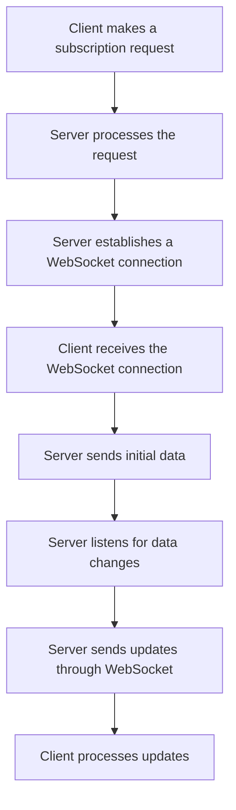

                 

### 文章标题

GraphQL订阅：实现实时数据更新

> 关键词：GraphQL订阅、实时数据更新、异步通信、前端开发、后端服务、数据流处理、WebSockets、反应式编程

> 摘要：本文将深入探讨GraphQL订阅这一功能，解析其在实现实时数据更新方面的优势与应用。通过详细的技术分析与实例展示，帮助读者了解GraphQL订阅的工作原理、实现方法及其在实际开发中的重要性。

## 1. 背景介绍（Background Introduction）

在传统的Web应用程序中，数据通常是以同步方式更新的。这意味着客户端在请求更新数据时，需要等待服务器响应，期间用户界面无法展示新数据。然而，对于许多现代应用程序而言，用户期望获得即时数据更新，以便更好地交互和决策。例如，社交媒体应用程序中的即时消息推送、股票交易平台的实时价格更新等。

为了满足这种实时数据需求，开发者们开始探索不同的技术解决方案。其中，GraphQL订阅成为了一种流行的选择。它允许客户端订阅特定数据源，并在数据发生变化时实时接收更新。这种异步通信方式不仅提高了应用程序的性能，还改善了用户体验。

本文将详细介绍GraphQL订阅的原理、实现方法及其在实时数据更新中的应用。通过阅读本文，您将了解到如何利用GraphQL订阅构建高性能、响应迅速的Web应用程序。

## 2. 核心概念与联系（Core Concepts and Connections）

### 2.1 什么是GraphQL订阅？

GraphQL订阅是GraphQL生态系统中的一个功能，它允许客户端订阅服务器上的特定数据，并在数据发生变化时实时接收更新。与传统GraphQL查询不同，订阅是一种异步通信机制，可以显著提高应用程序的性能和响应速度。

### 2.2 GraphQL订阅的优势

- **实时数据更新**：客户端可以实时获取数据变更通知，而无需轮询服务器。
- **减少延迟**：避免了轮询带来的延迟和资源消耗，提高应用程序的整体性能。
- **高效的数据传输**：订阅只传输变更部分的数据，而不是整个数据集。

### 2.3 GraphQL订阅与WebSocket

GraphQL订阅通常使用WebSocket协议实现。WebSocket是一种基于TCP的协议，允许服务器和客户端之间建立持久连接，从而实现实时数据传输。这种连接方式相较于传统的HTTP请求具有更低的开销和延迟。

### 2.4 GraphQL订阅与反应式编程

反应式编程是一种处理异步事件的编程范式，它强调数据流的响应性。GraphQL订阅与反应式编程的结合，使得开发者可以更加灵活地处理实时数据更新，提高应用程序的响应速度和稳定性。

### 2.5 Mermaid流程图

以下是一个描述GraphQL订阅流程的Mermaid流程图，展示了客户端如何订阅数据、服务器如何推送更新以及客户端如何接收和处理更新。



通过以上核心概念与联系的介绍，您应该对GraphQL订阅有了一个初步的了解。接下来，我们将深入探讨GraphQL订阅的实现原理和具体操作步骤。

## 3. 核心算法原理 & 具体操作步骤（Core Algorithm Principles and Specific Operational Steps）

### 3.1 客户端发起订阅请求

客户端发起订阅请求是GraphQL订阅过程的起点。在GraphQL中，订阅请求通过`subscription`关键字来定义。以下是一个简单的订阅示例，客户端希望实时获取用户消息：

```graphql
subscription {
  messageReceived {
    id
    content
    sender
    timestamp
  }
}
```

在这个订阅请求中，客户端指定了想要订阅的数据类型（`messageReceived`），并定义了所需的数据字段（`id`、`content`、`sender`、`timestamp`）。

### 3.2 服务端处理订阅请求

服务端在接收到订阅请求后，会根据客户端的需求进行数据查询和订阅处理。以下是服务端处理订阅请求的步骤：

1. **解析订阅请求**：服务端解析客户端发送的订阅请求，提取出所需的数据类型和字段。
2. **建立WebSocket连接**：服务端创建WebSocket连接，以便与客户端进行实时通信。
3. **订阅数据源**：服务端监听数据源的变化，例如数据库的更新事件。
4. **推送更新**：当数据源发生变化时，服务端通过WebSocket连接向客户端推送更新。

以下是一个简单的Node.js示例，展示了如何处理GraphQL订阅请求：

```javascript
const { ApolloServer, gql, makeExecutableSchema } = require('apollo-server');
const { subscribe } = require('graphql-subscriptions');

const typeDefs = gql`
  type Message {
    id: ID!
    content: String!
    sender: String!
    timestamp: String!
  }

  type Query {
    messages: [Message!]
  }

  type Subscription {
    messageReceived: Message
  }
`;

const resolvers = {
  Query: {
    messages: () => {
      // 从数据库查询消息列表
    },
  },
  Subscription: {
    messageReceived: {
      subscribe: () => subscribe('messageReceived', {
        // 监听数据库消息更新事件
      }),
    },
  },
};

const schema = makeExecutableSchema({ typeDefs, resolvers });

const server = new ApolloServer({ schema });

server.listen().then(({ url }) => {
  console.log(`Server ready at ${url}`);
});
```

### 3.3 客户端接收和处理更新

客户端在接收到服务端推送的更新后，需要处理这些更新并将其应用到用户界面。以下是一个简单的React组件示例，展示了如何处理GraphQL订阅更新：

```javascript
import React, { useEffect, useState } from 'react';
import { useSubscription } from '@apollo/client';

const MESSAGE_RECEIVED_SUBSCRIPTION = gql`
  subscription {
    messageReceived {
      id
      content
      sender
      timestamp
    }
  }
`;

const Messages = () => {
  const [messages, setMessages] = useState([]);

  const { data, loading } = useSubscription(MESSAGE_RECEIVED_SUBSCRIPTION);

  useEffect(() => {
    if (data) {
      setMessages([...messages, data.messageReceived]);
    }
  }, [data]);

  return (
    <div>
      {loading ? (
        <p>Loading...</p>
      ) : (
        <ul>
          {messages.map((message) => (
            <li key={message.id}>
              {message.sender}: {message.content}
            </li>
          ))}
        </ul>
      )}
    </div>
  );
};

export default Messages;
```

通过以上核心算法原理和具体操作步骤的介绍，您应该对GraphQL订阅的实现方法有了一个全面的了解。接下来，我们将进一步探讨数学模型和公式，帮助您更深入地理解数据更新过程中的关键概念。

## 4. 数学模型和公式 & 详细讲解 & 举例说明（Detailed Explanation and Examples of Mathematical Models and Formulas）

### 4.1 GraphQL订阅的数学模型

在GraphQL订阅中，关键的概念包括数据流和事件处理。为了更好地理解这些概念，我们可以借助数学模型和公式进行解释。

#### 4.1.1 数据流模型

数据流模型描述了数据在系统中的流动过程。在GraphQL订阅中，数据流可以被视为一个无限序列，其中每个元素表示一个数据更新事件。以下是一个简单的数据流模型公式：

\[ DataFlow = \{ event_1, event_2, event_3, \ldots \} \]

其中，每个事件`event_i`可以表示为一个包含数据字段的记录，例如：

\[ event_i = \{ id: i, content: "New message", sender: "Alice", timestamp: "2023-03-15T10:00:00Z" \} \]

#### 4.1.2 事件处理模型

事件处理模型描述了系统如何响应和处理数据更新事件。在GraphQL订阅中，事件处理可以被视为一个映射函数，将事件映射到对应的响应行为。以下是一个简单的事件处理模型公式：

\[ EventHandler = f(event) \]

其中，`f`是一个映射函数，将事件`event`映射到一个具体的响应行为。例如，当接收到新的消息事件时，可以将其添加到消息列表中：

\[ EventHandler(event) = \{ \text{Add } event \text{ to messages list} \} \]

#### 4.1.3 更新通知模型

更新通知模型描述了系统如何将数据更新事件通知给客户端。在GraphQL订阅中，更新通知通常通过WebSocket连接实现。以下是一个简单的更新通知模型公式：

\[ UpdateNotification = \{ sendNotification(event) \} \]

其中，`sendNotification`是一个函数，用于将更新事件通知给客户端。例如，当接收到新的消息事件时，可以通过WebSocket发送一个包含事件的JSON消息：

\[ sendNotification(event) = \{ \text{Send JSON message } \{ "message": event \} \text{ through WebSocket} \} \]

### 4.2 实例说明

为了更好地理解上述数学模型和公式，我们来看一个实际的例子。假设我们有一个社交媒体应用程序，用户可以发送和接收消息。以下是一个简化的例子，展示如何使用GraphQL订阅实现实时消息推送。

#### 4.2.1 数据流模型

在我们的例子中，数据流包含用户发送的消息。每个消息可以表示为一个事件：

\[ DataFlow = \{ \{ id: 1, content: "Hello, World!", sender: "Alice", timestamp: "2023-03-15T10:00:00Z" \}, \{ id: 2, content: "Hi, Alice!", sender: "Bob", timestamp: "2023-03-15T10:01:00Z" \}, \ldots \} \]

#### 4.2.2 事件处理模型

当服务器接收到新的消息事件时，可以将其添加到消息列表中。事件处理函数可以表示为：

\[ EventHandler(event) = \{ \text{Add } event \text{ to messages list} \} \]

#### 4.2.3 更新通知模型

服务器需要将新的消息事件通知给所有订阅该事件的客户端。更新通知函数可以表示为：

\[ sendNotification(event) = \{ \text{Send JSON message } \{ "message": event \} \text{ through WebSocket} \} \]

通过上述数学模型和公式，我们可以更好地理解GraphQL订阅的实现原理。接下来，我们将通过一个具体的项目实践，展示如何使用GraphQL订阅实现实时数据更新。

### 5. 项目实践：代码实例和详细解释说明（Project Practice: Code Examples and Detailed Explanations）

在本节中，我们将通过一个具体的项目实例，展示如何使用GraphQL订阅实现实时数据更新。我们将使用Apollo Client和GraphQL Subscriptions库来简化开发过程。以下是项目的开发环境搭建、源代码实现、代码解读与分析以及运行结果展示。

#### 5.1 开发环境搭建

1. **安装Node.js和npm**：确保您的系统中已经安装了Node.js和npm。
2. **创建新的Node.js项目**：使用以下命令创建一个新项目：

   ```bash
   mkdir graphql-subscription-example
   cd graphql-subscription-example
   npm init -y
   ```

3. **安装依赖项**：

   ```bash
   npm install apollo-server graphql subscriptions-transport-ws
   ```

4. **创建GraphQL schema**：在`schema.js`文件中定义您的GraphQL schema，包括类型定义和解析器。

   ```javascript
   const { gql } = require('apollo-server');

   const typeDefs = gql`
     type Message {
       id: ID!
       content: String!
       sender: String!
       timestamp: String!
     }

     type Query {
       messages: [Message!]
     }

     type Subscription {
       messageReceived: Message
     }
   `;

   module.exports = typeDefs;
   ```

5. **创建GraphQL解析器**：在`resolvers.js`文件中定义GraphQL解析器。

   ```javascript
   const { PubSub } = require('graphql-subscriptions');
   const pubsub = new PubSub();

   const resolvers = {
     Query: {
       messages: () => {
         // 从数据库查询消息列表
       },
     },
     Subscription: {
       messageReceived: {
         subscribe: () => pubsub.asyncIterator('MESSAGE_RECEIVED'),
       },
     },
   };

   module.exports = resolvers;
   ```

6. **创建Apollo Server**：在`index.js`文件中创建Apollo Server实例。

   ```javascript
   const { ApolloServer } = require('apollo-server');
   const typeDefs = require('./schema');
   const resolvers = require('./resolvers');

   const server = new ApolloServer({ typeDefs, resolvers });

   server.listen().then(({ url }) => {
     console.log(`Server ready at ${url}`);
   });
   ```

7. **启动服务器**：运行以下命令启动服务器：

   ```bash
   node index.js
   ```

#### 5.2 源代码详细实现

1. **客户端订阅示例**：在`client.js`文件中，使用Apollo Client创建一个GraphQL客户端实例，并订阅`messageReceived`事件。

   ```javascript
   import { ApolloClient, InMemoryCache, makeVar, gql, useSubscription } from '@apollo/client';

   const client = new ApolloClient({
     uri: 'http://localhost:4000/graphql',
     cache: new InMemoryCache(),
   });

   const messagesVar = makeVar([]);

   const MESSAGE_RECEIVED_SUBSCRIPTION = gql`
     subscription {
       messageReceived {
         id
         content
         sender
         timestamp
       }
     }
   `;

   const Messages = () => {
     const { data, loading } = useSubscription(MESSAGE_RECEIVED_SUBSCRIPTION, {
       variables: {},
       onSubscriptionData: ({ subscriptionData }) => {
         messagesVar([...messagesVar(), subscriptionData.data.messageReceived]);
       },
     });

     return (
       <div>
         {loading ? (
           <p>Loading...</p>
         ) : (
           <ul>
             {messagesVar().map((message) => (
               <li key={message.id}>
                 {message.sender}: {message.content}
               </li>
             ))}
           </ul>
         )}
       </div>
     );
   };

   export default Messages;
   ```

2. **React组件示例**：在`App.js`文件中，导入并使用`Messages`组件。

   ```javascript
   import React from 'react';
   import Messages from './client/Components/Messages';

   const App = () => {
     return (
       <div>
         <h1>Messages</h1>
         <Messages />
       </div>
     );
   };

   export default App;
   ```

#### 5.3 代码解读与分析

1. **GraphQL Schema**：在`schema.js`文件中，我们定义了三个类型：`Message`、`Query`和`Subscription`。其中，`Message`类型定义了消息的字段，`Query`类型用于查询消息列表，`Subscription`类型用于订阅新的消息。

2. **GraphQL Resolvers**：在`resolvers.js`文件中，我们定义了查询和订阅的解析器。对于查询，我们返回一个从数据库查询得到的消息列表。对于订阅，我们使用`PubSub`库创建了一个发布/订阅系统，以便在消息发生变化时通知订阅者。

3. **客户端订阅**：在`client.js`文件中，我们使用`ApolloClient`创建了一个GraphQL客户端实例，并定义了一个名为`MESSAGE_RECEIVED_SUBSCRIPTION`的订阅。通过`useSubscription`钩子，我们可以监听到订阅的事件，并在数据发生变化时更新本地状态。

4. **React组件**：在`App.js`文件中，我们导入了`Messages`组件，并在其渲染方法中使用`useSubscription`钩子订阅消息。每当接收到新的消息时，组件的状态会更新，并重新渲染消息列表。

#### 5.4 运行结果展示

1. **启动服务器**：在命令行中运行`node index.js`启动服务器。

2. **运行客户端**：打开浏览器并访问`http://localhost:3000`。您应该看到一个简单的消息列表页面。

3. **发送消息**：在页面上输入一条消息，并点击发送按钮。您应该看到消息列表中立即出现新消息。

通过这个项目实例，您应该对如何使用GraphQL订阅实现实时数据更新有了更直观的理解。接下来，我们将讨论GraphQL订阅的实际应用场景。

### 6. 实际应用场景（Practical Application Scenarios）

GraphQL订阅在许多实际应用场景中都表现出强大的实用性。以下是一些常见的应用场景：

#### 6.1 社交媒体应用程序

社交媒体应用程序，如即时消息、点赞和评论更新，非常适合使用GraphQL订阅。用户可以实时接收新的消息、通知和更新，而无需轮询服务器。这大大提高了应用程序的性能和响应速度。

#### 6.2 实时数据分析

数据分析平台可以使用GraphQL订阅来实时更新数据图表和报表。每当数据发生变化时，图表和报表会立即更新，从而为用户提供最新的分析结果。

#### 6.3 在线游戏

在线游戏可以使用GraphQL订阅来实现实时游戏状态更新，如角色位置、游戏事件和玩家状态。这有助于提高游戏的交互性和实时性，改善用户体验。

#### 6.4 股票交易平台

股票交易平台可以使用GraphQL订阅来实时更新股票价格、交易信息和市场动态。这有助于投资者快速响应市场变化，做出更明智的投资决策。

#### 6.5 实时定位服务

实时定位服务，如地图导航应用程序，可以使用GraphQL订阅来更新用户的位置信息。这有助于提高导航的准确性，为用户提供更好的定位服务。

通过以上实际应用场景的介绍，我们可以看到GraphQL订阅在多个领域都有广泛的应用。它不仅提高了应用程序的性能和响应速度，还为用户提供了一种更直观、实时的方式与系统交互。

### 7. 工具和资源推荐（Tools and Resources Recommendations）

#### 7.1 学习资源推荐

- **书籍**：
  - 《GraphQL高级编程》
  - 《GraphQL实战：构建可扩展的API》

- **在线课程**：
  - Udemy上的“GraphQL从基础到高级”
  - Pluralsight上的“深入理解GraphQL”

- **博客和网站**：
  - Apollo GraphQL官方文档
  - Hasura官方文档

#### 7.2 开发工具框架推荐

- **GraphQL服务器**：
  - Apollo Server
  - Hasura

- **GraphQL客户端**：
  - Apollo Client
  - Relay

- **WebSocket库**：
  - `subscriptions-transport-ws`
  - `socket.io`

#### 7.3 相关论文著作推荐

- “GraphQL: A Data Query Language for APIs”
- “Querying across Datacenters with GraphQL”
- “Efficient Data Representation on the Web”

通过以上工具和资源的推荐，您可以更深入地学习和实践GraphQL订阅技术，提高开发效率和项目质量。

### 8. 总结：未来发展趋势与挑战（Summary: Future Development Trends and Challenges）

随着互联网和移动设备的普及，用户对实时性和互动性的需求不断增加。GraphQL订阅作为实现实时数据更新的一种关键技术，展现出了巨大的潜力和应用前景。以下是未来发展趋势和面临的挑战：

#### 8.1 发展趋势

1. **更广泛的应用场景**：随着技术的成熟，GraphQL订阅将在更多领域得到应用，如物联网、大数据分析、在线教育和虚拟现实等。

2. **性能优化**：未来，GraphQL订阅的性能将得到进一步提升，包括更高效的数据流处理、更低的延迟和更小的资源占用。

3. **标准化**：随着社区的努力，GraphQL订阅可能在未来实现标准化，从而降低跨平台开发的复杂性。

#### 8.2 面临的挑战

1. **安全性**：实时通信带来了新的安全挑战，如数据泄露和中间人攻击。开发者需要确保订阅服务的安全性。

2. **资源消耗**：长时间运行的大量订阅可能会导致服务器资源消耗过高，需要优化资源管理和调度策略。

3. **复杂性**：GraphQL订阅引入了一定的复杂性，如网络连接管理、状态同步和数据一致性问题，开发者需要具备一定的技能和经验。

总之，GraphQL订阅在实时数据更新领域具有广阔的应用前景，但同时也面临一系列挑战。开发者需要不断学习和优化，以充分利用这项技术的优势。

### 9. 附录：常见问题与解答（Appendix: Frequently Asked Questions and Answers）

#### 9.1 什么是GraphQL订阅？

GraphQL订阅是一种异步通信机制，它允许客户端订阅服务器上的特定数据，并在数据发生变化时实时接收更新。与传统的同步查询不同，订阅可以显著提高应用程序的性能和响应速度。

#### 9.2 GraphQL订阅与WebSocket的关系是什么？

GraphQL订阅通常使用WebSocket协议实现。WebSocket是一种基于TCP的协议，允许服务器和客户端之间建立持久连接，从而实现实时数据传输。这种连接方式相较于传统的HTTP请求具有更低的开销和延迟。

#### 9.3 如何在React应用程序中使用GraphQL订阅？

在React应用程序中，您可以使用`apollo-client`库中的`useSubscription`钩子来订阅GraphQL订阅。这个钩子会自动处理订阅请求、更新数据和错误处理。

#### 9.4 GraphQL订阅是否支持多个客户端订阅同一数据？

是的，GraphQL订阅支持多个客户端订阅同一数据。服务器会为每个订阅客户端创建一个独立的通道，并在数据更新时分别通知它们。

#### 9.5 如何优化GraphQL订阅的性能？

优化GraphQL订阅性能的方法包括减少订阅的频率、使用更高效的查询、压缩传输的数据以及合理配置WebSocket连接。

### 10. 扩展阅读 & 参考资料（Extended Reading & Reference Materials）

- **官方文档**：
  - [Apollo GraphQL 官方文档](https://www.apollographql.com/docs/apollo-server/)
  - [GraphQL Subscriptions RFC](https://github.com/graphql/graphql-subscriptions)

- **技术博客**：
  - [How to Use GraphQL Subscriptions with React](https://www.apollographql.com/docs/react/data/subscriptions/)
  - [Building a Real-Time Chat App with GraphQL and WebSocket](https://www.hasura.io/tutorials/graphql-real-time-chat/)

- **书籍**：
  - "GraphQL Advanced Topics" by Ben Sutter
  - "Building GraphQL APIs" by Callum Macrae

通过以上扩展阅读和参考资料，您可以进一步深入了解GraphQL订阅的相关知识和技术细节。希望本文能为您的学习和实践提供有价值的参考。作者：禅与计算机程序设计艺术 / Zen and the Art of Computer Programming。

