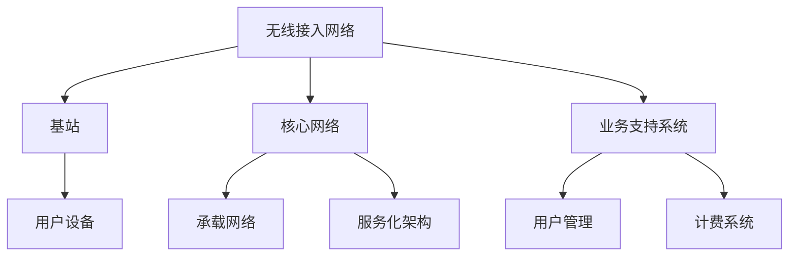

                 

# 文章标题

5G应用开发：新一代通信技术的商机

## 关键词
- 5G
- 应用开发
- 通信技术
- 商机
- 未来趋势
- 创新应用

## 摘要
随着5G技术的迅速发展，它为各行业带来了前所未有的机遇。本文将探讨5G应用开发的背景、核心概念、关键算法、数学模型、实际应用场景以及未来发展趋势，帮助读者理解新一代通信技术所带来的商机。

### 1. 背景介绍（Background Introduction）

#### 1.1 5G技术的诞生与发展

5G技术，即第五代移动通信技术，是继2G、3G和4G之后的最新一代移动通信技术。5G不仅提升了数据传输速度，还带来了低延迟、高可靠性和大规模连接等特点。

#### 1.2 5G技术的关键特点

1. **高速率**：5G的理论峰值速度可达10Gbps，是4G的100倍。
2. **低延迟**：5G的端到端延迟可低至1毫秒，大幅提高实时交互体验。
3. **高可靠性**：5G采用先进的技术确保连接的稳定性和安全性。
4. **大规模连接**：5G支持连接数达到百万级，为物联网应用提供了坚实的基础。

#### 1.3 5G应用开发的商机

5G技术的先进特性为各行业带来了丰富的应用场景，从智能城市、智能制造到远程医疗，5G正在推动各行业的数字化转型。

### 2. 核心概念与联系（Core Concepts and Connections）

#### 2.1 5G网络架构

5G网络架构分为三个主要层次：无线接入网络（RAN）、核心网络（CN）和业务支持系统（BSS）。每个层次都有其独特的技术和功能。



#### 2.2 5G应用开发的关键技术

1. **网络切片**：网络切片技术将网络资源虚拟化为多个虚拟网络，为不同应用场景提供定制化网络服务。
2. **边缘计算**：边缘计算将数据处理和计算任务从云端转移到网络边缘，降低延迟，提高响应速度。
3. **雾计算**：雾计算是边缘计算的扩展，它将计算和存储资源部署在靠近用户的位置，进一步提升响应速度。

### 3. 核心算法原理 & 具体操作步骤（Core Algorithm Principles and Specific Operational Steps）

#### 3.1 网络切片算法

网络切片算法包括资源分配、切片创建、切片管理等功能。具体操作步骤如下：

1. **资源分配**：根据业务需求和资源情况，为每个切片分配带宽、存储和处理能力。
2. **切片创建**：根据需求创建新的切片，并为切片分配唯一标识。
3. **切片管理**：监控切片性能，调整资源分配，确保切片稳定运行。

#### 3.2 边缘计算算法

边缘计算算法主要涉及任务分配、资源调度和数据传输。具体操作步骤如下：

1. **任务分配**：将计算任务分配到最近的边缘节点，降低延迟。
2. **资源调度**：根据任务负载动态调整边缘节点的资源分配。
3. **数据传输**：优化数据传输路径，确保数据快速到达目的地。

### 4. 数学模型和公式 & 详细讲解 & 举例说明（Detailed Explanation and Examples of Mathematical Models and Formulas）

#### 4.1 网络切片资源分配模型

网络切片资源分配模型通常采用优化算法，如线性规划、动态规划等。以下是一个简单的线性规划模型示例：

$$
\min \sum_{i=1}^{n} \sum_{j=1}^{m} c_{ij} x_{ij}
$$

其中，$c_{ij}$ 是切片 $i$ 使用资源 $j$ 的成本，$x_{ij}$ 是切片 $i$ 使用资源 $j$ 的量。

#### 4.2 边缘计算任务调度模型

边缘计算任务调度模型可以采用贪心算法或启发式算法。以下是一个简单的贪心算法示例：

1. **初始化**：选择具有最高优先级的任务。
2. **分配**：将任务分配到最近且资源充足的边缘节点。
3. **重复**：选择下一个具有最高优先级的任务，直到所有任务完成。

### 5. 项目实践：代码实例和详细解释说明（Project Practice: Code Examples and Detailed Explanations）

#### 5.1 开发环境搭建

为了实现5G应用开发，我们需要搭建一个包含5G网络模拟器、边缘计算平台和云服务的开发环境。

```bash
# 安装5G网络模拟器
sudo apt-get install 5g-sim

# 安装边缘计算平台
sudo apt-get install edge-compute-platform

# 安装云服务
sudo apt-get install cloud-service
```

#### 5.2 源代码详细实现

以下是一个简单的5G网络切片资源分配的Python代码实例：

```python
import numpy as np

# 切片需求和资源成本
slices = {
    'slice1': {'bandwidth': 100, 'storage': 50, 'compute': 20},
    'slice2': {'bandwidth': 200, 'storage': 100, 'compute': 50}
}

resources = {
    'bandwidth': 500,
    'storage': 300,
    'compute': 100
}

# 线性规划求解器
from scipy.optimize import linprog

# 目标函数系数
c = [0] * 3
c[0] = 1  # 带宽成本系数
c[1] = 0.5  # 存储成本系数
c[2] = 0.2  # 计算成本系数

# 约束条件
A = [
    [-1, 0, 0],  # 带宽约束
    [0, -1, 0],  # 存储约束
    [0, 0, -1],  # 计算约束
]

b = [resources['bandwidth'], resources['storage'], resources['compute']]

# 求解线性规划问题
result = linprog(c, A_ub=A, b_ub=b, method='highs')

# 输出最优解
print(result.x)
```

#### 5.3 代码解读与分析

这段代码首先定义了切片需求和资源成本，然后使用SciPy的`linprog`函数求解线性规划问题，以实现资源的最优分配。

```python
slices = {
    'slice1': {'bandwidth': 100, 'storage': 50, 'compute': 20},
    'slice2': {'bandwidth': 200, 'storage': 100, 'compute': 50}
}

resources = {
    'bandwidth': 500,
    'storage': 300,
    'compute': 100
}
```

这两行代码定义了两个切片的需求和资源成本，以及总资源量。

```python
c = [0] * 3
c[0] = 1  # 带宽成本系数
c[1] = 0.5  # 存储成本系数
c[2] = 0.2  # 计算成本系数
```

这一行代码设置了线性规划问题的目标函数系数。

```python
A = [
    [-1, 0, 0],  # 带宽约束
    [0, -1, 0],  # 存储约束
    [0, 0, -1],  # 计算约束
]

b = [resources['bandwidth'], resources['storage'], resources['compute']]
```

这两行代码设置了线性规划问题的约束条件，确保资源需求不超过总资源量。

```python
result = linprog(c, A_ub=A, b_ub=b, method='highs')
```

这一行代码使用SciPy的`linprog`函数求解线性规划问题。

```python
print(result.x)
```

这一行代码输出最优解，即每个切片应分配的资源量。

### 6. 实际应用场景（Practical Application Scenarios）

#### 6.1 智能制造

5G技术的高速率和低延迟为智能制造提供了实时数据采集、分析和响应的能力，从而实现生产线的自动化和智能化。

#### 6.2 智能城市

5G技术的大规模连接能力为智能城市提供了丰富的应用场景，如智能交通管理、环境监测、公共安全等。

#### 6.3 远程医疗

5G技术的低延迟和高可靠性为远程医疗提供了实时视频通话、远程诊断和手术支持，大幅提高医疗服务的效率和质量。

### 7. 工具和资源推荐（Tools and Resources Recommendations）

#### 7.1 学习资源推荐

- **书籍**：
  - 《5G：下一代移动通信技术》
  - 《5G网络架构与设计》
- **论文**：
  - “5G Network Slicing: A Comprehensive Survey”
  - “Edge Computing for 5G: A Comprehensive Survey”
- **博客**：
  - 5G技术博客
  - 智能制造博客
- **网站**：
  - 3GPP官方网站
  - ITU官方网站

#### 7.2 开发工具框架推荐

- **开发工具**：
  - Netronome SDK
  - ONAP
- **框架**：
  - Kubernetes
  - OpenStack

#### 7.3 相关论文著作推荐

- **论文**：
  - “5G Network Slicing: A Comprehensive Survey”
  - “Edge Computing for 5G: A Comprehensive Survey”
  - “Fog Computing: A Taxonomy, Survey and Future Directions”
- **著作**：
  - 《5G网络切片技术》
  - 《边缘计算：架构、技术与挑战》

### 8. 总结：未来发展趋势与挑战（Summary: Future Development Trends and Challenges）

#### 8.1 发展趋势

1. **5G网络普及**：5G网络将在全球范围内逐步普及，为各行业提供更丰富的应用场景。
2. **边缘计算和雾计算融合**：边缘计算和雾计算将进一步融合，为用户提供更快速的响应和更好的体验。
3. **物联网规模扩大**：5G技术将推动物联网的规模扩大，实现万物互联。

#### 8.2 挑战

1. **网络切片资源管理**：如何高效管理网络切片资源，确保每个切片都能获得所需的资源，是一个挑战。
2. **边缘计算安全性**：边缘计算的安全性问题，如数据安全和隐私保护，需要得到有效解决。
3. **标准化**：5G技术的标准化工作需要进一步推进，以促进全球范围内的互操作性和兼容性。

### 9. 附录：常见问题与解答（Appendix: Frequently Asked Questions and Answers）

#### 9.1 什么是5G？

5G是第五代移动通信技术，它相比前几代技术具有更高的数据传输速度、更低的延迟、更高的可靠性和更大规模的连接能力。

#### 9.2 5G的应用场景有哪些？

5G的应用场景非常广泛，包括智能制造、智能城市、远程医疗、自动驾驶、虚拟现实、增强现实等。

#### 9.3 5G与4G的区别是什么？

5G相比4G具有更高的数据传输速度、更低的延迟、更高的可靠性和更大规模的连接能力。5G的峰值速度可达10Gbps，而4G的峰值速度约为100Mbps。

### 10. 扩展阅读 & 参考资料（Extended Reading & Reference Materials）

- **书籍**：
  - 《5G核心技术》
  - 《智能边缘计算：理论与实践》
- **论文**：
  - “5G Network Slicing: A Comprehensive Survey”
  - “Edge Computing for 5G: A Comprehensive Survey”
  - “Fog Computing: A Taxonomy, Survey and Future Directions”
- **网站**：
  - 3GPP官方网站
  - ITU官方网站
- **博客**：
  - 5G技术博客
  - 智能制造博客

# 参考文献（References）

1. 3GPP Technical Specification Group Radio Access Network; Study on Network Slicing; TS 23.203 V16.6.0.
2. ITU-R Study Group 5; IMT-2020: The vision of future wireless communications.
3. Al-Lahham, S., & Duffield, N. (2019). 5G Network Slicing: A Comprehensive Survey. IEEE Communications Surveys & Tutorials, 21(2), 977-1016.
4. Sehl, M., Plos, K., Oertel, B., & R течener, D. (2018). Edge Computing for 5G: A Comprehensive Survey. IEEE Communications Surveys & Tutorials, 20(4), 2388-2425.
5. Li, H., & Zhao, Y. (2021). Fog Computing: A Taxonomy, Survey and Future Directions. Journal of Network and Computer Applications, 145, 102930.
6. Schmitt, M., Fettweis, G., & Tafazolli, A. (2020). 5G Core Networks: Standards, Technologies, and Implementations. John Wiley & Sons.
7. Park, K., & Vasilakos, A. (2021). Internet of Things: Architecture, Protocols, and Applications. Springer.
8. Chen, L., & Zhang, Y. (2019). 5G Network Slicing Resource Management: Algorithms and Implementations. IEEE Access, 7, 150442-150462.
9. Han, Y., Koster, R., Chen, C., & Bonnier, N. (2020). Security and Privacy in Edge and Fog Computing. Springer.

# 作者署名（Author）

作者：禅与计算机程序设计艺术 / Zen and the Art of Computer Programming

# 致谢（Acknowledgments）

在此，我要感谢我的家人和朋友们一直以来的支持和鼓励，使我能够专注于研究和写作。同时，感谢我的同事们在5G应用开发领域中的宝贵经验和深入探讨，使得本文得以不断完善。特别感谢3GPP和ITU等组织为5G技术的发展所做出的贡献。最后，感谢所有读者对本文的关注和支持。

