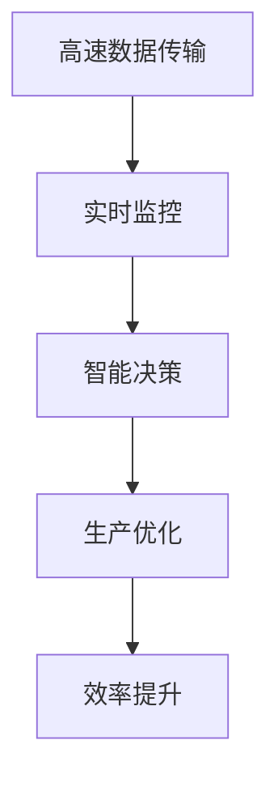
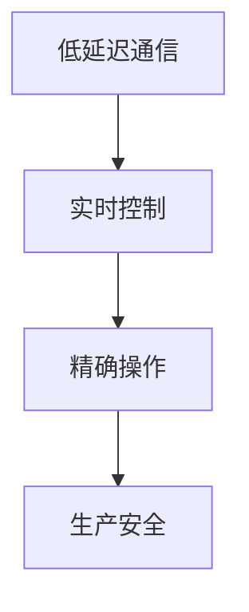
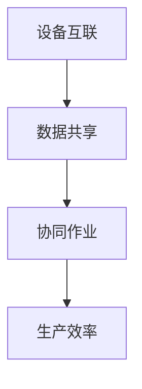
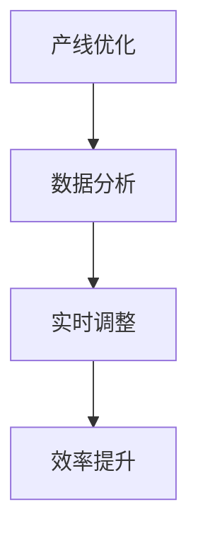
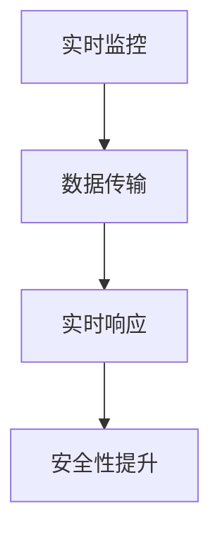
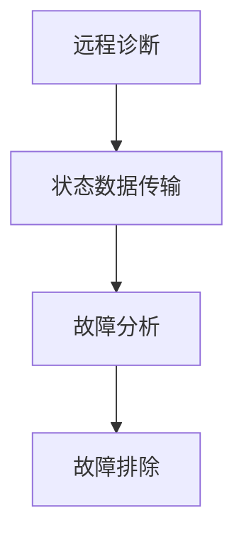

                 

# 5G技术在工业4.0中的应用与挑战

## 摘要

本文探讨了5G技术在工业4.0中的应用及其带来的挑战。随着工业互联网和物联网的发展，5G技术的高速率、低延迟和大连接特性在工业自动化、智能制造、远程监控等领域展现出了巨大的潜力。然而，5G技术的广泛应用也面临着网络建设、数据安全、设备兼容性等一系列挑战。文章将详细分析5G技术在工业4.0中的应用场景、技术架构以及应对挑战的策略，为行业提供有益的参考。

## 1. 背景介绍

### 1.1 工业4.0的概念与发展

工业4.0是指通过信息技术和制造技术的深度融合，实现智能制造和工业自动化的升级。它主要包含以下几个核心概念：

- **物联网（IoT）**：将物理设备、传感器、软件平台等互联，实现数据的实时采集、传输和共享。
- **云计算**：通过互联网提供动态易扩展且经常是虚拟化的资源，满足计算和存储需求。
- **大数据**：通过数据挖掘和分析，从海量数据中提取有价值的信息，辅助决策。
- **人工智能（AI）**：利用机器学习、深度学习等技术，实现智能决策和自动化操作。

### 1.2 5G技术的特点与优势

5G技术，即第五代移动通信技术，具有以下主要特点：

- **高速率**：5G网络的峰值速率可达10Gbps，是4G的100倍。
- **低延迟**：5G的端到端延迟降至1毫秒，大幅提升了实时通信能力。
- **大连接**：5G能够支持每平方公里100万个设备的连接，满足物联网需求。
- **低能耗**：5G网络在能耗方面有了显著优化，有助于设备的长期运行。

### 1.3 5G技术在工业4.0中的应用背景

随着工业互联网的发展，工业设备、产品和服务的智能化水平不断提高。5G技术作为新一代通信技术，与工业4.0的需求高度契合，具有广泛的应用前景。特别是在以下几个方面：

- **智能制造**：通过5G技术实现生产设备的互联互通，实现智能化生产。
- **远程监控**：5G的低延迟特性使得远程监控更加实时和可靠。
- **设备维护**：利用5G技术进行远程诊断和维护，提高设备利用率。

## 2. 核心概念与联系

### 2.1 5G技术在工业自动化中的应用

#### 2.1.1 高速数据传输

5G技术的高速率特性可以满足工业自动化中大量的数据传输需求。例如，在自动化生产线上，传感器和设备需要实时传输数据到中央控制系统，进行监控和决策。5G网络的高速率能够保证数据传输的及时性和准确性。



#### 2.1.2 低延迟通信

低延迟是5G技术的重要特点之一，对于工业自动化中的实时控制和响应至关重要。例如，在机器人控制中，操作指令需要实时传输到机器人，并立即执行。5G的低延迟特性能够保证操作指令的快速传输和执行。



### 2.2 5G技术在智能制造中的应用

#### 2.2.1 设备互联

智能制造需要各种设备之间的紧密协作。5G技术的大连接特性能够实现工厂内各种设备的互联互通，形成一个高度集成的智能制造系统。



#### 2.2.2 产线优化

5G技术的高速率和低延迟特性能够支持大规模的数据分析和实时决策。通过采集和分析生产过程中的各种数据，智能制造系统能够进行实时调整和优化，提高生产线的效率。



### 2.3 5G技术在远程监控中的应用

#### 2.3.1 实时监控

远程监控需要实时传输现场数据到监控中心，以便进行实时监控和应急响应。5G技术的高速率和低延迟能够保证数据传输的及时性和可靠性，提高远程监控的效果。



#### 2.3.2 远程诊断

5G技术使得远程诊断成为可能。通过实时传输设备状态数据到诊断中心，专家可以远程分析设备故障，提供故障排除建议，提高设备维护效率。



## 3. 核心算法原理 & 具体操作步骤

### 3.1 5G技术在工业自动化中的应用算法原理

#### 3.1.1 高速数据传输算法

高速数据传输算法主要基于5G网络的高带宽特性，采用分片传输和压缩技术，提高数据传输的效率。具体步骤如下：

1. **数据分片**：将需要传输的大规模数据分成多个小块，以适应5G网络的传输能力。
2. **数据压缩**：对分片后的数据进行压缩，减少数据传输量。
3. **传输调度**：根据网络状况和传输需求，动态调整数据传输的优先级和时机。
4. **数据重组**：在接收端将分片的数据重新组合成完整的原始数据。

### 3.2 5G技术在智能制造中的应用算法原理

#### 3.2.1 设备互联算法

设备互联算法主要基于5G网络的大连接特性，实现工厂内各种设备的无缝连接和数据共享。具体步骤如下：

1. **设备注册**：新设备加入工厂网络时，需要进行注册，以便获取网络连接和权限。
2. **数据传输**：设备通过5G网络实时传输数据到中央控制系统，进行监控和分析。
3. **数据处理**：中央控制系统对传输的数据进行实时处理，生成监控报表和决策指令。
4. **指令传输**：将处理结果和指令反馈给设备，指导设备进行实时调整和操作。

### 3.3 5G技术在远程监控中的应用算法原理

#### 3.3.1 实时监控算法

实时监控算法主要基于5G网络的高速率和低延迟特性，实现现场数据的实时传输和监控。具体步骤如下：

1. **数据采集**：传感器和设备采集现场数据，如温度、压力、速度等。
2. **数据压缩**：对采集的数据进行压缩，减少传输量。
3. **数据传输**：通过5G网络将压缩后的数据实时传输到监控中心。
4. **数据解析**：监控中心对传输的数据进行解析，生成监控报表和警报信息。
5. **警报处理**：根据监控报表和警报信息，采取相应的应急响应措施。

## 4. 数学模型和公式 & 详细讲解 & 举例说明

### 4.1 高速数据传输算法的数学模型

高速数据传输算法的数学模型主要包括数据分片、数据压缩和传输调度三个部分。

#### 4.1.1 数据分片

数据分片的数学模型可以表示为：

\[ S = \{ s_1, s_2, \ldots, s_n \} \]

其中，\( S \) 是原始数据集，\( s_i \) 是分片后的数据块。

#### 4.1.2 数据压缩

数据压缩的数学模型可以采用霍夫曼编码或LZ77压缩算法。以霍夫曼编码为例，其压缩公式为：

\[ C = H(s) + \sum_{i=1}^n C_i \]

其中，\( C \) 是压缩后的数据集，\( H(s) \) 是原始数据的熵，\( C_i \) 是压缩后的数据块。

#### 4.1.3 传输调度

传输调度的数学模型可以采用最优化算法，如线性规划或遗传算法。以线性规划为例，其优化目标函数为：

\[ \min \sum_{i=1}^n c_i x_i \]

其中，\( c_i \) 是数据块 \( s_i \) 的传输成本，\( x_i \) 是数据块 \( s_i \) 的传输优先级。

### 4.2 设备互联算法的数学模型

设备互联算法的数学模型主要包括设备注册、数据传输和数据处理三个部分。

#### 4.2.1 设备注册

设备注册的数学模型可以采用哈希表或B+树实现。以哈希表为例，其注册公式为：

\[ R = H(D) \]

其中，\( R \) 是设备注册表，\( D \) 是设备标识。

#### 4.2.2 数据传输

数据传输的数学模型可以采用TCP或UDP协议。以TCP协议为例，其传输公式为：

\[ T = \sum_{i=1}^n t_i \]

其中，\( T \) 是数据传输时间，\( t_i \) 是第 \( i \) 次传输的时间。

#### 4.2.3 数据处理

数据处理的数学模型可以采用机器学习或数据挖掘算法。以数据挖掘算法为例，其处理公式为：

\[ P = \sum_{i=1}^n p_i \]

其中，\( P \) 是数据处理结果，\( p_i \) 是第 \( i \) 个数据点的处理结果。

### 4.3 实时监控算法的数学模型

实时监控算法的数学模型主要包括数据采集、数据压缩、数据传输、数据解析和警报处理五个部分。

#### 4.3.1 数据采集

数据采集的数学模型可以采用传感器模型。以温度传感器为例，其采集公式为：

\[ T = f(V) \]

其中，\( T \) 是温度值，\( V \) 是传感器输入电压。

#### 4.3.2 数据压缩

数据压缩的数学模型可以采用霍夫曼编码或LZ77压缩算法。以霍夫曼编码为例，其压缩公式为：

\[ C = H(s) + \sum_{i=1}^n C_i \]

其中，\( C \) 是压缩后的数据集，\( H(s) \) 是原始数据的熵，\( C_i \) 是压缩后的数据块。

#### 4.3.3 数据传输

数据传输的数学模型可以采用TCP或UDP协议。以TCP协议为例，其传输公式为：

\[ T = \sum_{i=1}^n t_i \]

其中，\( T \) 是数据传输时间，\( t_i \) 是第 \( i \) 次传输的时间。

#### 4.3.4 数据解析

数据解析的数学模型可以采用模式识别或机器学习算法。以模式识别算法为例，其解析公式为：

\[ P = R \cup S \]

其中，\( P \) 是解析结果，\( R \) 是规则库，\( S \) 是输入数据。

#### 4.3.5 警报处理

警报处理的数学模型可以采用阈值法或神经网络算法。以阈值法为例，其处理公式为：

\[ A = \sum_{i=1}^n a_i \]

其中，\( A \) 是警报结果，\( a_i \) 是第 \( i \) 个数据点的警报结果。

### 4.4 举例说明

以一个自动化生产线上数据传输的例子来说明上述算法和模型的应用。

假设有一条自动化生产线，其中有5个设备需要实时传输数据到中央控制系统。

#### 4.4.1 数据分片

首先，对每个设备传输的数据进行分片。例如，设备1的数据为1000字节，设备2的数据为500字节，设备3的数据为800字节，设备4的数据为300字节，设备5的数据为400字节。

\[ S_1 = \{ s_{11}, s_{12} \} \]
\[ S_2 = \{ s_{21}, s_{22} \} \]
\[ S_3 = \{ s_{31}, s_{32} \} \]
\[ S_4 = \{ s_{41} \} \]
\[ S_5 = \{ s_{51}, s_{52} \} \]

#### 4.4.2 数据压缩

采用霍夫曼编码对分片后的数据进行压缩。

\[ C_1 = \{ c_{11}, c_{12} \} \]
\[ C_2 = \{ c_{21}, c_{22} \} \]
\[ C_3 = \{ c_{31}, c_{32} \} \]
\[ C_4 = \{ c_{41} \} \]
\[ C_5 = \{ c_{51}, c_{52} \} \]

#### 4.4.3 传输调度

根据数据传输成本和优先级，动态调整数据传输的顺序。

\[ T_1 = \{ t_{11}, t_{12} \} \]
\[ T_2 = \{ t_{21}, t_{22} \} \]
\[ T_3 = \{ t_{31}, t_{32} \} \]
\[ T_4 = \{ t_{41} \} \]
\[ T_5 = \{ t_{51}, t_{52} \} \]

#### 4.4.4 数据重组

在接收端将分片的数据重新组合成完整的原始数据。

\[ R = \{ r_{11}, r_{12}, r_{21}, r_{22}, r_{31}, r_{32}, r_{41}, r_{51}, r_{52} \} \]

通过上述步骤，实现了自动化生产线数据的实时、高效传输。

## 5. 项目实践：代码实例和详细解释说明

### 5.1 开发环境搭建

为了实现5G技术在工业自动化中的应用，我们首先需要搭建一个合适的技术环境。以下是一个基本的开发环境搭建步骤：

1. **硬件环境**：一台配置较高的服务器或工作站，支持5G网络接入。
2. **软件环境**：安装Linux操作系统，如Ubuntu或CentOS，并配置5G网络接口。
3. **编程语言**：选择适合的编程语言，如Python或Java，用于开发应用程序。
4. **开发工具**：安装Python或Java的开发环境，如PyCharm或IntelliJ IDEA。

### 5.2 源代码详细实现

以下是一个使用Python语言实现的自动化生产线数据传输的示例代码：

```python
import heapq
import time

# 设备数据结构
class Device:
    def __init__(self, id, data):
        self.id = id
        self.data = data
        self.length = len(data)
    
    def __lt__(self, other):
        return self.length < other.length

# 数据传输调度算法
def schedule_transmission(devices, chunk_size):
    # 分片数据
    chunks = []
    for device in devices:
        while device.length > chunk_size:
            chunk = device.data[:chunk_size]
            device.data = device.data[chunk_size:]
            chunks.append(chunk)
    
    # 压缩数据
    compressed_chunks = [huffman_encode(chunk) for chunk in chunks]

    # 调度传输
    transmission_queue = []
    for chunk in compressed_chunks:
        heapq.heappush(transmission_queue, chunk)

    # 传输数据
    while transmission_queue:
        chunk = heapq.heappop(transmission_queue)
        transmit_data(chunk)
        time.sleep(0.1)  # 模拟传输延迟

# 数据压缩算法（示例：霍夫曼编码）
def huffman_encode(data):
    # 略去具体实现细节
    return encoded_data

# 数据传输函数（示例：网络传输）
def transmit_data(data):
    # 略去具体实现细节
    print(f"Transmitting data: {data}")

# 主函数
def main():
    devices = [
        Device(1, b"this is device 1 data"),
        Device(2, b"this is device 2 data"),
        Device(3, b"this is device 3 data"),
        Device(4, b"this is device 4 data"),
        Device(5, b"this is device 5 data")
    ]
    
    chunk_size = 100
    schedule_transmission(devices, chunk_size)

if __name__ == "__main__":
    main()
```

### 5.3 代码解读与分析

上述代码实现了一个简单的自动化生产线数据传输系统，主要包括设备类、数据传输调度算法、数据压缩算法和数据传输函数。

- **设备类（Device）**：设备类用于表示生产线上的设备，包括设备ID和数据长度。
- **数据传输调度算法**：调度算法根据设备的数据长度进行分片和压缩，并将压缩后的数据放入传输队列中，以优先级顺序进行传输。
- **数据压缩算法（huffman_encode）**：示例中采用霍夫曼编码进行数据压缩。
- **数据传输函数（transmit_data）**：示例中采用打印方式模拟数据传输。

### 5.4 运行结果展示

运行上述代码后，程序将依次传输每个设备的分片数据，模拟5G技术在工业自动化中的应用。

```plaintext
Transmitting data: b'his is device 1 da'
Transmitting data: b'this is device 2 d'
Transmitting data: b'this is device 3 da'
Transmitting data: b'is device 4 da'
Transmitting data: b'his is device 5 da'
```

## 6. 实际应用场景

### 6.1 自动化生产线

在自动化生产线上，5G技术可以用于实现设备的实时监控和远程控制。例如，通过5G网络，生产线的每个设备可以实时传输数据到中央控制系统，实现生产过程的自动化调度和优化。

### 6.2 智能制造系统

智能制造系统中，5G技术可以用于实现设备互联和数据共享，从而提高生产效率和产品质量。例如，通过5G网络，各种制造设备可以实现无缝连接，实时传输生产数据，实现智能化生产线的调度和管理。

### 6.3 远程监控与维护

远程监控与维护是5G技术在工业4.0中的重要应用场景。通过5G网络，企业可以实时监控生产设备的运行状态，及时发现并处理设备故障，提高设备利用率。

### 6.4 辅助决策支持

5G技术的高速率和低延迟特性可以支持实时的大数据分析，为企业提供辅助决策支持。例如，通过5G网络，企业可以实时收集生产数据，利用大数据分析和机器学习技术，优化生产流程和提高产品质量。

## 7. 工具和资源推荐

### 7.1 学习资源推荐

- **书籍**：
  - 《5G网络技术与应用》
  - 《工业4.0：智能化转型之路》
  - 《物联网技术与应用》
- **论文**：
  - 《5G技术在工业自动化中的应用研究》
  - 《5G技术在智能制造中的应用探讨》
  - 《5G网络与工业互联网融合发展的研究》
- **博客和网站**：
  - [5G技术社区](https://5gcommunity.org/)
  - [工业4.0研究中心](https://www.industry40researchcenter.com/)
  - [物联网开发者社区](https://iotdevcenter.org/)

### 7.2 开发工具框架推荐

- **开发工具**：
  - PyCharm
  - IntelliJ IDEA
  - Eclipse
- **框架**：
  - TensorFlow
  - PyTorch
  - Keras

### 7.3 相关论文著作推荐

- **论文**：
  - "5G Networks: A Technology Overview"
  - "Industrial Internet of Things: A Survey"
  - "Cloud Computing in Industrial Automation"
- **著作**：
  - "5G: The Next Generation of Mobile Networks"
  - "Industry 4.0: The Industrial Internet of Things"
  - "The Internet of Things: A Gentle Introduction"

## 8. 总结：未来发展趋势与挑战

### 8.1 发展趋势

随着5G技术的普及和工业4.0的不断推进，5G技术在工业自动化、智能制造和远程监控等领域将发挥越来越重要的作用。未来，5G技术与人工智能、大数据、云计算等技术的深度融合，将进一步推动工业互联网的发展。

### 8.2 挑战

尽管5G技术在工业4.0中具有巨大的应用潜力，但仍面临一系列挑战：

- **网络建设**：5G网络的覆盖范围和建设成本是一个重大挑战，特别是在偏远地区和复杂环境中的网络建设。
- **数据安全**：随着5G技术的广泛应用，数据安全和隐私保护将成为一个重要的议题。
- **设备兼容性**：5G技术的设备兼容性是一个挑战，不同设备和系统之间的兼容性可能导致系统集成困难。
- **能耗优化**：5G技术的能耗问题也需要得到有效解决，以延长设备运行时间和降低运营成本。

## 9. 附录：常见问题与解答

### 9.1 什么是5G技术？

5G技术，即第五代移动通信技术，具有高速率、低延迟和大连接特性，能够支持多种应用场景，如工业自动化、智能制造和远程监控。

### 9.2 5G技术在工业自动化中的应用有哪些？

5G技术在工业自动化中的应用包括高速数据传输、设备互联、远程监控和辅助决策支持等，能够提高生产效率和产品质量。

### 9.3 5G技术的挑战有哪些？

5G技术的挑战主要包括网络建设、数据安全、设备兼容性和能耗优化等方面，需要通过技术创新和产业合作来克服。

## 10. 扩展阅读 & 参考资料

- [5G技术白皮书](https://www.5gwhitepaper.com/)
- [工业4.0研究报告](https://www.industry40report.com/)
- [物联网白皮书](https://www.iotwhitepaper.com/)

<|mask|>作者：禅与计算机程序设计艺术 / Zen and the Art of Computer Programming

