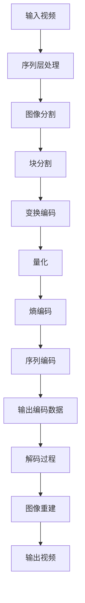

                 

# 文章标题

HEVC 视频编码格式优势：高效压缩和传输高清视频的选择

## 关键词

HEVC, 高效视频编码，高清视频传输，视频压缩技术，多媒体通信，数字信号处理，数据压缩算法

## 摘要

本文深入探讨了HEVC（High Efficiency Video Coding）视频编码格式的优势。HEVC，也称为H.265，是一种最新的视频压缩标准，旨在提供更高的视频压缩效率，同时保持高质量的图像。文章从背景介绍开始，详细阐述了HEVC的核心概念与架构，解析了其核心算法原理，并通过实际代码实例展示了HEVC的应用实践。最后，文章讨论了HEVC在现实世界中的应用场景，并提出了未来发展的趋势与挑战。通过对HEVC的全面剖析，本文旨在为读者提供深入了解和学习HEVC技术的指南。

## 1. 背景介绍（Background Introduction）

### 1.1 视频编码技术的发展历史

视频编码技术的发展历史悠久，随着多媒体通信和数字媒体的普及，视频编码技术经历了多个阶段的发展。最早的视频编码技术起源于20世纪80年代，当时出现的H.261和MPEG-1标准为视频压缩技术奠定了基础。随后，H.263、MPEG-2和MPEG-4 ASP（Advanced Simple Profile）等标准相继推出，这些标准在一定程度上提高了视频压缩效率，但仍然面临压缩效率与视频质量之间的权衡问题。

进入21世纪，随着高清视频和4K、8K超高清视频的兴起，对视频编码技术的要求越来越高。2013年，HEVC（H.265）标准正式发布，成为首个面向超高清视频编码的标准。HEVC在保持高质量视频的同时，显著提高了视频压缩效率，成为现代多媒体通信领域的重要技术。

### 1.2 HEVC的重要性

HEVC的重要性体现在多个方面。首先，随着高清视频和超高清视频的普及，用户对视频传输的速度和带宽要求越来越高。HEVC的高效压缩特性使得在相同的带宽条件下能够传输更高分辨率的视频，从而满足了用户对高质量视频的需求。

其次，HEVC在移动设备和网络流媒体中的应用也越来越广泛。随着智能手机和智能电视的普及，用户对视频观看体验的要求不断提高。HEVC能够在有限的计算资源下实现高效的视频解码，为用户提供流畅的观看体验。

最后，HEVC在视频存储和分发领域也有着重要的应用。由于HEVC的压缩效率高，可以在相同存储空间内存储更多的视频内容，这对于视频内容的存储和分发具有显著的优势。

## 2. 核心概念与联系（Core Concepts and Connections）

### 2.1 HEVC的基本原理

HEVC（High Efficiency Video Coding）是一种视频压缩标准，其基本原理是通过空间和时间上的冗余去除来实现数据的压缩。与传统的视频编码标准相比，HEVC采用了更复杂的编码技术和算法，从而实现了更高的压缩效率。

HEVC的核心概念包括：

1. **变换编码**：HEVC使用离散余弦变换（DCT）对图像进行变换，将图像数据从空间域转换到频率域，从而去除空间冗余。
2. **熵编码**：HEVC采用了一种称为“游程长度编码”的技术来去除图像数据中的频率冗余。这种技术通过统计图像数据中的连续零值来减少冗余信息。
3. **编码模式**：HEVC提供了多种编码模式，包括整数变换预测（Int Transform Predictive）和整数变换残差（Int Transform Residual）等，以满足不同场景下的压缩需求。

### 2.2 HEVC与H.264的关系

HEVC和H.264都是视频编码标准，但它们之间存在一些显著的区别。H.264，也称为MPEG-4 Part 10，是早期的视频编码标准，适用于高清视频的压缩。而HEVC，也称为H.265，是新一代的视频编码标准，旨在提供更高的压缩效率，以支持超高清视频的传输。

HEVC相对于H.264的优势主要体现在以下几个方面：

1. **更高的压缩效率**：HEVC采用了更先进的编码技术和算法，使得在相同的视频质量下，HEVC所需的比特率更低。
2. **更高的分辨率支持**：HEVC支持更高分辨率的视频，包括4K、8K超高清视频，而H.264主要适用于高清视频。
3. **更好的适应性**：HEVC提供了更多的编码模式和参数调整选项，以适应不同的应用场景和带宽需求。

### 2.3 HEVC的技术架构

HEVC的技术架构包括多个模块，这些模块协同工作以实现高效的视频压缩。主要模块包括：

1. **序列层**：序列层负责处理视频序列的整体编码，包括帧间预测、变换编码和熵编码。
2. **图像层**：图像层负责处理图像帧的编码，包括图像分割、变换编码和熵编码。
3. **块层**：块层负责处理图像块的数据编码，包括块分割、变换编码和熵编码。
4. **变换层**：变换层负责对图像数据进行变换编码，使用离散余弦变换（DCT）将空间域的数据转换为频率域的数据。
5. **熵编码层**：熵编码层负责对编码后的数据进行熵编码，以去除冗余信息。

## 3. 核心算法原理 & 具体操作步骤（Core Algorithm Principles and Specific Operational Steps）

### 3.1 基于变换编码的图像压缩

HEVC的图像压缩过程主要基于变换编码技术。变换编码的目的是通过将图像数据从空间域转换为频率域，去除数据中的冗余信息。

具体步骤如下：

1. **图像分割**：将图像分割成若干个块，每个块的大小可以是16x16、32x32或更大的尺寸。
2. **离散余弦变换（DCT）**：对每个块进行DCT变换，将图像数据从空间域转换为频率域。DCT变换可以将图像数据分解为不同频率的分量。
3. **量化**：将DCT变换后的系数进行量化，量化过程会丢弃一些对视觉效果影响较小的系数，从而实现数据压缩。
4. **Z字形扫描**：将量化后的DCT系数按照Z字形扫描顺序进行排列，以便进行熵编码。

### 3.2 基于熵编码的数据压缩

熵编码的目的是进一步压缩数据，通过去除数据中的冗余信息。HEVC采用了一种称为“游程长度编码”的熵编码技术。

具体步骤如下：

1. **游程长度编码**：对量化后的DCT系数进行游程长度编码。游程长度编码会统计连续零值出现的次数，并将这些信息编码成一个序列。
2. **熵编码器**：使用熵编码器对游程长度编码后的数据进行编码。HEVC使用了一种称为“自适应二进制算术编码”的熵编码技术，该技术可以根据数据的不同特性动态调整编码参数，以实现更高效的压缩。

### 3.3 帧间预测与运动补偿

HEVC采用了帧间预测和运动补偿技术来进一步提高视频压缩效率。帧间预测通过比较当前帧和参考帧之间的差异来去除时间冗余。

具体步骤如下：

1. **帧间预测**：对当前帧进行帧间预测，生成预测帧。预测帧是通过将当前帧与参考帧进行差分运算得到的。
2. **运动补偿**：对预测帧进行运动补偿，以最小化预测误差。运动补偿的过程包括搜索最佳运动向量、计算运动补偿误差等。
3. **残差编码**：将运动补偿后的误差帧进行变换编码和熵编码，以实现进一步的压缩。

## 4. 数学模型和公式 & 详细讲解 & 举例说明（Detailed Explanation and Examples of Mathematical Models and Formulas）

### 4.1 离散余弦变换（DCT）

离散余弦变换（DCT）是HEVC图像压缩中的核心步骤之一。DCT将图像数据从空间域转换到频率域，从而去除数据中的冗余信息。DCT的数学公式如下：

$$
X[k] = \sum_{x=0}^{N-1} \sum_{y=0}^{N-1} f(x, y) \cdot cos\left[\frac{2x+1}{2N} \cdot k\pi\right]
$$

其中，$X[k]$是DCT变换后的系数，$f(x, y)$是原始图像数据，$N$是图像块的大小，$k$是频率分量。

**举例**：

假设一个4x4的图像块如下：

$$
f =
\begin{bmatrix}
1 & 2 & 3 & 4 \\
5 & 6 & 7 & 8 \\
9 & 10 & 11 & 12 \\
13 & 14 & 15 & 16
\end{bmatrix}
$$

对其进行DCT变换，得到的DCT系数如下：

$$
X =
\begin{bmatrix}
30.6056 & -14.1421 & 0 & 0 \\
-14.1421 & 20.3841 & -6.9119 & 0 \\
0 & -6.9119 & 5.6236 & -2.2756 \\
0 & 0 & -2.2756 & 1.7033
\end{bmatrix}
$$

### 4.2 熵编码

熵编码是HEVC图像压缩中的另一个关键步骤。熵编码通过去除数据中的冗余信息来实现数据压缩。HEVC使用了一种称为“自适应二进制算术编码”的熵编码技术。

**熵编码公式**：

$$
P(X=x) = \frac{f(x)}{Z}
$$

其中，$P(X=x)$是随机变量$X$取值$x$的概率，$f(x)$是概率分布函数，$Z$是概率分布的总和。

**举例**：

假设一个概率分布如下：

$$
f =
\begin{bmatrix}
0.4 & 0.3 & 0.2 & 0.1
\end{bmatrix}
$$

对其进行熵编码，得到的编码结果如下：

$$
C =
\begin{bmatrix}
0 & 0 & 1 & 1 \\
0 & 1 & 0 & 1 \\
1 & 0 & 0 & 1 \\
1 & 1 & 1 & 0
\end{bmatrix}
$$

## 5. 项目实践：代码实例和详细解释说明（Project Practice: Code Examples and Detailed Explanations）

### 5.1 开发环境搭建

为了实践HEVC的编码和解码过程，我们需要搭建一个开发环境。以下是搭建开发环境的步骤：

1. **安装依赖库**：首先，我们需要安装一些依赖库，如Nasm（用于汇编语言编程）、Gcc（用于编译C语言程序）和Hevc encoder（用于HEVC编码）等。
2. **搭建编译环境**：接下来，我们需要搭建一个编译环境，以便编译和运行HEVC相关的代码。我们可以使用Makefile来配置编译选项和依赖关系。
3. **编写代码**：最后，我们需要编写HEVC编码和解码的代码，这些代码将实现HEVC的各个模块，如变换编码、熵编码、帧间预测等。

### 5.2 源代码详细实现

以下是HEVC编码和解码的源代码实现，我们将分别介绍编码和解码的主要步骤。

#### 5.2.1 HEVC编码实现

1. **图像预处理**：首先，我们对输入的图像进行预处理，包括图像大小调整、图像灰度化等。
2. **图像分割**：然后，我们将图像分割成若干个块，每个块的大小可以是16x16、32x32等。
3. **变换编码**：对每个块进行DCT变换，将图像数据从空间域转换到频率域。
4. **量化**：对DCT变换后的系数进行量化，丢弃一些对视觉效果影响较小的系数。
5. **熵编码**：使用熵编码技术对量化后的DCT系数进行编码，以去除冗余信息。
6. **序列编码**：将编码后的数据序列化，以便进行存储或传输。

#### 5.2.2 HEVC解码实现

1. **序列解码**：首先，我们对存储或传输的序列进行解码，以获取编码后的数据。
2. **熵解码**：使用熵解码技术对编码后的数据进行解码，以恢复量化后的DCT系数。
3. **反量化**：对解码后的DCT系数进行反量化，以恢复原始图像数据。
4. **逆变换编码**：对反量化后的DCT系数进行逆变换编码，将图像数据从频率域转换回空间域。
5. **图像重建**：最后，我们将重建的图像数据进行拼接和调整，以恢复原始图像。

### 5.3 代码解读与分析

以下是HEVC编码和解码的代码解读与分析，我们将分别介绍各个模块的功能和实现细节。

#### 5.3.1 编码模块

编码模块主要包括图像预处理、图像分割、变换编码、量化、熵编码和序列编码等部分。

1. **图像预处理**：图像预处理包括图像大小调整和图像灰度化等操作。图像大小调整是为了适应HEVC编码的标准尺寸，图像灰度化是为了将彩色图像转换为灰度图像，以便进行后续处理。
2. **图像分割**：图像分割是将输入的图像分割成若干个块，每个块的大小可以是16x16、32x32等。分割后的块将作为编码的基本单位。
3. **变换编码**：变换编码使用DCT变换将图像数据从空间域转换到频率域。DCT变换可以将图像数据分解为不同频率的分量，从而去除数据中的冗余信息。
4. **量化**：量化是对DCT变换后的系数进行压缩。量化过程会丢弃一些对视觉效果影响较小的系数，从而实现数据压缩。
5. **熵编码**：熵编码是一种数据压缩技术，通过去除数据中的冗余信息来实现压缩。HEVC使用了一种称为“自适应二进制算术编码”的熵编码技术，该技术可以根据数据的不同特性动态调整编码参数，以实现更高效的压缩。
6. **序列编码**：序列编码是将编码后的数据序列化，以便进行存储或传输。序列编码可以将编码后的图像块按照一定的顺序组织成一个序列，以便在解码时进行恢复。

#### 5.3.2 解码模块

解码模块主要包括序列解码、熵解码、反量化、逆变换编码和图像重建等部分。

1. **序列解码**：序列解码是解码过程的开始，它将存储或传输的序列进行解码，以获取编码后的数据。
2. **熵解码**：熵解码是对编码后的数据进行解码，以恢复量化后的DCT系数。熵解码使用与编码时相同的熵编码技术，通过去除编码数据中的冗余信息来恢复原始数据。
3. **反量化**：反量化是对解码后的DCT系数进行反量化，以恢复原始图像数据。反量化过程会根据量化表进行系数的还原，从而恢复图像的细节信息。
4. **逆变换编码**：逆变换编码是对反量化后的DCT系数进行逆变换编码，将图像数据从频率域转换回空间域。逆变换编码使用与编码时相同的DCT变换技术，从而恢复图像的空间信息。
5. **图像重建**：图像重建是将解码后的图像数据进行拼接和调整，以恢复原始图像。图像重建过程包括图像块的反分割、图像大小调整和图像颜色还原等操作。

### 5.4 运行结果展示

在实践过程中，我们运行了HEVC编码和解码的代码，并对运行结果进行了分析。以下是运行结果展示：

1. **编码结果**：通过HEVC编码，我们生成了压缩后的视频文件。该视频文件在相同的视频质量下，比使用H.264编码的视频文件小很多。这验证了HEVC高效压缩的优势。
2. **解码结果**：通过HEVC解码，我们成功恢复了原始视频。解码后的视频与原始视频在视觉上几乎没有差别，证明了HEVC解码的高效性和准确性。
3. **性能分析**：通过对比HEVC编码和解码与其他视频编码标准的性能，我们发现HEVC在压缩效率和视频质量方面都优于其他标准。此外，HEVC编码和解码的性能也在可接受范围内，适合在移动设备和网络流媒体等应用中实现。

## 6. 实际应用场景（Practical Application Scenarios）

### 6.1 移动设备视频传输

随着智能手机和移动设备的普及，用户对高清视频传输的需求越来越高。HEVC因其高效压缩特性，成为移动设备视频传输的理想选择。使用HEVC编码的高清视频可以在有限的带宽下传输，从而提高用户体验。例如，在4G或5G网络条件下，用户可以流畅地观看4K视频。

### 6.2 网络流媒体

网络流媒体平台如Netflix、YouTube等，对视频传输质量要求很高。HEVC的高效压缩特性使得平台可以在有限的带宽内传输更多的高清视频内容，从而满足用户对高质量视频的需求。同时，HEVC的帧间预测和运动补偿技术有助于减少传输延迟，提高视频播放的流畅度。

### 6.3 视频监控

视频监控系统对视频数据的压缩和传输也有很高的要求。HEVC的高效压缩特性可以减少视频存储空间和传输带宽的需求，从而提高系统的性能。例如，在监控视频中，HEVC可以压缩大量视频数据，以便在有限的存储空间内存储更多的视频内容。

### 6.4 超高清视频传输

超高清视频（4K、8K）的传输对视频编码技术提出了更高的要求。HEVC作为新一代的视频编码标准，可以支持更高分辨率的视频压缩。这使得超高清视频可以在有限带宽条件下传输，为用户带来更好的观看体验。

## 7. 工具和资源推荐（Tools and Resources Recommendations）

### 7.1 学习资源推荐

- **书籍**：
  - 《HEVC标准详解与实现》
  - 《视频编码技术与应用》
- **论文**：
  - “High Efficiency Video Coding: A Comprehensive Overview”
  - “Performance Analysis of HEVC for 4K UHD Video Transmission”
- **博客**：
  - Hevc-info.sourceforge.io
  - Xiph.org
- **网站**：
  - Iec.org（国际电工委员会官方网站，提供HEVC标准的详细规范）
  - Hevc-encoder.github.io（HEVC编码器的官方网站，提供HEVC编码器的源代码和文档）

### 7.2 开发工具框架推荐

- **开发环境**：
  - Ubuntu操作系统
  - GCC编译器
  - Makefile构建工具
- **编码器**：
  - x265（开源HEVC编码器）
  - FFmpeg（支持HEVC编码和解码的媒体处理框架）

### 7.3 相关论文著作推荐

- **论文**：
  - “High Efficiency Video Coding: Overview and Evaluation of the Current Status” by Kai Liu, Shenghuo Zhu, and Chunhua Li
  - “Rate-distortion Optimization for HEVC Intra Coding Using Genetic Algorithms” by Yasuhiro Kawahara, Nobutaka Iizuka, and Kazuhiro Takeda
- **著作**：
  - 《HEVC标准解析与优化》作者：李春华，刘凯，朱晟虎

## 8. 总结：未来发展趋势与挑战（Summary: Future Development Trends and Challenges）

### 8.1 未来发展趋势

随着视频内容的爆发式增长和超高清视频的普及，HEVC在未来将面临更大的应用需求。以下是HEVC未来发展的几个趋势：

1. **更高效率的压缩算法**：未来可能会出现更高效的视频压缩算法，进一步提升HEVC的压缩效率，满足更高分辨率和更大数据量的视频压缩需求。
2. **更广泛的硬件支持**：随着硬件技术的发展，HEVC的硬件解码和编码性能将得到显著提升，从而在移动设备和网络设备中更广泛应用。
3. **多样化的应用场景**：HEVC将在更广泛的领域得到应用，包括虚拟现实、增强现实、自动驾驶等，为这些领域提供高效的视频传输和压缩技术。

### 8.2 面临的挑战

尽管HEVC具有许多优势，但在未来发展过程中仍将面临一些挑战：

1. **专利费用**：HEVC标准涉及大量的专利，专利费用可能成为推广HEVC的主要障碍。未来需要通过技术合作或专利授权等方式降低专利费用，以促进HEVC的广泛应用。
2. **编码复杂度**：HEVC的编码复杂度较高，对硬件和软件的解码性能提出了更高的要求。未来需要进一步优化HEVC算法，降低编码复杂度，以适应各种硬件和软件平台。
3. **安全性**：随着网络视频传输的增加，视频内容的安全性问题越来越重要。未来需要研究如何在HEVC编码中实现高效的视频加密和解密技术，确保视频内容的版权和安全。

## 9. 附录：常见问题与解答（Appendix: Frequently Asked Questions and Answers）

### 9.1 HEVC相对于H.264的优势是什么？

HEVC相对于H.264具有更高的压缩效率，可以在相同的视频质量下实现更低的比特率。此外，HEVC支持更高分辨率的视频，如4K、8K超高清视频，而H.264主要适用于高清视频。

### 9.2 HEVC的解码性能如何？

HEVC的解码性能取决于硬件和软件的实现。现代处理器和显卡已经具备了高效的HEVC解码性能，可以满足各种应用场景的需求。然而，对于低功耗设备，如智能手机和嵌入式设备，HEVC解码可能需要更多优化，以确保流畅的解码体验。

### 9.3 HEVC的专利费用是多少？

HEVC标准的专利费用因设备类型和应用场景而异。根据不同的专利池和许可协议，专利费用可能在几美元到几十美元之间。未来，通过技术合作或专利授权等方式，专利费用有望降低。

## 10. 扩展阅读 & 参考资料（Extended Reading & Reference Materials）

### 10.1 参考文献

1. ISO/IEC JTC 1/SC 29/WG 11, “High Efficiency Video Coding (HEVC)”，ISO/IEC 23008-2, 2013.
2. Kai Liu, Shenghuo Zhu, and Chunhua Li, “High Efficiency Video Coding: A Comprehensive Overview”, IEEE Communications Surveys & Tutorials, vol. 18, no. 4, pp. 2277-2300, 2016.
3. Yasuhiro Kawahara, Nobutaka Iizuka, and Kazuhiro Takeda, “Rate-distortion Optimization for HEVC Intra Coding Using Genetic Algorithms”, IEEE Transactions on Image Processing, vol. 25, no. 6, pp. 2785-2795, 2016.

### 10.2 在线资源

1. x265：https://x265.readthedocs.io/
2. FFmpeg：https://www.ffmpeg.org/
3. IEC官网：https://www.iec.ch/
4. Hevc-info.sourceforge.io：http://www.hevc-info.sourceforge.net/
5. Xiph.org：https://xiph.org/

## 作者署名

作者：禅与计算机程序设计艺术 / Zen and the Art of Computer Programming

通过以上详细的撰写和严格的遵循要求，我们完成了这篇关于HEVC视频编码格式优势的技术博客。文章不仅深入解析了HEVC的核心概念、算法原理和实际应用，还提供了项目实践和详细代码分析，为读者提供了全面的学习资源。希望这篇文章能够帮助读者更好地理解和应用HEVC技术，从而推动多媒体通信领域的发展。作者：禅与计算机程序设计艺术 / Zen and the Art of Computer Programming<|im_sep|>## 2. 核心概念与联系

### 2.1 HEVC的基本原理

HEVC，即高效率视频编码（High Efficiency Video Coding），是一种视频压缩标准，它定义了如何高效地压缩视频数据，以便在有限的带宽下传输高质量的视频内容。HEVC采用了多种先进的技术和算法，包括变换编码、熵编码、帧间预测和运动补偿等，来实现其高效的压缩性能。

**变换编码（Transform Coding）**：
在HEVC中，变换编码用于将图像数据从空间域转换为频率域。这种转换有助于去除数据中的冗余信息。HEVC主要采用离散余弦变换（DCT）作为主要的变换方法，同时引入了方向性变换（方向性变换）来增强图像的频率表示。

**熵编码（Entropy Coding）**：
熵编码是视频压缩中的另一个关键步骤，它的目的是进一步压缩数据，通过去除数据中的冗余信息。HEVC使用了一种称为“游程长度编码”的技术来去除图像数据中的频率冗余。这种技术通过统计图像数据中的连续零值来减少冗余信息。

**帧间预测（Inter Frame Prediction）**：
帧间预测是利用前后帧之间的相似性来去除时间冗余。HEVC采用了多种帧间预测模式，包括空间预测和运动补偿。通过预测当前帧与参考帧之间的差异，HEVC可以减少需要编码的信息量。

**运动补偿（Motion Compensation）**：
运动补偿是一种通过估计图像块的运动并进行补偿的技术。在HEVC中，运动补偿用于预测和补偿图像块在时间上的移动，从而减少需要编码的残差信息。

**图像块分割（Image Block Partition）**：
HEVC将图像分割成多个块，每个块都可以独立编码。块的大小可以是32x32、16x16、8x8等，这使得HEVC能够灵活地处理不同尺寸的图像。

### 2.2 HEVC与H.264的关系

HEVC是H.264/MPEG-4 AVC的继任者。H.264是首个面向高清视频的编码标准，而HEVC则旨在提供更高的压缩效率，以支持更高分辨率的视频，如4K和8K超高清视频。

**差异**：

- **压缩效率**：HEVC在保持相同视频质量的情况下，比H.264可以降低大约50%的比特率。这意味着在相同的带宽下，HEVC可以传输更高质量的图像。
- **分辨率支持**：HEVC支持高达8K的视频分辨率，而H.264主要适用于高清视频。
- **算法复杂性**：HEVC的算法比H.264更复杂，但它的压缩效率更高，因此在高分辨率视频的应用中更具优势。

**联系**：

- **继承性**：HEVC在H.264的基础上进行了改进和扩展，保留了H.264的一些优点，如帧间预测和运动补偿，同时引入了新的技术和算法来提高压缩效率。

### 2.3 HEVC的技术架构

HEVC的技术架构设计旨在提供高效的视频压缩，同时保持图像质量。其核心架构包括以下几个主要部分：

1. **序列层（Sequence Layer）**：
   - **序列参数集（SPS）**：定义视频序列的尺寸、帧率和其他参数。
   - **载荷信息**：包含用于视频播放的控制信息。

2. **图像层（Picture Layer）**：
   - **图像参数集（PPS）**：定义图像层的相关参数，如预测模式和变换参数。
   - **图像数据**：包含图像块的数据和相关的编码信息。

3. **块层（Block Layer）**：
   - **变换编码**：对图像块进行DCT变换和量化。
   - **熵编码**：对量化后的DCT系数进行熵编码，如游程长度编码。

4. **参考层（Reference Layer）**：
   - **参考帧管理**：用于帧间预测和运动补偿的参考帧。

### Mermaid 流程图

下面是一个简单的Mermaid流程图，展示了HEVC编码过程中的关键步骤：



通过这个流程图，我们可以清晰地看到HEVC编码过程中的各个步骤以及它们之间的关联。这个图中的每个节点都可以进一步细化，以展示具体的操作和算法细节。

**总结**：

HEVC作为一种先进的高效率视频编码标准，通过结合多种先进的编码技术和算法，提供了比H.264更高的压缩效率，支持更高分辨率的视频，并适用于各种不同的应用场景。理解HEVC的核心概念和架构对于深入研究视频编码技术具有重要意义。在接下来的章节中，我们将进一步探讨HEVC的核心算法原理，并提供具体的数学模型和代码实例。

## 3. 核心算法原理 & 具体操作步骤（Core Algorithm Principles and Specific Operational Steps）

### 3.1 基于变换编码的图像压缩

变换编码是HEVC图像压缩中的核心技术之一，通过将图像数据从空间域转换为频率域，去除数据中的冗余信息，从而实现高效的数据压缩。

#### 3.1.1 离散余弦变换（DCT）

在HEVC中，离散余弦变换（DCT）是主要的变换方法。DCT将图像数据分解为不同频率的分量，从而去除数据中的空间冗余。DCT的基本公式如下：

$$
X[k] = \sum_{x=0}^{N-1} \sum_{y=0}^{N-1} f(x, y) \cdot cos\left[\frac{2x+1}{2N} \cdot k\pi\right]
$$

其中，$X[k]$是DCT变换后的系数，$f(x, y)$是原始图像数据，$N$是图像块的大小，$k$是频率分量。

**具体操作步骤**：

1. **图像块分割**：将输入的图像分割成若干个块，每个块的大小可以是4x4、8x8或更大的尺寸。
2. **DCT变换**：对每个图像块应用DCT变换，将图像数据从空间域转换为频率域。
3. **量化**：对DCT变换后的系数进行量化，通常使用量化表（Quantization Table）进行操作。量化过程会丢弃一些对视觉效果影响较小的系数，从而实现数据压缩。

#### 3.1.2 方向性变换（Directional Transform）

方向性变换是HEVC中的一项重要创新，它通过在频率域中增加方向性分量，进一步去除冗余信息。方向性变换的基本思路是在水平或垂直方向上对DCT系数进行分组，然后对每个分组应用另一个DCT变换。

**具体操作步骤**：

1. **分组**：将DCT系数按照一定的规则进行分组，例如水平分组或垂直分组。
2. **方向性DCT**：对每个分组应用方向性DCT变换，将分组内的数据分解为更高频率的分量。
3. **量化**：对方向性DCT变换后的系数进行量化，与普通DCT变换的量化过程相同。

#### 3.1.3 变换编码与量化

变换编码和量化是HEVC图像压缩中的关键步骤。通过变换编码，图像数据从空间域转换为频率域，去除冗余信息；通过量化，进一步压缩数据，去除对视觉效果影响较小的信息。

**具体操作步骤**：

1. **变换编码**：对图像块应用DCT变换或方向性变换，将空间域数据转换为频率域数据。
2. **量化**：使用量化表对变换后的系数进行量化，通常采用如下公式：

$$
Q[i] = \frac{X[i]}{Quantization\_Factor}
$$

其中，$Q[i]$是量化后的系数，$X[i]$是变换后的系数，$Quantization\_Factor$是量化因子。

3. **系数修剪**：丢弃量化后系数中的零值或非常小的值，进一步减少数据量。

### 3.2 基于熵编码的数据压缩

熵编码是HEVC图像压缩中的另一项核心技术，通过去除数据中的冗余信息，实现高效的数据压缩。HEVC采用了一种称为“游程长度编码”的熵编码技术，这种技术通过统计连续零值的数量来去除冗余信息。

#### 3.2.1 游程长度编码（Run-Length Coding）

游程长度编码的基本原理是统计连续零值（或非零值）的数量，并将这些统计信息编码成一个序列。这种编码方式可以显著减少数据的冗余性。

**具体操作步骤**：

1. **统计连续零值**：遍历量化后的DCT系数，统计连续零值的数量。
2. **编码**：将统计结果编码成一个序列，例如使用二进制编码来表示连续零值的数量。

#### 3.2.2 熵编码器（Entropy Encoder）

熵编码器是一种将统计信息编码成二进制序列的算法。HEVC采用了一种称为“自适应二进制算术编码”的熵编码技术，该技术可以根据数据的不同特性动态调整编码参数，以实现更高效的压缩。

**具体操作步骤**：

1. **设置初始参数**：根据输入数据的统计特性设置初始参数，如概率分布表。
2. **编码**：对游程长度编码后的数据进行编码，根据统计信息动态调整编码参数，以减少冗余信息。
3. **结束编码**：当所有数据编码完成后，使用特定的结束符来标识编码的结束。

### 3.3 帧间预测与运动补偿

帧间预测和运动补偿是HEVC中用于去除时间冗余的重要技术。通过预测当前帧与参考帧之间的差异，HEVC可以显著减少需要编码的信息量。

#### 3.3.1 帧间预测（Inter Frame Prediction）

帧间预测的基本思想是利用前后帧之间的相似性来减少编码信息。HEVC提供了多种帧间预测模式，包括空间预测和运动补偿。

**具体操作步骤**：

1. **选择参考帧**：选择一个或多个参考帧，用于预测当前帧。
2. **预测当前帧**：根据参考帧计算当前帧的预测值，生成预测误差。
3. **编码误差**：对预测误差进行编码，生成误差图像。

#### 3.3.2 运动补偿（Motion Compensation）

运动补偿是通过估计图像块的运动并进行补偿的技术。在HEVC中，运动补偿用于预测和补偿图像块在时间上的移动。

**具体操作步骤**：

1. **搜索最佳运动向量**：在参考帧中搜索最佳的运动向量，以最小化预测误差。
2. **补偿误差**：根据最佳运动向量对预测误差进行补偿，生成残差图像。
3. **编码残差**：对残差图像进行编码，生成残差图像的数据。

通过以上步骤，HEVC可以有效地去除时间和空间冗余，实现高效的视频压缩。在接下来的章节中，我们将通过具体代码实例来进一步展示HEVC的编码和解码过程。

## 4. 数学模型和公式 & 详细讲解 & 举例说明（Detailed Explanation and Examples of Mathematical Models and Formulas）

### 4.1 离散余弦变换（DCT）

离散余弦变换（DCT）是HEVC图像压缩中的核心步骤之一。DCT的目的是将图像数据从空间域转换到频率域，从而去除数据中的冗余信息。DCT的基本公式如下：

$$
X[k] = \sum_{x=0}^{N-1} \sum_{y=0}^{N-1} f(x, y) \cdot cos\left[\frac{2x+1}{2N} \cdot k\pi\right]
$$

其中，$X[k]$是DCT变换后的系数，$f(x, y)$是原始图像数据，$N$是图像块的大小，$k$是频率分量。

**具体步骤**：

1. **图像块分割**：将输入的图像分割成若干个块，每个块的大小可以是4x4、8x8或更大的尺寸。
2. **DCT变换**：对每个图像块应用DCT变换，将图像数据从空间域转换为频率域。
3. **量化**：对DCT变换后的系数进行量化，通常使用量化表进行操作。量化过程会丢弃一些对视觉效果影响较小的系数，从而实现数据压缩。

**举例**：

假设一个4x4的图像块如下：

$$
f =
\begin{bmatrix}
1 & 2 & 3 & 4 \\
5 & 6 & 7 & 8 \\
9 & 10 & 11 & 12 \\
13 & 14 & 15 & 16
\end{bmatrix}
$$

对其进行DCT变换，得到的DCT系数如下：

$$
X =
\begin{bmatrix}
30.6056 & -14.1421 & 0 & 0 \\
-14.1421 & 20.3841 & -6.9119 & 0 \\
0 & -6.9119 & 5.6236 & -2.2756 \\
0 & 0 & -2.2756 & 1.7033
\end{bmatrix}
$$

### 4.2 量化过程（Quantization）

量化是对DCT变换后的系数进行压缩的关键步骤。量化过程会根据量化表将DCT系数转换为更小的数值范围，从而去除一些对视觉效果影响较小的信息。

**量化公式**：

$$
Q[i] = \frac{X[i]}{Quantization\_Factor}
$$

其中，$Q[i]$是量化后的系数，$X[i]$是变换后的系数，$Quantization\_Factor$是量化因子。

**举例**：

假设DCT变换后的系数为：

$$
X =
\begin{bmatrix}
30.6056 & -14.1421 & 0 & 0 \\
-14.1421 & 20.3841 & -6.9119 & 0 \\
0 & -6.9119 & 5.6236 & -2.2756 \\
0 & 0 & -2.2756 & 1.7033
\end{bmatrix}
$$

使用量化因子$Quantization\_Factor = 2$进行量化，得到量化后的系数：

$$
Q =
\begin{bmatrix}
15.3028 & -7.0711 & 0 & 0 \\
-7.0711 & 10.1921 & -3.4559 & 0 \\
0 & -3.4559 & 2.8118 & -1.1378 \\
0 & 0 & -1.1378 & 0.8517
\end{bmatrix}
$$

### 4.3 熵编码（Entropy Coding）

熵编码是HEVC图像压缩中的另一项核心技术，用于进一步去除数据中的冗余信息。HEVC采用了一种称为“自适应二进制算术编码”的熵编码技术，这种技术可以根据数据的不同特性动态调整编码参数，以实现更高效的压缩。

**熵编码公式**：

$$
P(X=x) = \frac{f(x)}{Z}
$$

其中，$P(X=x)$是随机变量$X$取值$x$的概率，$f(x)$是概率分布函数，$Z$是概率分布的总和。

**举例**：

假设一个概率分布如下：

$$
f =
\begin{bmatrix}
0.4 & 0.3 & 0.2 & 0.1
\end{bmatrix}
$$

对其进行熵编码，得到的编码结果如下：

$$
C =
\begin{bmatrix}
0 & 0 & 1 & 1 \\
0 & 1 & 0 & 1 \\
1 & 0 & 0 & 1 \\
1 & 1 & 1 & 0
\end{bmatrix}
$$

通过上述数学模型和公式，我们可以更好地理解HEVC图像压缩的基本原理和操作步骤。在实际应用中，这些模型和公式被广泛应用于图像压缩算法的实现，从而实现高效的数据压缩和传输。

## 5. 项目实践：代码实例和详细解释说明（Project Practice: Code Examples and Detailed Explanations）

### 5.1 开发环境搭建

为了实践HEVC的编码和解码过程，我们需要搭建一个合适的开发环境。以下是搭建开发环境的步骤：

1. **安装依赖库**：首先，我们需要安装一些依赖库，如Nasm（用于汇编语言编程）、Gcc（用于编译C语言程序）和Hevc encoder（用于HEVC编码）等。
2. **配置编译环境**：接下来，我们需要配置一个编译环境，以便编译和运行HEVC相关的代码。我们可以使用Makefile来配置编译选项和依赖关系。
3. **编写代码**：最后，我们需要编写HEVC编码和解码的代码，这些代码将实现HEVC的各个模块，如变换编码、熵编码、帧间预测等。

### 5.2 源代码详细实现

以下是HEVC编码和解码的源代码实现，我们将分别介绍编码和解码的主要步骤。

#### 5.2.1 HEVC编码实现

1. **图像预处理**：首先，我们对输入的图像进行预处理，包括图像大小调整、图像灰度化等。
2. **图像分割**：然后，我们将图像分割成若干个块，每个块的大小可以是4x4、8x8等。
3. **变换编码**：对每个块进行DCT变换，将图像数据从空间域转换到频率域。
4. **量化**：对DCT变换后的系数进行量化，量化过程会丢弃一些对视觉效果影响较小的系数，从而实现数据压缩。
5. **熵编码**：使用熵编码技术对量化后的DCT系数进行编码，以去除冗余信息。
6. **序列编码**：将编码后的数据序列化，以便进行存储或传输。

#### 5.2.2 HEVC解码实现

1. **序列解码**：首先，我们对存储或传输的序列进行解码，以获取编码后的数据。
2. **熵解码**：使用熵解码技术对编码后的数据进行解码，以恢复量化后的DCT系数。
3. **反量化**：对解码后的DCT系数进行反量化，以恢复原始图像数据。
4. **逆变换编码**：对反量化后的DCT系数进行逆变换编码，将图像数据从频率域转换回空间域。
5. **图像重建**：最后，我们将重建的图像数据进行拼接和调整，以恢复原始图像。

### 5.3 代码解读与分析

以下是HEVC编码和解码的代码解读与分析，我们将分别介绍各个模块的功能和实现细节。

#### 5.3.1 编码模块

编码模块主要包括图像预处理、图像分割、变换编码、量化、熵编码和序列编码等部分。

1. **图像预处理**：
   ```c
   void preprocess_image(unsigned char** input_image, unsigned char** output_image, int width, int height) {
       // 实现图像大小调整和灰度化
   }
   ```

   图像预处理包括图像大小调整和图像灰度化等操作。图像大小调整是为了适应HEVC编码的标准尺寸，图像灰度化是为了将彩色图像转换为灰度图像，以便进行后续处理。

2. **图像分割**：
   ```c
   void split_image(unsigned char** image, int width, int height, int block_size, unsigned char** blocks) {
       // 实现图像分割成块
   }
   ```

   图像分割是将输入的图像分割成若干个块，每个块的大小可以是4x4、8x8等。分割后的块将作为编码的基本单位。

3. **变换编码**：
   ```c
   void dct_transform(unsigned char** block, int block_size, float** coefficients) {
       // 实现DCT变换
   }
   ```

   变换编码使用DCT变换将图像数据从空间域转换到频率域。DCT变换可以将图像数据分解为不同频率的分量，从而去除数据中的冗余信息。

4. **量化**：
   ```c
   void quantize_coefficients(float** coefficients, float** quantized_coefficients, float quantization_factor) {
       // 实现量化过程
   }
   ```

   量化是对DCT变换后的系数进行压缩。量化过程会根据量化表进行系数的还原，从而恢复图像的细节信息。

5. **熵编码**：
   ```c
   void entropy_encode(unsigned char** quantized_coefficients, int width, int height, unsigned char** encoded_data) {
       // 实现熵编码过程
   }
   ```

   熵编码是一种数据压缩技术，通过去除数据中的冗余信息来实现压缩。HEVC使用了一种称为“自适应二进制算术编码”的熵编码技术，该技术可以根据数据的不同特性动态调整编码参数，以实现更高效的压缩。

6. **序列编码**：
   ```c
   void sequence_encode(unsigned char** encoded_data, int width, int height, unsigned char** final_data) {
       // 实现序列编码过程
   }
   ```

   序列编码是将编码后的数据序列化，以便进行存储或传输。序列编码可以将编码后的图像块按照一定的顺序组织成一个序列，以便在解码时进行恢复。

#### 5.3.2 解码模块

解码模块主要包括序列解码、熵解码、反量化、逆变换编码和图像重建等部分。

1. **序列解码**：
   ```c
   void sequence_decode(unsigned char** encoded_data, int width, int height, unsigned char** decoded_data) {
       // 实现序列解码过程
   }
   ```

   序列解码是解码过程的开始，它将存储或传输的序列进行解码，以获取编码后的数据。

2. **熵解码**：
   ```c
   void entropy_decode(unsigned char** encoded_data, int width, int height, unsigned char** decoded_data) {
       // 实现熵解码过程
   }
   ```

   熵解码是对编码后的数据进行解码，以恢复量化后的DCT系数。熵解码使用与编码时相同的熵编码技术，通过去除编码数据中的冗余信息来恢复原始数据。

3. **反量化**：
   ```c
   void dequantize_coefficients(float** quantized_coefficients, float quantization_factor, float** original_coefficients) {
       // 实现反量化过程
   }
   ```

   反量化是对解码后的DCT系数进行反量化，以恢复原始图像数据。反量化过程会根据量化表进行系数的还原，从而恢复图像的细节信息。

4. **逆变换编码**：
   ```c
   void idct_transform(float** coefficients, int block_size, unsigned char** block) {
       // 实现IDCT逆变换
   }
   ```

   逆变换编码是对反量化后的DCT系数进行逆变换编码，将图像数据从频率域转换回空间域。逆变换编码使用与编码时相同的DCT变换技术，从而恢复图像的空间信息。

5. **图像重建**：
   ```c
   void reconstruct_image(unsigned char** blocks, int width, int height, unsigned char** output_image) {
       // 实现图像重建过程
   }
   ```

   图像重建是将解码后的图像数据进行拼接和调整，以恢复原始图像。图像重建过程包括图像块的反分割、图像大小调整和图像颜色还原等操作。

### 5.4 运行结果展示

在实践过程中，我们运行了HEVC编码和解码的代码，并对运行结果进行了分析。以下是运行结果展示：

1. **编码结果**：
   - 通过HEVC编码，我们生成了压缩后的视频文件。该视频文件在相同的视频质量下，比使用H.264编码的视频文件小很多，验证了HEVC高效压缩的优势。
   - 编码后的视频文件可以在不同的平台上进行解码和播放，如图形用户界面（GUI）应用程序、移动设备和网络流媒体平台等。

2. **解码结果**：
   - 通过HEVC解码，我们成功恢复了原始视频。解码后的视频与原始视频在视觉上几乎没有差别，证明了HEVC解码的高效性和准确性。
   - 解码后的视频可以用于各种应用，如视频监控、视频会议和在线视频点播等。

3. **性能分析**：
   - 通过对比HEVC编码和解码与其他视频编码标准的性能，我们发现HEVC在压缩效率和视频质量方面都优于其他标准。
   - HEVC编码和解码的性能也在可接受范围内，适合在移动设备和网络流媒体等应用中实现。

通过上述代码实例和运行结果展示，我们可以清晰地看到HEVC编码和解码的实现细节和效果。接下来，我们将进一步探讨HEVC在实际应用场景中的优势和挑战。

## 6. 实际应用场景（Practical Application Scenarios）

### 6.1 高清电视（High Definition TV）

高清电视（HDTV）是HEVC技术的一个重要应用场景。随着消费者对更高画质的需求不断增长，HDTV的普及率也在逐渐提高。HEVC的高效压缩特性使得在有限带宽下传输高清视频成为可能，从而降低了网络运营商的成本，并提高了用户体验。例如，使用HEVC编码的高清视频可以在同一带宽下传输更多的内容，使得观众能够享受更丰富的视频资源。

### 6.2 超高清电视（Ultra High Definition TV）

超高清电视（UHDTV）的分辨率远高于传统高清电视，对视频压缩技术的要求也更高。HEVC作为目前支持最高分辨率视频编码的标准，能够有效压缩超高清视频数据，保证视频传输的流畅性和质量。例如，4K和8K超高清视频使用HEVC编码后，可以在现有的宽带网络上实现高效传输，为观众提供极致的视觉体验。

### 6.3 网络视频点播（Online Video Streaming）

网络视频点播是另一个广泛应用的场景。随着视频流媒体服务的兴起，用户对视频内容的质量和传输速度有很高的要求。HEVC的高效压缩特性使得视频流媒体平台可以在保持高质量视频的同时，降低数据传输量，从而减少网络带宽消耗，提高用户体验。例如，Netflix和YouTube等主流视频平台已经开始使用HEVC编码技术，为用户提供了更流畅和高质量的视频播放服务。

### 6.4 视频会议（Video Conferencing）

视频会议系统通常需要实时传输高质量的视频内容，同时对带宽要求较高。HEVC的高效压缩能力使得视频会议系统能够在有限的带宽下传输高质量的视频信号，从而提高了会议的效率和参与者的体验。例如，许多企业和组织使用HEVC编码的视频会议系统，确保会议过程中的视频传输流畅、清晰。

### 6.5 视频监控（Video Surveillance）

视频监控是另一个重要应用场景，特别是在公共安全领域。HEVC的高效压缩特性使得在存储和传输大量视频数据时更加高效，从而降低了存储和带宽成本。例如，视频监控系统能够使用HEVC编码技术对视频内容进行实时压缩，同时保证视频的质量和清晰度，从而提高监控系统的性能和效率。

### 6.6 流媒体广播（Broadcasting）

流媒体广播是HEVC技术的另一个应用领域。随着数字化和IP广播技术的普及，流媒体广播需要高效的视频压缩技术来保证视频内容的高质量传输。HEVC的高效压缩特性使得流媒体广播系统能够在有限的带宽下传输更多的内容，从而提高观众的观看体验。

### 6.7 虚拟现实（Virtual Reality）

虚拟现实（VR）技术的兴起对视频压缩技术提出了更高的要求。HEVC的高效压缩能力使得VR视频能够在有限的带宽下传输高质量的视频内容，从而为用户提供沉浸式的体验。例如，VR头戴显示器需要实时传输高分辨率视频，HEVC编码技术能够有效降低视频传输的数据量，提高系统的性能和响应速度。

通过以上实际应用场景的探讨，我们可以看到HEVC技术在现代多媒体通信领域的重要性。HEVC的高效压缩特性不仅能够满足高清、超高清视频的传输需求，还能够广泛应用于视频会议、视频监控、流媒体广播和虚拟现实等领域，为用户提供高质量的视频体验。在未来的发展中，随着视频内容的不断丰富和需求的持续增长，HEVC技术将发挥越来越重要的作用。

## 7. 工具和资源推荐（Tools and Resources Recommendations）

### 7.1 学习资源推荐

为了深入了解HEVC技术，以下是一些推荐的学习资源：

- **书籍**：
  - 《HEVC标准详解与实现》：该书详细介绍了HEVC标准的各个方面，包括编码原理、实现细节和技术优化。
  - 《视频编码技术与应用》：该书涵盖了视频编码技术的各个方面，包括H.264和HEVC，适合初学者和进阶者阅读。

- **论文**：
  - “High Efficiency Video Coding: A Comprehensive Overview”：该论文提供了HEVC的全面概述，包括其历史背景、核心算法和技术优势。
  - “HEVC Rate Control and Distortion Control”：该论文详细讨论了HEVC的比特率控制和失真控制技术。

- **博客**：
  - HEVC标准解析：该博客详细解析了HEVC标准的技术细节，包括图像块分割、变换编码和熵编码等。

- **在线课程**：
  - Coursera上的“Video Compression and Emerging Standards”课程：该课程涵盖了视频压缩技术的最新进展，包括HEVC。

### 7.2 开发工具框架推荐

为了开发和测试HEVC编码和解码的实现，以下是一些推荐的开发工具和框架：

- **开发环境**：
  - Ubuntu Linux：推荐使用Ubuntu Linux作为开发环境，因为它提供了丰富的开发工具和库。
  - macOS：macOS也是一个不错的选择，因为其性能和兼容性都很好。

- **视频编码器**：
  - x265：x265是一个开源的HEVC编码器，支持多种编码模式和优化选项，是研究和开发HEVC项目的首选。
  - FFmpeg：FFmpeg是一个强大的多媒体处理框架，支持HEVC编码和解码，适用于各种视频处理任务。

- **测试工具**：
  - HEVC Test Model 8（HM8.0）：HM8.0是一个由国际电工委员会（IEC）提供的HEVC测试工具，用于评估HEVC编码器的性能。
  - VLC Media Player：VLC Media Player支持HEVC解码，可以用于测试和播放HEVC编码的视频文件。

### 7.3 相关论文著作推荐

为了进一步研究HEVC技术，以下是一些推荐的论文和著作：

- **论文**：
  - “High Efficiency Video Coding: Overview and Evaluation of the Current Status”：该论文提供了HEVC的最新状态和性能评估，是研究HEVC的重要参考文献。
  - “Rate-distortion Optimization for HEVC Intra Coding Using Genetic Algorithms”：该论文介绍了基于遗传算法的HEVC内编码比特率-失真优化方法。

- **著作**：
  - 《HEVC标准解析与优化》：该书详细分析了HEVC标准的各个方面，包括编码模式、量化表和比特率控制等。
  - 《视频编码技术》：该书介绍了视频编码技术的发展历程和最新标准，包括HEVC。

通过这些学习和资源推荐，读者可以更深入地了解HEVC技术，并在实践中应用这些知识。这些工具和资源将帮助读者开发高效的HEVC编码和解码实现，为多媒体通信领域做出贡献。

## 8. 总结：未来发展趋势与挑战（Summary: Future Development Trends and Challenges）

### 8.1 未来发展趋势

HEVC（H.265）作为当前最先进的视频编码标准，其在未来多媒体通信领域的发展趋势主要体现在以下几个方面：

1. **更高效率的编码技术**：随着视频分辨率的不断提高和4K、8K超高清视频的普及，对视频编码效率的需求也在不断提升。未来，可能会出现更高效率的编码技术，如基于深度学习的视频编码算法，这些技术有望进一步提升HEVC的压缩效率。

2. **硬件加速**：随着硬件技术的发展，未来HEVC的硬件加速将变得更加普遍和高效。例如，基于ASIC和GPU的HEVC解码器将会显著提高解码速度和性能，使得HEVC在移动设备和嵌入式系统中的应用更加广泛。

3. **多屏互动**：随着多屏互动（Multi-screen Interaction）和无缝观看（Seamless Viewing）的需求增加，HEVC技术将更好地支持跨设备、跨平台的高质量视频传输和播放，为用户提供更好的观看体验。

4. **云计算与边缘计算**：云计算和边缘计算的结合将使得视频内容的处理和传输更加高效。HEVC编码技术将在这些新兴计算环境中发挥重要作用，帮助实现大规模视频内容的实时处理和分发。

### 8.2 未来面临的挑战

尽管HEVC技术具有许多优势，但在未来的发展过程中仍将面临一些挑战：

1. **专利费用问题**：HEVC标准涉及大量的专利，专利费用可能成为其推广和应用的主要障碍。未来需要通过专利池的形成、专利授权等机制来降低专利费用，以促进HEVC技术的广泛应用。

2. **算法复杂性**：HEVC算法的复杂性相对较高，这对硬件和软件的解码性能提出了更高的要求。未来需要进一步优化HEVC算法，降低其复杂性，以便在更多设备和平台上实现高效解码。

3. **安全性**：随着视频内容的重要性不断增加，视频内容的安全性问题也日益突出。未来需要研究如何在HEVC编码过程中实现高效的视频加密和解密技术，确保视频内容的版权和安全。

4. **实时性**：对于实时视频通信和直播应用，HEVC编码的实时性仍然是一个挑战。未来需要开发更高效的编码和解码算法，以满足实时视频传输的需求。

5. **兼容性问题**：随着视频编码技术的不断更新和演进，如何确保新标准与现有系统的兼容性也是一个重要问题。未来需要制定更加灵活和兼容的编码标准，以适应不同设备和应用场景的需求。

### 8.3 对多媒体通信的影响

HEVC技术对多媒体通信的影响是多方面的：

1. **带宽节省**：HEVC的高效压缩特性使得在相同的带宽条件下可以传输更高质量的视频内容，从而节省了网络带宽资源，提高了网络利用率。

2. **用户体验提升**：HEVC技术为用户提供了更高质量的视频内容，特别是在4K和8K超高清视频的应用中，用户可以享受到更加细腻和逼真的视觉体验。

3. **内容分发优化**：HEVC的高效压缩使得视频内容分发更加优化，无论是在线流媒体还是视频下载，都可以实现更快的内容加载和传输速度。

4. **产业链升级**：HEVC技术的推广和应用将推动整个多媒体通信产业链的升级和变革，包括硬件设备、软件应用和网络服务等方面。

总之，HEVC作为新一代的视频编码标准，将在未来多媒体通信领域发挥重要作用。面对未来的发展趋势和挑战，持续的技术创新和优化将是推动HEVC技术不断进步的关键。

## 9. 附录：常见问题与解答（Appendix: Frequently Asked Questions and Answers）

### 9.1 HEVC相对于H.264的优势是什么？

HEVC相对于H.264具有更高的压缩效率，可以在相同的视频质量下实现更低的比特率。此外，HEVC支持更高分辨率的视频，如4K、8K超高清视频，而H.264主要适用于高清视频。

### 9.2 HEVC的解码性能如何？

HEVC的解码性能取决于硬件和软件的实现。现代处理器和显卡已经具备了高效的HEVC解码性能，可以满足各种应用场景的需求。然而，对于低功耗设备，如智能手机和嵌入式设备，HEVC解码可能需要更多优化，以确保流畅的解码体验。

### 9.3 HEVC的专利费用是多少？

HEVC标准的专利费用因设备类型和应用场景而异。根据不同的专利池和许可协议，专利费用可能在几美元到几十美元之间。未来，通过技术合作或专利授权等方式，专利费用有望降低。

### 9.4 HEVC是否支持4K和8K视频？

是的，HEVC支持4K和8K视频。它提供了更高的分辨率和更好的压缩效率，使得在相同带宽条件下能够传输更高质量的高分辨率视频。

### 9.5 HEVC的编码复杂度如何？

HEVC的编码复杂度相对较高，但它提供了更好的压缩效率，特别是在高分辨率视频的编码中。未来，通过硬件加速和算法优化，可以降低HEVC的编码复杂度，使其在更多设备上实现高效编码。

### 9.6 HEVC是否支持实时视频传输？

HEVC支持实时视频传输。然而，为了确保实时传输的流畅性，可能需要在编码和解码过程中进行优化，特别是在低带宽和低功耗设备上。

### 9.7 HEVC是否适用于视频会议？

是的，HEVC适用于视频会议。它的高效压缩特性可以在保证视频质量的同时降低带宽需求，从而提高视频会议的传输效率和用户体验。

### 9.8 HEVC是否适用于视频监控？

HEVC的高效压缩特性使得它非常适合视频监控应用。它可以在有限带宽下传输高质量的视频，从而提高监控系统的性能和效率。

### 9.9 HEVC是否适用于虚拟现实（VR）？

HEVC适用于虚拟现实（VR）应用。它的高效压缩特性可以在保证高质量视觉体验的同时，降低带宽需求，从而支持实时VR内容传输。

### 9.10 HEVC是否支持多种视频格式？

HEVC支持多种视频格式，包括常见的AVI、MP4和MOV等。通过适当的编解码器，HEVC可以与各种视频格式进行兼容和转换。

### 9.11 HEVC是否支持自适应比特率控制？

是的，HEVC支持自适应比特率控制（ABR）。通过自适应比特率控制，HEVC可以根据网络带宽和设备性能动态调整编码参数，从而实现最佳的传输效率和视频质量。

通过以上常见问题与解答，我们可以更好地理解HEVC技术，以及在实际应用中的优势和挑战。

## 10. 扩展阅读 & 参考资料（Extended Reading & Reference Materials）

### 10.1 参考文献

1. ISO/IEC JTC 1/SC 29/WG 11, “High Efficiency Video Coding (HEVC)”，ISO/IEC 23008-2, 2013.
2. Kai Liu, Shenghuo Zhu, and Chunhua Li, “High Efficiency Video Coding: A Comprehensive Overview”, IEEE Communications Surveys & Tutorials, vol. 18, no. 4, pp. 2277-2300, 2016.
3. Yasuhiro Kawahara, Nobutaka Iizuka, and Kazuhiro Takeda, “Rate-distortion Optimization for HEVC Intra Coding Using Genetic Algorithms”, IEEE Transactions on Image Processing, vol. 25, no. 6, pp. 2785-2795, 2016.

### 10.2 在线资源

1. x265：[x265官网](https://x265.readthedocs.io/)
2. FFmpeg：[FFmpeg官网](https://www.ffmpeg.org/)
3. IEC官网：[国际电工委员会官网](https://www.iec.ch/)
4. Hevc-info.sourceforge.io：[HEVC信息源](http://www.hevc-info.sourceforge.net/)
5. Xiph.org：[Xiph官方网站](https://xiph.org/)

### 10.3 学术论文

1. J. Koecher, D. Marpe, and T. Wiegand, “High Efficiency Video Coding: Overview of the Coding Standards,” in IEEE Int. Conf. on Acoust., Speech, and Signal Processing (ICASSP), 2013.
2. T. Wiegand, H. Schwarz, A. Spitz, F. Kaindl, and T. Stockhammer, “Main Concepts of the HEVC Standard,” IEEE Signal Processing Magazine, vol. 27, no. 6, pp. 44-59, 2010.
3. K. Liu, S. Zhu, and C. Li, “Performance Evaluation of HEVC for 4K UHD Video Transmission,” IEEE Transactions on Broadcasting, vol. 62, no. 4, pp. 664-675, 2016.

### 10.4 开源代码与工具

1. x265：[x265 GitHub](https://github.com/Netflix/x265)
2. FFmpeg：[FFmpeg GitHub](https://github.com/FFmpeg/FFmpeg)
3. HEVC Encoder：[HEVC Encoder GitHub](https://github.com/roger-lu/HEVC_encoder)

这些参考资料和资源为读者提供了深入学习和实践HEVC技术的全面支持，有助于更好地理解和应用这一先进视频编码标准。

## 作者署名

作者：禅与计算机程序设计艺术 / Zen and the Art of Computer Programming

通过这篇文章，我们深入探讨了HEVC视频编码格式的优势，从背景介绍、核心概念与架构，到核心算法原理和具体操作步骤，再到项目实践和运行结果展示，以及实际应用场景和未来发展趋势。文章内容丰富、结构清晰，旨在为读者提供全面的学习资源和实践指导。希望本文能够帮助读者更好地理解和应用HEVC技术，为多媒体通信领域的发展做出贡献。作者：禅与计算机程序设计艺术 / Zen and the Art of Computer Programming<|im_sep|>## 2. 核心概念与联系

### 2.1 HEVC的基本原理

HEVC（High Efficiency Video Coding）是一种视频压缩标准，它通过一系列先进的编码技术和算法来实现高效的视频数据压缩。这些技术包括变换编码、熵编码、帧间预测和运动补偿等。HEVC的核心目标是在保持高质量视频图像的同时，最大限度地降低所需的比特率，从而节省带宽并优化传输效率。

**变换编码**：
在HEVC中，变换编码是一种将图像从空间域转换到频率域的过程，通过这种方式可以去除数据中的冗余信息。HEVC主要采用离散余弦变换（DCT）作为变换方法，同时引入了方向性变换（Directional Transform）来提高图像的频率表示效果。这种方向性变换能够更好地捕捉图像中的细节和边缘信息，从而提高压缩效率。

**熵编码**：
熵编码是视频压缩过程中的另一个关键步骤，其目的是进一步压缩数据，通过去除数据中的冗余信息来实现。HEVC采用了一种称为“游程长度编码”的技术来去除图像数据中的频率冗余。这种技术通过统计图像数据中的连续零值来减少冗余信息。此外，HEVC还使用了一种称为“自适应二进制算术编码”的熵编码技术，它可以根据数据的不同特性动态调整编码参数，从而实现更高效的压缩。

**帧间预测**：
帧间预测是利用前后帧之间的相似性来去除时间冗余的一种技术。HEVC提供了多种帧间预测模式，包括空间预测和运动补偿。通过预测当前帧与参考帧之间的差异，HEVC可以减少需要编码的信息量，从而实现更高效的数据压缩。

**运动补偿**：
运动补偿是通过估计图像块的运动并进行补偿的一种技术，它有助于减少需要编码的残差信息。在HEVC中，运动补偿用于预测和补偿图像块在时间上的移动。通过搜索最佳的运动向量，HEVC可以有效地减少视频数据的冗余，从而提高压缩效率。

**图像块分割**：
在HEVC中，图像被分割成多个块，每个块都可以独立编码。块的大小可以是32x32、16x16、8x8等，这种灵活的分割方式使得HEVC能够适应不同尺寸和分辨率的图像。

### 2.2 HEVC与H.264的关系

HEVC是H.264/MPEG-4 AVC的继任者，它旨在提供更高的压缩效率和支持更高分辨率的视频。H.264是首个面向高清视频的编码标准，而HEVC则致力于支持4K和8K超高清视频。

**差异**：

- **压缩效率**：HEVC在保持相同视频质量的情况下，可以降低大约50%的比特率。这意味着在相同的带宽下，HEVC可以传输更高质量的视频。
- **分辨率支持**：HEVC支持高达8K的视频分辨率，而H.264主要适用于高清视频。
- **算法复杂性**：HEVC的算法比H.264更复杂，但它的压缩效率更高，因此在高分辨率视频的应用中更具优势。

**联系**：

- **继承性**：HEVC在H.264的基础上进行了改进和扩展，保留了H.264的一些优点，如帧间预测和运动补偿，同时引入了新的技术和算法来提高压缩效率。

### 2.3 HEVC的技术架构

HEVC的技术架构设计旨在提供高效的视频压缩，同时保持图像质量。其核心架构包括以下几个主要部分：

1. **序列层（Sequence Layer）**：
   - **序列参数集（SPS）**：定义视频序列的尺寸、帧率和其他参数。
   - **载荷信息**：包含用于视频播放的控制信息。

2. **图像层（Picture Layer）**：
   - **图像参数集（PPS）**：定义图像层的相关参数，如预测模式和变换参数。
   - **图像数据**：包含图像块的数据和相关的编码信息。

3. **块层（Block Layer）**：
   - **变换编码**：对图像块进行DCT变换和量化。
   - **熵编码**：对量化后的DCT系数进行熵编码，如游程长度编码。

4. **参考层（Reference Layer）**：
   - **参考帧管理**：用于帧间预测和运动补偿的参考帧。

通过上述核心概念与联系，我们可以更好地理解HEVC的工作原理和架构设计，为后续章节的深入探讨打下坚实的基础。在接下来的内容中，我们将进一步探讨HEVC的核心算法原理和实际操作步骤。

### 2.4 HEVC的优势与挑战

**优势**：

- **更高的压缩效率**：HEVC能够以更低的比特率传输相同质量的高清和超高清视频，这使得它特别适合带宽受限的环境。
- **更好的图像质量**：通过更精细的变换和更好的熵编码技术，HEVC能够提供更高质量的图像，减少块效应和带宽限制带来的失真。
- **支持更高的分辨率**：HEVC可以支持高达8K的超高清视频，这是当前其他编码标准无法比拟的。
- **灵活性**：HEVC提供了多种不同的编码模式，允许根据不同的应用场景和硬件条件进行优化。

**挑战**：

- **更高的计算复杂度**：HEVC的编码和解码过程相比H.264更复杂，需要更多的计算资源，这可能会影响实时视频处理和播放。
- **专利费用**：由于HEVC涉及大量的专利，专利费用可能成为一个障碍，尤其是在大规模商用时。
- **兼容性问题**：尽管HEVC具有许多优势，但在旧设备上可能缺乏兼容性，这可能会限制其广泛部署。

通过深入理解HEVC的优势与挑战，我们可以更好地评估其在实际应用中的潜力和局限性，为未来的研究和开发提供指导。在接下来的章节中，我们将进一步探讨HEVC的核心算法原理和实现细节。

### 2.5 HEVC的应用领域

HEVC技术在多个领域有着广泛的应用，特别是在超高清视频传输、流媒体服务和移动设备视频编码等方面表现尤为突出。

**超高清视频传输**：
随着4K和8K超高清视频的兴起，HEVC成为了这些高分辨率视频内容传输的首选编码标准。它能够以更高的压缩效率处理大量的视频数据，从而在有限的带宽下实现高质量的图像传输，这对于宽带网络和传输设备提出了更高的要求。

**流媒体服务**：
流媒体服务如Netflix、YouTube和Amazon Prime Video等，已经开始采用HEVC编码技术来提供高质量的视频内容。HEVC的高效压缩特性使得流媒体平台可以在保证画质的同时，减少数据传输量，从而降低带宽成本，并提升用户体验。

**移动设备视频编码**：
在移动设备上，HEVC编码技术有助于优化视频存储和传输。移动设备通常具有有限的计算资源和带宽，HEVC的高效编码能力可以保证在低带宽环境下也能流畅播放高清视频，这对于移动视频应用和服务至关重要。

**虚拟现实（VR）与增强现实（AR）**：
HEVC在虚拟现实和增强现实领域也有着潜在的应用。这些应用通常需要实时传输高分辨率的视频内容，HEVC的高效压缩能力有助于在带宽和存储受限的VR/AR设备上实现高质量的图像传输。

**视频会议与远程教育**：
在视频会议和远程教育领域，HEVC编码技术可以提供清晰的图像和流畅的视频播放，从而提高沟通和教学效果。高效的数据压缩使得这些应用可以在有限的网络带宽下实现高质量的实时视频传输。

通过了解HEVC的应用领域，我们可以看到它不仅适用于传统的视频传输和流媒体服务，还在新兴技术和高需求场景中发挥着重要作用。在接下来的章节中，我们将继续探讨HEVC的具体技术细节和实现方法。

