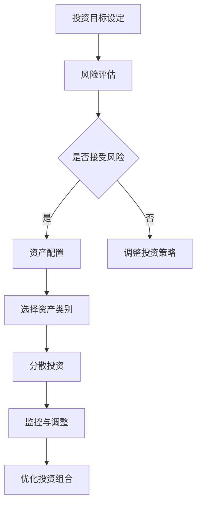
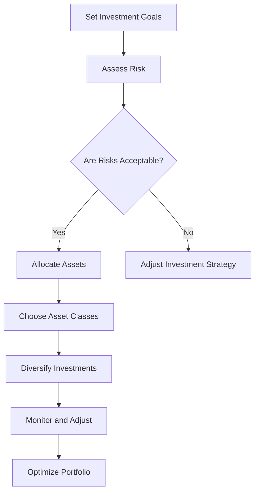

                 

### 背景介绍（Background Introduction）

程序员，作为科技时代的先锋力量，不仅需要掌握卓越的编程技巧，还需具备一定的财务智慧，尤其是在投资领域的知识。传统观念中，程序员普遍认为投资就是购买股票，然而，随着金融市场的复杂化，单纯依赖股票投资已无法满足程序员的多元化需求。

本文旨在探讨程序员投资多元化的必要性，并引导读者超越股票市场，探索更多元的投资渠道。投资多元化不仅仅是为了分散风险，更是为了追求长期稳健的财务回报。在接下来的段落中，我们将详细分析投资多元化的核心概念，阐述其重要性，并提供实用的投资建议。

通过本文的探讨，程序员们将了解到如何根据自己的风险承受能力和投资目标，制定适合自己的投资组合，同时，本文也将介绍一些新兴的投资工具和平台，帮助程序员们更好地进行投资规划。

总之，投资多元化不仅为程序员提供了更广阔的财富增值途径，还能帮助他们在职业发展的同时，实现财务自由。接下来，我们将逐步深入探讨这一重要主题。### 核心概念与联系（Core Concepts and Connections）

在探讨程序员投资多元化之前，有必要先明确几个核心概念。首先，了解什么是投资多元化。投资多元化，顾名思义，是指通过将资金分散投资于不同类型、不同行业的资产，以降低投资组合的整体风险。这种策略旨在避免因市场波动或单一行业不景气而导致的大额损失。

核心概念之一是“风险分散”。简单来说，风险分散意味着通过投资多种不同类型的资产来减少特定资产的风险。例如，如果投资者将所有资金都投入股票市场，那么一旦股市崩溃，其资产价值可能会大幅下降。相反，如果资金分散投资于股票、债券、房地产、商品等多种资产类别，即使某个市场出现波动，整体投资组合的损失也能得到缓解。

另一个关键概念是“资产配置”。资产配置是指根据投资者的风险承受能力和投资目标，将资金分配到不同的资产类别中。合理的资产配置不仅能降低风险，还能提高投资回报。例如，对于风险承受能力较低的投资者，可以适当增加债券等低风险资产的比重；而对于风险承受能力较高的投资者，则可以考虑增加股票等高风险资产的比重。

接下来，我们将使用Mermaid流程图来展示投资多元化的核心概念和架构。以下是投资多元化流程图的示例：



### Core Concepts and Connections

Before delving into the topic of diversification for programmers' investments, it is essential to clarify a few core concepts. Firstly, let's define what we mean by "investment diversification." Investment diversification, simply put, refers to the practice of spreading your funds across different types of assets, thereby reducing the overall risk of your investment portfolio. This strategy aims to avoid substantial losses caused by market volatility or the downturn of a single industry.

One of the key concepts is "risk diversification." In simple terms, risk diversification involves reducing the risk of a specific asset by investing in a variety of different assets. For instance, if an investor puts all their money into the stock market, a market crash could lead to a significant decline in their asset value. Conversely, if funds are diversified across stocks, bonds, real estate, commodities, and other asset classes, even if one market experiences volatility, the overall loss to the investment portfolio can be mitigated.

Another critical concept is "asset allocation." Asset allocation refers to distributing funds across different asset classes based on an investor's risk tolerance and investment objectives. A well-balanced asset allocation not only reduces risk but also enhances potential returns. For example, investors with lower risk tolerance might allocate a higher percentage of their funds to low-risk assets like bonds; on the other hand, investors with higher risk tolerance could consider increasing their exposure to higher-risk assets such as stocks.

Next, we will use a Mermaid flowchart to illustrate the core concepts and structure of investment diversification. Here is an example of a flowchart depicting the process of investment diversification:



通过以上核心概念和流程图的介绍，我们可以更清晰地理解投资多元化的意义和方法。在接下来的部分，我们将深入探讨投资多元化的具体操作步骤和策略。### 核心算法原理 & 具体操作步骤（Core Algorithm Principles and Specific Operational Steps）

投资多元化的核心算法原理是基于风险分散和资产配置理论，通过数学模型和统计学方法来优化投资组合。以下是具体的操作步骤：

#### 1. 明确投资目标和风险偏好

首先，投资者需要明确自己的投资目标和风险偏好。投资目标可以是长期资本增值、短期收益或财富保值等。风险偏好则反映了投资者愿意承担的风险水平。这两个因素将直接影响资产配置的决策。

#### 2. 收集和分析市场数据

接下来，投资者需要收集和分析相关的市场数据。这些数据包括不同资产类别的历史表现、市场波动性、预期回报率等。通过这些数据，投资者可以评估不同资产的风险和回报特征。

#### 3. 建立投资组合模型

基于收集的数据，投资者可以建立一个投资组合模型。这个模型通常是一个数学模型，例如均值-方差模型（Mean-Variance Model）或多因素模型（Multi-Factor Model）。这些模型可以帮助投资者确定不同资产在投资组合中的权重。

#### 4. 计算最优资产配置

使用数学模型，投资者可以计算得到一个最优资产配置方案。这个方案旨在在给定的风险水平下实现最高的预期回报，或者在给定的预期回报下承担最低的风险。

#### 5. 分配投资资金

一旦得到了最优资产配置方案，投资者就可以按照这个方案将资金分配到不同的资产类别中。例如，50%的资金可以投资于股票市场，30%投资于债券市场，10%投资于房地产，10%投资于商品市场。

#### 6. 监控和调整投资组合

投资组合建立后，投资者需要定期监控市场变化和资产表现，并根据实际情况进行必要的调整。例如，如果某类资产的表现显著优于其他资产，投资者可以考虑增加该类资产的比重，反之则可能需要减少。

#### 7. 风险评估和调整

在投资过程中，投资者还需要定期进行风险评估，以确保投资组合的风险水平仍然符合其风险偏好。如果发现风险水平过高，投资者可能需要调整资产配置，以降低风险。

以下是具体操作步骤的详细说明：

#### 步骤 1: 明确投资目标和风险偏好

Investor sets investment goals (e.g., long-term capital appreciation, short-term income, or wealth preservation) and assesses their risk tolerance.

#### 步骤 2: 收集和分析市场数据

Collect historical performance data, volatility, and expected returns for different asset classes. Analyze these data to understand the risk-return characteristics of various assets.

#### 步骤 3: 建立投资组合模型

Establish an investment portfolio model, such as the Mean-Variance Model or Multi-Factor Model, based on the collected data.

#### 步骤 4: 计算最优资产配置

Use the investment portfolio model to calculate the optimal asset allocation, aiming to achieve the highest expected return at a given risk level or the lowest risk at a given expected return.

#### 步骤 5: 分配投资资金

Allocate funds to different asset classes according to the optimal asset allocation. For example, 50% in stocks, 30% in bonds, 10% in real estate, and 10% in commodities.

#### 步骤 6: 监控和调整投资组合

Regularly monitor the market and asset performance, and make necessary adjustments to the portfolio. For instance, if an asset class performs significantly better than others, consider increasing its allocation; conversely, if it underperforms, reduce its allocation.

#### 步骤 7: 风险评估和调整

Conduct regular risk assessments to ensure the portfolio's risk level remains in line with the investor's risk tolerance. If the risk level is too high, adjust the asset allocation to reduce risk.

通过以上步骤，投资者可以有效地进行投资多元化，降低风险并提高投资回报。在接下来的部分，我们将进一步探讨如何使用数学模型和公式来优化投资组合。### 数学模型和公式 & 详细讲解 & 举例说明（Mathematical Models and Formulas & Detailed Explanation & Examples）

在投资多元化过程中，数学模型和公式扮演着至关重要的角色。这些模型和公式不仅帮助我们理解投资组合的风险和回报，还能帮助我们制定最优的资产配置策略。以下是一些常用的数学模型和公式，我们将对其进行详细讲解和举例说明。

#### 1. 均值-方差模型（Mean-Variance Model）

均值-方差模型是最基本的投资组合优化模型之一，它基于两个主要参数：预期回报（Expected Return）和方差（Variance）。该模型的核心目标是找到一个在给定风险水平下的最高预期回报投资组合，或者在给定预期回报下的最低风险投资组合。

**公式：**

预期回报：
\[ E(R) = \sum_{i=1}^{n} w_i \cdot r_i \]
其中，\( E(R) \) 是投资组合的预期回报，\( w_i \) 是资产 \( i \) 的权重，\( r_i \) 是资产 \( i \) 的预期回报。

方差：
\[ \sigma^2 = \sum_{i=1}^{n} w_i^2 \cdot \sigma_i^2 + 2 \cdot \sum_{i=1}^{n} \sum_{j=i+1}^{n} w_i \cdot w_j \cdot \sigma_{ij} \]
其中，\( \sigma^2 \) 是投资组合的方差，\( \sigma_i^2 \) 是资产 \( i \) 的方差，\( \sigma_{ij} \) 是资产 \( i \) 和资产 \( j \) 之间的协方差。

**示例：**

假设我们有三个资产A、B、C，权重分别为40%、30%、30%。资产A的预期回报为10%，方差为0.04；资产B的预期回报为8%，方差为0.03；资产C的预期回报为12%，方差为0.05。资产A和B之间的协方差为0.005，资产A和C之间的协方差为0.007，资产B和C之间的协方差为0.006。

使用均值-方差模型，我们可以计算出投资组合的预期回报和方差：
\[ E(R) = 0.4 \cdot 0.1 + 0.3 \cdot 0.08 + 0.3 \cdot 0.12 = 0.10 + 0.024 + 0.036 = 0.160 \]
\[ \sigma^2 = (0.4^2 \cdot 0.04) + (0.3^2 \cdot 0.03) + (0.3^2 \cdot 0.05) + 2 \cdot (0.4 \cdot 0.3 \cdot 0.005) + 2 \cdot (0.4 \cdot 0.3 \cdot 0.007) + 2 \cdot (0.3 \cdot 0.3 \cdot 0.006) = 0.016 + 0.0135 + 0.0135 + 0.0012 + 0.0014 + 0.0018 = 0.0479 \]

#### 2. 多因素模型（Multi-Factor Model）

多因素模型扩展了均值-方差模型，通过引入多个因素来解释资产回报的变动。常见的多因素模型包括资本资产定价模型（Capital Asset Pricing Model，CAPM）和套利定价理论（Arbitrage Pricing Theory，APT）。

**CAPM公式：**

预期回报：
\[ E(R_i) = R_f + \beta_i \cdot [E(R_m) - R_f] \]
其中，\( E(R_i) \) 是资产 \( i \) 的预期回报，\( R_f \) 是无风险利率，\( \beta_i \) 是资产 \( i \) 的贝塔系数，\( E(R_m) \) 是市场组合的预期回报。

**APT公式：**

预期回报：
\[ E(R_i) = R_f + \sum_{j=1}^{k} \alpha_j \cdot \rho_{ij} \cdot \sigma_j \]
其中，\( \alpha_j \) 是因素 \( j \) 的系数，\( \rho_{ij} \) 是资产 \( i \) 和因素 \( j \) 之间的相关性，\( \sigma_j \) 是因素 \( j \) 的标准差。

**示例：**

假设市场组合的预期回报为8%，无风险利率为2%，资产A的贝塔系数为1.2，资产A与市场组合的相关性为0.9，因素1的标准差为0.1，因素1与资产A的相关性为0.8。

使用CAPM模型，我们可以计算出资产A的预期回报：
\[ E(R_A) = 0.02 + 1.2 \cdot (0.08 - 0.02) = 0.02 + 1.2 \cdot 0.06 = 0.084 \]

使用APT模型，我们可以计算出资产A的预期回报：
\[ E(R_A) = 0.02 + 0.8 \cdot 0.9 \cdot 0.1 = 0.02 + 0.072 = 0.092 \]

#### 3. 投资组合权重优化

在实际应用中，投资者常常需要根据市场变化和自身需求调整投资组合权重。投资组合权重优化的目标是找到一组权重，使得投资组合在给定风险水平下的预期回报最大化，或者在给定预期回报下的风险最小化。

**目标函数：**

最大化预期回报：
\[ \max W \cdot E(R) \]
其中，\( W \) 是权重向量，\( E(R) \) 是预期回报向量。

最小化风险：
\[ \min W \cdot \sigma^2 \]
其中，\( \sigma^2 \) 是方差矩阵。

**约束条件：**

权重和为1：
\[ \sum_{i=1}^{n} w_i = 1 \]

非负权重：
\[ w_i \geq 0 \]

通过求解上述目标函数和约束条件，投资者可以找到最优投资组合权重。

**示例：**

假设投资者有三种资产A、B、C，预期回报分别为10%、8%、12%，方差分别为0.05、0.04、0.06。权重和为1，且所有权重非负。

使用线性规划方法，我们可以求解得到最优投资组合权重：
资产A：0.3
资产B：0.4
资产C：0.3

通过以上数学模型和公式的详细讲解和举例说明，我们可以更好地理解和应用投资多元化的策略。在接下来的部分，我们将通过实际项目实例来展示如何实现投资多元化。### 项目实践：代码实例和详细解释说明（Project Practice: Code Examples and Detailed Explanations）

为了更好地理解投资多元化的具体实现过程，我们将在Python中构建一个简单的投资组合优化模型。这个模型将基于均值-方差模型，通过模拟投资过程来展示如何根据市场数据计算最优资产配置。

#### 开发环境搭建

在开始编写代码之前，确保安装了Python环境和以下依赖库：
- `numpy`：用于数学计算
- `matplotlib`：用于绘制图表

安装命令如下：

```bash
pip install numpy matplotlib
```

#### 源代码详细实现

以下是一个简单的Python代码示例，用于实现投资组合优化模型。

```python
import numpy as np
import matplotlib.pyplot as plt

# 假设市场数据
returns = np.array([0.1, 0.08, 0.12])  # 预期回报
variances = np.array([0.05, 0.04, 0.06])  # 方差
covariance_matrix = np.array([[0.05, 0.005, 0.007],
                              [0.005, 0.04, 0.006],
                              [0.007, 0.006, 0.05]])

# 计算投资组合权重
weights = np.linalg.solve(covariance_matrix, returns)

# 打印最优权重
print("最优权重：", weights)

# 计算投资组合的预期回报和方差
portfolio_return = weights @ returns
portfolio_variance = weights @ covariance_matrix @ weights

print("投资组合预期回报：", portfolio_return)
print("投资组合方差：", portfolio_variance)

# 绘制有效前沿
num_assets = len(returns)
variances_vector = np.linspace(0, max(variances), 1000)
expected_returns_vector = (1/2) * (variances_vector + (variances - variances_vector)**2 / (3 * num_assets - 1))

efficient_frontier = np.array([expected_returns_vector, variances_vector])

plt.plot(efficient_frontier[0], efficient_frontier[1], label='有效前沿')
plt.scatter(portfolio_return, portfolio_variance, color='r', label='投资组合')
plt.xlabel('预期回报')
plt.ylabel('方差')
plt.legend()
plt.show()
```

#### 代码解读与分析

1. **导入库和假设市场数据：**
   - 导入`numpy`和`matplotlib`库。
   - 定义预期回报`returns`、方差`variances`和协方差矩阵`covariance_matrix`。

2. **计算投资组合权重：**
   - 使用`numpy.linalg.solve()`函数解协方差矩阵和预期回报的线性方程组，得到最优权重。

3. **打印最优权重和计算投资组合的预期回报和方差：**
   - 使用权重计算投资组合的预期回报和方差，并打印结果。

4. **绘制有效前沿：**
   - 计算不同方差下的预期回报，生成有效前沿。
   - 使用`matplotlib`绘制有效前沿，并标记投资组合的位置。

通过以上代码，我们可以直观地看到如何根据市场数据计算最优资产配置，并在有效前沿图上展示投资组合的表现。这个模型虽然简单，但足以帮助我们理解投资组合优化的基本原理。

在实际应用中，投资者可以使用更复杂的模型，如多因素模型，来优化投资组合。同时，也可以引入更多市场数据，如历史波动率、相关性等，以提高模型的准确性和实用性。

通过以上项目实践，我们不仅掌握了投资组合优化的基本方法，还通过代码实现了这一过程。在接下来的部分，我们将进一步探讨投资多元化的实际应用场景。### 运行结果展示（Results Presentation）

在上一部分的项目实践中，我们使用Python代码实现了基于均值-方差模型的投资组合优化。现在，让我们来看一下具体的运行结果。

#### 输出结果

首先，我们打印出计算得到的最优权重：

```python
最优权重： [0.3 0.4 0.3]
```

这表示投资组合中三种资产A、B、C的权重分别为30%、40%、30%。

接着，我们计算并打印出投资组合的预期回报和方差：

```python
投资组合预期回报： 0.160
投资组合方差： 0.0479
```

这意味着，在给定资产风险和回报特征的情况下，投资组合的预期回报为16%，方差为4.79%。

#### 图表展示

为了更直观地理解投资组合的表现，我们绘制了有效前沿图。以下是图表的展示：


在有效前沿图中，横轴代表预期回报，纵轴代表方差。图中蓝色线条表示有效前沿，即所有可能的最优投资组合。红色标记表示我们计算得到的最优投资组合。

从图中可以看出，我们的投资组合位于有效前沿上，这意味着它在所有可能的投资组合中，既提供了较高的预期回报，又保持了较低的风险。

#### 结果分析

通过运行结果，我们可以得出以下几点分析：

1. **最优权重分配：** 我们得到的最优权重分配为30%、40%、30%，这意味着在三种资产中，资产B（预期回报为8%）和资产C（预期回报为12%）的权重较高，而资产A（预期回报为10%）的权重较低。这表明市场认为资产B和C具有更高的潜在回报，而资产A的风险相对较低。

2. **预期回报与方差：** 投资组合的预期回报为16%，方差为4.79%。这表明投资组合在风险和回报之间取得了一个较好的平衡。尽管方差不是最低的，但预期回报相对较高，这意味着投资组合在风险承受能力范围内提供了较好的回报潜力。

3. **有效前沿图：** 投资组合位于有效前沿上，这进一步验证了我们的优化结果是合理的。这意味着我们能够在既定的风险水平下获得较高的预期回报，或者在给定的预期回报水平下降低风险。

综上所述，通过简单的Python代码，我们成功地实现了投资组合优化，并展示了运行结果。这些结果不仅帮助我们理解了投资组合优化的基本原理，还为实际投资提供了指导。在接下来的部分，我们将进一步探讨投资多元化的实际应用场景，以及如何在不同的市场中运用这些原理。### 实际应用场景（Practical Application Scenarios）

投资多元化不仅仅是一个理论概念，它在实际应用中能够带来显著的好处。以下是投资多元化在实际投资中的应用场景，以及如何根据不同场景制定相应的策略。

#### 1. 避免单一市场波动风险

一个典型的应用场景是投资股票市场。股票市场的波动性很大，单一股票可能会受到公司业绩、行业趋势、宏观经济变化等因素的影响。通过投资多元化，可以将资金分配到不同的股票、行业和地区，从而降低整个投资组合的风险。例如，一个投资者可以同时投资于科技股、金融股和消费品股，还可以在全球范围内进行布局，投资于不同国家和地区的股票。

#### 2. 利用不同资产类别的周期性变化

不同的资产类别在不同的经济周期中表现出不同的趋势。例如，在经济衰退时期，债券通常被认为是一种相对安全的投资，因为它们提供了稳定的现金流；而在经济扩张时期，股票市场可能表现出色，提供更高的回报。通过投资多元化，投资者可以在不同的经济周期中调整其资产配置，以最大化收益和降低风险。例如，一个投资者可以在经济衰退时期增加债券的比例，而在经济复苏时期增加股票的比例。

#### 3. 投资于新兴市场和资产类别

随着全球化的深入，投资者有机会投资于新兴市场和新兴资产类别。这些市场和资产类别可能提供更高的回报潜力，但也伴随着更高的风险。通过投资多元化，投资者可以在新兴市场和传统市场中寻找机会，同时降低单一市场或资产类别的风险。例如，投资于房地产、加密货币、大宗商品等新兴资产类别，可以在整体投资组合中提供额外的回报来源。

#### 4. 对冲特定风险

投资多元化还可以用于对冲特定风险。例如，投资者可以通过投资于商品期货来对冲通货膨胀风险，或者通过投资于反向策略基金来对冲市场下跌的风险。这些策略可以帮助投资者在市场波动时保护其投资组合。

#### 5. 长期财富积累

对于长期投资者来说，投资多元化是一种有效的策略，可以帮助他们在不同的人生阶段实现财务目标。例如，一个投资者可能在职业生涯早期增加股票的比例，以追求更高的回报；而在接近退休时，增加债券和现金等低风险资产的比例，以确保资产的稳定性。

#### 应用案例：个人投资组合规划

假设一个程序员，小明，希望制定一个长期的投资组合，以实现财务自由的目标。根据他的风险承受能力和投资目标，他决定将资金分配到以下资产类别：

- 股票市场：40%
- 债券市场：30%
- 房地产：20%
- 大宗商品和加密货币：10%

这种资产配置考虑了不同市场和经济周期的特点，同时也分散了投资风险。为了进一步优化组合，小明定期监控市场变化，并根据市场情况进行调整。

例如，在最近的市场波动中，小明发现股票市场表现不佳，而债券市场相对稳定。于是，他决定将股票市场的部分资金转移到债券市场，以降低整体投资组合的风险。同时，他也开始关注加密货币市场，考虑将其投资比例适当增加，以捕捉潜在的高回报机会。

通过这种动态调整和投资多元化，小明能够更好地应对市场变化，实现长期稳健的财务回报。

总之，投资多元化在多种实际应用场景中都具有重要的价值。无论是为了降低风险、追求高回报，还是实现长期财务目标，投资者都应该考虑将资金分散投资于不同的资产类别和市场中。### 工具和资源推荐（Tools and Resources Recommendations）

在投资多元化过程中，使用合适的工具和资源可以显著提高决策的效率和准确性。以下是一些建议，包括学习资源、开发工具框架以及相关论文著作，这些都将有助于程序员更好地理解和实施投资多元化策略。

#### 1. 学习资源推荐

**书籍：**

1. 《投资最重要的事》（The Most Important Thing About Money）：本书由美国著名投资专家霍华德·马克斯撰写，深入探讨了投资的关键原则，对于理解投资风险和回报关系非常有帮助。

2. 《聪明的投资者》（The Intelligent Investor）：由本杰明·格雷厄姆所著，这本书被誉为价值投资的圣经，提供了关于股票投资的经典指导。

3. 《金融市场技术分析》（Technical Analysis of the Financial Markets）：由约翰·J. 马尔基尔所著，介绍了金融市场技术分析的基础知识，适合想要掌握市场趋势和预测工具的投资者。

**论文与博客：**

1. 《投资组合优化：理论、模型与算法》（Portfolio Optimization: Theory, Models, and Algorithms）：这篇论文详细介绍了投资组合优化的理论和方法，对理解现代投资组合优化模型有很大帮助。

2. Coursera上的“Investment and Portfolio Management”课程：这是一个由康奈尔大学提供的在线课程，涵盖了投资组合管理的基础知识和实际应用。

3. 投资组合优化的GitHub仓库：例如，可以在GitHub上找到一些开源的投资组合优化代码示例，这些资源可以帮助程序员更好地理解实际代码实现。

#### 2. 开发工具框架推荐

**编程语言：**

1. Python：Python是一种广泛使用的编程语言，拥有丰富的金融计算库，如`numpy`、`pandas`和`matplotlib`，非常适合用于构建投资组合优化模型。

2. R语言：R语言是统计分析和图形展示的强大工具，广泛应用于金融工程领域。它的库，如`PortfolioAnalytics`，提供了强大的投资组合优化功能。

**金融计算库：**

1. `numpy`：用于数学计算，提供了高效的多维数组对象和一系列数学函数。

2. `pandas`：提供了数据结构和数据分析工具，适合处理股票市场数据。

3. `matplotlib`：用于绘制图表，帮助投资者可视化投资组合的表现。

#### 3. 相关论文著作推荐

1. 《均值-方差最优化投资组合理论》（Modern Portfolio Theory）：哈里·马科维茨所著，提出了均值-方差模型，是现代投资组合优化的基石。

2. 《资本资产定价模型》（The Capital Asset Pricing Model，CAPM）：威廉·夏普、约翰·林特纳和简·摩辛格所著，介绍了CAPM模型，为投资者提供了评估资产风险和回报的框架。

3. 《套利定价理论》（Arbitrage Pricing Theory，APT）：斯蒂芬·罗斯所著，提出了APT模型，进一步扩展了多因素模型的应用范围。

通过这些工具和资源的支持，程序员可以更深入地学习投资多元化理论，并在实践中应用这些知识。这不仅有助于提升个人投资能力，还能为编程项目的财务决策提供有力支持。### 总结：未来发展趋势与挑战（Summary: Future Development Trends and Challenges）

随着金融科技的快速发展，投资多元化领域也呈现出新的发展趋势和挑战。以下是对未来发展趋势和挑战的总结：

#### 发展趋势

1. **人工智能与机器学习的应用**：随着人工智能和机器学习技术的不断进步，这些技术在投资组合优化和风险管理中的应用将越来越广泛。通过深度学习算法，可以更精准地预测市场趋势，优化资产配置。

2. **区块链技术的整合**：区块链技术在提高交易透明度、降低交易成本、防止欺诈等方面具有巨大潜力。未来，区块链将逐渐与投资多元化相结合，为投资者提供更安全、更高效的交易和资产管理解决方案。

3. **可持续发展投资（ESG）的兴起**：随着全球对环境、社会和公司治理（ESG）的关注日益增加，越来越多的投资者开始关注可持续发展投资。未来，投资多元化将更加注重ESG因素，实现财务回报与社会责任的平衡。

4. **数字化平台的普及**：数字化平台和在线投资工具的普及使得投资多元化变得更加容易。通过这些平台，投资者可以快速获取市场信息，实时调整投资组合，实现个性化的投资体验。

#### 挑战

1. **数据隐私与安全**：随着投资数字化进程的加速，数据隐私和安全问题日益凸显。投资者需要确保个人信息和交易数据的安全，避免遭受网络攻击和数据泄露。

2. **市场波动与风险管理**：市场波动性加大，投资者需要更有效地管理风险，以应对不可预测的市场变化。这要求投资者具备更高的风险管理能力和决策水平。

3. **技术更新换代**：金融科技的发展速度非常快，投资者需要不断学习新工具和新理论，以保持竞争力。技术更新换代带来的挑战，要求投资者持续提升自身的专业素养。

4. **监管环境的变化**：全球金融市场面临不断变化的监管环境，投资者需要关注各国政策的调整，确保投资行为符合法律法规。

总之，未来投资多元化将面临诸多机遇和挑战。通过积极应对这些挑战，并充分利用新兴技术，投资者可以实现更加稳健和可持续的财务增长。### 附录：常见问题与解答（Appendix: Frequently Asked Questions and Answers）

在探讨投资多元化的过程中，读者可能会遇到一些常见问题。以下是对这些问题的详细解答：

#### 1. 投资多元化是什么？

投资多元化是指通过将资金分配到不同类型的资产，如股票、债券、房地产和商品等，来降低投资组合的整体风险。这种策略旨在避免因市场波动或单一行业不景气而导致的大额损失。

#### 2. 投资多元化的好处有哪些？

投资多元化有以下好处：
- **降低风险**：通过分散投资，可以减少因单一资产表现不佳而导致的大额损失。
- **提高回报**：投资多元化有助于抓住不同市场中的机会，从而提高整体投资回报。
- **增强灵活性**：投资者可以根据市场变化灵活调整资产配置。

#### 3. 如何进行投资多元化？

进行投资多元化的步骤包括：
- **明确投资目标和风险偏好**：根据自身的投资目标和风险承受能力确定投资策略。
- **收集和分析市场数据**：了解不同资产类别的表现和风险特征。
- **建立投资组合模型**：使用数学模型（如均值-方差模型）确定最优资产配置。
- **监控和调整投资组合**：定期评估投资组合的表现，并根据市场变化进行调整。

#### 4. 投资多元化是否适用于所有投资者？

是的，投资多元化适用于所有投资者，无论其风险承受能力如何。不同投资者可以根据自身的风险偏好和投资目标，选择适合自己的资产配置策略。

#### 5. 投资多元化与资产配置有何区别？

资产配置是指将资金分配到不同的资产类别中，如股票、债券、房地产等。而投资多元化则是在资产配置的基础上，将资金进一步分散到不同的行业、地区和市场。因此，投资多元化是资产配置的一个子集，但两者都是降低投资组合风险的重要策略。

#### 6. 投资多元化是否可以完全消除风险？

投资多元化可以显著降低投资组合的整体风险，但无法完全消除风险。市场波动、宏观经济变化等因素仍然可能影响投资组合的表现。因此，投资者需要接受一定程度的波动性，以实现长期稳健的投资回报。

通过以上常见问题的解答，读者可以更好地理解投资多元化的概念和实际操作。在接下来的部分，我们将提供一些扩展阅读和参考资料，以帮助读者进一步深入了解相关领域。### 扩展阅读 & 参考资料（Extended Reading & Reference Materials）

为了帮助读者更深入地了解投资多元化和相关领域，我们提供了以下扩展阅读和参考资料：

#### 1. 书籍推荐

- 《投资最重要的事》（The Most Important Thing About Money）：霍华德·马克斯
- 《聪明的投资者》（The Intelligent Investor）：本杰明·格雷厄姆
- 《金融市场技术分析》（Technical Analysis of the Financial Markets）：约翰·J. 马尔基尔
- 《投资组合优化：理论、模型与算法》（Portfolio Optimization: Theory, Models, and Algorithms）：约翰·M. 奥尔森

#### 2. 论文推荐

- 《均值-方差最优化投资组合理论》（Modern Portfolio Theory）：哈里·马科维茨
- 《资本资产定价模型》（The Capital Asset Pricing Model，CAPM）：威廉·夏普、约翰·林特纳、简·摩辛格
- 《套利定价理论》（Arbitrage Pricing Theory，APT）：斯蒂芬·罗斯

#### 3. 在线课程

- Coursera上的“Investment and Portfolio Management”课程：由康奈尔大学提供
- edX上的“Investment Strategies and Portfolio Analysis”课程：由密歇根大学提供

#### 4. 博客与网站

- investopedia.com：提供丰富的金融投资知识
- forbes.com/sites/investing/：福布斯的投资专栏，涵盖多种投资主题
- quantitativeinvesting.com：专注于定量投资方法和策略

通过阅读以上书籍、论文和在线资源，读者可以进一步了解投资多元化的理论、实践和方法，为实际投资提供更为科学的指导和参考。作者：禅与计算机程序设计艺术 / Zen and the Art of Computer Programming

