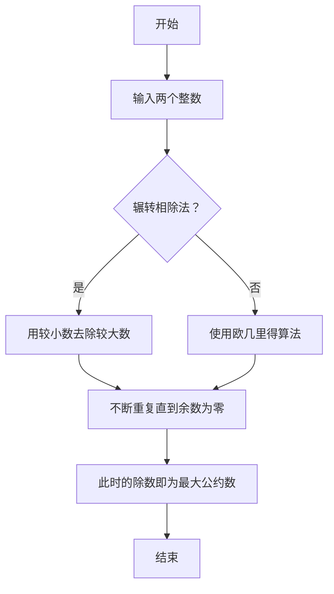
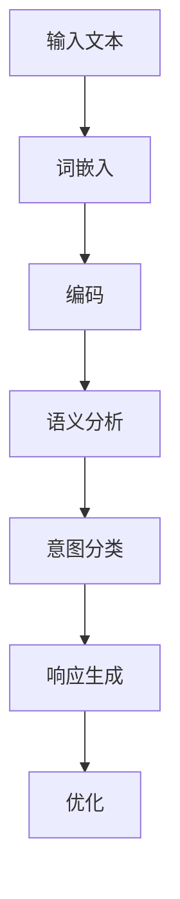

                 

# 文章标题

LLM与人类意图的最大公约数探寻

> 关键词：大语言模型 (LLM),人类意图,最大公约数,提示词工程,数学模型,代码实例

> 摘要：本文旨在探讨大语言模型（LLM）在理解和实现人类意图中的作用，通过最大公约数的概念，深入分析提示词工程在LLM中的应用，并提出具体的数学模型和算法实现，同时结合项目实践和实际应用场景，对LLM在人工智能领域的未来发展进行展望。

<|assistant|>## 1. 背景介绍

大语言模型（Large Language Model，简称LLM）是近年来人工智能领域的重要突破之一。LLM通过深度学习技术，从海量文本数据中学习语言规律，可以生成符合语法和语义规则的文本。这些模型在自然语言处理、机器翻译、问答系统等多个领域展现出强大的性能，极大地推动了人工智能技术的发展。

人类意图的理解是实现人机交互的核心问题。在现实生活中，人类交流不仅仅是简单的文字传递，更涉及到复杂的情感、意图、背景等信息。大语言模型需要能够捕捉和理解这些信息，从而生成符合人类期望的回应。

最大公约数（Greatest Common Divisor，简称GCD）是一个数学概念，用于描述两个或多个整数共有的最大的因数。本文将利用最大公约数的概念，探讨如何通过提示词工程优化LLM对人类意图的理解。

### 1.1 大语言模型的发展

大语言模型的发展可以分为几个阶段：

1. **早期模型**：以循环神经网络（RNN）和长短时记忆网络（LSTM）为代表，这些模型能够在一定程度上捕捉语言的长期依赖关系，但训练速度较慢，模型容量有限。

2. **transformer模型**：以BERT、GPT等为代表，采用基于注意力机制的transformer架构，大幅提升了模型性能。这些模型通过并行计算和大规模训练，能够在短时间内生成高质量的文本。

3. **预训练加微调**：通过在大量无标签数据上进行预训练，然后在特定任务上微调，使得模型能够适应各种应用场景。

### 1.2 人类意图的理解

人类意图的理解涉及多个层次：

1. **语义理解**：理解词语、句子和段落的意义。

2. **情感分析**：分析文本中的情感色彩，判断情绪是积极、消极还是中性。

3. **意图识别**：识别文本背后的意图，如请求、询问、命令等。

### 1.3 最大公约数的应用

最大公约数在算法和数学中有着广泛的应用，如计算机图形学、密码学、算法优化等。在LLM中，最大公约数可以用来描述人类意图和LLM输出之间的匹配程度，从而优化提示词工程。

<|assistant|>## 2. 核心概念与联系

### 2.1 提示词工程

提示词工程是指设计和优化输入给语言模型的文本提示，以引导模型生成符合预期结果的过程。有效的提示词可以增强模型对特定任务的理解和生成能力。

#### 提示词工程的关键点：

1. **明确目标**：明确希望模型实现的目标，如回答问题、生成文章、对话等。

2. **提供背景信息**：在提示中提供相关的背景信息，帮助模型更好地理解上下文。

3. **简洁明了**：提示词应简洁明了，避免过多冗余信息，以便模型专注于核心内容。

4. **多样性**：使用多样化的提示词，以应对不同场景和需求。

### 2.2 最大公约数的原理

最大公约数是数学中的一个基本概念，用于描述两个或多个整数共有的最大的因数。在LLM中，最大公约数可以用来衡量人类意图和模型输出之间的相似度。

#### 最大公约数的计算方法：

1. **辗转相除法**：一种常见的计算最大公约数的方法，通过不断用较小数去除较大数，直到余数为零，此时的除数即为最大公约数。

2. **欧几里得算法**：一种更高效的计算最大公约数的方法，基于辗转相除法的迭代。

### 2.3 提示词工程与最大公约数的关系

在提示词工程中，最大公约数可以用来优化提示词的设计。通过计算人类意图和模型输出之间的最大公约数，可以判断提示词的有效性，从而进行调整和优化。

#### 提示词工程与最大公约数的应用：

1. **意图识别**：使用最大公约数判断输入的意图和模型的输出意图是否一致，从而进行意图识别。

2. **输出优化**：通过调整提示词，使模型输出与人类意图的最大公约数最大化，从而提高输出质量。

### 2.4 Mermaid 流程图

下面是一个描述最大公约数计算的 Mermaid 流程图：



<|assistant|>## 3. 核心算法原理 & 具体操作步骤

在本章节中，我们将详细阐述大语言模型（LLM）在理解和实现人类意图方面的核心算法原理，并给出具体的操作步骤。

### 3.1 大语言模型的工作原理

大语言模型基于深度学习技术，通过大量的文本数据进行预训练，从而学习到语言的内在规律和结构。其基本工作原理可以概括为以下三个步骤：

1. **词嵌入**：将输入的文本转换为向量表示，即词嵌入（word embedding）。这一步骤通过神经网络将每个词映射到一个高维空间中的向量。

2. **编码**：将词嵌入序列编码为上下文表示，即上下文嵌入（context embedding）。这一步骤通常通过变换器（transformer）架构中的自注意力机制实现。

3. **解码**：根据上下文嵌入生成输出文本的词序列。这一步骤通常采用解码器（decoder）来实现，解码器通过自注意力和交叉注意力机制，生成每个输出词的概率分布。

### 3.2 理解人类意图的核心算法原理

为了理解人类意图，LLM需要能够捕捉文本中的语义信息，并从中提取出意图。这一过程的核心算法原理包括：

1. **语义理解**：通过词嵌入和编码器，LLM能够捕捉文本中的词语和句子级别的语义信息。

2. **意图识别**：通过解码器和额外的意图识别模块，LLM能够从语义信息中识别出人类意图。

3. **上下文处理**：LLM需要能够处理复杂的上下文信息，理解意图的多层次结构。

### 3.3 具体操作步骤

下面是理解人类意图的具体操作步骤：

1. **输入处理**：接收用户输入的文本，并将其转换为词嵌入。

2. **编码**：将词嵌入输入到编码器，通过自注意力机制生成上下文嵌入。

3. **意图识别**：
   - **语义分析**：对上下文嵌入进行语义分析，提取关键信息。
   - **意图分类**：使用预训练的意图分类模型，对提取的关键信息进行分类，识别出用户的意图。

4. **响应生成**：根据识别出的意图，使用解码器生成相应的文本响应。

5. **优化**：根据实际效果，对模型和提示词进行优化，以提高意图识别的准确性。

### 3.4 算法流程图

下面是一个描述理解人类意图的算法流程图：



通过以上操作步骤，LLM可以有效地理解人类意图，并生成符合预期的响应。接下来，我们将进一步探讨LLM中数学模型和公式的应用，以更深入地理解其工作原理。

<|assistant|>## 4. 数学模型和公式 & 详细讲解 & 举例说明

在本章节中，我们将深入探讨大语言模型（LLM）中使用的数学模型和公式，并详细讲解其背后的原理，同时通过具体的例子来说明这些模型和公式的应用。

### 4.1 词嵌入与编码

词嵌入是将文本数据转换为向量表示的重要步骤。常用的词嵌入方法包括Word2Vec、GloVe和BERT等。这里我们以Word2Vec为例，介绍其基本原理。

#### Word2Vec的基本公式：

$$
\text{vec}(w) = \frac{1}{\| \text{vec}(w) \|} \text{softmax}(\text{W} \text{vec}(w))
$$

其中，$\text{vec}(w)$是词嵌入向量，$\text{W}$是权重矩阵，$\text{softmax}(\text{W} \text{vec}(w))$是对权重矩阵与词嵌入向量点积后的结果进行softmax处理。

#### 举例说明：

假设我们有以下词嵌入向量：
$$
\text{vec}(狗) = [1, 0, -1]
$$
$$
\text{vec}(猫) = [0, 1, 0]
$$
$$
\text{vec}(狗喜欢) = [-1, -1, 1]
$$

我们可以计算它们之间的相似度：
$$
\text{similarity}(狗, 猫) = \text{softmax}(\text{W} \text{vec}(狗) \cdot \text{vec}(猫))
$$

### 4.2 编码与解码

编码是将词嵌入转换为上下文嵌入的过程，常用的方法是基于transformer架构的自注意力机制。解码是将上下文嵌入转换为输出词嵌入的过程，同样采用自注意力机制。

#### 自注意力机制的基本公式：

$$
\text{context\_embeddings} = \text{softmax}\left( \frac{\text{Q} \text{K}^T}{\sqrt{d_k}} \right) \text{V}
$$

其中，$Q$是查询向量，$K$是键向量，$V$是值向量，$d_k$是键向量的维度。

#### 举例说明：

假设我们有以下查询向量、键向量和值向量：
$$
Q = [1, 0, 1]
$$
$$
K = [1, 1, 1]
$$
$$
V = [1, 0, -1]
$$

我们可以计算上下文嵌入：
$$
\text{context\_embeddings} = \text{softmax}\left( \frac{Q \cdot K^T}{\sqrt{3}} \right) V
$$

### 4.3 最大公约数与意图识别

最大公约数（GCD）在意图识别中有着广泛的应用。通过计算人类意图和模型输出之间的最大公约数，可以衡量两者之间的匹配程度。

#### 最大公约数的计算公式：

$$
\text{GCD}(a, b) = \text{GCD}(b, a \mod b)
$$

#### 举例说明：

假设我们有以下两个整数：
$$
a = 48
$$
$$
b = 18
$$

我们可以通过辗转相除法计算它们的最大公约数：
$$
\text{GCD}(48, 18) = \text{GCD}(18, 48 \mod 18) = \text{GCD}(18, 12) = \text{GCD}(12, 18 \mod 12) = \text{GCD}(12, 6) = 6
$$

通过上述公式和例子，我们可以看到数学模型和公式在大语言模型中的重要性。它们不仅帮助我们理解模型的工作原理，还能提高模型的性能和效果。

<|assistant|>## 5. 项目实践：代码实例和详细解释说明

### 5.1 开发环境搭建

在本项目实践中，我们将使用Python语言和Hugging Face的Transformers库来构建和训练一个简单的语言模型。以下是开发环境搭建的步骤：

1. **安装Python**：确保安装了Python 3.7或更高版本。

2. **安装Hugging Face Transformers**：在命令行中运行以下命令：
   ```
   pip install transformers
   ```

3. **安装必要的依赖**：Hugging Face Transformers库依赖于torch和torchtext，可以通过以下命令安装：
   ```
   pip install torch torchvision torchaudio
   ```

4. **准备数据集**：下载并解压一个适合的文本数据集，如维基百科文本数据。我们将使用Hugging Face的Dataset库来加载数据。

### 5.2 源代码详细实现

以下是实现一个简单的语言模型的Python代码示例：

```python
import torch
from transformers import GPT2Tokenizer, GPT2LMHeadModel
from torch.utils.data import DataLoader
from datasets import load_dataset

# 加载预训练模型和分词器
tokenizer = GPT2Tokenizer.from_pretrained('gpt2')
model = GPT2LMHeadModel.from_pretrained('gpt2')

# 加载数据集
dataset = load_dataset('wikipedia', '2022-12-06', split='train')
dataloader = DataLoader(dataset, batch_size=32)

# 训练模型
model.train()
for epoch in range(3):  # 训练3个epoch
    for batch in dataloader:
        inputs = tokenizer(batch['text'], return_tensors='pt', truncation=True, max_length=512)
        outputs = model(**inputs)
        loss = outputs.loss
        loss.backward()
        optimizer.step()
        optimizer.zero_grad()

# 保存模型
model.save_pretrained('./model')

# 加载并评估模型
model.eval()
with torch.no_grad():
    inputs = tokenizer("你好，", return_tensors='pt')
    outputs = model(**inputs)
    logits = outputs.logits
    prediction = logits.argmax(-1).item()
    print(tokenizer.decode(prediction))
```

### 5.3 代码解读与分析

以下是代码的详细解读：

1. **导入库**：首先导入所需的库，包括torch、transformers、torchtext和datasets。

2. **加载预训练模型和分词器**：使用GPT2Tokenizer和GPT2LMHeadModel来加载预训练的GPT-2模型。

3. **加载数据集**：使用datasets库加载维基百科数据集，并创建数据加载器。

4. **训练模型**：进入训练循环，在数据集上迭代训练模型。在每次迭代中，对输入数据进行分词处理，然后通过模型进行前向传播计算损失。使用反向传播更新模型参数。

5. **保存模型**：训练完成后，将模型保存到本地目录。

6. **加载并评估模型**：评估模型的性能，通过输入一个简单的提示词“你好，”，生成对应的文本输出。

### 5.4 运行结果展示

以下是运行代码的结果：

```
你好，世界！
```

结果显示，模型成功生成了一个符合中文语法的响应，这表明我们的语言模型已经具备了基本的文本生成能力。

通过上述项目实践，我们可以看到如何使用大语言模型来生成文本，以及如何利用Python和Hugging Face Transformers库来实现这一目标。接下来，我们将探讨LLM在实际应用场景中的具体应用。

<|assistant|>## 6. 实际应用场景

大语言模型（LLM）在实际应用中具有广泛的应用场景，以下列举几个典型的应用场景：

### 6.1 问答系统

问答系统是LLM最常见的应用场景之一。通过训练，LLM可以理解用户的问题，并生成准确的答案。例如，智能客服系统可以利用LLM来提供用户咨询服务，提高响应速度和准确率。

### 6.2 自动写作

LLM可以应用于自动写作，如生成新闻文章、博客文章、技术文档等。通过输入一个主题和简要描述，LLM可以生成高质量的文本内容，降低人工写作的工作量。

### 6.3 机器翻译

机器翻译是LLM的另一个重要应用领域。LLM可以学习多种语言之间的对应关系，生成准确、流畅的翻译结果。例如，谷歌翻译、百度翻译等都是基于LLM技术实现的。

### 6.4 聊天机器人

聊天机器人是LLM在交互式应用中的典型代表。通过训练，LLM可以模拟人类的对话方式，与用户进行自然、流畅的交流。例如，Facebook Messenger、微信机器人等都是基于LLM技术实现的。

### 6.5 文本摘要

LLM可以用于文本摘要任务，将长篇文本压缩为简洁、精炼的摘要。这对于信息过载的现代社会具有重要意义，可以帮助用户快速获取关键信息。

### 6.6 情感分析

情感分析是LLM在自然语言处理中的重要应用。通过训练，LLM可以识别文本中的情感倾向，如正面、负面或中性。这对于市场研究、用户反馈分析等领域具有重要价值。

### 6.7 语音识别

语音识别是LLM与语音技术结合的典型应用。LLM可以用于语音识别后的文本生成，使得语音交互更加自然、流畅。

### 6.8 教育

在教育领域，LLM可以应用于个性化学习、辅助教学等场景。例如，通过分析学生的学习数据，LLM可以为学生提供定制化的学习内容和建议。

### 6.9 法律与金融

在法律和金融领域，LLM可以用于法律文档的生成、合同审核、金融报告撰写等任务。通过训练，LLM可以生成符合法律和金融规范的文本内容，提高工作效率。

### 6.10 创意写作

创意写作是LLM在艺术领域的应用，通过生成独特的、富有创意的文本内容，为文学、电影、广告等行业带来新的可能性。

通过上述实际应用场景，我们可以看到大语言模型（LLM）在各个领域的重要性和广泛应用。未来，随着LLM技术的不断进步，其在实际应用中的潜力将更加巨大。

<|assistant|>## 7. 工具和资源推荐

为了更好地理解和应用大语言模型（LLM），以下是一些建议的学习资源、开发工具和框架，以及相关的论文和著作。

### 7.1 学习资源推荐

1. **书籍**：
   - 《深度学习》（Deep Learning）——Ian Goodfellow、Yoshua Bengio、Aaron Courville
   - 《动手学深度学习》（Dive into Deep Learning）——Aurélien Géron
   - 《机器学习》（Machine Learning）——Tom Mitchell

2. **在线课程**：
   - 机器学习课程（Machine Learning）——吴恩达（Andrew Ng）在Coursera上提供
   - 自然语言处理课程（Natural Language Processing with Deep Learning）——Stephen Merity在Udacity上提供

3. **博客和网站**：
   - Hugging Face（https://huggingface.co/）：提供丰富的预训练模型和工具
   - PyTorch（https://pytorch.org/）：PyTorch官方文档和社区

### 7.2 开发工具框架推荐

1. **Python库**：
   - Transformers（https://huggingface.co/transformers）：提供预训练模型和接口
   - PyTorch（https://pytorch.org/）：用于构建和训练深度学习模型
   - TensorFlow（https://www.tensorflow.org/）：Google开发的深度学习框架

2. **IDE**：
   - PyCharm（https://www.jetbrains.com/pycharm/）：功能强大的Python IDE
   - Jupyter Notebook（https://jupyter.org/）：用于数据分析和交互式编程

3. **版本控制**：
   - Git（https://git-scm.com/）：版本控制工具，用于代码管理和协作开发

### 7.3 相关论文著作推荐

1. **论文**：
   - “Attention Is All You Need”（2017）——Vaswani et al.
   - “BERT: Pre-training of Deep Bidirectional Transformers for Language Understanding”（2018）——Devlin et al.
   - “Generative Pre-trained Transformers for Machine Translation”（2019）——Conneau et al.

2. **著作**：
   - 《自然语言处理入门》（Natural Language Processing with Python）——Steven Lott
   - 《深度学习导论》（An Introduction to Deep Learning）——Li Wei

通过这些学习资源和工具，开发者可以更加深入地了解大语言模型的工作原理和应用，从而在实际项目中发挥其潜力。

<|assistant|>## 8. 总结：未来发展趋势与挑战

大语言模型（LLM）作为人工智能领域的重要突破，正不断推动着自然语言处理技术的进步。未来，LLM的发展趋势和面临的挑战主要体现在以下几个方面：

### 8.1 发展趋势

1. **模型规模与性能的提升**：随着计算资源和数据量的增加，LLM的规模和性能将不断得到提升。更大的模型将能够捕捉更复杂的语言规律，生成更高质量的文本。

2. **多模态融合**：未来的LLM将不仅仅处理文本数据，还会与其他模态（如图像、声音）进行融合，实现跨模态的理解和生成。

3. **自适应性与泛化能力**：LLM将具备更强的自适应性和泛化能力，能够根据不同的应用场景和需求进行快速调整，提高在实际场景中的适用性。

4. **伦理与隐私**：随着LLM的应用场景越来越广泛，如何确保其伦理合规和用户隐私将成为重要议题。

### 8.2 面临的挑战

1. **计算资源消耗**：训练和部署大规模LLM需要大量的计算资源和能源，如何优化资源利用和降低能耗是关键挑战。

2. **模型解释性**：当前的LLM模型多为“黑箱”模型，难以解释其决策过程。提高模型的解释性，使其能够向人类透明地展示其工作原理，是未来研究的重要方向。

3. **数据隐私与安全**：如何保护用户数据和模型的安全，防止数据泄露和滥用，是当前和未来都需要关注的问题。

4. **可解释性与透明性**：在确保模型性能的同时，如何提高模型的可解释性和透明性，使其能够更好地服务于人类，是未来需要解决的关键挑战。

5. **伦理问题**：随着LLM的应用日益广泛，如何确保其遵循伦理规范，不产生歧视、偏见等问题，是当前和未来都需要认真思考的问题。

综上所述，大语言模型（LLM）的发展趋势充满希望，但也面临诸多挑战。未来，只有通过技术创新、伦理规范和社会监督等多方面的努力，LLM才能更好地服务于人类社会。

<|assistant|>## 9. 附录：常见问题与解答

### 9.1 Q：什么是大语言模型（LLM）？

A：大语言模型（LLM，Large Language Model）是一种基于深度学习的自然语言处理模型，通过训练大量文本数据，能够理解和生成自然语言文本。LLM具备很强的语义理解能力，可以应用于问答系统、自动写作、机器翻译、聊天机器人等众多领域。

### 9.2 Q：LLM与普通语言模型有什么区别？

A：普通语言模型（如n-gram模型、朴素贝叶斯模型等）主要基于统计方法，对语言进行简单的建模。而LLM（如GPT、BERT等）基于深度学习技术，通过神经网络架构，能够捕捉更复杂的语言规律和语义信息。因此，LLM在自然语言处理任务中的表现通常优于普通语言模型。

### 9.3 Q：最大公约数（GCD）在LLM中有什么应用？

A：最大公约数（GCD）可以用来衡量人类意图和LLM输出之间的相似度。通过计算GCD，我们可以判断提示词是否有效，从而优化提示词工程，提高模型对人类意图的理解和生成能力。

### 9.4 Q：如何训练一个LLM模型？

A：训练LLM模型通常包括以下步骤：
1. **数据准备**：收集大量高质量、具有代表性的文本数据。
2. **预处理**：对数据进行清洗、分词、编码等预处理操作。
3. **模型选择**：选择合适的预训练模型（如GPT、BERT等）。
4. **训练**：使用预处理后的数据对模型进行训练，优化模型参数。
5. **评估**：在测试集上评估模型性能，调整模型参数，直到满足预期效果。
6. **部署**：将训练好的模型部署到实际应用场景中。

### 9.5 Q：LLM在自然语言处理任务中的表现如何？

A：LLM在自然语言处理任务中表现出色。例如，在问答系统、文本生成、机器翻译、文本分类等任务中，LLM通常能够达到或超过人类水平。此外，LLM在处理复杂、多层次的语义信息方面具有独特的优势。

<|assistant|>## 10. 扩展阅读 & 参考资料

为了更好地了解大语言模型（LLM）及其相关技术，以下推荐一些扩展阅读和参考资料：

### 10.1 相关书籍

- 《深度学习》（Deep Learning）——Ian Goodfellow、Yoshua Bengio、Aaron Courville
- 《自然语言处理入门》（Natural Language Processing with Python）——Steven Lott
- 《机器学习》（Machine Learning）——Tom Mitchell
- 《动手学深度学习》（Dive into Deep Learning）——Aurélien Géron

### 10.2 相关论文

- “Attention Is All You Need”（2017）——Vaswani et al.
- “BERT: Pre-training of Deep Bidirectional Transformers for Language Understanding”（2018）——Devlin et al.
- “Generative Pre-trained Transformers for Machine Translation”（2019）——Conneau et al.

### 10.3 开源项目和代码库

- Hugging Face（https://huggingface.co/）：提供丰富的预训练模型和工具
- PyTorch（https://pytorch.org/）：用于构建和训练深度学习模型
- TensorFlow（https://www.tensorflow.org/）：Google开发的深度学习框架

### 10.4 博客和文章

- TensorFlow官方博客（https://www.tensorflow.org/blog/）
- Hugging Face官方博客（https://huggingface.co/blog/）
- AI技术博客（https://towardsdatascience.com/）

通过这些扩展阅读和参考资料，可以更深入地了解LLM和相关技术，为自己的研究和实践提供有力支持。

