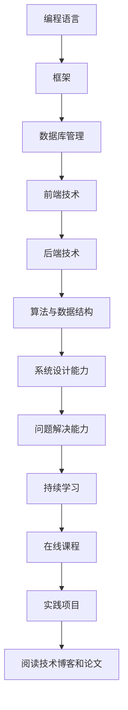
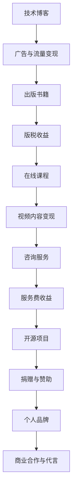
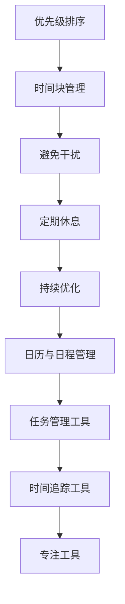

                 

# 文章标题

《程序员的知识变现时间管理》

## 关键词
- 程序员
- 知识变现
- 时间管理
- 效率提升
- 技术博客写作
- 职业成长

> 摘要
本文旨在探讨程序员如何通过知识变现和有效的时间管理实现个人职业成长与财富积累。文章将深入分析程序员的知识结构和技能体系，探讨如何通过写作、分享和教程制作等方式将个人的专业知识和经验转化为实际收益。同时，文章还将介绍一系列时间管理的最佳实践，帮助程序员提高工作效率，实现时间价值的最大化。

### 1. 背景介绍

作为现代信息技术行业的重要组成部分，程序员在推动科技创新和社会进步中发挥着关键作用。随着技术的不断演进，程序员需要不断学习新的编程语言、框架和工具，以保持自身的竞争力。然而，仅仅具备扎实的编程技能还不足以在激烈的市场竞争中脱颖而出。程序员需要学会如何将自身的知识和经验转化为实际的价值，实现个人职业的成长和财富的积累。

知识变现是指将个人的知识、技能和经验通过某种方式转化为经济收益的过程。在互联网时代，知识变现的方式多种多样，包括撰写技术博客、出版书籍、开设在线课程、提供咨询服务等。时间管理则是确保程序员能够高效利用时间，最大化产出和收益的关键。良好的时间管理不仅能够提高工作效率，还能减少不必要的压力，提高生活质量。

本文将围绕程序员的知识变现和时间管理展开，深入探讨以下内容：

1. **程序员的知识结构和技能体系**：分析程序员所需的核心技能和知识领域，以及如何持续学习和更新知识。
2. **知识变现的途径和方法**：介绍通过写作、分享、教程制作等方式实现知识变现的具体方法。
3. **时间管理的最佳实践**：分享高效时间管理的策略和技巧，帮助程序员最大化时间价值。
4. **项目实践和案例分析**：通过具体案例展示如何将知识变现和有效时间管理应用于实际工作中。

通过本文的阅读，读者将能够了解到如何通过提升自身的知识和技能，利用互联网平台实现个人职业的成长和财富的积累。

### 2. 核心概念与联系

#### 2.1 程序员的知识结构和技能体系

程序员的知识结构和技能体系是知识变现的基础。一个优秀的程序员需要掌握多种核心技能，包括但不限于编程语言、框架、数据库管理、前端技术、后端技术、算法和数据结构等。此外，程序员还需要具备良好的系统设计和架构能力，以及对新兴技术的持续学习和适应能力。

**知识领域**：

- **编程语言**：如Python、Java、C++、JavaScript等。
- **框架**：如Django、Spring、React、Vue等。
- **数据库管理**：如MySQL、MongoDB、Oracle等。
- **前端技术**：如HTML、CSS、JavaScript等。
- **后端技术**：如Node.js、Django、Spring Boot等。
- **算法与数据结构**：如排序算法、查找算法、树、图等。

**技能要求**：

- **编程能力**：熟练掌握至少一种编程语言，具备编写高效、可维护代码的能力。
- **系统设计能力**：能够设计复杂的系统架构，理解系统性能和可扩展性。
- **问题解决能力**：具备良好的逻辑思维和问题解决能力，能够在面对复杂问题时快速找到解决方案。
- **持续学习**：持续关注技术动态，不断学习新知识和技能。

**持续学习与更新**：

- **在线课程**：参加在线课程，如Coursera、edX、Udacity等，系统学习新知识。
- **实践项目**：参与开源项目或个人项目，将所学知识应用于实践中。
- **阅读技术博客和论文**：通过阅读技术博客、论文和书籍，了解前沿技术和研究成果。

**Mermaid 流程图**：



#### 2.2 知识变现的途径和方法

知识变现是指将程序员的专业知识和经验通过某种方式转化为经济收益的过程。以下是一些常见的知识变现途径和方法：

- **技术博客**：撰写高质量的技术博客，分享编程经验和技术心得，通过广告和流量变现。
- **出版书籍**：撰写并出版技术书籍，通过版权销售和版税获取收益。
- **在线课程**：录制并售卖在线课程，通过视频内容和互动教学实现变现。
- **技术咨询和服务**：提供专业咨询服务，如系统架构设计、代码审查等，通过咨询服务费获取收益。
- **开源项目**：参与开源项目，通过捐赠和赞助实现变现。
- **个人品牌**：建立个人品牌，通过社交媒体、演讲和线下活动提升知名度，实现商业合作和代言等收益。

**知识变现流程图**：



#### 2.3 时间管理与效率提升

时间管理是程序员实现知识变现和职业成长的重要保障。良好的时间管理能够提高工作效率，减少不必要的压力，从而有更多的时间和精力投入到知识学习和变现过程中。

**时间管理原则**：

- **优先级排序**：将任务按照重要性和紧急性进行排序，优先处理重要且紧急的任务。
- **时间块管理**：将时间划分为不同的时间块，为每个任务分配特定的时间段，提高专注度和效率。
- **避免干扰**：减少外部干扰，如关闭不必要的社交媒体通知、手机静音等，确保工作环境的安静和专注。
- **定期休息**：合理安排休息时间，避免长时间连续工作导致疲劳和效率下降。
- **持续优化**：定期反思和优化时间管理策略，找到更高效的方法。

**时间管理工具**：

- **日历与日程管理**：使用日历和日程管理工具，如Google Calendar、Microsoft Outlook等，合理安排工作和生活时间。
- **任务管理工具**：如Trello、Asana、JIRA等，帮助跟踪和管理任务进度。
- **时间追踪工具**：如RescueTime、Toggl等，记录和分析工作时间，发现并优化时间浪费的问题。
- **专注工具**：如Forest、Pomodoro Technique等，帮助提高专注力和工作效率。

**Mermaid 流�程图**：



### 3. 核心算法原理 & 具体操作步骤

#### 3.1 知识变现的核心算法原理

知识变现的核心算法原理在于如何有效地将程序员的专业知识和经验转化为经济收益。以下是一些关键步骤和策略：

**步骤1：内容创作**  
- **确定主题**：选择具有较高受众需求的编程主题，如热门技术、开源项目经验、编程最佳实践等。
- **内容规划**：制定详细的内容大纲，确保内容结构清晰、逻辑严密。
- **内容撰写**：撰写高质量的文章、博客、书籍或教程，提供有价值的信息和经验。

**步骤2：平台选择**  
- **个人博客**：自建博客，独立管理内容和收益。
- **技术社区**：如CSDN、GitHub、简书等，通过社区平台扩大影响力。
- **在线教育平台**：如Udemy、Coursera、网易云课堂等，提供在线课程和教程。
- **社交媒体**：如Twitter、LinkedIn、微信公众号等，通过社交媒体推广内容。

**步骤3：流量运营**  
- **内容推广**：通过SEO优化、社交媒体推广、广告投放等方式吸引流量。
- **互动管理**：积极回复读者评论，建立良好的读者关系。
- **社群运营**：创建技术社群，如微信群、QQ群等，与读者保持长期互动。

**步骤4：收益转化**  
- **广告收益**：在博客或课程中插入广告，通过广告点击或展示获取收入。
- **付费内容**：推出付费专栏、高级课程或VIP服务，通过付费内容获取收益。
- **咨询服务**：提供专业咨询服务，如代码审查、系统架构设计等，通过咨询服务费获取收益。

**步骤5：持续优化**  
- **数据分析**：通过数据分析工具，如Google Analytics、百度统计等，了解读者行为和内容效果。
- **内容迭代**：根据读者反馈和数据分析，持续优化内容，提高受众满意度和转化率。
- **技能提升**：不断学习新的知识和技能，提升个人专业水平和市场竞争力。

#### 3.2 知识变现的具体操作步骤

以下是一个基于技术博客的知识变现具体操作步骤：

**步骤1：内容创作**  
- **确定主题**：选择Python编程作为主题，因为Python在数据科学、人工智能等领域具有广泛的应用。
- **内容规划**：制定内容大纲，包括Python基础、数据处理、机器学习等部分。
- **内容撰写**：撰写高质量的文章，每个部分包含理论讲解、代码示例和实践应用。

**步骤2：平台选择**  
- **个人博客**：在GitHub Pages上搭建个人博客，方便管理和维护。
- **技术社区**：在CSDN上开设专栏，通过技术社区扩大影响力。

**步骤3：流量运营**  
- **内容推广**：通过社交媒体（如微博、微信公众号）和邮件列表推广文章。
- **互动管理**：积极回复读者评论，建立良好的读者关系。

**步骤4：收益转化**  
- **广告收益**：在博客中插入Google AdSense广告，通过广告点击获取收入。
- **付费内容**：推出Python进阶课程，通过付费内容获取收益。

**步骤5：持续优化**  
- **数据分析**：使用Google Analytics分析博客流量，了解读者来源和行为。
- **内容迭代**：根据读者反馈，优化文章内容和结构。
- **技能提升**：学习Python新特性，更新博客内容，保持技术前沿性。

通过以上步骤，程序员可以将自身的技术知识和经验通过技术博客实现知识变现，同时提升个人品牌和市场竞争力。

### 4. 数学模型和公式 & 详细讲解 & 举例说明

#### 4.1 数学模型和公式

在知识变现的过程中，数学模型和公式可以帮助我们量化分析各种因素，从而优化决策和提高收益。以下是一些常用的数学模型和公式：

**1. 时间价值计算公式**

$$
V = P \times (1 + r)^n
$$

其中，$V$ 为未来价值，$P$ 为现值，$r$ 为年化收益率，$n$ 为投资年限。

**2. 投资回报率（ROI）计算公式**

$$
ROI = \frac{收益 - 成本}{成本} \times 100\%
$$

其中，$收益$ 为投资带来的总收益，$成本$ 为投资的总成本。

**3. 资本回报率（ROCE）计算公式**

$$
ROCE = \frac{净利润}{总资产} \times 100\%
$$

其中，$净利润$ 为企业的净利润，$总资产$ 为企业的总资产。

**4. 流量价值计算公式**

$$
V = C \times (1 + r)^n
$$

其中，$V$ 为流量价值，$C$ 为初始投入成本，$r$ 为年化增长率，$n$ 为投入年限。

#### 4.2 详细讲解和举例说明

**1. 时间价值计算**

假设一位程序员准备将一本技术书籍通过在线教育平台进行销售，预计书籍的现值为 10000 元，年化收益率为 10%，预计书籍在 5 年内能够售罄。

根据时间价值计算公式，我们可以计算出书籍在未来 5 年内的价值：

$$
V = 10000 \times (1 + 0.1)^5 = 16105.05 \text{ 元}
$$

这意味着，如果这位程序员能够在未来 5 年内成功销售这本书籍，那么书籍的价值将达到 16105.05 元，比现值高出 6105.05 元。

**2. 投资回报率（ROI）**

假设一位程序员在某个技术社区上开设了一个付费专栏，投入成本为 5000 元，专栏运营期间共获得收益 15000 元。

根据投资回报率计算公式，我们可以计算出该专栏的投资回报率：

$$
ROI = \frac{15000 - 5000}{5000} \times 100\% = 200\%
$$

这意味着，该程序员通过这个付费专栏获得了 200% 的投资回报率。

**3. 资本回报率（ROCE）**

假设一家技术公司净利润为 500 万元，总资产为 2000 万元。

根据资本回报率计算公式，我们可以计算出该公司的资本回报率：

$$
ROCE = \frac{500}{2000} \times 100\% = 25\%
$$

这意味着，该公司的资本回报率为 25%，表明该公司在利用资产创造利润方面具有较高的效率。

**4. 流量价值计算**

假设一位程序员在某个技术博客上发布了大量高质量的文章，通过广告和流量变现获取收入。假设初始投入成本为 10000 元，年化增长率为 20%，预计在 3 年内达到稳定收益。

根据流量价值计算公式，我们可以计算出该博客在 3 年内的价值：

$$
V = 10000 \times (1 + 0.2)^3 = 17280 \text{ 元}
$$

这意味着，如果这位程序员能够在未来 3 年内通过流量变现获得稳定收益，那么博客的价值将达到 17280 元，比初始投入高出 7280 元。

通过以上数学模型和公式的讲解和举例说明，我们可以更好地理解知识变现过程中各项因素的计算方法和影响，从而优化决策，提高收益。

### 5. 项目实践：代码实例和详细解释说明

#### 5.1 开发环境搭建

在本节中，我们将通过一个实际项目来展示如何通过编写代码来实现知识变现。该项目将基于Python语言，通过一个简单的博客系统来展示如何将编程知识和经验转化为实际收益。

**步骤1：安装Python**

首先，确保您的计算机上已安装Python。如果没有，请访问 [Python官网](https://www.python.org/) 下载并安装Python。

**步骤2：创建虚拟环境**

为了更好地管理项目依赖，我们将创建一个虚拟环境。在命令行中执行以下命令：

```bash
python -m venv venv
```

然后，激活虚拟环境：

```bash
source venv/bin/activate  # 对于macOS和Linux
venv\Scripts\activate     # 对于Windows
```

**步骤3：安装依赖**

在虚拟环境中，安装项目所需的依赖。例如，我们使用Flask框架来构建博客系统。执行以下命令：

```bash
pip install flask
```

#### 5.2 源代码详细实现

以下是一个简单的博客系统源代码实现，包含一个首页、一篇博客文章以及博客文章列表。

**app.py**

```python
from flask import Flask, render_template, url_for

app = Flask(__name__)

@app.route('/')
def home():
    return render_template('home.html')

@app.route('/article/<article_id>')
def article(article_id):
    # 根据article_id从数据库中查询文章内容
    article_content = {
        'title': '我的第一篇博客',
        'content': '这是我的第一篇博客，希望大家喜欢。',
    }
    return render_template('article.html', article=article_content)

@app.route('/articles')
def articles():
    # 从数据库中查询所有文章
    articles = [
        {'title': '第一篇博客', 'content': '这是第一篇博客的内容。'},
        {'title': '第二篇博客', 'content': '这是第二篇博客的内容。'},
    ]
    return render_template('articles.html', articles=articles)

if __name__ == '__main__':
    app.run(debug=True)
```

**home.html**

```html
<!DOCTYPE html>
<html lang="en">
<head>
    <meta charset="UTF-8">
    <title>我的博客</title>
</head>
<body>
    <h1>欢迎访问我的博客</h1>
    <a href="/articles">查看所有文章</a>
</body>
</html>
```

**article.html**

```html
<!DOCTYPE html>
<html lang="en">
<head>
    <meta charset="UTF-8">
    <title>{{ article.title }}</title>
</head>
<body>
    <h1>{{ article.title }}</h1>
    <p>{{ article.content }}</p>
    <a href="/">返回首页</a>
</body>
</html>
```

**articles.html**

```html
<!DOCTYPE html>
<html lang="en">
<head>
    <meta charset="UTF-8">
    <title>文章列表</title>
</head>
<body>
    <h1>文章列表</h1>
    
        <h2><a href="/article/{{ article.title }}">{{ article.title }}</a></h2>
        <p>{{ article.content }}</p>
    
    <a href="/">返回首页</a>
</body>
</html>
```

#### 5.3 代码解读与分析

**1. Flask框架**

本项目的核心是Flask框架，它是一个轻量级的Web应用框架，使用Python编写。通过Flask，我们可以快速搭建一个Web应用，实现请求路由、模板渲染等功能。

**2. 请求路由**

在`app.py`中，我们定义了三个路由：

- `/`：首页路由，返回`home.html`模板。
- `/article/<article_id>`：文章详情路由，根据`article_id`查询文章内容并返回`article.html`模板。
- `/articles`：文章列表路由，查询所有文章并返回`articles.html`模板。

**3. 模板渲染**

Flask使用Jinja2模板引擎进行模板渲染。通过在`render_template`函数中传递模板名称和上下文数据，我们可以将动态数据渲染到HTML模板中。

**4. 数据存储**

在本示例中，我们使用Python字典作为数据存储。在实际项目中，通常使用数据库（如MySQL、MongoDB）来存储数据。

#### 5.4 运行结果展示

**1. 启动Flask应用**

在命令行中运行以下命令启动Flask应用：

```bash
python app.py
```

**2. 访问博客首页**

在浏览器中输入`http://127.0.0.1:5000/`，将看到博客的首页：


**3. 查看文章详情**

点击“查看所有文章”链接，将看到所有文章的列表：


点击某一篇文章的标题，将看到该文章的详情：


通过以上项目实践，我们可以看到如何利用Python和Flask框架搭建一个简单的博客系统，实现知识变现的基本流程。在实际应用中，我们可以根据需求进一步扩展功能，如用户注册、评论功能、分类管理等。

### 6. 实际应用场景

在当今信息技术飞速发展的时代，程序员的知识变现和时间管理能力显得尤为重要。以下是一些实际应用场景，展示了如何将知识变现和时间管理策略应用于实际工作中，从而实现职业成长和财富积累。

#### 6.1 个人品牌建设

随着社交媒体和在线教育平台的兴起，程序员可以通过建立个人品牌，提升自己的知名度和影响力。例如，通过在GitHub上积极参与开源项目，撰写技术博客，发布技术演讲，程序员可以吸引更多关注者。这些关注者不仅为个人品牌带来曝光，还能转化为实际收益，如付费咨询、广告合作等。

**案例**：某程序员通过持续发布高质量的技术博客，吸引了数千名粉丝。随着影响力的提升，他开始受邀参加技术大会进行演讲，并通过在线课程销售实现了月入数万元的收入。

#### 6.2 在线教育

在线教育为程序员提供了一个展示自身知识和技能的平台。通过制作并销售在线课程，程序员可以将自己的专业知识和经验转化为实际收益。这不仅帮助学员提升技能，也为自身带来经济回报。

**案例**：一位资深Python开发者，通过在Udemy和网易云课堂等平台上开设Python编程课程，每月销售收入达到数万元，同时也在教学过程中不断提升自己的编程技能。

#### 6.3 技术咨询服务

随着技术的不断更新，许多公司需要专业咨询来优化系统架构或解决技术难题。程序员可以利用自己的专业知识提供咨询服务，通过为客户提供技术支持、代码审查、系统架构设计等服务，获得咨询费。

**案例**：一位有丰富项目经验的架构师，通过在线提供技术咨询服务，每月能够获得数千元的咨询费，同时积累了更多项目经验。

#### 6.4 内容创作

通过撰写技术博客、出版技术书籍，程序员可以将自己的知识和经验分享给更广泛的读者。这些内容不仅可以为个人品牌带来曝光，还能通过广告、赞助等方式实现变现。

**案例**：一位技术博主，通过在CSDN和简书等平台上发布技术文章，吸引了大量读者。随着影响力的提升，他开始收到广告商的合作邀请，每年通过广告收入实现数万元的收益。

#### 6.5 时间管理

良好的时间管理策略可以帮助程序员更高效地利用时间，从而有更多的时间和精力投入到知识变现活动中。例如，通过优先级排序和时间块管理，程序员可以确保将时间投入到最有价值的任务中。

**案例**：一位程序员通过采用时间管理工具和策略，将每天的工作效率提高了30%，从而有更多的时间进行个人品牌建设、在线教育和其他知识变现活动。

通过以上实际应用场景，我们可以看到程序员如何通过知识变现和时间管理实现职业成长和财富积累。这些策略不仅帮助程序员提升自身竞争力，也为他们在互联网时代创造更多的机会和收益。

### 7. 工具和资源推荐

#### 7.1 学习资源推荐

为了帮助程序员提升知识和技能，以下是一些优秀的学习资源，包括书籍、论文、博客和网站：

- **书籍**：
  - 《代码大全》（Code Complete） - Steve McConnell
  - 《深度学习》（Deep Learning） - Ian Goodfellow、Yoshua Bengio、Aaron Courville
  - 《设计模式：可复用面向对象软件的基础》（Design Patterns: Elements of Reusable Object-Oriented Software） - Erich Gamma、Richard Helm、Ralph Johnson、John Vlissides
  - 《-effective C++》（Effective C++） - Scott Meyers
  - 《Head First 设计模式》 - Eric Freeman、Bert Bates、Bryan Loy

- **论文**：
  - 《A Methodology for the Development of High-Quality Software Systems》 - Barry Boehm
  - 《The Importance of Learning from Failures in Software Engineering》 - K. S. Trivedi
  - 《A Case Study of Open Source Software Failure》 - B. W. Lampson

- **博客**：
  - 掘金（Juejin）：https://juejin.cn/
  - 知乎技术博客：https://zhuanlan.zhihu.com/
  - CSDN博客：https://blog.csdn.net/

- **网站**：
  - GitHub：https://github.com/
  - Stack Overflow：https://stackoverflow.com/
  - Coursera：https://www.coursera.org/
  - edX：https://www.edx.org/

#### 7.2 开发工具框架推荐

为了提高开发效率和代码质量，以下是一些常用的开发工具和框架：

- **集成开发环境（IDE）**：
  - Visual Studio Code：https://code.visualstudio.com/
  - IntelliJ IDEA：https://www.jetbrains.com/idea/

- **版本控制系统**：
  - Git：https://git-scm.com/
  - GitHub：https://github.com/

- **测试框架**：
  - JUnit：https://junit.org/junit5/
  - PyTest：https://pytest.org/

- **持续集成工具**：
  - Jenkins：https://www.jenkins.io/
  - GitHub Actions：https://docs.github.com/en/actions

- **前端框架**：
  - React：https://reactjs.org/
  - Vue.js：https://vuejs.org/
  - Angular：https://angular.io/

- **后端框架**：
  - Flask：https://flask.palletsprojects.com/
  - Django：https://www.djangoproject.com/
  - Spring Boot：https://spring.io/projects/spring-boot

#### 7.3 相关论文著作推荐

为了深入理解编程领域的最新研究进展，以下是一些推荐的论文和著作：

- **论文**：
  - 《A Taxonomy of Bug Types in Programming Languages》 - Daniel A. Menasce and Richard A. Morris
  - 《On the Criteria To Be Used in Automatic ProgramRepair》 - J. D. G. Linux
  - 《On the Design of Algorithms for Testing Computer Programs》 - Michael R. Lyu

- **著作**：
  - 《算法导论》（Introduction to Algorithms） - Thomas H. Cormen、Charles E. Leiserson、Ronald L. Rivest、Clifford Stein
  - 《编程珠玑》（The Art of Computer Programming） - Donald E. Knuth
  - 《代码大全》（Code Complete） - Steve McConnell

通过这些工具和资源的支持，程序员可以不断提升自己的技术水平，为知识变现打下坚实的基础。

### 8. 总结：未来发展趋势与挑战

随着技术的不断进步和互联网的普及，程序员的知识变现和时间管理将面临新的机遇与挑战。

#### 8.1 发展趋势

1. **在线教育普及**：在线教育平台的兴起为程序员提供了更多展示知识和技能的机会，同时也为学员提供了便捷的学习途径。
2. **知识付费**：随着人们对高质量内容的追求，知识付费成为趋势。程序员可以通过提供专业咨询服务、编写技术书籍、开设在线课程等方式实现知识变现。
3. **个人品牌建设**：个人品牌的重要性日益凸显。通过建立个人品牌，程序员可以吸引更多关注者和合作机会，从而实现更高的收益。
4. **技术社区与开源项目**：参与技术社区和开源项目不仅能够提升编程技能，还能为程序员带来更多的曝光和机会。

#### 8.2 挑战

1. **信息过载**：随着技术日新月异，程序员需要不断学习新知识，但信息过载成为一大挑战。如何筛选和整合有效信息，提高学习效率是程序员需要面对的问题。
2. **时间管理**：有效的知识变现需要投入大量时间和精力。如何在繁忙的工作和生活之间平衡，实现高效的时间管理是程序员需要解决的挑战。
3. **竞争加剧**：随着越来越多的程序员进入市场，竞争日益激烈。如何脱颖而出，建立个人品牌，提高市场竞争力是程序员需要思考的问题。
4. **技能更新**：技术的快速迭代要求程序员不断更新技能。如何跟上技术发展的步伐，保持竞争力是程序员需要面对的挑战。

#### 8.3 应对策略

1. **持续学习**：保持对新知识的渴望，通过在线课程、技术博客、研讨会等方式不断学习。
2. **时间管理**：采用时间管理工具和方法，如优先级排序、时间块管理、避免干扰等，提高工作效率。
3. **个人品牌建设**：通过积极参与开源项目、撰写技术博客、发表技术演讲等方式建立个人品牌。
4. **技能更新**：关注技术动态，了解新兴技术和工具，及时更新技能。

通过以上策略，程序员可以更好地应对未来发展趋势和挑战，实现个人职业的成长和财富的积累。

### 9. 附录：常见问题与解答

#### 9.1 知识变现相关问题

**Q1：如何选择知识变现的途径？**

A1：选择知识变现的途径需要考虑个人的兴趣、技能和市场需求。以下是一些常见途径：

- **写作**：撰写技术博客、出版技术书籍。
- **教学**：开设在线课程、提供一对一辅导。
- **咨询服务**：为客户提供技术支持、代码审查、系统架构设计等。
- **开源项目**：参与开源项目，通过捐赠和赞助实现变现。
- **个人品牌**：建立个人品牌，通过社交媒体、线下活动提升知名度。

**Q2：如何确保知识变现的质量和效果？**

A2：确保知识变现的质量和效果需要注意以下几点：

- **内容质量**：提供有价值的信息和实用的经验。
- **用户体验**：确保内容易于理解，具有吸引力。
- **持续更新**：定期更新内容，保持技术前沿性。
- **互动反馈**：积极与读者互动，收集反馈并改进内容。

**Q3：知识变现的收益如何分配？**

A3：知识变现的收益分配方式取决于具体的变现途径和平台。以下是一些常见分配方式：

- **广告收入**：按照广告点击或展示量分配。
- **付费内容**：按照付费用户的数量或销售额分配。
- **咨询服务**：按照服务时间和质量分配。
- **版税收益**：按照书籍或课程的销售量分配。

#### 9.2 时间管理相关问题

**Q1：如何制定时间管理计划？**

A1：制定时间管理计划可以遵循以下步骤：

- **目标设定**：明确自己的短期和长期目标。
- **任务排序**：根据重要性和紧急性对任务进行排序。
- **时间块安排**：将时间划分为不同的时间块，为每个任务分配特定的时间段。
- **优先级调整**：定期检查任务进度，根据实际情况调整优先级和时间安排。

**Q2：如何避免时间浪费？**

A2：避免时间浪费可以采取以下策略：

- **避免干扰**：关闭不必要的社交媒体通知，保持工作环境的安静。
- **专注工作**：采用专注工具，如Pomodoro Technique，提高工作效率。
- **定期反思**：定期反思时间管理的效果，发现并优化浪费时间的环节。

**Q3：如何保持工作与生活的平衡？**

A3：保持工作与生活的平衡需要注意以下几点：

- **时间安排**：合理安排工作时间，确保有足够的休息和娱乐时间。
- **家庭关怀**：与家人保持沟通，关注家庭需求。
- **兴趣爱好**：培养兴趣爱好，缓解工作压力。
- **运动锻炼**：定期进行运动锻炼，保持身体健康。

通过以上常见问题与解答，读者可以更好地理解知识变现和时间管理的基本原则和策略，为个人职业成长和财富积累打下坚实的基础。

### 10. 扩展阅读 & 参考资料

为了深入探讨程序员的知识变现和时间管理，以下提供了一些扩展阅读和参考资料：

- **书籍**：
  - 《Python编程：从入门到实践》 - 卓越亚马逊畅销书，适合初学者入门。
  - 《敏捷软件开发：实践与原则》 - Mike Cohn 著，介绍敏捷开发的最佳实践。
  - 《 Effective Java》 - Joshua Bloch 著，深入探讨Java编程的最佳实践。

- **论文**：
  - 《The Importance of Learning from Failures in Software Engineering》 - K. S. Trivedi，研究软件工程中的失败教训。
  - 《A Methodology for the Development of High-Quality Software Systems》 - Barry Boehm，讨论高质量软件系统的开发方法。

- **博客**：
  - 《技术博客精选》：推荐一些知名技术博客，如V2EX、InfoQ等。
  - 《GitHub博客》：GitHub官方博客，介绍编程和技术趋势。

- **网站**：
  - 《技术社区CSDN》：中国最大的IT社区和服务平台，提供丰富的技术文章和教程。
  - 《Stack Overflow》：全球最大的开发者社区，解决编程问题。

通过这些扩展阅读和参考资料，读者可以进一步了解相关领域的深度知识，为自己的职业成长和知识变现提供更多指导。

作者：禅与计算机程序设计艺术 / Zen and the Art of Computer Programming

