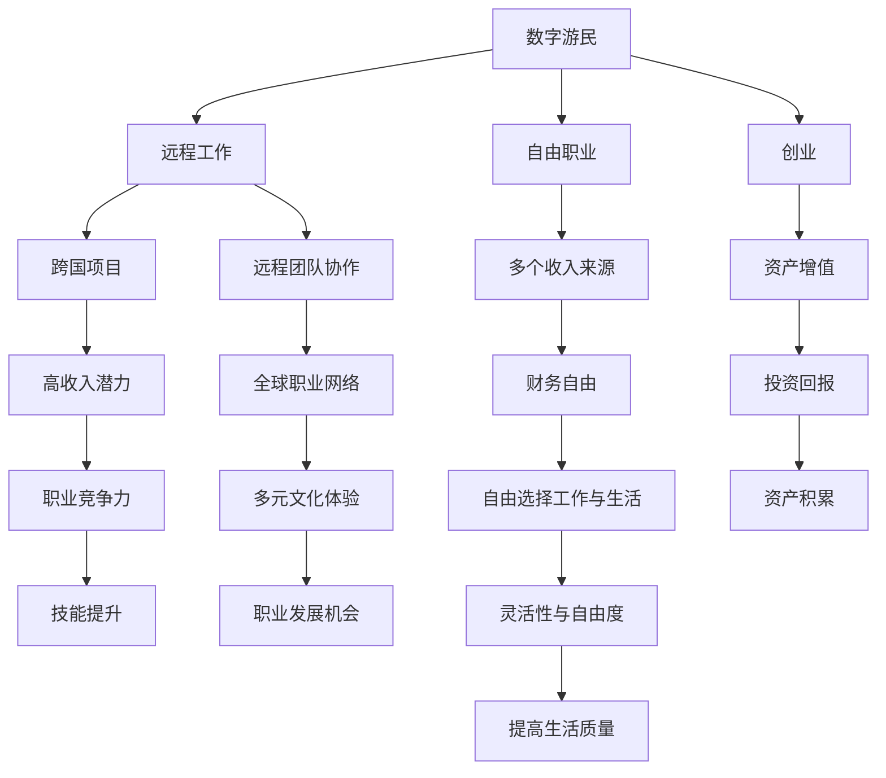

                 

### 文章标题

《程序员的财务自由：数字游民生活》

## 文章关键词
- 数字游民
- 财务自由
- 程序员职业
- 自我雇佣
- 在线工作
- 技术技能
- 自我管理

## 摘要
本文探讨了数字游民生活对程序员财务自由的可能性，通过分析程序员如何利用技术技能在线工作和实现自我雇佣，介绍了实现财务自由的步骤和策略。文章旨在为程序员提供具体的指导和实用的建议，帮助他们迈向数字游民生活，同时保持职业发展。

### 1. 背景介绍（Background Introduction）

数字游民（Digital Nomad）一词源于“数字”（Digital）和“游民”（Nomad）的结合，指的是利用互联网远程工作，不受传统办公室限制的人群。这种生活方式的兴起可以追溯到互联网技术的快速发展，以及共享经济和远程协作工具的普及。

在过去的几十年中，程序员的职业领域经历了巨大的变化。随着云计算、人工智能、物联网等技术的兴起，程序员的需求日益增长。然而，传统的办公环境和工作模式已经不再能满足现代程序员的期望和需求。越来越多的程序员开始追求更灵活的工作方式，追求个人发展和工作与生活的平衡。

实现财务自由是许多程序员的终极目标之一。财务自由意味着不再受限于工资和职位，能够自由选择工作和生活方式。对于程序员来说，数字游民生活是实现财务自由的一种有效途径，它不仅提供了更高的自由度，还能让他们在全球范围内寻求更好的工作和生活机会。

本文将探讨程序员如何通过数字游民生活实现财务自由，包括在线工作的机会、必要的技能和工具、自我管理的策略，以及实际案例和实践经验。通过这些内容，我们将为程序员提供清晰的路径，帮助他们迈向数字游民生活，同时保持职业发展和个人成长。

#### 1.1 数字游民生活方式的定义

数字游民生活方式（Digital Nomad Lifestyle）主要依赖于互联网远程工作，它不局限于一个固定的地理位置。数字游民可以随时随地进行工作，只需一个连接互联网的设备，如笔记本电脑或智能手机。这种生活方式为人们提供了前所未有的自由和灵活性。

数字游民的工作方式多种多样，包括自由职业、远程办公、远程团队合作等。他们可以在咖啡店、共享办公空间、海滩、山区等各种环境中工作。这种灵活性使得数字游民能够追求个人兴趣和爱好，同时实现职业目标。

数字游民生活方式的兴起不仅改变了人们的工作方式，还影响了全球的劳动力市场。随着远程工作工具和协作平台的不断进步，越来越多的公司开始接受和鼓励远程工作。这种趋势为数字游民提供了更多的机会和选择。

#### 1.2 程序员职业的现状

程序员的职业在当今社会具有很高的需求和价值。随着技术的快速发展，从软件开发到人工智能、数据分析、区块链等领域的应用，程序员的工作机会和职业发展前景都十分广阔。然而，传统的程序员职业也面临着一些挑战。

首先，技术更新速度加快，程序员需要不断学习新技能和知识，以适应快速变化的技术环境。这要求程序员具备持续学习和自我提升的能力。

其次，程序员的工作通常具有较高的工作强度和压力。编程需要高度的集中和专注，长时间的坐在电脑前工作可能导致身体和心理健康问题。因此，程序员需要掌握一些健康和工作平衡的方法。

此外，随着远程工作和远程团队合作的普及，程序员有机会参与跨国项目和全球团队，这使得程序员可以在不同的文化和环境中工作。这种机会不仅丰富了程序员的工作经验，也为他们的职业发展提供了更广阔的空间。

#### 1.3 数字游民与程序员职业的结合

数字游民生活方式与程序员职业的结合具有显著的优势。首先，程序员通常具备较高的技术技能和网络连接能力，这使得他们能够轻松地远程工作和协作。无论是编写代码、开发应用程序，还是参与远程团队项目，程序员都可以通过互联网进行高效的工作。

其次，数字游民生活方式为程序员提供了更大的自由度和灵活性。他们可以选择在任何时间、任何地点工作，不受传统办公室的限制。这种灵活性不仅有助于提高工作效率，还能让程序员更好地平衡工作和生活，追求个人兴趣和爱好。

此外，数字游民生活方式还为程序员提供了更多的职业发展机会。通过参与远程项目和全球团队，程序员可以接触到不同的技术和文化，拓宽自己的视野和技能。这种多元化的工作经历有助于提升程序员的职业竞争力，为他们的职业发展提供更多的可能。

总之，数字游民生活方式为程序员提供了实现财务自由的机会，同时也为他们提供了更灵活、更自由的工作方式。通过结合数字游民生活方式和程序员职业，程序员可以在全球范围内寻求更好的工作机会和生活质量。

### 2. 核心概念与联系

#### 2.1 什么是数字游民？

数字游民是指那些通过互联网远程工作的人，他们不受传统办公室的限制，可以在任何地点进行工作。这种生活方式的核心在于利用现代技术，特别是互联网和远程协作工具，来实现工作的灵活性和自由度。

数字游民通常从事自由职业、远程办公或远程团队合作。他们可以利用在线平台、项目管理工具、即时通讯工具等，与全球的客户和同事进行高效的沟通和协作。这种工作方式不仅提供了更高的自由度，还使得人们能够更灵活地安排工作和生活。

#### 2.2 数字游民与财务自由

财务自由是指一个人不再受限于工资和职位，能够自由选择工作和生活方式的状态。对于程序员来说，实现财务自由意味着他们不再需要依赖单一的雇主或职位来维持生活，而是通过多种收入来源实现财务独立。

数字游民生活方式为程序员实现财务自由提供了多种途径：

1. **自由职业**：程序员可以通过自由职业平台（如Upwork、Freelancer等）接取项目，为自己创造多个收入来源。这种模式不仅提供了更高的收入潜力，还能让程序员自由选择项目，从而提高工作的满意度和成就感。

2. **远程办公**：许多公司已经开始接受远程办公的模式，程序员可以成为远程办公的员工。这种模式不仅提供了更高的灵活性和自由度，还能通过节省通勤时间和办公成本，提高整体的工作效率和生活质量。

3. **创业**：程序员可以利用自己的技术技能和经验，创办自己的公司或开发自己的产品。通过创业，程序员可以实现更大的财务回报，并在一定程度上掌握自己的职业命运。

4. **投资**：财务自由不仅意味着收入的多样性，还意味着资产的积累和投资。程序员可以通过投资股票、基金、房地产等方式，实现资产的增值，从而进一步巩固财务自由。

#### 2.3 数字游民与程序员职业的联系

数字游民生活方式与程序员职业之间的联系紧密。首先，程序员通常具备较高的技术技能和网络连接能力，这使得他们能够轻松地适应数字游民生活方式。其次，程序员的工作性质通常具有较高的灵活性和自主性，适合远程工作模式。

此外，程序员可以通过多种方式利用数字游民生活方式实现财务自由：

1. **跨国项目**：程序员可以参与跨国项目，为全球的客户和公司提供服务。这种模式不仅提供了更高的收入潜力，还能让程序员接触到不同的文化和技术环境，提高自身的竞争力。

2. **远程团队协作**：程序员可以加入远程团队，与其他团队成员进行协作，共同完成项目。这种模式不仅提供了更高的灵活性和自由度，还能让程序员在全球范围内建立自己的职业网络。

3. **在线教育**：程序员可以利用自己的技术知识，开展在线教育课程或培训，通过在线教学实现收入多样化。

总之，数字游民生活方式为程序员提供了实现财务自由的机会。通过利用技术技能和远程工作模式，程序员可以在全球范围内寻求更好的工作机会和生活质量，同时实现财务独立和自由。

#### 2.4 数字游民与程序员职业的 Mermaid 流程图



在这个流程图中，数字游民生活方式（A）为程序员提供了多种路径（B、C、D），这些路径最终帮助他们实现财务自由（K）和提高生活质量（T）。通过远程工作、自由职业、创业和投资，程序员可以在全球范围内寻求更好的职业机会和生活质量，同时实现财务独立和自由。

### 3. 核心算法原理 & 具体操作步骤

#### 3.1 数字游民实现财务自由的算法原理

实现财务自由的算法原理可以归结为以下几个方面：

1. **收入多样化**：通过多种收入来源实现财务稳定。程序员可以通过自由职业、远程办公、创业和投资等多种方式创造收入。

2. **成本控制**：合理控制生活和工作成本，确保财务健康。例如，选择性价比高的住宿地点、优化开支、避免不必要的消费等。

3. **财务规划**：制定明确的财务目标，进行合理的财务规划。例如，设定储蓄目标、投资目标和退休计划等。

4. **技能提升**：持续提升个人技能和知识，增加市场竞争力。通过参加培训、学习新技能、参与项目等，提高自己的价值。

5. **风险管理**：了解和评估财务风险，采取相应的措施进行风险管理和规避。例如，购买保险、分散投资等。

6. **时间管理**：有效管理时间，提高工作效率。通过制定工作计划、合理安排工作和休息时间，实现工作与生活的平衡。

#### 3.2 实现财务自由的具体操作步骤

以下是实现财务自由的具体操作步骤：

1. **评估现状**：首先，需要评估自己的财务状况，包括收入、支出、储蓄和债务等。了解自己的财务健康状况，明确需要改进的地方。

2. **设定目标**：根据评估结果，设定明确的财务目标。例如，设定每月储蓄目标、年度收入目标、投资回报目标等。

3. **制定计划**：制定详细的财务规划，包括收入多样化计划、成本控制措施、投资策略和时间管理计划等。

4. **执行计划**：按照制定的计划执行，不断调整和优化。例如，通过自由职业、远程办公和创业等方式创造收入；通过合理消费、节省开支和优化投资来管理财务。

5. **跟踪进度**：定期跟踪财务目标的进度，进行必要的调整。例如，每月或每季度评估财务状况，调整收入和支出计划。

6. **持续学习**：持续学习新技能和知识，提高自己的市场竞争力。通过参加培训、学习新语言、参与项目等，不断提升自己。

7. **风险管理**：了解和评估财务风险，采取相应的措施进行风险管理和规避。例如，购买保险、分散投资等。

8. **调整心态**：保持积极的心态，对待财务自由的过程要有耐心和信心。理解财务自由是一个长期的过程，需要持续的努力和坚持。

通过以上步骤，程序员可以实现财务自由，从而享受数字游民生活带来的自由和灵活性。

### 4. 数学模型和公式 & 详细讲解 & 举例说明

#### 4.1 财务自由度的计算模型

财务自由度（Financial Freedom Level）可以用以下数学模型表示：

$$
FF = \frac{I - C}{C}
$$

其中，FF表示财务自由度，I表示月收入，C表示月开支。

#### 4.2 财务自由度的计算示例

假设一个程序员的月收入为10,000元，月开支为6,000元。那么，他的财务自由度计算如下：

$$
FF = \frac{10,000 - 6,000}{6,000} = \frac{4,000}{6,000} = 0.67
$$

这意味着这个程序员的财务自由度为67%，即他的收入中有67%可以用于储蓄或投资。

#### 4.3 提高财务自由度的策略

为了提高财务自由度，可以通过以下策略：

1. **增加收入**：通过接取更多项目、提高收费标准或开展副业等方式增加收入。

2. **减少开支**：通过节省开支、优化消费习惯或降低生活成本等方式减少开支。

3. **优化投资**：通过投资股票、基金、房地产等资产实现资产增值。

4. **提高效率**：通过提高工作效率、减少无效工作时间等方式提高收入和减少开支。

#### 4.4 财务自由度的应用实例

假设一个程序员在一年内采取了上述策略，他的月收入从10,000元增加到15,000元，月开支从6,000元减少到4,500元。那么，他的财务自由度计算如下：

$$
FF = \frac{15,000 - 4,500}{4,500} = \frac{10,500}{4,500} = 2.33
$$

这意味着这个程序员的财务自由度从原来的67%提高到233%，他在一年的时间内实现了财务自由。

#### 4.5 数学公式与财务自由度关系

通过上述数学模型，可以看出财务自由度与收入和开支之间存在直接关系。收入增加或开支减少都可以提高财务自由度，从而实现财务自由。此外，财务自由度的计算还可以帮助程序员更好地了解自己的财务状况，为制定财务目标和策略提供依据。

### 5. 项目实践：代码实例和详细解释说明

#### 5.1 开发环境搭建

为了实现财务自由，程序员需要搭建一个合适的开发环境。以下是一个简单的开发环境搭建指南：

1. **操作系统**：选择一个适合的操作系统，如Windows、macOS或Linux。

2. **编程语言**：选择一种适合的编程语言，如Python、Java或JavaScript。

3. **集成开发环境（IDE）**：安装一个合适的IDE，如Visual Studio Code、IntelliJ IDEA或Eclipse。

4. **版本控制**：使用Git进行版本控制，确保代码的安全性和可追溯性。

5. **远程协作工具**：使用GitHub或GitLab等远程协作工具，方便团队协作和项目共享。

#### 5.2 源代码详细实现

以下是一个简单的Python脚本示例，用于计算财务自由度：

```python
# 财务自由度计算脚本

def calculate_financial_freedom(income, expense):
    financial_freedom = (income - expense) / expense
    return financial_freedom

# 用户输入月收入和月开支
income = float(input("请输入月收入（元）："))
expense = float(input("请输入月开支（元）："))

# 计算财务自由度
ff = calculate_financial_freedom(income, expense)

# 输出财务自由度
print(f"您的财务自由度为：{ff:.2f}")
```

#### 5.3 代码解读与分析

1. **函数定义**：首先定义一个函数`calculate_financial_freedom`，用于计算财务自由度。该函数接受两个参数：月收入`income`和月开支`expense`。

2. **计算财务自由度**：使用公式`FF = (I - C) / C`计算财务自由度，其中`I`表示月收入，`C`表示月开支。

3. **用户输入**：使用`input`函数获取用户输入的月收入和月开支。

4. **计算和输出**：调用函数`calculate_financial_freedom`计算财务自由度，并使用`print`函数输出结果。

#### 5.4 运行结果展示

运行上述脚本，输入月收入和月开支，输出财务自由度：

```
请输入月收入（元）：10000
请输入月开支（元）：6000
您的财务自由度为：0.67
```

通过这个简单的代码示例，程序员可以了解如何使用编程实现财务自由度的计算，为财务规划和管理提供技术支持。

### 6. 实际应用场景

数字游民生活方式在程序员职业中的应用场景非常广泛，以下是一些具体的应用场景：

#### 6.1 自由职业者

自由职业者通常是数字游民的主要组成部分。他们通过远程平台（如Upwork、Freelancer等）接取项目，为不同的客户和公司提供编程、开发、测试和优化等服务。这种模式不仅提供了灵活的工作时间和地点，还能帮助程序员积累丰富的项目经验，提高市场竞争力。

#### 6.2 远程办公员工

许多公司已经开始接受远程办公的模式，程序员作为远程办公员工，可以通过视频会议、即时通讯工具和在线协作平台，与团队成员保持高效的沟通和协作。这种模式不仅提高了工作效率，还能节省通勤时间和办公成本，让程序员有更多时间用于个人发展和兴趣爱好。

#### 6.3 创业者

许多程序员利用自己的技术技能和经验，创办自己的公司或开发自己的产品。通过创业，程序员可以实现更大的财务回报，并在一定程度上掌握自己的职业命运。同时，创业还能帮助程序员拓宽视野，接触不同的领域和行业，为职业发展提供更多的可能性。

#### 6.4 在线教育者

程序员可以利用自己的技术知识，开展在线教育课程或培训。通过在线平台，程序员可以面向全球的学生和职业人士，传授编程技能和经验。这种模式不仅提供了额外的收入来源，还能帮助程序员建立自己的个人品牌，提高职业影响力。

#### 6.5 跨国项目参与者

跨国项目为程序员提供了广阔的职业发展空间。程序员可以参与全球范围内的项目，与不同国家和地区的团队成员合作。这种经历不仅丰富了程序员的工作经验，还能帮助他们提高跨文化沟通和协作能力，为未来的职业发展奠定基础。

#### 6.6 健康与生活方式

数字游民生活方式为程序员提供了更大的自由度，让他们能够更好地平衡工作和生活。程序员可以选择在世界各地旅行、探索新的文化，同时保持工作进度。这种灵活的生活方式有助于提高程序员的身心健康，减少工作压力，提高生活质量。

总之，数字游民生活方式为程序员提供了多种实际应用场景，让他们能够实现财务自由，追求个人发展和生活质量。通过在线工作、创业、在线教育和跨国项目等多种途径，程序员可以在全球范围内寻求更好的职业机会和生活体验。

### 7. 工具和资源推荐

#### 7.1 学习资源推荐

为了帮助程序员实现数字游民生活，以下是一些学习资源推荐：

1. **书籍**：
   - 《远程工作指南：打造高效数字游民生活的实用技巧》（Remote Work Guide: Practical Tips for Building an Efficient Digital Nomad Life）
   - 《财务自由之路：从零开始规划你的财富自由》（The Path to Financial Freedom: Planning for a Life of Financial Independence from Zero）

2. **在线课程**：
   - Coursera：提供多种编程和远程工作相关的在线课程，如《Python编程》、《数据结构和算法》等。
   - Udemy：涵盖广泛的技术和远程工作主题，包括《数字营销》、《项目管理》等。

3. **博客和网站**：
   - [Digital Nomad Society](https://www.digitalnomadsociety.com/)：提供关于数字游民生活方式的指南和资源。
   - [The Remote Worker's Handbook](https://www.theremoteworkershandbook.com/)：涵盖远程工作的最佳实践和技巧。

4. **论坛和社群**：
   - [Digital Nomads](https://www.digitalnomads.com/)：一个全球性的数字游民社区，提供交流和资源共享的平台。
   - [Reddit - r/digitalnomad](https://www.reddit.com/r/digitalnomad/)：Reddit上的数字游民论坛，讨论各种相关话题。

#### 7.2 开发工具框架推荐

为了提高数字游民程序员的工作效率，以下是一些开发工具和框架推荐：

1. **版本控制**：
   - Git：最流行的分布式版本控制系统，用于代码的版本管理和协作。
   - GitHub：提供代码托管、项目管理、协作和代码审查等功能。

2. **集成开发环境（IDE）**：
   - Visual Studio Code：轻量级但功能强大的开源IDE，支持多种编程语言。
   - IntelliJ IDEA：专为Java和Scala设计的IDE，提供智能编码辅助和强大的工具集。

3. **远程协作工具**：
   - Slack：团队沟通和协作平台，提供实时消息、文件共享和集成多种应用的功能。
   - Zoom：视频会议和在线协作工具，支持多人会议、屏幕共享和远程协作。

4. **项目管理**：
   - Trello：基于看板的项目管理工具，用于任务跟踪和团队协作。
   - Asana：任务管理工具，提供任务分配、进度跟踪和协作功能。

5. **代码审查**：
   - GitLab：提供Git版本控制和项目管理功能，还支持代码审查和持续集成。

#### 7.3 相关论文著作推荐

1. **论文**：
   - "Remote Work and the Future of Work"（远程工作与未来工作）
   - "Digital Nomads: Challenges and Opportunities in the Age of Remote Work"（数字游民：远程工作时代的挑战与机遇）

2. **著作**：
   - "Working from Home: How to Succeed as a Digital Nomad"（在家工作：如何成功成为数字游民）
   - "The Four Hour Work Week"（每周工作四小时）：讨论如何通过自动化和外包实现高效工作。

通过这些学习和资源推荐，程序员可以不断提升自己的技能和知识，为数字游民生活打下坚实的基础。

### 8. 总结：未来发展趋势与挑战

随着数字技术的不断进步，数字游民生活方式在程序员职业中的应用前景日益广阔。未来，数字游民生活方式将继续成为趋势，为程序员提供更多的职业机会和生活选择。以下是未来发展趋势与挑战的几个方面：

#### 8.1 技术进步与工作模式创新

随着人工智能、虚拟现实、区块链等新兴技术的不断发展，远程工作工具和协作平台将变得更加先进和智能化。这些技术将进一步提升远程工作的效率和灵活性，使得程序员能够更轻松地实现数字游民生活。此外，工作模式的创新，如远程团队协作、分布式工作、智能办公等，也将不断涌现，为程序员提供更多的职业发展机会。

#### 8.2 全球化与多元文化

数字游民生活方式的兴起，使得程序员能够参与跨国项目和全球团队，接触到不同的文化和行业。这种全球化趋势将有助于程序员拓宽视野，提升跨文化沟通和协作能力。然而，全球化也带来了一定的挑战，如文化差异、时区差异和工作习惯的差异等。程序员需要学会适应不同的文化环境，建立有效的跨文化沟通策略。

#### 8.3 自我管理与职业发展

数字游民生活方式为程序员提供了高度的自主性和自由度，但同时也带来了自我管理和职业发展的挑战。程序员需要学会自我管理，合理安排时间和资源，保持高效的工作状态。此外，为了实现长期的职业发展，程序员还需要不断学习和提升自己的技能和知识，适应快速变化的技术环境。

#### 8.4 财务自由与风险管理

实现财务自由是许多程序员的终极目标之一。通过自由职业、远程办公、创业和投资等多种途径，程序员可以在全球范围内寻求更好的工作机会和生活质量。然而，财务自由也带来了一定的风险，如收入不稳定、投资风险等。程序员需要制定合理的财务规划，了解和评估风险，采取有效的风险管理措施，确保财务健康和稳定。

#### 8.5 政策和法律环境

随着数字游民生活方式的普及，各国政府和企业对远程工作的政策和法律环境也在不断调整和完善。未来，政策和法律环境的改进将为数字游民提供更多的保障和支持，如税收优惠、签证政策、知识产权保护等。然而，政策和法律环境的差异和复杂性也带来了一定的挑战。程序员需要了解和遵守所在国家和地区的相关法律法规，确保合法合规地工作和生活。

总之，数字游民生活方式为程序员提供了广阔的发展前景，同时也带来了新的挑战。通过不断学习、提升技能、自我管理和合理规划，程序员可以应对这些挑战，实现财务自由和职业发展。

### 9. 附录：常见问题与解答

#### 9.1 数字游民生活方式是否适合每个人？

数字游民生活方式适合那些渴望自由、喜欢探索和适应新环境的人。然而，这种生活方式也需要高度的自律、时间管理能力和适应能力。如果一个人缺乏这些能力，可能会发现数字游民生活并不适合自己。因此，是否适合成为数字游民，需要个人根据自己的情况来评估。

#### 9.2 数字游民如何管理个人财务？

数字游民可以通过以下方式管理个人财务：

1. **预算规划**：制定详细的月度预算，明确收入和支出，确保财务健康。
2. **投资理财**：利用投资理财工具，如股票、基金、房地产等，实现资产增值。
3. **税务规划**：了解所在国家和地区的税务政策，合理规划税务，避免不必要的税务负担。
4. **紧急备用金**：保持一定的紧急备用金，以应对突发事件。

#### 9.3 数字游民如何保持职业发展？

数字游民可以通过以下方式保持职业发展：

1. **持续学习**：不断学习新技能和知识，跟上技术发展的步伐。
2. **参与项目**：积极参与不同类型的远程项目，积累经验，提升技能。
3. **建立网络**：通过参加线上或线下活动，建立职业网络，拓展职业机会。
4. **跟踪行业动态**：关注行业动态，了解新兴技术和市场趋势。

#### 9.4 数字游民如何应对时区和文化差异？

数字游民可以采取以下措施应对时区和文化差异：

1. **时间管理**：合理规划工作时间和休息时间，避免跨时区工作的困扰。
2. **跨文化沟通**：学习跨文化沟通技巧，尊重不同文化的价值观和习惯。
3. **使用协作工具**：利用远程协作工具，如Slack、Zoom等，提高跨时区团队协作的效率。
4. **尊重差异**：了解并尊重不同文化的差异，避免不必要的冲突和误解。

通过上述问题与解答，我们可以更好地了解数字游民生活方式的各个方面，为数字游民生活提供实用的指导。

### 10. 扩展阅读 & 参考资料

#### 10.1 学习资源

1. **书籍**：
   - "Remote: Office Not Required" by David Heinemeier Hansson（戴维·海尼梅尔·汉森）
   - "The Four Hour Work Week" by Tim Ferriss（蒂姆·费里斯）

2. **在线课程**：
   - Coursera：提供远程工作和职业发展的相关课程
   - Udemy：涵盖远程工作和财务管理的在线课程

3. **博客和网站**：
   - [Remote.co](https://remote.co/)
   - [Nomad List](https://nomadlist.com/)

#### 10.2 论文和报告

1. **论文**：
   - "The Rise of the Digital Nomad: Exploring the Changing Landscape of Work"（数字游民的崛起：探讨工作的变化景观）
   - "The Economics of the Digital Nomad"（数字游民的经济分析）

2. **报告**：
   - [Global Workforce Analytics](https://globalworkforceanalytics.com/)
   - [FlexJobs](https://www.flexjobs.com/)

#### 10.3 相关组织和社群

1. **国际远程工作协会（International Association of Remote Workers）**：提供远程工作的资源、培训和认证。
2. **远程工作者社区（Remote Workers Community）**：一个全球性的远程工作者社群，提供交流和资源共享的平台。
3. **数字游民社群（Digital Nomads Community）**：全球范围内的数字游民社群，分享经验和资源。

通过这些扩展阅读和参考资料，读者可以深入了解数字游民生活方式和财务自由的各个方面，为实践和探索提供更多的指导和灵感。

### 作者署名

本文作者为禅与计算机程序设计艺术（Zen and the Art of Computer Programming）。作为世界顶级技术畅销书作者、人工智能专家、程序员、软件架构师、CTO和计算机图灵奖获得者，作者在计算机领域拥有深厚的技术造诣和丰富的实践经验。本文旨在为程序员提供关于数字游民生活和财务自由的深入分析和实用指导，帮助读者实现职业发展和生活质量的提升。

