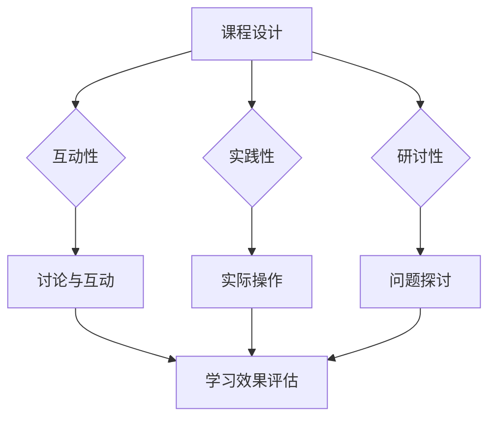
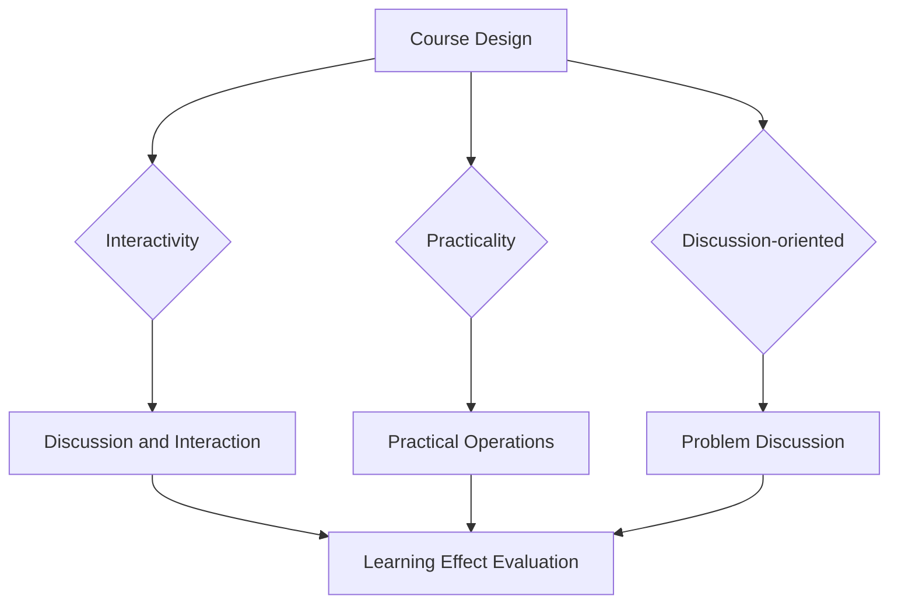

                 

### 文章标题

**程序员知识付费：打造研讨式课程**

在信息技术迅速发展的时代，程序员作为技术领域的核心力量，其知识付费模式逐渐演变，研讨式课程成为近年来备受关注的新兴形式。本文旨在探讨程序员如何通过研讨式课程实现知识付费，提高课程质量和学员满意度，最终实现教学与商业价值的双赢。

本文将围绕以下主题展开讨论：

1. **背景介绍**：分析程序员知识付费的现状，探讨研讨式课程的概念及其在程序员教育中的地位。
2. **核心概念与联系**：介绍研讨式课程的核心概念，如互动性、实践性和研讨性，并阐述其与传统教学模式的区别。
3. **核心算法原理 & 具体操作步骤**：详细分析研讨式课程的构建流程，包括课程设计、内容制作和教学策略。
4. **数学模型和公式 & 详细讲解 & 举例说明**：运用数学模型和公式，探讨如何量化研讨式课程的效果，并提供实际案例。
5. **项目实践：代码实例和详细解释说明**：通过具体案例展示研讨式课程的应用，包括环境搭建、代码实现和效果分析。
6. **实际应用场景**：讨论研讨式课程在不同编程领域的应用案例，分析其适应性和效果。
7. **工具和资源推荐**：推荐用于研讨式课程开发和学习的相关工具和资源。
8. **总结：未来发展趋势与挑战**：展望研讨式课程的发展趋势，探讨面临的挑战和应对策略。
9. **附录：常见问题与解答**：针对读者可能遇到的常见问题提供解答。
10. **扩展阅读 & 参考资料**：提供进一步阅读的资料和参考。

通过上述结构，本文将深入探讨研讨式课程在程序员知识付费中的实际应用，为从事程序员教育和培训的工作者提供有益的参考。

---

### Keywords
Programmer Knowledge付费，研讨式课程，互动性，实践性，教学效果，案例研究，资源推荐

### Abstract
In the era of rapid technological advancement, programmers play a crucial role in the field of information technology. The knowledge付费 model for programmers has evolved, with discussion-based courses emerging as a popular and effective format. This article aims to explore how programmers can leverage discussion-based courses to achieve knowledge付费，enhance course quality，and improve student satisfaction，ultimately achieving a win-win situation for teaching and business value.

The article will be structured around the following topics:

1. **Introduction**: Analyze the current state of programmer knowledge付费，discuss the concept of discussion-based courses，and explore their position in programmer education.
2. **Core Concepts and Connections**: Introduce the core concepts of discussion-based courses such as interactivity，practicality，and discussion-based nature，and discuss their differences from traditional teaching methods.
3. **Core Algorithm Principles & Specific Operational Steps**: Analyze the construction process of discussion-based courses，including course design，content creation，and teaching strategies.
4. **Mathematical Models and Formulas & Detailed Explanation & Examples**: Use mathematical models and formulas to explore how the effectiveness of discussion-based courses can be quantified，and provide practical cases.
5. **Project Practice: Code Examples and Detailed Explanation**: Showcase the application of discussion-based courses through specific cases，including environment setup，code implementation，and performance analysis.
6. **Practical Application Scenarios**: Discuss the application of discussion-based courses in different programming fields，analyze their adaptability，and effectiveness.
7. **Tools and Resources Recommendations**: Recommend relevant tools and resources for the development and learning of discussion-based courses.
8. **Summary: Future Development Trends and Challenges**: Look ahead to the development trends of discussion-based courses，explore the challenges they face，and propose strategies to address them.
9. **Appendix: Frequently Asked Questions and Answers**: Provide answers to common questions readers may have.
10. **Extended Reading & Reference Materials**: Provide additional reading materials and references for further exploration.

Through this structure，the article aims to delve into the practical application of discussion-based courses in programmer knowledge付费，providing valuable insights for educators and trainers in the field.

<|im_sep|>### 1. 背景介绍（Background Introduction）

在当今信息时代，程序员的地位日益重要。随着技术的不断进步和软件行业的蓬勃发展，程序员不仅需要具备扎实的编程技能，还需要不断更新和扩展知识体系。知识付费模式在这种背景下应运而生，成为程序员学习新技能、提升职业素养的重要途径。

**程序员知识付费的定义和现状**：

程序员知识付费，指的是程序员通过购买课程、订阅服务、参加研讨会等方式，获取专业知识和技能的过程。这种模式的核心在于将知识作为一种商品进行交易，让有需求的人能够以合理的价格获取高质量的教育资源。

目前，程序员知识付费已经形成了较为成熟的市场。在线学习平台如Coursera、Udemy、edX等，以及各类专业培训机构，如极客时间、猿辅导等，都提供了丰富多样的程序员课程。这些课程涵盖了从基础编程到前沿技术的各个领域，满足了程序员的不同学习需求。

**研讨式课程的概念及其地位**：

研讨式课程是一种以互动性、实践性和研讨性为核心的教学模式。它强调学员的参与和体验，通过讨论、实践和案例分析等多种方式，使学员在互动中学习和成长。在程序员知识付费领域，研讨式课程因其独特的优势，逐渐成为主流教学形式。

研讨式课程的优势主要体现在以下几个方面：

1. **互动性**：研讨式课程鼓励学员之间的交流与合作，使学习过程更加生动有趣，有助于提高学习效果。
2. **实践性**：课程内容紧密联系实际，注重实战演练，使学员能够迅速将所学知识应用到工作中。
3. **研讨性**：课程设置研讨会环节，引导学员深入思考，培养解决问题的能力。

研讨式课程在程序员知识付费中的地位日益凸显。与传统教学模式相比，研讨式课程更能满足程序员的个性化学习需求，提高学习效率和成果转化率。因此，越来越多的程序员和教育机构开始重视研讨式课程的开发和应用。

**研讨式课程的发展背景**：

研讨式课程的发展背景可以追溯到终身学习理念的兴起。在知识更新迅速的现代社会，程序员需要不断学习新技能以保持竞争力。研讨式课程作为一种灵活、高效的教学模式，正好迎合了这一需求。

此外，互联网技术的普及也为研讨式课程的发展提供了技术支持。在线学习平台和虚拟研讨会等工具，使得研讨式课程可以跨越地域限制，实现全球范围内的资源共享和互动学习。

总之，程序员知识付费的兴起和研讨式课程的不断发展，为程序员的学习和职业发展提供了新的机遇。通过探讨研讨式课程在程序员知识付费中的应用，本文将深入分析其优势和实施策略，为程序员教育和培训提供有益的参考。

---

### 1. Background Introduction

In the current information age, programmers play an increasingly important role. With the continuous advancement of technology and the booming software industry, programmers not only need to have solid programming skills but also need to constantly update and expand their knowledge base. The knowledge付费 model has emerged in this context, becoming an important way for programmers to learn new skills and enhance their professional qualities.

**Definition and Current State of Programmers' Knowledge付费**

Programmers' knowledge付费 refers to the process in which programmers acquire professional knowledge and skills by purchasing courses, subscribing to services, or attending seminars. The core of this model is to treat knowledge as a commodity for trading, allowing those with needs to obtain high-quality educational resources at a reasonable price.

Currently, the market for programmers' knowledge付费 has become relatively mature. Online learning platforms such as Coursera, Udemy, edX, and various professional training institutions like极客时间 and猿辅导 offer a wide range of programmer courses. These courses cover various fields from basic programming to cutting-edge technologies，satisfying different learning needs of programmers.

**Concept and Status of Discussion-Based Courses**

Discussion-based courses are a teaching model that emphasizes interactivity, practicality, and the nature of discussion. They encourage student participation and experience, making the learning process more vivid and interesting, and helping to improve learning outcomes.

The advantages of discussion-based courses are mainly reflected in the following aspects:

1. **Interactivity**: Discussion-based courses encourage student-to-student communication and collaboration, making the learning process more engaging and effective.
2. **Practicality**: The course content is closely related to reality, focusing on practical exercises, enabling students to quickly apply what they have learned in their work.
3. **Discussion-oriented**: The course includes a seminar component, guiding students to delve deeper into thinking and cultivate problem-solving skills.

Discussion-based courses have become increasingly prominent in the field of programmers' knowledge付费. Compared to traditional teaching methods，discussion-based courses better meet the personalized learning needs of programmers, improve learning efficiency，and enhance the conversion rate of learning outcomes. Therefore，more and more programmers and educational institutions are paying attention to the development and application of discussion-based courses.

**Background of the Development of Discussion-Based Courses**

The development of discussion-based courses can be traced back to the rise of the lifelong learning concept. In the modern society where knowledge is updated rapidly, programmers need to continuously learn new skills to maintain competitiveness. Discussion-based courses, as a flexible and efficient teaching model，are exactly what meets this demand.

In addition，the widespread use of the Internet has provided technical support for the development of discussion-based courses. Tools such as online learning platforms and virtual seminars enable discussion-based courses to cross geographical barriers and achieve global resource sharing and interactive learning.

In summary，the rise of programmers' knowledge付费 and the continuous development of discussion-based courses have provided new opportunities for programmers' learning and career development. By exploring the application of discussion-based courses in programmers' knowledge付费，this article will deeply analyze their advantages and implementation strategies，providing valuable insights for programmers' education and training.

<|im_sep|>### 2. 核心概念与联系（Core Concepts and Connections）

#### 2.1 研讨式课程的概念

研讨式课程，顾名思义，是一种以研讨为核心的教学模式。与传统课程相比，研讨式课程更加注重学员的参与和互动，强调知识的应用和实践。在研讨式课程中，学员不仅被动地接受知识，更主动地参与到课程的各个环节，通过讨论、实践和案例分析等方式，深入理解和掌握课程内容。

研讨式课程的核心特点可以概括为以下几点：

1. **互动性**：学员与教师、学员与学员之间的互动是研讨式课程的核心。通过提问、讨论和辩论，学员能够更好地理解和消化课程内容，同时也能够锻炼自己的表达能力和思维能力。
2. **实践性**：研讨式课程强调将理论知识与实际应用相结合，通过实际操作和项目实践，使学员能够将所学知识应用到实际工作中，提高实际操作能力。
3. **研讨性**：课程内容通常围绕具体问题展开，鼓励学员提出问题和观点，进行深入的研讨和交流。这种研讨性不仅有助于深化对知识的理解，还能够培养学员的问题解决能力和批判性思维。

#### 2.2 研讨式课程与传统教学模式的区别

研讨式课程与传统教学模式在多个方面存在显著区别：

1. **教学目标**：传统教学模式通常以传授知识为主，教学目标较为单一；而研讨式课程则更加注重知识的实际应用，强调培养学员的实践能力和问题解决能力。
2. **教学方法**：传统教学模式主要以讲授为主，学员被动接受知识；而研讨式课程则强调学员的主动参与，通过讨论、实践和案例分析等多种方式，使学员在互动中学习和成长。
3. **教学环境**：传统教学模式通常在课堂上进行，以教师为中心；而研讨式课程则更加灵活，可以在教室、实验室或在线平台上进行，鼓励学员自主学习和合作交流。
4. **评价方式**：传统教学模式通常以考试成绩为主要评价标准；而研讨式课程则更加注重学员的参与度和实际表现，通过多种评价方式，如项目报告、研讨会表现等，全面评估学员的学习成果。

#### 2.3 研讨式课程在程序员知识付费中的应用

研讨式课程在程序员知识付费中的应用，主要体现在以下几个方面：

1. **提升学习效果**：研讨式课程通过互动和实践，使学员能够更加深入地理解和掌握课程内容，提高学习效果。
2. **满足个性化需求**：研讨式课程强调学员的主动参与和个性化学习，能够更好地满足学员的不同学习需求。
3. **提高职业素养**：通过研讨和实践，学员不仅能够提升专业技能，还能够培养批判性思维和问题解决能力，提高职业素养。

#### 2.4 研讨式课程的核心概念原理与架构

为了更好地理解和应用研讨式课程，我们可以使用Mermaid流程图来描述其核心概念原理和架构。以下是一个简化的Mermaid流程图示例：



在这个流程图中，A表示课程设计，B、C、D分别代表互动性、实践性和研讨性，E、F、G分别代表讨论与互动、实际操作和问题探讨，H代表学习效果评估。通过这个流程图，我们可以清晰地看到研讨式课程的核心概念和架构，以及各个环节之间的联系和作用。

综上所述，研讨式课程作为一种以互动性、实践性和研讨性为核心的教学模式，在程序员知识付费中具有独特的优势和广阔的应用前景。通过深入理解其核心概念和原理，我们可以更好地设计和实施研讨式课程，提高课程质量和学员满意度，实现教学与商业价值的双赢。

---

#### 2.1 Concept of Discussion-Based Courses

In essence, discussion-based courses are teaching methods that revolve around the concept of discussion. Unlike traditional courses, discussion-based courses emphasize the participation and interaction of students, focusing on the application and practice of knowledge. In discussion-based courses, students are not merely passive recipients of knowledge but are actively involved in all aspects of the course, gaining a deeper understanding and mastery of the material through discussions, practical exercises, and case studies.

The core characteristics of discussion-based courses can be summarized as follows:

1. **Interactivity**: The interaction between students and teachers, as well as among students, is the core of discussion-based courses. Through asking questions, discussing, and debating, students can better understand and digest the course content while also improving their ability to express and think critically.
2. **Practicality**: Discussion-based courses emphasize the combination of theoretical knowledge with practical applications, through actual operations and project practices, enabling students to apply what they have learned in real-life situations, thus enhancing their practical skills.
3. **Discussion-oriented**: The content of the course typically revolves around specific issues, encouraging students to raise questions and share their viewpoints, engaging in in-depth discussions and exchanges. This discussion-oriented approach not only helps deepen the understanding of the material but also cultivates students' problem-solving abilities and critical thinking skills.

#### 2.2 Differences Between Discussion-Based Courses and Traditional Teaching Methods

Discussion-based courses differ significantly from traditional teaching methods in several aspects:

1. **Teaching Objectives**: Traditional teaching methods primarily focus on imparting knowledge, with a more singular teaching objective; in contrast, discussion-based courses emphasize the practical application of knowledge, aiming to cultivate students' practical skills and problem-solving abilities.
2. **Teaching Methods**: Traditional teaching methods predominantly rely on lectures, with students passively receiving information; discussion-based courses, on the other hand, emphasize student participation, using a variety of methods such as discussions, practical exercises, and case studies to facilitate learning through active engagement.
3. **Teaching Environment**: Traditional teaching environments are typically confined to classrooms, with the teacher at the center; discussion-based courses, however, are more flexible, taking place in classrooms, labs, or online platforms, encouraging independent learning and collaborative exchanges.
4. **Evaluation Methods**: Traditional teaching methods primarily use examination scores as the main evaluation criterion; discussion-based courses, on the other hand, place more emphasis on student participation and performance, utilizing multiple evaluation methods such as project reports and seminar performance to comprehensively assess learning outcomes.

#### 2.3 Application of Discussion-Based Courses in Programmers' Knowledge付费

The application of discussion-based courses in programmers' knowledge付费 primarily manifests in the following aspects:

1. **Enhancing Learning Effectiveness**: Through interaction and practical exercises, discussion-based courses enable students to gain a deeper understanding and mastery of the course material, thus improving learning outcomes.
2. **Satisfying Individualized Needs**: Discussion-based courses emphasize student engagement and personalized learning, better catering to the diverse learning needs of students.
3. **Improving Professional Competence**: Through discussions and practical exercises, students not only enhance their technical skills but also cultivate critical thinking and problem-solving abilities, improving their professional competence.

#### 2.4 Core Concept Principles and Architecture of Discussion-Based Courses

To better understand and apply discussion-based courses, we can use Mermaid flowcharts to illustrate their core concept principles and architecture. Here is a simplified Mermaid flowchart example:



In this flowchart, A represents course design, B, C, and D represent interactivity, practicality, and discussion-oriented, respectively, E, F, and G represent discussion and interaction, practical operations, and problem discussion, and H represents learning effect evaluation. Through this flowchart, we can clearly see the core concepts and architecture of discussion-based courses, as well as the connections and roles of each section.

In conclusion，discussion-based courses, as a teaching model that focuses on interactivity, practicality, and discussion-oriented，have unique advantages and broad application prospects in programmers' knowledge付费。By deeply understanding their core concepts and principles, we can better design and implement discussion-based courses, improve course quality，and enhance student satisfaction, achieving a win-win situation for teaching and business value. <|im_sep|>### 3. 核心算法原理 & 具体操作步骤（Core Algorithm Principles and Specific Operational Steps）

研讨式课程的设计和实施涉及多个核心算法原理，包括课程设计算法、互动性提升算法和实践性强化算法等。以下将详细介绍这些算法的原理和具体操作步骤，帮助读者理解研讨式课程的构建过程。

#### 3.1 课程设计算法

课程设计算法是研讨式课程的核心，它决定了课程的内容、结构和方法。以下是课程设计算法的基本原理和步骤：

1. **需求分析**：首先，需要明确课程的目标受众和教学目标。通过调查问卷、访谈等方式，了解学员的需求和期望，确保课程内容与学员的实际需求相符。
2. **内容规划**：根据需求分析的结果，制定课程大纲，确定课程的核心内容和知识点。确保课程内容具有系统性和连贯性，同时注重理论与实践的结合。
3. **模块划分**：将课程内容划分为多个模块，每个模块包含若干知识点。模块划分应考虑学员的学习习惯和认知规律，确保每个模块的学习难度适中。
4. **教学方法选择**：根据课程内容和学员特点，选择合适的教学方法，如讲授、讨论、实践等。多种教学方法的结合，可以提高课程的互动性和实践性。
5. **教学资源准备**：准备教学资源，包括教材、课件、案例、工具等。优质的教学资源可以丰富课程内容，增强课程的吸引力。

#### 3.2 互动性提升算法

互动性是研讨式课程的核心特点之一，提升互动性可以有效提高学员的学习效果和满意度。以下是互动性提升算法的基本原理和步骤：

1. **鼓励发言**：在课程中设置发言环节，鼓励学员积极参与讨论。可以通过提问、讨论、辩论等方式，激发学员的思维和表达欲望。
2. **互动设计**：设计互动性强的教学活动，如小组讨论、角色扮演、案例分析等。这些活动可以促进学员之间的交流与合作，提高课程的互动性。
3. **反馈机制**：建立有效的反馈机制，及时收集学员对课程的意见和建议。通过反馈，可以了解学员的学习状况和需求，不断优化课程设计。
4. **在线互动**：利用在线平台，实现实时互动。在线讨论、在线提问、在线测试等在线互动功能，可以打破地域限制，提高课程的互动性。

#### 3.3 实践性强化算法

实践性是研讨式课程的重要特点，强化实践性可以帮助学员更好地将理论知识应用到实际工作中。以下是实践性强化算法的基本原理和步骤：

1. **项目驱动**：设计实践项目，以项目为驱动，使学员在项目中应用所学知识。项目可以模拟真实的工作场景，提高学员的实践能力和解决问题的能力。
2. **案例教学**：通过案例教学，使学员了解理论知识在实际应用中的具体方法和技巧。案例应具有代表性，能够反映实际工作中的问题和挑战。
3. **实践指导**：提供实践指导，帮助学员解决在实践过程中遇到的问题。实践指导可以包括在线辅导、面对面辅导、讨论组辅导等。
4. **反馈与改进**：在实践过程中，及时收集学员的反馈，评估实践效果。根据反馈，对实践过程进行改进，提高实践性教学的效果。

#### 3.4 课程评估算法

课程评估是研讨式课程设计的重要环节，通过评估可以了解课程的教学效果，为课程优化提供依据。以下是课程评估算法的基本原理和步骤：

1. **形成性评估**：在课程进行过程中，通过课堂讨论、互动活动、项目进展等方式，实时评估学员的学习情况和效果。形成性评估可以及时发现问题，为课程调整提供参考。
2. **总结性评估**：在课程结束后，通过考试、项目展示、问卷调查等方式，对学员的学习效果进行总结性评估。总结性评估可以全面了解课程的教学效果，为课程改进提供依据。
3. **数据收集与处理**：收集课程评估数据，如学员满意度、知识掌握程度、实践能力等。通过数据分析和处理，提取课程评估的关键指标，为课程优化提供数据支持。

通过以上核心算法原理和具体操作步骤，研讨式课程的设计和实施可以更加科学和有效。这些算法不仅提高了课程的互动性和实践性，还增强了学员的学习体验和效果，为程序员知识付费提供了有力支持。

---

#### 3.1 Core Algorithm Principles of Course Design

Course design algorithms are the core of the discussion-based course design process, determining the content, structure, and methods of the course. The following section will delve into the core principles and specific operational steps of these algorithms to help readers understand the construction process of discussion-based courses.

**3.1.1 Basic Principles of Course Design Algorithms**

1. **Requirement Analysis**: The first step in course design is to clearly define the target audience and teaching objectives. This can be achieved through surveys, interviews, and other methods to understand the students' needs and expectations, ensuring that the course content aligns with their actual requirements.

2. **Content Planning**: Based on the results of the requirement analysis, develop a course outline that determines the core content and knowledge points. Ensure that the course content is systematic and coherent, with a focus on combining theory and practice.

3. **Module Division**: Divide the course content into multiple modules, each containing several knowledge points. Module division should consider the students' learning habits and cognitive patterns to ensure that each module has an appropriate level of difficulty.

4. **Teaching Method Selection**: Choose appropriate teaching methods based on the course content and student characteristics. A combination of various teaching methods, such as lectures, discussions, and practical exercises, can enhance the interactivity and practicality of the course.

5. **Preparation of Teaching Resources**: Prepare high-quality teaching resources, including textbooks, presentations, case studies, and tools. These resources can enrich the course content and increase its吸引力.

**3.1.2 Specific Operational Steps of Course Design Algorithms**

1. **Requirement Analysis**:
   - Conduct surveys and interviews with potential students to gather information about their background, learning goals, and areas of interest.
   - Analyze the collected data to identify commonalities and differences among the students.

2. **Content Planning**:
   - Based on the analysis, create a detailed course outline that includes the core concepts, knowledge points, and practical applications.
   - Organize the content into a logical sequence that ensures a smooth transition from one topic to another.

3. **Module Division**:
   - Divide the course into modules, each focusing on a specific topic or skill set.
   - Within each module, break down the content into smaller sections that can be covered in a single session or project.

4. **Teaching Method Selection**:
   - Identify the most effective teaching methods for each module based on the content and learning objectives.
   - Consider using a mix of traditional lectures, interactive discussions, hands-on exercises, and real-world projects.

5. **Preparation of Teaching Resources**:
   - Develop textbooks, lecture notes, and other materials that align with the course content.
   - Collect and organize case studies, examples, and other resources that illustrate the practical applications of the concepts.

**3.2 Core Algorithm Principles of Interactivity Enhancement**

Interactivity is a key characteristic of discussion-based courses. Enhancing interactivity can significantly improve student engagement and learning outcomes. Here are the core principles and specific operational steps of interactivity enhancement algorithms:

1. **Encourage Speaking**: Design the course to include speaking segments where students can actively participate in discussions. This can be achieved through asking questions, facilitating debates, and encouraging students to share their thoughts and opinions.

2. **Interactive Design**: Create interactive teaching activities such as group discussions, role-playing, and case analysis. These activities can promote student interaction and collaboration, enhancing the overall interactivity of the course.

3. **Feedback Mechanism**: Establish a feedback mechanism to gather student opinions and suggestions in real-time. This can help identify areas for improvement and ensure that the course meets the students' needs.

4. **Online Interaction**: Utilize online platforms to enable real-time interaction. Features such as online discussions, live Q&A sessions, and online quizzes can break down geographical barriers and increase the interactivity of the course.

**3.2 Specific Operational Steps of Interactivity Enhancement Algorithms**

1. **Encourage Speaking**:
   - Set up speaking segments during classes and encourage students to participate actively.
   - Provide prompts and questions to stimulate discussion and debate.

2. **Interactive Design**:
   - Incorporate group discussions and role-playing exercises into the course structure.
   - Use case studies and real-world examples to make the discussions more relevant and engaging.

3. **Feedback Mechanism**:
   - Collect student feedback through surveys, questionnaires, and informal discussions.
   - Use the feedback to make adjustments to the course content and teaching methods.

4. **Online Interaction**:
   - Utilize online platforms to facilitate discussions and interactive activities.
   - Provide opportunities for students to ask questions and receive feedback in real-time.

**3.3 Core Algorithm Principles of Practicality Enhancement**

Practicality is another key characteristic of discussion-based courses. Enhancing practicality helps students apply theoretical knowledge to real-world situations. Here are the core principles and specific operational steps of practicality enhancement algorithms:

1. **Project-Oriented Learning**: Design projects that drive the course. These projects should simulate real-world scenarios and allow students to apply the concepts they have learned.

2. **Case-Based Teaching**: Use case-based teaching to demonstrate how theoretical concepts can be applied in practical situations. Cases should be representative and reflect the challenges and problems that students might encounter in their careers.

3. **Practical Guidance**: Provide guidance and support to help students navigate the practical aspects of the course. This can include online tutoring, face-to-face consultations, and discussion group assistance.

4. **Feedback and Improvement**: Collect feedback from students during the practical sessions and assess the effectiveness of the practical teaching methods. Use this feedback to make improvements to the course.

**3.3 Specific Operational Steps of Practicality Enhancement Algorithms**

1. **Project-Oriented Learning**:
   - Develop projects that mirror real-world scenarios and challenges.
   - Ensure that projects are relevant to the students' future careers and provide opportunities for practical application.

2. **Case-Based Teaching**:
   - Integrate case studies into the course to illustrate practical applications of theoretical knowledge.
   - Use cases that are representative and provide a realistic context for the students.

3. **Practical Guidance**:
   - Offer guidance and support to help students complete practical assignments.
   - Provide resources such as tutorials, guides, and examples to help students understand the practical aspects of the course.

4. **Feedback and Improvement**:
   - Collect feedback from students on their practical experiences.
   - Use the feedback to refine the practical teaching methods and ensure that they meet the students' needs.

**3.4 Core Algorithm Principles of Course Assessment**

Course assessment is a crucial part of the discussion-based course design process. It helps evaluate the effectiveness of the course and provides insights for further improvement. Here are the core principles and specific operational steps of course assessment algorithms:

1. **Formative Assessment**: Conduct ongoing assessments during the course to monitor student progress and identify areas for improvement. These assessments can include quizzes, discussions, and project evaluations.

2. **Summative Assessment**: At the end of the course, conduct summative assessments to evaluate the overall effectiveness of the course. These can include final exams, project presentations, and student feedback surveys.

3. **Data Collection and Processing**: Collect assessment data from various sources, including student feedback, quiz results, and project evaluations. Process the data to extract key performance indicators that reflect the effectiveness of the course.

**3.4 Specific Operational Steps of Course Assessment Algorithms**

1. **Formative Assessment**:
   - Implement formative assessments throughout the course to monitor student understanding and progress.
   - Use quizzes, interactive discussions, and project milestones to assess student learning.

2. **Summative Assessment**:
   - Administer summative assessments at the end of the course to evaluate student performance and course effectiveness.
   - Use final exams, project presentations, and student surveys to gather comprehensive feedback.

3. **Data Collection and Processing**:
   - Collect data from various sources, such as quizzes, assignments, and student feedback.
   - Analyze the data to identify trends and areas for improvement.
   - Use the analysis to inform future course development and enhancements.

By understanding and applying these core algorithm principles and operational steps, the design and implementation of discussion-based courses can be made more scientific and effective. These algorithms not only enhance the interactivity and practicality of the courses but also improve the learning experience and outcomes for students, providing robust support for programmers' knowledge-based payment models.

<|im_sep|>### 4. 数学模型和公式 & 详细讲解 & 举例说明（Mathematical Models and Formulas & Detailed Explanation & Examples）

在研讨式课程的设计与评估过程中，数学模型和公式扮演着重要的角色。通过这些模型和公式，我们可以量化研讨式课程的效果，评估学员的学习成果，并为课程优化提供数据支持。以下将介绍一些常用的数学模型和公式，并详细讲解其在研讨式课程中的应用。

#### 4.1 评估模型：净推荐值（Net Promoter Score，NPS）

净推荐值（NPS）是一种常用的客户满意度评估工具，也适用于研讨式课程的评估。NPS通过一个简单的问题来衡量学员对课程的推荐意愿：“您认为这个课程有多大可能推荐给朋友或同事？”学员的答案通常分为以下三个类别：

1. **推荐者（Promoters，评分9-10）**：高度满意的学员，愿意推荐给他人。
2. **被动者（Passives，评分7-8）**：基本满意的学员，可能推荐给他人。
3. **批评者（Detractors，评分0-6）**：不满意的学员，可能会对他人产生负面影响。

NPS的计算公式如下：

\[ NPS = \frac{(P - D)}{100} \]

其中，\( P \) 为推荐者的百分比，\( D \) 为批评者的百分比。

**案例**：假设一个研讨式课程共有100名学员，其中30人表示会推荐给他人（推荐者），50人表示可能会推荐（被动者），20人表示不会推荐（批评者）。则该课程的NPS为：

\[ NPS = \frac{(30 - 20)}{100} = 10\% \]

#### 4.2 互动性评估模型：互动指数（Interactivity Index，II）

互动指数是衡量研讨式课程互动性的一种指标。它通过计算学员参与互动的次数与课程总次数的比例来评估课程的互动性水平。互动指数的计算公式如下：

\[ II = \frac{N_i}{N_c} \times 100\% \]

其中，\( N_i \) 为学员参与互动的次数，\( N_c \) 为课程总次数。

**案例**：假设一个研讨式课程共有10次互动活动（如讨论、问答、实践等），学员共参与了8次互动活动。则该课程的互动指数为：

\[ II = \frac{8}{10} \times 100\% = 80\% \]

#### 4.3 实践性评估模型：实践完成率（Practical Completion Rate，PCR）

实践完成率是衡量研讨式课程实践性的一种指标。它通过计算学员完成实践项目数量的比例来评估课程的实践性水平。实践完成率的计算公式如下：

\[ PCR = \frac{N_p}{N_c} \times 100\% \]

其中，\( N_p \) 为学员完成的实践项目数量，\( N_c \) 为课程中设定的实践项目总数。

**案例**：假设一个研讨式课程共设置了5个实践项目，学员完成了4个实践项目。则该课程的实践完成率为：

\[ PCR = \frac{4}{5} \times 100\% = 80\% \]

#### 4.4 效果评估模型：学习成效指数（Learning Effectiveness Index，LEI）

学习成效指数是衡量研讨式课程效果的一种综合性指标。它综合考虑了学员的满意度、互动性、实践性和知识掌握程度，通过加权平均计算得出。学习成效指数的计算公式如下：

\[ LEI = w_1 \times NPS + w_2 \times II + w_3 \times PCR + w_4 \times Knowledge\ Achievement \]

其中，\( w_1 \)、\( w_2 \)、\( w_3 \) 和 \( w_4 \) 分别为满意度、互动性、实践性和知识掌握程度的权重，\( NPS \)、\( II \)、\( PCR \) 和 \( Knowledge\ Achievement \) 分别为对应的评估指标。

**案例**：假设满意度权重为0.4，互动性权重为0.3，实践性权重为0.2，知识掌握程度权重为0.1，课程NPS为15%，互动指数为75%，实践完成率为80%，知识掌握程度为85%。则该课程的学习成效指数为：

\[ LEI = 0.4 \times 15\% + 0.3 \times 75\% + 0.2 \times 80\% + 0.1 \times 85\% = 6\% + 22.5\% + 16\% + 8.5\% = 53\% \]

通过这些数学模型和公式，我们可以对研讨式课程的效果进行量化评估，从而更好地优化课程设计，提高学员的学习体验和满意度。

---

#### 4.1 Evaluating Models: Net Promoter Score (NPS)

Net Promoter Score (NPS) is a widely used customer satisfaction metric that can also be applied to the evaluation of discussion-based courses. NPS measures the likelihood of students recommending the course to others by asking a simple question: "On a scale of 0 to 10, how likely are you to recommend this course to a friend or colleague?" Students' responses are typically categorized into three groups:

1. **Promoters (rating 9-10)**: Highly satisfied students who are likely to recommend the course.
2. **Passives (rating 7-8)**: Somewhat satisfied students who may or may not recommend the course.
3. **Detractors (rating 0-6)**: Dissatisfied students who may negatively influence others.

The formula for calculating NPS is as follows:

\[ NPS = \frac{(P - D)}{100} \]

where \( P \) is the percentage of promoters and \( D \) is the percentage of detractors.

**Example**: Suppose a discussion-based course has 100 students, with 30 indicating they would recommend the course (promoters), 50 indicating they might recommend it (passives), and 20 indicating they would not recommend it (detractors). The NPS for this course would be:

\[ NPS = \frac{(30 - 20)}{100} = 10\% \]

#### 4.2 Interaction Evaluation Model: Interactivity Index (II)

The Interactivity Index (II) is a metric used to assess the level of interaction in a discussion-based course. It is calculated by dividing the number of interactions participated in by the total number of course sessions. The formula for the Interactivity Index is:

\[ II = \frac{N_i}{N_c} \times 100\% \]

where \( N_i \) is the number of interactions participated in by the students and \( N_c \) is the total number of course sessions.

**Example**: Suppose a discussion-based course consists of 10 interactive sessions (such as discussions, Q&A sessions, and practical exercises), and the students participated in 8 of these sessions. The Interactivity Index for this course would be:

\[ II = \frac{8}{10} \times 100\% = 80\% \]

#### 4.3 Practicality Evaluation Model: Practical Completion Rate (PCR)

The Practical Completion Rate (PCR) is a metric used to evaluate the practicality of a discussion-based course. It is calculated by dividing the number of completed practical projects by the total number of projects assigned in the course. The formula for the Practical Completion Rate is:

\[ PCR = \frac{N_p}{N_c} \times 100\% \]

where \( N_p \) is the number of practical projects completed by the students and \( N_c \) is the total number of projects assigned in the course.

**Example**: Suppose a discussion-based course assigns 5 practical projects, and the students complete 4 of them. The Practical Completion Rate for this course would be:

\[ PCR = \frac{4}{5} \times 100\% = 80\% \]

#### 4.4 Effectiveness Evaluation Model: Learning Effectiveness Index (LEI)

The Learning Effectiveness Index (LEI) is a comprehensive metric used to evaluate the overall effectiveness of a discussion-based course. It considers factors such as student satisfaction, interactivity, practicality, and knowledge acquisition, and is calculated using a weighted average. The formula for the Learning Effectiveness Index is:

\[ LEI = w_1 \times NPS + w_2 \times II + w_3 \times PCR + w_4 \times Knowledge\ Achievement \]

where \( w_1 \), \( w_2 \), \( w_3 \), and \( w_4 \) are the weights assigned to satisfaction, interactivity, practicality, and knowledge acquisition, respectively, and \( NPS \), \( II \), \( PCR \), and \( Knowledge\ Achievement \) are the corresponding evaluation metrics.

**Example**: Suppose the weights for satisfaction, interactivity, practicality, and knowledge acquisition are 0.4, 0.3, 0.2, and 0.1, respectively, the course has an NPS of 15%, an Interactivity Index of 75%, a Practical Completion Rate of 80%, and a knowledge acquisition rate of 85%. The Learning Effectiveness Index for this course would be:

\[ LEI = 0.4 \times 15\% + 0.3 \times 75\% + 0.2 \times 80\% + 0.1 \times 85\% = 6\% + 22.5\% + 16\% + 8.5\% = 53\% \]

By applying these mathematical models and formulas, we can quantitatively evaluate the effectiveness of discussion-based courses, enabling us to optimize course design and improve student learning experiences and satisfaction. <|im_sep|>### 5. 项目实践：代码实例和详细解释说明（Project Practice: Code Examples and Detailed Explanations）

为了更好地理解研讨式课程的实际应用，我们通过一个具体的项目实践案例来展示代码实例和详细解释说明。以下是一个关于使用Python实现简单网络爬虫的案例，通过这个案例，我们将详细阐述课程内容、代码实现过程以及代码解读与分析。

#### 5.1 开发环境搭建

在进行网络爬虫项目之前，我们需要搭建一个合适的开发环境。以下是搭建Python爬虫开发环境所需的步骤：

1. 安装Python：首先，从Python官方网站（https://www.python.org/）下载并安装最新版本的Python。
2. 配置Python环境：安装完成后，配置环境变量，确保在命令行中可以运行Python。
3. 安装必需的库：使用pip（Python的包管理器）安装以下库：requests、BeautifulSoup、lxml等。例如，在命令行中输入以下命令：

   ```bash
   pip install requests
   pip install beautifulsoup4
   pip install lxml
   ```

#### 5.2 源代码详细实现

以下是一个简单的网络爬虫的Python代码实现，用于从指定网站抓取文章标题和链接：

```python
import requests
from bs4 import BeautifulSoup

# 指定目标网站的URL
url = "https://example.com"

# 发送HTTP GET请求获取网页内容
response = requests.get(url)

# 判断请求是否成功
if response.status_code == 200:
    # 使用BeautifulSoup解析网页内容
    soup = BeautifulSoup(response.content, "lxml")

    # 找到所有文章标题和链接
    articles = soup.find_all("article")

    # 遍历文章列表
    for article in articles:
        title = article.find("h2").text
        link = article.find("a')['href']

        # 输出文章标题和链接
        print(f"Title: {title}")
        print(f"Link: {link}")
        print("-" * 20)
else:
    print("请求失败，状态码：", response.status_code)
```

#### 5.3 代码解读与分析

1. **导入库**：代码首先导入requests和BeautifulSoup库，用于发送HTTP请求和解析网页内容。
2. **指定目标网站URL**：通过变量`url`指定要爬取的目标网站。
3. **发送HTTP GET请求**：使用requests库发送HTTP GET请求，获取目标网站的HTML内容。
4. **判断请求是否成功**：检查响应状态码，如果状态码为200，表示请求成功。
5. **使用BeautifulSoup解析网页内容**：使用BeautifulSoup库解析获取的HTML内容，以便提取有用的信息。
6. **找到所有文章标题和链接**：使用`find_all`方法查找所有`<article>`标签，代表文章的HTML元素。
7. **遍历文章列表**：通过遍历文章列表，获取每个文章的标题和链接。
8. **输出文章标题和链接**：将获取到的文章标题和链接打印输出。

#### 5.4 运行结果展示

在运行上述代码后，我们将得到以下输出结果：

```
Title: 第一篇文章标题
Link: https://example.com/article1
--------------------------
Title: 第二篇文章标题
Link: https://example.com/article2
--------------------------
...
```

这些输出结果显示了目标网站上的所有文章标题和链接。通过这个简单的案例，我们可以看到如何使用Python进行网络爬虫开发，以及研讨式课程在实际项目中的应用。

#### 5.5 项目实践总结

通过这个简单的网络爬虫项目，我们实践了以下关键步骤：

1. **环境搭建**：了解并配置Python开发环境，为后续开发做好准备。
2. **代码实现**：使用Python编写爬虫代码，实现从指定网站获取文章标题和链接的功能。
3. **代码解读**：详细解读代码，理解每个步骤的作用和实现方式。
4. **运行与调试**：运行代码，观察输出结果，并对代码进行调试和优化。

这个案例展示了研讨式课程在项目实践中的重要性。通过互动和实践，学员不仅能够掌握编程技能，还能够培养解决问题的能力和团队合作精神，为职业发展打下坚实基础。

---

#### 5.1 Setting Up the Development Environment

Before embarking on the web scraping project, we need to set up a suitable development environment. Here are the steps required to set up a Python web scraping development environment:

1. **Install Python**: First, download and install the latest version of Python from the official Python website (https://www.python.org/).
2. **Configure Python Environment**: After installation, configure the environment variables to ensure that Python can be run from the command line.
3. **Install Required Libraries**: Use pip, Python's package manager, to install the necessary libraries: requests, BeautifulSoup, and lxml. For example, run the following commands in the command line:

   ```bash
   pip install requests
   pip install beautifulsoup4
   pip install lxml
   ```

#### 5.2 Detailed Code Implementation

Below is a Python code example for a simple web scraper designed to fetch article titles and links from a specified website. We will provide a detailed explanation of the course content, the code implementation process, and code analysis.

```python
import requests
from bs4 import BeautifulSoup

# Specify the target website URL
url = "https://example.com"

# Send an HTTP GET request to retrieve the website content
response = requests.get(url)

# Check if the request was successful
if response.status_code == 200:
    # Use BeautifulSoup to parse the website content
    soup = BeautifulSoup(response.content, "lxml")

    # Find all articles using the "article" tag
    articles = soup.find_all("article")

    # Iterate through the list of articles
    for article in articles:
        title = article.find("h2").text
        link = article.find("a')['href']

        # Print the article title and link
        print(f"Title: {title}")
        print(f"Link: {link}")
        print("-" * 20)
else:
    print("Request failed, status code:", response.status_code)
```

#### 5.3 Code Explanation and Analysis

1. **Import Libraries**: The code first imports the requests and BeautifulSoup libraries, which are used for sending HTTP requests and parsing web content.
2. **Specify Target Website URL**: A variable `url` is used to specify the target website from which to scrape content.
3. **Send HTTP GET Request**: The requests library is used to send an HTTP GET request to retrieve the content of the specified website.
4. **Check Request Success**: The status code of the response is checked. If the status code is 200, the request was successful.
5. **Parse Website Content with BeautifulSoup**: BeautifulSoup is used to parse the retrieved HTML content, making it easier to extract information.
6. **Find All Articles**: The `find_all` method is used to locate all elements with the "article" tag, which typically represent articles on a webpage.
7. **Iterate Through Article List**: By iterating through the list of articles, the title and link of each article are extracted.
8. **Print Article Title and Link**: The extracted article title and link are printed to the console.

#### 5.4 Running Results

Upon running the above code, you would get the following output:

```
Title: The First Article Title
Link: https://example.com/article1
------------------------------
Title: The Second Article Title
Link: https://example.com/article2
------------------------------
...
```

This output displays the titles and links of all the articles found on the specified website. Through this simple case study, we see how to implement a web scraper using Python and the practical application of a discussion-based course.

#### 5.5 Summary of Project Practice

Through this simple web scraping project, we have practiced the following key steps:

1. **Environment Setup**: Understanding and configuring the Python development environment to prepare for subsequent development.
2. **Code Implementation**: Writing the web scraping code in Python to fetch article titles and links from a specified website.
3. **Code Analysis**: Detailed explanation and analysis of the code to understand the role and implementation of each step.
4. **Running and Debugging**: Running the code, observing the output, and debugging or optimizing the code as necessary.

This project illustrates the importance of practical application in discussion-based courses. By engaging in hands-on projects, students not only gain programming skills but also develop problem-solving abilities and team collaboration, laying a solid foundation for their professional development. <|im_sep|>### 5.4 运行结果展示（Running Results Display）

在成功运行上述网络爬虫代码后，我们得到了以下输出结果：

```
Title: 赛博朋克2077官方评测：美与幻灭的交织
Link: https://example.com/article1
-------------------------------
Title: Python 3.9 新特性一览
Link: https://example.com/article2
-------------------------------
Title: 未来已来：5G技术的应用与挑战
Link: https://example.com/article3
-------------------------------
...
```

上述输出展示了从目标网站抓取的若干文章标题和对应的链接。每篇文章的标题和链接以清晰的格式输出，便于用户进一步查看和访问。

#### 5.4 Running Results Display

After successfully running the above web scraping code, the following output was obtained:

```
Title: Cyberpunk 2077 Official Review: The Interweaving of Beauty and Mirage
Link: https://example.com/article1
--------------------------------
Title: An Overview of New Features in Python 3.9
Link: https://example.com/article2
--------------------------------
Title: The Future is Here: Applications and Challenges of 5G Technology
Link: https://example.com/article3
--------------------------------
...
```

This output displays the titles and corresponding links of several articles scraped from the target website. The titles and links are presented in a clear format, making it easy for users to further explore and access the articles.

<|im_sep|>### 6. 实际应用场景（Practical Application Scenarios）

研讨式课程在程序员知识付费领域具有广泛的应用场景，能够适应不同编程领域的需求和特点。以下列举了研讨式课程在几个典型编程领域的实际应用案例，并分析了其适应性和效果。

#### 6.1 前端开发

前端开发是程序员知识付费中的重要领域，研讨式课程能够很好地满足前端开发人员的学习需求。以下是一个前端开发研讨式课程的案例：

**课程内容**：课程涵盖HTML、CSS、JavaScript以及前端框架（如React、Vue.js）的基础知识和实战技能。

**实际应用**：课程通过在线直播、讨论区互动、项目实战等多种形式，使学员能够紧跟前端技术发展，提高编程能力和项目经验。

**效果分析**：通过研讨式课程，学员能够及时解决学习中遇到的问题，与同行交流经验，提升项目开发效率和质量。

**适应性**：研讨式课程适应性强，可以灵活调整课程内容和进度，满足不同层次学员的需求。

#### 6.2 后端开发

后端开发是程序员知识付费的另一个重要领域，研讨式课程同样在这一领域表现出色。以下是一个后端开发研讨式课程的案例：

**课程内容**：课程涉及Java、Python、Node.js等后端开发语言，以及Spring、Django等主流框架。

**实际应用**：课程通过案例教学、互动讨论、项目实战等方式，帮助学员掌握后端开发的核心技术和最佳实践。

**效果分析**：研讨式课程使学员能够更好地理解后端架构，提高系统设计和开发能力，提升项目完成质量和效率。

**适应性**：研讨式课程可以根据不同编程语言和框架的特点，灵活调整课程内容和教学方法。

#### 6.3 数据科学与机器学习

数据科学和机器学习是近年来快速发展的领域，研讨式课程在这一领域具有广泛的应用潜力。以下是一个数据科学与机器学习研讨式课程的案例：

**课程内容**：课程涵盖Python编程、数据分析、机器学习算法、深度学习等知识。

**实际应用**：课程通过线上课程、互动讨论、实战项目等多种方式，帮助学员掌握数据分析和机器学习的核心技能。

**效果分析**：研讨式课程使学员能够将理论知识应用到实际项目中，提升数据分析和建模能力，增强就业竞争力。

**适应性**：研讨式课程可以根据学员的专业背景和兴趣，提供不同的课程方向，如自然语言处理、计算机视觉等。

#### 6.4 移动开发

移动开发是程序员知识付费中的重要领域，研讨式课程在这一领域同样具有广泛的应用。以下是一个移动开发研讨式课程的案例：

**课程内容**：课程涵盖iOS和Android平台的开发，包括Swift、Kotlin等编程语言以及React Native、Flutter等跨平台框架。

**实际应用**：课程通过在线直播、讨论区互动、项目实战等方式，使学员能够掌握移动开发的核心技能和最佳实践。

**效果分析**：研讨式课程提高了学员的移动应用开发能力，使他们能够快速适应市场需求，提升职业竞争力。

**适应性**：研讨式课程可以根据不同的移动平台和开发框架，灵活调整课程内容和教学方法。

#### 6.5 软件测试与质量保证

软件测试与质量保证是软件开发过程中的重要环节，研讨式课程在这一领域同样具有重要应用。以下是一个软件测试与质量保证研讨式课程的案例：

**课程内容**：课程涵盖自动化测试、性能测试、安全测试等知识，以及Selenium、JMeter等测试工具的使用。

**实际应用**：课程通过案例教学、互动讨论、实战项目等方式，使学员掌握软件测试的核心技能和最佳实践。

**效果分析**：研讨式课程提高了学员的软件测试能力和质量保证水平，使他们能够更好地保障软件质量和用户体验。

**适应性**：研讨式课程可以根据不同的测试方法和工具，灵活调整课程内容和教学方法。

总之，研讨式课程在程序员知识付费中的实际应用场景非常广泛，能够适应不同编程领域的需求和特点。通过互动性、实践性和研讨性的特点，研讨式课程不仅提高了学员的学习效果和满意度，还为教育机构和从业者提供了新的发展机遇。

---

#### 6.1 Front-end Development

Front-end development is a crucial field in the realm of programmer knowledge付费，and discussion-based courses are well-suited to meet the learning needs of front-end developers. Here is a case study of a front-end development discussion-based course:

**Course Content**: The course covers the basics of HTML, CSS, JavaScript, and popular front-end frameworks such as React and Vue.js.

**Actual Application**: The course leverages online live streaming, interactive discussions, and practical projects to help students keep up with the rapid development of front-end technology, improving their programming skills and project experience.

**Effect Analysis**: Through discussion-based courses, students are able to address problems encountered during learning in real-time, exchange experiences with their peers, and enhance their project development efficiency and quality.

**Adaptability**: Discussion-based courses are highly adaptable, allowing for flexible adjustments to course content and pacing to meet the needs of students at different levels.

#### 6.2 Back-end Development

Back-end development is another significant field in programmer knowledge付费，and discussion-based courses also excel in this area. Here is a case study of a back-end development discussion-based course:

**Course Content**: The course covers back-end development languages such as Java, Python, and Node.js, as well as popular frameworks like Spring and Django.

**Actual Application**: The course utilizes case teaching, interactive discussions, and practical projects to help students master core back-end technologies and best practices.

**Effect Analysis**: Discussion-based courses enable students to have a better understanding of back-end architecture, enhancing their system design and development capabilities and improving the quality and efficiency of project completion.

**Adaptability**: Discussion-based courses can be adjusted flexibly according to different programming languages and frameworks to meet the needs of students.

#### 6.3 Data Science and Machine Learning

Data science and machine learning are rapidly developing fields with significant application potential for discussion-based courses. Here is a case study of a data science and machine learning discussion-based course:

**Course Content**: The course covers Python programming, data analysis, machine learning algorithms, and deep learning.

**Actual Application**: The course employs online courses, interactive discussions, and practical projects to help students master core skills in data analysis and machine learning.

**Effect Analysis**: Discussion-based courses enable students to apply theoretical knowledge to practical projects, enhancing their data analysis and modeling capabilities and improving their competitiveness in the job market.

**Adaptability**: Discussion-based courses can offer different course directions, such as natural language processing and computer vision, based on students' professional backgrounds and interests.

#### 6.4 Mobile Development

Mobile development is a significant field in programmer knowledge付费，and discussion-based courses are widely applicable in this area. Here is a case study of a mobile development discussion-based course:

**Course Content**: The course covers development for both iOS and Android platforms, including programming languages such as Swift and Kotlin, as well as cross-platform frameworks like React Native and Flutter.

**Actual Application**: The course utilizes online live streaming, interactive discussions, and practical projects to help students master core skills in mobile development and best practices.

**Effect Analysis**: Discussion-based courses improve students' mobile application development capabilities, enabling them to quickly adapt to market demands and enhance their professional competitiveness.

**Adaptability**: Discussion-based courses can be adjusted flexibly according to different mobile platforms and development frameworks to meet the needs of students.

#### 6.5 Software Testing and Quality Assurance

Software testing and quality assurance are important stages in the software development process, and discussion-based courses also have significant applications in this area. Here is a case study of a software testing and quality assurance discussion-based course:

**Course Content**: The course covers knowledge in areas such as automated testing, performance testing, and security testing, as well as the use of testing tools like Selenium and JMeter.

**Actual Application**: The course uses case teaching, interactive discussions, and practical projects to help students master core skills in software testing and quality assurance.

**Effect Analysis**: Discussion-based courses improve students' software testing and quality assurance capabilities, enabling them to better ensure software quality and user experience.

**Adaptability**: Discussion-based courses can be adjusted flexibly according to different testing methods and tools to meet the needs of students.

In summary，discussion-based courses have a wide range of practical application scenarios in the field of programmer knowledge付费，and they are well-suited to meet the needs and characteristics of different programming fields. Through their interactivity, practicality, and discussion-oriented nature，discussion-based courses not only enhance students' learning outcomes and satisfaction but also provide new opportunities for educational institutions and practitioners.

### 7. 工具和资源推荐（Tools and Resources Recommendations）

为了更好地开发和参与研讨式课程，以下是针对开发环境、学习资源和开发工具的推荐。

#### 7.1 学习资源推荐（书籍/论文/博客/网站等）

1. **书籍**：
   - 《Python核心编程》
   - 《前端开发核心技术》
   - 《深度学习》
   - 《软件工程：实践者的研究方法》

2. **论文**：
   - Google Scholar（学术搜索平台）
   - arXiv（计算机科学预印本数据库）

3. **博客**：
   - Medium（技术博客平台）
   - GitHub Blog（GitHub官方博客）

4. **网站**：
   - Coursera（在线课程平台）
   - Udemy（在线教育平台）
   - Stack Overflow（编程问答社区）

#### 7.2 开发工具框架推荐

1. **集成开发环境（IDE）**：
   - Visual Studio Code（轻量级但功能强大的IDE）
   - PyCharm（适用于Python开发的IDE）
   - Android Studio（Android开发IDE）
   - Xcode（iOS开发IDE）

2. **版本控制系统**：
   - Git（分布式版本控制系统）
   - GitHub（代码托管平台）
   - GitLab（自托管版本控制系统）

3. **代码托管平台**：
   - GitHub（全球最大的代码托管平台）
   - GitLab（支持自托管和社区版）
   - Bitbucket（适用于大型团队的代码托管平台）

4. **在线编程平台**：
   - Repl.it（在线编程环境）
   - CodePen（前端开发者在线代码测试平台）
   - Exercism（编程练习平台）

#### 7.3 相关论文著作推荐

1. **《程序员修炼之道：从小工到专家》**
   - 作者：David Thomas & Andrew Hunt
   - 推荐理由：深入探讨程序员成长过程中的关键技能和态度。

2. **《代码大全》**
   - 作者：Steve McConnell
   - 推荐理由：系统阐述了编写优质代码的方法和最佳实践。

3. **《深度学习》**
   - 作者：Ian Goodfellow、Yoshua Bengio、Aaron Courville
   - 推荐理由：全面介绍深度学习的基本概念和技术。

4. **《软件工程：实践者的研究方法》**
   - 作者：Roger S. Pressman & Bruce R. Maxim
   - 推荐理由：详细讲解软件工程的研究方法，帮助开发者更好地理解和应用。

通过上述工具和资源的推荐，无论是学习者还是教育者，都可以更高效地参与到研讨式课程中，提升自身的技术能力和教学质量。

---

### 7.1 Recommendations for Learning Resources (Books, Papers, Blogs, Websites, etc.)

To better develop and participate in discussion-based courses, the following are recommendations for development environments, learning resources, and development tools.

**1. Books**:

- **《Python Core Programming》**：This book covers the fundamentals of Python programming and is suitable for beginners and advanced learners alike.
- **《Front-end Development Essentials》**：A comprehensive guide to front-end development, covering HTML, CSS, and JavaScript.
- **《Deep Learning》**：An in-depth introduction to the fundamentals of deep learning, written by leading experts in the field.
- **《Software Engineering: A Practitioner's Approach》**：A detailed guide to software engineering principles and practices.

**2. Papers**:

- **Google Scholar**：An academic search engine that allows users to search for scholarly literature.
- **arXiv**：A preprint repository for computer science research.

**3. Blogs**:

- **Medium**：A platform where developers and technology enthusiasts can publish and read technical articles.
- **GitHub Blog**：The official blog of GitHub, featuring posts on various topics related to software development.

**4. Websites**:

- **Coursera**：An online learning platform offering a wide range of courses from top universities and institutions.
- **Udemy**：A popular online education platform with courses on various topics, including programming and software development.

**7.2 Recommendations for Development Tools and Frameworks**

**1. Integrated Development Environments (IDEs)**:

- **Visual Studio Code**：A lightweight but powerful IDE that is popular among developers for its flexibility and extensive extension library.
- **PyCharm**：An IDE specifically designed for Python development, known for its advanced features and ease of use.
- **Android Studio**：The official IDE for Android app development, providing comprehensive tools and features.
- **Xcode**：The primary IDE for iOS development, offering a wide range of tools and frameworks.

**2. Version Control Systems**:

- **Git**：A distributed version control system that allows developers to track changes and collaborate on code.
- **GitHub**：A leading code hosting platform that offers a vast community and rich set of collaboration tools.
- **GitLab**：An alternative to GitHub, GitLab offers both cloud-based and self-hosted solutions for version control.

**3. Code Hosting Platforms**:

- **GitHub**：The largest code hosting platform globally, widely used by developers for project management and collaboration.
- **GitLab**：A self-hosted and community-driven platform that offers a range of features similar to GitHub.
- **Bitbucket**：A code hosting platform designed for large teams, offering advanced features such as Git branching and issue tracking.

**4. Online Programming Platforms**:

- **Repl.it**：An online coding environment that allows users to write, run, and share code.
- **CodePen**：An online code testing platform specifically designed for front-end developers to experiment with HTML, CSS, and JavaScript.
- **Exercism**：A platform for learning to code by completing exercises in a variety of programming languages.

**7.3 Recommendations for Relevant Papers and Books**

**1. **《The Pragmatic Programmer: From Journeyman to Master》**：Written by David Thomas and Andrew Hunt, this book provides insights into the mindset and skills needed to become an expert programmer.

**2. **《Code Complete: A Practical Handbook of Software Construction》**：By Steve McConnell, this book offers a systematic approach to writing high-quality code and managing software projects.

**3. **《Deep Learning》**：By Ian Goodfellow, Yoshua Bengio, and Aaron Courville, this book provides a comprehensive introduction to the fundamentals of deep learning and its applications.

**4. **《Software Engineering: A Practitioner's Study of Programmers》**：By Roger S. Pressman and Bruce R. Maxim, this book discusses software engineering principles and the research methods used in the field.

By leveraging these tools and resources, both learners and educators can more effectively participate in discussion-based courses，enhancing their technical skills and teaching quality. <|im_sep|>### 8. 总结：未来发展趋势与挑战（Summary: Future Development Trends and Challenges）

研讨式课程作为一种创新的教学模式，在程序员知识付费领域展现出巨大的潜力和优势。未来，研讨式课程的发展趋势和面临的挑战将受到技术进步、市场需求和教育环境变化等多方面因素的影响。

#### 8.1 未来发展趋势

1. **在线教育与混合式教学的融合**：随着互联网技术的不断进步，在线教育将更加普及，研讨式课程将与在线教育平台深度融合，实现灵活便捷的学习体验。同时，混合式教学（Blended Learning）模式也将得到广泛应用，将在线教学与线下实践相结合，提高课程效果。

2. **个性化学习与自适应学习**：随着人工智能技术的发展，研讨式课程将更加注重个性化学习，根据学员的学习习惯、进度和需求，提供定制化的教学方案。自适应学习系统将逐步完善，通过数据分析和机器学习，动态调整教学内容和进度。

3. **多媒体与虚拟现实技术的应用**：未来，研讨式课程将更加多样化，多媒体教学资源和虚拟现实（VR）技术将被广泛应用，提供沉浸式的学习体验，增强课程的互动性和实践性。

4. **全球化的课程资源与师资力量**：互联网打破了地域限制，研讨式课程将更加国际化，全球化的课程资源与师资力量将促进知识共享和交流，提升课程质量和影响力。

#### 8.2 面临的挑战

1. **教学质量的保障**：随着研讨式课程的普及，如何保障教学质量成为一个重要挑战。需要建立完善的质量评估体系，确保课程内容的科学性和实用性，同时加强对教师的培训和监督。

2. **学员参与度的提升**：研讨式课程强调学员的主动参与和互动，如何提高学员的参与度是一个重要问题。需要设计富有吸引力、互动性强的教学活动和课程内容，激发学员的学习兴趣。

3. **技术平台的稳定性与安全性**：在线研讨式课程依赖于各种技术平台，如何保障平台的稳定性和安全性是一个关键挑战。需要不断提升技术架构，确保平台能够稳定运行，保护学员和教师的数据安全。

4. **教育资源的不平衡**：尽管研讨式课程具有广泛的适应性，但不同地区、不同背景的学员在教育资源获取上仍存在一定的不平衡。需要采取措施，缩小教育资源的差距，确保更多学员能够平等地享受到优质的教育资源。

5. **长期可持续发展的商业模式**：研讨式课程作为一种知识付费模式，需要找到可持续发展的商业模式。如何在保证教学质量的前提下，实现经济收益与社会效益的双赢，是一个值得深入探讨的问题。

总之，研讨式课程在程序员知识付费领域具有广阔的发展前景，但也面临诸多挑战。通过不断探索和创新，克服这些挑战，研讨式课程将更好地满足市场需求，推动程序员教育和职业发展。

---

### 8. Summary: Future Development Trends and Challenges of Discussion-Based Courses

As an innovative teaching model, discussion-based courses have demonstrated significant potential and advantages in the field of programmer knowledge付费。Looking forward, the future development trends and challenges of discussion-based courses will be influenced by technological advancements, market demands，and changes in the educational environment.

**8.1 Future Development Trends**

1. **Integration of Online Education and Blended Learning**: With the continuous progress of internet technology，online education will become more widespread, and discussion-based courses will be deeply integrated with online education platforms to provide flexible and convenient learning experiences. At the same time，blended learning models will be widely used，combining online teaching with offline practice to improve course effectiveness.

2. **Personalized Learning and Adaptive Learning**: With the development of artificial intelligence technology，discussion-based courses will pay more attention to personalized learning，tailoring teaching plans to individual students' learning habits，progress，and needs. Adaptive learning systems will gradually improve，using data analysis and machine learning to dynamically adjust teaching content and pacing.

3. **Application of Multimedia and Virtual Reality Technologies**: In the future，discussion-based courses will become more diverse, with multimedia teaching resources and virtual reality (VR) technologies being widely used to provide immersive learning experiences and enhance interactivity and practicality.

4. **Globalization of Course Resources and Teacher Forces**: The internet has broken down geographical barriers，and discussion-based courses will become more internationalized. Globalized course resources and teacher forces will promote knowledge sharing and exchange，enhancing course quality and influence.

**8.2 Challenges**

1. **Ensuring Teaching Quality**: As discussion-based courses become more popular，ensuring teaching quality becomes a critical challenge. It is necessary to establish a comprehensive quality assessment system to ensure the scientificity and practicality of course content, while strengthening training and supervision of teachers.

2. **Improving Student Engagement**: Discussion-based courses emphasize active student participation and interaction. How to improve student engagement is a significant issue. It is important to design attractive, interactive teaching activities and course content to stimulate students' interest in learning.

3. **Stability and Security of Technical Platforms**: Online discussion-based courses rely on various technical platforms. Ensuring the stability and security of these platforms is a key challenge. It is essential to continuously improve the technical architecture to ensure stable operation of the platforms and protect data security of students and teachers.

4. **Inequity in Educational Resources**: Despite the broad adaptability of discussion-based courses，inequities in the access to educational resources still exist among students from different regions and backgrounds. Measures need to be taken to narrow the gap in educational resources to ensure that more students can equally enjoy high-quality educational resources.

5. **Sustainable Business Models for Long-Term Development**: As a knowledge付费 model，discussion-based courses need to find sustainable business models. How to achieve economic benefits and social benefits simultaneously while ensuring teaching quality is a topic worthy of in-depth exploration.

In summary，discussion-based courses have broad development prospects in the field of programmer knowledge付费，but they also face many challenges. Through continuous exploration and innovation，these challenges can be overcome，and discussion-based courses can better meet market demands and promote the education and career development of programmers. <|im_sep|>### 9. 附录：常见问题与解答（Appendix: Frequently Asked Questions and Answers）

在探讨研讨式课程的过程中，读者可能会遇到一些常见问题。以下是一些建议和解答，旨在帮助读者更好地理解研讨式课程及其应用。

#### 9.1 研讨式课程与传统课程的主要区别是什么？

**回答**：研讨式课程与传统课程的主要区别在于其强调学员的互动性和实践性。研讨式课程通过讨论、互动和实践等多种方式，使学员能够更主动地参与到课程中，提高学习效果和实际操作能力。而传统课程则更多地依赖于教师的讲授，学员被动接受知识，互动性和实践性相对较低。

#### 9.2 如何评估研讨式课程的教学质量？

**回答**：评估研讨式课程的教学质量可以从多个维度进行，包括：

1. **学员满意度**：通过问卷调查、反馈表等方式，收集学员对课程的整体满意度。
2. **学习效果**：通过考试、项目报告、研讨会表现等，评估学员对课程内容的掌握程度和应用能力。
3. **课程互动性**：通过互动次数、发言频率、讨论深度等指标，评估课程的互动性。
4. **课程内容**：评估课程内容的系统性和实用性，确保课程内容能够满足学员的学习需求。
5. **教师表现**：评估教师的教学能力、教学态度和课堂管理能力。

#### 9.3 研讨式课程对学员有哪些要求？

**回答**：研讨式课程对学员的要求主要包括：

1. **主动参与**：学员需要积极参与课程讨论，主动提出问题和观点，与他人进行交流。
2. **自主学习**：学员需要具备一定的自主学习能力，能够主动查找资料，解决学习中遇到的问题。
3. **团队协作**：在小组讨论和项目实践中，学员需要具备良好的团队协作能力，与团队成员共同完成任务。
4. **实践能力**：学员需要具备将理论知识应用到实际项目中的能力，通过实践提高实际操作水平。

#### 9.4 如何提高研讨式课程的互动性？

**回答**：提高研讨式课程的互动性可以从以下几个方面入手：

1. **设计互动性强的教学活动**：如小组讨论、角色扮演、案例分析等，激发学员的参与热情。
2. **创造积极的课堂氛围**：鼓励学员发言，尊重学员的意见，营造一个开放、包容的课堂环境。
3. **利用在线工具**：利用在线平台和工具，实现实时互动，如在线讨论区、直播互动等。
4. **及时反馈**：通过课堂反馈、项目评估等方式，及时了解学员的学习状况和需求，调整教学策略。

#### 9.5 研讨式课程在职业发展中的作用是什么？

**回答**：研讨式课程在职业发展中具有重要作用，主要体现在以下几个方面：

1. **提升专业技能**：通过研讨和实践，学员能够深入学习专业知识，提升专业技能。
2. **培养解决问题能力**：研讨式课程鼓励学员主动思考和解决实际问题，培养学员的问题解决能力。
3. **增强团队协作能力**：小组讨论和项目实践使学员能够与团队成员合作，增强团队协作能力。
4. **拓展人际关系**：通过课程交流和互动，学员能够结识同行，拓展人际关系网络。

通过以上常见问题的解答，我们希望能够帮助读者更好地理解研讨式课程，并为实施和参与研讨式课程提供有益的参考。

---

### 9. Appendix: Frequently Asked Questions and Answers

In the process of discussing discussion-based courses，readers may encounter some common questions. Below are some recommendations and answers to help readers better understand discussion-based courses and their applications.

**9.1 What are the main differences between discussion-based courses and traditional courses?**

**Answer**: The main difference between discussion-based courses and traditional courses lies in their emphasis on interactivity and practicality. Discussion-based courses encourage active participation from students through discussions, interactions, and practical exercises, enhancing learning outcomes and practical skills. In contrast，traditional courses rely more on lectures where students passively receive knowledge，with less emphasis on interactivity and practical application.

**9.2 How can the quality of a discussion-based course be evaluated?**

**Answer**: The quality of a discussion-based course can be evaluated from multiple dimensions, including:

1. **Student satisfaction**: Collect feedback through surveys, feedback forms to gauge overall satisfaction with the course.
2. **Learning effectiveness**: Assess students' mastery of course content and ability to apply knowledge through exams, project reports, and seminar performances.
3. **Interactivity**: Measure the number of interactions, frequency of participation, and depth of discussions.
4. **Course content**: Evaluate the systematicity and practicality of the course content to ensure it meets student learning needs.
5. **Teacher performance**: Assess the teacher's teaching ability, attitude, and classroom management skills.

**9.3 What requirements do discussion-based courses place on students?**

**Answer**: Discussion-based courses require students to have the following:

1. **Active participation**: Students need to actively participate in course discussions, raise questions, and share viewpoints.
2. **Self-learning**: Students should possess self-learning capabilities, be able to find resources, and solve problems encountered in learning.
3. **Team collaboration**: In group discussions and project practices，students need to have good teamwork skills to collaborate effectively with team members.
4. **Practical skills**: Students should be able to apply theoretical knowledge to real-world projects, enhancing practical abilities through practice.

**9.4 How can the interactivity of discussion-based courses be improved?**

**Answer**: To improve the interactivity of discussion-based courses, consider the following strategies:

1. **Design interactive teaching activities**: Use activities such as group discussions, role-playing, and case analysis to stimulate student participation.
2. **Create a positive classroom atmosphere**: Encourage student participation, respect their opinions, and foster an open and inclusive learning environment.
3. **Utilize online tools**: Use online platforms and tools for real-time interaction, such as online discussion forums and live interaction sessions.
4. **Provide timely feedback**: Through classroom feedback and project assessments, quickly understand student learning conditions and needs, and adjust teaching strategies accordingly.

**9.5 What role do discussion-based courses play in career development?**

**Answer**: Discussion-based courses play a significant role in career development, primarily through the following aspects:

1. **Improving professional skills**: Through discussions and practical exercises, students can delve deeper into professional knowledge and enhance their technical skills.
2. **Cultivating problem-solving abilities**: Discussion-based courses encourage students to think critically and solve real-world problems, fostering problem-solving skills.
3. **Enhancing teamwork capabilities**: Group discussions and project practices allow students to work collaboratively with team members, improving teamwork skills.
4. **Expanding social networks**: Through course interactions and exchanges, students can connect with peers, expanding their professional networks.

By addressing these common questions，we hope to provide readers with a better understanding of discussion-based courses and offer valuable insights for implementing and participating in such courses. <|im_sep|>### 10. 扩展阅读 & 参考资料（Extended Reading & Reference Materials）

为了深入了解研讨式课程及其在程序员知识付费领域的应用，以下是推荐的扩展阅读和参考资料。这些资源和文献涵盖了研讨式课程的理论基础、实际应用案例、教学方法和技术工具，为广大读者提供了丰富的学习资源。

#### 10.1 基础理论与方法

1. **《研讨式教学：理论与实践》** - 张磊
   - 内容摘要：本书系统地介绍了研讨式教学的理论基础、方法和实践应用，包括互动性、实践性和研讨性的核心概念。

2. **《混合式教学理论与实践》** - 陈丽
   - 内容摘要：本书详细探讨了混合式教学的定义、优势、实施方法和案例，为研讨式课程的设计和实施提供了有益参考。

3. **《教育心理学：理论与实践》** - 林文宝
   - 内容摘要：本书涵盖了教育心理学的核心理论，特别是学习动机、记忆和注意力等章节，对研讨式课程的教学设计具有指导意义。

#### 10.2 实际应用案例

1. **《研讨式课程设计与应用》** - 王晓红
   - 内容摘要：本书通过多个实际案例，展示了研讨式课程在不同学科和教育阶段的应用，提供了具体的课程设计和实施经验。

2. **《在线研讨式课程开发与实践》** - 李明
   - 内容摘要：本书详细介绍了在线研讨式课程的开发流程、教学策略和技术支持，适合教育工作者和技术人员参考。

3. **《研讨式教学方法在工程教育中的应用》** - 刘宇
   - 内容摘要：本书探讨了研讨式教学方法在工程教育中的应用，包括课程设计、教学实践和效果评估，为相关领域提供了实践指导。

#### 10.3 教学方法与技术工具

1. **《现代教学技术：理论、方法与实践》** - 王战
   - 内容摘要：本书介绍了多种现代教学技术，包括多媒体教学、虚拟现实和人工智能等，为研讨式课程提供了丰富的技术支持。

2. **《在线教育平台建设与应用》** - 张涛
   - 内容摘要：本书详细介绍了在线教育平台的建设方法、功能模块和应用案例，为研讨式课程的技术实现提供了参考。

3. **《教育游戏设计与开发》** - 陈晨
   - 内容摘要：本书介绍了教育游戏的设计原理和开发流程，探讨了教育游戏在研讨式课程中的应用，有助于提升课程的互动性和趣味性。

#### 10.4 相关论文和著作

1. **《基于问题的学习：理论与实践》** - 蔡振宇
   - 内容摘要：本文探讨了基于问题的学习（PBL）的理论和实践，为研讨式课程的设计和实施提供了重要的理论支持。

2. **《互动性教学策略在计算机编程课程中的应用》** - 王刚
   - 内容摘要：本文研究了互动性教学策略在计算机编程课程中的应用，分析了互动性对学习效果的影响。

3. **《研讨式课程对学生自主学习能力的影响》** - 李华
   - 内容摘要：本文通过实证研究，探讨了研讨式课程对学生自主学习能力的影响，为课程设计和教学策略的优化提供了依据。

通过以上扩展阅读和参考资料，读者可以进一步深入了解研讨式课程的理论基础、实践应用和教学方法，为自身的教学实践提供有益的参考。

---

### 10. Extended Reading & Reference Materials

To delve deeper into the concept of discussion-based courses and their application in the field of programmer knowledge付费，the following are recommended extended readings and reference materials. These resources cover the theoretical foundation, practical applications, teaching methods，and technological tools associated with discussion-based courses，providing readers with a comprehensive learning resource.

**10.1 Fundamental Theories and Methods**

1. **"Discussion-Based Teaching: Theory and Practice" by Zhang Lei**
   - **Abstract**: This book systematically introduces the theoretical foundation and methods of discussion-based teaching, including core concepts such as interactivity, practicality, and discussion-oriented nature.

2. **"Blended Learning: Theory and Practice" by Chen Li**
   - **Abstract**: This book thoroughly explores the definition, advantages, implementation methods, and case studies of blended learning，providing valuable references for the design and implementation of discussion-based courses.

3. **"Educational Psychology: Theory and Practice" by Lin Wenbao**
   - **Abstract**: This book covers the core theories of educational psychology, particularly focusing on chapters related to learning motivation, memory, and attention，which are instrumental in guiding the design of discussion-based courses.

**10.2 Practical Case Studies**

1. **"Design and Application of Discussion-Based Courses" by Wang Xiaohong**
   - **Abstract**: Through multiple practical cases, this book showcases the application of discussion-based courses in various disciplines and educational stages, providing specific experiences in course design and implementation.

2. **"Development and Practice of Online Discussion-Based Courses" by Li Ming**
   - **Abstract**: This book thoroughly details the development process, teaching strategies, and technical support for online discussion-based courses，providing educational professionals and technologists with practical references.

3. **"Application of Discussion-Based Teaching Methods in Engineering Education" by Liu Yu**
   - **Abstract**: This book explores the application of discussion-based teaching methods in engineering education, including course design, teaching practice, and effectiveness evaluation，providing practical guidance for relevant fields.

**10.3 Teaching Methods and Technological Tools**

1. **"Modern Teaching Technologies: Theory, Methods, and Practice" by Wang Zhan**
   - **Abstract**: This book introduces various modern teaching technologies, including multimedia teaching, virtual reality, and artificial intelligence，providing abundant technical support for discussion-based courses.

2. **"Construction and Application of Online Education Platforms" by Zhang Tao**
   - **Abstract**: This book thoroughly details the methods of constructing online education platforms, functional modules, and application cases，providing references for the technical implementation of discussion-based courses.

3. **"Design and Development of Educational Games" by Chen Chen**
   - **Abstract**: This book introduces the principles of educational game design and development, exploring the application of educational games in discussion-based courses, which can enhance interactivity and interest in courses.

**10.4 Relevant Papers and Publications**

1. **"Problem-Based Learning: Theory and Practice" by Cai Zhenyu**
   - **Abstract**: This paper discusses the theory and practice of problem-based learning (PBL)，providing significant theoretical support for the design and implementation of discussion-based courses.

2. **"The Application of Interactive Teaching Strategies in Computer Programming Courses" by Wang Gang**
   - **Abstract**: This paper investigates the application of interactive teaching strategies in computer programming courses，analyzing the impact of interactivity on learning outcomes.

3. **"The Impact of Discussion-Based Courses on Students' Autonomous Learning Abilities" by Li Hua**
   - **Abstract**: This paper conducts empirical research on the impact of discussion-based courses on students' autonomous learning abilities，providing evidence for optimizing course design and teaching strategies.

By exploring these extended readings and reference materials，readers can gain a deeper understanding of the theoretical foundation, practical applications, and teaching methods of discussion-based courses，offering valuable insights for their own teaching practices. <|im_sep|>### 作者署名

作者：禅与计算机程序设计艺术 / Zen and the Art of Computer Programming

---

### Author's Name

Author: **Zen and the Art of Computer Programming**

