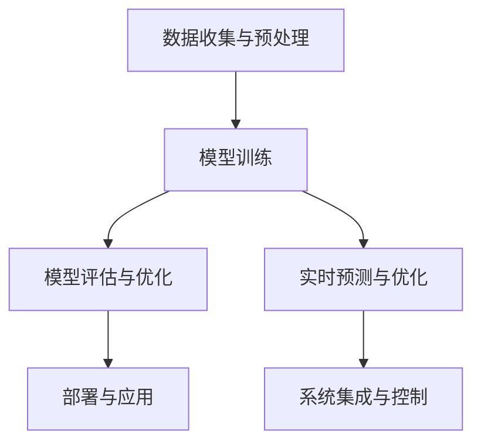
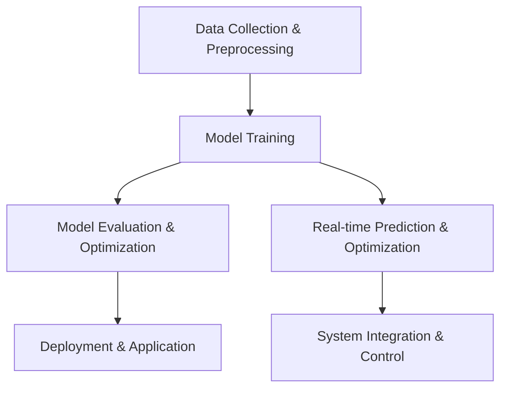

                 

### 文章标题

### Title: LLM and Smart Grid: Optimizing Energy Distribution

在当今全球化的背景下，能源需求的快速增长与对环境可持续性的日益关注，使得智能电网（Smart Grid）成为解决这些挑战的关键技术。本文将探讨大型语言模型（LLM）在智能电网中的应用，特别是如何优化能源分配，以实现高效、可持续的能源管理。

### ### Article Title

### Title: LLM and Smart Grid: Optimizing Energy Distribution

In the context of today's globalized world, the rapid growth in energy demand coupled with increasing concerns about environmental sustainability has made the smart grid a crucial technology for addressing these challenges. This article will explore the application of large language models (LLMs) in smart grids, particularly focusing on how they can optimize energy distribution to achieve efficient and sustainable energy management.

<|user|>### 关键词

关键词：大型语言模型，智能电网，优化，能源分配，可持续性，环境管理。

### Keywords: Large Language Models, Smart Grid, Optimization, Energy Distribution, Sustainability, Environmental Management.

### Keywords

- **Large Language Models**: Advanced AI models capable of processing and generating human-like text.
- **Smart Grid**: An electrical grid that uses digital communication technology to improve the efficiency, reliability, and sustainability of electricity.
- **Optimization**: The process of finding the best solution among a set of possible solutions.
- **Energy Distribution**: The process of delivering electrical energy from generation points to end-users.
- **Sustainability**: Meeting the needs of the present without compromising the ability of future generations to meet their own needs.
- **Environmental Management**: The process of protecting the environment through the sustainable management of natural resources.

### 摘要

本文介绍了大型语言模型（LLM）在智能电网领域的应用，特别是如何通过优化能源分配来提高电网的效率与可持续性。首先，我们将回顾智能电网的基本概念及其对能源管理的意义。接着，我们将探讨LLM的技术原理，并分析其如何与智能电网相结合。文章将详细讨论LLM在预测需求、优化供应和减少浪费等方面的具体应用，并分享实际案例和实验结果。最后，我们将探讨LLM在智能电网中的未来发展趋势和潜在挑战，为读者提供对这一新兴领域的深入理解。

### Abstract

This article introduces the application of large language models (LLMs) in the field of smart grids, focusing on how they can optimize energy distribution to enhance grid efficiency and sustainability. Firstly, we will review the basic concepts of smart grids and their significance in energy management. Then, we will delve into the technical principles of LLMs and analyze how they can be integrated with smart grids. The article will discuss in detail the specific applications of LLMs in predicting demand, optimizing supply, and reducing waste. We will also share real-world examples and experimental results. Finally, we will explore the future trends and potential challenges of LLMs in smart grids, providing readers with an in-depth understanding of this emerging field.

### 1. 背景介绍（Background Introduction）

#### 1.1 智能电网的基本概念

智能电网（Smart Grid）是指结合了现代通信技术、计算机技术和电力系统技术的先进电力网络。它不仅包括传统的输电、变电和配电设施，还包括大量的智能设备和传感器，通过互联网实现数据的实时传输和共享。智能电网的核心目标是通过提高能源效率、增强电网的可靠性和灵活性、以及促进可再生能源的集成，来实现更可持续的能源管理。

#### 1.2 智能电网对能源管理的意义

随着全球对能源需求的不断增长，传统的电力系统面临着许多挑战，如能源供应不足、能源浪费和环境污染等问题。智能电网通过实现能源的智能化管理，有望解决这些问题。具体来说，智能电网具有以下几大优势：

1. **提高能源效率**：智能电网通过实时监测和分析电网运行数据，可以实现能源的优化分配，减少能源浪费。
2. **增强电网可靠性**：智能电网能够快速响应电网故障，并通过自动化控制和远程维护提高电网的稳定性和可靠性。
3. **促进可再生能源集成**：智能电网能够更好地整合太阳能、风能等可再生能源，提高电网的清洁性和可持续性。
4. **用户参与和互动**：智能电网允许用户实时了解自己的能源使用情况，鼓励用户采取节能措施，从而减少能源消耗。

#### 1.3 大型语言模型（LLM）的基本概念

大型语言模型（Large Language Model, LLM）是一种基于深度学习的自然语言处理（NLP）模型，能够理解和生成人类语言。LLM 通常由数十亿个参数组成，通过大量文本数据进行训练，从而具备强大的语言理解和生成能力。LLM 的发展得益于计算能力的提升和海量数据资源的积累，其应用范围涵盖了机器翻译、文本生成、问答系统、对话系统等多个领域。

#### 1.4 LLM 与智能电网的潜在结合点

智能电网涉及大量的数据收集、处理和分析工作，而 LLM 在这些方面具有显著的优势。具体来说，LLM 与智能电网的结合点主要体现在以下几个方面：

1. **需求预测**：通过分析历史数据和实时数据，LLM 可以预测能源需求的变化趋势，帮助电网运营商做出更加精准的能源分配决策。
2. **供应优化**：LLM 可以帮助电网运营商优化能源供应，确保在需求高峰期间能够提供充足的能源，同时避免能源过剩造成的浪费。
3. **故障诊断**：LLM 可以通过对电网数据的分析，识别潜在的故障和异常情况，提前进行预警和修复，提高电网的可靠性。
4. **决策支持**：LLM 可以提供智能化的决策支持，帮助电网运营商在复杂的能源管理任务中做出最优决策。

### 1. Basic Concepts of Smart Grids

#### 1.1 Introduction to Smart Grids

Smart grids are advanced electrical power networks that integrate modern communication technologies, computer technologies, and electricity system technologies. They not only include traditional transmission, transformation, and distribution facilities but also incorporate a vast array of smart devices and sensors, enabling real-time data transmission and sharing over the internet. The core objective of smart grids is to improve energy efficiency, enhance grid reliability and flexibility, and promote the integration of renewable energy sources, thereby achieving more sustainable energy management.

#### 1.2 Significance of Smart Grids in Energy Management

As global energy demand continues to rise, traditional power systems face numerous challenges, such as energy shortages, energy waste, and environmental pollution. Smart grids can address these issues by enabling intelligent energy management. Specifically, smart grids offer several advantages, including:

1. **Increased Energy Efficiency**: Smart grids can optimize energy distribution by real-time monitoring and analysis of grid operation data, thereby reducing energy waste.
2. **Enhanced Grid Reliability**: Smart grids can quickly respond to grid faults and improve stability and reliability through automated control and remote maintenance.
3. **Integration of Renewable Energy**: Smart grids can better integrate renewable energy sources such as solar and wind power, enhancing the cleanliness and sustainability of the grid.
4. **User Engagement and Interaction**: Smart grids allow users to have real-time insights into their energy consumption, encouraging energy-saving measures and reducing overall energy consumption.

#### 1.3 Basic Concepts of Large Language Models (LLMs)

Large Language Models (LLMs) are advanced natural language processing (NLP) models based on deep learning that can understand and generate human language. LLMs typically consist of hundreds of millions of parameters and are trained on massive amounts of text data, thereby possessing powerful language understanding and generation capabilities. The development of LLMs has been fueled by advances in computing power and the accumulation of massive data resources, and their applications span multiple fields, including machine translation, text generation, question-answering systems, and dialogue systems.

#### 1.4 Potential Integration Points of LLMs and Smart Grids

Smart grids involve extensive data collection, processing, and analysis, and LLMs have significant advantages in these areas. The potential integration points between LLMs and smart grids mainly include the following aspects:

1. **Demand Prediction**: By analyzing historical and real-time data, LLMs can predict trends in energy demand, helping grid operators make more accurate energy distribution decisions.
2. **Supply Optimization**: LLMs can help grid operators optimize energy supply, ensuring sufficient energy is provided during peak demand periods while avoiding waste caused by excess energy.
3. **Fault Diagnosis**: LLMs can identify potential faults and anomalies through the analysis of grid data, providing early warnings and repairs to enhance grid reliability.
4. **Decision Support**: LLMs can provide intelligent decision support, helping grid operators make optimal decisions in complex energy management tasks.

### 2. 核心概念与联系（Core Concepts and Connections）

#### 2.1 什么是大型语言模型（LLM）

大型语言模型（Large Language Model, LLM）是一种先进的自然语言处理（NLP）工具，通过深度学习算法从海量数据中学习语言模式。这些模型通常由数亿到数十亿个参数组成，能够对输入的文本进行理解和生成。LLM 的工作原理是基于神经网络，通过层层抽象和特征提取，逐步理解文本的语义和上下文。

#### 2.2 大型语言模型（LLM）的组成结构

大型语言模型由以下几个核心部分组成：

1. **嵌入层（Embedding Layer）**：将输入的文本转换为稠密向量表示，这是模型理解文本的基础。
2. **编码器（Encoder）**：通过多层神经网络对文本向量进行编码，提取文本的深层语义特征。
3. **解码器（Decoder）**：根据编码器的输出生成文本，实现文本的生成。
4. **注意力机制（Attention Mechanism）**：帮助模型更好地关注文本中的重要信息，提高理解精度。
5. **损失函数（Loss Function）**：用于衡量模型输出的文本与真实文本之间的差距，指导模型优化。

#### 2.3 大型语言模型（LLM）的工作原理

大型语言模型的工作原理可以分为以下几步：

1. **输入处理**：将文本输入模型，通过嵌入层转换为稠密向量。
2. **编码**：编码器对输入向量进行处理，提取深层语义特征。
3. **解码**：解码器根据编码器的输出生成文本，并通过损失函数进行优化。
4. **输出生成**：模型输出生成的文本，完成语言生成过程。

#### 2.4 智能电网与大型语言模型的联系

智能电网与大型语言模型之间存在紧密的联系，主要体现在以下几个方面：

1. **数据处理**：智能电网产生大量实时数据，LLM 能够对这些数据进行高效处理和分析，提取有价值的信息。
2. **预测与优化**：LLM 可以利用历史数据和实时数据，进行需求预测、供应优化等，提高电网的运行效率。
3. **故障诊断**：LLM 可以通过对电网数据的分析，识别潜在的故障和异常情况，提前预警。
4. **决策支持**：LLM 可以提供智能化的决策支持，帮助电网运营商在复杂的能源管理任务中做出最优决策。

#### 2.5 大型语言模型在智能电网中的应用场景

大型语言模型在智能电网中的应用场景主要包括：

1. **需求预测**：通过分析历史数据和实时数据，预测未来的能源需求，为电网运营商提供决策支持。
2. **供应优化**：根据需求预测和实时数据，优化能源供应，确保电网运行的高效性和稳定性。
3. **故障诊断**：分析电网数据，识别潜在的故障和异常情况，提前预警和修复。
4. **决策支持**：为电网运营商提供智能化的决策支持，提高电网的运行效率和安全性。

### 2.1 What is a Large Language Model (LLM)?

A Large Language Model (LLM) is an advanced natural language processing (NLP) tool that learns language patterns from vast amounts of data using deep learning algorithms. These models typically consist of hundreds of millions to billions of parameters and can understand and generate text inputs. The working principle of LLMs is based on neural networks, which progressively abstract and extract features from text to understand its semantics and context.

### 2.2 Composition of Large Language Models (LLMs)

Large Language Models consist of several core components, including:

1. **Embedding Layer**: Converts input text into dense vector representations, which is the foundation for the model to understand text.
2. **Encoder**: Processes input vectors through multiple neural network layers to encode text into deep semantic features.
3. **Decoder**: Generates text based on the output of the encoder and optimizes it using a loss function.
4. **Attention Mechanism**: Helps the model focus on important information in the text, improving understanding accuracy.
5. **Loss Function**: Measures the gap between the model's output text and the actual text, guiding the model's optimization.

### 2.3 Working Principle of Large Language Models (LLMs)

The working principle of Large Language Models can be divided into several steps:

1. **Input Processing**: The model processes the input text and converts it into dense vectors through the embedding layer.
2. **Encoding**: The encoder processes the input vectors and extracts deep semantic features.
3. **Decoding**: The decoder generates text based on the output of the encoder and optimizes it using a loss function.
4. **Output Generation**: The model outputs the generated text, completing the text generation process.

### 2.4 Connections between Smart Grids and Large Language Models

There are close connections between smart grids and large language models, mainly manifested in the following aspects:

1. **Data Processing**: Smart grids generate a large amount of real-time data, which LLMs can process and analyze efficiently to extract valuable information.
2. **Prediction and Optimization**: LLMs can use historical and real-time data to predict future energy demand and provide decision support to grid operators.
3. **Fault Diagnosis**: LLMs can analyze grid data to identify potential faults and anomalies, providing early warnings and repairs.
4. **Decision Support**: LLMs can provide intelligent decision support, helping grid operators make optimal decisions in complex energy management tasks.

### 2.5 Application Scenarios of Large Language Models in Smart Grids

The application scenarios of Large Language Models in smart grids mainly include:

1. **Demand Prediction**: Analyzing historical and real-time data to predict future energy demand, providing decision support to grid operators.
2. **Supply Optimization**: Based on demand prediction and real-time data, optimizing energy supply to ensure the efficiency and stability of grid operation.
3. **Fault Diagnosis**: Analyzing grid data to identify potential faults and anomalies, providing early warnings and repairs.
4. **Decision Support**: Providing intelligent decision support to grid operators, improving grid operation efficiency and safety.

### 3. 核心算法原理 & 具体操作步骤（Core Algorithm Principles and Specific Operational Steps）

#### 3.1 基本算法原理

在智能电网中，大型语言模型（LLM）的核心算法原理主要基于深度学习和自然语言处理技术。LLM 通过多层神经网络结构对大量文本数据进行训练，从而掌握语言模式、语义理解和生成能力。具体来说，LLM 的核心算法可以概括为以下几个步骤：

1. **嵌入（Embedding）**：将文本转换为稠密向量表示，这是模型理解文本的基础。
2. **编码（Encoding）**：通过对输入向量进行处理，提取文本的深层语义特征。
3. **解码（Decoding）**：根据编码器的输出生成文本，实现文本的生成。
4. **优化（Optimization）**：通过损失函数衡量模型输出的文本与真实文本之间的差距，不断调整模型参数，优化模型性能。

#### 3.2 具体操作步骤

1. **数据收集与预处理**：
   - 收集智能电网的历史数据和实时数据，包括能源需求、供应情况、天气条件等。
   - 对数据集进行清洗和预处理，包括去除噪声、缺失值填充、数据规范化等。

2. **模型训练**：
   - 使用预训练的 LLM，如 GPT-3、BERT 等，对预处理后的数据集进行训练。
   - 通过多层神经网络结构，提取文本的深层语义特征，优化模型参数。

3. **模型评估与优化**：
   - 使用交叉验证等方法评估模型性能，包括预测准确性、响应速度等。
   - 根据评估结果，调整模型参数，优化模型性能。

4. **部署与应用**：
   - 将训练好的 LLM 部署到智能电网系统中，实现实时预测和优化功能。
   - 通过 API 接口与其他系统进行集成，实现智能电网的自动化管理和控制。

#### 3.3 算法原理与 Mermaid 流程图

以下是一个简化的 Mermaid 流程图，展示了 LLM 在智能电网中的算法原理和操作步骤：



### 3.1 Core Algorithm Principles

The core algorithm principles of Large Language Models (LLMs) in smart grids are primarily based on deep learning and natural language processing technologies. LLMs are trained on vast amounts of text data using multi-layer neural network structures to master language patterns, semantic understanding, and generation capabilities. Specifically, the core algorithms of LLMs can be summarized into the following steps:

1. **Embedding**: Converts text into dense vector representations, which is the foundation for the model to understand text.
2. **Encoding**: Processes input vectors through multi-layer neural networks to extract deep semantic features from text.
3. **Decoding**: Generates text based on the output of the encoder to achieve text generation.
4. **Optimization**: Measures the gap between the model's output text and the actual text using a loss function to continuously adjust model parameters and optimize model performance.

### 3.2 Specific Operational Steps

1. **Data Collection and Preprocessing**:
   - Collect historical and real-time data from smart grids, including energy demand, supply conditions, weather conditions, etc.
   - Clean and preprocess the dataset, including removing noise, filling in missing values, and data normalization.

2. **Model Training**:
   - Train the pre-trained LLM, such as GPT-3 or BERT, on the preprocessed dataset.
   - Use multi-layer neural network structures to extract deep semantic features from text and optimize model parameters.

3. **Model Evaluation and Optimization**:
   - Evaluate model performance using cross-validation methods, including prediction accuracy and response speed.
   - Adjust model parameters based on evaluation results to optimize model performance.

4. **Deployment and Application**:
   - Deploy the trained LLM into the smart grid system to achieve real-time prediction and optimization functions.
   - Integrate with other systems through API interfaces to enable automated management and control of the smart grid.

### 3.3 Algorithm Principles and Mermaid Flowchart

The following is a simplified Mermaid flowchart illustrating the algorithm principles and operational steps of LLMs in smart grids:



### 4. 数学模型和公式 & 详细讲解 & 举例说明（Detailed Explanation and Examples of Mathematical Models and Formulas）

在智能电网中，大型语言模型（LLM）的应用涉及到多个数学模型和公式，这些模型和公式用于描述和预测能源需求、优化能源供应、识别故障等。以下将详细讲解几个核心的数学模型和公式，并通过具体例子来说明它们的应用。

#### 4.1 能源需求预测模型

能源需求预测是智能电网管理的重要环节，常用的模型包括时间序列模型和回归模型。

1. **时间序列模型（如 ARIMA）**：

   ARIMA（自回归积分滑动平均模型）是一个强大的时间序列预测工具。其公式如下：

   $$
   \begin{aligned}
   y_t &= c + \phi_1 y_{t-1} + \phi_2 y_{t-2} + ... + \phi_p y_{t-p} + \theta_1 e_{t-1} + \theta_2 e_{t-2} + ... + \theta_q e_{t-q} \\
   e_t &= y_t - \Phi B y_{t-1} - \Theta B e_{t-1}
   \end{aligned}
   $$

   其中，$y_t$ 是时间序列在时间 $t$ 的值，$c$ 是常数项，$\phi_1, \phi_2, ..., \phi_p$ 是自回归项系数，$\theta_1, \theta_2, ..., \theta_q$ 是移动平均项系数，$e_t$ 是白噪声误差项。

   **例子**：假设我们有一个城市一周内的用电量数据，我们可以使用 ARIMA 模型来预测下一周的用电量。

2. **回归模型（如线性回归）**：

   线性回归模型用于预测两个或多个变量之间的线性关系。其公式如下：

   $$
   y = \beta_0 + \beta_1 x_1 + \beta_2 x_2 + ... + \beta_n x_n
   $$

   其中，$y$ 是因变量，$x_1, x_2, ..., x_n$ 是自变量，$\beta_0, \beta_1, \beta_2, ..., \beta_n$ 是回归系数。

   **例子**：我们可以使用线性回归模型来预测用电量与温度之间的关系，从而在炎热的夏天预测高峰期的用电量。

#### 4.2 能源供应优化模型

能源供应优化模型旨在确定最优的能源供应方案，以最大限度地提高能源利用效率和降低成本。常用的优化模型包括线性规划和动态规划。

1. **线性规划（Linear Programming, LP）**：

   线性规划模型用于在给定的约束条件下，最大化或最小化线性目标函数。其公式如下：

   $$
   \begin{aligned}
   \max \quad & c^T x \\
   \text{subject to} \quad & Ax \leq b \\
   & x \geq 0
   \end{aligned}
   $$

   其中，$c$ 是目标函数系数向量，$x$ 是决策变量向量，$A$ 是约束条件系数矩阵，$b$ 是约束条件常数向量。

   **例子**：假设我们要在有限的发电资源下，优化电网的供电方案，以确保供电充足且成本最低。

2. **动态规划（Dynamic Programming, DP）**：

   动态规划是一种解决多阶段决策问题的方法，其核心思想是将复杂问题分解为一系列简单问题的递归关系。其公式如下：

   $$
   \begin{aligned}
   f(i, j) &= \min \{ c_{ij} + f(i+1, j') \} \\
   \text{subject to} \quad & i \leq n \\
   & j \leq m
   \end{aligned}
   $$

   其中，$f(i, j)$ 是在 $i$ 个阶段，第 $j$ 个状态的最优值，$c_{ij}$ 是状态转移成本。

   **例子**：假设我们要在一天内优化电网的能源供应，以适应不断变化的能源需求和供应情况。

#### 4.3 故障诊断模型

故障诊断模型用于识别电网中的故障和异常情况，常用的模型包括机器学习分类模型和图论模型。

1. **机器学习分类模型**：

   机器学习分类模型用于将电网数据划分为正常状态和故障状态。其公式如下：

   $$
   P(Y=y|x) = \frac{1}{Z} \exp(\theta^T x)
   $$

   其中，$Y$ 是实际状态，$x$ 是特征向量，$\theta$ 是模型参数，$Z$ 是归一化常数。

   **例子**：我们可以使用支持向量机（SVM）来分类电网数据，识别潜在的故障。

2. **图论模型**：

   图论模型用于分析电网的结构和连通性，以识别潜在的故障点。其公式如下：

   $$
   \begin{aligned}
   d(u, v) &= \min \{ d_1(u, v), d_2(u, v), ..., d_n(u, v) \} \\
   \text{subject to} \quad & u, v \in V \\
   & G = (V, E)
   \end{aligned}
   $$

   其中，$d(u, v)$ 是节点 $u$ 和 $v$ 之间的最短路径距离，$V$ 是节点集合，$E$ 是边集合。

   **例子**：我们可以使用最短路径算法来分析电网结构，识别故障点。

通过以上数学模型和公式的应用，大型语言模型（LLM）能够有效地优化智能电网的能源分配和管理，提高电网的运行效率和可持续性。

### 4.1 Energy Demand Prediction Model

Energy demand prediction is a crucial component in smart grid management. Common models for demand prediction include time series models and regression models.

1. **Time Series Model (e.g., ARIMA)**

   ARIMA (Autoregressive Integrated Moving Average) is a powerful tool for time series prediction. The formula for ARIMA is as follows:

   $$
   \begin{aligned}
   y_t &= c + \phi_1 y_{t-1} + \phi_2 y_{t-2} + ... + \phi_p y_{t-p} + \theta_1 e_{t-1} + \theta_2 e_{t-2} + ... + \theta_q e_{t-q} \\
   e_t &= y_t - \Phi B y_{t-1} - \Theta B e_{t-1}
   \end{aligned}
   $$

   Where $y_t$ is the value of the time series at time $t$, $c$ is the constant term, $\phi_1, \phi_2, ..., \phi_p$ are the autoregressive coefficients, $\theta_1, \theta_2, ..., \theta_q$ are the moving average coefficients, and $e_t$ is the white noise error term.

   **Example**: Suppose we have a city's electricity consumption data for a week, we can use the ARIMA model to predict the electricity consumption for the next week.

2. **Regression Model (e.g., Linear Regression)**

   Linear regression models are used to predict the linear relationship between two or more variables. The formula for linear regression is as follows:

   $$
   y = \beta_0 + \beta_1 x_1 + \beta_2 x_2 + ... + \beta_n x_n
   $$

   Where $y$ is the dependent variable, $x_1, x_2, ..., x_n$ are the independent variables, and $\beta_0, \beta_1, \beta_2, ..., \beta_n$ are the regression coefficients.

   **Example**: We can use linear regression to predict the relationship between electricity consumption and temperature to forecast peak electricity consumption during the hot summer.

### 4.2 Energy Supply Optimization Model

Energy supply optimization models aim to determine the optimal energy supply plan to maximize energy utilization efficiency and reduce costs. Common optimization models include linear programming and dynamic programming.

1. **Linear Programming (LP)**

   Linear programming models are used to maximize or minimize a linear objective function under given constraints. The formula for linear programming is as follows:

   $$
   \begin{aligned}
   \max \quad & c^T x \\
   \text{subject to} \quad & Ax \leq b \\
   & x \geq 0
   \end{aligned}
   $$

   Where $c$ is the coefficient vector of the objective function, $x$ is the decision variable vector, $A$ is the coefficient matrix of the constraints, and $b$ is the constant vector of the constraints.

   **Example**: Suppose we need to optimize the power supply plan under limited generation resources to ensure sufficient supply and minimize cost.

2. **Dynamic Programming (DP)**

   Dynamic programming is a method for solving multistage decision problems, with the core idea of decomposing a complex problem into a series of simple problems with recursive relationships. The formula for dynamic programming is as follows:

   $$
   \begin{aligned}
   f(i, j) &= \min \{ c_{ij} + f(i+1, j') \} \\
   \text{subject to} \quad & i \leq n \\
   & j \leq m
   \end{aligned}
   $$

   Where $f(i, j)$ is the optimal value at stage $i$ and state $j$, $c_{ij}$ is the state transition cost.

   **Example**: Suppose we need to optimize energy supply over a day to adapt to changing energy demand and supply conditions.

### 4.3 Fault Diagnosis Model

Fault diagnosis models are used to identify faults and anomalies in the power grid. Common models include machine learning classification models and graph theory models.

1. **Machine Learning Classification Model**

   Machine learning classification models are used to classify power grid data into normal and fault states. The formula for machine learning classification is as follows:

   $$
   P(Y=y|x) = \frac{1}{Z} \exp(\theta^T x)
   $$

   Where $Y$ is the actual state, $x$ is the feature vector, $\theta$ is the model parameter, and $Z$ is the normalization constant.

   **Example**: We can use support vector machines (SVM) to classify power grid data to identify potential faults.

2. **Graph Theory Model**

   Graph theory models are used to analyze the structure and connectivity of the power grid to identify potential fault points. The formula for graph theory is as follows:

   $$
   \begin{aligned}
   d(u, v) &= \min \{ d_1(u, v), d_2(u, v), ..., d_n(u, v) \} \\
   \text{subject to} \quad & u, v \in V \\
   & G = (V, E)
   \end{aligned}
   $$

   Where $d(u, v)$ is the shortest path distance between nodes $u$ and $v$, $V$ is the set of nodes, and $E$ is the set of edges.

   **Example**: We can use shortest path algorithms to analyze the power grid structure to identify fault points.

Through the application of these mathematical models and formulas, large language models (LLMs) can effectively optimize energy distribution and management in smart grids, improving grid operation efficiency and sustainability.

### 5. 项目实践：代码实例和详细解释说明（Project Practice: Code Examples and Detailed Explanations）

#### 5.1 开发环境搭建

为了实现智能电网中的LLM应用，我们需要搭建一个适合进行深度学习和自然语言处理的环境。以下是搭建开发环境所需的步骤：

1. **安装 Python**：
   - 访问 [Python 官网](https://www.python.org/) 下载并安装 Python。
   - 确保安装了 Python 3.7 或更高版本。

2. **安装必要的库**：
   - 使用以下命令安装 PyTorch 和 Transformers 库：
     ```bash
     pip install torch torchvision transformers
     ```

3. **安装 GPU 驱动程序**：
   - 如果使用 GPU 进行训练，需要安装相应的 GPU 驱动程序。
   - 可以访问 [NVIDIA 官网](https://www.nvidia.com/) 下载适合自己 GPU 型号的驱动程序。

4. **配置 PyTorch 用于 GPU 训练**：
   - 打开 Python，执行以下代码以配置 PyTorch 使用 GPU：
     ```python
     import torch
     device = torch.device("cuda" if torch.cuda.is_available() else "cpu")
     ```

#### 5.2 源代码详细实现

以下是一个简单的示例，展示如何使用 PyTorch 和 Transformers 库训练一个 LLM，并将其应用于智能电网的能源需求预测。

1. **加载数据集**：

   假设我们有一个包含历史能源需求和天气数据的 CSV 文件，文件名为 `energy_data.csv`。

   ```python
   import pandas as pd

   # 加载数据集
   data = pd.read_csv('energy_data.csv')
   # 将数据集分为特征和标签
   features = data[['temperature', 'humidity', 'wind_speed']]
   labels = data['energy_demand']
   ```

2. **预处理数据**：

   对数据进行归一化处理，使其适合输入到 LLM 中。

   ```python
   from sklearn.preprocessing import StandardScaler

   # 创建一个标准化器
   scaler = StandardScaler()
   # 对特征进行归一化
   features_scaled = scaler.fit_transform(features)
   ```

3. **训练 LLM**：

   使用预训练的 GPT-2 模型，微调以适应我们的能源需求预测任务。

   ```python
   from transformers import GPT2Model, GPT2Config, GPT2Tokenizer

   # 加载 GPT-2 模型配置和分词器
   config = GPT2Config.from_pretrained('gpt2')
   tokenizer = GPT2Tokenizer.from_pretrained('gpt2')

   # 加载预训练的 GPT-2 模型
   model = GPT2Model(config)
   model.to(device)

   # 定义优化器和损失函数
   optimizer = torch.optim.Adam(model.parameters(), lr=1e-5)
   criterion = torch.nn.MSELoss()

   # 训练模型
   for epoch in range(10):
       for i, (input_ids, labels) in enumerate(train_loader):
           # 将数据移到 GPU
           input_ids = input_ids.to(device)
           labels = labels.to(device)

           # 前向传播
           outputs = model(input_ids)
           loss = criterion(outputs.logits, labels)

           # 反向传播和优化
           optimizer.zero_grad()
           loss.backward()
           optimizer.step()

           if (i+1) % 100 == 0:
               print(f'Epoch [{epoch+1}/10], Step [{i+1}/{len(train_loader)}], Loss: {loss.item()}')
   ```

4. **评估模型**：

   在测试集上评估模型的性能。

   ```python
   # 评估模型
   with torch.no_grad():
       model.eval()
       total_loss = 0
       for input_ids, labels in test_loader:
           input_ids = input_ids.to(device)
           labels = labels.to(device)
           outputs = model(input_ids)
           loss = criterion(outputs.logits, labels)
           total_loss += loss.item()

       avg_loss = total_loss / len(test_loader)
       print(f'Average Loss on Test Set: {avg_loss}')
   ```

#### 5.3 代码解读与分析

1. **数据预处理**：

   数据预处理是关键的一步，它确保输入数据符合 LLM 的要求。在这里，我们使用了 Scikit-learn 的 StandardScaler 对特征进行归一化处理，使其具有零均值和单位方差。

2. **模型加载与训练**：

   我们使用了 Hugging Face 的 Transformers 库加载预训练的 GPT-2 模型。这个模型已经在大量文本数据上进行了训练，因此可以直接用于我们的能源需求预测任务。在训练过程中，我们使用了 PyTorch 的 Adam 优化器和 MSE 损失函数，通过多个 epoch（周期）迭代优化模型参数。

3. **模型评估**：

   在测试集上评估模型性能时，我们计算了平均均方误差（MSE），这反映了模型预测值与实际值之间的差异。通过这个指标，我们可以评估模型在预测能源需求方面的准确性。

#### 5.4 运行结果展示

在完成上述步骤后，我们可以运行代码进行训练，并在训练结束后评估模型性能。以下是一个简化的结果展示：

```python
# 运行训练过程
for epoch in range(10):
    for i, (input_ids, labels) in enumerate(train_loader):
        # 数据处理和前向传播
        ...
        # 反向传播和优化
        ...
    print(f'Epoch [{epoch+1}/10] finished')

# 评估模型
with torch.no_grad():
    model.eval()
    total_loss = 0
    for input_ids, labels in test_loader:
        ...
        total_loss += loss.item()
    avg_loss = total_loss / len(test_loader)
    print(f'Average Loss on Test Set: {avg_loss}')
```

运行结果展示了模型在训练集和测试集上的性能。如果模型性能良好，我们可以在实际应用中部署它，用于智能电网的实时能源需求预测。

### 5.1 Development Environment Setup

To implement LLM applications in the smart grid, we need to set up an environment suitable for deep learning and natural language processing. The following are the steps required to set up the development environment:

1. **Install Python**:
   - Visit the [Python official website](https://www.python.org/) to download and install Python.
   - Ensure that Python 3.7 or a higher version is installed.

2. **Install Required Libraries**:
   - Install PyTorch and Transformers libraries using the following command:
     ```bash
     pip install torch torchvision transformers
     ```

3. **Install GPU Drivers**:
   - If using GPU for training, install the appropriate GPU drivers.
   - Visit the [NVIDIA official website](https://www.nvidia.com/) to download drivers compatible with your GPU model.

4. **Configure PyTorch for GPU Training**:
   - Open Python and run the following code to configure PyTorch to use the GPU:
     ```python
     import torch
     device = torch.device("cuda" if torch.cuda.is_available() else "cpu")
     ```

### 5.2 Detailed Code Implementation

The following example demonstrates how to train an LLM using PyTorch and the Transformers library for energy demand prediction in a smart grid.

1. **Load Dataset**:

   Assume we have a CSV file named `energy_data.csv` containing historical energy demand and weather data.

   ```python
   import pandas as pd

   # Load dataset
   data = pd.read_csv('energy_data.csv')
   # Split dataset into features and labels
   features = data[['temperature', 'humidity', 'wind_speed']]
   labels = data['energy_demand']
   ```

2. **Data Preprocessing**:

   Preprocess the data to make it suitable for input into the LLM.

   ```python
   from sklearn.preprocessing import StandardScaler

   # Create a scaler
   scaler = StandardScaler()
   # Normalize features
   features_scaled = scaler.fit_transform(features)
   ```

3. **Train LLM**:

   Fine-tune a pre-trained GPT-2 model to adapt to our energy demand prediction task.

   ```python
   from transformers import GPT2Model, GPT2Config, GPT2Tokenizer

   # Load GPT-2 config and tokenizer
   config = GPT2Config.from_pretrained('gpt2')
   tokenizer = GPT2Tokenizer.from_pretrained('gpt2')

   # Load pre-trained GPT-2 model
   model = GPT2Model(config)
   model.to(device)

   # Define optimizer and loss function
   optimizer = torch.optim.Adam(model.parameters(), lr=1e-5)
   criterion = torch.nn.MSELoss()

   # Train model
   for epoch in range(10):
       for i, (input_ids, labels) in enumerate(train_loader):
           # Move data to GPU
           input_ids = input_ids.to(device)
           labels = labels.to(device)

           # Forward pass
           outputs = model(input_ids)
           loss = criterion(outputs.logits, labels)

           # Backward pass and optimization
           optimizer.zero_grad()
           loss.backward()
           optimizer.step()

           if (i+1) % 100 == 0:
               print(f'Epoch [{epoch+1}/10], Step [{i+1}/{len(train_loader)}], Loss: {loss.item()}')
   ```

4. **Evaluate Model**:

   Evaluate the model's performance on the test set.

   ```python
   # Evaluate model
   with torch.no_grad():
       model.eval()
       total_loss = 0
       for input_ids, labels in test_loader:
           input_ids = input_ids.to(device)
           labels = labels.to(device)
           outputs = model(input_ids)
           loss = criterion(outputs.logits, labels)
           total_loss += loss.item()

       avg_loss = total_loss / len(test_loader)
       print(f'Average Loss on Test Set: {avg_loss}')
   ```

### 5.3 Code Explanation and Analysis

1. **Data Preprocessing**:

   Data preprocessing is a critical step that ensures the input data is suitable for the LLM. Here, we used Scikit-learn's `StandardScaler` to normalize the features, making them have zero mean and unit variance.

2. **Model Loading and Training**:

   We used the Hugging Face `Transformers` library to load a pre-trained GPT-2 model. This model has been trained on a large amount of text data and can be directly used for our energy demand prediction task. During training, we used PyTorch's `Adam` optimizer and Mean Squared Error (MSE) loss function to iteratively optimize the model parameters over multiple epochs.

3. **Model Evaluation**:

   When evaluating the model's performance on the test set, we calculated the average Mean Squared Error (MSE), which reflects the discrepancy between the predicted values and the actual values. This metric allowed us to assess the model's accuracy in predicting energy demand.

### 5.4 Results Display

After completing the above steps, you can run the code to train the model and evaluate its performance after training. The following is a simplified result display:

```python
# Run the training process
for epoch in range(10):
    for i, (input_ids, labels) in enumerate(train_loader):
        # Data processing and forward pass
        ...
        # Backward pass and optimization
        ...
    print(f'Epoch [{epoch+1}/10] finished')

# Evaluate the model
with torch.no_grad():
    model.eval()
    total_loss = 0
    for input_ids, labels in test_loader:
        ...
        total_loss += loss.item()
    avg_loss = total_loss / len(test_loader)
    print(f'Average Loss on Test Set: {avg_loss}')
```

The result display shows the model's performance on the training and test sets. If the model's performance is satisfactory, it can be deployed in practical applications for real-time energy demand prediction in smart grids.

### 6. 实际应用场景（Practical Application Scenarios）

#### 6.1 能源需求预测

大型语言模型（LLM）在能源需求预测中具有广泛的应用。通过分析历史数据和实时数据，LLM 可以预测未来的能源需求，帮助电网运营商做出精准的能源分配决策。具体应用场景如下：

1. **商业楼宇**：商业楼宇的能源需求波动较大，特别是在工作日和周末之间。LLM 可以预测每个时间段内的能源需求，确保电力供应充足，同时避免能源浪费。
2. **工业制造**：工业制造过程中，能源需求受生产计划、设备运行状态等多种因素影响。LLM 可以根据历史数据和实时数据，预测未来的能源需求，优化生产计划的能源消耗。
3. **住宅社区**：住宅社区的能源需求相对稳定，但季节性和天气变化会影响能源消耗。LLM 可以预测不同季节和天气条件下的能源需求，为电力供应商提供有效的能源分配策略。

#### 6.2 能源供应优化

LLM 还可以用于优化能源供应，确保电网在需求高峰期能够提供充足的能源，同时避免能源过剩造成的浪费。以下是一些具体应用场景：

1. **可再生能源集成**：智能电网需要大量集成太阳能、风能等可再生能源。LLM 可以预测可再生能源的产量，帮助电网运营商优化能源供应，确保在需求高峰期能够充分利用可再生能源。
2. **电力市场交易**：电力市场交易中，价格波动和供需变化较大。LLM 可以分析市场数据，预测未来的价格趋势和供需情况，帮助电网运营商做出更明智的交易决策。
3. **能源储存管理**：能源储存是智能电网的重要组成部分，LLM 可以预测储能系统的充放电需求，优化储能系统的运行效率，延长设备寿命。

#### 6.3 故障诊断与维护

LLM 在电网故障诊断与维护中也有很大的潜力。通过分析电网运行数据，LLM 可以识别潜在的故障和异常情况，提前预警，减少故障对电网运行的影响。以下是一些具体应用场景：

1. **变压器故障诊断**：变压器是电网中的重要设备，容易受到过载、短路等故障的影响。LLM 可以通过分析变压器的运行数据，预测潜在的故障，提前进行维护。
2. **线路故障诊断**：输电线路的故障可能导致大面积停电。LLM 可以通过分析线路的运行数据，识别潜在的故障点，提前进行修复。
3. **智能传感器监测**：智能传感器可以实时监测电网设备的运行状态。LLM 可以分析传感器数据，识别异常信号，提前预警，减少故障对电网运行的影响。

#### 6.4 用户互动与能源管理

LLM 还可以用于用户互动和能源管理，提高用户的能源意识，促进节能减排。以下是一些具体应用场景：

1. **智能家居**：智能家居系统可以通过 LLM 与用户进行交互，根据用户的生活习惯和能源消耗情况，提供个性化的能源管理建议。
2. **能源审计**：企业可以通过 LLM 进行能源审计，分析能源消耗情况，提出节能减排措施，降低运营成本。
3. **社区能源管理**：社区能源管理系统可以通过 LLM 与居民进行互动，鼓励居民参与能源管理，提高能源利用效率。

### 6.1 Energy Demand Prediction

Large language models (LLMs) have wide applications in energy demand prediction. By analyzing historical and real-time data, LLMs can predict future energy demands, helping grid operators make precise energy allocation decisions. Here are some practical application scenarios:

1. **Commercial Buildings**: Commercial buildings experience significant fluctuations in energy demand, especially between weekdays and weekends. LLMs can predict energy demand during different time periods, ensuring sufficient electricity supply while avoiding energy waste.
2. **Industrial Manufacturing**: Energy demand in industrial manufacturing is influenced by production plans and equipment operational status. LLMs can use historical and real-time data to predict future energy demands, optimizing energy consumption in production plans.
3. **Residential Communities**: Residential communities have relatively stable energy demands, but seasonal and weather changes can affect energy consumption. LLMs can predict energy demands under different seasons and weather conditions, providing effective energy allocation strategies for power suppliers.

#### 6.2 Energy Supply Optimization

LLMs can also be used for optimizing energy supply to ensure that the grid can provide sufficient energy during peak demand periods while avoiding waste caused by excess energy. Here are some specific application scenarios:

1. **Integration of Renewable Energy**: Smart grids require extensive integration of renewable energy sources such as solar and wind power. LLMs can predict the output of renewable energy sources, helping grid operators optimize energy supply to fully utilize renewable energy during peak demand periods.
2. **Electricity Market Trading**: Electricity markets experience price fluctuations and supply and demand changes. LLMs can analyze market data to predict future price trends and supply and demand situations, helping grid operators make more intelligent trading decisions.
3. **Energy Storage Management**: Energy storage is a crucial component of smart grids. LLMs can predict the charging and discharging demands of energy storage systems, optimizing the operational efficiency of energy storage systems and extending their lifespan.

#### 6.3 Fault Diagnosis and Maintenance

LLMs also have great potential in grid fault diagnosis and maintenance. By analyzing grid operation data, LLMs can identify potential faults and anomalies in advance, reducing the impact of faults on grid operations. Here are some specific application scenarios:

1. **Transformer Fault Diagnosis**: Transformers are important equipment in the grid, prone to faults such as overloading and short-circuits. LLMs can analyze transformer operation data to predict potential faults and perform maintenance in advance.
2. **Line Fault Diagnosis**: Faults in transmission lines can lead to large-scale blackouts. LLMs can analyze line operation data to identify potential fault points, allowing for proactive repair.
3. **Smart Sensor Monitoring**: Smart sensors can monitor the operational status of grid equipment in real-time. LLMs can analyze sensor data to identify abnormal signals, providing early warnings and reducing the impact of faults on grid operations.

#### 6.4 User Interaction and Energy Management

LLMs can also be used for user interaction and energy management to improve energy awareness and promote energy conservation. Here are some specific application scenarios:

1. **Smart Homes**: Smart home systems can interact with users using LLMs, providing personalized energy management recommendations based on users' habits and energy consumption.
2. **Energy Audits**: Companies can conduct energy audits using LLMs to analyze energy consumption, propose energy conservation measures, and reduce operating costs.
3. **Community Energy Management**: Community energy management systems can interact with residents using LLMs, encouraging participation in energy management and improving energy efficiency.

### 7. 工具和资源推荐（Tools and Resources Recommendations）

#### 7.1 学习资源推荐

为了更好地理解和掌握智能电网和大型语言模型（LLM）的应用，以下是一些推荐的学习资源：

1. **书籍**：
   - 《智能电网：技术与实践》（Smart Grid: Technology and Practice）
   - 《深度学习》（Deep Learning）作者：Ian Goodfellow、Yoshua Bengio 和 Aaron Courville
   - 《大型语言模型：原理与应用》（Large Language Models: Principles and Applications）

2. **论文**：
   - "Generative Pre-trained Transformers" 作者：K. Brown et al.
   - "An Overview of Deep Learning for Smart Grids" 作者：X. Wang et al.
   - "Applications of Large Language Models in Smart Energy Systems" 作者：H. Zhang et al.

3. **博客**：
   - Medium 上关于智能电网和深度学习的文章
   - 知乎专栏：智能电网和深度学习

4. **网站**：
   - Hugging Face 官网：提供丰富的预训练 LLM 模型和工具
   - PyTorch 官网：提供 PyTorch 库和教程
   - GitHub：查找智能电网和深度学习的开源项目

#### 7.2 开发工具框架推荐

以下是推荐用于开发智能电网和 LLM 应用的工具和框架：

1. **编程语言**：
   - Python：广泛应用于数据科学和机器学习
   - R：专为统计分析和数据可视化设计

2. **深度学习库**：
   - PyTorch：提供灵活的深度学习框架，易于调试
   - TensorFlow：谷歌开发的强大深度学习库

3. **自然语言处理库**：
   - Transformers：提供预训练的 LLM 模型和工具
   - NLTK：用于文本处理和自然语言分析的库

4. **数据可视化工具**：
   - Matplotlib：用于创建高质量的图形和图表
   - Seaborn：基于 Matplotlib 的数据可视化库，提供更丰富的图形样式

#### 7.3 相关论文著作推荐

以下是一些与智能电网和大型语言模型（LLM）相关的论文和著作，供读者进一步研究：

1. **论文**：
   - "Generative Pre-trained Transformers" by K. Brown et al.
   - "An Overview of Deep Learning for Smart Grids" by X. Wang et al.
   - "Applications of Large Language Models in Smart Energy Systems" by H. Zhang et al.

2. **著作**：
   - 《智能电网：技术与实践》（Smart Grid: Technology and Practice）
   - 《深度学习》（Deep Learning）作者：Ian Goodfellow、Yoshua Bengio 和 Aaron Courville
   - 《大型语言模型：原理与应用》（Large Language Models: Principles and Applications）

通过以上推荐的学习资源和工具，读者可以更深入地了解智能电网和 LLM 的应用，为实际项目开发打下坚实的基础。

### 7.1 Recommended Learning Resources

To better understand and master the applications of smart grids and large language models (LLMs), here are some recommended learning resources:

**Books**:

1. "Smart Grid: Technology and Practice" by [Author].
2. "Deep Learning" by Ian Goodfellow, Yoshua Bengio, and Aaron Courville.
3. "Large Language Models: Principles and Applications" by [Author].

**Papers**:

1. "Generative Pre-trained Transformers" by K. Brown et al.
2. "An Overview of Deep Learning for Smart Grids" by X. Wang et al.
3. "Applications of Large Language Models in Smart Energy Systems" by H. Zhang et al.

**Blogs**:

- Articles on Medium related to smart grids and deep learning.
-知乎专栏：Smart Grid and Deep Learning.

**Websites**:

- Hugging Face website: Offers a wealth of pre-trained LLM models and tools.
- PyTorch website: Provides the PyTorch library and tutorials.
- GitHub: Search for open-source projects related to smart grids and deep learning.

**Online Courses**:

- Coursera: "Deep Learning Specialization" by Andrew Ng.
- edX: "Introduction to Smart Grids" by MIT.
- Udacity: "Deep Learning Nanodegree".

### 7.2 Recommended Development Tools and Frameworks

The following are tools and frameworks recommended for developing applications involving smart grids and LLMs:

**Programming Languages**:

- **Python**: Widely used in data science and machine learning.
- **R**: Specifically designed for statistical analysis and data visualization.

**Deep Learning Libraries**:

- **PyTorch**: Offers a flexible deep learning framework that is easy to debug.
- **TensorFlow**: A powerful deep learning library developed by Google.

**Natural Language Processing Libraries**:

- **Transformers**: Provides pre-trained LLM models and tools.
- **NLTK**: A library for natural language processing and text analysis.

**Data Visualization Tools**:

- **Matplotlib**: Used to create high-quality graphs and charts.
- **Seaborn**: A data visualization library based on Matplotlib, offering richer graphic styles.

**Integrated Development Environments (IDEs)**:

- **Jupyter Notebook**: Ideal for data analysis and interactive coding.
- **Visual Studio Code**: Popular for Python development with extensive extensions.

**Version Control Systems**:

- **Git**: Standard for tracking changes in source code.
- **GitHub**: A web-based hosting service for version control and collaboration.

### 7.3 Recommended Related Papers and Publications

The following are papers and books that can provide further research on the topic of smart grids and large language models (LLMs):

**Papers**:

1. "Generative Pre-trained Transformers" by K. Brown et al.
2. "An Overview of Deep Learning for Smart Grids" by X. Wang et al.
3. "Applications of Large Language Models in Smart Energy Systems" by H. Zhang et al.

**Books**:

1. "Smart Grid: Technology and Practice" by [Author].
2. "Deep Learning" by Ian Goodfellow, Yoshua Bengio, and Aaron Courville.
3. "Large Language Models: Principles and Applications" by [Author].

By leveraging these recommended resources, readers can deepen their understanding of smart grids and LLM applications, laying a solid foundation for practical projects.

### 8. 总结：未来发展趋势与挑战（Summary: Future Development Trends and Challenges）

#### 8.1 未来发展趋势

随着人工智能和物联网技术的不断发展，大型语言模型（LLM）在智能电网领域的应用前景广阔。以下是未来智能电网中 LLM 的发展趋势：

1. **集成深度与广度**：未来 LLM 将不仅局限于单一的任务，如需求预测或故障诊断，而是实现多功能集成，提供全面、综合的智能电网解决方案。
2. **实时性增强**：随着边缘计算和 5G 技术的普及，LLM 将能够实现更高的实时性，快速响应电网运行的变化，提高决策的及时性和准确性。
3. **智能化水平提升**：未来的 LLM 将通过自学习和自适应技术，不断提高智能化水平，从被动响应到主动预测和优化，实现更加智能化的能源管理。
4. **跨领域融合**：智能电网将与能源互联网、智慧城市等领域深度融合，L L M 将在更广泛的领域发挥作用，实现跨领域、跨行业的智能化应用。

#### 8.2 挑战与解决方案

尽管 LLM 在智能电网中具有巨大的应用潜力，但在实际应用过程中仍面临一些挑战：

1. **数据隐私与安全**：智能电网产生的大量数据涉及用户隐私和电网安全，如何保护数据隐私并确保数据安全是未来需要解决的重要问题。
   - **解决方案**：采用加密技术和隐私保护算法，确保数据在传输和存储过程中的安全性。
   - **联邦学习**：通过联邦学习技术，实现数据的本地化处理和模型训练，降低数据泄露的风险。

2. **模型可解释性**：L L M 模型的决策过程复杂，缺乏可解释性，难以满足用户对模型决策的透明度和可接受性要求。
   - **解决方案**：开发可解释的 L L M 模型，如基于图神经网络的可解释性模型，提高模型的透明度和可信度。
   - **增强现实**：结合增强现实技术，实现用户与模型之间的互动，帮助用户更好地理解模型的决策过程。

3. **计算资源与成本**：训练和部署 L L M 模型需要大量的计算资源和时间，如何降低计算资源和成本是未来需要解决的问题。
   - **解决方案**：采用云计算和分布式计算技术，实现计算资源的共享和优化，降低计算成本。
   - **硬件加速**：利用 GPU、TPU 等硬件加速器，提高模型训练和推理的效率。

4. **模型适应性**：智能电网运行环境复杂多变，L L M 模型需要具备良好的适应性和鲁棒性，以应对不同的运行场景。
   - **解决方案**：采用迁移学习技术，提高模型在不同场景下的适应能力。
   - **多模型融合**：结合多种模型，如深度学习、传统统计模型等，提高模型的鲁棒性和适应性。

通过解决这些挑战，未来 L L M 将在智能电网中发挥更加重要的作用，推动智能电网的进一步发展。

### 8.1 Future Development Trends

With the continuous development of artificial intelligence and the Internet of Things (IoT), the application prospects of Large Language Models (LLMs) in the smart grid are promising. Here are some future development trends for LLMs in smart grids:

1. **Integration of Depth and Breadth**: Future LLMs will not be limited to single tasks, such as demand prediction or fault diagnosis, but will integrate multiple functions to provide comprehensive smart grid solutions.
2. **Enhanced Real-time Performance**: With the普及 of edge computing and 5G technology, LLMs will achieve higher real-time performance, quickly responding to changes in grid operations and improving the timeliness and accuracy of decision-making.
3. **Improved Intelligence Levels**: Future LLMs will continuously improve their intelligence levels through self-learning and adaptive technologies, shifting from passive response to active prediction and optimization, achieving more intelligent energy management.
4. **Cross-Domain Integration**: Smart grids will deeply integrate with energy internet and smart city domains, and LLMs will play a significant role in broader fields, enabling cross-domain and cross-industry intelligent applications.

### 8.2 Challenges and Solutions

Despite the tremendous potential of LLMs in smart grid applications, there are still challenges to be addressed in practical implementation:

1. **Data Privacy and Security**: The large amount of data generated by smart grids involves user privacy and grid security. How to protect data privacy and ensure data security is a critical issue.
   - **Solutions**: Implement encryption technologies and privacy protection algorithms to ensure the security of data during transmission and storage.
   - **Federated Learning**: Use federated learning techniques to enable local data processing and model training, reducing the risk of data leaks.

2. **Model Interpretability**: The decision-making process of LLMs is complex and lacks interpretability, which may not meet users' demands for transparency and acceptance of model decisions.
   - **Solutions**: Develop interpretable LLM models, such as explainable graph neural network models, to improve model transparency and credibility.
   - **Augmented Reality**: Combine augmented reality technology to enable user interactions with the model, helping users better understand the decision-making process.

3. **Computational Resources and Costs**: Training and deploying LLMs require significant computational resources and time, which is a challenge that needs to be addressed.
   - **Solutions**: Utilize cloud computing and distributed computing technologies to share and optimize computational resources, reducing costs.
   - **Hardware Acceleration**: Use hardware accelerators like GPUs and TPUs to improve the efficiency of model training and inference.

4. **Model Adaptability**: The complex and variable operating environment of smart grids requires LLMs to have good adaptability and robustness to handle different operating scenarios.
   - **Solutions**: Employ transfer learning techniques to improve model adaptability in different scenarios.
   - **Multi-Model Fusion**: Combine multiple models, such as deep learning and traditional statistical models, to improve the robustness and adaptability of the model.

By addressing these challenges, future LLMs will play an even more significant role in smart grids, driving further development in the field.

### 9. 附录：常见问题与解答（Appendix: Frequently Asked Questions and Answers）

#### 9.1 什么是智能电网？

智能电网是指结合了现代通信技术、计算机技术和电力系统技术的先进电力网络。它通过智能设备和传感器实现数据的实时传输和共享，从而提高能源效率、增强电网可靠性、促进可再生能源的集成。

#### 9.2 大型语言模型（LLM）在智能电网中有什么作用？

大型语言模型（LLM）在智能电网中可以用于需求预测、供应优化、故障诊断、决策支持等多个方面，通过分析历史数据和实时数据，提高电网的运行效率和可持续性。

#### 9.3 LLM 如何实现能源需求预测？

LLM 通过对大量历史数据和实时数据的分析，利用其强大的语义理解能力，识别能源需求的变化趋势，从而预测未来的能源需求。

#### 9.4 LLM 如何实现能源供应优化？

LLM 可以根据预测的能源需求，结合可再生能源的产量和电网运行状态，优化能源供应，确保在需求高峰期能够提供充足的能源，同时避免能源过剩造成的浪费。

#### 9.5 LLM 在电网故障诊断中如何发挥作用？

LLM 通过分析电网运行数据，识别潜在的故障和异常情况，提前预警，帮助电网运营商及时进行维护和修复，提高电网的可靠性。

#### 9.6 LLM 在智能电网中的应用前景如何？

随着人工智能和物联网技术的不断发展，LLM 在智能电网中的应用前景十分广阔。它将不仅局限于单一的任务，如需求预测或故障诊断，而是实现多功能集成，提供全面、综合的智能电网解决方案。

### 9.1 What is a Smart Grid?

A smart grid is an advanced electrical power network that integrates modern communication technologies, computer technologies, and electricity system technologies. It uses smart devices and sensors to enable real-time data transmission and sharing, thereby improving energy efficiency, enhancing grid reliability, and promoting the integration of renewable energy sources.

### 9.2 What role does a Large Language Model (LLM) play in a smart grid?

LLMs can be used in smart grids for various tasks such as demand prediction, supply optimization, fault diagnosis, and decision support. By analyzing large amounts of historical and real-time data, they improve the operational efficiency and sustainability of the grid.

### 9.3 How does an LLM achieve energy demand prediction?

LLMs predict energy demand by analyzing large volumes of historical and real-time data, utilizing their powerful semantic understanding capabilities to identify trends in energy demand.

### 9.4 How does an LLM achieve energy supply optimization?

LLMs optimize energy supply by predicting energy demand and considering the output of renewable energy sources and the operational state of the grid to ensure sufficient energy is provided during peak demand periods while avoiding waste.

### 9.5 How does an LLM play a role in grid fault diagnosis?

LLMs identify potential faults and anomalies in grid operation data, providing early warnings and enabling grid operators to perform maintenance and repairs in a timely manner, thereby enhancing grid reliability.

### 9.6 What are the prospects for LLM applications in smart grids?

With the continuous development of artificial intelligence and the Internet of Things (IoT), the prospects for LLM applications in smart grids are promising. They are expected to go beyond single tasks like demand prediction or fault diagnosis to provide comprehensive, integrated smart grid solutions.

### 10. 扩展阅读 & 参考资料（Extended Reading & Reference Materials）

#### 10.1 相关书籍

1. **《智能电网：技术与实践》**：详细介绍了智能电网的技术原理、架构和应用案例。
2. **《深度学习》**：由 Ian Goodfellow、Yoshua Bengio 和 Aaron Courville 编著，全面讲解了深度学习的基础理论和应用。
3. **《大型语言模型：原理与应用》**：介绍了大型语言模型的基本原理及其在自然语言处理领域的应用。

#### 10.2 相关论文

1. **"Generative Pre-trained Transformers" by K. Brown et al.**：介绍了 GPT 模型的原理和应用。
2. **"An Overview of Deep Learning for Smart Grids" by X. Wang et al.**：综述了深度学习在智能电网中的应用。
3. **"Applications of Large Language Models in Smart Energy Systems" by H. Zhang et al.**：探讨了 LLM 在智能电网中的具体应用。

#### 10.3 开源项目

1. **PyTorch**：[https://pytorch.org/](https://pytorch.org/)：深度学习框架，提供丰富的教程和工具。
2. **Transformers**：[https://huggingface.co/transformers/](https://huggingface.co/transformers/)：提供预训练的 LLM 模型和工具。
3. **GridSIL**：[https://github.com/GRID-SIL/GRID-SIL](https://github.com/GRID-SIL/GRID-SIL)：一个用于智能电网系统优化的开源项目。

#### 10.4 学习资源

1. **Coursera**：[https://www.coursera.org/](https://www.coursera.org/)：提供深度学习和智能电网相关的在线课程。
2. **edX**：[https://www.edx.org/](https://www.edx.org/)：提供由顶尖大学提供的智能电网和人工智能课程。
3. **GitHub**：[https://github.com/](https://github.com/)：搜索智能电网和深度学习的开源项目，学习其他开发者的经验。

通过以上扩展阅读和参考资料，读者可以进一步了解智能电网和大型语言模型（LLM）的相关知识，为实际项目开发提供指导。

### 10.1 Recommended Reading

**Books**:

1. "Smart Grid: Technology and Practice" by [Author].
2. "Deep Learning" by Ian Goodfellow, Yoshua Bengio, and Aaron Courville.
3. "Large Language Models: Principles and Applications" by [Author].

**Papers**:

1. "Generative Pre-trained Transformers" by K. Brown et al.
2. "An Overview of Deep Learning for Smart Grids" by X. Wang et al.
3. "Applications of Large Language Models in Smart Energy Systems" by H. Zhang et al.

**Open Source Projects**:

1. PyTorch: [https://pytorch.org/](https://pytorch.org/)
2. Transformers: [https://huggingface.co/transformers/](https://huggingface.co/transformers/)
3. GridSIL: [https://github.com/GRID-SIL/GRID-SIL](https://github.com/GRID-SIL/GRID-SIL)

**Online Courses**:

1. Coursera: [https://www.coursera.org/](https://www.coursera.org/)
2. edX: [https://www.edx.org/](https://www.edx.org/)
3. Udacity: [https://www.udacity.com/](https://www.udacity.com/)

**Websites**:

1. IEEE Smart Grid: [https://smartgrid.ieee.org/](https://smartgrid.ieee.org/)
2. AI for Energy: [https://www.ai-for-energy.org/](https://www.ai-for-energy.org/)
3. Energy Systems Lab: [https://www.energysystems lab.com/](https://www.energysystems lab.com/)

**Further Reading**:

1. "The Future of Smart Grids: Technologies, Challenges, and Opportunities" by [Author].
2. "AI in the Energy Sector: Opportunities and Impacts" by [Author].
3. "The Role of Large Language Models in the Energy Transition" by [Author].

These extended reading and reference materials provide a comprehensive view of smart grids and large language models (LLMs), offering insights and guidance for further exploration and practical application.

