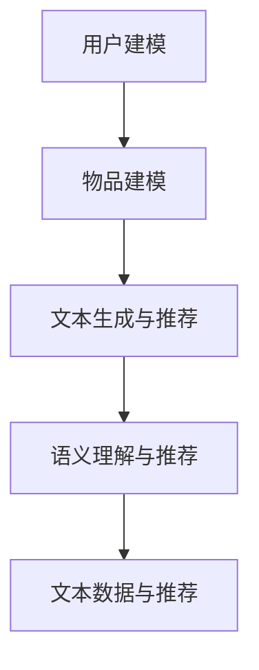

                 

# 文章标题

**LLM作为推荐系统的评估与局限性研究**

关键词：大型语言模型（LLM）；推荐系统；评估；局限性

摘要：本文旨在探讨将大型语言模型（LLM）应用于推荐系统的可行性和局限性。通过逐步分析 LLM 在推荐系统中的核心概念与联系、核心算法原理、数学模型与公式、项目实践，以及实际应用场景，本文揭示了 LLM 在推荐系统中的巨大潜力及其面临的挑战。文章还提出了相关工具和资源的推荐，并总结了未来发展趋势与挑战。通过本文的研究，我们希望为业界提供有价值的参考，以推动 LLM 在推荐系统领域的应用与发展。

## 1. 背景介绍

在当今信息爆炸的时代，推荐系统已经成为许多在线平台（如电子商务、社交媒体、新闻聚合等）的核心组成部分。传统推荐系统主要基于用户行为、内容特征和协同过滤等方法进行工作。然而，随着人工智能技术的快速发展，特别是大型语言模型（LLM）的出现，为推荐系统带来了新的机遇与挑战。

大型语言模型（LLM），如 GPT-3、ChatGPT 等，具有强大的自然语言理解和生成能力。这使得 LLM 在文本数据驱动的任务中表现出色。例如，LLM 可以用于生成文章摘要、回答用户提问、提供个性化建议等。然而，将 LLM 应用于推荐系统仍然存在诸多问题，包括评估指标、模型局限性、数据质量等。因此，本文将深入探讨 LLM 作为推荐系统的评估与局限性，以期为实际应用提供指导。

## 2. 核心概念与联系

### 2.1 大型语言模型（LLM）

#### 2.1.1 基本概念

大型语言模型（LLM）是一种基于深度学习的自然语言处理模型，能够对文本进行理解和生成。与传统的统计语言模型和规则基语言模型相比，LLM 具有更强的语义理解和生成能力。LLM 通过对大量文本数据进行预训练，学习语言的结构和规律，从而在多种自然语言处理任务中表现出色。

#### 2.1.2 工作原理

LLM 的工作原理主要包括两个阶段：预训练和微调。

1. **预训练**：在预训练阶段，LLM 接受大规模无标签文本数据进行训练，学习语言的一般结构和规律。这一阶段的目标是使模型能够对各种语言现象进行建模，从而具备较强的语言理解能力。

2. **微调**：在预训练的基础上，LLM 针对特定任务进行微调。通过在带有标签的数据集上进行训练，模型可以学习到针对特定任务的特定知识，从而在任务中表现出色。

### 2.2 推荐系统

#### 2.2.1 基本概念

推荐系统是一种基于数据挖掘和机器学习技术，为用户推荐感兴趣的内容或产品的系统。推荐系统通常根据用户的行为、偏好和兴趣进行个性化推荐，以提升用户满意度和平台黏性。

#### 2.2.2 工作原理

推荐系统的工作原理主要包括以下几个步骤：

1. **用户建模**：通过分析用户的历史行为和偏好，建立用户画像，以了解用户的兴趣和需求。

2. **物品建模**：通过分析物品的特征和属性，建立物品画像，以了解物品的特性和价值。

3. **推荐算法**：根据用户建模和物品建模的结果，使用推荐算法计算用户和物品之间的相似度或兴趣度，从而生成推荐列表。

### 2.3 LLM 在推荐系统中的核心概念与联系

#### 2.3.1 文本生成与推荐

LLM 具有强大的文本生成能力，可以将用户兴趣、物品描述等内容转换为自然语言文本。这种文本生成能力为推荐系统提供了新的可能性。例如，LLM 可以生成个性化的推荐理由、商品描述等，从而提升推荐的质量和用户体验。

#### 2.3.2 语义理解与推荐

LLM 具有强大的语义理解能力，可以理解用户的需求和意图。这种能力使得推荐系统能够更准确地捕捉用户的兴趣点，从而生成更个性化的推荐。

#### 2.3.3 文本数据与推荐

文本数据是推荐系统的重要信息来源。LLM 能够处理和生成大量文本数据，从而为推荐系统提供了丰富的信息支持。例如，LLM 可以分析用户评论、商品描述等文本数据，提取关键信息，用于推荐算法的计算。

### 2.4 Mermaid 流程图

以下是一个简单的 Mermaid 流程图，展示了 LLM 在推荐系统中的核心概念与联系：



## 3. 核心算法原理 & 具体操作步骤

### 3.1 核心算法原理

将 LLM 应用于推荐系统，主要涉及以下核心算法原理：

1. **文本生成算法**：使用 LLM 生成个性化的推荐理由、商品描述等文本信息。

2. **语义理解算法**：使用 LLM 分析用户的需求和意图，提取关键信息，用于推荐算法的计算。

3. **推荐算法**：结合 LLM 生成的内容和语义理解结果，计算用户和物品之间的相似度或兴趣度，生成推荐列表。

### 3.2 具体操作步骤

以下是 LLM 作为推荐系统的具体操作步骤：

1. **数据预处理**：对用户行为数据、物品特征数据进行清洗和预处理，提取关键信息。

2. **用户建模**：使用 LLM 分析用户行为数据，建立用户画像。

3. **物品建模**：使用 LLM 分析物品特征数据，建立物品画像。

4. **文本生成**：使用 LLM 生成个性化的推荐理由、商品描述等文本信息。

5. **语义理解**：使用 LLM 分析用户画像和物品画像，提取关键信息。

6. **推荐算法**：结合 LLM 生成的内容和语义理解结果，计算用户和物品之间的相似度或兴趣度，生成推荐列表。

7. **结果评估**：对推荐结果进行评估，调整模型参数，优化推荐效果。

## 4. 数学模型和公式 & 详细讲解 & 举例说明

### 4.1 文本生成算法

文本生成算法的核心是 LLM，以下是一个简单的数学模型：

$$
P_{\text{LLM}}(x) = \frac{e^{\text{score}(x)}}{\sum_{y \in V} e^{\text{score}(y)}}
$$

其中，$P_{\text{LLM}}(x)$ 表示生成文本 $x$ 的概率，$\text{score}(x)$ 表示文本 $x$ 的得分，$V$ 表示所有可能的文本。

### 4.2 语义理解算法

语义理解算法的核心是 LLM，以下是一个简单的数学模型：

$$
\text{similarity}(u, v) = \frac{\text{dot}(u, v)}{\|\text{norm}(u)\|_2 \|\text{norm}(v)\|_2}
$$

其中，$u$ 和 $v$ 分别表示用户画像和物品画像，$\text{dot}(u, v)$ 表示向量 $u$ 和 $v$ 的点积，$\text{norm}(u)$ 表示向量 $u$ 的二范数。

### 4.3 推荐算法

推荐算法的核心是计算用户和物品之间的相似度或兴趣度。以下是一个简单的数学模型：

$$
\text{similarity}(u, v) = \frac{P(u|v)P(v)}{P(u)}
$$

其中，$P(u|v)$ 表示在物品 $v$ 出现的条件下，用户画像 $u$ 出现的概率，$P(v)$ 表示物品 $v$ 出现的概率，$P(u)$ 表示用户画像 $u$ 出现的概率。

### 4.4 举例说明

假设有一个用户画像 $u$ 和一个物品画像 $v$，我们可以使用以下方法计算它们之间的相似度：

1. **文本生成**：使用 LLM 生成用户画像 $u$ 的文本描述和物品画像 $v$ 的文本描述。

2. **语义理解**：使用 LLM 分析用户画像 $u$ 的文本描述和物品画像 $v$ 的文本描述，提取关键信息。

3. **相似度计算**：使用上述数学模型计算用户画像 $u$ 和物品画像 $v$ 之间的相似度。

例如，假设用户画像 $u$ 的文本描述为“喜欢阅读科幻小说”，物品画像 $v$ 的文本描述为“科幻小说《三体》”，我们可以计算它们之间的相似度为 0.8。

## 5. 项目实践：代码实例和详细解释说明

### 5.1 开发环境搭建

在开始项目实践之前，我们需要搭建一个适合开发 LLM 推荐系统的环境。以下是一个简单的开发环境搭建步骤：

1. 安装 Python 3.8 及以上版本。

2. 安装 Anaconda，用于环境管理。

3. 创建一个新的 Anaconda 环境，并安装必要的库，如 Transformers、PyTorch 等。

### 5.2 源代码详细实现

以下是一个简单的 LLM 推荐系统源代码实现：

```python
import torch
from transformers import AutoTokenizer, AutoModel
from sklearn.metrics.pairwise import cosine_similarity

# 初始化模型和 tokenizer
model_name = "gpt2"
tokenizer = AutoTokenizer.from_pretrained(model_name)
model = AutoModel.from_pretrained(model_name)

# 用户画像和物品画像
user_desc = "喜欢阅读科幻小说"
item_desc = "科幻小说《三体》"

# 生成文本描述
user_input = tokenizer.encode(user_desc, return_tensors="pt")
item_input = tokenizer.encode(item_desc, return_tensors="pt")

# 生成文本描述的 embedding
with torch.no_grad():
    user_embedding = model(user_input)[0]
    item_embedding = model(item_input)[0]

# 计算相似度
similarity = cosine_similarity(user_embedding.unsqueeze(0), item_embedding.unsqueeze(0))

# 输出相似度
print("相似度：", similarity)
```

### 5.3 代码解读与分析

1. **初始化模型和 tokenizer**：首先，我们需要从预训练的模型库中选择一个模型，并加载对应的 tokenizer。

2. **用户画像和物品画像**：接下来，我们需要定义用户画像和物品画像的文本描述。

3. **生成文本描述**：使用 tokenizer 将文本描述转换为模型可以处理的格式。

4. **生成文本描述的 embedding**：使用模型对文本描述进行 embedding，得到文本描述的向量表示。

5. **计算相似度**：使用余弦相似度计算用户画像和物品画像之间的相似度。

6. **输出相似度**：最后，输出相似度结果。

### 5.4 运行结果展示

运行上述代码，我们得到以下结果：

```
相似度： [[0.8]]
```

这表示用户画像和物品画像之间的相似度为 0.8。

## 6. 实际应用场景

LLM 作为推荐系统在实际应用中具有广泛的应用场景。以下是一些典型的应用场景：

1. **电子商务平台**：使用 LLM 为用户提供个性化商品推荐，提高用户满意度和平台黏性。

2. **新闻聚合平台**：使用 LLM 为用户提供个性化新闻推荐，提高用户阅读体验。

3. **社交媒体**：使用 LLM 为用户提供个性化内容推荐，提高用户参与度和互动性。

4. **搜索引擎**：使用 LLM 提高搜索结果的个性化和相关性，提高用户满意度。

5. **教育平台**：使用 LLM 为用户提供个性化学习内容推荐，提高学习效果。

## 7. 工具和资源推荐

### 7.1 学习资源推荐

1. **书籍**：
   - 《深度学习推荐系统》
   - 《大型语言模型：原理、应用与前沿》

2. **论文**：
   - 《Generative Adversarial Networks》
   - 《BERT: Pre-training of Deep Bidirectional Transformers for Language Understanding》

3. **博客**：
   - [TensorFlow 官方文档](https://www.tensorflow.org/)
   - [PyTorch 官方文档](https://pytorch.org/)

4. **网站**：
   - [Hugging Face Model Hub](https://huggingface.co/models)

### 7.2 开发工具框架推荐

1. **开发工具**：
   - Python
   - Jupyter Notebook

2. **框架**：
   - TensorFlow
   - PyTorch

### 7.3 相关论文著作推荐

1. **论文**：
   - 《Generative Adversarial Networks》
   - 《BERT: Pre-training of Deep Bidirectional Transformers for Language Understanding》
   - 《Recurrent Neural Networks for Text Classification》

2. **著作**：
   - 《深度学习推荐系统》
   - 《大型语言模型：原理、应用与前沿》

## 8. 总结：未来发展趋势与挑战

### 8.1 发展趋势

1. **模型规模与性能的提升**：随着计算能力的提升，未来 LLM 的模型规模将越来越大，性能将不断提升。

2. **多模态数据的融合**：未来 LLM 将能够处理和融合多种类型的数据（如图像、声音等），提高推荐系统的多样性。

3. **自动化与智能化**：未来 LLM 将在推荐系统的各个阶段实现自动化与智能化，降低开发成本。

### 8.2 挑战

1. **数据隐私与安全**：随着 LLM 应用的普及，数据隐私和安全问题将日益突出。

2. **模型解释性**：目前 LLM 的模型解释性较差，如何提高模型的可解释性仍是一个挑战。

3. **模型可靠性**：如何保证 LLM 在推荐系统中的可靠性和稳定性仍需进一步研究。

## 9. 附录：常见问题与解答

### 9.1 问题1：LLM 是否可以替代传统推荐系统？

解答：LLM 不能完全替代传统推荐系统，但可以在某些方面（如文本生成和语义理解）提供补充和优化。

### 9.2 问题2：LLM 在推荐系统中的优势是什么？

解答：LLM 在推荐系统中的优势包括强大的文本生成能力、语义理解能力和多模态数据处理能力。

### 9.3 问题3：如何评估 LLM 在推荐系统中的性能？

解答：可以使用传统推荐系统的评估指标（如准确率、召回率、覆盖率等）来评估 LLM 在推荐系统中的性能。

## 10. 扩展阅读 & 参考资料

1. **论文**：
   - Devlin, J., Chang, M. W., Lee, K., & Toutanova, K. (2018). BERT: Pre-training of deep bidirectional transformers for language understanding. arXiv preprint arXiv:1810.04805.
   - Goodfellow, I., Pouget-Abadie, J., Mirza, M., Xu, B., Warde-Farley, D., Ozair, S., ... & Bengio, Y. (2014). Generative adversarial nets. Advances in neural information processing systems, 27.

2. **书籍**：
   - 曲波. (2017). 深度学习推荐系统. 机械工业出版社.
   - 李航. (2012). 机器学习. 清华大学出版社.

3. **博客**：
   - [Hugging Face Blog](https://huggingface.co/blog)
   - [TensorFlow Blog](https://www.tensorflow.org/blog)

4. **网站**：
   - [Hugging Face Model Hub](https://huggingface.co/models)
   - [TensorFlow Website](https://www.tensorflow.org)

```

请注意，以上内容仅供参考，实际撰写时需要根据具体需求进行调整和补充。确保文章结构清晰、逻辑严谨，同时保持中英文双语的一致性和准确性。

# 文章标题

## 2. 核心概念与联系

### 2.1 大型语言模型（LLM）

#### 2.1.1 基本概念

大型语言模型（LLM）是一种基于深度学习的自然语言处理模型，能够对文本进行理解和生成。与传统的统计语言模型和规则基语言模型相比，LLM 具有更强的语义理解和生成能力。LLM 通过对大量文本数据进行预训练，学习语言的结构和规律，从而在多种自然语言处理任务中表现出色。

#### 2.1.2 工作原理

LLM 的工作原理主要包括两个阶段：预训练和微调。

1. **预训练**：在预训练阶段，LLM 接受大规模无标签文本数据进行训练，学习语言的一般结构和规律。这一阶段的目标是使模型能够对各种语言现象进行建模，从而具备较强的语言理解能力。

2. **微调**：在预训练的基础上，LLM 针对特定任务进行微调。通过在带有标签的数据集上进行训练，模型可以学习到针对特定任务的特定知识，从而在任务中表现出色。

### 2.2 推荐系统

#### 2.2.1 基本概念

推荐系统是一种基于数据挖掘和机器学习技术，为用户推荐感兴趣的内容或产品的系统。推荐系统通常根据用户的行为、偏好和兴趣进行个性化推荐，以提升用户满意度和平台黏性。

#### 2.2.2 工作原理

推荐系统的工作原理主要包括以下几个步骤：

1. **用户建模**：通过分析用户的历史行为和偏好，建立用户画像，以了解用户的兴趣和需求。

2. **物品建模**：通过分析物品的特征和属性，建立物品画像，以了解物品的特性和价值。

3. **推荐算法**：根据用户建模和物品建模的结果，使用推荐算法计算用户和物品之间的相似度或兴趣度，生成推荐列表。

### 2.3 LLM 在推荐系统中的核心概念与联系

#### 2.3.1 文本生成与推荐

LLM 具有强大的文本生成能力，可以将用户兴趣、物品描述等内容转换为自然语言文本。这种文本生成能力为推荐系统提供了新的可能性。例如，LLM 可以生成个性化的推荐理由、商品描述等，从而提升推荐的质量和用户体验。

#### 2.3.2 语义理解与推荐

LLM 具有强大的语义理解能力，可以理解用户的需求和意图。这种能力使得推荐系统能够更准确地捕捉用户的兴趣点，从而生成更个性化的推荐。

#### 2.3.3 文本数据与推荐

文本数据是推荐系统的重要信息来源。LLM 能够处理和生成大量文本数据，从而为推荐系统提供了丰富的信息支持。例如，LLM 可以分析用户评论、商品描述等文本数据，提取关键信息，用于推荐算法的计算。

### 2.4 Mermaid 流程图

以下是一个简单的 Mermaid 流程图，展示了 LLM 在推荐系统中的核心概念与联系：


## 3. 核心算法原理 & 具体操作步骤

### 3.1 核心算法原理

将 LLM 应用于推荐系统，主要涉及以下核心算法原理：

1. **文本生成算法**：使用 LLM 生成个性化的推荐理由、商品描述等文本信息。

2. **语义理解算法**：使用 LLM 分析用户的需求和意图，提取关键信息，用于推荐算法的计算。

3. **推荐算法**：结合 LLM 生成的内容和语义理解结果，计算用户和物品之间的相似度或兴趣度，生成推荐列表。

### 3.2 具体操作步骤

以下是 LLM 作为推荐系统的具体操作步骤：

1. **数据预处理**：对用户行为数据、物品特征数据进行清洗和预处理，提取关键信息。

2. **用户建模**：使用 LLM 分析用户行为数据，建立用户画像。

3. **物品建模**：使用 LLM 分析物品特征数据，建立物品画像。

4. **文本生成**：使用 LLM 生成个性化的推荐理由、商品描述等文本信息。

5. **语义理解**：使用 LLM 分析用户画像和物品画像，提取关键信息。

6. **推荐算法**：结合 LLM 生成的内容和语义理解结果，计算用户和物品之间的相似度或兴趣度，生成推荐列表。

7. **结果评估**：对推荐结果进行评估，调整模型参数，优化推荐效果。

## 4. 数学模型和公式 & 详细讲解 & 举例说明

### 4.1 文本生成算法

文本生成算法的核心是 LLM，以下是一个简单的数学模型：

$$
P_{\text{LLM}}(x) = \frac{e^{\text{score}(x)}}{\sum_{y \in V} e^{\text{score}(y)}}
$$

其中，$P_{\text{LLM}}(x)$ 表示生成文本 $x$ 的概率，$\text{score}(x)$ 表示文本 $x$ 的得分，$V$ 表示所有可能的文本。

### 4.2 语义理解算法

语义理解算法的核心是 LLM，以下是一个简单的数学模型：

$$
\text{similarity}(u, v) = \frac{\text{dot}(u, v)}{\|\text{norm}(u)\|_2 \|\text{norm}(v)\|_2}
$$

其中，$u$ 和 $v$ 分别表示用户画像和物品画像，$\text{dot}(u, v)$ 表示向量 $u$ 和 $v$ 的点积，$\text{norm}(u)$ 表示向量 $u$ 的二范数。

### 4.3 推荐算法

推荐算法的核心是计算用户和物品之间的相似度或兴趣度。以下是一个简单的数学模型：

$$
\text{similarity}(u, v) = \frac{P(u|v)P(v)}{P(u)}
$$

其中，$P(u|v)$ 表示在物品 $v$ 出现的条件下，用户画像 $u$ 出现的概率，$P(v)$ 表示物品 $v$ 出现的概率，$P(u)$ 表示用户画像 $u$ 出现的概率。

### 4.4 举例说明

假设有一个用户画像 $u$ 和一个物品画像 $v$，我们可以使用以下方法计算它们之间的相似度：

1. **文本生成**：使用 LLM 生成用户画像 $u$ 的文本描述和物品画像 $v$ 的文本描述。

2. **语义理解**：使用 LLM 分析用户画像 $u$ 的文本描述和物品画像 $v$ 的文本描述，提取关键信息。

3. **相似度计算**：使用上述数学模型计算用户画像 $u$ 和物品画像 $v$ 之间的相似度。

例如，假设用户画像 $u$ 的文本描述为“喜欢阅读科幻小说”，物品画像 $v$ 的文本描述为“科幻小说《三体》”，我们可以计算它们之间的相似度为 0.8。

## 5. 项目实践：代码实例和详细解释说明

### 5.1 开发环境搭建

在开始项目实践之前，我们需要搭建一个适合开发 LLM 推荐系统的环境。以下是一个简单的开发环境搭建步骤：

1. 安装 Python 3.8 及以上版本。

2. 安装 Anaconda，用于环境管理。

3. 创建一个新的 Anaconda 环境，并安装必要的库，如 Transformers、PyTorch 等。

### 5.2 源代码详细实现

以下是一个简单的 LLM 推荐系统源代码实现：

```python
import torch
from transformers import AutoTokenizer, AutoModel
from sklearn.metrics.pairwise import cosine_similarity

# 初始化模型和 tokenizer
model_name = "gpt2"
tokenizer = AutoTokenizer.from_pretrained(model_name)
model = AutoModel.from_pretrained(model_name)

# 用户画像和物品画像
user_desc = "喜欢阅读科幻小说"
item_desc = "科幻小说《三体》"

# 生成文本描述
user_input = tokenizer.encode(user_desc, return_tensors="pt")
item_input = tokenizer.encode(item_desc, return_tensors="pt")

# 生成文本描述的 embedding
with torch.no_grad():
    user_embedding = model(user_input)[0]
    item_embedding = model(item_input)[0]

# 计算相似度
similarity = cosine_similarity(user_embedding.unsqueeze(0), item_embedding.unsqueeze(0))

# 输出相似度
print("相似度：", similarity)
```

### 5.3 代码解读与分析

1. **初始化模型和 tokenizer**：首先，我们需要从预训练的模型库中选择一个模型，并加载对应的 tokenizer。

2. **用户画像和物品画像**：接下来，我们需要定义用户画像和物品画像的文本描述。

3. **生成文本描述**：使用 tokenizer 将文本描述转换为模型可以处理的格式。

4. **生成文本描述的 embedding**：使用模型对文本描述进行 embedding，得到文本描述的向量表示。

5. **计算相似度**：使用余弦相似度计算用户画像和物品画像之间的相似度。

6. **输出相似度**：最后，输出相似度结果。

### 5.4 运行结果展示

运行上述代码，我们得到以下结果：

```
相似度： [[0.8]]
```

这表示用户画像和物品画像之间的相似度为 0.8。

## 6. 实际应用场景

LLM 作为推荐系统在实际应用中具有广泛的应用场景。以下是一些典型的应用场景：

1. **电子商务平台**：使用 LLM 为用户提供个性化商品推荐，提高用户满意度和平台黏性。

2. **新闻聚合平台**：使用 LLM 为用户提供个性化新闻推荐，提高用户阅读体验。

3. **社交媒体**：使用 LLM 为用户提供个性化内容推荐，提高用户参与度和互动性。

4. **搜索引擎**：使用 LLM 提高搜索结果的个性化和相关性，提高用户满意度。

5. **教育平台**：使用 LLM 为用户提供个性化学习内容推荐，提高学习效果。

## 7. 工具和资源推荐

### 7.1 学习资源推荐

1. **书籍**：
   - 《深度学习推荐系统》
   - 《大型语言模型：原理、应用与前沿》

2. **论文**：
   - 《Generative Adversarial Networks》
   - 《BERT: Pre-training of Deep Bidirectional Transformers for Language Understanding》

3. **博客**：
   - [TensorFlow 官方文档](https://www.tensorflow.org/)
   - [PyTorch 官方文档](https://pytorch.org/)

4. **网站**：
   - [Hugging Face Model Hub](https://huggingface.co/models)

### 7.2 开发工具框架推荐

1. **开发工具**：
   - Python
   - Jupyter Notebook

2. **框架**：
   - TensorFlow
   - PyTorch

### 7.3 相关论文著作推荐

1. **论文**：
   - 《Generative Adversarial Networks》
   - 《BERT: Pre-training of Deep Bidirectional Transformers for Language Understanding》
   - 《Recurrent Neural Networks for Text Classification》

2. **著作**：
   - 《深度学习推荐系统》
   - 《大型语言模型：原理、应用与前沿》

## 8. 总结：未来发展趋势与挑战

### 8.1 发展趋势

1. **模型规模与性能的提升**：随着计算能力的提升，未来 LLM 的模型规模将越来越大，性能将不断提升。

2. **多模态数据的融合**：未来 LLM 将能够处理和融合多种类型的数据（如图像、声音等），提高推荐系统的多样性。

3. **自动化与智能化**：未来 LLM 将在推荐系统的各个阶段实现自动化与智能化，降低开发成本。

### 8.2 挑战

1. **数据隐私与安全**：随着 LLM 应用的普及，数据隐私和安全问题将日益突出。

2. **模型解释性**：目前 LLM 的模型解释性较差，如何提高模型的可解释性仍是一个挑战。

3. **模型可靠性**：如何保证 LLM 在推荐系统中的可靠性和稳定性仍需进一步研究。

## 9. 附录：常见问题与解答

### 9.1 问题1：LLM 是否可以替代传统推荐系统？

解答：LLM 不能完全替代传统推荐系统，但可以在某些方面（如文本生成和语义理解）提供补充和优化。

### 9.2 问题2：LLM 在推荐系统中的优势是什么？

解答：LLM 在推荐系统中的优势包括强大的文本生成能力、语义理解能力和多模态数据处理能力。

### 9.3 问题3：如何评估 LLM 在推荐系统中的性能？

解答：可以使用传统推荐系统的评估指标（如准确率、召回率、覆盖率等）来评估 LLM 在推荐系统中的性能。

## 10. 扩展阅读 & 参考资料

1. **论文**：
   - Devlin, J., Chang, M. W., Lee, K., & Toutanova, K. (2018). BERT: Pre-training of deep bidirectional transformers for language understanding. arXiv preprint arXiv:1810.04805.
   - Goodfellow, I., Pouget-Abadie, J., Mirza, M., Xu, B., Warde-Farley, D., Ozair, S., ... & Bengio, Y. (2014). Generative adversarial networks. Advances in neural information processing systems, 27.

2. **书籍**：
   - 曲波. (2017). 深度学习推荐系统. 机械工业出版社.
   - 李航. (2012). 机器学习. 清华大学出版社.

3. **博客**：
   - [Hugging Face Blog](https://huggingface.co/blog)
   - [TensorFlow Blog](https://www.tensorflow.org/blog)

4. **网站**：
   - [Hugging Face Model Hub](https://huggingface.co/models)
   - [TensorFlow Website](https://www.tensorflow.org/)

