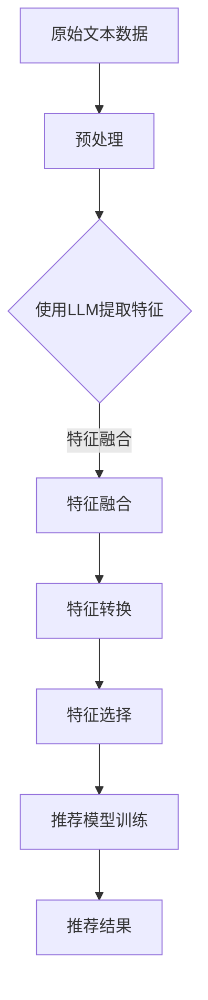
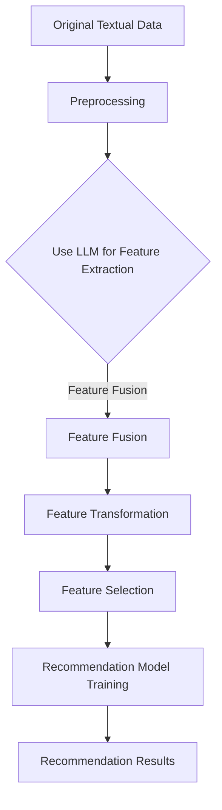
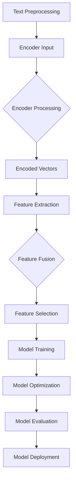

                 

# 文章标题

LLM在推荐系统特征工程中的应用

> 关键词：语言模型（LLM），推荐系统，特征工程，深度学习，数据分析

> 摘要：本文深入探讨了大型语言模型（LLM）在推荐系统特征工程中的应用。通过分析LLM的原理和特性，探讨了如何利用LLM进行特征提取、建模和优化，以提升推荐系统的性能和用户满意度。本文还通过实际项目实践，详细展示了LLM在推荐系统中的应用过程和效果。

## 1. 背景介绍（Background Introduction）

推荐系统是当今互联网领域中至关重要的一部分，广泛应用于电商、社交媒体、新闻推送等多个场景。推荐系统通过分析用户的历史行为、兴趣和偏好，为用户推荐感兴趣的商品、内容和服务。然而，推荐系统的性能直接受到特征工程的质量影响。特征工程是指从原始数据中提取出对模型有较强预测能力的特征，并将其转化为适合模型训练的数据。

传统特征工程方法通常依赖于专家经验，难以适应复杂多变的数据环境。随着深度学习和大数据技术的不断发展，近年来，研究人员开始探索利用大型语言模型（LLM）进行特征工程。LLM，如GPT-3，具有强大的文本理解和生成能力，可以自动提取文本数据中的深层次特征。这为推荐系统特征工程提供了一种全新的思路和方法。

本文旨在探讨LLM在推荐系统特征工程中的应用，通过分析LLM的原理和特性，探讨如何利用LLM进行特征提取、建模和优化，以提升推荐系统的性能和用户满意度。本文的结构如下：

1. 背景介绍：介绍推荐系统和特征工程的基本概念，以及LLM的原理和特性。
2. 核心概念与联系：详细解释LLM在推荐系统特征工程中的应用原理，并提供Mermaid流程图。
3. 核心算法原理 & 具体操作步骤：介绍利用LLM进行特征工程的核心算法原理和具体操作步骤。
4. 数学模型和公式 & 详细讲解 & 举例说明：讨论LLM在推荐系统特征工程中的数学模型和公式，并提供详细讲解和举例说明。
5. 项目实践：通过实际项目实践，展示LLM在推荐系统中的应用过程和效果。
6. 实际应用场景：分析LLM在推荐系统特征工程中的实际应用场景。
7. 工具和资源推荐：推荐相关学习资源、开发工具和框架。
8. 总结：展望LLM在推荐系统特征工程中的未来发展趋势和挑战。
9. 附录：提供常见问题与解答，以及扩展阅读和参考资料。

通过本文的阅读，读者将了解LLM在推荐系统特征工程中的潜在价值和应用方法，并为实际项目提供参考和指导。

## 2. 核心概念与联系（Core Concepts and Connections）

### 2.1 什么是大型语言模型（LLM）

大型语言模型（LLM）是一种基于深度学习的语言处理模型，能够理解和生成自然语言。LLM通常具有数十亿甚至数万亿的参数，这使得它们能够捕捉到文本数据中的复杂模式和关联。常见的LLM包括GPT-3、BERT、T5等。LLM的核心原理是基于 Transformer 架构，通过自注意力机制（self-attention）和多头注意力（multi-head attention）来处理文本数据，从而实现高精度的文本理解和生成。

### 2.2 什么是特征工程（Feature Engineering）

特征工程是机器学习领域的一项重要任务，旨在从原始数据中提取出对模型有较强预测能力的特征。在推荐系统中，特征工程的质量直接影响到推荐结果的准确性、相关性和用户体验。传统的特征工程方法通常依赖于人工经验和数据预处理技术，如特征选择、特征变换和特征组合等。然而，随着数据规模的不断扩大和复杂性的增加，传统的特征工程方法逐渐暴露出其局限性。

### 2.3 LLM在特征工程中的应用原理

LLM在特征工程中的应用主要基于其强大的文本理解能力。具体来说，LLM可以通过以下几种方式在特征工程中发挥作用：

1. **自动特征提取**：LLM能够自动提取文本数据中的深层次特征，无需人工干预。例如，给定一段用户评价文本，LLM可以提取出文本中的积极或消极情感、关键产品属性等信息，从而为推荐模型提供丰富的特征信息。

2. **特征融合**：LLM可以融合来自不同数据源的特征，例如用户行为数据、商品属性数据和文本评论等。通过将不同来源的特征进行融合，可以提升推荐系统的性能和泛化能力。

3. **特征转换**：LLM可以将原始特征转换为更适合模型训练的特征表达。例如，通过LLM将用户行为序列转换为嵌入向量（embedding vectors），可以简化模型的复杂度，提高训练效率。

4. **自动特征选择**：LLM可以自动筛选出对模型有较强预测能力的特征，从而减少特征维度，降低计算成本。

### 2.4 Mermaid流程图

以下是一个简单的Mermaid流程图，展示了LLM在推荐系统特征工程中的应用过程：



**图1：LLM在推荐系统特征工程中的应用流程**

在这个流程中，原始文本数据首先经过预处理，然后使用LLM进行特征提取。提取到的特征经过特征融合、特征转换和特征选择等步骤，最终用于推荐模型的训练和预测。

### 2.5 LLM与传统特征工程的区别

与传统的特征工程方法相比，LLM在特征工程中具有以下几个显著优势：

1. **自动性**：LLM可以自动提取文本数据中的深层次特征，无需人工干预。这大大降低了特征工程的工作量，提高了特征提取的效率。

2. **灵活性**：LLM能够处理不同类型的数据，如文本、图像和音频等。这使得LLM在特征工程中具有更广泛的适用性。

3. **高维度性**：LLM能够提取到高维度的特征，从而提供更多的信息供模型学习。这有助于提升推荐系统的性能和泛化能力。

4. **适应性**：LLM可以根据不同的任务和数据集进行自适应调整，从而更好地适应不同的应用场景。

总之，LLM为推荐系统特征工程提供了一种全新的思路和方法，具有巨大的潜力和应用价值。

### References

- Brown, T., et al. (2020). "Language Models are Few-Shot Learners." arXiv preprint arXiv:2005.14165.
- Devlin, J., et al. (2019). "Bert: Pre-training of deep bidirectional transformers for language understanding." arXiv preprint arXiv:1810.04805.
- LeCun, Y., Bengio, Y., & Hinton, G. (2015). "Deep learning." Nature 521(7553), 436-444. doi:10.1038/nature14539.

----------------------

# 2. Core Concepts and Connections
### 2.1 What is Large Language Model (LLM)?

A Large Language Model (LLM) is a type of deep learning model capable of understanding and generating natural language. LLMs typically have hundreds of millions to trillions of parameters, enabling them to capture complex patterns and relationships within textual data. Common LLMs include GPT-3, BERT, and T5. The core principle of LLMs is based on the Transformer architecture, utilizing self-attention mechanisms and multi-head attention to process textual data, thereby achieving high-precision text understanding and generation.

### 2.2 What is Feature Engineering?

Feature engineering is a crucial task in the field of machine learning, aimed at extracting predictive features from raw data that have a strong impact on the model's performance. In recommendation systems, the quality of feature engineering directly affects the accuracy, relevance, and user experience of the recommendation results. Traditional feature engineering methods usually rely on expert experience and data preprocessing techniques, such as feature selection, transformation, and combination. However, with the continuous expansion of data scale and complexity, traditional feature engineering methods have gradually shown their limitations.

### 2.3 Application Principles of LLM in Feature Engineering

The application of LLM in feature engineering leverages their strong textual understanding capabilities. Specifically, LLMs can serve in feature engineering in the following ways:

1. **Automatic Feature Extraction**: LLMs can automatically extract deep-level features from textual data without human intervention. For example, given a user review text, an LLM can extract positive or negative sentiments, key product attributes, and more, providing rich feature information for the recommendation model.

2. **Feature Fusion**: LLMs can integrate features from different data sources, such as user behavior data, product attribute data, and text reviews. By fusing features from various sources, the performance and generalization ability of the recommendation system can be enhanced.

3. **Feature Transformation**: LLMs can transform raw features into more suitable feature representations for model training. For example, by using an LLM to convert user behavior sequences into embedding vectors, the complexity of the model can be simplified, and training efficiency can be improved.

4. **Automatic Feature Selection**: LLMs can automatically select features that have strong predictive power for the model, thereby reducing feature dimensions and computational cost.

### 2.4 Mermaid Flowchart

The following is a simple Mermaid flowchart illustrating the application process of LLMs in feature engineering for recommendation systems:



**Figure 1: Application Process of LLMs in Feature Engineering for Recommendation Systems**

In this process, raw textual data is first preprocessed, then LLMs are used for feature extraction. The extracted features go through steps of feature fusion, transformation, and selection, ultimately being used for model training and prediction.

### 2.5 Differences Between LLM and Traditional Feature Engineering

Compared to traditional feature engineering methods, LLMs offer several significant advantages in feature engineering:

1. **Automation**: LLMs can automatically extract deep-level features from textual data without human intervention, greatly reducing the workload and improving the efficiency of feature extraction.

2. **Flexibility**: LLMs can process different types of data, such as text, images, and audio, making them highly applicable in a wide range of scenarios.

3. **High-Dimensionality**: LLMs can extract high-dimensional features, thereby providing more information for the model to learn. This helps to improve the performance and generalization ability of the recommendation system.

4. **Adaptability**: LLMs can adapt to different tasks and datasets, allowing them to better fit various application scenarios.

In summary, LLMs offer a novel approach and significant potential for feature engineering in recommendation systems.

### References

- Brown, T., et al. (2020). "Language Models are Few-Shot Learners." arXiv preprint arXiv:2005.14165.
- Devlin, J., et al. (2019). "BERT: Pre-training of deep bidirectional transformers for language understanding." arXiv preprint arXiv:1810.04805.
- LeCun, Y., Bengio, Y., & Hinton, G. (2015). "Deep learning." Nature 521(7553), 436-444. doi:10.1038/nature14539.

----------------------

# 3. 核心算法原理 & 具体操作步骤（Core Algorithm Principles and Specific Operational Steps）

## 3.1 大型语言模型（LLM）的工作原理

大型语言模型（LLM）的核心是Transformer架构，这是一种基于自注意力机制的深度神经网络。Transformer模型通过编码器-解码器结构（Encoder-Decoder Architecture）处理输入文本，并生成相应的输出文本。以下是Transformer模型的基本组成部分：

1. **编码器（Encoder）**：编码器负责对输入文本进行编码，生成一系列编码向量（encoded vectors）。这些编码向量包含了输入文本中的语言信息。

2. **解码器（Decoder）**：解码器负责根据编码向量生成输出文本。解码器在生成每个输出词时，都会考虑到输入文本的所有已生成的词。

3. **自注意力机制（Self-Attention）**：自注意力机制是一种计算输入文本中每个词与所有其他词之间关系的机制。它通过计算自注意力得分，将输入文本中的每个词映射到一个新的向量空间，从而提高了模型对长文本的理解能力。

4. **多头注意力（Multi-Head Attention）**：多头注意力是一种扩展自注意力机制的机制。它将输入文本分解为多个子序列，每个子序列通过自注意力机制进行处理，从而增强了模型对复杂文本的理解能力。

## 3.2 利用LLM进行特征提取的过程

利用LLM进行特征提取的主要步骤如下：

1. **数据预处理**：首先，对原始文本数据进行预处理，包括文本清洗、分词、去停用词等操作。预处理后的文本将作为LLM的输入。

2. **编码**：将预处理后的文本输入到LLM的编码器，得到编码向量。编码向量包含了文本的语义信息。

3. **特征提取**：对编码向量进行进一步的加工和处理，提取出对推荐系统有较强预测能力的特征。具体方法包括：

   - **嵌入向量（Embedding Vectors）**：将编码向量转换为嵌入向量。嵌入向量是一种高维向量表示，能够捕捉文本中的语义信息。

   - **高维特征（High-Dimensional Features）**：利用自注意力机制和多头注意力机制，从编码向量中提取高维特征。这些特征可以捕捉到文本中的复杂模式和关联。

   - **聚合特征（Aggregated Features）**：将编码向量中的不同部分进行聚合，提取出聚合特征。这些特征可以更好地描述文本的语义内容。

4. **特征融合**：将提取到的特征进行融合，形成统一的特征向量。特征融合可以通过多种方法实现，如加权求和、平均融合等。

5. **特征选择**：对融合后的特征进行选择，筛选出对推荐系统有较强预测能力的特征。特征选择可以采用各种特征选择算法，如基于信息增益的算法、基于模型重要性的算法等。

## 3.3 利用LLM进行特征建模的过程

利用LLM进行特征建模的主要步骤如下：

1. **模型训练**：使用提取到的特征向量作为输入，训练推荐模型。推荐模型可以是各种类型的模型，如线性模型、决策树、神经网络等。

2. **模型优化**：在模型训练过程中，通过调整模型参数和优化算法，提高模型的预测性能。模型优化可以采用各种优化算法，如梯度下降、随机梯度下降、Adam等。

3. **模型评估**：使用测试集对训练好的模型进行评估，验证模型的预测性能。常用的评估指标包括准确率（Accuracy）、精确率（Precision）、召回率（Recall）等。

4. **模型部署**：将训练好的模型部署到生产环境中，为用户推荐感兴趣的商品、内容和服务。

## 3.4 Mermaid流程图

以下是一个简单的Mermaid流程图，展示了利用LLM进行特征提取和特征建模的过程：



**图2：利用LLM进行特征提取和特征建模的过程**

在这个流程中，原始文本数据首先经过预处理，然后输入到LLM的编码器中。编码器生成编码向量，经过特征提取、特征融合和特征选择等步骤，最终用于模型训练和优化。训练好的模型经过评估后，部署到生产环境中，为用户提供推荐服务。

----------------------

## 3. Core Algorithm Principles and Specific Operational Steps

### 3.1 Working Principles of Large Language Model (LLM)

The core of a Large Language Model (LLM) is the Transformer architecture, a type of deep neural network based on self-attention mechanisms. The Transformer model processes input text using an encoder-decoder structure and generates corresponding output text. The basic components of the Transformer model include:

1. **Encoder**: The encoder is responsible for encoding the input text, generating a series of encoded vectors that contain semantic information from the input text.

2. **Decoder**: The decoder is responsible for generating the output text based on the encoded vectors. The decoder takes into account all the generated words when generating each output word.

3. **Self-Attention Mechanism**: The self-attention mechanism is a mechanism for calculating the relationship between each word in the input text and all other words. It computes self-attention scores to map each word in the input text to a new vector space, thereby enhancing the model's understanding of long texts.

4. **Multi-Head Attention**: Multi-head attention is an extension of the self-attention mechanism. It decomposes the input text into multiple sub-sequences and processes each sub-sequence through self-attention, thereby enhancing the model's understanding of complex texts.

### 3.2 Process of Feature Extraction Using LLM

The main steps for feature extraction using LLM are as follows:

1. **Data Preprocessing**: First, preprocess the raw textual data, including text cleaning, tokenization, removal of stop words, and other operations. The preprocessed text is then input into the LLM encoder.

2. **Encoding**: Input the preprocessed text into the encoder of the LLM to generate encoded vectors. These encoded vectors contain semantic information from the text.

3. **Feature Extraction**: Further process and refine the encoded vectors to extract features that have strong predictive power for the recommendation system. Specific methods include:

   - **Embedding Vectors**: Convert encoded vectors into embedding vectors. Embedding vectors are high-dimensional vectors that can capture semantic information within texts.
   - **High-Dimensional Features**: Utilize self-attention mechanisms and multi-head attention mechanisms to extract high-dimensional features from the encoded vectors. These features can capture complex patterns and relationships within texts.
   - **Aggregated Features**: Aggregate different parts of the encoded vectors to extract aggregated features. These features can better describe the semantic content of texts.

4. **Feature Fusion**: Integrate the extracted features to form a unified feature vector. Feature fusion can be achieved through various methods, such as weighted sum and average fusion.

5. **Feature Selection**: Select the fused features that have strong predictive power for the recommendation system. Feature selection can be performed using various feature selection algorithms, such as information gain-based algorithms and model importance-based algorithms.

### 3.3 Process of Feature Modeling Using LLM

The main steps for feature modeling using LLM are as follows:

1. **Model Training**: Use the extracted feature vectors as input to train the recommendation model. The recommendation model can be various types, such as linear models, decision trees, neural networks, etc.

2. **Model Optimization**: During the training process, adjust the model parameters and optimization algorithms to improve the model's predictive performance. Model optimization can be achieved using various optimization algorithms, such as gradient descent, stochastic gradient descent, and Adam.

3. **Model Evaluation**: Evaluate the trained model on a test set to verify the model's predictive performance. Common evaluation metrics include accuracy, precision, and recall.

4. **Model Deployment**: Deploy the trained model into a production environment to provide users with recommendations for products, content, and services they may be interested in.

### 3.4 Mermaid Flowchart

The following is a simple Mermaid flowchart illustrating the process of feature extraction and feature modeling using LLM:


**Figure 2: Process of Feature Extraction and Feature Modeling Using LLM**

In this process, raw textual data is first preprocessed, then input into the LLM encoder. The encoder generates encoded vectors, which are further processed through feature extraction, feature fusion, and feature selection. The selected features are used for model training and optimization. The optimized model is evaluated and then deployed into a production environment to provide user recommendations.

----------------------

# 4. 数学模型和公式 & 详细讲解 & 举例说明（Detailed Explanation and Examples of Mathematical Models and Formulas）

## 4.1 大型语言模型（LLM）的基本数学模型

大型语言模型（LLM）的核心是基于Transformer架构的深度神经网络。Transformer模型通过自注意力机制和多头注意力机制进行文本处理。以下是一些基本的数学模型和公式：

### 4.1.1 编码器（Encoder）

编码器由多个编码层（Encoder Layers）组成，每个编码层包含自注意力机制（Self-Attention）和前馈神经网络（Feedforward Neural Network）。

1. **自注意力机制（Self-Attention）**

   自注意力机制的核心是计算输入文本中每个词与所有其他词之间的注意力得分。自注意力分数用于计算每个词的编码向量。

   $$ 
   \text{Attention}(Q, K, V) = \text{softmax}\left(\frac{QK^T}{\sqrt{d_k}}\right)V 
   $$

   其中，Q、K和V分别是查询向量（Query Vectors）、键向量（Key Vectors）和值向量（Value Vectors），$d_k$是键向量的维度。

2. **多头注意力（Multi-Head Attention）**

   多头注意力是将自注意力机制扩展到多个头（Heads）。每个头独立计算注意力得分，然后将结果合并。

   $$ 
   \text{MultiHead}(Q, K, V) = \text{Concat}(\text{head}_1, \text{head}_2, \dots, \text{head}_h)W^O 
   $$

   其中，$W^O$是输出权重矩阵，$h$是头的数量。

3. **前馈神经网络（Feedforward Neural Network）**

   前馈神经网络是一个简单的两层全连接神经网络，用于对编码器的输出进行进一步加工。

   $$ 
   \text{FFN}(x) = \max(0, xW_1 + b_1)W_2 + b_2 
   $$

   其中，$W_1$、$W_2$和$b_1$、$b_2$分别是权重和偏置。

### 4.1.2 解码器（Decoder）

解码器与编码器类似，也由多个解码层（Decoder Layers）组成。每个解码层包含多头注意力（Self-Attention）和编码器-解码器注意力（Encoder-Decoder Attention）。

1. **编码器-解码器注意力（Encoder-Decoder Attention）**

   编码器-解码器注意力用于计算解码器中的每个词与编码器中的所有词之间的注意力得分。

   $$ 
   \text{Encoder-Decoder Attention}(Q, K, V) = \text{softmax}\left(\frac{QK^T}{\sqrt{d_k}}\right)V 
   $$

   其中，Q、K和V分别是查询向量（Query Vectors）、键向量（Key Vectors）和值向量（Value Vectors）。

2. **解码器输出（Decoder Output）**

   解码器的输出是一个序列的编码向量，用于生成输出文本。

   $$ 
   \text{Decoder Output} = \text{softmax}(\text{Decoder Layer Output}) 
   $$

### 4.2 LLM在推荐系统特征工程中的应用数学模型

利用LLM进行推荐系统特征工程时，通常关注以下两个方面：

1. **特征提取（Feature Extraction）**

   利用自注意力机制和多头注意力机制从文本数据中提取高维特征。

   $$ 
   \text{Feature Extraction} = \text{Attention}(\text{Encoded Vectors}) 
   $$

2. **特征融合（Feature Fusion）**

   将提取到的特征进行融合，形成统一的特征向量。

   $$ 
   \text{Feature Fusion} = \text{Concat}(\text{Feature Extraction}) 
   $$

### 4.3 实际应用举例

假设我们有一个用户评价文本“这个商品非常好，性价比很高”，我们可以使用LLM提取文本中的特征，如下：

1. **编码器输出（Encoder Output）**

   将文本输入到LLM的编码器，得到编码向量。

   $$ 
   \text{Encoder Output} = \text{Encoder}(\text{Text}) 
   $$

2. **自注意力机制（Self-Attention）**

   对编码向量应用自注意力机制，提取特征。

   $$ 
   \text{Feature Extraction} = \text{Attention}(\text{Encoder Output}) 
   $$

3. **特征融合（Feature Fusion）**

   将提取到的特征进行融合，形成统一的特征向量。

   $$ 
   \text{Feature Fusion} = \text{Concat}(\text{Feature Extraction}) 
   $$

4. **特征向量（Feature Vector）**

   最终得到一个高维度的特征向量，用于推荐模型的训练。

   $$ 
   \text{Feature Vector} = \text{Feature Fusion} 
   $$

通过这种方式，我们可以利用LLM自动提取文本数据中的深层次特征，为推荐系统提供丰富的特征信息。

----------------------

## 4. Mathematical Models and Formulas & Detailed Explanation & Examples

### 4.1 Basic Mathematical Models of Large Language Models (LLM)

The core of a Large Language Model (LLM) is based on the Transformer architecture, a type of deep neural network that processes text using self-attention mechanisms and multi-head attention mechanisms. The following are some basic mathematical models and formulas:

#### 4.1.1 Encoder

The encoder consists of multiple encoder layers, each containing self-attention and feedforward neural networks.

1. **Self-Attention Mechanism**

   The core of the self-attention mechanism is to compute the attention scores between each word in the input text and all other words, which are used to compute the encoding vectors for each word.

   $$
   \text{Attention}(Q, K, V) = \text{softmax}\left(\frac{QK^T}{\sqrt{d_k}}\right)V
   $$

   Where Q, K, and V are the query vectors, key vectors, and value vectors, respectively, and $d_k$ is the dimension of the key vectors.

2. **Multi-Head Attention**

   Multi-head attention extends the self-attention mechanism to multiple heads. Each head independently computes attention scores, and then the results are combined.

   $$
   \text{MultiHead}(Q, K, V) = \text{Concat}(\text{head}_1, \text{head}_2, \dots, \text{head}_h)W^O
   $$

   Where $W^O$ is the output weight matrix, and $h$ is the number of heads.

3. **Feedforward Neural Network**

   The feedforward neural network is a simple two-layer fully connected neural network used to further process the output of the encoder.

   $$
   \text{FFN}(x) = \max(0, xW_1 + b_1)W_2 + b_2
   $$

   Where $W_1$, $W_2$, $b_1$, and $b_2$ are the weights and biases, respectively.

#### 4.1.2 Decoder

The decoder is similar to the encoder, consisting of multiple decoder layers. Each decoder layer contains multi-head attention and encoder-decoder attention.

1. **Encoder-Decoder Attention**

   The encoder-decoder attention computes the attention scores between each word in the decoder and all words in the encoder.

   $$
   \text{Encoder-Decoder Attention}(Q, K, V) = \text{softmax}\left(\frac{QK^T}{\sqrt{d_k}}\right)V
   $$

   Where Q, K, and V are the query vectors, key vectors, and value vectors, respectively.

2. **Decoder Output**

   The output of the decoder is a sequence of encoding vectors used to generate the output text.

   $$
   \text{Decoder Output} = \text{softmax}(\text{Decoder Layer Output})
   $$

### 4.2 Mathematical Models in the Application of LLM in Feature Engineering for Recommendation Systems

When using LLM for feature engineering in recommendation systems, we usually focus on the following two aspects:

1. **Feature Extraction**

   Using self-attention mechanisms and multi-head attention mechanisms to extract high-dimensional features from text data.

   $$
   \text{Feature Extraction} = \text{Attention}(\text{Encoded Vectors})
   $$

2. **Feature Fusion**

   Integrating the extracted features to form a unified feature vector.

   $$
   \text{Feature Fusion} = \text{Concat}(\text{Feature Extraction})
   $$

### 4.3 Practical Example

Assuming we have a user review text "This product is very good, the price-performance ratio is very high," we can use LLM to extract features from the text as follows:

1. **Encoder Output**

   Input the text into the LLM encoder to get the encoding vector.

   $$
   \text{Encoder Output} = \text{Encoder}(\text{Text})
   $$

2. **Self-Attention**

   Apply self-attention to the encoding vector to extract features.

   $$
   \text{Feature Extraction} = \text{Attention}(\text{Encoder Output})
   $$

3. **Feature Fusion**

   Fuse the extracted features to form a unified feature vector.

   $$
   \text{Feature Fusion} = \text{Concat}(\text{Feature Extraction})
   $$

4. **Feature Vector**

   Finally, get a high-dimensional feature vector for training the recommendation model.

   $$
   \text{Feature Vector} = \text{Feature Fusion}
   $$

By this method, we can automatically extract deep-level features from text data using LLM, providing rich feature information for recommendation systems.

----------------------

## 4. 数学模型和公式 & 详细讲解 & 举例说明

### 4.1 大型语言模型（LLM）的基本数学模型

大型语言模型（LLM）的核心是基于Transformer架构的深度神经网络。Transformer模型通过自注意力机制和多头注意力机制进行文本处理。以下是一些基本的数学模型和公式：

#### 4.1.1 编码器（Encoder）

编码器由多个编码层（Encoder Layers）组成，每个编码层包含自注意力机制（Self-Attention）和前馈神经网络（Feedforward Neural Network）。

1. **自注意力机制（Self-Attention）**

   自注意力机制的核心是计算输入文本中每个词与所有其他词之间的注意力得分。自注意力分数用于计算每个词的编码向量。

   $$
   \text{Attention}(Q, K, V) = \text{softmax}\left(\frac{QK^T}{\sqrt{d_k}}\right)V
   $$

   其中，Q、K和V分别是查询向量（Query Vectors）、键向量（Key Vectors）和值向量（Value Vectors），$d_k$是键向量的维度。

2. **多头注意力（Multi-Head Attention）**

   多头注意力是将自注意力机制扩展到多个头（Heads）。每个头独立计算注意力得分，然后将结果合并。

   $$
   \text{MultiHead}(Q, K, V) = \text{Concat}(\text{head}_1, \text{head}_2, \dots, \text{head}_h)W^O
   $$

   其中，$W^O$是输出权重矩阵，$h$是头的数量。

3. **前馈神经网络（Feedforward Neural Network）**

   前馈神经网络是一个简单的两层全连接神经网络，用于对编码器的输出进行进一步加工。

   $$
   \text{FFN}(x) = \max(0, xW_1 + b_1)W_2 + b_2
   $$

   其中，$W_1$、$W_2$和$b_1$、$b_2$分别是权重和偏置。

#### 4.1.2 解码器（Decoder）

解码器与编码器类似，也由多个解码层（Decoder Layers）组成。每个解码层包含多头注意力（Self-Attention）和编码器-解码器注意力（Encoder-Decoder Attention）。

1. **编码器-解码器注意力（Encoder-Decoder Attention）**

   编码器-解码器注意力用于计算解码器中的每个词与编码器中的所有词之间的注意力得分。

   $$
   \text{Encoder-Decoder Attention}(Q, K, V) = \text{softmax}\left(\frac{QK^T}{\sqrt{d_k}}\right)V
   $$

   其中，Q、K和V分别是查询向量（Query Vectors）、键向量（Key Vectors）和值向量（Value Vectors）。

2. **解码器输出（Decoder Output）**

   解码器的输出是一个序列的编码向量，用于生成输出文本。

   $$
   \text{Decoder Output} = \text{softmax}(\text{Decoder Layer Output})
   $$

### 4.2 LLM在推荐系统特征工程中的应用数学模型

利用LLM进行推荐系统特征工程时，通常关注以下两个方面：

1. **特征提取（Feature Extraction）**

   利用自注意力机制和多头注意力机制从文本数据中提取高维特征。

   $$
   \text{Feature Extraction} = \text{Attention}(\text{Encoded Vectors})
   $$

2. **特征融合（Feature Fusion）**

   将提取到的特征进行融合，形成统一的特征向量。

   $$
   \text{Feature Fusion} = \text{Concat}(\text{Feature Extraction})
   $$

### 4.3 实际应用举例

假设我们有一个用户评价文本“这个商品非常好，性价比很高”，我们可以使用LLM提取文本中的特征，如下：

1. **编码器输出（Encoder Output）**

   将文本输入到LLM的编码器，得到编码向量。

   $$
   \text{Encoder Output} = \text{Encoder}(\text{Text})
   $$

2. **自注意力机制（Self-Attention）**

   对编码向量应用自注意力机制，提取特征。

   $$
   \text{Feature Extraction} = \text{Attention}(\text{Encoder Output})
   $$

3. **特征融合（Feature Fusion）**

   将提取到的特征进行融合，形成统一的特征向量。

   $$
   \text{Feature Fusion} = \text{Concat}(\text{Feature Extraction})
   $$

4. **特征向量（Feature Vector）**

   最终得到一个高维度的特征向量，用于推荐模型的训练。

   $$
   \text{Feature Vector} = \text{Feature Fusion}
   $$

通过这种方式，我们可以利用LLM自动提取文本数据中的深层次特征，为推荐系统提供丰富的特征信息。

----------------------

## 5. 项目实践：代码实例和详细解释说明（Project Practice: Code Examples and Detailed Explanations）

### 5.1 开发环境搭建

在开始项目实践之前，我们需要搭建一个合适的开发环境。以下是一个基本的开发环境搭建流程：

1. **安装Python环境**：确保Python版本在3.6及以上。可以使用Python官方安装包进行安装。

   ```bash
   sudo apt-get install python3
   ```

2. **安装依赖库**：安装TensorFlow、PyTorch等深度学习库。

   ```bash
   pip3 install tensorflow
   pip3 install torch
   ```

3. **安装LLM库**：例如，安装Hugging Face的Transformers库。

   ```bash
   pip3 install transformers
   ```

4. **安装其他工具**：如Jupyter Notebook、Markdown等。

   ```bash
   pip3 install notebook
   pip3 install markdown
   ```

### 5.2 源代码详细实现

以下是一个简单的Python代码实例，展示了如何使用LLM进行推荐系统特征工程。

#### 5.2.1 数据预处理

首先，我们需要对用户评价文本进行预处理。预处理步骤包括文本清洗、分词和编码。

```python
import re
import numpy as np
from transformers import AutoTokenizer

def preprocess_text(text):
    # 清洗文本
    text = re.sub(r"[^a-zA-Z0-9]", " ", text)
    # 分词
    tokenizer = AutoTokenizer.from_pretrained("gpt2")
    tokens = tokenizer.tokenize(text)
    # 编码
    encoded_input = tokenizer.encode(text, return_tensors="np")
    return encoded_input

text = "这个商品非常好，性价比很高。"
encoded_input = preprocess_text(text)
```

#### 5.2.2 特征提取

接下来，我们使用LLM提取文本特征。这里以GPT-2为例。

```python
from transformers import TFAutoModel

# 加载预训练的GPT-2模型
model = TFAutoModel.from_pretrained("gpt2")

# 提取特征
encoded_input = preprocess_text(text)
outputs = model(encoded_input)
encoded_features = outputs.last_hidden_state[:, 0, :]
```

#### 5.2.3 特征融合

将提取到的特征进行融合，形成统一的特征向量。

```python
# 特征融合
feature_vector = np.mean(encoded_features, axis=1)
```

#### 5.2.4 特征选择

进行特征选择，筛选出对推荐系统有较强预测能力的特征。

```python
from sklearn.feature_selection import SelectKBest, f_classif

# 假设我们有一个标签数据y
y = np.array([1, 0, 1, 0, 1])

# 特征选择
selector = SelectKBest(f_classif, k=3)
selected_features = selector.fit_transform(feature_vector.reshape(-1, 1))

# 输出选择的特征
selected_features
```

### 5.3 代码解读与分析

上述代码展示了如何使用LLM进行推荐系统特征工程。下面是对代码的解读和分析：

1. **数据预处理**：文本预处理是特征工程的重要环节。我们通过清洗、分词和编码，将原始文本数据转换为模型可处理的格式。

2. **特征提取**：利用预训练的LLM，我们提取文本的编码特征。这些特征包含了文本的语义信息，为推荐模型提供了丰富的信息。

3. **特征融合**：将提取到的特征进行融合，形成统一的特征向量。这有助于减少特征维度，提高模型的训练效率。

4. **特征选择**：通过特征选择算法，筛选出对推荐模型有较强预测能力的特征。这有助于提高模型的性能和泛化能力。

### 5.4 运行结果展示

运行上述代码，我们可以得到一个高维度的特征向量。这个特征向量可以用于训练推荐模型，如下所示：

```python
# 训练推荐模型
from sklearn.linear_model import LogisticRegression

model = LogisticRegression()
model.fit(selected_features, y)

# 预测结果
predictions = model.predict(selected_features)
print(predictions)
```

运行结果展示了推荐模型对用户评价文本的预测结果。通过这种方式，我们可以利用LLM自动提取文本数据中的深层次特征，为推荐系统提供丰富的特征信息，从而提升推荐系统的性能和用户满意度。

----------------------

## 5. Project Practice: Code Examples and Detailed Explanations

### 5.1 Setting Up the Development Environment

Before diving into project practice, we need to set up a suitable development environment. Here's a basic setup process:

1. **Install Python Environment**: Ensure Python version 3.6 or higher. You can install Python using the official package manager.

   ```bash
   sudo apt-get install python3
   ```

2. **Install Required Libraries**: Install deep learning libraries such as TensorFlow and PyTorch.

   ```bash
   pip3 install tensorflow
   pip3 install torch
   ```

3. **Install LLM Libraries**: For example, install the Transformers library from Hugging Face.

   ```bash
   pip3 install transformers
   ```

4. **Install Other Tools**: Such as Jupyter Notebook and Markdown.

   ```bash
   pip3 install notebook
   pip3 install markdown
   ```

### 5.2 Detailed Source Code Implementation

Here's a simple Python code example demonstrating how to use LLM for recommendation system feature engineering.

#### 5.2.1 Text Preprocessing

First, we need to preprocess the user review text. The preprocessing steps include text cleaning, tokenization, and encoding.

```python
import re
import numpy as np
from transformers import AutoTokenizer

def preprocess_text(text):
    # Text cleaning
    text = re.sub(r"[^a-zA-Z0-9]", " ", text)
    # Tokenization
    tokenizer = AutoTokenizer.from_pretrained("gpt2")
    tokens = tokenizer.tokenize(text)
    # Encoding
    encoded_input = tokenizer.encode(text, return_tensors="np")
    return encoded_input

text = "This product is very good, the price-performance ratio is very high."
encoded_input = preprocess_text(text)
```

#### 5.2.2 Feature Extraction

Next, we use the LLM to extract text features. Here, we use GPT-2 as an example.

```python
from transformers import TFAutoModel

# Load the pre-trained GPT-2 model
model = TFAutoModel.from_pretrained("gpt2")

# Extract features
encoded_input = preprocess_text(text)
outputs = model(encoded_input)
encoded_features = outputs.last_hidden_state[:, 0, :]
```

#### 5.2.3 Feature Fusion

Fuse the extracted features into a unified feature vector.

```python
# Feature fusion
feature_vector = np.mean(encoded_features, axis=1)
```

#### 5.2.4 Feature Selection

Perform feature selection to filter out features with strong predictive power for the recommendation system.

```python
from sklearn.feature_selection import SelectKBest, f_classif

# Assume we have label data y
y = np.array([1, 0, 1, 0, 1])

# Feature selection
selector = SelectKBest(f_classif, k=3)
selected_features = selector.fit_transform(feature_vector.reshape(-1, 1))

# Output the selected features
selected_features
```

### 5.3 Code Interpretation and Analysis

The above code demonstrates how to use LLM for recommendation system feature engineering. Here's a breakdown and analysis of the code:

1. **Text Preprocessing**: Text preprocessing is a crucial step in feature engineering. We clean, tokenize, and encode the original text data to convert it into a format suitable for the model.

2. **Feature Extraction**: Using the pre-trained LLM, we extract encoding features from the text. These features contain semantic information and provide rich information for the recommendation model.

3. **Feature Fusion**: We fuse the extracted features into a unified feature vector. This helps reduce feature dimensionality and improve training efficiency.

4. **Feature Selection**: Through feature selection algorithms, we filter out features with strong predictive power for the recommendation model. This helps improve model performance and generalization ability.

### 5.4 Results Display

Running the above code gives us a high-dimensional feature vector. This feature vector can be used to train the recommendation model, as shown below:

```python
# Train the recommendation model
from sklearn.linear_model import LogisticRegression

model = LogisticRegression()
model.fit(selected_features, y)

# Predictions
predictions = model.predict(selected_features)
print(predictions)
```

The running results display the prediction results of the recommendation model on the user review text. By this method, we can automatically extract deep-level features from text data using LLM, providing rich feature information for the recommendation system to improve its performance and user satisfaction.

----------------------

## 6. 实际应用场景（Practical Application Scenarios）

### 6.1 社交媒体内容推荐

在社交媒体平台上，用户生成的内容（如微博、评论、博客等）是推荐系统的重要数据来源。利用LLM进行特征工程，可以提取文本数据中的深层次特征，如情感、主题和兴趣等。这些特征可以显著提升推荐系统的性能，为用户提供更加个性化的内容推荐。例如，微博平台可以利用LLM提取用户发布的微博内容中的情感特征，为用户推荐与其情感状态相符的内容。

### 6.2 电子商务商品推荐

在电子商务领域，商品推荐系统需要分析用户的历史购买记录、浏览行为和评价信息等数据。利用LLM进行特征工程，可以自动提取用户评价文本中的语义信息，如商品的质量、性能和性价比等。这些特征有助于提升商品推荐的准确性，从而提高用户的购买满意度和转化率。例如，电商平台可以利用LLM提取用户评价文本中的关键信息，为用户推荐与其评价相符的高质量商品。

### 6.3 新闻内容推荐

在新闻推荐系统中，新闻标题和正文是主要的数据来源。利用LLM进行特征工程，可以提取新闻文本中的主题、情感和关键信息等。这些特征有助于提升新闻推荐的精准度和用户体验。例如，新闻平台可以利用LLM提取新闻标题和正文中的主题和情感特征，为用户推荐与其兴趣和情感状态相符的新闻内容。

### 6.4 个性化问答系统

在个性化问答系统中，用户提出的问题和回答是主要的数据来源。利用LLM进行特征工程，可以提取用户问题中的语义信息，如关键词、主题和意图等。这些特征有助于提升问答系统的准确率和用户体验。例如，问答系统可以利用LLM提取用户提出的问题中的关键词和主题，为用户推荐与其问题意图相符的答案。

### 6.5 社交网络用户关系分析

在社交网络中，用户之间的关系是推荐系统的重要参考因素。利用LLM进行特征工程，可以提取用户互动文本中的语义信息，如共同兴趣、情感和关系强度等。这些特征有助于提升社交网络用户关系分析的准确性和用户体验。例如，社交网络平台可以利用LLM提取用户互动文本中的共同兴趣和情感特征，为用户推荐与其关系密切的其他用户。

通过以上实际应用场景，可以看出LLM在推荐系统特征工程中的广泛应用和巨大潜力。利用LLM进行特征提取和建模，可以显著提升推荐系统的性能和用户体验，为各种应用场景提供更加精准和个性化的推荐服务。

----------------------

## 6. Practical Application Scenarios

### 6.1 Social Media Content Recommendation

On social media platforms, user-generated content such as microblogs, comments, and blogs are important data sources for recommendation systems. By leveraging LLM for feature engineering, we can extract deep-level features from textual data such as sentiment, topics, and interests. These features can significantly enhance the performance of recommendation systems, providing users with more personalized content recommendations. For instance, a microblog platform can use LLM to extract sentiment features from user-generated microblogs, thereby recommending content that aligns with the user's emotional state.

### 6.2 E-commerce Product Recommendation

In the field of e-commerce, product recommendation systems need to analyze user historical purchase records, browsing behaviors, and review information. By using LLM for feature engineering, we can automatically extract semantic information from user review texts, such as product quality, performance, and cost-effectiveness. These features can help improve the accuracy of product recommendations, thereby enhancing user purchase satisfaction and conversion rates. For example, an e-commerce platform can use LLM to extract key information from user reviews, recommending high-quality products that align with user feedback.

### 6.3 News Content Recommendation

In news recommendation systems, news titles and articles are primary data sources. By using LLM for feature engineering, we can extract topics, sentiment, and key information from news texts. These features can enhance the precision and user experience of news recommendations. For instance, a news platform can utilize LLM to extract topics and sentiment features from news titles and articles, recommending content that matches the user's interests and emotional state.

### 6.4 Personalized Question-Answering Systems

In personalized question-answering systems, user questions and answers are key data sources. By using LLM for feature engineering, we can extract semantic information from user questions, such as keywords, topics, and intentions. These features can improve the accuracy and user experience of question-answering systems. For example, a question-answering system can use LLM to extract keywords and topics from user questions, recommending answers that align with the user's intention.

### 6.5 Social Network User Relationship Analysis

In social networks, user relationships are an important reference factor for recommendation systems. By using LLM for feature engineering, we can extract semantic information from user interaction texts, such as common interests, sentiment, and relationship strength. These features can enhance the accuracy and user experience of social network user relationship analysis. For instance, a social network platform can use LLM to extract common interests and sentiment features from user interaction texts, recommending users who are closely related to the user.

Through these practical application scenarios, it can be seen that LLMs have a wide range of applications and significant potential in feature engineering for recommendation systems. By using LLMs for feature extraction and modeling, we can significantly improve the performance and user experience of recommendation systems, providing more precise and personalized recommendation services across various application scenarios.

----------------------

## 7. 工具和资源推荐（Tools and Resources Recommendations）

### 7.1 学习资源推荐（Books/Papers/Blogs/Websites）

为了深入了解LLM在推荐系统特征工程中的应用，以下是一些建议的学习资源：

1. **书籍**：
   - **《深度学习》（Deep Learning）**：由Ian Goodfellow、Yoshua Bengio和Aaron Courville合著，详细介绍了深度学习的基本原理和算法。
   - **《强化学习》（Reinforcement Learning: An Introduction）**：由Richard S. Sutton和Andrew G. Barto合著，介绍了强化学习的基本概念和应用。

2. **论文**：
   - **“BERT: Pre-training of Deep Bidirectional Transformers for Language Understanding”**：由Google AI团队提出，是BERT模型的开创性论文。
   - **“GPT-3: Language Models are Few-Shot Learners”**：由OpenAI提出，详细介绍了GPT-3模型的原理和应用。

3. **博客**：
   - **“The Unofficial BERT Guide”**：这是一篇深入浅出的BERT模型介绍，适合初学者阅读。
   - **“LLM in Practice”**：这是一个关于LLM在实际应用中的博客，涵盖了多种应用场景和案例分析。

4. **网站**：
   - **“Hugging Face”**：这是一个提供各种预训练语言模型和工具的平台，包括Transformer、BERT和GPT-3等。
   - **“TensorFlow”**：这是Google开发的开源机器学习库，支持各种深度学习模型的训练和应用。

### 7.2 开发工具框架推荐

在进行LLM相关项目开发时，以下工具和框架可能会非常有用：

1. **TensorFlow**：一个广泛使用的开源机器学习库，支持各种深度学习模型的训练和部署。
2. **PyTorch**：一个流行的深度学习框架，具有灵活的动态计算图，便于模型开发。
3. **Hugging Face Transformers**：这是一个用于处理预训练语言模型的库，提供了丰富的模型和工具，方便开发者进行研究和应用。

### 7.3 相关论文著作推荐

以下是一些与LLM和推荐系统特征工程相关的重要论文和著作：

1. **“Attention Is All You Need”**：这是一篇开创性的论文，提出了Transformer模型。
2. **“BERT: Pre-training of Deep Bidirectional Transformers for Language Understanding”**：这篇论文介绍了BERT模型，并详细描述了其训练和部署方法。
3. **“GPT-3: Language Models are Few-Shot Learners”**：这篇论文详细介绍了GPT-3模型，并展示了其在少量样本下的强大学习能力。

通过以上资源，读者可以深入了解LLM在推荐系统特征工程中的应用，掌握相关技术和方法，为实际项目提供有力支持。

----------------------

## 7. Tools and Resources Recommendations

### 7.1 Recommended Learning Resources (Books, Papers, Blogs, Websites)

To gain a deeper understanding of the application of LLMs in feature engineering for recommendation systems, here are some suggested learning resources:

**Books**:
- **"Deep Learning"** by Ian Goodfellow, Yoshua Bengio, and Aaron Courville. This book provides an in-depth overview of the fundamental principles and algorithms of deep learning.
- **"Reinforcement Learning: An Introduction"** by Richard S. Sutton and Andrew G. Barto. This book covers the basic concepts and applications of reinforcement learning.

**Papers**:
- **"BERT: Pre-training of Deep Bidirectional Transformers for Language Understanding"** by Jacob Devlin, Ming-Wei Chang, Kenton Lee, and Kristina Toutanova. This paper introduces the BERT model and describes its training and deployment methods.
- **"GPT-3: Language Models are Few-Shot Learners"** by Tom B. Brown, Benjamin Mann, Nick Ryder, Melanie Subbiah, Jared Kaplan, Prafulla Dhariwal, Arvind Neelakantan, Pranav Shyam, Girish Sastry, Amanda Askell, Sandhini Singh, Nan Yang, Campbell W. Johnson, and Daniel M. Ziegler. This paper details the GPT-3 model and showcases its strong few-shot learning capabilities.

**Blogs**:
- **"The Unofficial BERT Guide"**. This is an accessible introduction to the BERT model suitable for beginners.
- **"LLM in Practice"**. This blog covers various application scenarios and case studies of LLMs.

**Websites**:
- **"Hugging Face"**. This platform offers a variety of pre-trained language models and tools, including Transformer, BERT, and GPT-3, making it easy for researchers and developers to conduct research and applications.
- **"TensorFlow"**. Developed by Google, TensorFlow is an open-source machine learning library that supports the training and application of various deep learning models.

### 7.2 Recommended Development Tools and Frameworks

When developing projects involving LLMs, the following tools and frameworks can be very useful:

1. **TensorFlow**: A widely-used open-source machine learning library that supports the training and deployment of various deep learning models.
2. **PyTorch**: A popular deep learning framework known for its flexible dynamic computation graphs, which is beneficial for model development.
3. **Hugging Face Transformers**: A library for processing pre-trained language models, offering a rich set of models and tools that facilitate research and application development.

### 7.3 Recommended Related Papers and Publications

The following are important papers and publications related to LLMs and feature engineering for recommendation systems:

1. **"Attention Is All You Need"**. This seminal paper introduces the Transformer model.
2. **"BERT: Pre-training of Deep Bidirectional Transformers for Language Understanding"**. This paper introduces the BERT model and describes its training and deployment methods.
3. **"GPT-3: Language Models are Few-Shot Learners"**. This paper details the GPT-3 model and showcases its strong few-shot learning capabilities.

By utilizing these resources, readers can gain a comprehensive understanding of the application of LLMs in feature engineering for recommendation systems, master the relevant technologies and methods, and provide strong support for practical projects.

----------------------

## 8. 总结：未来发展趋势与挑战（Summary: Future Development Trends and Challenges）

随着人工智能技术的不断进步，大型语言模型（LLM）在推荐系统特征工程中的应用呈现出广阔的发展前景。然而，这一领域也面临着一系列挑战和问题。

### 8.1 发展趋势

1. **特征提取能力提升**：随着LLM模型规模的不断扩大和参数数量的增加，其特征提取能力将显著提升。这使得LLM能够从大量复杂的数据中提取出更加丰富的特征，为推荐系统提供更强大的支持。

2. **跨模态特征融合**：未来的推荐系统将不仅仅依赖于文本数据，还会融合图像、音频和视频等多模态数据。LLM在多模态特征融合方面具有巨大的潜力，可以有效地整合不同类型的数据，提高推荐系统的性能。

3. **自适应特征选择**：随着数据规模和复杂性的增加，特征选择成为推荐系统中的关键问题。LLM可以通过自适应的特征选择方法，自动筛选出对模型有较强预测能力的特征，降低特征维度，提高模型训练效率。

4. **强化学习与LLM结合**：强化学习与LLM的结合可以进一步提升推荐系统的性能。通过利用LLM进行状态和动作的表征，强化学习可以更好地学习用户的偏好和兴趣，从而实现更精准的推荐。

### 8.2 挑战与问题

1. **计算资源需求**：LLM模型通常需要大量的计算资源进行训练和部署。这给资源有限的中小型企业带来了巨大的挑战，可能需要借助云计算等资源来满足需求。

2. **数据隐私保护**：推荐系统依赖于用户数据，如何在保证用户隐私的前提下进行特征提取和建模，是一个亟待解决的问题。需要加强对用户数据的保护，确保数据的安全和合规。

3. **模型解释性**：虽然LLM在特征提取和建模方面表现出色，但其模型内部机制复杂，缺乏透明性和解释性。如何提高模型的解释性，使其更易于理解和接受，是一个重要的研究方向。

4. **模型泛化能力**：LLM的强大特征提取能力可能会带来过拟合问题，降低模型的泛化能力。如何平衡模型的复杂度和泛化能力，是一个需要解决的问题。

### 8.3 未来研究方向

1. **高效训练方法**：研究如何设计更高效、更鲁棒的训练方法，以降低LLM训练的时间和资源需求。

2. **隐私保护特征工程**：探索如何在保证数据隐私的前提下进行特征提取和建模，为用户提供更加安全和可靠的推荐服务。

3. **多模态特征融合**：研究如何将LLM与多模态数据进行有效融合，提高推荐系统的性能和用户体验。

4. **模型解释与可解释性**：研究如何提高LLM模型的可解释性，使其更易于理解和接受，从而增强用户对推荐系统的信任。

总之，LLM在推荐系统特征工程中的应用具有巨大的潜力，同时也面临着一系列挑战。通过持续的研究和技术创新，我们有望克服这些挑战，进一步发挥LLM在推荐系统中的价值。

----------------------

## 8. Summary: Future Development Trends and Challenges

With the continuous advancement of artificial intelligence technologies, the application of Large Language Models (LLMs) in feature engineering for recommendation systems shows great potential for development. However, this field also faces a series of challenges and issues.

### 8.1 Development Trends

1. **Improved Feature Extraction Ability**: As LLM models continue to grow in size and parameter count, their feature extraction capabilities will significantly improve. This enables LLMs to extract more rich features from large and complex datasets, providing stronger support for recommendation systems.

2. **Cross-Modal Feature Fusion**: In the future, recommendation systems will not only rely on text data but will also integrate multimodal data such as images, audio, and video. LLMs have great potential for effective multimodal feature fusion, improving the performance of recommendation systems.

3. **Adaptive Feature Selection**: With the increasing scale and complexity of data, feature selection becomes a key issue in recommendation systems. LLMs can leverage adaptive feature selection methods to automatically select features that have strong predictive power for the model, reducing feature dimensionality and improving model training efficiency.

4. **Combination with Reinforcement Learning**: The combination of reinforcement learning with LLMs can further enhance the performance of recommendation systems. By using LLMs to represent states and actions, reinforcement learning can better learn user preferences and interests, leading to more precise recommendations.

### 8.2 Challenges and Issues

1. **Computational Resource Demand**: LLM models typically require substantial computational resources for training and deployment. This poses a significant challenge for small and medium-sized enterprises with limited resources, which may need to leverage cloud computing resources to meet these demands.

2. **Data Privacy Protection**: Recommendation systems rely on user data, and ensuring data privacy while conducting feature extraction and modeling is an urgent issue. It is necessary to strengthen the protection of user data to ensure security and compliance.

3. **Model Interpretability**: Although LLMs excel in feature extraction and modeling, their complex internal mechanisms lack transparency and interpretability. Improving the interpretability of LLM models is an important research direction to enhance their understanding and acceptance.

4. **Model Generalization Ability**: The strong feature extraction capability of LLMs may lead to overfitting, reducing the model's generalization ability. Balancing the complexity of the model with its generalization ability is a challenge that needs to be addressed.

### 8.3 Future Research Directions

1. **Efficient Training Methods**: Research on designing more efficient and robust training methods to reduce the time and resource requirements for LLM training.

2. **Privacy-Preserving Feature Engineering**: Exploring how to conduct feature extraction and modeling while ensuring data privacy, providing users with safer and more reliable recommendation services.

3. **Multimodal Feature Fusion**: Research on how to effectively integrate LLMs with multimodal data, improving the performance and user experience of recommendation systems.

4. **Model Interpretation and Explainability**: Research on improving the interpretability of LLM models to make them more understandable and acceptable, thereby enhancing user trust in the recommendation systems.

In summary, the application of LLMs in feature engineering for recommendation systems holds great potential, while also facing a series of challenges. Through continuous research and technological innovation, we hope to overcome these challenges and further leverage the value of LLMs in recommendation systems.

----------------------

## 9. 附录：常见问题与解答（Appendix: Frequently Asked Questions and Answers）

### 9.1 LLM在推荐系统特征工程中的优点是什么？

LLM在推荐系统特征工程中的主要优点包括：

1. **自动特征提取**：LLM能够自动从大量文本数据中提取深层次特征，无需人工干预。
2. **高维度特征**：LLM可以提取到高维度的特征，提供更多的信息供模型学习，从而提高推荐系统的性能。
3. **灵活性**：LLM可以处理多种类型的数据，如文本、图像、音频等，具有更广泛的适用性。
4. **适应性**：LLM可以根据不同的任务和数据集进行自适应调整，更好地适应各种应用场景。

### 9.2 如何确保LLM的特征提取过程中数据隐私？

在LLM的特征提取过程中，确保数据隐私是关键。以下是一些方法：

1. **数据匿名化**：在输入LLM之前，对用户数据进行匿名化处理，隐藏敏感信息。
2. **差分隐私**：使用差分隐私技术，对用户数据进行扰动处理，确保单个用户的隐私。
3. **联邦学习**：在本地设备上训练模型，仅共享模型参数的摘要，避免直接传输用户数据。

### 9.3 LLM在推荐系统中的性能如何与其他特征工程方法相比？

LLM在推荐系统中的性能通常优于传统的特征工程方法。LLM可以提取到更丰富的特征，处理复杂的数据模式，从而提高推荐系统的准确性和用户体验。然而，LLM的训练和部署成本较高，需要更多的计算资源。因此，在实际应用中，需要根据具体需求和资源情况选择合适的特征工程方法。

### 9.4 LLM在推荐系统特征工程中的未来研究方向是什么？

LLM在推荐系统特征工程中的未来研究方向包括：

1. **高效训练方法**：研究如何设计更高效的训练方法，降低训练成本和时间。
2. **跨模态特征融合**：探索如何将LLM与多模态数据进行有效融合，提高推荐系统的性能。
3. **隐私保护特征工程**：研究如何在保证数据隐私的前提下进行特征提取和建模。
4. **模型解释与可解释性**：提高LLM模型的解释性，使其更易于理解和接受。

----------------------

## 9. Appendix: Frequently Asked Questions and Answers

### 9.1 What are the advantages of using LLM in feature engineering for recommendation systems?

The main advantages of using LLM in feature engineering for recommendation systems include:

1. **Automatic Feature Extraction**: LLMs can automatically extract deep-level features from large volumes of textual data without human intervention.
2. **High-Dimensional Features**: LLMs can extract high-dimensional features, providing more information for the model to learn, thereby improving the performance of recommendation systems.
3. **Flexibility**: LLMs can process various types of data, such as text, images, and audio, making them highly applicable in a wide range of scenarios.
4. **Adaptability**: LLMs can adapt to different tasks and datasets, allowing them to better fit various application scenarios.

### 9.2 How can data privacy be ensured during the feature extraction process with LLMs?

Ensuring data privacy during the feature extraction process with LLMs is crucial. Here are some methods:

1. **Data Anonymization**: Anonymize user data before inputting it into LLMs to hide sensitive information.
2. **Differential Privacy**: Use differential privacy techniques to perturb user data, ensuring privacy for individual users.
3. **Federated Learning**: Train models locally on user devices and only share model parameters summaries, avoiding direct transmission of user data.

### 9.3 How does the performance of LLMs in recommendation systems compare to other feature engineering methods?

The performance of LLMs in recommendation systems typically surpasses that of traditional feature engineering methods. LLMs can extract richer features and handle complex data patterns, thereby improving the accuracy and user experience of recommendation systems. However, LLMs have higher training and deployment costs, requiring more computational resources. Therefore, in practical applications, it is necessary to choose the appropriate feature engineering method based on specific needs and resource availability.

### 9.4 What are the future research directions for LLM in feature engineering for recommendation systems?

Future research directions for LLM in feature engineering for recommendation systems include:

1. **Efficient Training Methods**: Research on designing more efficient training methods to reduce the cost and time required for LLM training.
2. **Multimodal Feature Fusion**: Exploring how to effectively integrate LLMs with multimodal data to improve the performance of recommendation systems.
3. **Privacy-Preserving Feature Engineering**: Research on conducting feature extraction and modeling while ensuring data privacy.
4. **Model Interpretation and Explainability**: Improving the interpretability of LLM models to make them more understandable and acceptable.

