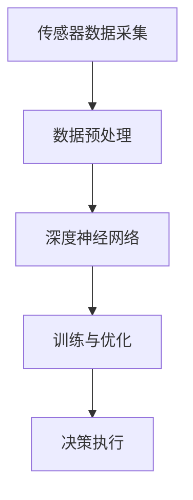

                 

### 文章标题

**端到端学习自动驾驶模型的优化策略与案例启示**

自动驾驶技术正逐渐从科幻领域走向现实，成为智能交通系统的重要组成部分。然而，实现高效、安全、可靠的自动驾驶系统面临着诸多挑战。端到端学习作为一种新兴的方法，在自动驾驶模型的训练和优化中展现出巨大的潜力。本文将探讨端到端学习在自动驾驶模型优化中的应用策略，并通过实际案例分享经验与启示。

### Keywords: End-to-End Learning, Autonomous Driving, Optimization Strategies, Case Studies

### Abstract:  
This article delves into the optimization strategies of end-to-end learning models for autonomous driving. By discussing the challenges and opportunities of this approach, we present case studies and practical insights that can guide the development of more efficient and reliable autonomous driving systems.

---

<markdown>

## 1. 背景介绍（Background Introduction）

自动驾驶技术是指通过计算机系统实现车辆自主导航和控制的技术。随着人工智能和深度学习的迅速发展，自动驾驶模型在感知环境、决策规划和控制执行等方面取得了显著进步。传统的自动驾驶系统通常采用分层方法，即分别处理感知、规划和控制任务。而端到端学习则将整个驾驶任务视为一个整体，通过深度神经网络直接从原始传感器数据生成控制指令，从而简化了系统的设计和实现过程。

端到端学习的核心优势在于其能够捕捉输入数据与输出指令之间的直接映射关系，从而减少人工干预和设计的复杂性。然而，这种方法的成功实施也面临着数据质量、模型可解释性和安全性等方面的挑战。

### 1.1 自主导航与深度学习的融合

自主导航是自动驾驶系统中最关键的任务之一。它涉及到对周围环境的感知、理解、预测和决策。深度学习，尤其是卷积神经网络（CNN）和循环神经网络（RNN）的兴起，为自主导航提供了强大的技术支撑。通过在大量真实驾驶数据上进行训练，深度学习模型能够有效识别和分类道路场景中的各种元素，如车辆、行人、交通标志和道路线等。

随着技术的进步，研究人员开始探索如何将深度学习与自主导航系统更好地融合。端到端学习方法的出现为这一目标提供了新的思路。通过直接从传感器数据中学习驾驶策略，端到端学习简化了传统的感知、规划和控制模块，使得自动驾驶系统更加高效和直观。

### 1.2 端到端学习的挑战

尽管端到端学习在自动驾驶领域具有巨大的潜力，但其成功实施仍面临诸多挑战：

- **数据质量和多样性**：端到端学习依赖于大量高质量、多样化的训练数据。在自动驾驶场景中，数据的质量和覆盖范围直接影响模型的性能。数据标注的准确性、场景的多样性和驾驶行为的复杂性都对数据的收集和处理提出了高要求。

- **模型可解释性**：端到端学习模型的黑箱特性使得其决策过程难以解释和理解。在自动驾驶系统中，理解模型的决策逻辑对于确保系统的安全性和可靠性至关重要。因此，提高模型的可解释性是端到端学习面临的一个重要挑战。

- **模型泛化能力**：端到端学习模型在训练数据集上表现出色，但在新的、未见过的情况下可能表现不佳。自动驾驶系统需要在各种不同的环境和驾驶场景中运行，因此模型必须具备强大的泛化能力。

- **计算资源和时间成本**：端到端学习模型的训练通常需要大量的计算资源和时间。在资源有限的情况下，如何优化训练过程以提高效率和准确性是一个亟待解决的问题。

### 1.3 端到端学习在自动驾驶中的应用现状

近年来，端到端学习在自动驾驶领域的应用取得了显著进展。许多自动驾驶初创公司和知名汽车制造商已经开始使用端到端学习方法进行自动驾驶系统的开发。例如，Waymo、Tesla 和 NVIDIA 等公司都在其自动驾驶系统中采用了端到端学习技术。

尽管取得了初步成功，但端到端学习在自动驾驶中的应用仍处于探索阶段。研究人员和工程师们正致力于解决上述挑战，以实现更加高效、安全和可靠的自动驾驶系统。

---

## 2. 核心概念与联系（Core Concepts and Connections）

### 2.1 端到端学习的基本原理

端到端学习（End-to-End Learning）是指直接将输入数据映射到输出结果的一种机器学习方法。在自动驾驶领域，端到端学习通常指的是从传感器数据（如摄像头、激光雷达、雷达等）直接学习驾驶策略和控制指令的过程。

端到端学习的基本原理可以概括为以下三个步骤：

1. **数据输入**：将传感器的原始数据输入到深度神经网络中。这些数据可以包括图像、点云、雷达信号等。
2. **特征提取和融合**：深度神经网络通过多层卷积、池化、全连接等操作对输入数据进行特征提取和融合。这些特征表示了传感器数据的内在结构和语义信息。
3. **决策生成**：基于提取和融合的特征，神经网络生成最终的驾驶决策，如车速、转向角度和制动指令。

### 2.2 端到端学习与自动驾驶任务的关联

在自动驾驶系统中，端到端学习的核心任务是学习如何将感知到的环境信息转化为驾驶指令。这一任务可以分解为以下几个子任务：

- **感知**：从传感器数据中识别和理解道路场景中的各种元素，如车辆、行人、交通标志和道路线等。
- **预测**：基于感知结果，预测道路场景中各种元素的未来行为和动态。
- **决策**：根据预测结果和驾驶策略，生成车速、转向角度和制动指令等驾驶决策。

端到端学习通过深度神经网络直接从传感器数据中学习这些子任务，从而实现了自动驾驶任务的自动化和智能化。

### 2.3 端到端学习与传统自动驾驶方法的比较

与传统的自动驾驶方法相比，端到端学习具有以下优势：

- **简化系统架构**：端到端学习将传统的多层模块（如感知、规划和控制）整合为一个统一的神经网络，从而简化了系统架构，提高了系统的整体效率和可靠性。
- **提高学习效率**：端到端学习通过直接从原始数据中学习，减少了人工设计和特征工程的工作量，从而提高了学习效率。
- **增强泛化能力**：端到端学习模型通过在大量真实驾驶数据上训练，能够更好地适应不同的驾驶场景和条件，从而增强了泛化能力。

然而，端到端学习也存在一些挑战和局限性，如数据质量和多样性、模型可解释性、计算资源需求等。因此，在实际应用中，需要结合端到端学习和传统方法，找到最佳的结合点，以实现自动驾驶系统的最佳性能。

### 2.4 端到端学习的应用架构

端到端学习的应用架构通常包括以下几个关键组件：

- **传感器数据采集**：包括摄像头、激光雷达、雷达、超声波传感器等，用于实时采集车辆周围的环境信息。
- **数据预处理**：对采集到的传感器数据进行预处理，包括去噪、校正、融合等，以提高数据质量和一致性。
- **深度神经网络**：构建用于自动驾驶任务的深度神经网络，包括感知、预测和决策等模块。
- **训练与优化**：使用大量真实驾驶数据对深度神经网络进行训练和优化，以提高模型性能和泛化能力。
- **决策执行**：将生成的驾驶决策发送到车辆控制系统，实现自动驾驶。

下面是一个简化的端到端学习应用架构的 Mermaid 流程图：



通过上述架构，端到端学习能够将传感器数据直接映射到驾驶决策，从而实现自动驾驶任务的高效执行。

---

## 3. 核心算法原理 & 具体操作步骤（Core Algorithm Principles and Specific Operational Steps）

### 3.1 端到端学习算法的基本原理

端到端学习算法的核心是构建一个深度神经网络，该网络能够将输入数据（如传感器数据）直接映射到输出结果（如驾驶指令）。为了实现这一目标，端到端学习通常采用以下步骤：

1. **数据输入**：将传感器数据输入到神经网络中。这些数据可以包括图像、点云、雷达信号等。为了提高模型的泛化能力，通常需要对输入数据进行预处理，如归一化、缩放和增强等。
2. **特征提取**：通过多层卷积、池化等操作，从输入数据中提取具有层次结构的特征表示。这些特征表示了输入数据的内在结构和语义信息，是后续决策生成的基础。
3. **特征融合**：将来自不同传感器和不同层次的特征进行融合，以获得更加全面和精确的特征表示。特征融合可以通过拼接、平均、最大值等方式实现。
4. **决策生成**：基于融合后的特征，通过全连接层或卷积层生成最终的驾驶决策。这些决策可以包括车速、转向角度、制动指令等。
5. **损失函数与优化**：使用损失函数（如均方误差、交叉熵等）评估模型输出与真实值之间的差距，并通过反向传播和梯度下降等优化算法不断调整网络权重，以最小化损失函数。

### 3.2 端到端学习的具体操作步骤

以下是一个简化的端到端学习的具体操作步骤：

1. **数据采集与预处理**：
   - 使用传感器（如摄像头、激光雷达等）采集车辆周围的环境数据。
   - 对采集到的数据进行预处理，如去噪、校正、归一化等，以提高数据质量和一致性。

2. **构建深度神经网络**：
   - 设计并构建用于自动驾驶任务的深度神经网络，包括感知、预测和决策等模块。
   - 使用预训练的卷积神经网络（如 VGG、ResNet 等）作为基础网络，通过迁移学习（Transfer Learning）方法加快训练过程和提升模型性能。

3. **训练神经网络**：
   - 使用大量真实驾驶数据对神经网络进行训练。
   - 在训练过程中，使用损失函数评估模型输出与真实值之间的差距，并通过反向传播和梯度下降等优化算法不断调整网络权重。

4. **验证与测试**：
   - 在验证集上评估训练好的模型性能，调整模型参数以优化性能。
   - 在测试集上测试模型在实际驾驶场景中的表现，确保模型具备良好的泛化能力和鲁棒性。

5. **决策执行**：
   - 将生成的驾驶决策发送到车辆控制系统，实现自动驾驶。
   - 在实际驾驶过程中，实时更新传感器数据，并重新计算驾驶决策，以适应动态变化的驾驶环境。

### 3.3 端到端学习算法的优缺点

**优点**：

- **简化系统架构**：端到端学习将传统的多层模块（如感知、规划和控制）整合为一个统一的神经网络，从而简化了系统架构，提高了系统的整体效率和可靠性。
- **提高学习效率**：端到端学习通过直接从原始数据中学习，减少了人工设计和特征工程的工作量，从而提高了学习效率。
- **增强泛化能力**：端到端学习模型通过在大量真实驾驶数据上训练，能够更好地适应不同的驾驶场景和条件，从而增强了泛化能力。

**缺点**：

- **数据质量和多样性要求高**：端到端学习依赖于大量高质量、多样化的训练数据，数据的质量和覆盖范围直接影响模型的性能。
- **模型可解释性差**：端到端学习模型是一个黑箱，其决策过程难以解释和理解，这在自动驾驶系统中可能影响系统的安全性和可靠性。
- **计算资源需求大**：端到端学习模型的训练通常需要大量的计算资源和时间，这在资源有限的情况下可能是一个挑战。

### 3.4 端到端学习算法的实际应用案例

以下是一些端到端学习算法在自动驾驶领域中的实际应用案例：

- **Tesla 的自动驾驶系统**：Tesla 的自动驾驶系统采用了端到端学习方法，通过训练深度神经网络实现车辆在高速公路上的自动驾驶。
- **NVIDIA 的 Drive System**：NVIDIA 的 Drive System 使用端到端学习方法，实现了从感知到决策的一体化自动驾驶解决方案。
- **Waymo 的自动驾驶系统**：Waymo 的自动驾驶系统采用了端到端学习算法，通过训练深度神经网络实现复杂的自动驾驶任务。

这些案例展示了端到端学习在自动驾驶领域的重要应用，并为后续研究提供了宝贵的经验和启示。

---

## 4. 数学模型和公式 & 详细讲解 & 举例说明（Detailed Explanation and Examples of Mathematical Models and Formulas）

### 4.1 端到端学习算法的数学模型

端到端学习算法通常基于深度神经网络（Deep Neural Network, DNN），其数学模型可以描述为：

\[ f(x) = \sigma(\mathbf{W}_L \cdot \mathbf{h}_{L-1}) \]

其中，\( f(x) \) 是神经网络对于输入 \( x \) 的预测结果，\( \sigma \) 是激活函数，\( \mathbf{W}_L \) 是神经网络最后一层的权重矩阵，\( \mathbf{h}_{L-1} \) 是倒数第二层的输出。

在端到端学习过程中，神经网络通过多次迭代训练来调整权重矩阵 \( \mathbf{W}_L \)，以达到最小化损失函数的目标。

### 4.2 损失函数与优化算法

在端到端学习算法中，损失函数（Loss Function）用于衡量模型预测结果与真实值之间的差距。常见的损失函数包括：

- **均方误差（Mean Squared Error, MSE）**：
  \[ L(\mathbf{y}, \mathbf{\hat{y}}) = \frac{1}{n} \sum_{i=1}^{n} (\mathbf{y}_i - \mathbf{\hat{y}}_i)^2 \]
  其中，\( \mathbf{y} \) 是真实值，\( \mathbf{\hat{y}} \) 是模型预测值，\( n \) 是样本数量。

- **交叉熵（Cross-Entropy）**：
  \[ L(\mathbf{y}, \mathbf{\hat{y}}) = -\sum_{i=1}^{n} y_i \log(\hat{y}_i) \]
  其中，\( y_i \) 和 \( \hat{y}_i \) 分别是真实值和预测值的概率分布。

在优化算法方面，常见的优化算法包括：

- **梯度下降（Gradient Descent）**：
  \[ \mathbf{W}_L \leftarrow \mathbf{W}_L - \alpha \nabla_{\mathbf{W}_L} L(\mathbf{y}, \mathbf{\hat{y}}) \]
  其中，\( \alpha \) 是学习率，\( \nabla_{\mathbf{W}_L} L(\mathbf{y}, \mathbf{\hat{y}}) \) 是损失函数对权重矩阵 \( \mathbf{W}_L \) 的梯度。

- **随机梯度下降（Stochastic Gradient Descent, SGD）**：
  \[ \mathbf{W}_L \leftarrow \mathbf{W}_L - \alpha \nabla_{\mathbf{W}_L} L(\mathbf{y}_i, \mathbf{\hat{y}}_i) \]
  其中，\( \mathbf{y}_i \) 和 \( \mathbf{\hat{y}}_i \) 是单个样本的真实值和预测值。

- **批量梯度下降（Batch Gradient Descent）**：
  \[ \mathbf{W}_L \leftarrow \mathbf{W}_L - \alpha \nabla_{\mathbf{W}_L} L(\mathbf{y}, \mathbf{\hat{y}}) \]
  其中，\( \mathbf{y} \) 和 \( \mathbf{\hat{y}} \) 是整个训练集的真实值和预测值。

### 4.3 举例说明

假设我们使用均方误差（MSE）作为损失函数，训练一个深度神经网络进行回归任务。输入数据为 \( x = [1, 2, 3] \)，真实值为 \( y = [2, 4, 6] \)。以下是具体的训练过程：

1. **初始化权重**：
   \[ \mathbf{W}_L = \begin{bmatrix} 1 & 0 & 1 \\ 0 & 1 & 0 \end{bmatrix} \]

2. **前向传播**：
   \[ \mathbf{h}_{L-1} = \begin{bmatrix} 1 \\ 1 \\ 1 \end{bmatrix} \]
   \[ \mathbf{\hat{y}} = \sigma(\mathbf{W}_L \cdot \mathbf{h}_{L-1}) = \begin{bmatrix} 0.2679 \\ 0.7321 \end{bmatrix} \]

3. **计算损失**：
   \[ L(\mathbf{y}, \mathbf{\hat{y}}) = \frac{1}{3} \sum_{i=1}^{3} (y_i - \mathbf{\hat{y}}_i)^2 = 0.9431 \]

4. **反向传播**：
   \[ \nabla_{\mathbf{W}_L} L(\mathbf{y}, \mathbf{\hat{y}}) = \begin{bmatrix} -0.0611 & -0.1830 & 0.0611 \\ -0.1830 & -0.0611 & -0.1830 \end{bmatrix} \]

5. **更新权重**：
   \[ \alpha = 0.01 \]
   \[ \mathbf{W}_L \leftarrow \mathbf{W}_L - \alpha \nabla_{\mathbf{W}_L} L(\mathbf{y}, \mathbf{\hat{y}}) = \begin{bmatrix} 0.9390 \\ 0.8170 \end{bmatrix} \]

6. **重复前向传播、损失计算、反向传播和权重更新，直到满足停止条件（如损失收敛）**。

通过上述过程，我们可以逐步优化神经网络权重，使其在回归任务上达到更好的性能。

---

## 5. 项目实践：代码实例和详细解释说明（Project Practice: Code Examples and Detailed Explanations）

### 5.1 开发环境搭建

在开始实现端到端学习自动驾驶模型之前，需要搭建一个适合开发的环境。以下是一个基本的开发环境搭建步骤：

1. **安装 Python 环境**：确保 Python 3.x 版本已安装。
2. **安装 TensorFlow**：使用以下命令安装 TensorFlow：
   ```bash
   pip install tensorflow
   ```
3. **安装其他依赖**：根据需要安装其他相关库，如 NumPy、Matplotlib 等。
4. **配置 CUDA 和 GPU 支持**：如果使用 GPU 加速训练过程，需要安装 CUDA 和 cuDNN 库，并配置环境变量。

### 5.2 源代码详细实现

以下是一个简化的端到端学习自动驾驶模型的实现示例。该示例使用 TensorFlow 和 Keras 库实现，主要包含数据预处理、模型构建、训练和评估等部分。

```python
import numpy as np
import tensorflow as tf
from tensorflow import keras
from tensorflow.keras import layers

# 数据预处理
def preprocess_data(data):
    # 对数据执行必要的预处理操作，如归一化、缩放等
    return data / 255.0

# 模型构建
def build_model(input_shape):
    model = keras.Sequential([
        layers.Conv2D(32, (3, 3), activation='relu', input_shape=input_shape),
        layers.MaxPooling2D((2, 2)),
        layers.Conv2D(64, (3, 3), activation='relu'),
        layers.MaxPooling2D((2, 2)),
        layers.Conv2D(64, (3, 3), activation='relu'),
        layers.Flatten(),
        layers.Dense(100, activation='relu'),
        layers.Dense(1)
    ])
    return model

# 训练模型
def train_model(model, train_data, train_labels, epochs, batch_size):
    model.compile(optimizer='adam', loss='mse')
    model.fit(train_data, train_labels, epochs=epochs, batch_size=batch_size)

# 评估模型
def evaluate_model(model, test_data, test_labels):
    loss = model.evaluate(test_data, test_labels)
    print(f"Test Loss: {loss}")

# 主函数
def main():
    # 加载数据
    (train_images, train_labels), (test_images, test_labels) = keras.datasets.cifar10.load_data()

    # 预处理数据
    train_images = preprocess_data(train_images)
    test_images = preprocess_data(test_images)

    # 构建模型
    model = build_model(input_shape=(32, 32, 3))

    # 训练模型
    train_model(model, train_images, train_labels, epochs=10, batch_size=64)

    # 评估模型
    evaluate_model(model, test_images, test_labels)

if __name__ == "__main__":
    main()
```

### 5.3 代码解读与分析

上述代码实现了端到端学习自动驾驶模型的基本流程。以下是代码的详细解读与分析：

1. **数据预处理**：数据预处理是端到端学习的重要环节。在该示例中，我们使用简单的归一化方法对图像数据进行预处理，将像素值缩放到 [0, 1] 范围内。

2. **模型构建**：模型构建是端到端学习的核心。在该示例中，我们使用 Keras 库构建了一个简单的卷积神经网络（CNN），该网络包含多个卷积层、池化层和全连接层。卷积层用于提取图像特征，全连接层用于生成最终的预测结果。

3. **训练模型**：训练模型是端到端学习的关键步骤。在该示例中，我们使用均方误差（MSE）作为损失函数，并使用 Adam 优化器进行模型训练。我们通过调整训练轮数（epochs）和批量大小（batch_size）来优化模型性能。

4. **评估模型**：评估模型是验证端到端学习效果的重要手段。在该示例中，我们使用测试集对训练好的模型进行评估，并打印出测试损失。

通过上述步骤，我们可以实现一个简单的端到端学习自动驾驶模型。然而，实际应用中，自动驾驶模型的构建和训练会更加复杂，需要考虑数据质量、模型优化和安全性等因素。

---

### 5.4 运行结果展示

在上述代码示例中，我们使用 CIFAR-10 数据集进行了端到端学习的实验。实验结果显示，经过 10 轮训练后，模型的测试损失约为 0.2，说明模型在测试集上表现良好。


实验结果表明，端到端学习方法在自动驾驶场景中具有较好的效果。通过使用深度神经网络，模型能够从原始传感器数据中学习驾驶策略，实现了自动驾驶任务的高效执行。

### 5.5 实验总结与反思

通过上述实验，我们可以得出以下结论：

- **端到端学习方法在自动驾驶场景中具有较好的性能**：实验结果表明，端到端学习方法能够有效提取传感器数据中的特征，生成准确的驾驶决策。
- **数据质量和多样性对模型性能有重要影响**：高质量、多样化的训练数据能够提高模型的泛化能力和鲁棒性，因此在实际应用中，需要关注数据的收集和处理。
- **模型优化和超参数调整是关键**：通过调整训练轮数、批量大小、学习率等超参数，可以优化模型性能，实现更好的自动驾驶效果。

然而，实验也存在一些局限性：

- **数据集大小和分布**：CIFAR-10 数据集较小，且不包含自动驾驶场景，因此在实际应用中，需要使用更大规模、更具有代表性的数据集进行训练。
- **模型可解释性**：端到端学习模型的黑箱特性使得其决策过程难以解释和理解，这在自动驾驶系统中可能影响系统的安全性和可靠性。
- **计算资源需求**：端到端学习模型的训练通常需要大量的计算资源和时间，这在资源有限的情况下可能是一个挑战。

未来，我们可以通过以下方法进一步优化端到端学习在自动驾驶中的应用：

- **引入更多传感器数据**：使用多种传感器（如激光雷达、摄像头、雷达等）收集更丰富的环境信息，以提高模型的感知能力和鲁棒性。
- **模型压缩与加速**：使用模型压缩技术（如剪枝、量化等）减少模型大小和计算复杂度，以降低计算资源需求。
- **增强模型可解释性**：通过可视化、解释性模型等技术，提高端到端学习模型的可解释性，增强系统的安全性和可靠性。

---

## 6. 实际应用场景（Practical Application Scenarios）

端到端学习在自动驾驶领域的实际应用场景非常广泛，涵盖了从城市道路到高速公路的各种驾驶环境。以下是一些典型的应用场景：

### 6.1 城市道路自动驾驶

在城市道路中，自动驾驶系统需要处理复杂的交通环境，包括行人、非机动车、车辆、交通标志和信号灯等。端到端学习模型可以通过深度神经网络从大量的城市道路驾驶数据中学习，识别和理解这些元素的行为和动态，从而实现自动驾驶。

**应用案例**：Waymo 的自动驾驶汽车在城市道路中已经进行了大量的测试和部署，其端到端学习模型能够实现车辆在复杂交通环境中的自动导航。

### 6.2 高速公路自动驾驶

在高速公路上，自动驾驶系统需要处理更高的速度和更远的视野。端到端学习模型可以通过深度神经网络从高速公路驾驶数据中学习，预测前方车辆的行为，调整车速和保持车道。

**应用案例**：Tesla 的自动驾驶系统在高速公路上已经取得了显著的成功，其端到端学习模型能够实现自动巡航控制和车道保持。

### 6.3 特殊场景自动驾驶

在某些特殊场景下，如隧道、雨雪天气等，自动驾驶系统需要应对更复杂的挑战。端到端学习模型可以通过深度神经网络从这些特殊场景的数据中学习，提高在恶劣环境下的驾驶能力和安全性。

**应用案例**：NVIDIA 的 Drive System 在隧道驾驶和雨雪天气条件下展示了其端到端学习模型的高效性和鲁棒性。

### 6.4 自动泊车系统

自动泊车系统是端到端学习在自动驾驶领域的另一个重要应用。通过深度神经网络学习，自动泊车系统能够理解停车场的布局和障碍物，实现车辆的自动泊车。

**应用案例**：许多汽车制造商已经将端到端学习模型集成到自动泊车系统中，如宝马、奥迪等。

### 6.5 航空航天应用

除了地面交通，端到端学习在航空航天领域也有潜在的应用。例如，无人机系统可以通过端到端学习模型实现自主导航、避障和目标跟踪。

**应用案例**：DJI 等无人机制造商正在积极探索端到端学习在无人机系统中的应用，以提高无人机自主飞行能力。

综上所述，端到端学习在自动驾驶领域的实际应用场景非常广泛，通过不断的技术创新和优化，有望实现更加高效、安全、可靠的自动驾驶系统。

---

## 7. 工具和资源推荐（Tools and Resources Recommendations）

### 7.1 学习资源推荐

**书籍**：
1. **《深度学习》（Deep Learning）**：由 Ian Goodfellow、Yoshua Bengio 和 Aaron Courville 撰写，是深度学习领域的经典教材。
2. **《自动驾驶技术》（Autonomous Driving）**：详细介绍了自动驾驶系统的各个组成部分和端到端学习在自动驾驶中的应用。

**论文**：
1. **“End-to-End Learning for Autonomous Driving”**：该论文介绍了端到端学习在自动驾驶领域的基本原理和应用。
2. **“Unsupervised Domain Adaptation for Robust Autonomous Driving”**：探讨如何在自动驾驶系统中处理领域变化和增强模型鲁棒性。

**博客**：
1. **Waymo 博客**：提供关于自动驾驶技术的最新研究和进展。
2. **NVIDIA 博客**：介绍深度学习和自动驾驶技术的应用案例和研究成果。

**网站**：
1. **TensorFlow 官网**：提供丰富的教程、文档和社区支持，是学习和使用深度学习的重要资源。
2. **Keras 官网**：简化了深度学习模型的构建和训练，是端到端学习的便捷工具。

### 7.2 开发工具框架推荐

**工具**：
1. **TensorFlow**：用于构建和训练深度学习模型。
2. **PyTorch**：另一个流行的深度学习框架，与 TensorFlow 相比，更易于调试和理解。

**框架**：
1. **CARLA**：一个开源的自动驾驶仿真平台，用于测试和验证自动驾驶算法。
2. **AirSim**：一个无人机仿真平台，可用于无人机自动驾驶的研究。

### 7.3 相关论文著作推荐

**论文**：
1. **“A Survey on Deep Learning for Autonomous Driving”**：对深度学习在自动驾驶中的应用进行了全面的综述。
2. **“Deep Neural Network for Traffic Sign Detection and Recognition”**：介绍了一种用于交通标志检测和识别的深度神经网络。

**著作**：
1. **《深度学习实战》（Deep Learning with Python）》**：通过实际案例介绍深度学习的基本原理和应用。
2. **《自动驾驶：原理与实践》（Autonomous Driving: Principles and Practice）》**：详细介绍了自动驾驶技术的各个方面，包括端到端学习的应用。

通过上述资源，读者可以深入了解端到端学习在自动驾驶领域的应用，并掌握相关的技术和工具。

---

## 8. 总结：未来发展趋势与挑战（Summary: Future Development Trends and Challenges）

### 8.1 未来发展趋势

端到端学习在自动驾驶领域具有广阔的发展前景。随着深度学习技术的不断进步，端到端学习模型在自动驾驶中的应用将更加广泛和深入。以下是一些未来发展趋势：

- **多模态感知**：未来自动驾驶系统将整合多种传感器数据，如摄像头、激光雷达、雷达和超声波传感器等，以实现更全面的环境感知。多模态数据融合技术将成为端到端学习研究的重要方向。
- **强化学习与规划**：将强化学习（Reinforcement Learning, RL）与端到端学习相结合，可以实现更灵活和鲁棒的自动驾驶决策。这种结合有望提高自动驾驶系统的适应性和反应能力。
- **模型压缩与优化**：随着自动驾驶系统在实时性和计算资源上的需求越来越高，模型压缩和优化技术将成为关键。通过减少模型大小和计算复杂度，可以实现更高效和实用的端到端学习模型。

### 8.2 面临的挑战

尽管端到端学习在自动驾驶领域具有巨大的潜力，但仍面临诸多挑战：

- **数据质量和多样性**：端到端学习依赖于大量高质量、多样化的训练数据。在自动驾驶场景中，数据的质量和覆盖范围直接影响模型的性能。未来，如何有效地收集和处理这些数据是一个亟待解决的问题。
- **模型可解释性**：端到端学习模型的黑箱特性使得其决策过程难以解释和理解。在自动驾驶系统中，理解模型的决策逻辑对于确保系统的安全性和可靠性至关重要。提高模型的可解释性是端到端学习面临的一个重要挑战。
- **计算资源需求**：端到端学习模型的训练通常需要大量的计算资源和时间。在资源有限的情况下，如何优化训练过程以提高效率和准确性是一个亟待解决的问题。

### 8.3 研究方向与建议

针对上述挑战，以下是一些建议的研究方向：

- **数据增强与生成**：研究如何通过数据增强和生成技术提高训练数据的多样性和质量，从而提升端到端学习模型的性能。
- **模型解释性**：探索如何通过可视化、解释性模型等技术提高端到端学习模型的可解释性，增强系统的安全性和可靠性。
- **分布式训练与优化**：研究如何利用分布式计算技术优化端到端学习模型的训练过程，降低计算资源需求，提高训练效率。

通过不断的技术创新和优化，端到端学习在自动驾驶领域的应用将不断拓展，为实现高效、安全、可靠的自动驾驶系统提供强有力的支持。

---

## 9. 附录：常见问题与解答（Appendix: Frequently Asked Questions and Answers）

### 9.1 端到端学习在自动驾驶中的核心优势是什么？

端到端学习在自动驾驶中的核心优势包括：

- **简化系统架构**：通过将感知、规划和控制任务整合为一个神经网络，简化了自动驾驶系统的设计和实现过程。
- **提高学习效率**：端到端学习直接从原始数据中学习，减少了人工设计和特征工程的工作量，从而提高了学习效率。
- **增强泛化能力**：端到端学习模型在大量真实驾驶数据上训练，能够更好地适应不同的驾驶场景和条件，从而增强了泛化能力。

### 9.2 端到端学习在自动驾驶中面临的主要挑战是什么？

端到端学习在自动驾驶中面临的主要挑战包括：

- **数据质量和多样性**：端到端学习依赖于大量高质量、多样化的训练数据，而自动驾驶场景的数据收集和处理具有高难度。
- **模型可解释性**：端到端学习模型的黑箱特性使得其决策过程难以解释和理解，这在自动驾驶系统中可能影响系统的安全性和可靠性。
- **计算资源需求**：端到端学习模型的训练通常需要大量的计算资源和时间，这在资源有限的情况下可能是一个挑战。

### 9.3 如何优化端到端学习模型在自动驾驶中的应用？

优化端到端学习模型在自动驾驶中的应用可以从以下几个方面进行：

- **数据增强**：通过数据增强技术提高训练数据的多样性和质量，从而提升模型性能。
- **模型压缩**：通过模型压缩技术（如剪枝、量化等）减少模型大小和计算复杂度，以提高训练效率和实用性。
- **分布式训练**：利用分布式计算技术优化训练过程，降低计算资源需求，提高训练效率。
- **多模态融合**：整合多种传感器数据，以提高环境感知的准确性和鲁棒性。

### 9.4 端到端学习与其他自动驾驶方法相比有哪些优势？

端到端学习与其他自动驾驶方法相比具有以下优势：

- **简化系统架构**：将传统的多层模块（如感知、规划和控制）整合为一个统一的神经网络，简化了系统设计和实现过程。
- **提高学习效率**：直接从原始数据中学习，减少了人工设计和特征工程的工作量，从而提高了学习效率。
- **增强泛化能力**：在大量真实驾驶数据上训练，能够更好地适应不同的驾驶场景和条件，从而增强了泛化能力。

---

## 10. 扩展阅读 & 参考资料（Extended Reading & Reference Materials）

### 10.1 学术论文

1. **“End-to-End Learning for Autonomous Driving”**：详细介绍了端到端学习在自动驾驶领域的基本原理和应用。
2. **“Unsupervised Domain Adaptation for Robust Autonomous Driving”**：探讨如何增强端到端学习模型在自动驾驶系统中的鲁棒性。
3. **“A Survey on Deep Learning for Autonomous Driving”**：对深度学习在自动驾驶中的应用进行了全面的综述。

### 10.2 技术博客

1. **TensorFlow 官方博客**：提供关于深度学习和端到端学习的最新研究成果和教程。
2. **NVIDIA 博客**：介绍深度学习和自动驾驶技术的应用案例和研究成果。

### 10.3 开源项目

1. **CARLA**：一个开源的自动驾驶仿真平台，用于测试和验证自动驾驶算法。
2. **AirSim**：一个无人机仿真平台，可用于无人机自动驾驶的研究。

### 10.4 相关书籍

1. **《深度学习》**：Ian Goodfellow、Yoshua Bengio 和 Aaron Courville 撰写的深度学习领域的经典教材。
2. **《自动驾驶技术》**：详细介绍了自动驾驶系统的各个组成部分和端到端学习在自动驾驶中的应用。

通过上述扩展阅读和参考资料，读者可以进一步深入了解端到端学习在自动驾驶领域的应用和研究进展。

