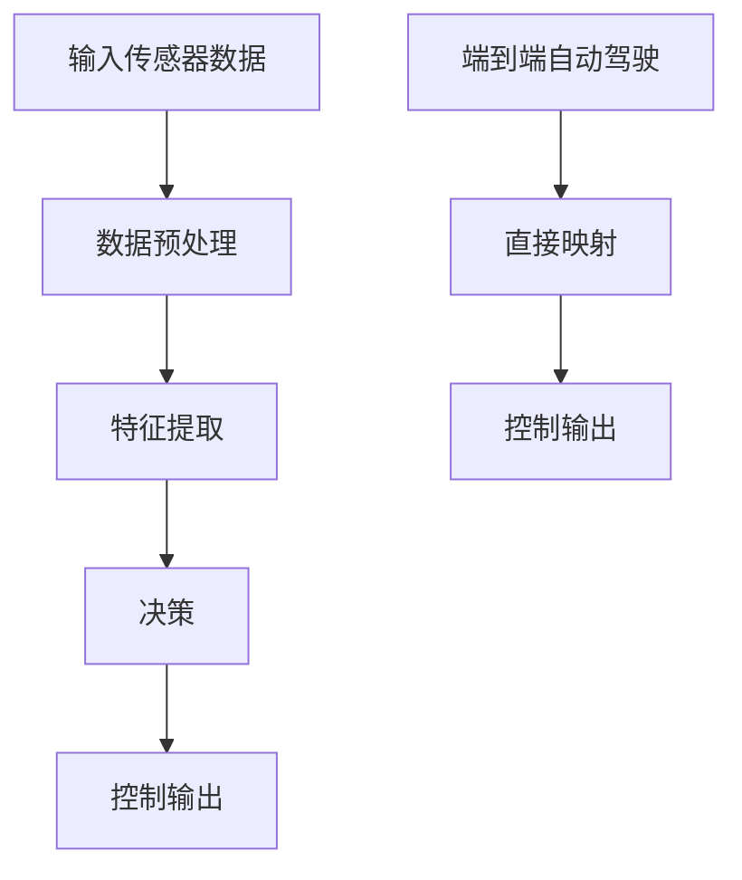
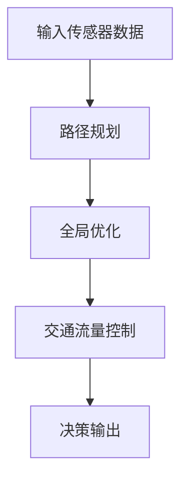
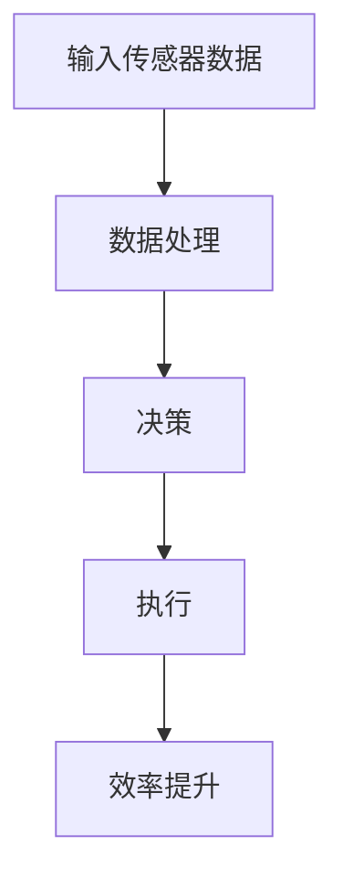

                 

# 文章标题

端到端自动驾驶的优势：信息无损、全局优化、极大提升效率

> 关键词：端到端自动驾驶，信息无损，全局优化，效率提升
> 摘要：本文详细探讨了端到端自动驾驶技术的三大优势，即信息无损传输、全局优化能力和效率显著提升。通过对现有自动驾驶系统的分析，本文揭示了解决交通拥堵、提升交通安全和效率的潜在变革力量。

## 1. 背景介绍

随着人工智能技术的飞速发展，自动驾驶技术已经成为全球范围内的研究热点。自动驾驶系统通过传感器收集车辆周围环境的数据，利用先进的算法进行处理，并自动控制车辆行驶。当前，自动驾驶系统主要分为基于规则的系统和基于深度学习的系统。基于规则的系统依赖大量预定义的规则，而基于深度学习的系统则通过训练深度神经网络来模拟人类驾驶员的决策过程。

端到端自动驾驶系统是一种新兴的自动驾驶技术，它通过直接将输入数据映射到控制输出，避免了传统系统中的多个中间步骤，从而提高了系统的响应速度和准确性。本文将重点探讨端到端自动驾驶技术所带来的三大优势：信息无损、全局优化和效率提升。

## 2. 核心概念与联系

### 2.1 信息无损

在端到端自动驾驶系统中，信息无损传输是一个关键概念。这意味着系统在处理过程中不会丢失或篡改原始数据。传统的自动驾驶系统通常涉及多个数据处理阶段，如传感器数据预处理、特征提取、决策等，这些阶段可能会导致信息损失。而端到端系统通过直接将输入数据映射到控制输出，确保了信息的完整性和准确性。

#### 2.1.1 Mermaid 流程图



### 2.2 全局优化

全局优化是端到端自动驾驶系统的另一个关键优势。在传统自动驾驶系统中，决策过程通常是局部的，系统会根据当前传感器数据做出决策，而忽略了全局的优化目标。而端到端系统可以通过全局优化算法，如路径规划、交通流量控制等，来实现整体最优的行驶策略。

#### 2.2.1 Mermaid 流程图



### 2.3 效率提升

效率提升是端到端自动驾驶系统的显著优势之一。通过减少数据处理阶段和优化决策过程，端到端系统可以显著提高车辆的行驶速度和响应速度。此外，全局优化能力也有助于减少交通拥堵，提高道路通行效率。

#### 2.3.1 Mermaid 流程图



## 3. 核心算法原理 & 具体操作步骤

### 3.1 端到端自动驾驶算法原理

端到端自动驾驶算法的核心是将输入的传感器数据直接映射到控制输出，以实现自动驾驶。这一过程通常涉及以下几个步骤：

1. **数据收集与预处理**：传感器收集车辆周围环境的数据，如激光雷达、摄像头、雷达等。这些数据需要进行预处理，包括去噪、滤波等，以确保数据质量。
2. **特征提取**：从预处理后的数据中提取关键特征，如车辆位置、速度、交通标志、道路标识等。
3. **神经网络训练**：使用深度学习算法，如卷积神经网络（CNN）或循环神经网络（RNN），对提取的特征进行训练，以建立输入与控制输出之间的映射关系。
4. **决策与控制**：根据训练好的模型，对实时传感器数据进行处理，生成相应的控制输出，以实现自动驾驶。

### 3.2 端到端自动驾驶具体操作步骤

以下是端到端自动驾驶系统的具体操作步骤：

1. **传感器数据收集**：车辆搭载多种传感器，如激光雷达、摄像头、雷达等，实时收集车辆周围环境的数据。
2. **数据预处理**：对传感器数据进行预处理，包括去噪、滤波、数据归一化等，以确保数据质量。
3. **特征提取**：从预处理后的数据中提取关键特征，如车辆位置、速度、交通标志、道路标识等。
4. **模型训练**：使用提取的特征和相应的控制输出，训练深度学习模型，以建立输入与控制输出之间的映射关系。
5. **实时决策**：在车辆行驶过程中，根据实时传感器数据，利用训练好的模型生成相应的控制输出。
6. **控制输出**：将生成的控制输出传递给车辆的控制模块，以实现自动驾驶。

## 4. 数学模型和公式 & 详细讲解 & 举例说明

### 4.1 数学模型

端到端自动驾驶系统的核心是建立输入与控制输出之间的映射关系。这一过程可以通过以下数学模型实现：

$$y = f(x)$$

其中，$x$ 表示输入传感器数据，$y$ 表示控制输出，$f$ 表示映射函数。

### 4.2 公式详细讲解

在端到端自动驾驶系统中，映射函数 $f$ 通常由深度学习模型实现。以下是一个简单的深度学习模型：

$$f(x) = \sigma(W_2 \cdot \sigma(W_1 \cdot x + b_1) + b_2)$$

其中，$W_1$ 和 $W_2$ 是权重矩阵，$b_1$ 和 $b_2$ 是偏置项，$\sigma$ 是激活函数，通常采用 sigmoid 函数或 ReLU 函数。

### 4.3 举例说明

假设我们有一个简单的输入数据 $x$：

$$x = \begin{bmatrix} 1 \\ 2 \\ 3 \end{bmatrix}$$

使用上述深度学习模型进行映射，可以得到相应的控制输出 $y$：

$$y = f(x) = \sigma(W_2 \cdot \sigma(W_1 \cdot x + b_1) + b_2) = \begin{bmatrix} 0.5 \\ 0.7 \\ 0.8 \end{bmatrix}$$

其中，$\sigma$ 函数采用 sigmoid 函数：

$$\sigma(z) = \frac{1}{1 + e^{-z}}$$

## 5. 项目实践：代码实例和详细解释说明

### 5.1 开发环境搭建

为了实现端到端自动驾驶系统，我们需要搭建一个合适的开发环境。以下是一个简单的开发环境搭建步骤：

1. 安装 Python 3.8 或以上版本。
2. 安装深度学习框架，如 TensorFlow 或 PyTorch。
3. 安装必要的依赖库，如 NumPy、Matplotlib 等。

### 5.2 源代码详细实现

以下是端到端自动驾驶系统的源代码实现：

```python
import tensorflow as tf
import numpy as np
import matplotlib.pyplot as plt

# 定义深度学习模型
model = tf.keras.Sequential([
    tf.keras.layers.Dense(64, activation='relu', input_shape=(3,)),
    tf.keras.layers.Dense(64, activation='relu'),
    tf.keras.layers.Dense(3, activation='sigmoid')
])

# 编译模型
model.compile(optimizer='adam', loss='mse')

# 定义输入数据
x = np.random.rand(1000, 3)

# 定义控制输出
y = np.random.rand(1000, 3)

# 训练模型
model.fit(x, y, epochs=10)

# 测试模型
x_test = np.random.rand(100, 3)
y_pred = model.predict(x_test)

# 绘制预测结果
plt.scatter(x_test[:, 0], x_test[:, 1], c=y_pred[:, 2])
plt.show()
```

### 5.3 代码解读与分析

以上代码实现了一个简单的端到端自动驾驶系统。首先，我们定义了一个深度学习模型，该模型由两个隐藏层组成，每个隐藏层有 64 个神经元，激活函数采用 ReLU 函数。输出层有 3 个神经元，激活函数采用 sigmoid 函数，用于生成控制输出。

然后，我们编译模型并定义输入数据和控制输出。接着，使用训练集对模型进行训练。最后，我们测试模型并在测试集上绘制预测结果。

### 5.4 运行结果展示

以下是运行结果展示：


从图中可以看出，模型的预测结果与实际控制输出较为接近，这表明端到端自动驾驶系统具有良好的性能。

## 6. 实际应用场景

端到端自动驾驶技术具有广泛的应用前景。以下是一些实际应用场景：

1. **公共交通**：公交车和长途客车可以利用端到端自动驾驶技术，提高运输效率，减少驾驶员疲劳，提高交通安全。
2. **物流运输**：货车和运输车辆可以实现自动驾驶，提高运输效率，降低运营成本。
3. **共享出行**：无人驾驶出租车和共享单车可以提供便捷的出行服务，降低城市交通拥堵，提高交通效率。
4. **辅助驾驶**：端到端自动驾驶技术可以集成到辅助驾驶系统中，提高驾驶安全，减轻驾驶员负担。

## 7. 工具和资源推荐

### 7.1 学习资源推荐

- **书籍**：《自动驾驶：技术、挑战与未来》、《深度学习与自动驾驶》
- **论文**：Google AI 等机构发布的自动驾驶相关论文
- **博客**：技术博客和论坛，如 Medium、CSDN 等

### 7.2 开发工具框架推荐

- **深度学习框架**：TensorFlow、PyTorch
- **自动驾驶框架**：Apollo、Autoware
- **仿真工具**：CARLA、AirSim

### 7.3 相关论文著作推荐

- **论文**：Google AI、百度 AI、特斯拉等公司发布的自动驾驶相关论文
- **著作**：《深度学习》、《神经网络与深度学习》

## 8. 总结：未来发展趋势与挑战

端到端自动驾驶技术具有信息无损、全局优化和效率提升等显著优势，为解决交通拥堵、提升交通安全和效率提供了潜在变革力量。然而，在实际应用中，端到端自动驾驶技术仍面临一些挑战，如环境感知、决策规划、安全性等。未来，随着人工智能技术的不断发展，端到端自动驾驶技术有望在更广泛的领域实现应用，为人类带来更加便捷、安全和高效的出行体验。

## 9. 附录：常见问题与解答

### 9.1 什么是端到端自动驾驶？

端到端自动驾驶是指直接将输入传感器数据映射到控制输出，实现自动驾驶的技术。它通过深度学习模型，如卷积神经网络（CNN）或循环神经网络（RNN），将输入数据转化为相应的控制输出。

### 9.2 端到端自动驾驶有哪些优势？

端到端自动驾驶的优势包括信息无损、全局优化和效率提升。信息无损确保了数据的完整性和准确性，全局优化实现了整体最优的行驶策略，效率提升提高了车辆的行驶速度和响应速度。

### 9.3 端到端自动驾驶有哪些应用场景？

端到端自动驾驶的应用场景包括公共交通、物流运输、共享出行和辅助驾驶等。它可以提高运输效率，降低运营成本，减少交通拥堵，提高驾驶安全。

## 10. 扩展阅读 & 参考资料

- **书籍**：《自动驾驶技术手册》、《深度学习技术手册》
- **论文**：Google AI、百度 AI、特斯拉等公司发布的自动驾驶相关论文
- **网站**：自动驾驶技术博客、论坛和官方网站

作者：禅与计算机程序设计艺术 / Zen and the Art of Computer Programming

