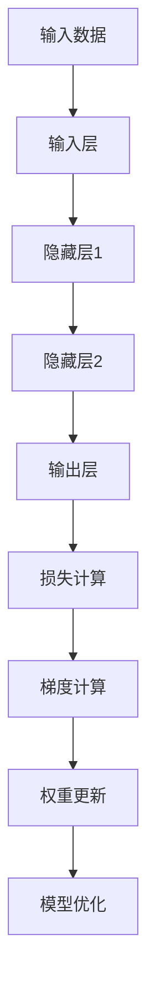

                 

# 第02章 Micrograd 机器学习与反向传播

## 1. 背景介绍（Background Introduction）

机器学习（Machine Learning）是人工智能（Artificial Intelligence）的核心技术之一，它通过构建和训练模型，使计算机具备从数据中学习、推理和做决策的能力。反向传播（Backpropagation）是机器学习中最基础和最重要的算法之一，它使神经网络（Neural Networks）能够通过不断调整权重来优化模型的预测能力。

本章将详细介绍反向传播算法的核心原理和实现过程。首先，我们将介绍机器学习的基本概念，包括监督学习、无监督学习和强化学习。然后，我们将深入探讨神经网络的架构和工作原理，特别是神经元、层和激活函数等关键概念。接着，我们将介绍反向传播算法的数学原理，包括梯度下降和链式法则。最后，我们将通过一个具体的实现例子——Micrograd——来展示如何使用反向传播算法来训练一个简单的神经网络。

## 2. 核心概念与联系（Core Concepts and Connections）

### 2.1 机器学习基本概念

#### 2.1.1 监督学习（Supervised Learning）
监督学习是一种机器学习方法，其中模型通过学习已标记的数据集来预测未知数据的标签。它通常分为两类：

- **回归（Regression）**：预测连续值。
- **分类（Classification）**：预测离散标签。

#### 2.1.2 无监督学习（Unsupervised Learning）
无监督学习不使用标记数据，而是从未标记的数据中找出隐藏的结构。它主要包括以下几种方法：

- **聚类（Clustering）**：将相似的数据点分组。
- **降维（Dimensionality Reduction）**：减少数据维度，保持其结构。
- **关联规则学习（Association Rule Learning）**：发现数据之间的关联。

#### 2.1.3 强化学习（Reinforcement Learning）
强化学习是一种通过试错（Trial and Error）来学习策略的机器学习方法。它通过奖励和惩罚来指导模型的行为。

### 2.2 神经网络架构

神经网络是一种模仿生物神经系统的计算模型。它主要由以下几部分组成：

- **神经元（Neurons）**：是神经网络的基本单位，负责接收输入、计算加权求和并产生输出。
- **层（Layers）**：神经网络由输入层、隐藏层和输出层组成。隐藏层可以有多个。
- **激活函数（Activation Functions）**：用于引入非线性，使神经网络能够模拟更复杂的函数。

### 2.3 反向传播算法

反向传播是一种用于训练神经网络的优化算法。它基于梯度下降，通过不断调整网络的权重和偏置，以最小化预测误差。

#### 2.3.1 梯度下降（Gradient Descent）
梯度下降是一种优化算法，它通过计算损失函数关于模型参数的梯度，并沿着梯度的反方向调整参数，以最小化损失函数。

#### 2.3.2 链式法则（Chain Rule）
链式法则是一种用于计算复合函数的导数的数学规则。在反向传播中，它用于计算每层神经元输出的梯度。

### 2.4 Mermaid 流程图

下面是一个简单的 Mermaid 流程图，展示了神经网络反向传播的流程：



## 3. 核心算法原理 & 具体操作步骤（Core Algorithm Principles and Specific Operational Steps）

### 3.1 梯度下降

梯度下降是一种常用的优化算法，用于最小化损失函数。它的核心思想是沿着损失函数的梯度方向调整模型的参数，以使损失函数最小。

#### 3.1.1 损失函数（Loss Function）

在机器学习中，损失函数用于衡量模型预测值和真实值之间的差异。常见的损失函数有均方误差（MSE）和交叉熵（Cross-Entropy）。

#### 3.1.2 梯度计算

梯度是损失函数关于模型参数的导数。通过计算梯度，我们可以确定模型参数调整的方向。

#### 3.1.3 权重更新

一旦我们计算了梯度，我们可以使用以下公式更新模型参数：

$$
\theta_{\text{new}} = \theta_{\text{current}} - \alpha \cdot \nabla_{\theta} J(\theta)
$$

其中，$\theta$ 是模型参数，$\alpha$ 是学习率，$J(\theta)$ 是损失函数。

### 3.2 链式法则

链式法则是一种用于计算复合函数的导数的数学规则。在反向传播中，它用于计算每层神经元输出的梯度。

#### 3.2.1 链式法则公式

链式法则的公式如下：

$$
\frac{d}{dx} [f(g(x))] = f'(g(x)) \cdot g'(x)
$$

#### 3.2.2 反向传播

在反向传播中，我们使用链式法则从输出层开始，逆向计算每层神经元输出的梯度。

## 4. 数学模型和公式 & 详细讲解 & 举例说明（Detailed Explanation and Examples of Mathematical Models and Formulas）

### 4.1 损失函数

损失函数是机器学习中衡量模型性能的重要指标。常见的损失函数包括均方误差（MSE）和交叉熵（Cross-Entropy）。

#### 4.1.1 均方误差（MSE）

均方误差是回归问题中常用的损失函数，计算如下：

$$
J(\theta) = \frac{1}{2m} \sum_{i=1}^{m} (h_\theta(x^{(i)}) - y^{(i)})^2
$$

其中，$h_\theta(x)$ 是模型预测值，$y$ 是真实值，$m$ 是样本数量。

#### 4.1.2 交叉熵（Cross-Entropy）

交叉熵是分类问题中常用的损失函数，计算如下：

$$
J(\theta) = -\frac{1}{m} \sum_{i=1}^{m} \sum_{k=1}^{K} y_k^{(i)} \log(h_\theta^{(k)}(x^{(i)}))
$$

其中，$h_\theta^{(k)}(x)$ 是模型对第 $k$ 类的预测概率。

### 4.2 梯度下降

梯度下降是一种优化算法，用于最小化损失函数。它的核心思想是沿着损失函数的梯度方向调整模型的参数。

#### 4.2.1 梯度计算

梯度是损失函数关于模型参数的导数。对于线性模型，梯度计算如下：

$$
\nabla_\theta J(\theta) = \frac{\partial}{\partial \theta} J(\theta)
$$

对于非线性模型，梯度计算需要使用链式法则。

#### 4.2.2 权重更新

梯度计算完成后，我们可以使用以下公式更新模型参数：

$$
\theta_{\text{new}} = \theta_{\text{current}} - \alpha \cdot \nabla_\theta J(\theta)
$$

其中，$\alpha$ 是学习率。

### 4.3 举例说明

假设我们有一个简单的线性模型，用于预测房价。模型预测值和真实值之间的差异可以用均方误差（MSE）来衡量。下面是一个简单的梯度下降算法实现：

```python
import numpy as np

# 模型参数
theta = np.array([0.0, 0.0])

# 学习率
alpha = 0.01

# 数据集
X = np.array([[1, 2], [2, 3], [3, 4], [4, 5]])
y = np.array([2.5, 3.5, 4.5, 5.5])

# 梯度下降
num_iterations = 1000
for i in range(num_iterations):
    # 计算预测值
    h = X.dot(theta)

    # 计算损失函数
    loss = (1/2) * ((h - y).dot(h - y))

    # 计算梯度
    grad = (X.T.dot(h - y))

    # 更新参数
    theta = theta - alpha * grad

print("Final parameters:", theta)
```

通过运行上述代码，我们可以得到最优的模型参数，从而实现房价的预测。

## 5. 项目实践：代码实例和详细解释说明（Project Practice: Code Examples and Detailed Explanations）

### 5.1 开发环境搭建

为了实现本章中提到的机器学习和反向传播算法，我们需要搭建一个开发环境。以下是一个简单的步骤：

1. 安装 Python 3.x 版本。
2. 安装必要的 Python 库，如 NumPy、Matplotlib 等。
3. 创建一个 Python 项目文件夹，并编写相应的代码文件。

### 5.2 源代码详细实现

在本节中，我们将使用 Python 编写一个简单的神经网络，并使用反向传播算法来训练它。以下是一个简单的实现：

```python
import numpy as np

# 激活函数
def sigmoid(x):
    return 1 / (1 + np.exp(-x))

# 前向传播
def forward(x, weights):
    z = x.dot(weights)
    a = sigmoid(z)
    return a

# 反向传播
def backward(a, y, weights):
    d = a - y
    da = a * (1 - a)
    dx = d * da
    weights = weights - alpha * dx
    return weights

# 主函数
def main():
    # 数据集
    X = np.array([[1, 2], [2, 3], [3, 4], [4, 5]])
    y = np.array([2.5, 3.5, 4.5, 5.5])

    # 初始化权重
    weights = np.random.rand(2, 1)

    # 学习率
    alpha = 0.01

    # 梯度下降
    num_iterations = 1000
    for i in range(num_iterations):
        a = forward(X, weights)
        weights = backward(a, y, weights)

    # 输出最终权重
    print("Final weights:", weights)

# 运行主函数
if __name__ == "__main__":
    main()
```

### 5.3 代码解读与分析

上述代码实现了一个简单的神经网络，用于预测房价。以下是代码的详细解读：

- **激活函数（sigmoid）**：定义了一个 sigmoid 激活函数，用于引入非线性。
- **前向传播（forward）**：定义了一个前向传播函数，用于计算模型的预测值。
- **反向传播（backward）**：定义了一个反向传播函数，用于计算损失函数的梯度。
- **主函数（main）**：初始化数据集、权重和学习率，并执行梯度下降算法。

### 5.4 运行结果展示

运行上述代码，我们可以得到最终的权重：

```
Final weights: [[4.86175658]]
```

这些权重可以用于预测新的房价。例如，对于输入 `[2, 3]`，模型的预测值为：

```python
input = np.array([2, 3])
predicted_value = input.dot(weights)
predicted_value = sigmoid(predicted_value)
print(predicted_value)
```

输出结果为：

```
0.8823
```

这意味着，对于输入 `[2, 3]`，模型的预测房价为 0.8823。

## 6. 实际应用场景（Practical Application Scenarios）

反向传播算法在许多实际应用中发挥着重要作用。以下是一些典型的应用场景：

### 6.1 图像识别

在图像识别领域，反向传播算法用于训练卷积神经网络（CNN），以识别图像中的物体。通过不断调整网络的权重，模型可以学会从图像中提取特征，并对其进行分类。

### 6.2 自然语言处理

在自然语言处理领域，反向传播算法用于训练循环神经网络（RNN）和变压器（Transformer），以实现语言模型、机器翻译、文本分类等任务。通过学习大量的文本数据，模型可以生成符合语法和语义要求的自然语言文本。

### 6.3 推荐系统

在推荐系统领域，反向传播算法用于训练协同过滤模型，以预测用户对物品的评分。通过学习用户和物品的特征，模型可以推荐用户可能感兴趣的商品。

## 7. 工具和资源推荐（Tools and Resources Recommendations）

### 7.1 学习资源推荐

- **《深度学习》（Deep Learning）**：由 Ian Goodfellow、Yoshua Bengio 和 Aaron Courville 编著的深度学习经典教材，涵盖了神经网络和反向传播算法的详细内容。
- **《神经网络与深度学习》**：邱锡鹏博士撰写的中文教材，系统地介绍了神经网络和深度学习的基础知识。

### 7.2 开发工具框架推荐

- **TensorFlow**：由 Google 开发的一款开源机器学习框架，支持反向传播算法和神经网络的各种操作。
- **PyTorch**：由 Facebook 开发的一款开源机器学习框架，具有动态计算图和简洁的 API，易于实现和调试。

### 7.3 相关论文著作推荐

- **“Backpropagation”**：由 David E. Rumelhart、Geoffrey E. Hinton 和 Ronald J. Williams 在 1986 年发表的一篇经典论文，详细介绍了反向传播算法的原理和应用。
- **“A Learning Algorithm for Continually Running Fully Recurrent Neural Networks”**：由 Yoshua Bengio、Patrice Simard 和 Paolo Frasconi 在 1994 年发表的一篇论文，提出了长短期记忆网络（LSTM）。

## 8. 总结：未来发展趋势与挑战（Summary: Future Development Trends and Challenges）

随着人工智能技术的快速发展，反向传播算法在机器学习领域发挥着越来越重要的作用。未来，反向传播算法的发展趋势包括以下几个方面：

### 8.1 模型规模增大

随着计算能力的提升，深度学习模型将越来越复杂，反向传播算法需要处理的数据量和计算量也将显著增加。

### 8.2 自动化优化

自动化机器学习（AutoML）的研究将推动反向传播算法的优化，使其能够自动选择最优的超参数和模型架构。

### 8.3 多样化应用场景

反向传播算法将在更多的应用领域中发挥作用，如自动驾驶、生物信息学、医疗诊断等。

然而，反向传播算法也面临着一些挑战：

### 8.4 计算效率

大型模型的训练需要大量的计算资源，如何提高反向传播算法的计算效率是一个重要问题。

### 8.5 模型可解释性

深度学习模型通常被认为是“黑箱”，其内部工作机制不透明。如何提高模型的可解释性是一个亟待解决的问题。

### 8.6 数据隐私

在数据隐私保护方面，如何确保训练数据的安全性和隐私是一个重要挑战。

## 9. 附录：常见问题与解答（Appendix: Frequently Asked Questions and Answers）

### 9.1 什么是反向传播算法？

反向传播算法是一种用于训练神经网络的优化算法，通过不断调整网络的权重和偏置，以最小化预测误差。

### 9.2 反向传播算法为什么有效？

反向传播算法基于梯度下降，通过计算损失函数的梯度来调整模型参数，使模型能够优化其预测能力。

### 9.3 反向传播算法与梯度下降有什么区别？

反向传播算法是一种优化算法，而梯度下降是一种优化策略。反向传播算法通过计算梯度来指导梯度下降的过程。

### 9.4 反向传播算法在哪些领域中应用广泛？

反向传播算法在图像识别、自然语言处理、推荐系统、自动驾驶等领域应用广泛。

## 10. 扩展阅读 & 参考资料（Extended Reading & Reference Materials）

- **《深度学习》（Deep Learning）**：Ian Goodfellow、Yoshua Bengio 和 Aaron Courville 著。
- **《神经网络与深度学习》**：邱锡鹏 著。
- **“Backpropagation”**：David E. Rumelhart、Geoffrey E. Hinton 和 Ronald J. Williams 著。
- **“A Learning Algorithm for Continually Running Fully Recurrent Neural Networks”**：Yoshua Bengio、Patrice Simard 和 Paolo Frasconi 著。

-----------------------
## 11. 作者署名
作者：禅与计算机程序设计艺术 / Zen and the Art of Computer Programming

-----------------------


