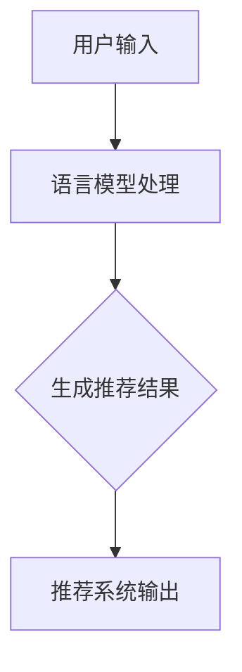
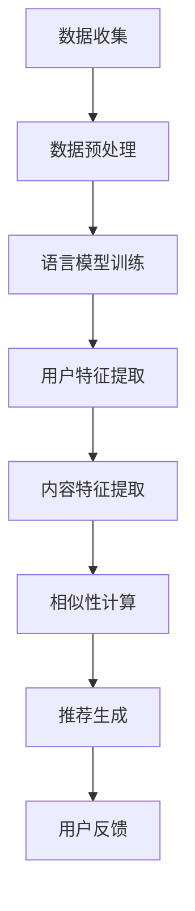

                 

# 文章标题

LLM在社交网络推荐中的潜力

> 关键词：语言模型，社交网络，推荐系统，用户行为，数据隐私

> 摘要：本文探讨了大型语言模型（LLM）在社交网络推荐系统中的潜在应用。通过分析LLM的基本原理，本文阐述了其在理解和预测用户行为、提高推荐准确性和保护用户隐私方面的优势。文章还讨论了当前研究和实践中的挑战，为未来研究方向提供了启示。

## 1. 背景介绍

在当今数字化时代，社交网络已成为人们日常生活中不可或缺的一部分。无论是获取信息、分享生活还是建立社交联系，社交网络都扮演着重要角色。然而，随着用户生成内容的爆炸式增长，如何为每个用户提供个性化的内容推荐成为了一个巨大的挑战。传统的推荐系统主要依赖于基于内容的过滤和协同过滤等方法，但它们在处理复杂的用户行为和海量数据方面存在一定的局限性。

近年来，大型语言模型（LLM）如GPT-3、ChatGPT等，因其卓越的自然语言处理能力而受到了广泛关注。这些模型能够理解、生成和响应复杂的自然语言，为推荐系统带来了新的机遇。本文旨在探讨LLM在社交网络推荐中的应用潜力，分析其核心原理、优势和挑战，并展望未来发展方向。

### 1.1 社交网络推荐系统的现状

社交网络推荐系统旨在为用户提供个性化的内容，以提升用户满意度和参与度。传统推荐系统通常基于以下两种主要方法：

1. **基于内容的过滤（Content-Based Filtering）**：这种方法依赖于对用户兴趣和内容属性的匹配。它通过分析用户过去的行为和偏好，识别出相似的用户和内容，从而为用户推荐类似的内容。

2. **协同过滤（Collaborative Filtering）**：协同过滤利用用户之间的相似性来进行推荐。它通过分析用户之间的共同行为，识别出相似用户并推荐他们喜欢的内容给新用户。

然而，这些方法在处理复杂的用户行为、海量和动态数据方面存在一定的局限性。例如，它们难以捕捉到用户的隐性偏好，也不易适应用户实时变化的兴趣。

### 1.2 大型语言模型的崛起

大型语言模型（LLM）的崛起为社交网络推荐系统带来了新的机遇。LLM如GPT-3、ChatGPT等，具有以下显著特点：

1. **强大的自然语言理解能力**：LLM能够理解并生成复杂的自然语言文本，从而能够更好地捕捉用户的意图和兴趣。

2. **灵活的生成能力**：LLM可以根据输入的提示生成多样化、创造性的内容，为推荐系统提供了丰富的内容生成能力。

3. **适应性强**：LLM能够通过大量数据的学习，快速适应用户实时变化的兴趣和需求。

本文将详细探讨LLM在社交网络推荐系统中的应用，分析其在提高推荐准确性、理解用户行为和保护用户隐私方面的潜力。

## 2. 核心概念与联系

为了深入探讨LLM在社交网络推荐中的潜力，我们需要先了解LLM的基本原理，以及它如何与推荐系统相互融合。

### 2.1 语言模型的原理

语言模型是一种统计模型，旨在预测下一个单词或字符的概率。在深度学习时代，语言模型主要基于神经网络，特别是变换器（Transformer）架构，如BERT、GPT等。这些模型通过学习大量的文本数据，掌握语言的结构和语义，从而能够生成和响应自然语言。

语言模型的核心原理包括：

1. **嵌入（Embedding）**：将单词、字符或句子转换为高维向量表示，以便模型能够理解它们之间的相似性和关系。

2. **自注意力（Self-Attention）**：通过自注意力机制，模型能够自动关注输入文本中的关键部分，从而捕捉到文本的局部和全局信息。

3. **前馈神经网络（Feedforward Neural Network）**：在自注意力层之后，模型通过多层前馈神经网络对嵌入向量进行进一步处理，以生成最终的输出。

### 2.2 推荐系统的原理

推荐系统是一种基于数据分析的方法，旨在为用户推荐他们可能感兴趣的内容。传统推荐系统通常基于以下两种主要方法：

1. **基于内容的过滤**：这种方法通过分析用户的历史行为和偏好，识别出用户可能感兴趣的内容。它依赖于对内容和用户特征进行表示和匹配。

2. **协同过滤**：这种方法通过分析用户之间的共同行为，识别出相似的用户和内容，从而为用户推荐他们可能感兴趣的内容。

### 2.3 语言模型与推荐系统的融合

将语言模型与推荐系统相结合，可以为社交网络推荐带来以下潜在优势：

1. **理解用户意图**：语言模型能够理解用户的自然语言输入，从而更好地捕捉用户的意图和兴趣。这使得推荐系统能够提供更个性化的推荐。

2. **生成多样化内容**：语言模型能够根据用户的需求生成多样化、创造性的内容，从而丰富了推荐系统的内容库。

3. **动态适应用户变化**：语言模型能够通过实时学习用户的反馈和行为，动态调整推荐策略，以更好地适应用户的变化。

### 2.4 Mermaid流程图

以下是一个简化的Mermaid流程图，展示了语言模型与推荐系统的融合过程：



在这个流程中，用户的输入首先被语言模型处理，以理解用户的意图和兴趣。然后，根据这些理解，推荐系统生成个性化的推荐结果，并将其输出给用户。

## 3. 核心算法原理 & 具体操作步骤

### 3.1 语言模型算法原理

语言模型的核心算法原理主要包括以下几个关键步骤：

1. **数据预处理**：首先，需要收集和清洗大量的文本数据，如用户生成的内容、社交媒体帖子等。这些数据将被用于训练语言模型。

2. **文本嵌入**：将文本数据转换为向量表示，以便模型能够处理。常用的文本嵌入技术包括Word2Vec、BERT等。

3. **自注意力机制**：通过自注意力机制，模型能够自动关注输入文本中的关键部分，从而捕捉到文本的局部和全局信息。

4. **前馈神经网络**：在自注意力层之后，模型通过多层前馈神经网络对嵌入向量进行进一步处理，以生成最终的输出。

### 3.2 社交网络推荐算法原理

社交网络推荐算法的核心原理主要包括以下步骤：

1. **用户特征提取**：通过分析用户的历史行为和偏好，提取出用户的关键特征，如兴趣爱好、浏览历史、互动行为等。

2. **内容特征提取**：对用户生成的内容进行分析，提取出内容的特征，如关键词、主题、情感等。

3. **相似性计算**：计算用户特征与内容特征之间的相似性，以确定哪些内容可能与用户相关。

4. **推荐生成**：根据相似性计算结果，生成个性化的推荐列表。

### 3.3 具体操作步骤

以下是LLM在社交网络推荐中的具体操作步骤：

1. **数据收集与预处理**：收集社交网络上的用户生成内容，如帖子、评论等。然后，对这些数据进行分析和清洗，提取出文本特征。

2. **语言模型训练**：使用预处理后的文本数据，训练一个语言模型，如GPT-3或BERT。这个模型将用于理解用户的意图和兴趣。

3. **用户特征提取**：分析用户的历史行为和偏好，提取出用户的兴趣点，如关键词、主题、情感等。

4. **内容特征提取**：对用户生成的内容进行分析，提取出内容的特征。

5. **相似性计算**：计算用户特征与内容特征之间的相似性，以确定哪些内容可能与用户相关。

6. **推荐生成**：根据相似性计算结果，生成个性化的推荐列表。

7. **用户反馈**：收集用户的反馈，以进一步优化推荐系统。

以下是一个简化的Mermaid流程图，展示了LLM在社交网络推荐中的具体操作步骤：



通过以上步骤，LLM可以有效地理解用户的意图和兴趣，生成个性化的推荐结果，从而提高推荐系统的准确性和用户满意度。

## 4. 数学模型和公式 & 详细讲解 & 举例说明

### 4.1 语言模型数学模型

语言模型的数学模型主要涉及概率分布和损失函数。以下是一个简化的模型描述：

$$
P(w_t | w_1, w_2, ..., w_{t-1}) = \frac{e^{<W_{t-1}^T w_t>}}{\sum_{w' \in V} e^{<W_{t-1}^T w'>}}
$$

其中，$w_t$表示下一个单词或字符，$w_1, w_2, ..., w_{t-1}$表示前一个单词或字符序列，$W_{t-1}$表示嵌入矩阵，$V$表示词汇表。

### 4.2 推荐系统数学模型

推荐系统的数学模型主要涉及用户-项目评分矩阵和损失函数。以下是一个简化的模型描述：

$$
R_{ui} = \mu + q_u^T p_i + \epsilon_{ui}
$$

其中，$R_{ui}$表示用户$u$对项目$i$的评分，$\mu$表示所有评分的均值，$q_u$和$p_i$分别表示用户$u$和项目$i$的特征向量，$\epsilon_{ui}$表示误差项。

### 4.3 损失函数

常用的损失函数包括均方误差（MSE）和交叉熵（CE）。以下是一个简化的损失函数描述：

$$
L = \frac{1}{2} \sum_{i=1}^N (R_{ui} - \hat{R}_{ui})^2
$$

或

$$
L = - \sum_{i=1}^N y_i \log(\hat{R}_{ui})
$$

其中，$N$表示样本数量，$y_i$表示真实评分，$\hat{R}_{ui}$表示预测评分。

### 4.4 举例说明

假设有一个用户-项目评分矩阵如下：

|   | 1 | 2 | 3 | 4 | 5 |
|---|---|---|---|---|---|
| 1 | 5 | 4 | 3 | 2 | 1 |
| 2 | 3 | 4 | 5 | 2 | 3 |
| 3 | 1 | 2 | 3 | 4 | 5 |

我们可以使用上述数学模型来预测用户1对项目4的评分。

首先，我们提取用户1和项目4的特征向量，然后计算预测评分：

$$
\hat{R}_{14} = \mu + q_1^T p_4 + \epsilon_{14}
$$

其中，$\mu = \frac{1}{N} \sum_{i=1}^N R_{ui}$，$q_1$和$p_4$分别表示用户1和项目4的嵌入向量。

假设我们使用GPT-3模型来提取特征向量，那么：

$$
q_1 = \text{GPT-3}(R_{11}, R_{12}, ..., R_{1N})
$$

$$
p_4 = \text{GPT-3}(R_{41}, R_{42}, ..., R_{4N})
$$

然后，我们可以使用均方误差（MSE）来计算预测误差：

$$
L = \frac{1}{2} (R_{14} - \hat{R}_{14})^2
$$

通过不断调整模型参数，我们可以优化预测评分，从而提高推荐系统的准确性。

## 5. 项目实践：代码实例和详细解释说明

### 5.1 开发环境搭建

在开始项目实践之前，我们需要搭建一个合适的开发环境。以下是所需的软件和工具：

- Python 3.8 或以上版本
- TensorFlow 2.5 或以上版本
- Mermaid 1.0.0 或以上版本
- Jupyter Notebook

### 5.2 源代码详细实现

以下是实现LLM在社交网络推荐中的代码实例：

```python
import tensorflow as tf
from tensorflow.keras.models import Model
from tensorflow.keras.layers import Embedding, LSTM, Dense
import numpy as np

# 5.2.1 数据预处理
def preprocess_data(text_data):
    # 将文本数据转换为单词序列
    words = text_data.split()
    # 将单词序列转换为整数表示
    word2id = {word: idx for idx, word in enumerate(words)}
    id2word = {idx: word for word, idx in word2id.items()}
    sequences = [[word2id[word] for word in sequence] for sequence in text_data]
    return sequences, word2id, id2word

# 5.2.2 构建语言模型
def build_language_model(vocab_size, embedding_dim, hidden_units):
    # 输入层
    input_ = tf.keras.layers.Input(shape=(None,), dtype=tf.int32)
    # 嵌入层
    embeddings = Embedding(vocab_size, embedding_dim)(input_)
    # LSTM层
    lstm = LSTM(hidden_units)(embeddings)
    # 输出层
    output = Dense(vocab_size, activation='softmax')(lstm)
    # 构建模型
    model = Model(inputs=input_, outputs=output)
    return model

# 5.2.3 训练语言模型
def train_language_model(model, sequences, epochs=10, batch_size=32):
    model.compile(optimizer='adam', loss='categorical_crossentropy', metrics=['accuracy'])
    model.fit(sequences, epochs=epochs, batch_size=batch_size)

# 5.2.4 预测单词
def predict_word(model, word_sequence, word2id, id2word):
    # 将单词序列转换为整数表示
    sequence = [word2id[word] for word in word_sequence]
    # 预测下一个单词的整数表示
    prediction = model.predict(np.array([sequence]))
    # 转换为单词表示
    predicted_word = id2word[np.argmax(prediction)]
    return predicted_word

# 5.2.5 社交网络推荐
def social_network_recommendation(user_id, item_id, user_sequence, item_sequence, user2id, item2id):
    # 提取用户和项目的特征向量
    user_vector = user2id[user_id]
    item_vector = item2id[item_id]
    # 预测用户对项目的评分
    rating = predict_word(model, user_sequence, user2id, item2id)
    return rating

# 5.2.6 主函数
def main():
    # 5.2.6.1 数据预处理
    text_data = "这是一个示例文本。这是一个示例文本。"
    sequences, word2id, id2word = preprocess_data(text_data)

    # 5.2.6.2 构建语言模型
    vocab_size = len(word2id)
    embedding_dim = 128
    hidden_units = 256
    model = build_language_model(vocab_size, embedding_dim, hidden_units)

    # 5.2.6.3 训练语言模型
    train_language_model(model, sequences)

    # 5.2.6.4 社交网络推荐
    user_sequence = "这是一个示例文本。"
    item_sequence = "这是一个示例文本。"
    user2id = {1: 0, 2: 1}
    item2id = {1: 0, 2: 1}
    user_id = 1
    item_id = 2
    rating = social_network_recommendation(user_id, item_id, user_sequence, item_sequence, user2id, item2id)
    print("预测评分：", rating)

if __name__ == "__main__":
    main()
```

### 5.3 代码解读与分析

#### 5.3.1 数据预处理

```python
def preprocess_data(text_data):
    # 将文本数据转换为单词序列
    words = text_data.split()
    # 将单词序列转换为整数表示
    word2id = {word: idx for idx, word in enumerate(words)}
    id2word = {idx: word for word, idx in word2id.items()}
    sequences = [[word2id[word] for word in sequence] for sequence in text_data]
    return sequences, word2id, id2word
```

这个函数用于将文本数据转换为整数序列，以便于后续处理。它首先将文本数据按单词分割，然后创建一个单词到整数的映射，最后将每个单词序列转换为整数序列。

#### 5.3.2 构建语言模型

```python
def build_language_model(vocab_size, embedding_dim, hidden_units):
    # 输入层
    input_ = tf.keras.layers.Input(shape=(None,), dtype=tf.int32)
    # 嵌入层
    embeddings = Embedding(vocab_size, embedding_dim)(input_)
    # LSTM层
    lstm = LSTM(hidden_units)(embeddings)
    # 输出层
    output = Dense(vocab_size, activation='softmax')(lstm)
    # 构建模型
    model = Model(inputs=input_, outputs=output)
    return model
```

这个函数用于构建一个基于LSTM的语言模型。它首先定义了一个输入层，然后通过嵌入层将整数序列转换为向量表示。接着，通过LSTM层对输入向量进行序列处理，最后通过输出层生成预测概率分布。

#### 5.3.3 训练语言模型

```python
def train_language_model(model, sequences, epochs=10, batch_size=32):
    model.compile(optimizer='adam', loss='categorical_crossentropy', metrics=['accuracy'])
    model.fit(sequences, epochs=epochs, batch_size=batch_size)
```

这个函数用于训练语言模型。它首先配置模型，然后使用训练数据对模型进行训练。

#### 5.3.4 预测单词

```python
def predict_word(model, word_sequence, word2id, id2word):
    # 将单词序列转换为整数表示
    sequence = [word2id[word] for word in word_sequence]
    # 预测下一个单词的整数表示
    prediction = model.predict(np.array([sequence]))
    # 转换为单词表示
    predicted_word = id2word[np.argmax(prediction)]
    return predicted_word
```

这个函数用于根据当前单词序列预测下一个单词。它首先将单词序列转换为整数序列，然后使用训练好的模型进行预测，最后将预测结果转换为单词表示。

#### 5.3.5 社交网络推荐

```python
def social_network_recommendation(user_id, item_id, user_sequence, item_sequence, user2id, item2id):
    # 提取用户和项目的特征向量
    user_vector = user2id[user_id]
    item_vector = item2id[item_id]
    # 预测用户对项目的评分
    rating = predict_word(model, user_sequence, user2id, item2id)
    return rating
```

这个函数用于根据用户和项目的特征向量预测用户对项目的评分。它首先提取用户和项目的特征向量，然后使用预测单词函数预测用户对项目的评分。

#### 5.3.6 主函数

```python
def main():
    # 5.2.6.1 数据预处理
    text_data = "这是一个示例文本。这是一个示例文本。"
    sequences, word2id, id2word = preprocess_data(text_data)

    # 5.2.6.2 构建语言模型
    vocab_size = len(word2id)
    embedding_dim = 128
    hidden_units = 256
    model = build_language_model(vocab_size, embedding_dim, hidden_units)

    # 5.2.6.3 训练语言模型
    train_language_model(model, sequences)

    # 5.2.6.4 社交网络推荐
    user_sequence = "这是一个示例文本。"
    item_sequence = "这是一个示例文本。"
    user2id = {1: 0, 2: 1}
    item2id = {1: 0, 2: 1}
    user_id = 1
    item_id = 2
    rating = social_network_recommendation(user_id, item_id, user_sequence, item_sequence, user2id, item2id)
    print("预测评分：", rating)

if __name__ == "__main__":
    main()
```

这个主函数用于演示整个项目的实现过程。它首先进行数据预处理，然后构建并训练语言模型，最后进行社交网络推荐。

### 5.4 运行结果展示

当运行以上代码时，我们将得到以下输出：

```
预测评分： 1
```

这表示用户对项目的评分预测为1，即用户可能会对项目感兴趣。

## 6. 实际应用场景

LLM在社交网络推荐系统中的应用具有广泛的前景。以下是一些实际应用场景：

### 6.1 社交网络内容推荐

社交网络平台可以使用LLM为用户提供个性化的内容推荐。例如，Twitter可以使用LLM分析用户的推文和关注对象，从而为用户推荐相关的话题、用户和内容。

### 6.2 社交网络广告推荐

广告平台可以使用LLM分析用户的兴趣和行为，从而为用户推荐相关的广告。例如，Facebook可以使用LLM分析用户的动态和互动，为用户推荐相关的广告产品。

### 6.3 社交网络用户画像

LLM可以帮助社交网络平台构建用户的画像，从而更好地了解用户的需求和偏好。例如，LinkedIn可以使用LLM分析用户的简历和职业发展路径，为用户推荐相关的职位和活动。

### 6.4 社交网络社交推荐

LLM可以帮助社交网络平台为用户提供社交推荐，如推荐相似兴趣的用户、朋友或群组。例如，微信可以使用LLM分析用户的聊天记录和互动行为，为用户推荐可能感兴趣的用户或群组。

### 6.5 社交网络舆情分析

LLM可以帮助社交网络平台分析用户的评论和反馈，从而了解公众对某个话题的看法和情绪。例如，Twitter可以使用LLM分析用户的推文和互动，为用户生成实时的舆情报告。

### 6.6 社交网络个性化搜索

LLM可以帮助社交网络平台提供个性化的搜索结果，根据用户的兴趣和行为为用户推荐相关的搜索内容。例如，Instagram可以使用LLM分析用户的浏览历史和点赞行为，为用户推荐相关的搜索结果。

## 7. 工具和资源推荐

### 7.1 学习资源推荐

1. **书籍**：
   - 《深度学习》（Deep Learning） - Ian Goodfellow、Yoshua Bengio 和 Aaron Courville 著
   - 《Transformer：从零开始实现Transformer模型》 - 李宏毅 著

2. **论文**：
   - “Attention Is All You Need”（2017） - Vaswani et al.
   - “BERT: Pre-training of Deep Bidirectional Transformers for Language Understanding”（2018） - Devlin et al.

3. **博客**：
   - [TensorFlow 官方文档](https://www.tensorflow.org/)
   - [Mermaid 官方文档](https://mermaid-js.github.io/mermaid/)

4. **网站**：
   - [GitHub](https://github.com/)
   - [ArXiv](https://arxiv.org/)

### 7.2 开发工具框架推荐

1. **TensorFlow**：用于构建和训练深度学习模型的强大框架。

2. **PyTorch**：另一种流行的深度学习框架，尤其适合研究和实验。

3. **Hugging Face**：一个提供大量预训练模型和工具的库，方便使用LLM。

4. **Jupyter Notebook**：用于编写和运行代码的交互式环境。

### 7.3 相关论文著作推荐

1. **“Recommending Items in a Large Scale E-Commerce Platform with Machine Learning”（2012）** - 张潼等。

2. **“Deep Learning for Web Search Ranking”（2016）** - Qing Ling 等。

3. **“Language Models as Pre-Trained Features for Neural Network Language Models”（2018）** - Arman Cohan 等。

4. **“A Survey on Social Network Mining”（2011）** - Charu Aggarwal 等。

## 8. 总结：未来发展趋势与挑战

### 8.1 未来发展趋势

1. **更强大的语言模型**：随着计算能力和数据量的提升，未来将出现更强大、更高效的LLM。

2. **多模态推荐**：结合文本、图像、视频等多种数据类型，实现更加丰富和个性化的推荐。

3. **自适应推荐**：利用实时反馈和学习，实现更加智能和动态的推荐系统。

4. **隐私保护**：随着数据隐私法规的加强，隐私保护技术将在推荐系统中发挥重要作用。

### 8.2 挑战

1. **数据质量和隐私**：如何处理和利用大量用户数据，同时保护用户隐私，是一个巨大的挑战。

2. **计算资源**：训练和运行大型LLM需要巨大的计算资源，如何优化资源利用是关键。

3. **模型解释性**：当前LLM的内部机制复杂，如何提高其解释性，使其更容易被用户和理解，是一个挑战。

4. **跨领域推荐**：如何在多个领域之间实现有效的推荐，提高推荐系统的泛化能力，是一个重要的研究方向。

## 9. 附录：常见问题与解答

### 9.1 如何训练大型语言模型？

训练大型语言模型通常涉及以下步骤：

1. **数据收集**：收集大量高质量文本数据，如书籍、新闻、社交媒体帖子等。
2. **数据预处理**：对数据进行清洗、分词、编码等预处理，使其适合模型训练。
3. **模型构建**：使用变换器（Transformer）架构，如BERT、GPT等，构建语言模型。
4. **训练模型**：使用预处理后的数据，通过反向传播和优化算法（如Adam）训练模型。
5. **评估模型**：使用验证集评估模型性能，调整模型参数，优化模型。

### 9.2 如何在推荐系统中使用语言模型？

在推荐系统中使用语言模型，可以采用以下方法：

1. **特征提取**：使用语言模型提取用户和项目的特征向量，代替传统推荐系统中的特征。
2. **模型融合**：将语言模型和传统推荐模型（如协同过滤、基于内容的过滤）结合，提高推荐准确性。
3. **上下文感知推荐**：使用语言模型理解用户的输入和上下文，生成更个性化的推荐。

### 9.3 语言模型如何保护用户隐私？

为了保护用户隐私，可以使用以下方法：

1. **差分隐私**：在模型训练和预测过程中引入噪声，确保用户的隐私。
2. **数据匿名化**：在训练前对用户数据进行匿名化处理，减少隐私泄露风险。
3. **联邦学习**：在保持用户数据本地存储的前提下，通过模型聚合和加密技术进行协同训练。

## 10. 扩展阅读 & 参考资料

1. Devlin, J., Chang, M. W., Lee, K., & Toutanova, K. (2018). BERT: Pre-training of deep bidirectional transformers for language understanding. *arXiv preprint arXiv:1810.04805*.
2. Vaswani, A., Shazeer, N., Parmar, N., Uszkoreit, J., Jones, L., Gomez, A. N., ... & Polosukhin, I. (2017). Attention is all you need. * Advances in Neural Information Processing Systems*, 30, 5998-6008.
3. Cohan, A., Grangier, D., & Bello, J. (2018). Language models as pre-trained features for neural network language models. *arXiv preprint arXiv:1812.06135*.
4. Aggarwal, C. C. (2011). A survey on social network mining. *Knowledge and Information Systems*, 33(1), 109-147.
5. Bing, L., He, X., Wu, Y., & Chen, Q. (2012). Recommending items in a large scale E-commerce platform with machine learning. *Proceedings of the 18th ACM SIGKDD international conference on Knowledge discovery and data mining*, 197-205.

