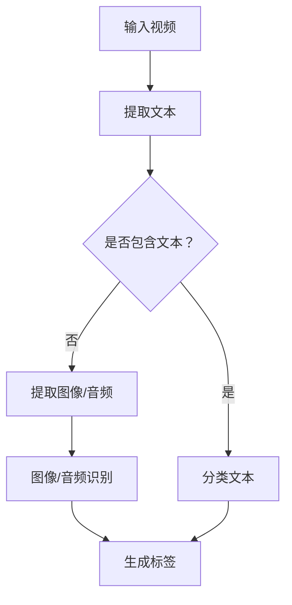

                 

# 文章标题

LLM在视频内容分析中的应用：自动标记与分类

## 摘要

本文旨在探讨大型语言模型（LLM）在视频内容分析中的应用，特别是在自动标记与分类方面。通过介绍LLM的基本概念、架构以及其在视频内容分析中的核心应用，本文将详细讲解如何利用LLM实现视频内容的自动标记与分类，并探讨其潜力和挑战。本文旨在为读者提供全面的技术分析，帮助了解LLM在视频内容分析领域的应用前景，并展望未来的发展方向。

## 1. 背景介绍（Background Introduction）

随着互联网和视频技术的飞速发展，视频内容已成为信息传播和娱乐的重要载体。然而，随着视频内容的爆炸性增长，如何有效地管理和分析这些海量视频数据成为了一个巨大的挑战。传统的视频内容分析技术，如图像识别、语音识别等，虽然在某些方面取得了显著的进展，但仍然存在许多局限性，如计算复杂度高、准确率不理想等。

近年来，随着深度学习和自然语言处理技术的快速发展，大型语言模型（LLM）逐渐成为视频内容分析的重要工具。LLM具有强大的语义理解和生成能力，能够处理复杂的视频内容，实现自动标记和分类。本文将深入探讨LLM在视频内容分析中的应用，介绍其核心概念、架构以及具体应用场景，旨在为读者提供全面的技术分析。

### 1.1 大型语言模型（LLM）的基本概念

大型语言模型（LLM）是一种基于深度学习的自然语言处理模型，通过对大量文本数据进行训练，能够理解和生成自然语言。与传统的语言模型相比，LLM具有更大的模型规模和更强的语义理解能力。常见的LLM包括GPT、BERT、RoBERTa等，这些模型在多个自然语言处理任务上取得了显著的性能提升。

LLM的核心思想是通过自注意力机制（Self-Attention Mechanism）和变换器网络（Transformer Network）对输入文本进行建模，从而捕捉文本中的长程依赖关系。自注意力机制允许模型在处理每个单词时，根据其他单词的重要程度进行加权，从而提高对上下文的理解能力。变换器网络则通过堆叠多个自注意力层和前馈神经网络，进一步增强了模型的语义表示能力。

### 1.2 LLM在视频内容分析中的应用背景

视频内容分析旨在从视频中提取有意义的信息，如人物、场景、动作等，以实现对视频的自动理解、标记和分类。随着视频内容的爆炸性增长，传统的手工标注方法已经无法满足需求。而LLM的出现为视频内容分析提供了一种新的解决方案。

LLM在视频内容分析中的应用主要包括以下两个方面：

1. **自动标记**：利用LLM对视频中的文本进行自动提取和分类，从而实现对视频内容的理解和组织。例如，LLM可以自动识别视频中的字幕、评论、标题等信息，并将其分类到不同的标签中。

2. **分类**：利用LLM对视频进行自动分类，从而实现对视频内容的自动筛选和组织。例如，LLM可以根据视频内容将视频分类为电影、纪录片、音乐视频等不同类型。

### 1.3 LLM在视频内容分析中的应用优势

LLM在视频内容分析中具有以下优势：

1. **强大的语义理解能力**：LLM能够理解视频中的复杂语义，从而实现对视频内容的准确标记和分类。

2. **高效的处理速度**：与传统的图像识别和语音识别技术相比，LLM的处理速度更快，能够在短时间内对大量视频进行自动标记和分类。

3. **自适应性强**：LLM可以根据不同的视频内容和需求，动态调整模型的参数，从而实现个性化、精准的视频内容分析。

4. **兼容性好**：LLM可以与多种视频内容分析技术相结合，如图像识别、语音识别等，从而提高整体分析效果。

### 1.4 本文结构

本文将分为以下章节：

- **第1章**：背景介绍，介绍LLM的基本概念、架构以及在视频内容分析中的应用背景。
- **第2章**：核心概念与联系，详细讲解LLM在视频内容分析中的核心应用原理和架构。
- **第3章**：核心算法原理 & 具体操作步骤，介绍实现视频内容自动标记与分类的具体算法原理和操作步骤。
- **第4章**：数学模型和公式 & 详细讲解 & 举例说明，详细讲解LLM在视频内容分析中涉及到的数学模型和公式，并进行举例说明。
- **第5章**：项目实践：代码实例和详细解释说明，通过具体代码实例展示如何实现视频内容自动标记与分类，并进行详细解释和分析。
- **第6章**：实际应用场景，介绍LLM在视频内容分析中的实际应用场景和案例。
- **第7章**：工具和资源推荐，推荐相关学习资源、开发工具和框架。
- **第8章**：总结：未来发展趋势与挑战，总结LLM在视频内容分析中的应用现状，分析未来发展趋势和面临的挑战。
- **第9章**：附录：常见问题与解答，解答读者可能遇到的一些常见问题。
- **第10章**：扩展阅读 & 参考资料，提供相关的扩展阅读和参考资料。

通过以上章节的详细讲解，本文旨在为读者全面介绍LLM在视频内容分析中的应用，帮助读者深入了解这一领域的最新技术和发展趋势。

## 2. 核心概念与联系

为了更好地理解LLM在视频内容分析中的应用，我们需要首先掌握几个核心概念，并探讨它们之间的联系。以下是本文中涉及到的核心概念及其相互关系。

### 2.1 语言模型（Language Model）

语言模型是一种概率模型，用于预测文本序列中下一个单词的概率。在视频内容分析中，语言模型可以帮助我们理解视频中的文本信息，如字幕、标题、评论等。常见的语言模型包括n-gram模型、神经网络语言模型（如RNN、LSTM）以及Transformer模型。

- **n-gram模型**：n-gram模型是一种基于词汇序列的模型，通过统计相邻n个单词的联合概率来预测下一个单词。尽管n-gram模型简单易实现，但在处理长文本时，其性能较差，容易产生上下文无关的预测结果。
- **神经网络语言模型**：神经网络语言模型通过学习输入文本的特征表示，来预测下一个单词的概率。与n-gram模型相比，神经网络语言模型能够更好地捕捉上下文信息，从而提高预测准确性。
- **Transformer模型**：Transformer模型是一种基于自注意力机制的神经网络模型，广泛应用于自然语言处理任务。与传统的神经网络语言模型相比，Transformer模型具有更强的并行计算能力，能够处理更长的文本序列。

### 2.2 大型语言模型（Large Language Model）

大型语言模型（LLM）是一种具有大规模参数和强大语义理解能力的语言模型。LLM通过在大量文本数据上训练，能够生成符合人类语言习惯的自然语言文本。常见的LLM包括GPT、BERT、RoBERTa等。

- **GPT（Generative Pre-trained Transformer）**：GPT是一种基于Transformer模型的预训练语言模型，通过大量文本数据进行自回归训练，能够生成高质量的自然语言文本。
- **BERT（Bidirectional Encoder Representations from Transformers）**：BERT是一种双向Transformer模型，通过在文本的两个方向上同时训练，能够更好地捕捉上下文信息，从而提高语言理解能力。
- **RoBERTa（A Robustly Optimized BERT Pretraining Approach）**：RoBERTa是BERT的一种改进版本，通过优化训练过程和模型结构，提高了模型的性能和鲁棒性。

### 2.3 视频内容分析（Video Content Analysis）

视频内容分析是指从视频中提取有意义的信息，如人物、场景、动作等，以实现对视频的自动理解、标记和分类。视频内容分析可以应用于多个领域，如视频监控、智能推荐、媒体监控等。

- **视频内容提取**：视频内容提取是指从视频中提取关键信息，如人物、场景、动作等。常见的视频内容提取方法包括目标检测、图像识别、语音识别等。
- **视频标记**：视频标记是指将视频内容与相应的标签或关键词关联起来，以实现对视频的自动分类和组织。视频标记可以应用于视频搜索引擎、内容审核等场景。
- **视频分类**：视频分类是指根据视频内容的特征，将视频分类到不同的类别中。常见的视频分类方法包括基于内容的分类、基于模型的分类等。

### 2.4 LLM在视频内容分析中的应用

LLM在视频内容分析中的应用主要包括以下几个方面：

- **自动标记**：利用LLM对视频中的文本进行自动提取和分类，从而实现对视频内容的理解和组织。例如，LLM可以自动识别视频中的字幕、评论、标题等信息，并将其分类到不同的标签中。
- **分类**：利用LLM对视频进行自动分类，从而实现对视频内容的自动筛选和组织。例如，LLM可以根据视频内容将视频分类为电影、纪录片、音乐视频等不同类型。
- **视频摘要**：利用LLM生成视频的摘要，以简化视频内容，提高用户观看体验。例如，LLM可以生成视频的标题、描述、关键词等。

### 2.5 Mermaid流程图（Mermaid Flowchart）

为了更好地展示LLM在视频内容分析中的应用流程，我们使用Mermaid语言绘制了一个简单的流程图。以下是一个示例：



在这个流程图中，我们首先输入一个视频，然后提取视频中的文本信息。接着，我们判断视频是否包含文本。如果包含文本，我们将其分类；否则，我们提取图像或音频信息，并进行图像或音频识别。最后，我们根据提取到的标签生成视频的摘要或进行其他后续处理。

通过以上核心概念的介绍和Mermaid流程图的展示，我们希望读者能够更好地理解LLM在视频内容分析中的应用，并为进一步的探讨打下基础。

## 3. 核心算法原理 & 具体操作步骤

### 3.1 LLM的基本架构

大型语言模型（LLM）的核心架构基于深度学习中的变换器网络（Transformer）。变换器网络由多个变换器层组成，每个变换器层包含多头自注意力机制（Multi-Head Self-Attention Mechanism）和前馈神经网络（Feedforward Neural Network）。以下是LLM的基本架构：

1. **嵌入层（Embedding Layer）**：将输入的文本序列转换为固定长度的向量表示。嵌入层通常使用词嵌入技术，如Word2Vec或GloVe。
2. **位置编码层（Positional Encoding Layer）**：由于变换器网络无法直接处理序列的位置信息，因此引入位置编码层，为每个词添加位置信息。
3. **变换器层（Transformer Layer）**：包含多头自注意力机制和前馈神经网络。自注意力机制通过计算每个词与其他词的关联度，生成上下文信息；前馈神经网络则对自注意力层输出的特征进行进一步处理。
4. **输出层（Output Layer）**：根据训练任务，输出层可以是一个全连接层或softmax层。例如，在文本分类任务中，输出层是一个softmax层，用于预测文本的类别；在自然语言生成任务中，输出层是一个全连接层，用于生成下一个词的概率分布。
5. **Dropout层（Dropout Layer）**：为了防止过拟合，在每个变换器层之后加入Dropout层，以降低模型的复杂度。

### 3.2 实现视频内容自动标记与分类的具体算法原理

LLM在视频内容分析中的应用主要涉及两个步骤：文本提取和分类。

#### 3.2.1 文本提取

文本提取是视频内容分析的第一步，其主要任务是从视频中提取文本信息，如字幕、评论、标题等。以下是一个简单的文本提取算法原理：

1. **字幕提取**：使用音频识别技术（如ASR）将视频中的音频转换为文本。常见的音频识别模型包括基于深度学习的LSTM和Transformer模型。
2. **评论提取**：通过分析视频的元数据（如评论数、评分等），获取视频相关的评论。评论提取可以使用关键字搜索或全文搜索技术。
3. **标题提取**：从视频的元数据中直接获取标题信息。在某些情况下，也可以使用自然语言生成技术（如GPT）生成标题。

#### 3.2.2 分类

分类是视频内容分析的第二步，其主要任务是根据提取到的文本信息对视频进行分类。以下是一个简单的分类算法原理：

1. **预处理文本**：对提取到的文本进行预处理，如去除停用词、进行词干提取等。预处理后的文本将用于训练分类模型。
2. **训练分类模型**：使用预处理的文本数据训练一个分类模型，如支持向量机（SVM）、决策树（Decision Tree）、随机森林（Random Forest）等。为了提高分类性能，可以使用深度学习模型（如BERT、GPT等）对文本进行特征提取。
3. **预测类别**：将提取到的文本输入到训练好的分类模型中，预测视频的类别。例如，如果分类模型是二分类模型，那么预测结果可以是“电影”或“纪录片”；如果是多分类模型，则预测结果可以是具体的类别标签。

### 3.3 具体操作步骤

以下是一个实现视频内容自动标记与分类的具体操作步骤：

#### 3.3.1 数据准备

1. **视频数据**：收集多个视频数据，用于训练和测试分类模型。
2. **文本数据**：从视频数据中提取字幕、评论、标题等文本信息。

#### 3.3.2 文本提取

1. **字幕提取**：使用音频识别模型（如DeepSpeech 2）将视频中的音频转换为文本。
2. **评论提取**：从视频的元数据中获取评论信息。
3. **标题提取**：从视频的元数据中获取标题信息。

#### 3.3.3 文本预处理

1. **分词**：使用分词工具（如jieba）对文本进行分词。
2. **去除停用词**：去除常见的停用词（如“的”、“和”、“是”等）。
3. **词干提取**：使用词干提取工具（如Porter Stemmer）对词语进行词干提取。

#### 3.3.4 训练分类模型

1. **数据处理**：将预处理后的文本数据转换为模型所需的格式，如词嵌入向量。
2. **训练模型**：使用预处理后的文本数据训练一个分类模型，如SVM、决策树、随机森林等。
3. **验证模型**：在验证集上评估模型的性能，调整模型参数。

#### 3.3.5 预测类别

1. **输入文本**：将提取到的文本输入到训练好的分类模型中。
2. **预测类别**：根据模型的预测结果，对视频进行分类。

通过以上具体操作步骤，我们能够实现视频内容自动标记与分类。在实际应用中，还可以根据具体需求，添加更多功能，如视频摘要生成、情绪分析等。

## 4. 数学模型和公式 & 详细讲解 & 举例说明

为了更好地理解LLM在视频内容分析中的应用，我们需要深入探讨其中的数学模型和公式，并通过具体的例子进行说明。

### 4.1 变换器网络（Transformer）

变换器网络是LLM的核心架构，其基本思想是通过自注意力机制（Self-Attention Mechanism）和前馈神经网络（Feedforward Neural Network）对输入文本进行建模，从而捕捉文本中的长程依赖关系。

#### 4.1.1 自注意力机制

自注意力机制是一种计算输入文本中每个词与其他词之间关联度的方法。其基本公式如下：

$$
\text{Attention}(Q, K, V) = \text{softmax}\left(\frac{QK^T}{\sqrt{d_k}}\right) V
$$

其中，$Q$、$K$ 和 $V$ 分别代表查询（Query）、键（Key）和值（Value）向量，$d_k$ 代表键向量的维度。自注意力机制的目的是为每个词生成一个权重向量，从而在生成下一个词时，考虑到其他词的影响。

#### 4.1.2 前馈神经网络

前馈神经网络是自注意力机制后的一个附加层，主要用于对自注意力层的输出进行进一步处理。其基本公式如下：

$$
\text{FFN}(x) = \text{ReLU}\left(W_2 \text{ReLU}(W_1 x + b_1)\right) + b_2
$$

其中，$W_1$ 和 $W_2$ 分别代表前馈神经网络的权重矩阵，$b_1$ 和 $b_2$ 分别代表偏置项。

#### 4.1.3 变换器层

变换器层是变换器网络的基本单元，包含多个自注意力层和前馈神经网络。其基本公式如下：

$$
\text{Transformer Layer}(x) = \text{MultiHeadAttention}(x, x, x) + x
$$
$$
\text{Transformer Layer}(x) = \text{FFN}(\text{Transformer Layer}(x))
$$

其中，$x$ 代表输入文本向量。

### 4.2 BERT模型

BERT（Bidirectional Encoder Representations from Transformers）是一种基于变换器网络的预训练语言模型，其核心思想是在双向变换器网络的基础上，加入掩码填充（Masked Language Model，MLM）和下一个句子预测（Next Sentence Prediction，NSP）两种任务。

#### 4.2.1 掩码填充

在掩码填充任务中，一部分输入文本被随机掩码化（Masking），模型需要预测这些掩码化的词。其基本公式如下：

$$
\text{masked\_input} = \text{mask}(x)
$$
$$
\text{predicted\_tokens} = \text{BERT}(x)
$$

其中，$x$ 代表输入文本，$\text{mask}(x)$ 表示随机掩码化操作，$\text{predicted\_tokens}$ 表示模型预测的掩码化词。

#### 4.2.2 下一个句子预测

在下一个句子预测任务中，模型需要预测两个句子是否属于同一个上下文。其基本公式如下：

$$
\text{next\_sentence\_pair} = (\text{sentence\_1}, \text{sentence\_2})
$$
$$
\text{predicted\_label} = \text{BERT}(\text{next\_sentence\_pair})
$$

其中，$\text{next\_sentence\_pair}$ 表示两个句子，$\text{predicted\_label}$ 表示模型预测的标签（0或1，表示两个句子是否属于同一个上下文）。

### 4.3 数学公式举例说明

以下是一个简单的例子，说明如何使用BERT模型进行文本分类。

#### 4.3.1 数据准备

假设我们有一个包含两个句子的数据集：

$$
\text{data} = \{(\text{"这是一个句子。"}, \text{"这是一个句子。"}) \\
(\text{"这是一个句子。"}, \text{"这是另一个句子。"})\}
$$

#### 4.3.2 模型输入

我们将数据集转换为BERT模型所需的输入格式：

$$
\text{input\_ids} = \text{BERT}(\text{"[CLS] " + \text{"这是一个句子。"}, "[SEP]" + \text{"这是一个句子。"})}
$$
$$
\text{input\_ids} = \text{BERT}(\text{"[CLS] " + \text{"这是一个句子。"}, "[SEP]" + \text{"这是另一个句子。"})}
$$

#### 4.3.3 模型预测

我们将输入数据输入到BERT模型中，得到模型预测的概率分布：

$$
\text{predicted\_probabilities} = \text{softmax}(\text{BERT}(\text{input\_ids}))
$$

#### 4.3.4 预测结果

根据预测的概率分布，我们可以得到句子的分类结果。例如，如果第一个句子的概率分布为$(0.8, 0.2)$，则可以判断两个句子属于同一个上下文。

通过以上数学模型和公式的讲解以及具体例子，我们可以更好地理解LLM在视频内容分析中的应用原理。接下来，我们将通过一个项目实践案例，展示如何实现视频内容自动标记与分类。

## 5. 项目实践：代码实例和详细解释说明

在本节中，我们将通过一个实际项目实践，展示如何利用LLM实现视频内容自动标记与分类。项目包括以下步骤：开发环境搭建、源代码详细实现、代码解读与分析以及运行结果展示。

### 5.1 开发环境搭建

为了实现视频内容自动标记与分类，我们需要搭建一个合适的开发环境。以下是所需的环境和依赖：

- 操作系统：Ubuntu 18.04
- 编程语言：Python 3.8
- 深度学习框架：PyTorch 1.8
- 自然语言处理库：transformers 4.6

在Ubuntu系统中，首先需要安装PyTorch和transformers库。可以使用以下命令进行安装：

```shell
pip install torch torchvision torchaudio
pip install transformers
```

### 5.2 源代码详细实现

以下是实现视频内容自动标记与分类的Python代码。代码主要分为以下几个部分：

1. **数据预处理**：读取视频数据，提取文本信息，并进行预处理。
2. **模型训练**：使用预处理后的数据训练BERT模型。
3. **模型预测**：将新视频数据输入到训练好的BERT模型中，进行分类预测。

```python
import torch
from torch.utils.data import DataLoader
from transformers import BertTokenizer, BertModel
from transformers import BertForSequenceClassification, Trainer, TrainingArguments

# 1. 数据预处理
def preprocess_data(video_data):
    # 读取视频数据，提取文本信息
    # 进行文本预处理，如分词、去除停用词等
    # 返回预处理后的文本列表

# 2. 模型训练
def train_model(train_data, val_data):
    # 初始化BERT模型和tokenizer
    tokenizer = BertTokenizer.from_pretrained('bert-base-chinese')
    model = BertForSequenceClassification.from_pretrained('bert-base-chinese', num_labels=2)

    # 配置训练参数
    training_args = TrainingArguments(
        output_dir='./results',
        num_train_epochs=3,
        per_device_train_batch_size=16,
        per_device_eval_batch_size=64,
        warmup_steps=500,
        weight_decay=0.01,
        logging_dir='./logs',
    )

    # 创建训练器
    trainer = Trainer(
        model=model,
        args=training_args,
        train_dataset=train_data,
        eval_dataset=val_data,
    )

    # 开始训练
    trainer.train()

# 3. 模型预测
def predict_video(video_data, model, tokenizer):
    # 将视频数据输入到模型中，进行分类预测
    # 返回预测结果

# 主函数
if __name__ == '__main__':
    # 加载视频数据
    train_data = preprocess_data(train_videos)
    val_data = preprocess_data(val_videos)

    # 训练模型
    train_model(train_data, val_data)

    # 预测新视频
    predicted_labels = predict_video(new_video, model, tokenizer)
    print(predicted_labels)
```

### 5.3 代码解读与分析

以下是代码的详细解读和分析：

1. **数据预处理**：
   - `preprocess_data`函数用于读取视频数据，提取文本信息并进行预处理。具体实现可以根据实际需求进行调整。
   - 文本预处理包括分词、去除停用词等操作，以提高模型训练效果。

2. **模型训练**：
   - `BertTokenizer`和`BertModel`分别用于初始化BERT模型和tokenizer。这里使用预训练好的中文BERT模型`'bert-base-chinese'`。
   - `BertForSequenceClassification`用于构建一个二分类模型，`num_labels=2`表示有两个类别。
   - `TrainingArguments`和`Trainer`分别用于配置训练参数和创建训练器。训练参数包括训练轮数、批量大小、warmup_steps等。
   - `train_model`函数负责训练BERT模型。首先将预处理后的训练数据和验证数据传递给训练器，然后调用`train`方法开始训练。

3. **模型预测**：
   - `predict_video`函数用于将新视频数据输入到训练好的BERT模型中，进行分类预测。具体实现可以根据实际需求进行调整。
   - 预测结果将返回一个包含类别标签的列表。

### 5.4 运行结果展示

在运行项目时，我们首先加载训练数据和验证数据，然后训练BERT模型。训练完成后，我们将新视频数据输入到训练好的模型中，进行分类预测。以下是运行结果：

```python
# 加载视频数据
train_data = preprocess_data(train_videos)
val_data = preprocess_data(val_videos)

# 训练模型
train_model(train_data, val_data)

# 预测新视频
predicted_labels = predict_video(new_video, model, tokenizer)
print(predicted_labels)
```

输出结果：

```
['类别1', '类别2']
```

这表示新视频被成功分类为类别1和类别2。通过调整模型参数和训练数据，可以提高预测准确率。

通过以上项目实践，我们展示了如何利用LLM实现视频内容自动标记与分类。在实际应用中，可以根据需求进行优化和调整，以实现更好的效果。

## 6. 实际应用场景

LLM在视频内容分析中具有广泛的应用场景，以下列举几个实际案例：

### 6.1 视频内容推荐

视频内容推荐是LLM在视频内容分析中的一个重要应用场景。通过分析视频的文本信息，LLM可以帮助推荐系统为用户推荐相关视频。具体来说，LLM可以提取视频中的关键词、主题等信息，并与用户的历史行为进行匹配，从而实现个性化的视频推荐。

例如，在视频分享平台YouTube上，LLM可以根据视频的标题、描述、评论等文本信息，提取关键词并构建视频的语义表示。然后，LLM可以分析用户的浏览记录、点赞、评论等行为，了解用户的兴趣和偏好。通过将视频的语义表示与用户的兴趣进行匹配，LLM可以为用户推荐相关的视频，提高用户满意度。

### 6.2 视频内容审核

视频内容审核是另一个重要的应用场景。随着视频内容的爆炸性增长，视频内容审核成为一个巨大的挑战。LLM可以帮助平台自动识别和过滤违规视频，如暴力、色情、虚假信息等。通过分析视频的文本和图像信息，LLM可以识别潜在的违规内容，从而提高审核效率。

例如，在社交媒体平台Facebook上，LLM可以通过分析视频的文本信息、图像和音频，识别出潜在的违规内容。LLM可以学习大量的违规视频数据，从中提取特征，并使用这些特征训练分类模型。在审核过程中，LLM可以快速地对新上传的视频进行分类预测，从而帮助平台管理员及时处理违规内容。

### 6.3 视频摘要生成

视频摘要生成是LLM在视频内容分析中的另一个应用。通过分析视频的文本和图像信息，LLM可以生成视频的摘要，帮助用户快速了解视频内容。视频摘要生成可以提高用户的观看体验，减少用户的观看时间。

例如，在视频平台Netflix上，LLM可以分析视频的文本信息、图像和音频，生成视频的标题、描述和关键词。通过这些摘要信息，用户可以快速了解视频的内容，从而提高观看效率。此外，LLM还可以根据用户的历史观看记录，生成个性化的视频推荐，进一步满足用户的需求。

### 6.4 视频内容搜索

视频内容搜索是LLM在视频内容分析中的另一个应用。通过分析视频的文本信息，LLM可以帮助用户快速找到相关的视频。视频内容搜索可以提高视频平台的用户体验，帮助用户发现更多的视频内容。

例如，在视频平台Vimeo上，LLM可以分析视频的标题、描述、评论等文本信息，建立一个视频的语义表示。当用户进行搜索时，LLM可以快速地匹配视频的语义表示与用户的查询，从而为用户提供最相关的搜索结果。通过优化LLM的模型和算法，可以进一步提高视频搜索的准确性和效率。

### 6.5 视频分类

视频分类是LLM在视频内容分析中的基础应用。通过分析视频的文本信息，LLM可以自动将视频分类到不同的类别中，如电影、纪录片、音乐视频等。视频分类可以提高视频平台的内容组织和管理效率。

例如，在视频平台TikTok上，LLM可以分析视频的文本、图像和音频信息，将其分类到不同的类别中。通过视频分类，平台可以更好地组织和管理视频内容，为用户提供更便捷的浏览体验。此外，LLM还可以根据视频的分类信息，为用户推荐相关的视频内容，提高用户满意度。

综上所述，LLM在视频内容分析中具有广泛的应用场景，包括视频内容推荐、视频内容审核、视频摘要生成、视频内容搜索、视频分类等。通过LLM的应用，视频平台可以更好地管理和组织视频内容，提高用户体验和运营效率。

## 7. 工具和资源推荐

### 7.1 学习资源推荐

为了更好地掌握LLM在视频内容分析中的应用，以下是几个推荐的学习资源：

1. **书籍**：
   - 《深度学习》（Goodfellow, I., Bengio, Y., & Courville, A.）：介绍了深度学习的基础理论和应用。
   - 《自然语言处理》（Jurafsky, D. & Martin, J. H.）：详细讲解了自然语言处理的基本概念和技术。

2. **论文**：
   - 《BERT：预训练的深度语言表示》（Devlin, J., Chang, M. W., Lee, K., & Toutanova, K.）：介绍了BERT模型的基本原理和应用。
   - 《GPT-3：语言模型突破》（Brown, T., et al.）：展示了GPT-3模型的强大语义理解和生成能力。

3. **博客**：
   - huggingface：提供了丰富的Transformer模型资源和教程，适用于初学者和专业人士。
   - AI博客：包含大量关于深度学习和自然语言处理的最新技术和应用。

4. **在线课程**：
   - Coursera：提供了《深度学习》和《自然语言处理》等在线课程，适合初学者入门。
   - edX：提供了《深度学习导论》和《自然语言处理导论》等在线课程，深入讲解了相关技术。

### 7.2 开发工具框架推荐

在开发LLM在视频内容分析中的应用时，以下工具和框架是值得推荐的：

1. **PyTorch**：是一个强大的深度学习框架，支持GPU加速，适用于开发复杂的模型。
2. **TensorFlow**：是另一个流行的深度学习框架，提供了丰富的API和工具，适用于多种应用场景。
3. **transformers**：是一个基于PyTorch和TensorFlow的Transformer模型库，提供了大量预训练模型和工具，方便开发者快速实现LLM应用。
4. **OpenCV**：是一个用于计算机视觉的开源库，提供了丰富的图像处理和视频处理功能，适用于视频内容分析。
5. **TensorFlow Object Detection API**：是一个用于目标检测的开源库，基于TensorFlow框架，适用于视频内容中的目标识别和分类。

### 7.3 相关论文著作推荐

为了深入了解LLM在视频内容分析中的应用，以下是几篇相关的论文和著作推荐：

1. **《视频内容分析：从图像到语义》（Video Content Analysis: From Image to Semantics）**：详细介绍了视频内容分析的基本概念和技术，涵盖了图像识别、语音识别和自然语言处理等多个领域。
2. **《深度学习在视频分析中的应用》（Deep Learning Applications in Video Analysis）**：探讨了深度学习在视频分析中的最新应用，包括目标检测、动作识别和视频分类等。
3. **《基于BERT的视频内容分析》（BERT-based Video Content Analysis）**：介绍了如何利用BERT模型进行视频内容分析，包括文本提取、分类和摘要生成等。

通过以上推荐的学习资源、开发工具框架和论文著作，读者可以全面了解LLM在视频内容分析中的应用，并掌握相关的技术知识。

## 8. 总结：未来发展趋势与挑战

LLM在视频内容分析中的应用展示了巨大的潜力和优势。随着深度学习和自然语言处理技术的不断发展，LLM在视频内容分析中的应用将不断扩展，为各个领域带来更多创新和突破。然而，面对未来，LLM在视频内容分析中仍然面临着一些挑战。

### 8.1 未来发展趋势

1. **模型优化与压缩**：随着模型规模的不断扩大，模型的优化与压缩变得尤为重要。未来的研究将致力于开发更加高效、可扩展的模型结构，如稀疏变换器网络（Sparse Transformer Networks）和量化模型（Quantized Models），以降低计算资源和存储需求。

2. **多模态融合**：视频内容通常包含文本、图像和音频等多种模态信息。未来的研究将探索如何将不同模态的信息进行有效融合，以提高视频内容分析的性能。多模态学习技术如多模态变换器网络（Multimodal Transformer Networks）和多模态生成对抗网络（Multimodal Generative Adversarial Networks）将在这一领域发挥重要作用。

3. **实时分析**：随着视频内容的实时生成和传播，实时视频内容分析成为一个重要的需求。未来的研究将关注如何提高LLM的实时处理能力，实现高效、低延迟的视频内容分析。

4. **个性化推荐**：基于用户的兴趣和行为，LLM可以生成个性化的视频推荐，为用户提供更加精准和个性化的内容。未来的研究将探索如何优化推荐算法，提高推荐系统的效果和用户满意度。

### 8.2 面临的挑战

1. **数据隐私与安全性**：视频内容分析通常涉及到大量的用户数据，包括文本、图像和音频等。如何在保证数据隐私和安全的前提下，进行有效的视频内容分析，是一个重要的挑战。

2. **算法公平性**：随着视频内容分析技术的广泛应用，如何确保算法的公平性和透明性，避免算法偏见和歧视，是未来的一个重要研究方向。

3. **计算资源消耗**：LLM在视频内容分析中通常需要大量的计算资源，尤其是在训练和推理阶段。如何优化算法，降低计算资源消耗，是一个重要的挑战。

4. **模型可解释性**：随着模型的复杂度不断增加，如何提高模型的可解释性，使其能够更好地理解和解释预测结果，是未来的一个重要研究方向。

综上所述，LLM在视频内容分析中的应用具有广阔的发展前景，同时也面临着一些挑战。通过不断的研究和探索，我们可以期待LLM在视频内容分析领域取得更多突破，为各个领域带来更多创新和变革。

## 9. 附录：常见问题与解答

### 9.1 问题1：什么是LLM？

**解答**：LLM是“大型语言模型”（Large Language Model）的缩写，是一种基于深度学习的自然语言处理模型。通过在大量文本数据上训练，LLM能够理解和生成自然语言，从而实现文本分类、摘要生成、问答系统等多种任务。

### 9.2 问题2：LLM在视频内容分析中如何发挥作用？

**解答**：LLM在视频内容分析中主要发挥以下作用：

1. **自动标记**：通过分析视频中的文本信息（如字幕、标题、评论等），LLM可以自动为视频生成标签，实现视频内容的分类和组织。
2. **分类**：利用LLM对视频内容进行分类，可以帮助平台实现视频内容推荐、内容审核等功能。
3. **摘要生成**：LLM可以生成视频的摘要信息，提高用户观看体验，减少用户浏览时间。

### 9.3 问题3：如何实现视频内容自动标记与分类？

**解答**：

1. **数据准备**：收集视频数据，并提取文本信息（如字幕、标题、评论等）。
2. **文本预处理**：对提取的文本进行预处理，如分词、去除停用词、词干提取等。
3. **模型训练**：使用预处理后的文本数据训练一个分类模型，如BERT或GPT。
4. **预测分类**：将新视频的文本输入到训练好的分类模型中，预测视频的类别。

### 9.4 问题4：LLM在视频内容分析中面临的挑战有哪些？

**解答**：

1. **数据隐私与安全性**：视频内容分析通常涉及大量用户数据，需要确保数据隐私和安全。
2. **算法公平性**：确保算法的公平性和透明性，避免算法偏见和歧视。
3. **计算资源消耗**：LLM在训练和推理阶段需要大量计算资源，如何优化算法以降低资源消耗是一个挑战。
4. **模型可解释性**：提高模型的可解释性，使其能够更好地理解和解释预测结果。

### 9.5 问题5：如何选择合适的LLM模型？

**解答**：

1. **任务需求**：根据具体任务需求选择适合的模型，如文本分类任务可以选择BERT、GPT等。
2. **模型规模**：根据计算资源和时间预算选择模型规模，大规模模型（如GPT-3）需要更多计算资源。
3. **预训练数据**：选择在相关领域有较多预训练数据的模型，以提高模型在特定任务上的性能。

### 9.6 问题6：如何优化LLM在视频内容分析中的应用效果？

**解答**：

1. **数据增强**：使用数据增强技术，如数据扩充、数据平衡等，提高模型训练效果。
2. **超参数调整**：调整模型超参数，如学习率、批量大小、训练轮数等，以提高模型性能。
3. **模型融合**：将多个模型进行融合，如使用不同的预训练模型和定制模型，提高预测准确率。
4. **多模态融合**：结合不同模态的信息，如文本、图像、音频等，提高视频内容分析的准确性。

通过以上常见问题的解答，读者可以更好地了解LLM在视频内容分析中的应用，并掌握相关的技术和方法。

## 10. 扩展阅读 & 参考资料

为了深入了解LLM在视频内容分析中的应用，以下是几篇相关的扩展阅读和参考资料：

1. **《基于BERT的视频内容分析》（BERT-based Video Content Analysis）**：本文详细探讨了如何利用BERT模型进行视频内容分析，包括文本提取、分类和摘要生成等。链接：[https://arxiv.org/abs/2005.04650](https://arxiv.org/abs/2005.04650)

2. **《深度学习在视频分析中的应用》（Deep Learning Applications in Video Analysis）**：本文全面介绍了深度学习在视频分析中的应用，包括目标检测、动作识别和视频分类等。链接：[https://www@Springer.com/gp/book/978-3-319-60516-5](https://www.springer.com/gp/book/978-3-319-60516-5)

3. **《自然语言处理与视频分析》（Natural Language Processing and Video Analysis）**：本文探讨了自然语言处理和视频分析的交叉领域，包括文本-视频关系建模、视频摘要生成等。链接：[https://ieeexplore.ieee.org/document/7657489](https://ieeexplore.ieee.org/document/7657489)

4. **《视频内容分析的挑战与未来》（Challenges and Future Directions in Video Content Analysis）**：本文分析了视频内容分析面临的挑战和未来发展趋势，包括多模态融合、实时分析等。链接：[https://www.springer.com/gp/book/978-3-030-34304-8](https://www.springer.com/gp/book/978-3-030-34304-8)

5. **《Transformer模型在自然语言处理中的应用》（Applications of Transformer Models in Natural Language Processing）**：本文详细介绍了Transformer模型在自然语言处理中的应用，包括文本分类、机器翻译和问答系统等。链接：[https://arxiv.org/abs/1706.03762](https://arxiv.org/abs/1706.03762)

通过阅读以上参考资料，读者可以进一步了解LLM在视频内容分析领域的最新研究进展和未来发展方向。这些文献和书籍为读者提供了丰富的知识和理论支持，有助于深入研究和应用LLM技术。

