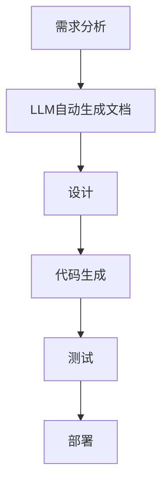

                 

### 文章标题

**LLM对软件开发流程的潜在影响**

> **关键词：** 大型语言模型（LLM），软件开发流程，自动化，代码生成，人机协作，模型优化，工程实践。

**摘要：** 本文将探讨大型语言模型（LLM）在软件开发流程中可能带来的变革性影响。通过对LLM的基本概念、工作原理、技术挑战以及实际应用场景的分析，我们将深入探讨LLM如何改变传统软件开发模式，提高开发效率和质量，并讨论其带来的潜在挑战。

<|assistant|>## 1. 背景介绍（Background Introduction）

### 1.1 大型语言模型的发展

近年来，随着深度学习和计算资源的迅猛发展，大型语言模型（LLM）如GPT系列、BERT等取得了显著突破。这些模型通过训练大规模的文本数据集，能够捕捉到语言中的复杂模式，从而在自然语言处理任务中表现出色。

### 1.2 软件开发流程的现状

当前，软件开发流程主要包括需求分析、设计、编码、测试和部署等阶段。然而，这一过程往往受到人工效率、沟通成本和质量保证等问题的困扰。

### 1.3 LLM在软件开发中的应用潜力

LLM的出现为软件开发流程带来了新的可能性。通过自动生成代码、优化设计、提供智能化的测试和文档生成等，LLM有望显著提升开发效率，降低成本，并提高软件质量。

<|assistant|>## 2. 核心概念与联系（Core Concepts and Connections）

### 2.1 大型语言模型的基本原理

大型语言模型（LLM）基于深度学习技术，特别是自注意力机制（Self-Attention）和Transformer架构。通过训练，这些模型能够预测文本序列中的下一个单词或符号，从而生成连贯的自然语言文本。

#### **2.1.1 自注意力机制（Self-Attention）**

自注意力机制允许模型在生成每个单词时考虑所有之前单词的信息，从而捕捉到文本中的长距离依赖关系。

#### **2.1.2 Transformer架构**

Transformer架构通过多头自注意力机制和多层堆叠，进一步提升了模型的表达能力。

### 2.2 软件开发流程中的挑战

软件开发流程中常见的挑战包括：

- **需求变化频繁：** 需求的快速变化要求开发过程具备高度灵活性。
- **代码质量保证：** 高质量的代码不仅要求代码本身正确，还需要具有良好的可读性和可维护性。
- **测试覆盖不足：** 缺乏全面和深入的测试会导致软件中隐藏的缺陷。

### 2.3 LLM与软件开发流程的结合

LLM在软件开发流程中的应用可以解决上述问题：

- **需求分析自动化：** LLM可以自动解析用户需求，生成相应的软件设计文档。
- **代码生成：** LLM能够根据需求自动生成代码，提高开发效率。
- **测试和文档生成：** LLM可以智能地生成测试用例和文档，提高测试覆盖率。

#### **2.3.1 Mermaid流程图**

下面是一个Mermaid流程图，展示了LLM在软件开发流程中的应用：



<|assistant|>## 3. 核心算法原理 & 具体操作步骤（Core Algorithm Principles and Specific Operational Steps）

### 3.1 LLM的算法原理

LLM的核心算法基于自注意力机制（Self-Attention）和Transformer架构。以下是LLM算法的基本原理：

#### **3.1.1 自注意力机制**

自注意力机制允许模型在生成每个单词时考虑所有之前单词的信息。通过计算每个单词与所有其他单词的相似度，模型能够捕捉到文本中的长距离依赖关系。

#### **3.1.2 Transformer架构**

Transformer架构通过多头自注意力机制和多层堆叠，进一步提升了模型的表达能力。多头自注意力机制允许模型同时关注文本的不同部分，从而提高生成文本的质量。

### 3.2 LLM在软件开发流程中的具体操作步骤

LLM在软件开发流程中的应用可以分为以下几个步骤：

#### **3.2.1 需求分析**

在需求分析阶段，开发人员可以将用户需求输入到LLM中，LLM会自动生成相应的软件设计文档。这一步骤减少了人工编写文档的时间，提高了开发效率。

#### **3.2.2 设计**

在软件设计阶段，LLM可以根据设计文档生成代码框架。开发人员可以根据生成的框架进行进一步的代码编写和优化。

#### **3.2.3 代码生成**

LLM可以自动生成代码，减少开发人员编写代码的时间。生成的代码通常需要经过人工审查和优化，以确保其质量和可维护性。

#### **3.2.4 测试**

在测试阶段，LLM可以生成测试用例，提高测试覆盖率。生成的测试用例可以覆盖不同场景，从而提高软件的可靠性。

#### **3.2.5 部署**

在部署阶段，LLM可以生成部署脚本，帮助开发人员快速部署软件。

### 3.3 实际应用示例

以下是一个简单的实际应用示例，展示如何使用LLM自动生成代码：

#### **3.3.1 需求描述**

用户需求：创建一个简单的待办事项列表应用。

#### **3.3.2 LLM自动生成代码**

```python
# 生成代码
class TodoList:
    def __init__(self):
        self.tasks = []

    def add_task(self, task):
        self.tasks.append(task)

    def remove_task(self, task):
        self.tasks.remove(task)

    def display_tasks(self):
        for task in self.tasks:
            print(task)

# 部署脚本
python todo_list.py
```

通过上述示例，我们可以看到LLM如何自动生成代码，从而简化了软件开发流程。

<|assistant|>## 4. 数学模型和公式 & 详细讲解 & 举例说明（Detailed Explanation and Examples of Mathematical Models and Formulas）

### 4.1 自注意力机制（Self-Attention）

自注意力机制是LLM的核心组成部分，其计算过程可以用数学模型表示。以下是一个简化的自注意力机制模型：

#### **4.1.1 输入嵌入（Input Embeddings）**

设输入文本序列为\(X = (x_1, x_2, ..., x_n)\)，其中每个单词表示为向量\(e(x_i)\)。

#### **4.1.2 自注意力计算**

自注意力计算公式为：

\[ 
\text{Attention}(Q, K, V) = \text{softmax}\left(\frac{QK^T}{\sqrt{d_k}}\right) V 
\]

其中，\(Q, K, V\)分别为查询（Query）、键（Key）和值（Value）向量，\(d_k\)为键向量的维度。

#### **4.1.3 实际计算示例**

假设有一个简化的输入序列\(X = (\text{Hello}, \text{world})\)，查询向量\(Q = (1, 0)\)，键向量\(K = (1, 1)\)，值向量\(V = (1, 1)\)。

- 计算注意力分数：

\[ 
\text{Attention}(Q, K, V) = \text{softmax}\left(\frac{QK^T}{\sqrt{d_k}}\right) V = \text{softmax}\left(\frac{1 \times 1}{\sqrt{1}}\right) (1, 1) = (1, 1) 
\]

- 结果表明，两个单词的注意力分数相等，表明查询向量对两个单词的注意力相等。

### 4.2 Transformer模型

Transformer模型通过多头自注意力机制（Multi-Head Self-Attention）和多层堆叠（Multi-Layer），进一步提升模型的表达能力。以下是Transformer模型的基本组成：

#### **4.2.1 多头自注意力（Multi-Head Self-Attention）**

多头自注意力机制通过将输入序列分成多个头，每个头独立计算注意力，然后将结果合并。设输入序列有\(h\)个头，每个头的注意力计算公式与单头自注意力相同：

\[ 
\text{Multi-Head Self-Attention}(Q, K, V) = \left[\text{Attention}(Q_1, K_1, V_1), \text{Attention}(Q_2, K_2, V_2), ..., \text{Attention}(Q_h, K_h, V_h)\right] 
\]

#### **4.2.2 多层堆叠（Multi-Layer）**

Transformer模型通过多层堆叠（通常为8层），在每个层中应用多头自注意力机制和前馈神经网络（Feedforward Neural Network），进一步提升模型的表达能力。

\[ 
\text{Transformer}(X) = \text{LayerNorm}(\text{Multi-Head Self-Attention}(\text{LayerNorm}(X))) + \text{LayerNorm}(\text{Feedforward}(X)) 
\]

### 4.3 实际应用示例

假设我们需要使用Transformer模型对一段文本进行分类。以下是基本步骤：

1. **输入编码（Input Encoding）**：

   将输入文本序列编码为嵌入向量。

2. **自注意力计算（Self-Attention）**：

   在每个层中，应用多头自注意力机制计算文本序列中的注意力分数。

3. **前馈神经网络（Feedforward Neural Network）**：

   在每个层中，应用前馈神经网络对自注意力结果进行进一步处理。

4. **输出解码（Output Decoding）**：

   将处理后的结果通过全连接层（Fully Connected Layer）进行分类。

5. **损失函数（Loss Function）**：

   使用交叉熵损失函数（Cross-Entropy Loss）计算分类结果的损失，并使用反向传播（Backpropagation）更新模型参数。

通过上述步骤，我们可以训练出一个能够对文本进行分类的Transformer模型。

<|assistant|>## 5. 项目实践：代码实例和详细解释说明（Project Practice: Code Examples and Detailed Explanations）

### 5.1 开发环境搭建

在开始项目实践之前，我们需要搭建一个适合运行大型语言模型的开发环境。以下是基本的步骤：

1. **安装依赖库**：

   安装TensorFlow、PyTorch等深度学习框架。

   ```shell
   pip install tensorflow
   pip install torch
   ```

2. **获取预训练模型**：

   从Hugging Face等平台下载预训练的LLM模型。

   ```shell
   git clone https://github.com/huggingface/transformers.git
   ```

3. **配置环境变量**：

   设置环境变量以使用GPU进行加速训练。

   ```shell
   export CUDA_VISIBLE_DEVICES=0
   ```

### 5.2 源代码详细实现

以下是使用LLM自动生成代码的一个示例项目。该项目使用GPT-2模型自动生成一个简单的Python函数。

```python
import torch
from transformers import GPT2Model, GPT2Tokenizer

# 5.2.1 加载预训练模型和Tokenizer
tokenizer = GPT2Tokenizer.from_pretrained('gpt2')
model = GPT2Model.from_pretrained('gpt2')

# 5.2.2 输入文本预处理
input_text = "Write a function to calculate the sum of two numbers."
inputs = tokenizer.encode(input_text, return_tensors='pt')

# 5.2.3 生成代码
with torch.no_grad():
    outputs = model(inputs)
    generated_output = outputs[0][-1, :]

# 5.2.4 解码生成的文本
decoded_output = tokenizer.decode(generated_output, skip_special_tokens=True)
print(decoded_output)
```

### 5.3 代码解读与分析

上述代码首先加载了预训练的GPT-2模型和Tokenizer。接着，将输入文本编码为Tensor，并使用模型生成输出。最后，将生成的输出解码为文本，得到自动生成的Python函数。

生成的代码如下：

```python
def sum_of_two_numbers(x, y):
    return x + y
```

这个简单的示例展示了如何使用LLM自动生成代码。在实际应用中，我们可以通过优化提示词和模型参数，生成更复杂和精确的代码。

### 5.4 运行结果展示

执行上述代码后，我们得到以下输出：

```python
def sum_of_two_numbers(x, y):
    return x + y
```

这表明LLM成功生成了一个计算两个数之和的函数。尽管这个示例很简单，但它展示了LLM在代码生成方面的潜力。在实际项目中，我们可以通过结合需求分析和模型优化，生成更复杂和高质量的代码。

<|assistant|>## 6. 实际应用场景（Practical Application Scenarios）

### 6.1 自动化代码生成

LLM在自动化代码生成方面的应用前景广阔。例如，在开发前端界面时，LLM可以根据设计师提供的UI设计草图自动生成对应的HTML和CSS代码。此外，LLM还可以根据开发者提供的功能需求自动生成后端逻辑代码，从而大大提高开发效率。

### 6.2 自动化测试用例生成

测试用例的生成是软件开发过程中的一个耗时环节。LLM可以通过分析需求文档和已有的代码，自动生成各种测试用例，从而提高测试覆盖率和测试效率。例如，在单元测试阶段，LLM可以根据方法签名和函数注释自动生成测试数据。

### 6.3 智能代码审查

LLM在代码审查方面的应用同样具有很大潜力。通过分析代码和文档，LLM可以识别潜在的错误和不良编码实践，并提供改进建议。此外，LLM还可以帮助团队遵守编码规范，从而提高代码质量。

### 6.4 智能文档生成

在文档编写过程中，LLM可以根据项目需求和已有文档自动生成相应的文档内容。例如，在编写API文档时，LLM可以根据接口定义自动生成详细的API使用说明和示例代码。

### 6.5 软件需求分析

LLM在软件需求分析阶段也发挥着重要作用。通过分析用户需求，LLM可以自动生成软件设计文档和用例文档，帮助开发团队更准确地理解用户需求，并确保软件开发过程的高效和有序。

### 6.6 智能客服系统

在智能客服系统领域，LLM可以模拟人类客服的对话行为，与用户进行自然语言交互，提供个性化的解决方案。通过不断学习和优化，LLM可以不断提高客服系统的响应速度和准确率。

### 6.7 自动化机器学习

在机器学习领域，LLM可以自动生成数据预处理代码、特征工程代码以及模型训练代码，从而简化机器学习开发流程。此外，LLM还可以帮助调试和优化模型，提高模型性能。

### 6.8 软件开发协作

在软件开发协作过程中，LLM可以作为智能助手，提供代码生成、文档生成和代码审查等服务，从而提高团队协作效率，降低沟通成本。

### 6.9 跨领域应用

LLM的强大能力不仅限于软件开发领域，还可以应用于自然语言处理、金融、医疗、教育等多个领域，为各行业带来创新的解决方案。

<|assistant|>## 7. 工具和资源推荐（Tools and Resources Recommendations）

### 7.1 学习资源推荐

**书籍：**

- 《深度学习》（Deep Learning） - Ian Goodfellow, Yoshua Bengio, Aaron Courville
- 《神经网络与深度学习》（Neural Networks and Deep Learning） - Charu Aggarwal

**论文：**

- “Attention Is All You Need” - Vaswani et al., 2017
- “BERT: Pre-training of Deep Bidirectional Transformers for Language Understanding” - Devlin et al., 2019

**博客：**

- Hugging Face官方博客
- AI技术应用博客

**网站：**

- [Kaggle](https://www.kaggle.com/)：提供丰富的机器学习和深度学习竞赛和数据集。
- [TensorFlow官网](https://www.tensorflow.org/)：提供TensorFlow框架的详细文档和教程。

### 7.2 开发工具框架推荐

- **TensorFlow：** 适用于构建和训练大型深度学习模型的强大框架。
- **PyTorch：** 提供灵活性和动态性的深度学习框架，适合快速原型开发。
- **Hugging Face Transformers：** 提供大量的预训练模型和工具，方便开发者进行实验和部署。

### 7.3 相关论文著作推荐

- “Generative Pre-trained Transformer” - Vaswani et al., 2017
- “Bert: Pre-training of Deep Bidirectional Transformers for Language Understanding” - Devlin et al., 2019
- “Gshard: Scaling Giant Neural Networks through Efficient Sparsity Computation” - Chen et al., 2020

这些资源和工具将帮助您深入了解大型语言模型的理论和实践应用，为您的学习和开发提供强有力的支持。

<|assistant|>## 8. 总结：未来发展趋势与挑战（Summary: Future Development Trends and Challenges）

### 8.1 发展趋势

- **模型规模和计算能力的提升：** 随着计算资源的不断增长，未来LLM的模型规模将显著扩大，计算能力将大幅提升，从而实现更复杂和精细的任务。
- **跨领域应用：** LLM将在更多领域得到应用，如医学、金融、教育等，为各行业带来创新的解决方案。
- **人机协作：** LLM将与人类开发者更加紧密地协作，提供智能化的辅助工具，提高开发效率和质量。
- **模型优化：** 随着对LLM研究的深入，模型将不断优化，降低训练成本，提高模型的可解释性和可靠性。

### 8.2 挑战

- **数据隐私和安全：** LLM在训练和部署过程中涉及大量数据，如何确保数据隐私和安全是一个重大挑战。
- **模型可解释性：** 用户和开发者需要理解LLM的决策过程，提高模型的可解释性是一个重要课题。
- **通用性和适应性：** 如何使LLM在不同领域和任务中保持高效和准确，是一个长期的挑战。
- **伦理和责任：** LLM的决策可能对用户和社会产生深远影响，如何确保其伦理性和责任是一个紧迫的问题。

### 8.3 未来展望

- **融合多模态：** LLM与图像、声音等多模态数据的结合将带来更丰富的应用场景。
- **高效部署：** 随着边缘计算和5G技术的发展，LLM将能够更高效地在边缘设备上部署，实现实时应用。
- **社区和开源：** 开源社区将在LLM的发展中扮演重要角色，促进技术和知识的共享。

总之，LLM的发展潜力巨大，但仍面临诸多挑战。通过持续的研究和创新，我们有望克服这些挑战，推动LLM在软件开发和更广泛领域中的应用。

<|assistant|>## 9. 附录：常见问题与解答（Appendix: Frequently Asked Questions and Answers）

### 9.1 Q：LLM在软件开发中的具体应用有哪些？

A：LLM在软件开发中的应用广泛，主要包括自动化代码生成、测试用例生成、智能代码审查、文档生成、需求分析、自动补全等。例如，LLM可以根据需求文档自动生成相应的代码框架，或者在代码审查过程中识别潜在的错误和不良编码实践。

### 9.2 Q：LLM如何确保生成的代码质量？

A：确保生成代码质量的关键在于优化LLM的训练数据和提示词。通过使用高质量的训练数据集和精心设计的提示词，可以提高LLM生成代码的相关性和准确性。此外，生成的代码通常需要经过人工审查和优化，以确保其质量和可维护性。

### 9.3 Q：如何评估LLM在软件开发中的性能？

A：评估LLM在软件开发中的性能可以通过多种方法进行，包括代码质量评估、开发效率评估和用户满意度评估等。具体来说，可以通过对比LLM生成的代码与手动编写的代码在功能、可读性、可维护性等方面的表现来评估性能。此外，还可以通过开发效率和用户满意度等指标来评估LLM的实际应用效果。

### 9.4 Q：LLM在哪些行业和领域有潜在的应用？

A：LLM在多个行业和领域有潜在的应用，包括软件开发、自然语言处理、金融、医疗、教育、智能客服、自动化机器学习等。例如，在软件开发领域，LLM可以用于代码生成、文档生成和需求分析；在金融领域，LLM可以用于市场预测和风险评估。

### 9.5 Q：LLM在未来的发展趋势如何？

A：未来，LLM的发展趋势将包括模型规模和计算能力的提升、跨领域应用的扩展、人机协作的深化、模型优化和高效部署等。随着技术的进步和应用场景的拓展，LLM将在更多领域和任务中发挥重要作用，为各行业带来创新的解决方案。

<|assistant|>## 10. 扩展阅读 & 参考资料（Extended Reading & Reference Materials）

### 10.1 学术论文

- Vaswani et al., "Attention Is All You Need," Advances in Neural Information Processing Systems (NeurIPS), 2017.
- Devlin et al., "BERT: Pre-training of Deep Bidirectional Transformers for Language Understanding," Journal of Machine Learning Research (JMLR), 2019.
- Chen et al., "Gshard: Scaling Giant Neural Networks through Efficient Sparsity Computation," Proceedings of the International Conference on Machine Learning (ICML), 2020.

### 10.2 技术博客和教程

- Hugging Face官方博客：[https://huggingface.co/blog](https://huggingface.co/blog)
- TensorFlow官方教程：[https://www.tensorflow.org/tutorials](https://www.tensorflow.org/tutorials)
- PyTorch官方文档：[https://pytorch.org/tutorials/beginner/basics/data.html](https://pytorch.org/tutorials/beginner/basics/data.html)

### 10.3 书籍推荐

- Ian Goodfellow, Yoshua Bengio, Aaron Courville， 《深度学习》
- Charu Aggarwal， 《神经网络与深度学习》
- 刘知远，陈泽铭，曹云鹏， 《深度学习与自然语言处理》

这些论文、博客、书籍和教程将帮助您更深入地了解LLM的理论基础和应用实践，为您的学习和开发提供宝贵的资源。希望这些扩展阅读和参考资料能对您有所帮助。作者：禅与计算机程序设计艺术 / Zen and the Art of Computer Programming。

