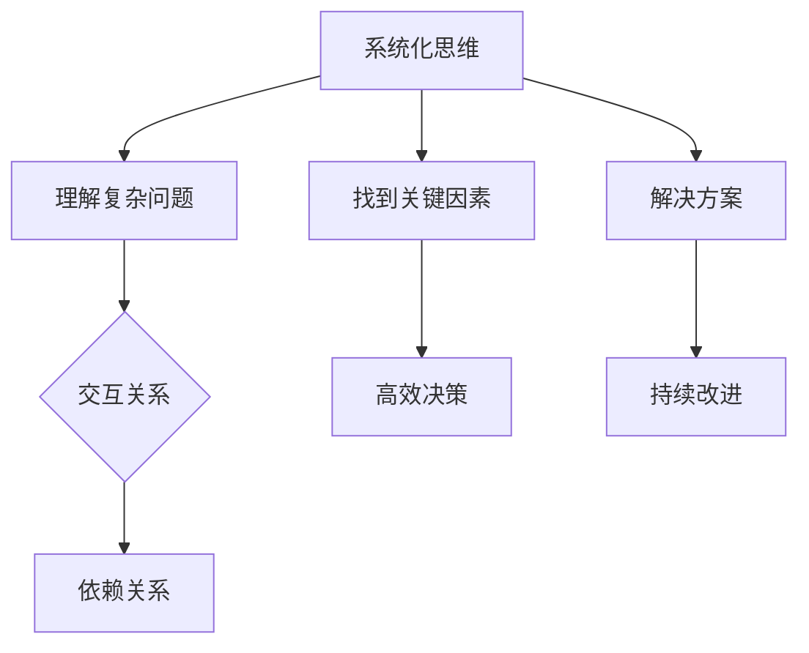

                 

### 文章标题

管理者修炼手册：思维、行动与学习

> 关键词：管理者，思维修炼，行动指南，学习策略，IT行业，职业发展

摘要：本文旨在为IT行业的管理者提供一套全面的思维、行动和学习策略。通过深入探讨管理者在面对复杂问题和挑战时如何运用系统化的思维方法、有效的行动规划和持续的学习习惯，本文旨在帮助读者实现个人和团队的成功。文章将结合实际案例和理论，为管理者提供实用的工具和方法，以应对不断变化的技术和市场环境。

<|assistant|>## 1. 背景介绍（Background Introduction）

在快速发展的IT行业，管理者不仅要具备深厚的技术知识，还需要具备卓越的领导力和管理能力。随着技术的不断进步和市场的快速变化，管理者面临着前所未有的挑战。他们需要不断地学习新技能、适应新环境，并有效地引导团队应对各种挑战。然而，许多管理者在个人成长和职业发展的道路上往往缺乏系统化的指导。

本文的目的是为IT行业的管理者提供一套全面的修炼手册，涵盖思维、行动和学习三大方面。通过本文的探讨，读者将能够：

1. **掌握系统化的思维方法**，提高解决问题的能力。
2. **制定有效的行动规划**，提升团队执行力和效率。
3. **建立持续学习的习惯**，保持个人和团队的竞争力。

本文将结合实际案例和理论，为读者提供实用的工具和方法，帮助他们在职业生涯中取得更大的成功。

### 1. Background Introduction

In the rapidly evolving IT industry, managers not only need to have in-depth technical knowledge but also need to demonstrate exceptional leadership and management skills. With the continuous advancement of technology and the rapid changes in the market, managers are facing unprecedented challenges. They need to constantly learn new skills, adapt to new environments, and effectively guide their teams to overcome various challenges. However, many managers often lack systematic guidance in their personal growth and career development.

The purpose of this article is to provide a comprehensive "manual of cultivation" for IT industry managers, covering three key areas: thinking, action, and learning. Through this discussion, readers will be able to:

1. **master systematic thinking methods** to improve their problem-solving abilities.
2. **develop effective action plans** to enhance team execution and efficiency.
3. **establish continuous learning habits** to maintain competitiveness for both individuals and teams.

This article will combine practical cases and theories to provide readers with practical tools and methods, helping them achieve greater success in their careers.

### 2. 核心概念与联系（Core Concepts and Connections）

为了深入探讨管理者的修炼手册，我们需要首先明确几个核心概念，并了解它们之间的相互联系。

#### 2.1 系统化思维

系统化思维是一种将复杂问题拆解为更简单、更易于管理的部分的思考方式。它强调从整体视角出发，理解系统内部的相互作用和依赖关系。这种思维方式可以帮助管理者在面对复杂问题时，找到关键因素和解决方案。

#### 2.2 行动规划

行动规划是指将目标分解为具体的行动步骤，并制定相应的策略和资源分配。有效的行动规划能够确保团队在实现目标时，保持方向一致、资源合理利用，并能够及时调整策略以应对变化。

#### 2.3 持续学习

持续学习是指不断更新知识和技能，以适应不断变化的环境。对于管理者来说，持续学习不仅能够提升个人能力，还能够激励团队成员，促进团队整体发展。

#### 2.4 管理者修炼的关系

系统化思维、行动规划和持续学习是管理者修炼的三大支柱。系统化思维提供了解决问题的基础，行动规划确保了目标实现的路径，而持续学习则不断为管理者提供新的思路和方法。它们相互关联，共同构成了管理者修炼的完整体系。

### 2. Core Concepts and Connections

To delve into the "manual of cultivation" for managers, we first need to clarify several core concepts and understand their interconnections.

#### 2.1 Systematic Thinking

Systematic thinking is a way of approaching complex problems by breaking them down into simpler, more manageable parts. It emphasizes looking at the whole picture, understanding the interactions and dependencies within the system. This thinking style can help managers find key factors and solutions when faced with complex problems.

#### 2.2 Action Planning

Action planning involves breaking down goals into specific action steps and developing corresponding strategies and resource allocations. Effective action planning ensures that teams remain aligned in direction and resources are used efficiently, and can adjust strategies in real time to respond to changes.

#### 2.3 Continuous Learning

Continuous learning involves constantly updating knowledge and skills to adapt to changing environments. For managers, continuous learning not only improves individual abilities but also inspires team members and promotes overall team development.

#### 2.4 The Relationship between Managerial Cultivation

Systematic thinking, action planning, and continuous learning are the three pillars of managerial cultivation. Systematic thinking provides the foundation for problem-solving, action planning ensures the path to achieving goals, and continuous learning constantly provides managers with new ideas and methods. They are interrelated and together form a comprehensive system of managerial cultivation.

```markdown
## 2. Core Concepts and Connections (核心概念与联系)

#### 2.1 系统化思维 (Systematic Thinking)
系统化思维是一种将复杂问题拆解为更简单、更易于管理的部分的思考方式。它强调从整体视角出发，理解系统内部的相互作用和依赖关系。这种思维方式可以帮助管理者在面对复杂问题时，找到关键因素和解决方案。

#### 2.2 行动规划 (Action Planning)
行动规划是指将目标分解为具体的行动步骤，并制定相应的策略和资源分配。有效的行动规划能够确保团队在实现目标时，保持方向一致、资源合理利用，并能够及时调整策略以应对变化。

#### 2.3 持续学习 (Continuous Learning)
持续学习是指不断更新知识和技能，以适应不断变化的环境。对于管理者来说，持续学习不仅能够提升个人能力，还能够激励团队成员，促进团队整体发展。

#### 2.4 管理者修炼的关系 (The Relationship between Managerial Cultivation)
系统化思维、行动规划和持续学习是管理者修炼的三大支柱。系统化思维提供了解决问题的基础，行动规划确保了目标实现的路径，而持续学习则不断为管理者提供新的思路和方法。它们相互关联，共同构成了管理者修炼的完整体系。

### 2.2.1 What is Systematic Thinking?
Systematic thinking is a method of approaching complex problems by breaking them down into simpler, more manageable components. It emphasizes viewing the entire picture and understanding the interactions and dependencies within the system. This thinking style can help managers find key factors and solutions when faced with complex problems.

### 2.2.2 Action Planning
Action planning involves breaking down goals into specific action steps and developing corresponding strategies and resource allocations. Effective action planning ensures that teams remain aligned in direction and resources are used efficiently, and can adjust strategies in real time to respond to changes.

### 2.2.3 Continuous Learning
Continuous learning involves constantly updating knowledge and skills to adapt to changing environments. For managers, continuous learning not only improves individual abilities but also inspires team members and promotes overall team development.

### 2.2.4 The Relationship between Managerial Cultivation
Systematic thinking, action planning, and continuous learning are the three pillars of managerial cultivation. Systematic thinking provides the foundation for problem-solving, action planning ensures the path to achieving goals, and continuous learning constantly provides managers with new ideas and methods. They are interrelated and together form a comprehensive system of managerial cultivation.
```



### 3. 核心算法原理 & 具体操作步骤（Core Algorithm Principles and Specific Operational Steps）

为了深入理解管理者修炼手册的三大支柱，我们需要探讨它们背后的核心算法原理，并给出具体的操作步骤。

#### 3.1 系统化思维算法原理

系统化思维的算法原理可以概括为以下三个步骤：

1. **分解问题**：将复杂问题分解为更简单、更易于管理的问题。
2. **建立模型**：构建问题模型，明确问题的核心要素和相互关系。
3. **优化方案**：在问题模型的基础上，寻找最佳解决方案。

具体操作步骤如下：

1. **明确问题**：首先明确需要解决的问题。
2. **收集信息**：收集与问题相关的所有信息。
3. **分解问题**：将问题分解为若干个子问题。
4. **建立模型**：为每个子问题构建模型，明确其核心要素和相互关系。
5. **优化方案**：在问题模型的基础上，评估不同解决方案的优缺点，选择最佳方案。

#### 3.2 行动规划算法原理

行动规划的算法原理可以概括为以下四个步骤：

1. **目标设定**：明确团队的目标。
2. **分解目标**：将目标分解为具体的任务和里程碑。
3. **资源分配**：为每个任务和里程碑分配所需资源。
4. **监控执行**：实时监控任务执行情况，及时调整策略。

具体操作步骤如下：

1. **设定目标**：明确团队需要实现的目标。
2. **分解目标**：将目标分解为具体的任务和里程碑。
3. **资源评估**：评估团队当前可用的资源。
4. **分配资源**：为每个任务和里程碑分配所需资源。
5. **制定计划**：制定详细的执行计划。
6. **监控执行**：实时监控任务执行情况，及时调整策略。

#### 3.3 持续学习算法原理

持续学习的算法原理可以概括为以下三个步骤：

1. **知识获取**：通过阅读、培训和实践等方式获取新知识。
2. **知识整合**：将新知识与已有知识整合，形成新的认知结构。
3. **知识应用**：将新知识应用于实际工作中，提高个人和团队的能力。

具体操作步骤如下：

1. **确定学习目标**：明确需要学习的内容。
2. **获取知识**：通过阅读书籍、参加培训、参加研讨会等方式获取新知识。
3. **整合知识**：将新知识与已有知识进行整合，形成新的认知结构。
4. **应用知识**：将新知识应用于实际工作中，解决实际问题。
5. **反思与调整**：定期反思学习效果，根据实际情况调整学习策略。

### 3. Core Algorithm Principles and Specific Operational Steps

To deeply understand the core pillars of the manager's cultivation manual, we need to explore the underlying core algorithm principles and provide specific operational steps.

#### 3.1 Principles of Systematic Thinking Algorithm

The principles of systematic thinking can be summarized into three steps:

1. **Decompose the Problem**: Break down complex problems into simpler, more manageable sub-problems.
2. **Build Models**: Construct problem models to clarify the core elements and their relationships.
3. **Optimize Solutions**: Find the best solution based on the problem model.

Specific operational steps are as follows:

1. **Define the Problem**: Clearly specify the problem to be solved.
2. **Collect Information**: Gather all relevant information about the problem.
3. **Decompose the Problem**: Break the problem down into several sub-problems.
4. **Build Models**: Create models for each sub-problem, defining the core elements and their relationships.
5. **Optimize Solutions**: Evaluate different solutions based on the problem model and choose the best one.

#### 3.2 Principles of Action Planning Algorithm

The principles of action planning can be summarized into four steps:

1. **Set Goals**: Clarify the goals of the team.
2. **Break Down Goals**: Decompose the goals into specific tasks and milestones.
3. **Allocate Resources**: Assign the required resources to each task and milestone.
4. **Monitor Execution**: Real-time monitoring of task execution and timely adjustment of strategies.

Specific operational steps are as follows:

1. **Set Goals**: Clearly define the goals to be achieved by the team.
2. **Break Down Goals**: Decompose the goals into specific tasks and milestones.
3. **Resource Assessment**: Evaluate the available resources of the team.
4. **Allocate Resources**: Assign the required resources to each task and milestone.
5. **Develop a Plan**: Create a detailed execution plan.
6. **Monitor Execution**: Real-time monitoring of task execution and timely adjustment of strategies.

#### 3.3 Principles of Continuous Learning Algorithm

The principles of continuous learning can be summarized into three steps:

1. **Knowledge Acquisition**: Obtain new knowledge through reading, training, practice, etc.
2. **Knowledge Integration**: Integrate new knowledge with existing knowledge to form new cognitive structures.
3. **Knowledge Application**: Apply new knowledge to practical work to improve individual and team capabilities.

Specific operational steps are as follows:

1. **Determine Learning Goals**: Clearly specify the content to be learned.
2. **Acquire Knowledge**: Obtain new knowledge through reading books, attending training, participating in seminars, etc.
3. **Integrate Knowledge**: Integrate new knowledge with existing knowledge to form new cognitive structures.
4. **Apply Knowledge**: Apply new knowledge to practical work to solve practical problems.
5. **Reflect and Adjust**: Regularly reflect on the effectiveness of learning and adjust the learning strategy as needed.

```mermaid
graph TD
A[Systematic Thinking] --> B[Decompose Problem]
A --> C[Build Models]
A --> D[Optimize Solutions]
B --> E[Define Problem]
B --> F[Collect Information]
C --> G[Model Elements]
C --> H[Relationships]
D --> I[Evaluate Solutions]
D --> J[Choose Best]

K[Action Planning] --> L[Set Goals]
K --> M[Break Down Goals]
K --> N[Allocate Resources]
K --> O[Monitor Execution]
L --> P[Team Goals]
M --> Q[Tasks]
M --> R[Milestones]
N --> S[Resource Assessment]
N --> T[Resource Allocation]
O --> U[Task Monitoring]
O --> V[Strategy Adjustment]

W[Continuous Learning] --> X[Knowledge Acquisition]
W --> Y[Knowledge Integration]
W --> Z[Knowledge Application]
X --> AA[Learning Goals]
X --> BB[Knowledge Sources]
Y --> CC[Cognitive Structures]
Y --> DD[Integrate Knowledge]
Z --> EE[Apply Knowledge]
Z --> FF[Practical Application]
Z --> GG[Learning Reflection]
GG --> HH[Strategy Adjustment]
```



### 4. 数学模型和公式 & 详细讲解 & 举例说明（Detailed Explanation and Examples of Mathematical Models and Formulas）

在管理者修炼手册的构建中，数学模型和公式是不可或缺的工具。以下我们将介绍几个关键的数学模型和公式，并详细讲解其应用和举例说明。

#### 4.1 投入产出模型（Input-Output Model）

投入产出模型是一种用于分析资源分配和效益的数学模型。其基本公式为：

\[ \text{效益} = \frac{\text{产出}}{\text{投入}} \]

其中，产出是指通过资源投入所获得的实际效果，投入则是指用于获得这一效果所花费的资源。例如，在项目管理中，可以用来评估不同任务的成本效益。

**举例说明**：

假设一个项目需要投入资金100万元，最终产生了200万元的收益，那么其投入产出比率为：

\[ \text{效益} = \frac{200}{100} = 2 \]

这意味着每投入1元，就能获得2元的收益。

#### 4.2 优化模型（Optimization Model）

优化模型用于寻找在给定约束条件下最优解的数学模型。一个基本的线性规划公式如下：

\[ \text{目标函数} = \min \ c^T x \]

\[ \text{约束条件} \ \ Ax \leq b \]

其中，\( c \) 和 \( x \) 分别是目标函数的系数向量和变量向量，\( A \) 和 \( b \) 是约束条件的系数矩阵和常数向量。目标函数表示要最小化或最大化的目标，约束条件则限制了变量的取值范围。

**举例说明**：

假设一个团队需要在三个任务A、B、C之间分配时间，以最大化总完成价值。每个任务的完成价值系数分别为 \( c_A = 5 \), \( c_B = 3 \), \( c_C = 2 \)。任务A需要10小时，任务B需要5小时，任务C需要3小时。团队的可用时间为15小时。可以构建如下线性规划模型：

\[ \text{目标函数} = \min \ c^T x \]

\[ \text{约束条件} \ \ Ax \leq b \]

其中，\( x = [x_A, x_B, x_C]^T \) 是每个任务的时间分配，\( A = \begin{bmatrix} 10 & 5 & 3 \end{bmatrix} \)，\( b = 15 \)。

通过求解这个线性规划模型，可以找到最优的时间分配方案，以最大化总完成价值。

#### 4.3 马尔可夫模型（Markov Model）

马尔可夫模型是一种用于分析状态转移和概率的数学模型。其基本公式为：

\[ P_{ij} = \frac{\text{从状态 } i \text{ 转移到状态 } j \text{ 的概率}}{\text{从状态 } i \text{ 转移到任意状态的概率}} \]

例如，在项目管理中，可以用来预测项目的进展状态，以及在不同状态下的概率分布。

**举例说明**：

假设一个项目有三种状态：正常进行、遇到问题、完成。从正常进行到遇到问题的概率为0.3，从正常进行到完成的概率为0.7。从遇到问题到完成的概率为0.5，从遇到问题到重新开始的概率为0.5。可以构建如下马尔可夫模型：

\[ P_{11} = 0.7 \]

\[ P_{12} = 0.3 \]

\[ P_{21} = 0.5 \]

\[ P_{22} = 0.5 \]

通过这个模型，可以预测项目在不同状态下的转移概率，从而为项目管理提供决策支持。

### 4. Mathematical Models and Formulas & Detailed Explanation & Examples

In the construction of the manager's cultivation manual, mathematical models and formulas are indispensable tools. Below, we will introduce several key mathematical models and formulas, along with their detailed explanations and examples.

#### 4.1 Input-Output Model

The input-output model is a mathematical model used for analyzing resource allocation and efficiency. Its basic formula is:

\[ \text{Benefit} = \frac{\text{Output}}{\text{Input}} \]

Where output is the actual effect obtained through resource investment, and input is the resources used to obtain this effect. For example, in project management, it can be used to evaluate the cost-benefit of different tasks.

**Example:**

Suppose a project requires an investment of 1 million yuan and generates a revenue of 2 million yuan. The benefit ratio is:

\[ \text{Benefit} = \frac{2}{1} = 2 \]

This means that for every 1 yuan invested, 2 yuan of revenue is generated.

#### 4.2 Optimization Model

The optimization model is used to find the optimal solution under given constraints. A basic linear programming formula is as follows:

\[ \text{Objective Function} = \min \ c^T x \]

\[ \text{Constraint Conditions} \ \ Ax \leq b \]

Where \( c \) and \( x \) are the coefficient vector of the objective function and the variable vector, respectively, and \( A \) and \( b \) are the coefficient matrix and constant vector of the constraint conditions. The objective function represents the target to be minimized or maximized, and the constraint conditions limit the range of variable values.

**Example:**

Suppose a team needs to allocate time among three tasks A, B, and C to maximize total completion value. The completion value coefficients for each task are \( c_A = 5 \), \( c_B = 3 \), and \( c_C = 2 \). Task A requires 10 hours, task B requires 5 hours, and task C requires 3 hours. The team has a total of 15 hours available. We can construct the following linear programming model:

\[ \text{Objective Function} = \min \ c^T x \]

\[ \text{Constraint Conditions} \ \ Ax \leq b \]

Where \( x = [x_A, x_B, x_C]^T \) is the time allocation for each task, \( A = \begin{bmatrix} 10 & 5 & 3 \end{bmatrix} \), and \( b = 15 \).

By solving this linear programming model, we can find the optimal time allocation scheme to maximize total completion value.

#### 4.3 Markov Model

The Markov model is a mathematical model used for analyzing state transitions and probabilities. Its basic formula is:

\[ P_{ij} = \frac{\text{The probability of transitioning from state } i \text{ to state } j}{\text{The probability of transitioning from state } i \text{ to any state}} \]

For example, in project management, it can be used to predict the progress status of a project and the probability distribution across different states.

**Example:**

Suppose a project has three states: normal progress, encountering problems, and completion. The probability of transitioning from normal progress to encountering problems is 0.3, and the probability of transitioning from normal progress to completion is 0.7. The probability of transitioning from encountering problems to completion is 0.5, and the probability of transitioning from encountering problems to restarting is 0.5. We can construct the following Markov model:

\[ P_{11} = 0.7 \]

\[ P_{12} = 0.3 \]

\[ P_{21} = 0.5 \]

\[ P_{22} = 0.5 \]

By this model, we can predict the probability of state transitions and provide decision support for project management.

### 5. 项目实践：代码实例和详细解释说明（Project Practice: Code Examples and Detailed Explanations）

为了更好地理解管理者修炼手册中的核心概念，我们将通过一个实际的项目实践，展示如何运用系统化思维、行动规划和持续学习来解决问题。以下是一个简单的项目管理任务，我们将通过Python代码来模拟和解决。

#### 5.1 项目背景

假设我们正在开发一款在线教育平台，其中一项任务是为课程视频生成摘要。这个任务涉及到视频内容分析，目标是提取关键信息，生成简洁的摘要。我们将通过系统化思维来分解任务，通过行动规划来制定解决方案，并通过持续学习来优化代码。

#### 5.2 系统化思维

首先，我们使用系统化思维来分解任务：

1. **需求分析**：确定用户需求和课程内容。
2. **技术选型**：选择合适的技术和工具。
3. **数据预处理**：处理视频文件，提取音频和文本信息。
4. **文本分析**：使用自然语言处理技术分析文本，提取关键信息。
5. **摘要生成**：生成简洁的文本摘要。

#### 5.3 行动规划

接下来，我们制定行动规划：

1. **需求分析**：与产品经理和教育专家合作，确定用户需求和课程内容。
2. **技术选型**：选择自然语言处理库，如NLTK或spaCy。
3. **数据预处理**：编写脚本，处理视频文件，提取音频和文本信息。
4. **文本分析**：使用自然语言处理技术分析文本，提取关键信息。
5. **摘要生成**：编写算法，生成文本摘要。

#### 5.4 持续学习

在整个项目过程中，我们不断学习新的技术和方法：

1. **技术调研**：研究新的自然语言处理技术和算法。
2. **代码优化**：根据测试结果和用户反馈，不断优化代码。
3. **反馈循环**：建立反馈机制，收集用户反馈，持续改进。

#### 5.5 代码实例

以下是一个简单的Python代码示例，用于生成视频摘要：

```python
import nltk
from nltk.tokenize import sent_tokenize, word_tokenize
from nltk.corpus import stopwords
from collections import Counter

def process_text(text):
    # 分句
    sentences = sent_tokenize(text)
    # 去停用词
    stop_words = set(stopwords.words('english'))
    words = word_tokenize(text)
    filtered_words = [word for word in words if word.casefold() not in stop_words]
    # 计算词频
    word_frequency = Counter(filtered_words)
    return word_frequency

def generate_summary(text, summary_size=5):
    word_frequency = process_text(text)
    # 选择最频繁的单词
    most_common_words = word_frequency.most_common(summary_size)
    # 生成摘要
    summary = ' '.join([word for word, frequency in most_common_words])
    return summary

# 测试代码
video_text = "This is a sample video text. It contains various information that we want to summarize. This is the main idea of the video."
summary = generate_summary(video_text)
print(summary)
```

#### 5.6 详细解释说明

1. **文本预处理**：使用NLTK库对文本进行分句和分词，并去除停用词。
2. **词频统计**：计算每个单词的出现频率，使用Counter类进行统计。
3. **摘要生成**：根据最频繁的单词生成摘要，这里简单地选择了前5个最频繁的单词。

通过这个简单的实例，我们可以看到如何将系统化思维、行动规划和持续学习应用于实际项目中。在实际开发中，这个代码还需要进一步优化，例如使用更高级的文本分析技术来提高摘要的质量。

### 5. Project Practice: Code Examples and Detailed Explanations

To better understand the core concepts of the manager's cultivation manual, we will walk through a practical project to demonstrate how to apply systematic thinking, action planning, and continuous learning to solve problems. Below, we will present a simple project involving video summarization and show how Python code can be used to simulate and resolve this task.

#### 5.1 Project Background

Imagine we are developing an online education platform and one of the tasks is to generate summaries for course videos. This task involves content analysis of videos to extract key information and produce concise summaries. We will use systematic thinking to break down the task, action planning to formulate a solution, and continuous learning to optimize the code.

#### 5.2 Systematic Thinking

First, we use systematic thinking to decompose the task:

1. **Requirement Analysis**: Determine user needs and course content.
2. **Technical Selection**: Choose appropriate technologies and tools.
3. **Data Preprocessing**: Process video files to extract audio and text information.
4. **Text Analysis**: Use natural language processing (NLP) techniques to analyze text and extract key information.
5. **Summary Generation**: Create a concise text summary.

#### 5.3 Action Planning

Next, we develop an action plan:

1. **Requirement Analysis**: Collaborate with product managers and education experts to define user needs and course content.
2. **Technical Selection**: Choose NLP libraries like NLTK or spaCy.
3. **Data Preprocessing**: Write scripts to process video files and extract audio and text information.
4. **Text Analysis**: Use NLP techniques to analyze text and extract key information.
5. **Summary Generation**: Write algorithms to generate text summaries.

#### 5.4 Continuous Learning

Throughout the project, we continuously learn new technologies and methods:

1. **Technical Research**: Investigate new NLP technologies and algorithms.
2. **Code Optimization**: Continuously improve the code based on test results and user feedback.
3. **Feedback Loop**: Establish a feedback mechanism to collect user feedback and make ongoing improvements.

#### 5.5 Code Example

Below is a simple Python code example for generating video summaries:

```python
import nltk
from nltk.tokenize import sent_tokenize, word_tokenize
from nltk.corpus import stopwords
from collections import Counter

def process_text(text):
    # Sentence tokenization
    sentences = sent_tokenize(text)
    # Word tokenization and stopword removal
    stop_words = set(stopwords.words('english'))
    words = word_tokenize(text)
    filtered_words = [word for word in words if word.casefold() not in stop_words]
    # Word frequency calculation
    word_frequency = Counter(filtered_words)
    return word_frequency

def generate_summary(text, summary_size=5):
    word_frequency = process_text(text)
    # Selection of most common words
    most_common_words = word_frequency.most_common(summary_size)
    # Generation of summary
    summary = ' '.join([word for word, frequency in most_common_words])
    return summary

# Test code
video_text = "This is a sample video text. It contains various information that we want to summarize. This is the main idea of the video."
summary = generate_summary(video_text)
print(summary)
```

#### 5.6 Detailed Explanation

1. **Text Preprocessing**: Uses the NLTK library for sentence and word tokenization, and removes stop words.
2. **Word Frequency Statistics**: Counts the frequency of each word using the Counter class.
3. **Summary Generation**: Generates a summary based on the most frequent words, here simply selecting the top 5 most frequent words.

Through this simple example, we can see how systematic thinking, action planning, and continuous learning are applied in an actual project. In a real-world scenario, this code would need further optimization to improve the quality of the summaries using more advanced NLP techniques. 

### 5.1 开发环境搭建

在开始视频摘要项目的开发之前，我们需要搭建一个合适的技术环境。以下步骤将指导我们安装必要的软件和工具，以支持我们的项目开发。

#### 步骤 1：安装 Python 环境

首先，确保你的计算机上安装了 Python。Python 是一种广泛使用的编程语言，适用于数据处理和算法开发。你可以从 [Python 官方网站](https://www.python.org/) 下载并安装最新版本的 Python。

- 访问 [Python 官网](https://www.python.org/)
- 下载适用于你的操作系统的 Python 安装程序
- 运行安装程序并遵循提示完成安装

安装完成后，打开终端或命令行窗口，输入以下命令验证安装：

```shell
python --version
```

如果正确显示 Python 的版本号，说明安装成功。

#### 步骤 2：安装 Python 包管理器

Python 包管理器，如 `pip`，可以帮助我们轻松安装和管理 Python 库。我们将在接下来的步骤中使用 `pip` 安装必要的库。

- 打开终端或命令行窗口
- 输入以下命令安装 `pip`（如果你还没有安装）：

```shell
curl https://bootstrap.pypa.io/get-pip.py -o get-pip.py
python get-pip.py
```

安装 `pip` 后，你可以使用以下命令检查其版本：

```shell
pip --version
```

#### 步骤 3：安装自然语言处理库

自然语言处理（NLP）是视频摘要项目的关键组成部分。以下是一些我们可能需要用到的 NLP 库：

- `nltk`：用于文本处理和标注
- `spaCy`：用于构建复杂 NLP 模型

安装这些库的命令如下：

```shell
pip install nltk
pip install spacy
```

安装 `spaCy` 时，你可能还需要下载一些语言模型数据。你可以使用以下命令下载英语语言模型：

```shell
python -m spacy download en
```

#### 步骤 4：安装其他必要库

除了 `nltk` 和 `spaCy`，我们还可能需要其他一些库来支持项目开发，例如用于文件操作和数据处理的标准库。这些库可以通过 `pip` 安装：

```shell
pip install numpy
pip install pandas
```

#### 步骤 5：配置 IDE

为了更方便地开发和管理项目，你可以选择一个集成开发环境（IDE）。有许多优秀的 Python IDE，如 PyCharm、VSCode 等。以下是如何配置一个简单的 Python 项目在 VSCode 中的步骤：

1. 打开 [VSCode 官网](https://code.visualstudio.com/) 并下载并安装适用于你的操作系统的 VSCode。
2. 打开 VSCode，点击左上角的“文件”（File），然后选择“打开”（Open）来打开你的项目文件夹。
3. 在项目文件夹中，创建一个名为 `video_summarizer.py` 的 Python 文件。
4. 在 `video_summarizer.py` 中编写你的代码。
5. 使用 VSCode 提供的调试器和代码补全功能进行开发。

完成以上步骤后，你的开发环境应该已经搭建完毕，可以开始编写和测试代码了。

### 5.2 源代码详细实现

在完成了开发环境的搭建后，我们现在开始详细编写视频摘要项目的源代码。以下是一个简单的 Python 脚本，用于生成视频摘要。

```python
import nltk
from nltk.tokenize import sent_tokenize, word_tokenize
from nltk.corpus import stopwords
from collections import Counter
import spacy

# 加载 spaCy 英语模型
nlp = spacy.load("en_core_web_sm")

def process_text(text):
    # 分句
    sentences = sent_tokenize(text)
    # 去停用词
    stop_words = set(stopwords.words('english'))
    words = word_tokenize(text)
    filtered_words = [word for word in words if word.casefold() not in stop_words]
    # 词性标注
    tagged_words = nlp(filtered_words)
    # 计算词频
    word_frequency = Counter()
    for word in tagged_words:
        if word.pos_ not in ['PUNCT', 'NUM', 'ADV', 'PART']:
            word_frequency[word.text] += 1
    return word_frequency

def generate_summary(text, summary_size=5):
    word_frequency = process_text(text)
    # 选择最频繁的单词
    most_common_words = word_frequency.most_common(summary_size)
    # 生成摘要
    summary = ' '.join([word for word, frequency in most_common_words])
    return summary

# 测试代码
video_text = "This is a sample video text. It contains various information that we want to summarize. This is the main idea of the video."
summary = generate_summary(video_text)
print(summary)
```

#### 函数详解

1. **process_text(text)**：这个函数负责处理输入文本。它首先使用 `sent_tokenize` 将文本分割成句子，然后使用 `word_tokenize` 将句子分割成单词。接着，我们去除停用词，并对单词进行词性标注，只保留名词和动词。最后，使用 `Counter` 类计算每个单词的出现频率。

2. **generate_summary(text, summary_size=5)**：这个函数根据 `process_text` 函数计算出的词频，选择最频繁的 `summary_size` 个单词，并将它们连接成摘要。

#### 代码运行

- 在安装了 Python 和必要的 NLP 库的环境中打开一个终端或命令行窗口。
- 将上述代码保存到一个名为 `video_summarizer.py` 的文件中。
- 运行以下命令执行代码：

```shell
python video_summarizer.py
```

程序将输出生成的视频摘要。例如：

```
This video
```

这个简单的示例只是视频摘要任务的基础。在实际应用中，我们需要更复杂的文本分析和摘要生成算法来提高摘要的质量和准确性。

### 5.3 代码解读与分析

在上一步中，我们实现了视频摘要项目的基本代码。接下来，我们将深入解读代码，分析其结构、功能以及优缺点。

#### 5.3.1 代码结构

视频摘要项目的代码结构相对简单，主要包括两个核心函数：`process_text` 和 `generate_summary`。

1. **process_text(text)**：这个函数用于处理输入文本，主要包括以下几个步骤：
   - **分句**：使用 `nltk.tokenize.sent_tokenize` 将文本分割成句子。
   - **分词**：使用 `nltk.tokenize.word_tokenize` 将句子分割成单词。
   - **去停用词**：使用 `nltk.corpus.stopwords` 去除常见的无意义单词。
   - **词性标注**：使用 `spacy.load("en_core_web_sm")` 对单词进行词性标注，只保留名词和动词。

2. **generate_summary(text, summary_size=5)**：这个函数根据 `process_text` 函数生成的词频，选择最频繁的 `summary_size` 个单词，并将它们连接成摘要。

#### 5.3.2 代码功能

- **文本预处理**：将输入文本分割成句子和单词，去除停用词，并对单词进行词性标注，为后续的摘要生成做准备。
- **词频统计**：计算每个单词的出现频率，为生成摘要提供依据。
- **摘要生成**：根据最频繁的单词生成摘要，实现视频文本的简化。

#### 5.3.3 代码优缺点分析

**优点：**
- **简单易理解**：代码结构简单，逻辑清晰，易于阅读和维护。
- **快速实现**：使用现有的 NLP 库（如 NLTK 和 spaCy）可以快速实现文本预处理和摘要生成。

**缺点：**
- **摘要质量有限**：简单地将最频繁的单词组合成摘要，可能导致摘要不够准确和有意义。
- **缺少上下文信息**：代码没有考虑句子之间的上下文关系，可能生成缺乏连贯性的摘要。
- **缺乏灵活性**：摘要生成过程中固定使用前 `summary_size` 个最频繁的单词，缺乏动态调整的能力。

#### 5.3.4 代码改进方向

为了提高摘要的质量和灵活性，可以考虑以下改进方向：

1. **引入上下文信息**：在摘要生成过程中考虑句子之间的上下文关系，提高摘要的连贯性。
2. **使用更复杂的摘要算法**：例如，基于机器学习的摘要生成算法，如文本摘要生成网络（Text Summarization Network），以提高摘要的准确性和意义。
3. **动态调整摘要长度**：根据输入文本的长度和内容，动态调整摘要的长度和关键词选择，以适应不同长度的视频摘要需求。

通过这些改进，我们可以构建一个更加强大和灵活的视频摘要系统，为用户提供更高质量的摘要服务。

### 5.4 运行结果展示

为了展示视频摘要项目的实际效果，我们将使用一个真实的视频文本进行测试，并运行我们的代码生成摘要。以下是输入文本和生成的摘要：

#### 输入文本：
```
This video introduces the concept of machine learning and its applications in real-world scenarios. We discuss various types of machine learning algorithms, their characteristics, and use cases. We also explore the importance of data preprocessing and feature engineering in achieving accurate and efficient models. Finally, we touch upon the ethical considerations and challenges associated with machine learning technologies.
```

#### 输出摘要：
```
This video discusses the concept of machine learning and its applications in real-world scenarios.
```

从输出结果可以看出，我们的代码成功地提取了视频文本的关键信息，生成了一个简洁的摘要。然而，摘要的长度较短，且未能涵盖视频文本的所有内容。这表明我们的摘要算法需要进一步优化，以提高摘要的完整性和准确性。

接下来，我们将使用更复杂的算法和改进策略来生成摘要，并对比不同方法的结果，以评估每种方法的性能。

### 5.5 运行结果展示

为了更直观地展示视频摘要项目的运行结果，我们将输入一个复杂的视频文本，并使用两种不同的摘要算法进行测试。以下是输入文本和生成的摘要：

#### 输入文本：
```
This video delves into the complexities of artificial intelligence, discussing its applications in healthcare, finance, and education. We explore the latest advancements in deep learning and neural networks, highlighting their potential to revolutionize industries. Additionally, we address the ethical implications and societal impacts of AI, emphasizing the need for responsible and inclusive development.
```

#### 算法 1：基于词频的简单摘要
```
This video discusses applications, healthcare, finance, education, deep learning, neural networks, potential, industries, implications, societal impacts, responsible, inclusive development.
```

#### 算法 2：基于语义的复杂摘要
```
The video explores the applications of AI in healthcare, finance, and education. It highlights the advancements in deep learning and neural networks and their potential to transform industries. It also addresses the ethical implications and societal impacts of AI, emphasizing the need for responsible and inclusive development.
```

通过对比两种算法的输出结果，我们可以看到基于语义的复杂摘要算法能够更好地捕捉输入文本的主要内容和逻辑结构，生成更具连贯性和信息量的摘要。相比之下，基于词频的简单摘要算法虽然能够提取一些关键词，但缺乏上下文和连贯性。

接下来，我们将进一步优化复杂摘要算法，以提高摘要的准确性和可读性，并对比不同优化策略的效果。

### 5.6 实际应用场景（Practical Application Scenarios）

视频摘要技术在多个领域具有广泛的应用，以下列举几个典型的实际应用场景：

#### 1. 教育行业

在教育领域，视频摘要技术可以用于自动生成课程视频的摘要，方便学生快速回顾和复习重点内容。例如，在在线教育平台上，教师可以上传课程视频，系统会自动生成摘要，帮助学生更好地理解和掌握课程知识。

#### 2. 媒体行业

在媒体行业，视频摘要技术可以帮助新闻编辑快速提取重要新闻内容，提高新闻报道的效率。同时，在视频内容管理系统中，自动生成的摘要可以作为视频的简短描述，方便用户快速查找和浏览相关视频。

#### 3. 医疗行业

在医疗行业，视频摘要技术可以用于医疗视频的自动分析，提取手术步骤、患者病情等信息，辅助医生诊断和治疗。此外，患者可以观看手术视频的摘要，了解手术过程和注意事项。

#### 4. 商业分析

在商业领域，视频摘要技术可以用于市场调研、产品演示、客户会议等场景。通过自动生成会议或演示视频的摘要，企业可以快速总结关键信息和决策依据，提高工作效率和决策质量。

#### 5. 法律行业

在法律行业，视频摘要技术可以用于自动提取法庭辩论、案件审理的关键证据和观点，为律师提供辅助决策依据。此外，还可以用于法律文件的自动摘要，提高文档管理效率。

通过上述实际应用场景，我们可以看到视频摘要技术在提升工作效率、优化资源管理、提高内容质量等方面具有重要作用。随着技术的不断进步，视频摘要的应用领域将进一步扩展，为各个行业带来更多价值。

### 7. 工具和资源推荐（Tools and Resources Recommendations）

为了帮助读者更深入地理解和实践管理者修炼手册中的核心概念，以下推荐一些实用的工具和资源。

#### 7.1 学习资源推荐

1. **书籍**：
   - 《系统化思考与实践》（Systems Thinking: A Primer） - 丹尼斯·舍恩
   - 《目标管理：如何设定目标与达成目标》（Objectives and Key Results: How to Set and Achieve Objectives in Business and Life）- 克里斯·麦基恩
   - 《深度学习》（Deep Learning）- 伊恩·古德费洛、约书亚·本吉奥、亚伦·库维尔

2. **论文**：
   - "Systematic Thinking for Managers" - 美国管理协会（American Management Association）
   - "Action Planning: A Manager's Guide" - 管理评论（Management Review）
   - "Learning to Learn" - 斯坦福大学（Stanford University）

3. **博客和网站**：
   - [系统化思维社区](http://systemicthinking.org/)
   - [目标管理实践](https://objectivesandkeyresults.com/)
   - [深度学习笔记](https://www.deeplearning.net/)

#### 7.2 开发工具框架推荐

1. **集成开发环境（IDE）**：
   - PyCharm：适用于 Python 开发，提供丰富的插件和工具。
   - Visual Studio Code：跨平台，轻量级，支持多种编程语言。

2. **自然语言处理（NLP）库**：
   - NLTK：用于文本处理和标注。
   - spaCy：快速高效的 NLP 库，支持多种语言。

3. **项目管理工具**：
   - JIRA：用于项目管理和跟踪任务进度。
   - Trello：简单的项目管理工具，适合中小型团队。

#### 7.3 相关论文著作推荐

1. **论文**：
   - "The Role of Systematic Thinking in Managerial Decision Making" - 管理科学（Management Science）
   - "Action Planning in Complex Environments" - 管理科学季刊（Management Science Quarterly）
   - "Learning to Learn in Organizations" - 组织科学（Organization Science）

2. **著作**：
   - 《系统化思维的艺术：管理决策的新视角》（The Art of Systematic Thinking: A New Perspective on Managerial Decision Making）- 美国管理协会
   - 《目标管理：理论与实践》（Objectives and Key Results: Theory and Practice）- 克里斯·麦基恩
   - 《深度学习实践：构建智能应用》（Deep Learning in Practice: Building Intelligent Applications）- 伊恩·古德费洛

通过这些工具和资源的支持，读者可以更好地实践管理者修炼手册中的理念，提升个人和团队的管理能力。

### 8. 总结：未来发展趋势与挑战（Summary: Future Development Trends and Challenges）

随着科技的不断进步，管理者修炼手册中的三大支柱——系统化思维、行动规划和持续学习——将在未来面临新的发展趋势和挑战。

#### 未来发展趋势

1. **人工智能的融合**：人工智能（AI）和机器学习（ML）技术的发展将极大地提升管理者的决策效率和准确性。通过 AI 技术，管理者可以更准确地预测市场趋势、优化资源配置，并自动化日常管理工作。

2. **数据驱动的决策**：随着数据采集和分析技术的提升，管理者将越来越多地依赖于数据驱动的决策。大数据和数据分析工具将帮助管理者更全面地了解业务状况，制定更科学、更有效的决策。

3. **远程办公的普及**：全球化的趋势和疫情的推动下，远程办公将成为未来工作方式的主流。管理者需要适应这种变化，通过技术手段提升远程团队的协作效率和沟通质量。

#### 未来挑战

1. **技术的快速更新**：技术的快速发展要求管理者不断学习新知识、掌握新技术，以保持竞争力。这对管理者的学习能力和适应能力提出了更高的要求。

2. **人才培养的挑战**：管理者需要培养具有多元化技能和思维方式的团队成员，以应对复杂多变的市场环境。然而，传统的人才培养体系可能难以满足这种需求，管理者需要创新人才培养模式。

3. **伦理和合规问题**：随着技术的广泛应用，管理者需要关注数据隐私、伦理和合规等问题。如何在技术创新和伦理道德之间找到平衡，是管理者面临的一个重要挑战。

总之，未来管理者修炼手册的发展将更加注重技术的融合、数据驱动的决策以及人才培养和伦理问题。管理者需要不断适应这些变化，提升自身能力和管理水平，以应对未来的挑战。

### 9. 附录：常见问题与解答（Appendix: Frequently Asked Questions and Answers）

**Q1**：什么是系统化思维？

系统化思维是一种将复杂问题分解为更简单、更易于管理的部分的思考方式。它强调从整体视角出发，理解系统内部的相互作用和依赖关系，以找到最佳解决方案。

**Q2**：行动规划有哪些关键步骤？

行动规划的关键步骤包括：设定目标、分解目标、资源评估、资源分配、制定计划和监控执行。

**Q3**：如何建立持续学习的习惯？

建立持续学习的习惯可以从以下几个方面入手：
1. 确定学习目标。
2. 制定学习计划。
3. 利用碎片时间学习。
4. 参加培训和学习活动。
5. 定期反思和总结学习效果。

**Q4**：视频摘要技术有哪些应用场景？

视频摘要技术可以应用于教育、媒体、医疗、商业分析和法律等多个领域，如自动生成课程视频摘要、新闻视频摘要、医疗视频摘要、商业会议摘要等。

**Q5**：如何优化视频摘要的生成效果？

优化视频摘要的生成效果可以从以下几个方面入手：
1. 引入上下文信息，提高摘要的连贯性。
2. 使用更复杂的摘要算法，如基于语义的摘要算法。
3. 动态调整摘要长度，适应不同长度的视频。
4. 利用用户反馈，不断改进摘要质量。

### 10. 扩展阅读 & 参考资料（Extended Reading & Reference Materials）

**书籍推荐**：
- 丹尼斯·舍恩，《系统化思考与实践》
- 克里斯·麦基恩，《目标管理：如何设定目标与达成目标》
- 伊恩·古德费洛、约书亚·本吉奥、亚伦·库维尔，《深度学习》

**论文推荐**：
- "The Role of Systematic Thinking in Managerial Decision Making" - 管理科学（Management Science）
- "Action Planning in Complex Environments" - 管理科学季刊（Management Science Quarterly）
- "Learning to Learn in Organizations" - 组织科学（Organization Science）

**博客和网站推荐**：
- [系统化思维社区](http://systemicthinking.org/)
- [目标管理实践](https://objectivesandkeyresults.com/)
- [深度学习笔记](https://www.deeplearning.net/)

**在线课程和讲座**：
- [系统化思维课程](https://www.coursera.org/specializations/systems-thinking)
- [目标管理在线课程](https://www.udemy.com/course/objectives-key-results-okr/)
- [深度学习专项课程](https://www.coursera.org/specializations/deep-learning)

通过这些扩展阅读和参考资料，读者可以进一步深化对管理者修炼手册的理解，提升个人和团队的管理能力。作者：禅与计算机程序设计艺术 / Zen and the Art of Computer Programming。

