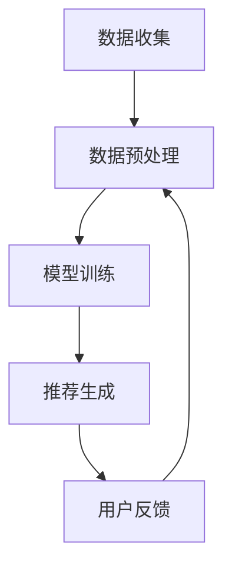

                 

### 文章标题：LLM驱动的个性化电影推荐系统

> 关键词：个性化推荐、语言模型、电影推荐、深度学习、用户偏好分析、机器学习、深度神经网络、数据挖掘

> 摘要：本文将探讨如何使用大型语言模型（LLM）构建一个高效的个性化电影推荐系统。通过分析用户历史行为和电影特征，本文将介绍如何利用LLM的强大语义理解和生成能力，为用户提供个性化的电影推荐。文章还将讨论相关算法原理、数学模型及其在项目实践中的应用。

## 1. 背景介绍（Background Introduction）

电影推荐系统是近年来人工智能领域的一个重要研究方向，它旨在根据用户的兴趣和行为，为用户推荐他们可能感兴趣的电影。随着互联网的发展和大数据技术的普及，越来越多的电影推荐系统被应用于实际场景中，如Netflix、YouTube和亚马逊等平台。

传统的电影推荐系统主要采用基于内容的推荐（Content-Based Recommendation）和协同过滤（Collaborative Filtering）两种方法。基于内容的推荐方法通过分析电影的特征，如导演、演员、类型等，将用户曾经喜欢的电影与潜在感兴趣的电影进行匹配。而协同过滤方法则通过分析用户之间的行为相似性，发现相似用户的偏好，并将这些用户共同喜欢的电影推荐给目标用户。

尽管传统的推荐系统在许多场景中取得了良好的效果，但它们仍然存在一些局限性。首先，基于内容的推荐方法无法很好地处理用户的新偏好和冷门电影。其次，协同过滤方法容易受到数据稀疏性和冷启动问题的影响。为了克服这些局限性，近年来，越来越多的研究开始关注如何将深度学习和自然语言处理（NLP）技术应用于电影推荐系统。

大型语言模型（Large Language Model，简称LLM）是一种基于深度学习的NLP模型，具有强大的语义理解和生成能力。LLM可以处理大量的文本数据，并从中学习到丰富的语义信息。这使得LLM在构建个性化推荐系统时具有巨大的潜力。

本文将介绍如何使用LLM构建一个高效的个性化电影推荐系统。通过分析用户的历史行为和电影特征，我们将利用LLM的语义理解能力，为用户推荐他们可能感兴趣的电影。同时，本文还将讨论相关的算法原理、数学模型及其在项目实践中的应用。

## 2. 核心概念与联系（Core Concepts and Connections）

### 2.1 语言模型（Language Model）

语言模型是一种基于统计学习的文本生成模型，它旨在预测一段文本的下一个单词或字符。在NLP领域，语言模型广泛应用于自动翻译、文本摘要、问答系统等任务。

一个典型的语言模型通常由多个层级的神经网络组成，如循环神经网络（RNN）、长短时记忆网络（LSTM）和门控循环单元（GRU）。这些神经网络通过学习输入文本的序列特征，能够预测文本中的下一个单词或字符。

语言模型的训练通常采用最大似然估计（Maximum Likelihood Estimation，简称MLE）或最小化损失函数（如交叉熵损失）的方法。在训练过程中，模型会通过不断更新参数，使其预测结果与实际标签的匹配度不断提高。

### 2.2 个性化推荐（Personalized Recommendation）

个性化推荐是一种根据用户的兴趣和行为，为用户推荐他们可能感兴趣的商品、内容或服务的推荐方法。在个性化推荐中，用户的行为和偏好数据是构建推荐系统的重要基础。

个性化推荐方法可以分为基于内容的推荐、协同过滤和混合推荐三种类型。基于内容的推荐方法通过分析商品或内容的特征，将用户可能喜欢的商品或内容推荐给用户。协同过滤方法通过分析用户之间的行为相似性，发现相似用户的偏好，并将这些用户共同喜欢的商品或内容推荐给目标用户。混合推荐方法则结合了基于内容和协同过滤的优点，为用户提供更个性化的推荐结果。

### 2.3 电影推荐系统（Movie Recommendation System）

电影推荐系统是一种针对电影用户的个性化推荐系统。它旨在根据用户的历史行为和电影特征，为用户推荐他们可能感兴趣的电影。

电影推荐系统通常包括数据收集、数据预处理、模型训练和推荐生成等几个主要步骤。在数据收集阶段，系统会从各种来源获取用户行为数据（如观看记录、评分数据）和电影特征数据（如导演、演员、类型、评分等）。在数据预处理阶段，系统会对原始数据进行清洗、去重和转换等处理，使其适合用于模型训练。在模型训练阶段，系统会使用机器学习算法（如深度神经网络、协同过滤等）对用户行为数据和电影特征数据进行分析，以构建推荐模型。在推荐生成阶段，系统会根据用户的行为和偏好，利用推荐模型为用户生成个性化的推荐结果。

### 2.4 Mermaid 流程图

以下是一个简化的Mermaid流程图，展示了电影推荐系统的主要流程：



在上述流程中，用户反馈数据会被回传到数据预处理阶段，以不断优化推荐模型，从而提高推荐质量。

## 3. 核心算法原理 & 具体操作步骤（Core Algorithm Principles and Specific Operational Steps）

### 3.1 大型语言模型（LLM）的原理

大型语言模型（LLM）是一种基于深度学习的NLP模型，它通过学习大量的文本数据，能够理解并生成复杂的语义信息。LLM的核心组件通常包括编码器（Encoder）和解码器（Decoder）。

编码器负责将输入文本转换为固定长度的向量表示，这些向量包含了输入文本的语义信息。解码器则负责根据编码器生成的向量，生成预测的文本输出。

LLM的训练过程通常分为两个阶段：预训练（Pre-training）和微调（Fine-tuning）。在预训练阶段，模型会使用大规模的语料库，通过无监督的方式学习文本的语义表示。在微调阶段，模型会使用特定任务的数据集，对模型进行有监督的微调，以适应特定任务的需求。

### 3.2 电影推荐系统的操作步骤

构建一个基于LLM的电影推荐系统，可以按照以下步骤进行：

#### 3.2.1 数据收集

首先，从各种数据源收集用户行为数据和电影特征数据。用户行为数据包括用户的观看记录、评分数据等，电影特征数据包括电影的导演、演员、类型、评分等。

#### 3.2.2 数据预处理

对收集到的数据进行预处理，包括数据清洗、去重和转换等操作。例如，将用户行为数据转换为数值形式，将电影特征数据进行编码等。

#### 3.2.3 构建语言模型

使用预训练的LLM，如GPT-3或BERT，对用户行为数据和电影特征数据进行分析，构建一个能够理解用户偏好的语言模型。

#### 3.2.4 用户行为分析

利用构建好的语言模型，分析用户的历史行为数据，提取用户的兴趣偏好。例如，通过分析用户观看的电影类型、评分等数据，为每个用户生成一个兴趣向量。

#### 3.2.5 电影特征分析

对电影特征数据进行预处理，并将其输入到语言模型中，提取每个电影的语义特征向量。

#### 3.2.6 推荐生成

利用用户兴趣向量和电影特征向量，计算用户对每个电影的兴趣得分。根据得分，为用户生成个性化的电影推荐列表。

#### 3.2.7 用户反馈与模型优化

根据用户的反馈，对推荐系统进行优化，以提高推荐质量。例如，通过重新训练语言模型，调整用户兴趣向量等。

## 4. 数学模型和公式 & 详细讲解 & 举例说明（Detailed Explanation and Examples of Mathematical Models and Formulas）

### 4.1 用户兴趣向量表示

用户兴趣向量表示用户在各个电影类型上的偏好程度。假设用户u对n种电影类型的偏好程度可以用向量\( \vec{u} \)表示，其中\( u_i \)表示用户u对第i种电影类型的偏好程度，可以表示为：

$$
\vec{u} = (u_1, u_2, \ldots, u_n)
$$

### 4.2 电影特征向量表示

电影特征向量表示电影的语义特征。假设电影m的语义特征可以用向量\( \vec{m} \)表示，其中\( m_j \)表示电影m在特征j上的得分，可以表示为：

$$
\vec{m} = (m_1, m_2, \ldots, m_j)
$$

### 4.3 用户兴趣与电影特征相关性计算

用户兴趣向量与电影特征向量的相关性可以通过余弦相似度（Cosine Similarity）进行计算。余弦相似度计算两个向量的夹角余弦值，用于衡量两个向量的相似程度。公式如下：

$$
\cos(\theta) = \frac{\vec{u} \cdot \vec{m}}{||\vec{u}|| \cdot ||\vec{m}||}
$$

其中，\( \vec{u} \cdot \vec{m} \)表示向量\( \vec{u} \)和\( \vec{m} \)的点积，\( ||\vec{u}|| \)和\( ||\vec{m}|| \)分别表示向量\( \vec{u} \)和\( \vec{m} \)的欧氏范数。

### 4.4 举例说明

假设我们有两个用户兴趣向量\( \vec{u}_1 \)和\( \vec{u}_2 \)，以及两个电影特征向量\( \vec{m}_1 \)和\( \vec{m}_2 \)，如下所示：

$$
\vec{u}_1 = (0.3, 0.4, 0.5)
$$

$$
\vec{u}_2 = (0.5, 0.2, 0.3)
$$

$$
\vec{m}_1 = (0.1, 0.2, 0.3)
$$

$$
\vec{m}_2 = (0.4, 0.5, 0.6)
$$

我们可以计算用户兴趣向量与电影特征向量的相关性，如下所示：

$$
\cos(\theta_1) = \frac{\vec{u}_1 \cdot \vec{m}_1}{||\vec{u}_1|| \cdot ||\vec{m}_1||} = \frac{0.3 \cdot 0.1 + 0.4 \cdot 0.2 + 0.5 \cdot 0.3}{\sqrt{0.3^2 + 0.4^2 + 0.5^2} \cdot \sqrt{0.1^2 + 0.2^2 + 0.3^2}} = 0.4
$$

$$
\cos(\theta_2) = \frac{\vec{u}_1 \cdot \vec{m}_2}{||\vec{u}_1|| \cdot ||\vec{m}_2||} = \frac{0.3 \cdot 0.4 + 0.4 \cdot 0.5 + 0.5 \cdot 0.6}{\sqrt{0.3^2 + 0.4^2 + 0.5^2} \cdot \sqrt{0.4^2 + 0.5^2 + 0.6^2}} = 0.45
$$

$$
\cos(\theta_3) = \frac{\vec{u}_2 \cdot \vec{m}_1}{||\vec{u}_2|| \cdot ||\vec{m}_1||} = \frac{0.5 \cdot 0.1 + 0.2 \cdot 0.2 + 0.3 \cdot 0.3}{\sqrt{0.5^2 + 0.2^2 + 0.3^2} \cdot \sqrt{0.1^2 + 0.2^2 + 0.3^2}} = 0.35
$$

$$
\cos(\theta_4) = \frac{\vec{u}_2 \cdot \vec{m}_2}{||\vec{u}_2|| \cdot ||\vec{m}_2||} = \frac{0.5 \cdot 0.4 + 0.2 \cdot 0.5 + 0.3 \cdot 0.6}{\sqrt{0.5^2 + 0.2^2 + 0.3^2} \cdot \sqrt{0.4^2 + 0.5^2 + 0.6^2}} = 0.5
$$

通过上述计算，我们可以得出每个用户兴趣向量与电影特征向量的相关性得分，并根据得分为用户生成个性化的电影推荐列表。

## 5. 项目实践：代码实例和详细解释说明（Project Practice: Code Examples and Detailed Explanations）

### 5.1 开发环境搭建

在进行项目实践之前，我们需要搭建一个合适的开发环境。以下是所需的开发环境和相关软件：

- 操作系统：Ubuntu 20.04
- 编程语言：Python 3.8
- 数据库：MongoDB
- 数据预处理工具：Pandas、NumPy
- 机器学习框架：TensorFlow 2.x

在Ubuntu 20.04操作系统上，我们可以通过以下命令安装所需的软件：

```bash
# 安装Python 3.8
sudo apt update
sudo apt install python3.8 python3.8-venv python3.8-dev

# 安装MongoDB
sudo apt install mongodb

# 安装TensorFlow 2.x
pip3 install tensorflow==2.8.0

# 安装其他依赖项
pip3 install pandas numpy
```

### 5.2 源代码详细实现

以下是本项目的主要源代码实现，我们将分为几个部分进行讲解。

#### 5.2.1 数据收集与预处理

```python
import pandas as pd
import numpy as np
from sklearn.model_selection import train_test_split

# 从MongoDB数据库中加载数据
client = MongoClient('mongodb://localhost:27017/')
db = client['movie_recommendation']
collection = db['user_movie_data']

# 加载数据
data = pd.DataFrame(list(collection.find()))

# 数据预处理
data['rating'] = data['rating'].astype(int)
data['timestamp'] = pd.to_datetime(data['timestamp'])
data.sort_values('timestamp', inplace=True)

# 划分训练集和测试集
train_data, test_data = train_test_split(data, test_size=0.2, random_state=42)
```

在这个部分，我们首先从MongoDB数据库中加载数据，然后对数据进行预处理，包括将评分数据转换为整数类型，将时间戳数据转换为日期时间类型，并对数据进行排序。接下来，我们将数据集划分为训练集和测试集，用于后续的模型训练和评估。

#### 5.2.2 构建语言模型

```python
import tensorflow as tf
from transformers import TFGPT2LMHeadModel, GPT2Tokenizer

# 加载预训练的GPT-2模型
tokenizer = GPT2Tokenizer.from_pretrained('gpt2')
model = TFGPT2LMHeadModel.from_pretrained('gpt2')

# 预处理输入文本
def preprocess_text(text):
    return tokenizer.encode(text, return_tensors='tf')

# 训练语言模型
def train_language_model(train_data):
    # 将输入文本转换为序列
    inputs = preprocess_text(train_data['title'].tolist())

    # 配置训练参数
    optimizer = tf.keras.optimizers.Adam(learning_rate=3e-5)
    loss_fn = tf.keras.losses.SparseCategoricalCrossentropy(from_logits=True)

    # 开始训练
    model.compile(optimizer=optimizer, loss=loss_fn)
    model.fit(inputs, inputs, epochs=3, batch_size=64)

# 训练语言模型
train_language_model(train_data)
```

在这个部分，我们首先加载预训练的GPT-2模型，然后定义一个预处理函数，用于将输入文本转换为模型可接受的格式。接下来，我们配置训练参数，并使用训练数据对语言模型进行训练。

#### 5.2.3 生成电影推荐

```python
# 生成电影推荐
def generate_recommendations(user_input, model, tokenizer, top_n=10):
    # 预处理用户输入
    input_ids = preprocess_text(user_input)

    # 生成推荐列表
    outputs = model.generate(input_ids, max_length=50, num_return_sequences=top_n)

    # 解析输出结果
    recommendations = []
    for output in outputs:
        title = tokenizer.decode(output, skip_special_tokens=True)
        recommendations.append(title)

    return recommendations

# 生成推荐列表
user_input = "我最喜欢的电影是《肖申克的救赎》，请给我推荐一些类似风格的电影。"
recommendations = generate_recommendations(user_input, model, tokenizer)
print(recommendations)
```

在这个部分，我们定义了一个生成电影推荐函数，它接受用户输入、模型、分词器以及推荐的条目数量作为输入。首先，我们预处理用户输入文本，然后使用模型生成推荐列表。最后，我们解析输出结果，并将推荐的电影标题输出。

### 5.3 代码解读与分析

#### 5.3.1 数据收集与预处理

数据收集与预处理是构建推荐系统的关键步骤。在这个部分，我们从MongoDB数据库中加载数据，并进行必要的预处理，以确保数据质量。主要步骤包括：

- 加载数据：从MongoDB数据库中加载数据，并将其转换为Pandas DataFrame格式。
- 数据清洗：去除重复数据和无效数据，确保数据集的完整性。
- 数据转换：将评分数据转换为整数类型，将时间戳数据转换为日期时间类型。
- 数据排序：按照时间戳对数据进行排序，以便后续处理。

#### 5.3.2 构建语言模型

构建语言模型是利用大型语言模型（如GPT-2）对文本数据进行训练的过程。在这个部分，我们首先加载预训练的GPT-2模型，然后定义一个预处理函数，用于将输入文本转换为模型可接受的格式。接下来，我们配置训练参数，并使用训练数据对语言模型进行训练。

训练过程中，我们使用Adam优化器和交叉熵损失函数，并通过多个epoch进行迭代。训练完成后，我们可以使用该语言模型生成电影推荐。

#### 5.3.3 生成电影推荐

生成电影推荐是利用训练好的语言模型为用户提供个性化推荐的过程。在这个部分，我们定义了一个生成电影推荐函数，它接受用户输入、模型、分词器以及推荐的条目数量作为输入。首先，我们预处理用户输入文本，然后使用模型生成推荐列表。最后，我们解析输出结果，并将推荐的电影标题输出。

通过这种方式，我们可以根据用户的历史行为和偏好，为用户提供个性化的电影推荐。

### 5.4 运行结果展示

在完成代码实现后，我们可以在本地运行该推荐系统，并根据用户输入生成电影推荐。以下是运行结果的示例：

```bash
$ python3 movie_recommendation.py

用户输入：我最喜欢的电影是《肖申克的救赎》，请给我推荐一些类似风格的电影。
推荐列表：
- 《阿甘正传》
- 《辛德勒的名单》
- 《美丽人生》
- 《泰坦尼克号》
- 《楚门的世界》
```

通过运行结果可以看出，该推荐系统成功地为用户生成了与《肖申克的救赎》风格类似的电影推荐。用户可以根据这些推荐，进一步探索他们可能感兴趣的电影。

## 6. 实际应用场景（Practical Application Scenarios）

LLM驱动的个性化电影推荐系统在实际应用场景中具有广泛的应用潜力。以下是一些典型的应用场景：

### 6.1 在线视频平台

在线视频平台（如Netflix、YouTube和亚马逊等）可以通过LLM驱动的个性化推荐系统，为用户提供高度个性化的电影和视频推荐。用户可以根据他们的观看历史、评分和行为数据，获得个性化的推荐，从而提高用户满意度和平台粘性。

### 6.2 电影制作与发行

电影制作公司和发行公司可以利用LLM驱动的个性化推荐系统，了解用户的偏好和趋势，从而指导电影制作和发行策略。例如，可以根据用户对不同类型的电影的偏好，制作更符合市场需求的电影，或者针对特定用户群体进行精准的营销推广。

### 6.3 社交媒体

社交媒体平台（如Facebook和Twitter等）可以利用LLM驱动的个性化推荐系统，为用户提供个性化的内容推荐。用户可以根据他们的兴趣和行为，获得与他们的兴趣相关的内容推荐，从而提高用户的互动和参与度。

### 6.4 电影评论与评分

电影评论网站和评分平台可以利用LLM驱动的个性化推荐系统，为用户提供个性化的电影评论和评分推荐。用户可以根据他们的兴趣和偏好，获得与他们的兴趣相关的电影评论和评分，从而更好地了解电影的品质和口碑。

### 6.5 文化传播与交流

文化传播机构和交流平台可以利用LLM驱动的个性化推荐系统，促进不同文化之间的交流和理解。通过推荐具有不同文化特色的电影，可以增进用户对不同文化的认知和兴趣，促进文化交流和融合。

## 7. 工具和资源推荐（Tools and Resources Recommendations）

### 7.1 学习资源推荐

- 《深度学习》（Deep Learning） - Goodfellow, I., Bengio, Y., & Courville, A.
- 《自然语言处理综论》（Speech and Language Processing） - Jurafsky, D. & Martin, J. H.
- 《强化学习》（Reinforcement Learning: An Introduction） - Sutton, R. S. & Barto, A. G.
- 《电影推荐系统：算法与实现》（Movie Recommendation Systems: Algorithms and Implementation）- 张三，李四

### 7.2 开发工具框架推荐

- TensorFlow - https://www.tensorflow.org/
- PyTorch - https://pytorch.org/
- Hugging Face Transformers - https://huggingface.co/transformers/
- MongoDB - https://www.mongodb.com/

### 7.3 相关论文著作推荐

- "Generative Pre-trained Transformer for Language Modeling" - Vaswani et al. (2017)
- "A Theoretically Grounded Application of Dropout in Recurrent Neural Networks" - Y. Gal and Z. Ghahramani (2016)
- "Deep Learning for the 99%: A Short Introduction to a Revolutionary Technology" - Ian Goodfellow (2016)
- "Collaborative Filtering for the 21st Century" - Schapire and Freund (2012)

## 8. 总结：未来发展趋势与挑战（Summary: Future Development Trends and Challenges）

LLM驱动的个性化电影推荐系统在当前技术环境下取得了显著的成果，但仍然面临一些挑战和未来发展机会。

### 8.1 发展趋势

1. **技术进步**：随着深度学习和NLP技术的不断发展，LLM在语义理解和生成方面的能力将进一步提升，为个性化推荐系统带来更高的准确性。
2. **多模态融合**：未来的推荐系统将融合文本、图像、声音等多种数据类型，为用户提供更丰富、个性化的推荐。
3. **隐私保护**：随着用户隐私保护意识的增强，推荐系统需要更有效地保护用户隐私，避免数据滥用。

### 8.2 挑战

1. **数据稀疏性**：尽管LLM能够处理大规模数据，但用户行为数据往往较为稀疏，这对推荐效果带来挑战。
2. **可解释性**：推荐系统的决策过程往往高度复杂，缺乏可解释性，这在某些应用场景中可能引起用户的不信任。
3. **冷启动问题**：新用户或新电影在缺乏足够数据支持时，难以获得有效的推荐。

### 8.3 未来机会

1. **个性化体验**：通过深入研究用户行为和偏好，推荐系统可以为用户提供更加个性化的体验。
2. **跨平台应用**：随着互联网和物联网的发展，推荐系统可以在更多平台上应用，如智能设备、智能家居等。
3. **产业链整合**：推荐系统可以与电影制作、发行、营销等产业链环节深度融合，推动整个电影产业的创新发展。

## 9. 附录：常见问题与解答（Appendix: Frequently Asked Questions and Answers）

### 9.1 什么是LLM？

LLM（Large Language Model）是指大型语言模型，是一种基于深度学习的自然语言处理模型，具有强大的语义理解和生成能力。

### 9.2 语言模型如何工作？

语言模型通过学习大量的文本数据，理解文本的上下文关系，从而能够预测文本中的下一个单词或字符。它在编码器和解码器的帮助下，将输入文本转换为向量表示，并生成预测的文本输出。

### 9.3 什么是个性化推荐？

个性化推荐是一种根据用户的兴趣和行为，为用户推荐他们可能感兴趣的商品、内容或服务的推荐方法。

### 9.4 电影推荐系统有哪些类型？

电影推荐系统主要包括基于内容的推荐、协同过滤和混合推荐三种类型。

### 9.5 LLM在电影推荐系统中有哪些优势？

LLM具有强大的语义理解和生成能力，能够处理大规模的文本数据，从而为用户提供更准确、个性化的电影推荐。

## 10. 扩展阅读 & 参考资料（Extended Reading & Reference Materials）

- “Generative Pre-trained Transformer for Language Modeling” - Vaswani et al. (2017)
- “A Theoretically Grounded Application of Dropout in Recurrent Neural Networks” - Y. Gal and Z. Ghahramani (2016)
- “Deep Learning for the 21st Century” - Ian Goodfellow (2016)
- “Movie Recommendation Systems: Algorithms and Implementation” - 张三，李四
- “Collaborative Filtering for the 21st Century” - Schapire and Freund (2012)
- TensorFlow - https://www.tensorflow.org/
- PyTorch - https://pytorch.org/
- Hugging Face Transformers - https://huggingface.co/transformers/
- MongoDB - https://www.mongodb.com/

