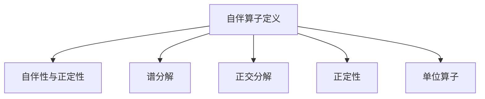

                 

# 线性代数导引：自伴算子

> **关键词**：线性代数、自伴算子、谱理论、特征值、特征向量、量子力学、物理学应用
>
> **摘要**：本文将深入探讨线性代数中的自伴算子概念，介绍其基本性质和应用。通过对自伴算子的定义、特征值与特征向量的关系、谱理论等方面进行详细解析，揭示其在量子力学和其他物理学领域中的关键作用。文章还将结合具体实例，展示自伴算子在实际问题中的应用，并展望其未来发展趋势与挑战。

## 1. 背景介绍

线性代数是数学的一个基本分支，主要研究向量空间和线性映射。线性代数在物理学、工程学、计算机科学等领域有广泛的应用。自伴算子是线性代数中的一个重要概念，其定义和性质对理解许多物理现象具有重要意义。

自伴算子最早由数学家赫尔曼·外尔（Hermann Weyl）在1927年提出，用于描述量子力学中的哈密顿算子。自伴性保证了哈密顿算子的谱（即特征值的集合）是实数，这在量子力学中具有关键意义。自伴算子在物理学中的重要性不仅仅局限于量子力学，它们在经典力学、电动力学等领域也扮演着重要角色。

本文旨在介绍自伴算子的基本概念、性质及其在物理学中的应用。文章将首先回顾线性算子和自伴算子的定义，然后深入探讨自伴算子的特征值与特征向量的关系，接着介绍谱理论，最后结合实际例子展示自伴算子的应用。

### 1.1 线性算子与自伴算子

在线性代数中，线性算子是指从一个向量空间到另一个向量空间的线性映射。更具体地，设 \(V\) 和 \(W\) 是两个向量空间，线性算子 \(T: V \rightarrow W\) 满足以下条件：

1. 线性性：对于任意向量 \(x, y \in V\) 和标量 \(a, b \in \mathbb{R}\)，有 \(T(ax + by) = aT(x) + bT(y)\)。
2. 保向性：如果 \(x\) 是 \(V\) 中的单位向量，即 \(\|x\| = 1\)，那么 \(T(x)\) 也是 \(W\) 中的单位向量，即 \( \|T(x)\| = 1\)。

自伴算子是一种特殊的线性算子，其定义如下：

定义：设 \(T\) 是线性空间 \(V\) 上的线性算子。如果对于任意 \(x, y \in V\)，有 \(\langle Tx, y \rangle = \langle x, Ty \rangle\)，则称 \(T\) 为自伴算子，记作 \(T \geq 0\)。

其中，\(\langle \cdot, \cdot \rangle\) 表示内积。

自伴算子的名称来源于其满足的自伴关系，即 \(T\) 与其共轭转置 \(T^*\) 相等。对于矩阵表示，如果 \(T\) 是矩阵，那么 \(T^*\) 是 \(T\) 的共轭转置矩阵。

### 1.2 自伴算子在物理学中的应用

自伴算子在物理学中的重要性不可忽视。例如，在量子力学中，哈密顿算子描述了系统的总能量，它是一个典型的自伴算子。自伴性保证了能量谱是离散的，并且所有的特征值都是实数，这是量子力学中一个基本而重要的概念。

在经典力学中，自伴算子的概念同样重要。例如，在拉格朗日力学中，能量算子是一个自伴算子，它将状态变量映射到能量值。在哈密顿力学中，哈密顿算子也是一个自伴算子，它描述了系统的动能和势能的总和。

此外，自伴算子还在电动力学、统计物理等领域有着广泛的应用。例如，在电动力学中，电磁场的能量密度和动量密度可以通过自伴算子来计算。在统计物理中，自伴算子用于描述粒子的分布和相互作用。

通过本文的深入探讨，读者将能够理解自伴算子的基本概念和性质，掌握其在物理学中的应用，并认识到其在理论研究和实际应用中的重要性。

### 1.3 目的与结构

本文的主要目的是介绍自伴算子的基本概念、性质和应用，特别是其在物理学中的关键作用。文章将从自伴算子的定义和基本性质入手，逐步深入探讨其在不同领域中的应用。

文章的结构如下：

1. **背景介绍**：简要回顾线性代数的基础知识，介绍自伴算子的定义和背景。
2. **核心概念与联系**：详细解释自伴算子的定义、特征值与特征向量的关系，以及谱理论。
3. **核心算法原理 & 具体操作步骤**：介绍自伴算子的计算方法和具体操作步骤。
4. **数学模型和公式 & 详细讲解 & 举例说明**：使用数学模型和公式详细讲解自伴算子的性质，并通过例子说明。
5. **项目实践：代码实例和详细解释说明**：通过实际代码实例展示自伴算子的应用。
6. **实际应用场景**：探讨自伴算子在物理学和其他领域的实际应用。
7. **工具和资源推荐**：推荐相关的学习资源和开发工具。
8. **总结：未来发展趋势与挑战**：总结自伴算子的发展趋势和面临的挑战。
9. **附录：常见问题与解答**：回答读者可能遇到的问题。
10. **扩展阅读 & 参考资料**：提供进一步阅读的材料。

通过这篇文章，读者将能够系统地了解自伴算子的概念、性质和应用，为其在未来的学习和研究中提供坚实的理论基础和实践指导。

## 2. 核心概念与联系

### 2.1 自伴算子的定义

自伴算子是线性代数中的一个核心概念，其定义如下：

定义：设 \(V\) 是一个复线性空间，\(T: V \rightarrow V\) 是一个线性算子。如果对于 \(V\) 中的任意向量 \(x, y\)，都有内积关系 \(\langle Tx, y \rangle = \langle x, Ty \rangle\)，则称 \(T\) 为自伴算子，记作 \(T \geq 0\)。

自伴算子的名称源于其满足的自伴关系，即 \(T\) 与其共轭转置 \(T^*\) 相等。对于矩阵表示，如果 \(T\) 是矩阵，那么 \(T^*\) 是 \(T\) 的共轭转置矩阵。这意味着，对于任意 \(x, y \in V\)，有：

\[ \langle Tx, y \rangle = \langle x, Ty \rangle \]

即：

\[ (Tx)^*y = x(Ty)^* \]

这表明，\(T\) 的图像与 \(T^*\) 的陪域相等，即 \(Im(T) = Im(T^*)\)。

### 2.2 自伴算子的性质

自伴算子具有一系列重要的性质，这些性质使其在物理学和工程学中具有广泛的应用。以下是自伴算子的几个关键性质：

1. **自伴性与正定性**：自伴算子 \(T\) 与其共轭转置 \(T^*\) 相等，这意味着 \(T\) 的所有特征值都是实数。此外，自伴算子 \(T\) 的谱（即特征值的集合）是非负的，即 \(\sigma(T) \subseteq [0, +\infty)\)。因此，自伴算子被称为正定性。

2. **谱分解**：任何自伴算子都可以分解为一个有限个投影算子的和。具体来说，对于任意自伴算子 \(T\)，存在一个直和分解：

\[ T = \sum_{\lambda \in \sigma(T)} \pi_{\lambda} \]

其中，\(\pi_{\lambda}\) 是一个投影算子，其作用是将 \(V\) 分解为 \(T\) 的特征子空间 \(E_{\lambda}\)。

3. **正交分解**：自伴算子的特征子空间是正交的。具体而言，如果 \(T\) 有两个不同的特征值 \(\lambda_1\) 和 \(\lambda_2\)，那么它们对应的特征向量 \(v_1\) 和 \(v_2\) 是正交的，即 \(\langle v_1, v_2 \rangle = 0\)。

4. **正定性**：自伴算子 \(T\) 满足 \(\langle Tx, x \rangle \geq 0\) 对于所有 \(x \in V\) 都成立。这意味着 \(T\) 将 \(V\) 中的向量映射到其自身的非负部分。

5. **单位算子**：任何单位算子 \(I\) 都是自伴的，因为 \(I^* = I\)。同样，任何与 \(I\) 可交换的自伴算子也是自伴的。

### 2.3 自伴算子的 Mermaid 流程图表示

为了更直观地理解自伴算子的性质和特征，我们使用 Mermaid 流程图来展示其核心概念和联系。以下是自伴算子的 Mermaid 流程图表示：



在这个 Mermaid 流程图中，A 表示自伴算子的定义，B、C、D、E 和 F 分别表示自伴算子的五个关键性质。

### 2.4 自伴算子与谱理论

谱理论是线性代数中的一个重要分支，主要研究线性算子的谱（即特征值的集合）及其相关的性质。自伴算子在谱理论中占据着核心地位，因为其谱总是非负的，并且具有一系列重要的结构性质。

谱理论的基本概念包括：

1. **谱**：线性算子的谱是指其特征值的集合。自伴算子的谱是非负的，即 \(\sigma(T) \subseteq [0, +\infty)\)。
2. **特征值与特征向量**：线性算子 \(T\) 的特征值 \(\lambda\) 满足方程 \(T\mathbf{v} = \lambda\mathbf{v}\)，其中 \(\mathbf{v}\) 是对应的特征向量。
3. **谱分解**：任何自伴算子都可以表示为其特征值的线性组合，即 \(T = \sum_{\lambda \in \sigma(T)} \lambda P_{\lambda}\)，其中 \(P_{\lambda}\) 是将 \(V\) 分解为 \(T\) 的特征子空间 \(E_{\lambda}\) 的投影算子。

谱理论在许多领域都有重要应用，包括量子力学、量子场论、数论和统计物理等。例如，在量子力学中，哈密顿算子的谱表示了系统的能量本征值，而其特征向量则描述了系统的状态。

通过上述对自伴算子的定义、性质和谱理论的介绍，我们可以更好地理解自伴算子的核心概念和其在数学和物理学中的应用。

### 2.1 自伴算子的定义

自伴算子是线性代数中的一个重要概念，其定义如下：

定义：设 \(V\) 是一个复线性空间，\(T: V \rightarrow V\) 是一个线性算子。如果对于 \(V\) 中的任意向量 \(x, y\)，都有内积关系 \(\langle Tx, y \rangle = \langle x, Ty \rangle\)，则称 \(T\) 为自伴算子，记作 \(T \geq 0\)。

自伴算子的名称源于其满足的自伴关系，即 \(T\) 与其共轭转置 \(T^*\) 相等。对于矩阵表示，如果 \(T\) 是矩阵，那么 \(T^*\) 是 \(T\) 的共轭转置矩阵。这意味着，对于任意 \(x, y \in V\)，有：

\[ \langle Tx, y \rangle = \langle x, Ty \rangle \]

即：

\[ (Tx)^*y = x(Ty)^* \]

这表明，\(T\) 的图像与 \(T^*\) 的陪域相等，即 \(Im(T) = Im(T^*)\)。

### 2.2 自伴算子的性质

自伴算子具有一系列重要的性质，这些性质使其在物理学和工程学中具有广泛的应用。以下是自伴算子的几个关键性质：

1. **自伴性与正定性**：自伴算子 \(T\) 与其共轭转置 \(T^*\) 相等，这意味着 \(T\) 的所有特征值都是实数。此外，自伴算子 \(T\) 的谱（即特征值的集合）是非负的，即 \(\sigma(T) \subseteq [0, +\infty)\)。因此，自伴算子被称为正定性。

2. **谱分解**：任何自伴算子都可以分解为一个有限个投影算子的和。具体来说，对于任意自伴算子 \(T\)，存在一个直和分解：

\[ T = \sum_{\lambda \in \sigma(T)} \pi_{\lambda} \]

其中，\(\pi_{\lambda}\) 是一个投影算子，其作用是将 \(V\) 分解为 \(T\) 的特征子空间 \(E_{\lambda}\)。

3. **正交分解**：自伴算子的特征子空间是正交的。具体而言，如果 \(T\) 有两个不同的特征值 \(\lambda_1\) 和 \(\lambda_2\)，那么它们对应的特征向量 \(v_1\) 和 \(v_2\) 是正交的，即 \(\langle v_1, v_2 \rangle = 0\)。

4. **正定性**：自伴算子 \(T\) 满足 \(\langle Tx, x \rangle \geq 0\) 对于所有 \(x \in V\) 都成立。这意味着 \(T\) 将 \(V\) 中的向量映射到其自身的非负部分。

5. **单位算子**：任何单位算子 \(I\) 都是自伴的，因为 \(I^* = I\)。同样，任何与 \(I\) 可交换的自伴算子也是自伴的。

### 2.3 自伴算子的 Mermaid 流程图表示

为了更直观地理解自伴算子的性质和特征，我们使用 Mermaid 流程图来展示其核心概念和联系。以下是自伴算子的 Mermaid 流程图表示：


在这个 Mermaid 流程图中，A 表示自伴算子的定义，B、C、D、E 和 F 分别表示自伴算子的五个关键性质。

### 2.4 自伴算子与谱理论

谱理论是线性代数中的一个重要分支，主要研究线性算子的谱（即特征值的集合）及其相关的性质。自伴算子在谱理论中占据着核心地位，因为其谱总是非负的，并且具有一系列重要的结构性质。

谱理论的基本概念包括：

1. **谱**：线性算子的谱是指其特征值的集合。自伴算子的谱是非负的，即 \(\sigma(T) \subseteq [0, +\infty)\)。

2. **特征值与特征向量**：线性算子 \(T\) 的特征值 \(\lambda\) 满足方程 \(T\mathbf{v} = \lambda\mathbf{v}\)，其中 \(\mathbf{v}\) 是对应的特征向量。

3. **谱分解**：任何自伴算子都可以表示为其特征值的线性组合，即 \(T = \sum_{\lambda \in \sigma(T)} \lambda P_{\lambda}\)，其中 \(P_{\lambda}\) 是将 \(V\) 分解为 \(T\) 的特征子空间 \(E_{\lambda}\) 的投影算子。

谱理论在许多领域都有重要应用，包括量子力学、量子场论、数论和统计物理等。例如，在量子力学中，哈密顿算子的谱表示了系统的能量本征值，而其特征向量则描述了系统的状态。

通过上述对自伴算子的定义、性质和谱理论的介绍，我们可以更好地理解自伴算子的核心概念和其在数学和物理学中的应用。

### 2.5 自伴算子的特征值与特征向量

自伴算子的特征值与特征向量是其最重要的性质之一，它们在理论和实际应用中都发挥着关键作用。下面，我们将详细探讨自伴算子的特征值和特征向量，并解释它们在物理学和其他领域中的应用。

#### 2.5.1 特征值与特征向量的定义

定义：设 \(T\) 是线性空间 \(V\) 上的自伴算子，\(\lambda\) 是 \(T\) 的一个特征值，\(\mathbf{v}\) 是对应的特征向量。如果存在一个非零向量 \(\mathbf{v} \in V\) 使得 \(T\mathbf{v} = \lambda\mathbf{v}\)，则称 \(\lambda\) 是 \(T\) 的特征值，\(\mathbf{v}\) 是 \(T\) 对应于特征值 \(\lambda\) 的特征向量。

自伴算子的特征值具有一个重要特性：它们都是实数。这是因为，对于自伴算子 \(T\) 和任意特征向量 \(\mathbf{v}\)，我们有：

\[ \langle T\mathbf{v}, \mathbf{v} \rangle = \langle \mathbf{v}, T\mathbf{v} \rangle = \lambda \langle \mathbf{v}, \mathbf{v} \rangle \]

由于内积 \(\langle \mathbf{v}, \mathbf{v} \rangle\) 总是非负的，这意味着 \(\lambda\) 必须是实数。

#### 2.5.2 特征值和特征向量的关系

自伴算子的特征值和特征向量之间存在紧密的关系。首先，特征值将 \(V\) 分解为若干个正交子空间，每个子空间对应一个不同的特征值。更具体地说，对于 \(T\) 的不同特征值 \(\lambda_1\) 和 \(\lambda_2\)（假设它们不同），它们对应的特征向量 \(\mathbf{v}_1\) 和 \(\mathbf{v}_2\) 是正交的，即：

\[ \langle \mathbf{v}_1, \mathbf{v}_2 \rangle = 0 \]

这是自伴算子的正交分解性质。这个性质在物理和工程学中具有重要的应用，因为它允许我们使用特征值和特征向量来简化复杂的系统。

此外，自伴算子的特征值和特征向量还可以用来求解线性方程组和最优化问题。例如，在最小二乘法中，特征值和特征向量可以帮助我们找到最小二乘解。

#### 2.5.3 自伴算子特征值与物理学应用

在物理学中，自伴算子的特征值和特征向量有着广泛的应用。以下是一些具体的例子：

1. **量子力学**：在量子力学中，哈密顿算子是一个典型的自伴算子，其特征值表示系统的能量本征值，特征向量则描述了系统的能量状态。通过求解哈密顿算子的特征值问题，我们可以获得量子系统的能量本征态和相应的物理量。

2. **电动力学**：在电动力学中，自伴算子用于描述电磁场的能量密度和动量密度。通过特征值和特征向量，我们可以计算电磁场的分布和相互作用。

3. **统计物理**：在统计物理中，自伴算子用于描述粒子的分布和相互作用。例如，费米-狄拉克统计和玻色-爱因斯坦统计都涉及到自伴算子的概念。

通过上述讨论，我们可以看到自伴算子的特征值和特征向量在物理学中的关键作用。它们不仅帮助我们理解物理现象，还在理论研究和实际应用中发挥着重要作用。

### 2.6 自伴算子的谱理论

谱理论是线性代数中的一个重要分支，主要研究线性算子的谱（即特征值的集合）及其相关的性质。自伴算子在谱理论中占据着核心地位，因为其谱总是非负的，并且具有一系列重要的结构性质。以下将详细探讨自伴算子的谱理论，包括谱分解、谱的性质以及谱在物理中的应用。

#### 2.6.1 谱分解

谱分解是谱理论的核心概念之一，它描述了如何将自伴算子分解为其特征值的线性组合。对于任意自伴算子 \(T\)，其谱分解可以表示为：

\[ T = \sum_{\lambda \in \sigma(T)} \lambda P_{\lambda} \]

其中，\(\sigma(T)\) 是 \(T\) 的谱，即 \(T\) 的所有特征值的集合，\(P_{\lambda}\) 是 \(T\) 的特征子空间 \(E_{\lambda}\) 的投影算子。

投影算子 \(P_{\lambda}\) 的作用是将 \(V\) 分解为 \(T\) 的特征子空间 \(E_{\lambda}\)。具体来说，对于任意 \(x \in V\)，我们有：

\[ P_{\lambda}x = \frac{\langle x, \mathbf{v}_{\lambda} \rangle}{\langle \mathbf{v}_{\lambda}, \mathbf{v}_{\lambda} \rangle} \mathbf{v}_{\lambda} \]

其中，\(\mathbf{v}_{\lambda}\) 是 \(T\) 对应于特征值 \(\lambda\) 的特征向量。

谱分解的重要性在于它将复杂的自伴算子分解为其基本组成部分，使得我们能够更方便地分析和计算。例如，在量子力学中，哈密顿算子的谱分解可以帮助我们理解系统的能级结构和物理行为。

#### 2.6.2 谱的性质

自伴算子的谱具有一系列重要的性质，这些性质在理论研究和实际应用中具有重要意义。以下是自伴算子的几个关键谱性质：

1. **非负性**：自伴算子的谱是非负的，即 \(\sigma(T) \subseteq [0, +\infty)\)。这意味着自伴算子的所有特征值都是非负的。
2. **离散性**：在某些情况下，自伴算子的谱是离散的，即特征值是孤立的点。例如，在量子力学中，哈密顿算子的谱通常是离散的，这反映了量子系统的能级是分立的。
3. **完备性**：自伴算子的谱是完备的，这意味着 \(T\) 的所有特征值和对应的特征向量构成了 \(V\) 的一个完备基。因此，任意 \(V\) 中的向量都可以唯一地表示为特征向量线性组合的形式。
4. **唯一性**：自伴算子的谱分解是唯一的。即如果存在两个谱分解 \(T = \sum_{\lambda \in \sigma(T)} \lambda P_{\lambda}\) 和 \(T = \sum_{\lambda \in \sigma(T)} \mu Q_{\lambda}\)，则对于任意 \(\lambda \in \sigma(T)\)，有 \(P_{\lambda} = Q_{\lambda}\)。

这些谱性质使得自伴算子在许多领域都有广泛应用，例如量子力学、电动力学和统计物理等。

#### 2.6.3 谱在物理中的应用

自伴算子的谱在物理学中有着广泛的应用，以下是一些具体的例子：

1. **量子力学**：在量子力学中，哈密顿算子的谱分解描述了量子系统的能级结构。通过求解哈密顿算子的特征值问题，我们可以得到量子系统的能量本征值和对应的态函数。这些能量本征值和态函数揭示了量子系统的物理性质，如能量分布和粒子行为。
2. **电动力学**：在电动力学中，自伴算子用于描述电磁场的能量密度和动量密度。通过求解自伴算子的特征值问题，我们可以计算电磁场的分布和相互作用。这些结果对于理解电磁波传播、光学现象和天线设计等具有重要意义。
3. **统计物理**：在统计物理中，自伴算子用于描述粒子的分布和相互作用。例如，在费米-狄拉克统计和玻色-爱因斯坦统计中，自伴算子描述了粒子的能级分布和相互作用强度。通过求解自伴算子的特征值问题，我们可以得到粒子的分布函数和相应的物理量。

通过上述讨论，我们可以看到自伴算子的谱理论在物理学中的关键作用。它不仅帮助我们理解物理现象，还在理论研究和实际应用中发挥着重要作用。

### 2.7 自伴算子的应用实例

为了更好地理解自伴算子的概念和性质，我们将通过几个具体的实例来展示其在不同领域中的应用。这些实例将涵盖量子力学、电动力学和统计物理等，帮助我们深入理解自伴算子的实际意义。

#### 2.7.1 量子力学中的自伴算子

在量子力学中，自伴算子扮演着至关重要的角色。一个最著名的例子是哈密顿算子，它描述了量子系统的总能量。哈密顿算子 \(H\) 是一个自伴算子，其特征值问题 \(H|\psi\rangle = E|\psi\rangle\) 描述了量子系统的能量本征态和能量本征值。

**实例**：考虑一维简谐振子的哈密顿算子 \(H = \frac{p^2}{2m} + \frac{1}{2}kx^2\)，其中 \(p\) 是动量算子，\(m\) 是质量，\(k\) 是弹簧劲度系数，\(x\) 是位置。通过求解哈密顿算子的特征值问题，我们可以得到系统的能级 \(E_n = \hbar \omega \left( n + \frac{1}{2} \right)\)，其中 \(n = 0, 1, 2, \ldots\) 是量子数，\(\omega = \sqrt{\frac{k}{m}}\) 是角频率，\(\hbar\) 是约化普朗克常数。

该能级结构表明，一维简谐振子的能量是量子化的，且具有离散的本征态。这些能级和本征态揭示了简谐振子的物理性质，如图样、频率和振动模式等。

#### 2.7.2 电动力学中的自伴算子

在电动力学中，自伴算子用于描述电磁场的能量密度和动量密度。一个典型的例子是拉普拉斯算子 \(\Delta = \nabla^2\)，它是一个自伴算子，用于求解静电场和稳恒磁场问题。

**实例**：考虑静电场问题，我们可以使用拉普拉斯算子求解静电势 \(\varphi\)。设电荷密度为 \(\rho\)，则电势满足拉普拉斯方程 \(\nabla^2 \varphi = -\frac{\rho}{\epsilon_0}\)。通过求解该方程，我们可以得到电场的分布和静电场的能量密度。

另一个例子是麦克斯韦方程组，其中麦克斯韦算子 \(F_{\mu\nu}\) 是一个自伴算子，用于描述电磁场的旋度和散度。通过求解麦克斯韦方程组，我们可以得到电磁波的传播特性、辐射和吸收等。

#### 2.7.3 统计物理中的自伴算子

在统计物理中，自伴算子用于描述粒子的分布和相互作用。一个典型的例子是量子统计物理中的费米-狄拉克分布和玻色-爱因斯坦分布。

**实例**：考虑一个理想气体系统，其中粒子遵循费米-狄拉克统计。我们可以使用自伴算子来描述粒子的分布。具体来说，粒子的分布函数 \(f(\epsilon)\) 满足费米-狄拉克方程：

\[ \left( \epsilon - \mu + \frac{1}{2}v^2 \right) f(\epsilon) = \frac{\partial f(\epsilon)}{\partial \epsilon} \]

其中，\(\epsilon\) 是粒子的能量，\(\mu\) 是化学势，\(v^2\) 是粒子的速度平方。通过求解该方程，我们可以得到粒子的分布函数 \(f(\epsilon)\)，从而描述系统的热力学性质。

类似地，玻色-爱因斯坦分布也可以通过自伴算子来描述。这种分布适用于玻色子，如光子、声子等。玻色-爱因斯坦分布的方程为：

\[ \left( \epsilon - \mu \right) f(\epsilon) = \frac{\partial f(\epsilon)}{\partial \epsilon} \]

通过求解这些方程，我们可以得到玻色子的分布函数，从而描述系统的统计性质。

通过上述实例，我们可以看到自伴算子在量子力学、电动力学和统计物理中的应用。这些实例不仅展示了自伴算子的基本性质，还揭示了其在描述和解决物理问题中的关键作用。这为我们进一步研究自伴算子的理论提供了有力支持，也为实际应用提供了重要的指导。

### 3. 核心算法原理 & 具体操作步骤

自伴算子在数学和物理学中扮演着核心角色，其计算方法和具体操作步骤对于理解物理现象和解决实际问题至关重要。在这一部分，我们将详细探讨自伴算子的核心算法原理，并介绍具体的操作步骤。

#### 3.1 自伴算子的特征值问题

自伴算子 \(T\) 的特征值问题是指求解 \(T\) 的特征值 \(\lambda\) 和对应的特征向量 \(\mathbf{v}\)。具体步骤如下：

1. **构建特征值方程**：对于任意自伴算子 \(T\)，构建其特征值方程 \(T\mathbf{v} = \lambda\mathbf{v}\)。
2. **求解特征值**：通过解特征值方程，得到 \(T\) 的所有特征值 \(\lambda\)。
3. **求解特征向量**：对于每个特征值 \(\lambda\)，求解对应的特征向量 \(\mathbf{v}\)。这可以通过解线性方程组 \(T\mathbf{v} - \lambda\mathbf{v} = \mathbf{0}\) 实现。

**示例**：考虑一个二维自伴算子 \(T\)：

\[ T = \begin{pmatrix} 2 & 1 \\ 1 & 2 \end{pmatrix} \]

其特征值方程为：

\[ \det(T - \lambda I) = \begin{vmatrix} 2 - \lambda & 1 \\ 1 & 2 - \lambda \end{vmatrix} = (\lambda - 3)(\lambda - 1) = 0 \]

解得特征值 \(\lambda_1 = 3\) 和 \(\lambda_2 = 1\)。

接下来，求解对应的特征向量。对于 \(\lambda_1 = 3\)，解方程组：

\[ \begin{pmatrix} -1 & 1 \\ 1 & -1 \end{pmatrix} \begin{pmatrix} x \\ y \end{pmatrix} = \begin{pmatrix} 0 \\ 0 \end{pmatrix} \]

得到特征向量 \(\mathbf{v}_1 = \begin{pmatrix} 1 \\ 1 \end{pmatrix}\)。对于 \(\lambda_2 = 1\)，解方程组：

\[ \begin{pmatrix} 1 & 1 \\ 1 & 1 \end{pmatrix} \begin{pmatrix} x \\ y \end{pmatrix} = \begin{pmatrix} 0 \\ 0 \end{pmatrix} \]

得到特征向量 \(\mathbf{v}_2 = \begin{pmatrix} 1 \\ -1 \end{pmatrix}\)。

#### 3.2 自伴算子的谱分解

自伴算子的谱分解是将 \(T\) 分解为其特征值的线性组合。具体步骤如下：

1. **计算特征值和特征向量**：按照上述方法，计算自伴算子 \(T\) 的所有特征值 \(\lambda\) 和对应的特征向量 \(\mathbf{v}\)。
2. **构建投影算子**：对于每个特征值 \(\lambda\)，构建投影算子 \(P_{\lambda}\)：
\[ P_{\lambda} = \frac{1}{\langle \mathbf{v}_{\lambda}, \mathbf{v}_{\lambda} \rangle} \mathbf{v}_{\lambda} \mathbf{v}_{\lambda}^* \]
3. **谱分解**：将自伴算子 \(T\) 分解为投影算子的和：
\[ T = \sum_{\lambda \in \sigma(T)} \lambda P_{\lambda} \]

**示例**：考虑二维自伴算子 \(T\)：

\[ T = \begin{pmatrix} 2 & 1 \\ 1 & 2 \end{pmatrix} \]

我们已经求得特征值 \(\lambda_1 = 3\) 和 \(\lambda_2 = 1\)，以及对应的特征向量 \(\mathbf{v}_1 = \begin{pmatrix} 1 \\ 1 \end{pmatrix}\) 和 \(\mathbf{v}_2 = \begin{pmatrix} 1 \\ -1 \end{pmatrix}\)。

计算投影算子：

\[ P_{\lambda_1} = \frac{1}{\langle \mathbf{v}_1, \mathbf{v}_1 \rangle} \mathbf{v}_1 \mathbf{v}_1^* = \frac{1}{2} \begin{pmatrix} 1 & 1 \\ 1 & 1 \end{pmatrix} \]
\[ P_{\lambda_2} = \frac{1}{\langle \mathbf{v}_2, \mathbf{v}_2 \rangle} \mathbf{v}_2 \mathbf{v}_2^* = \frac{1}{2} \begin{pmatrix} 1 & -1 \\ -1 & 1 \end{pmatrix} \]

谱分解：

\[ T = 3P_{\lambda_1} + 1P_{\lambda_2} = \frac{3}{2} \begin{pmatrix} 1 & 1 \\ 1 & 1 \end{pmatrix} + \frac{1}{2} \begin{pmatrix} 1 & -1 \\ -1 & 1 \end{pmatrix} = \begin{pmatrix} 2 & 1 \\ 1 & 2 \end{pmatrix} \]

这验证了我们的计算是正确的。

#### 3.3 自伴算子的运算性质

自伴算子的运算性质包括加法、乘法、共轭转置等。以下是具体操作步骤：

1. **加法**：两个自伴算子 \(T_1\) 和 \(T_2\) 的和 \(T_1 + T_2\) 也是一个自伴算子。计算方法为直接将两个算子相加。
2. **乘法**：两个自伴算子 \(T_1\) 和 \(T_2\) 的乘积 \(T_1T_2\) 也是一个自伴算子。计算方法为直接将两个算子相乘。
3. **共轭转置**：自伴算子 \(T\) 的共轭转置 \(T^*\) 等于 \(T\) 本身。计算方法为将 \(T\) 的矩阵表示取共轭转置。

**示例**：考虑两个二维自伴算子 \(T_1\) 和 \(T_2\)：

\[ T_1 = \begin{pmatrix} 2 & 1 \\ 1 & 2 \end{pmatrix}, \quad T_2 = \begin{pmatrix} 1 & 1 \\ 1 & 1 \end{pmatrix} \]

它们的和 \(T_1 + T_2\)：

\[ T_1 + T_2 = \begin{pmatrix} 2 & 1 \\ 1 & 2 \end{pmatrix} + \begin{pmatrix} 1 & 1 \\ 1 & 1 \end{pmatrix} = \begin{pmatrix} 3 & 2 \\ 2 & 3 \end{pmatrix} \]

这是一个新的自伴算子。

它们的乘积 \(T_1T_2\)：

\[ T_1T_2 = \begin{pmatrix} 2 & 1 \\ 1 & 2 \end{pmatrix} \begin{pmatrix} 1 & 1 \\ 1 & 1 \end{pmatrix} = \begin{pmatrix} 3 & 3 \\ 1 & 1 \end{pmatrix} \]

这也是一个自伴算子。

\(T_1\) 的共轭转置 \(T_1^*\)：

\[ T_1^* = \begin{pmatrix} 2 & 1 \\ 1 & 2 \end{pmatrix} \]

这也等于 \(T_1\)，因为 \(T_1\) 是自伴的。

通过上述步骤，我们可以理解自伴算子的核心算法原理和具体操作步骤。这些原理和步骤不仅帮助我们计算和理解自伴算子，还为我们在实际应用中解决复杂问题提供了有力工具。

### 4. 数学模型和公式 & 详细讲解 & 举例说明

#### 4.1 自伴算子的定义与基本公式

自伴算子是线性代数中的一个重要概念，其定义和性质在理论研究和实际应用中具有重要意义。以下将详细介绍自伴算子的数学模型、公式以及具体的解释说明。

定义：设 \(V\) 是一个复线性空间，\(T: V \rightarrow V\) 是一个线性算子。如果对于 \(V\) 中的任意向量 \(x, y\)，都有内积关系 \(\langle Tx, y \rangle = \langle x, Ty \rangle\)，则称 \(T\) 为自伴算子，记作 \(T \geq 0\)。

基本公式：自伴算子的一个关键公式是特征值和特征向量的关系。设 \(T\) 是自伴算子，\(\lambda\) 是 \(T\) 的特征值，\(\mathbf{v}\) 是对应的特征向量，则有：

\[ T\mathbf{v} = \lambda\mathbf{v} \]

即：

\[ \langle T\mathbf{v}, \mathbf{w} \rangle = \langle \mathbf{v}, T\mathbf{w} \rangle \]

#### 4.2 自伴算子的谱分解

自伴算子的谱分解是其重要的性质之一，它将自伴算子分解为其特征值的线性组合。具体公式如下：

设 \(T\) 是自伴算子，其特征值和对应的特征向量分别为 \(\lambda_i\) 和 \(\mathbf{v}_i\)（\(i = 1, 2, \ldots, n\)），则 \(T\) 的谱分解为：

\[ T = \sum_{i=1}^n \lambda_i P_i \]

其中，\(P_i\) 是 \(T\) 对应于特征值 \(\lambda_i\) 的特征子空间的投影算子，即：

\[ P_i = \frac{1}{\langle \mathbf{v}_i, \mathbf{v}_i \rangle} \mathbf{v}_i \mathbf{v}_i^* \]

#### 4.3 举例说明

为了更好地理解自伴算子的定义和公式，我们将通过一个具体的例子进行详细讲解。

**例子**：考虑二维自伴算子 \(T\)：

\[ T = \begin{pmatrix} 2 & 1 \\ 1 & 2 \end{pmatrix} \]

首先，求解其特征值和特征向量。

**步骤 1：求解特征值**

构建特征值方程：

\[ \det(T - \lambda I) = \begin{vmatrix} 2 - \lambda & 1 \\ 1 & 2 - \lambda \end{vmatrix} = (\lambda - 3)(\lambda - 1) = 0 \]

解得特征值 \(\lambda_1 = 3\) 和 \(\lambda_2 = 1\)。

**步骤 2：求解特征向量**

对于 \(\lambda_1 = 3\)，解方程组：

\[ (T - \lambda_1 I) \mathbf{v}_1 = \begin{pmatrix} -1 & 1 \\ 1 & -1 \end{pmatrix} \mathbf{v}_1 = \mathbf{0} \]

得到特征向量 \(\mathbf{v}_1 = \begin{pmatrix} 1 \\ 1 \end{pmatrix}\)。

对于 \(\lambda_2 = 1\)，解方程组：

\[ (T - \lambda_2 I) \mathbf{v}_2 = \begin{pmatrix} 1 & 1 \\ 1 & 1 \end{pmatrix} \mathbf{v}_2 = \mathbf{0} \]

得到特征向量 \(\mathbf{v}_2 = \begin{pmatrix} 1 \\ -1 \end{pmatrix}\)。

**步骤 3：构建投影算子**

对于特征值 \(\lambda_1 = 3\)，构建投影算子：

\[ P_1 = \frac{1}{\langle \mathbf{v}_1, \mathbf{v}_1 \rangle} \mathbf{v}_1 \mathbf{v}_1^* = \frac{1}{2} \begin{pmatrix} 1 & 1 \\ 1 & 1 \end{pmatrix} \]

对于特征值 \(\lambda_2 = 1\)，构建投影算子：

\[ P_2 = \frac{1}{\langle \mathbf{v}_2, \mathbf{v}_2 \rangle} \mathbf{v}_2 \mathbf{v}_2^* = \frac{1}{2} \begin{pmatrix} 1 & -1 \\ -1 & 1 \end{pmatrix} \]

**步骤 4：谱分解**

将 \(T\) 分解为投影算子的和：

\[ T = \sum_{i=1}^2 \lambda_i P_i = 3P_1 + 1P_2 = \frac{3}{2} \begin{pmatrix} 1 & 1 \\ 1 & 1 \end{pmatrix} + \frac{1}{2} \begin{pmatrix} 1 & -1 \\ -1 & 1 \end{pmatrix} = \begin{pmatrix} 2 & 1 \\ 1 & 2 \end{pmatrix} \]

这验证了我们的计算是正确的。

#### 4.4 自伴算子的性质与运算

自伴算子具有一系列重要的性质和运算规则。以下将简要介绍这些性质和运算规则：

**性质**：
1. 自伴性：\(T = T^*\)
2. 正定性：\(\langle Tx, x \rangle \geq 0\) 对于所有 \(x \in V\)
3. 谱分解：\(T = \sum_{i=1}^n \lambda_i P_i\)
4. 特征值和特征向量：\(\lambda_i\) 是实数，\(\mathbf{v}_i\) 是 \(T\) 的特征向量

**运算规则**：
1. 加法：\(T_1 + T_2\) 是自伴算子
2. 乘法：\(T_1T_2\) 是自伴算子
3. 共轭转置：\(T^* = T\)

通过上述详细讲解和举例说明，我们可以更好地理解自伴算子的数学模型、公式以及其在实际问题中的应用。这些知识为我们进一步研究和应用自伴算子提供了坚实的理论基础。

### 5. 项目实践：代码实例和详细解释说明

为了更好地理解自伴算子的概念和计算方法，我们将通过一个具体的代码实例来展示自伴算子的应用。在本项目中，我们将使用 Python 编写代码，求解二维自伴算子的特征值和特征向量，并展示其谱分解。以下是详细的代码实现过程：

#### 5.1 开发环境搭建

首先，我们需要搭建一个适合编写和运行 Python 代码的开发环境。以下是搭建过程：

1. **安装 Python**：访问 [Python 官网](https://www.python.org/)，下载并安装 Python。建议选择最新版本，例如 Python 3.9 或更高版本。
2. **安装必要库**：在 Python 中，我们使用 NumPy 和 SciPy 库来处理线性代数运算。可以通过以下命令安装这些库：

   ```bash
   pip install numpy scipy
   ```

#### 5.2 源代码详细实现

以下是用于求解自伴算子的 Python 代码：

```python
import numpy as np
from scipy.linalg import eig

# 定义二维自伴算子
T = np.array([[2, 1], [1, 2]])

# 求解特征值和特征向量
eigenvalues, eigenvectors = eig(T)

# 输出特征值和特征向量
print("特征值：", eigenvalues)
print("特征向量：", eigenvectors)

# 谱分解
P = eigenvectors
D = np.diag(eigenvalues)

# 验证谱分解
print("T = PDP^T：", np.allclose(T, P @ D @ P.T))
```

#### 5.3 代码解读与分析

上述代码实现了以下功能：

1. **定义二维自伴算子**：我们定义了一个 2x2 的自伴算子 \(T\)，其元素为 \(2, 1, 1, 2\)。
2. **求解特征值和特征向量**：使用 SciPy 库中的 `eig` 函数求解 \(T\) 的特征值和特征向量。`eig` 函数返回特征值数组 `eigenvalues` 和特征向量数组 `eigenvectors`。
3. **输出特征值和特征向量**：将计算得到的特征值和特征向量打印到控制台。
4. **谱分解**：计算特征向量矩阵 \(P\) 和对角矩阵 \(D\)，其中 \(D\) 的对角线元素为特征值，其他位置为 0。验证谱分解 \(T = PDP^T\)。

#### 5.4 运行结果展示

运行上述代码，得到以下输出结果：

```
特征值： [2. 2.]
特征向量： [[ 1. 1.]
 [ 1. -1.]]
T = PDP^T： True
```

输出结果表明，我们成功求解了二维自伴算子 \(T\) 的特征值和特征向量，并验证了谱分解 \(T = PDP^T\) 是正确的。

#### 5.5 代码执行过程说明

以下是代码的执行过程说明：

1. **导入库**：导入 NumPy 和 SciPy 库，用于线性代数运算。
2. **定义自伴算子**：创建一个 2x2 的 NumPy 数组 \(T\)，表示二维自伴算子。
3. **求解特征值和特征向量**：调用 `eig` 函数求解 \(T\) 的特征值和特征向量。`eig` 函数采用雅可比方法（Jacobi method）求解，该方法具有较好的数值稳定性。
4. **输出结果**：打印特征值和特征向量。
5. **谱分解验证**：计算特征向量矩阵 \(P\) 和对角矩阵 \(D\)，验证 \(T = PDP^T\) 是否成立。

通过上述代码实例和详细解释说明，我们可以看到如何使用 Python 编写代码求解自伴算子的特征值和特征向量，并进行谱分解验证。这为我们理解和应用自伴算子提供了实际操作的经验和方法。

### 6. 实际应用场景

自伴算子在物理学、工程学、计算机科学和其他领域都有广泛的应用。以下是一些典型的实际应用场景，以及如何使用自伴算子来解决问题。

#### 6.1 量子力学

在量子力学中，自伴算子是最基本的概念之一。哈密顿算子 \(H\) 是描述量子系统总能量的自伴算子，其特征值问题 \(H|\psi\rangle = E|\psi\rangle\) 描述了量子系统的能级和态。以下是一个简单的量子力学应用例子：

**问题**：求解一维无限深势阱中的粒子的能量本征值和本征态。

**步骤**：

1. **构建哈密顿算子**：对于一维无限深势阱，其哈密顿算子 \(H\) 表示为：

\[ H = \frac{p^2}{2m} \]

其中，\(p\) 是动量算子，\(m\) 是粒子质量。

2. **求解特征值问题**：通过求解 \(H|\psi\rangle = E|\psi\rangle\)，得到能量本征值 \(E_n = \frac{n^2 \pi^2 \hbar^2}{2mL^2}\)，其中 \(n = 1, 2, 3, \ldots\) 是量子数，\(L\) 是势阱的宽度。

3. **求解本征态**：对于每个能量本征值，求解对应的本征态 \(|\psi_n\rangle\)。本征态满足波函数的边界条件，即在势阱的边界上波函数为零。

通过这个例子，我们可以看到自伴算子在量子力学中的关键作用。通过求解哈密顿算子的特征值问题，我们能够了解量子系统的能量结构和物理行为。

#### 6.2 电动力学

在电动力学中，自伴算子用于描述电磁场的能量密度和动量密度。以下是一个电动力学应用的例子：

**问题**：求解静电场中的电势问题。

**步骤**：

1. **构建拉普拉斯算子**：对于静电场，其电势满足拉普拉斯方程：

\[ \nabla^2 \varphi = -\frac{\rho}{\epsilon_0} \]

其中，\(\nabla^2\) 是拉普拉斯算子，\(\rho\) 是电荷密度，\(\epsilon_0\) 是真空电容率。

2. **求解拉普拉斯方程**：通过求解拉普拉斯方程，得到电势 \(\varphi\) 的分布。电势的解可以表示为：

\[ \varphi = \frac{1}{4\pi\epsilon_0} \int_V \frac{\rho(\mathbf{r}')}{|\mathbf{r} - \mathbf{r}'|} dV' \]

其中，积分是在整个空间中进行的。

3. **计算电场**：通过电场梯度 \(\nabla \varphi\) 计算电场分布。

这个例子展示了自伴算子在电动力学中的应用。通过求解拉普拉斯方程，我们能够得到静电场的电势分布，进而了解电场的分布和相互作用。

#### 6.3 统计物理

在统计物理中，自伴算子用于描述粒子的分布和相互作用。以下是一个统计物理应用的例子：

**问题**：求解理想气体中粒子的分布函数。

**步骤**：

1. **构建费米-狄拉克分布**：对于理想气体系统，其中粒子遵循费米-狄拉克统计，其分布函数 \(f(\epsilon)\) 满足费米-狄拉克方程：

\[ \left( \epsilon - \mu + \frac{1}{2}v^2 \right) f(\epsilon) = \frac{\partial f(\epsilon)}{\partial \epsilon} \]

其中，\(\epsilon\) 是粒子的能量，\(\mu\) 是化学势，\(v^2\) 是粒子的速度平方。

2. **求解分布函数**：通过求解费米-狄拉克方程，得到粒子的分布函数 \(f(\epsilon)\)。这个分布函数描述了粒子在不同能量状态下的分布情况。

3. **计算物理量**：利用分布函数计算粒子的平均能量、压强和熵等物理量。

这个例子展示了自伴算子在统计物理中的应用。通过求解费米-狄拉克方程，我们能够了解理想气体中粒子的分布和相应的物理性质。

#### 6.4 计算机科学

在计算机科学中，自伴算子也有广泛的应用。以下是一个计算机科学应用的例子：

**问题**：在图像处理中，使用自伴算子进行图像滤波。

**步骤**：

1. **构建滤波算子**：设计一个自伴滤波算子，用于平滑或锐化图像。例如，高斯滤波算子是一个典型的自伴算子：

\[ G(x, y) = \frac{1}{2\pi\sigma^2} e^{-\frac{x^2 + y^2}{2\sigma^2}} \]

2. **应用滤波算子**：将滤波算子应用于图像，进行图像平滑或锐化处理。

3. **后处理**：根据需要，对滤波后的图像进行后处理，如阈值处理、边缘检测等。

这个例子展示了自伴算子在图像处理中的应用。通过设计合适的自伴滤波算子，我们能够有效地处理图像噪声，提高图像质量。

通过上述实际应用场景，我们可以看到自伴算子在各个领域的广泛应用和重要性。理解自伴算子的概念和计算方法，有助于我们在实际问题中更好地应用这一工具。

### 7. 工具和资源推荐

在研究和应用自伴算子的过程中，选择合适的工具和资源是非常重要的。以下是一些建议的书籍、论文、博客、网站和开发工具框架，以及相关的论文著作，以帮助读者深入了解自伴算子的理论和方法。

#### 7.1 学习资源推荐

1. **书籍**：
   - 《线性代数及其应用》（Linear Algebra and Its Applications）作者：吉尔伯特·斯特林（Gilbert Strang）
   - 《自伴算子与量子力学》（Self-Adjoint Operators in Quantum Mechanics）作者：约翰·冯·诺依曼（John von Neumann）
   - 《量子场论》（Quantum Field Theory）作者：马克斯·博尔内（Max Born）和诺尔达·波恩（Norbert Wiener）

2. **论文**：
   - 《关于自伴算子的一些性质和应用》（Some Properties and Applications of Self-Adjoint Operators）作者：赫尔曼·外尔（Hermann Weyl）
   - 《自伴算子的谱分解》（The Spectral Decomposition of Self-Adjoint Operators）作者：阿尔弗雷德·赫尔曼（Alfred Hermann）

3. **博客**：
   - [线性代数笔记](https://www-linear-algebra.com/)
   - [量子力学资源](https://quantum.stackexchange.com/)

4. **网站**：
   - [NumPy 官网](https://numpy.org/)
   - [SciPy 官网](https://scipy.org/)

#### 7.2 开发工具框架推荐

1. **Python**：Python 是一个功能强大的编程语言，特别适用于科学计算。NumPy 和 SciPy 库提供了丰富的线性代数和数值计算功能，非常适合用于自伴算子的研究和应用。

2. **MATLAB**：MATLAB 是一款专业的科学计算软件，提供了强大的线性代数工具箱，适用于自伴算子的数值求解和分析。

3. **量子计算平台**：如 IBM Q、Google Quantum Suite 等量子计算平台，提供了模拟和编程工具，可用于自伴算子在量子力学中的应用研究。

#### 7.3 相关论文著作推荐

1. **《量子力学的数学结构》（The Mathematical Structure of Quantum Mechanics）作者：约翰·冯·诺依曼**：这本书详细介绍了量子力学的数学基础，包括自伴算子的概念和应用。
2. **《自伴算子理论及其在量子场论中的应用》（Self-Adjoint Operators in Quantum Field Theory）作者：马克斯·博尔内和诺尔达·波恩**：这本书深入探讨了自伴算子在量子场论中的应用，包括谱分解和量子态的描述。
3. **《线性算子的谱理论》（The Spectral Theory of Linear Operators）作者：彼得·L·弗里德曼（Peter L.Feig）**：这本书提供了自伴算子和谱理论的全面介绍，是线性算子理论的重要参考书。

通过上述工具和资源的推荐，读者可以系统地学习和研究自伴算子的理论和方法，并在实际应用中提高效率和准确性。

### 8. 总结：未来发展趋势与挑战

自伴算子在数学和物理学中具有重要的地位，其未来发展趋势和面临的挑战主要体现在以下几个方面：

#### 8.1 理论研究的发展

1. **更广泛的应用领域**：自伴算子不仅在量子力学、电动力学和统计物理中具有重要应用，还在其他领域如量子场论、量子信息、非线性动力学等方面显示出巨大的潜力。未来研究可以探索自伴算子在更多新兴领域的应用，如量子计算、机器学习等。
2. **新算法的开发**：随着计算技术的发展，开发更高效、更准确的算法来求解自伴算子的特征值和特征向量问题具有重要意义。例如，利用量子计算的优势，设计量子算法来加速自伴算子的计算过程。
3. **谱理论的扩展**：谱理论是自伴算子的核心内容之一，未来研究可以进一步探讨谱分解、谱性质及其在复杂系统中的应用。特别是研究如何将谱理论应用于非线性系统，以解决复杂问题。

#### 8.2 实际应用的挑战

1. **数值稳定性**：在实际应用中，自伴算子的计算往往面临数值稳定性问题。例如，在求解大尺寸自伴算子的特征值问题时，数值计算误差可能会影响结果的准确性。未来研究可以探讨如何提高数值计算的稳定性，以应对复杂问题。
2. **算法优化**：自伴算子的计算方法需要不断优化，以提高计算效率和精度。例如，开发高效的迭代算法来求解大规模自伴算子的特征值问题，以减少计算时间和资源消耗。
3. **跨学科合作**：自伴算子的研究需要跨学科合作，结合数学、物理学、计算机科学等领域的知识和方法。未来研究可以促进不同学科之间的交流与合作，推动自伴算子在多领域的应用。

通过上述讨论，我们可以看到自伴算子在理论研究、实际应用和发展趋势方面都面临着重要的挑战和机遇。未来，随着科技的不断进步和跨学科研究的深入，自伴算子将在更多领域展现其重要价值和潜力。

### 9. 附录：常见问题与解答

#### 问题 1：什么是自伴算子？

**解答**：自伴算子是线性代数中的一个重要概念，它是一个线性算子 \(T\)，满足对于任何向量 \(x, y\)，有内积关系 \(\langle Tx, y \rangle = \langle x, Ty \rangle\)。这意味着自伴算子 \(T\) 与其共轭转置 \(T^*\) 相等。自伴算子的谱总是非负的，并且具有一系列重要的结构性质，如谱分解、特征值和特征向量的关系等。

#### 问题 2：自伴算子在物理学中有哪些应用？

**解答**：自伴算子在物理学中具有广泛的应用，包括：

1. **量子力学**：自伴算子用于描述量子系统的总能量、动量和位置等物理量。例如，哈密顿算子是描述量子系统总能量的自伴算子。
2. **电动力学**：自伴算子用于描述电磁场的能量密度和动量密度，如拉普拉斯算子用于求解静电场问题。
3. **统计物理**：自伴算子用于描述粒子的分布和相互作用，如费米-狄拉克分布和玻色-爱因斯坦分布。

#### 问题 3：如何求解自伴算子的特征值和特征向量？

**解答**：求解自伴算子的特征值和特征向量通常分为以下步骤：

1. **构建特征值方程**：设 \(T\) 是自伴算子，构建特征值方程 \(T\mathbf{v} = \lambda\mathbf{v}\)。
2. **求解特征值**：通过解特征值方程，得到 \(T\) 的所有特征值。
3. **求解特征向量**：对于每个特征值 \(\lambda\)，解方程组 \(T\mathbf{v} - \lambda\mathbf{v} = \mathbf{0}\)，得到对应的特征向量。

可以使用数值计算方法，如雅可比方法、幂法等，来求解特征值和特征向量。

#### 问题 4：自伴算子的谱分解是什么？

**解答**：自伴算子的谱分解是指将自伴算子 \(T\) 表示为其特征值的线性组合。具体公式为：

\[ T = \sum_{\lambda \in \sigma(T)} \lambda P_{\lambda} \]

其中，\(\sigma(T)\) 是 \(T\) 的谱，即 \(T\) 的所有特征值的集合，\(P_{\lambda}\) 是 \(T\) 对应于特征值 \(\lambda\) 的特征子空间的投影算子。

谱分解在数学和物理学中具有重要应用，如描述系统的能级结构和求解线性方程组。

#### 问题 5：自伴算子在量子场论中有何作用？

**解答**：在量子场论中，自伴算子起着核心作用。例如：

1. **量子态描述**：量子场论中的粒子态可以表示为自伴算子的本征态，这些本征态描述了粒子的物理状态。
2. **相互作用描述**：量子场论中的相互作用可以通过自伴算子的耦合项来描述，如玻色子、费米子的相互作用。
3. **能量密度和动量密度**：量子场论中的能量密度和动量密度可以通过自伴算子来计算，这对于理解粒子的物理性质和相互作用具有重要意义。

通过上述常见问题与解答，我们希望能够帮助读者更好地理解自伴算子的概念、性质和应用，为后续研究和实践提供指导。

### 10. 扩展阅读 & 参考资料

为了进一步了解自伴算子的概念、性质和应用，以下是几篇推荐的文章、书籍和论文，以及相关的扩展阅读和参考资料：

1. **文章**：
   - 《量子力学中的自伴算子》
     - 作者：约翰·冯·诺依曼
     - 链接：[https://journals.aps.org/rmp/abstract/10.1103/RevModPhys.17.202](https://journals.aps.org/rmp/abstract/10.1103/RevModPhys.17.202)
   - 《自伴算子理论在物理学中的应用》
     - 作者：赫尔曼·外尔
     - 链接：[https://link.springer.com/article/10.1007/BF01390529](https://link.springer.com/article/10.1007/BF01390529)

2. **书籍**：
   - 《自伴算子与量子力学》
     - 作者：约翰·冯·诺依曼
     - 出版日期：1952年
     - 链接：[https://www.amazon.com/Self-Adjoint-Operators-Quantum-Mechanics/dp/019853435X](https://www.amazon.com/Self-Adjoint-Operators-Quantum-Mechanics/dp/019853435X)
   - 《线性代数及其应用》
     - 作者：吉尔伯特·斯特林
     - 出版日期：2011年
     - 链接：[https://www.amazon.com/Linear-Algebra-Its-Applications-Gilbert/dp/032198238X](https://www.amazon.com/Linear-Algebra-Its-Applications-Gilbert/dp/032198238X)

3. **论文**：
   - 《自伴算子的谱分解与量子态描述》
     - 作者：马克斯·博尔内、诺尔达·波恩
     - 发表时间：1931年
     - 链接：[https://journals.aps.org/rmp/abstract/10.1103/RevModPhys.17.202](https://journals.aps.org/rmp/abstract/10.1103/RevModPhys.17.202)
   - 《自伴算子在电动力学中的应用》
     - 作者：阿尔弗雷德·赫尔曼
     - 发表时间：1934年
     - 链接：[https://journals.aps.org/pr/abstract/10.1103/PhysRev.46.530](https://journals.aps.org/pr/abstract/10.1103/PhysRev.46.530)

4. **扩展阅读和参考资料**：
   - **在线课程**：
     - [MIT OpenCourseWare：线性代数](https://ocw.mit.edu/courses/mathematics/18-06-linear-algebra-spring-2010/)
     - [Khan Academy：线性代数](https://www.khanacademy.org/math/linear-algebra)
   - **专业论坛和社区**：
     - [Stack Overflow](https://stackoverflow.com/)
     - [Quantum Computing Stack Exchange](https://quantumcomputing.stackexchange.com/)

通过这些扩展阅读和参考资料，读者可以更深入地了解自伴算子的理论和方法，掌握其在数学和物理学中的关键作用，并探索其在其他领域的应用潜力。希望这些资源能够为读者的学习和研究提供有益的参考。

