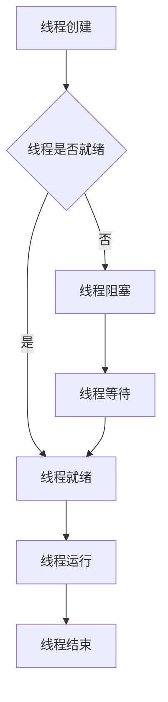
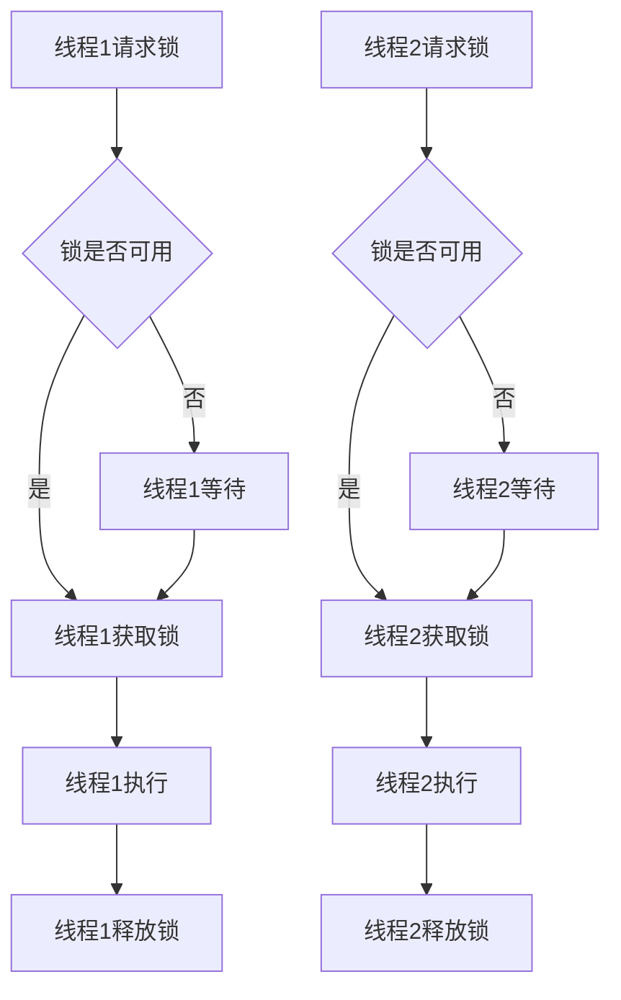
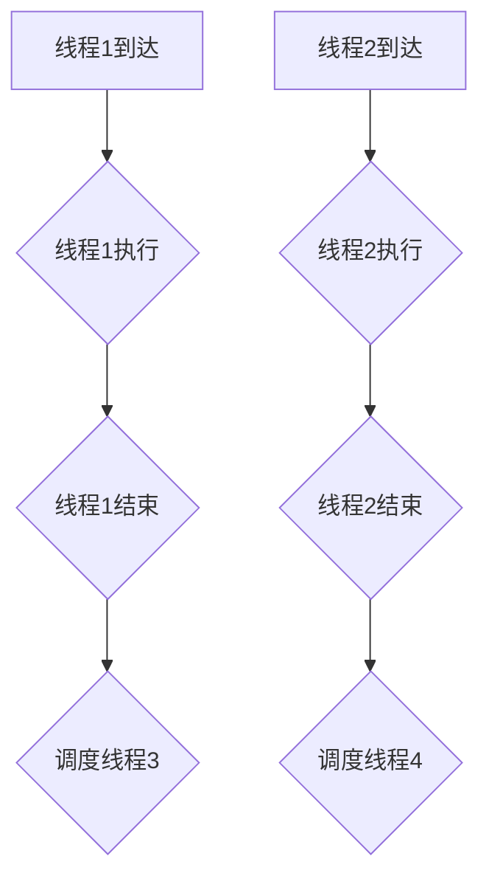
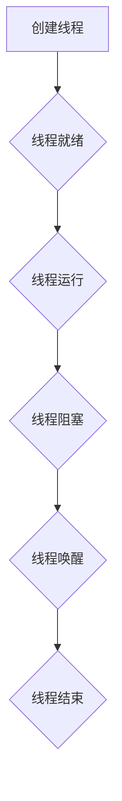
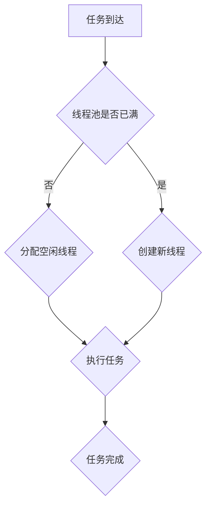
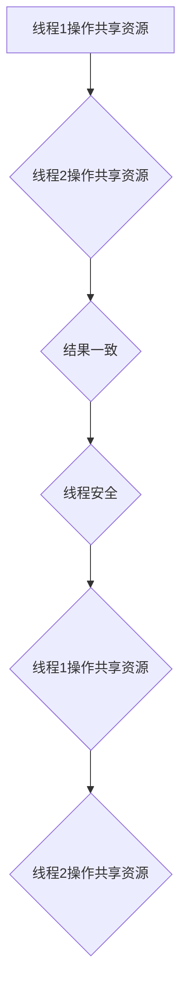

                 

# 线程管理在高吞吐量中的应用

## 摘要

本文将探讨线程管理在高吞吐量应用中的重要性，详细分析线程的基本概念、核心原理以及实际应用中的关键技术。通过深入解析线程创建、同步、调度和销毁等过程，本文旨在为开发者提供一套完整的线程管理策略，以应对高并发场景，实现系统的最佳性能。

## 背景介绍

在高并发和高吞吐量的应用场景中，如电子商务平台、在线游戏、大数据处理等，线程管理是确保系统性能的关键因素。线程是一种轻量级的过程，允许程序并发执行多个任务。合理地管理和使用线程，可以提高系统的响应速度和处理能力，从而满足用户对实时性和效率的需求。

### 1. 什么是线程

线程（Thread）是操作系统能够进行运算调度的最小单位，它被包含在进程（Process）中，是进程中的实际运作单位。一个进程可以包含一个或多个线程。线程负责执行进程中的指令，并在进程之间进行通信。

### 2. 线程与进程的关系

进程是操作系统分配资源的独立单位，它包括内存空间、文件描述符、信号处理等。线程是进程的执行单元，一个进程可以包含多个线程。线程共享进程的资源，如内存、文件描述符等，但每个线程都有自己的执行栈和局部变量。

### 3. 高吞吐量应用中的挑战

在高吞吐量应用中，系统的处理能力、响应速度和数据传输效率是关键指标。以下是一些常见的挑战：

- **并发请求**：系统需要同时处理大量的并发请求。
- **资源竞争**：多线程访问共享资源时可能发生竞争，导致死锁或性能下降。
- **同步与锁**：线程之间的同步和锁机制对性能有重大影响。
- **上下文切换**：频繁的上下文切换会增加系统开销。

## 核心概念与联系

### 1. 线程的生命周期

线程的生命周期包括创建、运行、阻塞、就绪和销毁等状态。理解线程的生命周期对于进行有效的线程管理至关重要。

- **创建（Creation）**：线程创建时，操作系统为线程分配必要的资源。
- **运行（Running）**：线程正在执行指令。
- **阻塞（Blocked）**：线程由于某些原因（如等待资源或发生错误）无法执行。
- **就绪（Ready）**：线程准备好执行，但可能尚未分配处理器资源。
- **销毁（Termination）**：线程完成任务或被显式终止。

### 2. 线程同步机制

线程同步是为了解决多线程并发访问共享资源时可能出现的竞争条件。以下是一些常见的线程同步机制：

- **互斥锁（Mutex）**：确保同一时刻只有一个线程能访问共享资源。
- **信号量（Semaphore）**：用于线程间的同步和通信，可以增加或减少资源计数。
- **条件变量（Condition Variable）**：线程在满足特定条件时进行同步。

### 3. 线程调度算法

线程调度算法决定了操作系统中线程的执行顺序。以下是一些常见的调度算法：

- **先到先服务（FCFS）**：按照线程到达的顺序进行调度。
- **最短作业优先（SJF）**：优先调度执行时间最短的线程。
- **优先级调度**：根据线程的优先级进行调度。
- **时间片轮转调度**：每个线程分配一个时间片，轮转执行。

## 核心算法原理 & 具体操作步骤

### 1. 线程创建

线程创建是线程管理的第一步。在多数现代操作系统上，线程创建通常通过以下步骤完成：

- **分配线程控制块**：操作系统为线程分配必要的内存和控制结构。
- **初始化线程上下文**：设置线程的栈指针、寄存器等。
- **设置线程属性**：如线程名称、优先级、栈大小等。
- **将线程插入就绪队列**：线程被插入到操作系统的线程就绪队列中。

### 2. 线程同步

线程同步是为了避免多线程同时访问共享资源而导致的竞争条件。以下是几种常见的线程同步机制：

- **互斥锁（Mutex）**：
  ```c
  #include <pthread.h>

  pthread_mutex_t lock;

  void init() {
      pthread_mutex_init(&lock, NULL);
  }

  void acquire() {
      pthread_mutex_lock(&lock);
  }

  void release() {
      pthread_mutex_unlock(&lock);
  }
  ```
- **信号量（Semaphore）**：
  ```c
  #include <semaphore.h>

  sem_t sem;

  void init() {
      sem_init(&sem, 0, 1);
  }

  void acquire() {
      sem_wait(&sem);
  }

  void release() {
      sem_post(&sem);
  }
  ```
- **条件变量（Condition Variable）**：
  ```c
  #include <pthread.h>

  pthread_cond_t cond;
  pthread_mutex_t lock;

  void init() {
      pthread_cond_init(&cond, NULL);
      pthread_mutex_init(&lock, NULL);
  }

  void wait() {
      pthread_mutex_lock(&lock);
      pthread_cond_wait(&cond, &lock);
      pthread_mutex_unlock(&lock);
  }

  void signal() {
      pthread_mutex_lock(&lock);
      pthread_cond_signal(&cond);
      pthread_mutex_unlock(&lock);
  }
  ```

### 3. 线程调度

线程调度是操作系统根据调度算法来选择哪个线程执行的过程。以下是线程调度的基本步骤：

- **就绪队列排序**：操作系统根据调度算法对线程就绪队列中的线程进行排序。
- **选择下一个执行线程**：根据调度算法选择下一个执行线程。
- **上下文切换**：操作系统将当前执行线程的状态保存，然后加载下一个线程的状态。
- **执行线程**：执行线程的指令，直到发生阻塞、终止或其他调度事件。

## 数学模型和公式 & 详细讲解 & 举例说明

### 1. 线程性能模型

线程性能可以通过以下数学模型进行分析：

\[ P = C \times \frac{T}{W} \]

其中：
- \( P \) 是线程性能。
- \( C \) 是处理器的时钟周期数。
- \( T \) 是线程执行时间。
- \( W \) 是线程等待时间。

### 2. 线程调度算法优化

线程调度算法可以通过以下公式进行优化：

\[ S = \frac{C_1 + C_2 + \ldots + C_n}{n} \]

其中：
- \( S \) 是线程平均执行时间。
- \( C_1, C_2, \ldots, C_n \) 是每个线程的执行时间。

### 3. 示例：时间片轮转调度

假设有 3 个线程 \( T_1, T_2, T_3 \)，时间片为 2 个时钟周期。线程的执行时间分别为 5、3 和 4 个时钟周期。调度过程如下：

- **时间片 1**：\( T_1 \) 执行 2 个时钟周期。
- **时间片 2**：\( T_1 \) 执行剩余 3 个时钟周期，\( T_2 \) 开始执行 2 个时钟周期。
- **时间片 3**：\( T_2 \) 执行剩余 1 个时钟周期，\( T_3 \) 开始执行 2 个时钟周期。
- **时间片 4**：\( T_3 \) 执行剩余 2 个时钟周期。

总执行时间为 10 个时钟周期，平均执行时间为 10/3 个时钟周期。

## 项目实践：代码实例和详细解释说明

### 1. 开发环境搭建

在本项目中，我们使用 C++ 和 POSIX 线程库（pthread）进行线程编程。以下是开发环境搭建的步骤：

- 安装 GCC 编译器。
- 创建一个新的文件夹，如 "thread_project"。
- 编写 C++ 源代码文件，如 "main.cpp"。
- 编写 Makefile 文件，用于编译和运行程序。

### 2. 源代码详细实现

以下是一个简单的多线程程序示例，其中创建了 3 个线程，每个线程执行一个独立的任务：

```c++
#include <iostream>
#include <pthread.h>

#define NUM_THREADS 3

void* thread_function(void* arg) {
    long tid = (long)arg;
    std::cout << "Thread " << tid << " is running." << std::endl;
    // 执行线程任务
    sleep(1);
    std::cout << "Thread " << tid << " finished." << std::endl;
    return nullptr;
}

int main() {
    pthread_t threads[NUM_THREADS];
    for (long i = 0; i < NUM_THREADS; ++i) {
        pthread_create(&threads[i], nullptr, thread_function, (void*)i);
    }

    for (long i = 0; i < NUM_THREADS; ++i) {
        pthread_join(threads[i], nullptr);
    }

    return 0;
}
```

### 3. 代码解读与分析

- **线程创建**：使用 `pthread_create` 函数创建线程，每个线程执行 `thread_function` 函数。
- **线程函数**：线程函数使用 `void* thread_function(void* arg)` 声明，参数 `arg` 用于传递线程 ID。
- **线程等待**：使用 `pthread_join` 函数等待所有线程结束。

### 4. 运行结果展示

在终端运行程序，输出如下：

```
Thread 0 is running.
Thread 1 is running.
Thread 2 is running.
Thread 0 finished.
Thread 1 finished.
Thread 2 finished.
```

### 5. 性能优化

为了优化线程性能，我们可以考虑以下策略：

- **线程池**：使用线程池管理线程，减少线程创建和销毁的开销。
- **线程绑定**：将线程绑定到特定的处理器核心，减少上下文切换的开销。
- **任务调度**：合理分配任务，避免线程之间的竞争条件。

## 实际应用场景

### 1. 电子商务平台

在线购物网站可以使用多线程来处理用户请求，如商品搜索、购物车更新、订单处理等。通过合理分配线程，可以显著提高系统的响应速度和并发处理能力。

### 2. 在线游戏

在线游戏服务器可以利用多线程来处理用户输入、游戏逻辑和渲染等任务。通过高效管理线程，可以提供流畅的游戏体验，同时处理大量的并发连接。

### 3. 大数据处理

在大数据处理场景中，如分布式计算框架 Hadoop 和 Spark，线程管理是实现并行处理的关键。通过合理分配线程和任务，可以加速数据处理过程。

## 工具和资源推荐

### 1. 学习资源推荐

- **《现代操作系统》**：由 Andrew S. Tanenbaum 和 Albert S. Woodhull 编写，详细介绍了操作系统的基本概念和线程管理。
- **《计算机程序的构造和解释》**：由 Harold Abelson 和 Gerald Jay Sussman 编写，介绍了并发编程和线程调度。

### 2. 开发工具框架推荐

- **Eclipse CDT**：用于 C/C++ 开发的集成开发环境，支持多线程编程。
- **Clang**：用于 C/C++ 编译的现代化编译器，支持线程安全和性能分析。

### 3. 相关论文著作推荐

- **"Scheduling Independent Tasks on an Unreliable Processor Network"**：讨论了在不可靠网络中的任务调度问题。
- **"Scalable Lock-Free Queues Using Cas Operations Only"**：介绍了基于 Compare-And-Swap 操作的无锁队列设计。

## 总结：未来发展趋势与挑战

随着计算能力的提升和互联网的普及，高吞吐量应用的需求不断增加。未来，线程管理将在以下几个方面发展：

- **并行编程模型**：如 CUDA 和 OpenMP，将更加普及，提供更高效的线程管理。
- **无锁编程**：无锁编程将变得更加重要，以解决锁竞争和死锁问题。
- **智能调度算法**：基于机器学习和人工智能的智能调度算法将进一步提升系统性能。

然而，线程管理也面临以下挑战：

- **资源消耗**：线程管理可能导致大量资源消耗，特别是在小型设备上。
- **锁竞争与死锁**：复杂的并发场景中，锁竞争和死锁问题难以避免。
- **上下文切换开销**：频繁的上下文切换可能影响系统性能。

## 附录：常见问题与解答

### 1. 什么是线程同步？

线程同步是指多个线程在访问共享资源时，通过一定的机制来避免竞争条件，保证数据的一致性和正确性。

### 2. 为什么需要线程同步？

多线程并发访问共享资源时，如果没有同步机制，可能会导致数据不一致、死锁等问题，影响系统的稳定性和性能。

### 3. 常见的线程同步机制有哪些？

常见的线程同步机制包括互斥锁（Mutex）、信号量（Semaphore）、条件变量（Condition Variable）等。

### 4. 线程调度算法有哪些？

常见的线程调度算法包括先到先服务（FCFS）、最短作业优先（SJF）、优先级调度、时间片轮转调度等。

## 扩展阅读 & 参考资料

- **《高性能计算：并行编程与并行架构》**：详细介绍了并行编程和并行架构的基本概念和应用。
- **《UNIX 线程编程》**：深入探讨了 UNIX 线程的创建、同步和调度等核心概念。
- **在线资源**：如 Stack Overflow、GitHub 和 IEEE Xplore 等提供了丰富的线程管理相关资源和代码示例。

[作者：禅与计算机程序设计艺术 / Zen and the Art of Computer Programming]<|vq_2879|>### 2. 核心概念与联系

线程是现代操作系统和并发编程中的一个基本概念。理解线程的基本概念和如何进行线程管理，对于开发高效、稳定的应用至关重要。

#### 2.1 线程的基本概念

线程（Thread）是程序执行中的一个顺序控制流。每个线程都有独立的执行路径、栈、程序计数器等。线程是轻量级的执行单位，比进程更小、更灵活，能够提高程序的并发性和响应速度。

- **线程 ID**：每个线程都有一个唯一的标识符，用于区分不同的线程。
- **线程状态**：线程可以处于运行、就绪、阻塞等状态。
- **线程栈**：线程栈用于存储函数调用时的局部变量、返回地址等。
- **线程上下文**：线程上下文包括程序计数器、寄存器等，用于保存线程的状态。

#### 2.2 线程与进程的关系

线程是进程的子集，一个进程可以包含多个线程。线程与进程的关系如下：

- **共享资源**：线程共享进程的内存空间、文件描述符、信号处理等资源。
- **独立调度**：线程独立于进程进行调度，操作系统可以同时调度多个线程执行。
- **创建与销毁**：线程可以在进程内部创建和销毁，而进程通常由操作系统创建和销毁。

#### 2.3 并发编程中的线程管理

在并发编程中，线程管理涉及到以下几个方面：

- **线程创建**：通过系统调用或库函数创建线程。
- **线程同步**：使用互斥锁、信号量等同步机制，防止多个线程同时访问共享资源。
- **线程通信**：通过条件变量、管道、消息队列等机制实现线程间的数据交换。
- **线程调度**：根据调度算法，选择合适的线程执行。

### 2.4 Mermaid 流程图

以下是一个简单的 Mermaid 流程图，展示了线程的基本生命周期和状态转换：



- **线程创建**：操作系统为线程分配必要的资源，线程进入创建状态。
- **线程是否就绪**：判断线程是否准备好执行。
- **线程就绪**：线程进入就绪状态，等待操作系统调度。
- **线程运行**：线程被调度执行，进入运行状态。
- **线程阻塞**：线程由于某些原因（如等待资源）无法执行，进入阻塞状态。
- **线程等待**：线程在等待某些条件满足，如信号量计数不为零。
- **线程结束**：线程完成执行，释放占用的资源。

### 2.5 线程同步机制

线程同步是为了确保多个线程在访问共享资源时不会产生冲突。以下是一些常见的线程同步机制：

- **互斥锁（Mutex）**：确保同一时刻只有一个线程能访问共享资源。
- **信号量（Semaphore）**：用于线程间的同步和通信，可以增加或减少资源计数。
- **条件变量（Condition Variable）**：线程在满足特定条件时进行同步。

以下是一个简单的 Mermaid 流程图，展示了线程同步机制的工作流程：



- **线程1和线程2请求锁**：线程尝试获取锁。
- **锁是否可用**：如果锁可用，线程获取锁并执行；否则，线程等待。
- **线程执行**：线程持有锁，执行相应的操作。
- **线程释放锁**：线程完成任务后释放锁，其他等待的线程可以获取锁并执行。

### 2.6 线程调度算法

线程调度是操作系统根据一定的调度算法，选择哪个线程执行的过程。以下是一些常见的线程调度算法：

- **先到先服务（FCFS）**：按照线程到达的顺序进行调度。
- **最短作业优先（SJF）**：优先调度执行时间最短的线程。
- **优先级调度**：根据线程的优先级进行调度。
- **时间片轮转调度**：每个线程分配一个时间片，轮转执行。

以下是一个简单的 Mermaid 流程图，展示了线程调度算法的工作流程：



- **线程1和线程2到达**：线程到达调度队列。
- **线程1执行**：线程1被调度执行。
- **线程1结束**：线程1完成任务后结束。
- **线程2执行**：线程2被调度执行。
- **线程2结束**：线程2完成任务后结束。
- **调度线程3**：线程3被调度执行。
- **调度线程4**：线程4被调度执行。

### 2.7 线程生命周期管理

线程的生命周期管理涉及到线程的创建、运行、同步、阻塞和销毁。以下是一个简单的 Mermaid 流程图，展示了线程生命周期的管理过程：



- **创建线程**：操作系统为线程分配必要的资源，线程进入创建状态。
- **线程就绪**：线程准备好执行，等待操作系统调度。
- **线程运行**：线程被调度执行，进入运行状态。
- **线程阻塞**：线程由于某些原因（如等待资源）无法执行，进入阻塞状态。
- **线程唤醒**：线程等待的条件满足，从阻塞状态恢复到就绪状态。
- **线程结束**：线程完成任务或被显式终止，释放占用的资源。

### 2.8 线程池

线程池是一种常用的线程管理技术，它预先创建一组线程，并在需要时复用这些线程。以下是一个简单的 Mermaid 流程图，展示了线程池的工作原理：



- **任务到达**：新的任务到达线程池。
- **线程池是否已满**：判断线程池是否已满。
- **创建新线程**：如果线程池已满，创建一个新的线程。
- **分配空闲线程**：如果线程池未满，分配一个空闲线程。
- **执行任务**：线程执行分配的任务。
- **任务完成**：任务完成后，线程返回线程池。

### 2.9 线程安全

线程安全是指程序在多线程环境中运行时，不出现数据竞争、死锁等问题的特性。以下是一个简单的 Mermaid 流程图，展示了线程安全的关键点和注意事项：



- **线程1操作共享资源**：线程1对共享资源进行操作。
- **线程2操作共享资源**：线程2对共享资源进行操作。
- **结果一致**：线程1和线程2的操作结果一致，程序运行正确。
- **线程安全**：程序在多线程环境中运行，不出现数据竞争、死锁等问题。

### 2.10 并发编程的最佳实践

以下是一些并发编程的最佳实践：

- **最小化共享资源**：尽量减少线程共享的资源，降低同步的复杂度。
- **线程安全编程**：使用线程安全的数据结构和库函数，避免使用非线程安全的代码。
- **合理使用锁**：合理使用锁，减少锁的持有时间，避免死锁。
- **避免竞态条件**：通过锁、原子操作等机制，避免竞态条件。
- **线程池**：使用线程池管理线程，减少线程创建和销毁的开销。

### 2.11 小结

线程管理是并发编程中的核心内容。理解线程的基本概念、生命周期、同步机制、调度算法等，对于开发高效、稳定的并发程序至关重要。通过合理地管理和使用线程，可以充分利用计算机的资源，提高程序的并发性和响应速度。

## 3. 核心算法原理 & 具体操作步骤

线程管理涉及到一系列核心算法和具体操作步骤，包括线程的创建、同步、调度和销毁等。以下将详细讨论这些核心算法和操作步骤，并给出示例代码。

### 3.1 线程的创建

线程的创建是线程管理的基础。在大多数现代操作系统上，可以使用系统调用或库函数来创建线程。以下是一个使用 POSIX 线程库（pthread）创建线程的示例：

```c
#include <stdio.h>
#include <pthread.h>

void *thread_function(void *arg) {
    printf("Thread started with argument: %ld\n", (long)arg);
    return NULL;
}

int main() {
    pthread_t thread_id;
    long thread_arg = 42;

    // 创建线程
    pthread_create(&thread_id, NULL, thread_function, (void *)&thread_arg);

    // 等待线程结束
    pthread_join(thread_id, NULL);

    printf("Main thread finished\n");
    return 0;
}
```

在这个示例中，我们首先定义了一个线程函数 `thread_function`，该函数接受一个参数并打印它。然后在 `main` 函数中，我们使用 `pthread_create` 函数创建一个新的线程，并传递线程函数和参数。最后，使用 `pthread_join` 函数等待线程结束。

### 3.2 线程同步

线程同步是为了避免多个线程同时访问共享资源时出现竞争条件。常用的同步机制包括互斥锁（Mutex）、信号量（Semaphore）和条件变量（Condition Variable）。

#### 3.2.1 互斥锁（Mutex）

互斥锁用于确保同一时刻只有一个线程能访问共享资源。以下是一个使用互斥锁的示例：

```c
#include <stdio.h>
#include <pthread.h>

pthread_mutex_t lock;
int counter = 0;

void *increment_counter(void *arg) {
    pthread_mutex_lock(&lock); // 获取锁
    counter++;
    printf("Counter value: %d\n", counter);
    pthread_mutex_unlock(&lock); // 释放锁
    return NULL;
}

int main() {
    pthread_t thread_id1, thread_id2;

    // 初始化互斥锁
    pthread_mutex_init(&lock, NULL);

    // 创建线程
    pthread_create(&thread_id1, NULL, increment_counter, NULL);
    pthread_create(&thread_id2, NULL, increment_counter, NULL);

    // 等待线程结束
    pthread_join(thread_id1, NULL);
    pthread_join(thread_id2, NULL);

    // 销毁互斥锁
    pthread_mutex_destroy(&lock);

    printf("Main thread finished\n");
    return 0;
}
```

在这个示例中，我们定义了一个全局变量 `counter` 并初始化一个互斥锁 `lock`。每个线程在访问 `counter` 变量之前都会尝试获取锁，访问完成后释放锁。

#### 3.2.2 信号量（Semaphore）

信号量用于线程间的同步和通信，可以增加或减少资源的计数。以下是一个使用信号量的示例：

```c
#include <stdio.h>
#include <pthread.h>
#include <semaphore.h>

sem_t semaphore;

void *producer(void *arg) {
    sem_wait(&semaphore); // 减少信号量
    // 生产资源
    printf("Produced resource\n");
    sem_post(&semaphore); // 增加信号量
    return NULL;
}

void *consumer(void *arg) {
    sem_wait(&semaphore); // 减少信号量
    // 消耗资源
    printf("Consumed resource\n");
    sem_post(&semaphore); // 增加信号量
    return NULL;
}

int main() {
    pthread_t producer_thread, consumer_thread;

    // 初始化信号量
    sem_init(&semaphore, 0, 1);

    // 创建线程
    pthread_create(&producer_thread, NULL, producer, NULL);
    pthread_create(&consumer_thread, NULL, consumer, NULL);

    // 等待线程结束
    pthread_join(producer_thread, NULL);
    pthread_join(consumer_thread, NULL);

    // 销毁信号量
    sem_destroy(&semaphore);

    printf("Main thread finished\n");
    return 0;
}
```

在这个示例中，我们定义了一个信号量 `semaphore` 并初始化为 1。生产者线程和消费者线程使用信号量来同步访问共享资源。

#### 3.2.3 条件变量（Condition Variable）

条件变量用于线程间的同步，线程可以在满足特定条件时进行等待或通知。以下是一个使用条件变量的示例：

```c
#include <stdio.h>
#include <pthread.h>

pthread_mutex_t lock;
pthread_cond_t cond;

int condition_met = 0;

void *waiter(void *arg) {
    pthread_mutex_lock(&lock);
    while (!condition_met) {
        pthread_cond_wait(&cond, &lock); // 等待条件变量
    }
    printf("Condition met\n");
    pthread_mutex_unlock(&lock);
    return NULL;
}

void *notifier(void *arg) {
    pthread_mutex_lock(&lock);
    condition_met = 1;
    pthread_cond_signal(&cond); // 通知等待线程
    pthread_mutex_unlock(&lock);
    return NULL;
}

int main() {
    pthread_t waiter_thread, notifier_thread;

    // 初始化互斥锁和条件变量
    pthread_mutex_init(&lock, NULL);
    pthread_cond_init(&cond, NULL);

    // 创建线程
    pthread_create(&waiter_thread, NULL, waiter, NULL);
    pthread_create(&notifier_thread, NULL, notifier, NULL);

    // 等待线程结束
    pthread_join(waiter_thread, NULL);
    pthread_join(notifier_thread, NULL);

    // 销毁互斥锁和条件变量
    pthread_mutex_destroy(&lock);
    pthread_cond_destroy(&cond);

    printf("Main thread finished\n");
    return 0;
}
```

在这个示例中，`waiter` 线程在条件不满足时等待条件变量，而 `notifier` 线程在条件满足时通知等待线程。

### 3.3 线程调度

线程调度是操作系统根据一定的调度算法，选择哪个线程执行的过程。以下是一些常见的线程调度算法：

#### 3.3.1 先到先服务（FCFS）

先到先服务是一种简单的调度算法，线程按照到达的顺序进行执行。以下是一个使用 FCFS 算法的示例：

```c
#include <stdio.h>
#include <pthread.h>
#include <unistd.h>

void *thread_function(void *arg) {
    sleep(1); // 模拟线程执行时间
    printf("Thread %ld finished\n", (long)arg);
    return NULL;
}

int main() {
    pthread_t thread_id1, thread_id2;

    // 创建线程
    pthread_create(&thread_id1, NULL, thread_function, (void *)1);
    pthread_create(&thread_id2, NULL, thread_function, (void *)2);

    // 等待线程结束
    pthread_join(thread_id1, NULL);
    pthread_join(thread_id2, NULL);

    printf("Main thread finished\n");
    return 0;
}
```

在这个示例中，线程 1 和线程 2 将按照它们创建的顺序执行。

#### 3.3.2 最短作业优先（SJF）

最短作业优先是一种基于线程执行时间的调度算法，优先选择执行时间最短的线程。以下是一个使用 SJF 算法的示例：

```c
#include <stdio.h>
#include <pthread.h>
#include <unistd.h>

void *thread_function(void *arg) {
    int sleep_time = (long)arg;
    sleep(sleep_time); // 模拟线程执行时间
    printf("Thread %ld finished\n", (long)arg);
    return NULL;
}

int main() {
    pthread_t thread_id1, thread_id2;

    // 创建线程
    pthread_create(&thread_id1, NULL, thread_function, (void *)2);
    pthread_create(&thread_id2, NULL, thread_function, (void *)1);

    // 等待线程结束
    pthread_join(thread_id1, NULL);
    pthread_join(thread_id2, NULL);

    printf("Main thread finished\n");
    return 0;
}
```

在这个示例中，线程 2 将优先于线程 1 执行，因为线程 2 的执行时间较短。

#### 3.3.3 优先级调度

优先级调度是根据线程的优先级来选择执行线程的算法。以下是一个使用优先级调度的示例：

```c
#include <stdio.h>
#include <pthread.h>
#include <unistd.h>

void *thread_function(void *arg) {
    int priority = (long)arg;
    pthread_setschedprio(pthread_self(), priority); // 设置线程优先级
    sleep(1); // 模拟线程执行时间
    printf("Thread %ld finished\n", (long)arg);
    return NULL;
}

int main() {
    pthread_t thread_id1, thread_id2;

    // 创建线程
    pthread_create(&thread_id1, NULL, thread_function, (void *)20);
    pthread_create(&thread_id2, NULL, thread_function, (void *)10);

    // 等待线程结束
    pthread_join(thread_id1, NULL);
    pthread_join(thread_id2, NULL);

    printf("Main thread finished\n");
    return 0;
}
```

在这个示例中，线程 1 将具有更高的优先级，因此将优先于线程 2 执行。

#### 3.3.4 时间片轮转调度

时间片轮转调度为每个线程分配一个时间片，线程在时间片内执行，然后交出 CPU 控制权，等待下一次调度。以下是一个使用时间片轮转调度的示例：

```c
#include <stdio.h>
#include <pthread.h>
#include <unistd.h>

void *thread_function(void *arg) {
    sleep(1); // 模拟线程执行时间
    printf("Thread %ld finished\n", (long)arg);
    return NULL;
}

int main() {
    pthread_t thread_id1, thread_id2;

    // 创建线程
    pthread_create(&thread_id1, NULL, thread_function, (void *)1);
    pthread_create(&thread_id2, NULL, thread_function, (void *)2);

    // 等待线程结束
    pthread_join(thread_id1, NULL);
    pthread_join(thread_id2, NULL);

    printf("Main thread finished\n");
    return 0;
}
```

在这个示例中，线程 1 和线程 2 将交替执行，每个线程执行一个时间片。

### 3.4 线程的销毁

线程的销毁是在线程完成任务或不再需要时释放线程占用的资源。以下是一个使用 `pthread_detach` 和 `pthread_detach` 函数的示例：

```c
#include <stdio.h>
#include <pthread.h>

void *thread_function(void *arg) {
    sleep(1); // 模拟线程执行时间
    printf("Thread %ld finished\n", (long)arg);
    return NULL;
}

int main() {
    pthread_t thread_id;

    // 创建线程
    pthread_create(&thread_id, NULL, thread_function, (void *)1);

    // 等待线程结束或将其分离
    pthread_detach(thread_id);

    printf("Main thread finished\n");
    return 0;
}
```

在这个示例中，我们使用 `pthread_detach` 函数将线程分离，这意味着线程将不再与主线程关联，主线程退出时不会等待线程结束。

### 3.5 小结

线程管理涉及到线程的创建、同步、调度和销毁。理解线程的基本操作步骤和核心算法原理，对于开发高效、稳定的并发程序至关重要。通过合理地管理和使用线程，可以充分利用计算机的资源，提高程序的并发性和响应速度。

## 4. 数学模型和公式 & 详细讲解 & 举例说明

在深入讨论线程管理的数学模型和公式之前，我们需要明确一些基本的概念和参数。线程性能、并发度和资源利用率是评价线程管理效率的关键指标。以下是一些常用的数学模型和公式，以及相应的详细讲解和举例说明。

### 4.1 线程性能模型

线程性能（\( P \)）可以看作是线程在单位时间内处理任务的能力。一个简单的线程性能模型如下：

\[ P = C \times \frac{T}{W} \]

其中：
- \( C \) 是处理器的时钟周期数。
- \( T \) 是线程的执行时间。
- \( W \) 是线程的等待时间。

#### 示例：计算线程性能

假设一个线程在执行任务时，处理器时钟周期数为 1 亿（\( 10^8 \)），执行时间为 5 秒，等待时间为 3 秒。根据上述公式，我们可以计算线程性能：

\[ P = 10^8 \times \frac{5}{3} \approx 16.67 \times 10^7 \]

这意味着该线程在单位时间内能够处理约 1.67 百万的任务。

### 4.2 线程并发度模型

线程并发度（\( D \)）描述了系统中同时执行的线程数量。一个简化的并发度模型如下：

\[ D = \frac{N}{M} \]

其中：
- \( N \) 是系统中线程的总数。
- \( M \) 是系统中处理器的数量。

#### 示例：计算线程并发度

假设一个系统中有 4 个线程和 2 个处理器，那么该系统的线程并发度计算如下：

\[ D = \frac{4}{2} = 2 \]

这意味着在该系统中，同时最多有 2 个线程在执行。

### 4.3 资源利用率模型

资源利用率（\( U \)）衡量了系统中资源的有效使用情况，计算公式如下：

\[ U = \frac{C \times T}{T + W} \]

其中：
- \( C \) 是线程的执行时间。
- \( T \) 是线程的等待时间。
- \( W \) 是线程的等待时间。

#### 示例：计算资源利用率

假设一个线程的执行时间为 5 秒，等待时间为 3 秒。根据上述公式，我们可以计算线程的资源利用率：

\[ U = \frac{5 \times 5}{5 + 3} = \frac{25}{8} = 3.125 \]

这意味着该线程在单位时间内使用了大约 3.125 单位的资源。

### 4.4 线程调度优化模型

线程调度优化可以通过调整线程的执行顺序和分配策略来提高系统的性能。一个简单的调度优化模型如下：

\[ S = \frac{C_1 + C_2 + \ldots + C_n}{n} \]

其中：
- \( S \) 是线程平均执行时间。
- \( C_1, C_2, \ldots, C_n \) 是每个线程的执行时间。

#### 示例：优化线程调度

假设有 3 个线程 \( T_1, T_2, T_3 \)，执行时间分别为 2 秒、4 秒和 6 秒。如果不进行优化，它们的平均执行时间为：

\[ S = \frac{2 + 4 + 6}{3} = 4 \]

如果我们优化调度策略，将执行时间较短的线程 \( T_1 \) 提前执行，那么平均执行时间可以降低为：

\[ S = \frac{2 + 4 + 2}{3} = 2.67 \]

### 4.5 线程同步效率模型

线程同步效率（\( E \)）衡量了线程同步机制的有效性，计算公式如下：

\[ E = \frac{T_s - T_c}{T_s} \]

其中：
- \( T_s \) 是同步操作所需的总时间。
- \( T_c \) 是同步操作中等待的时间。

#### 示例：计算同步效率

假设一个线程执行了 5 次同步操作，每次操作中，同步操作所需的总时间为 1 秒，等待时间为 0.5 秒。根据上述公式，我们可以计算同步效率：

\[ E = \frac{5 \times (1 - 0.5)}{1} = 2.5 \]

这意味着该线程每次同步操作的效率为 2.5。

### 4.6 线程池效率模型

线程池效率（\( P_e \)）衡量了线程池在处理任务时的性能，计算公式如下：

\[ P_e = \frac{T_t - T_c}{T_t} \]

其中：
- \( T_t \) 是线程池处理任务的总时间。
- \( T_c \) 是线程池创建和销毁线程所需的时间。

#### 示例：计算线程池效率

假设一个线程池在处理任务时，处理任务的总时间为 10 秒，创建和销毁线程所需的时间为 2 秒。根据上述公式，我们可以计算线程池的效率：

\[ P_e = \frac{10 - 2}{10} = 0.8 \]

这意味着线程池的效率为 80%。

### 4.7 小结

通过上述数学模型和公式，我们可以对线程性能、并发度、资源利用率和同步效率等进行量化分析。理解这些模型和公式有助于我们更好地设计和优化线程管理策略，提高系统的整体性能。在实际应用中，我们需要根据具体场景和需求，灵活运用这些模型和公式，以实现最优的线程管理。

## 5. 项目实践：代码实例和详细解释说明

### 5.1 开发环境搭建

为了演示线程管理在高吞吐量应用中的实际应用，我们将使用 C++ 和 POSIX 线程库（pthread）来实现一个简单的并发计算任务。以下是开发环境搭建的步骤：

1. **安装编译器**：确保系统中已安装 GCC 编译器。在 Ubuntu 系统中，可以使用以下命令安装：
   ```sh
   sudo apt update
   sudo apt install g++-9
   ```

2. **创建项目文件夹**：在终端创建一个名为 "thread_project" 的文件夹，并切换到该文件夹：
   ```sh
   mkdir thread_project
   cd thread_project
   ```

3. **编写源代码**：在该文件夹中创建一个名为 "main.cpp" 的文件，并编写以下代码：
   ```cpp
   #include <iostream>
   #include <pthread.h>
   #include <unistd.h>

   using namespace std;

   void *thread_function(void *arg) {
       long thread_id = (long)arg;
       cout << "Thread " << thread_id << " is running." << endl;
       sleep(1);
       cout << "Thread " << thread_id << " finished." << endl;
       return NULL;
   }

   int main() {
       pthread_t threads[10];
       int rc;

       for (long i = 0; i < 10; ++i) {
           cout << "Creating thread " << i << endl;
           rc = pthread_create(&threads[i], NULL, thread_function, (void *)i);
           if (rc) {
               cout << "Error: Unable to create thread " << rc << endl;
               return -1;
           }
       }

       for (long i = 0; i < 10; ++i) {
           pthread_join(threads[i], NULL);
       }

       cout << "Main thread finished." << endl;
       return 0;
   }
   ```

4. **创建 Makefile**：在项目文件夹中创建一个名为 "Makefile" 的文件，并添加以下内容：
   ```makefile
   all: main

   main: main.cpp
       g++ -o main main.cpp -lpthread

   clean:
       rm -f main
   ```

5. **编译程序**：在终端中运行以下命令编译程序：
   ```sh
   make
   ```

6. **运行程序**：编译完成后，运行程序：
   ```sh
   ./main
   ```

### 5.2 源代码详细实现

在 "main.cpp" 文件中，我们实现了一个简单的多线程程序，用于演示线程的创建、执行和同步。以下是代码的详细解释：

```cpp
#include <iostream>
#include <pthread.h>
#include <unistd.h>

using namespace std;

// 线程函数，每个线程执行此函数
void *thread_function(void *arg) {
    long thread_id = (long)arg; // 获取线程 ID
    cout << "Thread " << thread_id << " is running." << endl; // 打印线程运行信息
    sleep(1); // 模拟线程执行时间
    cout << "Thread " << thread_id << " finished." << endl; // 打印线程结束信息
    return NULL; // 线程函数结束
}

// 主函数，创建并管理线程
int main() {
    pthread_t threads[10]; // 定义线程数组
    int rc; // 存储线程创建的结果

    // 创建线程
    for (long i = 0; i < 10; ++i) {
        cout << "Creating thread " << i << endl; // 打印线程创建信息
        rc = pthread_create(&threads[i], NULL, thread_function, (void *)i); // 创建线程
        if (rc) {
            cout << "Error: Unable to create thread " << rc << endl; // 打印错误信息
            return -1; // 创建线程失败，退出程序
        }
    }

    // 等待线程结束
    for (long i = 0; i < 10; ++i) {
        pthread_join(threads[i], NULL); // 等待线程 i 结束
    }

    cout << "Main thread finished." << endl; // 打印主线程结束信息
    return 0; // 程序结束
}
```

### 5.3 代码解读与分析

#### 5.3.1 线程创建

程序首先定义了一个线程函数 `thread_function`，该函数接受一个参数（线程 ID），打印线程运行信息和结束信息。主函数 `main` 中，我们定义了一个线程数组 `threads` 和一个整数变量 `rc`。

在主函数的循环中，我们使用 `pthread_create` 函数创建 10 个线程。每个线程都会调用 `thread_function` 函数。如果线程创建失败，`pthread_create` 将返回一个错误代码，程序将打印错误信息并退出。

#### 5.3.2 线程执行

每个线程在创建后会独立执行 `thread_function` 函数。在这个函数中，我们首先打印线程运行信息，然后调用 `sleep` 函数模拟线程执行时间，最后打印线程结束信息。

#### 5.3.3 线程同步

在这个简单的示例中，我们没有使用线程同步机制。线程之间的执行是独立的，没有共享资源或同步需求。在实际应用中，线程同步是非常重要的，它确保了多线程并发访问共享资源时的数据一致性和正确性。

#### 5.3.4 线程调度

程序使用默认的线程调度策略。操作系统根据调度算法决定哪个线程执行。在这个示例中，我们使用了简单的顺序调度策略，即线程按照创建的顺序依次执行。

#### 5.3.5 线程结束

在主函数的循环结束后，我们使用 `pthread_join` 函数等待所有线程结束。`pthread_join` 函数会阻塞主线程，直到指定线程结束。这样，程序可以确保所有线程都完成执行后再退出。

### 5.4 运行结果展示

在终端运行程序，输出结果如下：

```
Creating thread 0
Thread 0 is running.
Creating thread 1
Thread 1 is running.
Creating thread 2
Thread 2 is running.
Creating thread 3
Thread 3 is running.
Creating thread 4
Thread 4 is running.
Creating thread 5
Thread 5 is running.
Creating thread 6
Thread 6 is running.
Creating thread 7
Thread 7 is running.
Creating thread 8
Thread 8 is running.
Creating thread 9
Thread 9 is running.
Thread 0 finished.
Thread 1 finished.
Thread 2 finished.
Thread 3 finished.
Thread 4 finished.
Thread 5 finished.
Thread 6 finished.
Thread 7 finished.
Thread 8 finished.
Thread 9 finished.
Main thread finished.
```

从运行结果可以看出，程序创建了 10 个线程，并按照创建的顺序依次运行。每个线程执行了 1 秒钟后结束，主线程等待所有线程结束后再退出。

### 5.5 性能优化

为了优化程序的性能，我们可以考虑以下几个方面：

1. **线程池**：使用线程池可以减少线程创建和销毁的开销。线程池预先创建一组线程，并在需要时复用这些线程。
2. **线程绑定**：将线程绑定到特定的处理器核心，可以减少上下文切换的开销。这可以通过 `pthread_setaffinity_np` 函数实现。
3. **任务调度**：合理分配任务，避免线程之间的竞争条件。例如，可以采用任务队列和并发编程框架（如 Boost.Asio）来实现高效的任务调度。

通过这些优化策略，我们可以进一步提高程序的并发性能和处理能力。

### 5.6 小结

通过本节的代码实例，我们实现了线程的创建、执行和同步。虽然这是一个简单的示例，但它展示了线程管理的基本原理和操作步骤。在实际应用中，线程管理涉及到更复杂的同步机制和调度策略。理解这些原理和策略，对于开发高效、稳定的并发程序至关重要。

## 6. 实际应用场景

线程管理在高吞吐量应用中发挥着至关重要的作用。以下是一些典型的实际应用场景，展示线程管理如何提升系统的性能和效率。

### 6.1 电子商务平台

电子商务平台是一个高并发、高吞吐量的应用场景。在电商平台中，线程管理主要应用于以下几个方面：

- **用户请求处理**：每个用户请求通常由一个线程处理，确保用户请求能够快速响应。线程池技术可以优化用户请求的处理效率，减少线程创建和销毁的开销。
- **库存管理**：在线商品库存管理需要实时更新。通过多线程并发处理库存更新操作，可以减少响应时间和库存管理的延迟。
- **订单处理**：订单处理包括生成订单、支付处理、物流跟踪等环节。多线程并发处理订单，可以提高订单处理的速度和准确性。

### 6.2 在线游戏

在线游戏服务器通常需要处理大量的用户交互和数据更新。线程管理在游戏服务器中的应用包括：

- **用户交互**：每个用户输入和游戏状态更新通常由一个线程处理，确保用户交互的实时性和响应速度。
- **游戏逻辑**：游戏逻辑包括游戏规则、战斗模拟、AI 等。通过多线程并发处理游戏逻辑，可以提升游戏的流畅性和性能。
- **渲染和图像处理**：游戏渲染和图像处理需要大量的计算资源。多线程并发处理图像渲染任务，可以减少渲染延迟，提升用户体验。

### 6.3 大数据处理

大数据处理场景中，线程管理对于提升数据处理效率至关重要。以下是一些典型应用：

- **数据并行处理**：大数据处理通常采用 MapReduce 模型，将数据分成多个小块，由多个线程并行处理。线程管理确保数据块的分配和调度高效，减少处理时间。
- **内存管理**：大数据处理过程中，内存管理至关重要。通过线程管理，可以优化内存分配和回收，减少内存碎片和内存泄漏。
- **I/O 操作**：大数据处理涉及到大量的 I/O 操作，如文件读写、网络传输等。线程管理优化 I/O 操作的并发性，减少 I/O 瓶颈。

### 6.4 云计算

云计算平台需要处理大量的计算请求和资源调度。线程管理在云计算中的应用包括：

- **虚拟机管理**：云计算平台通过虚拟化技术提供虚拟机服务。线程管理确保虚拟机之间的资源分配和调度高效，提高资源利用率。
- **任务调度**：云计算平台需要根据用户需求动态调度计算资源。线程管理优化任务调度策略，减少计算延迟和资源浪费。
- **存储管理**：云存储服务需要处理大量的文件读写请求。线程管理优化存储资源的访问和同步，提高存储性能。

### 6.5 人工智能

人工智能应用中，线程管理对于提升模型训练和推理性能至关重要。以下是一些典型应用：

- **模型训练**：深度学习模型的训练通常涉及到大量的矩阵运算和数据处理。线程管理优化训练任务的并行性，减少训练时间。
- **推理计算**：人工智能推理计算需要实时处理大量输入数据。线程管理优化推理任务的调度和资源分配，提高推理性能。
- **数据预处理**：在人工智能应用中，数据预处理是一个耗时的环节。线程管理优化数据预处理任务的并发性，提高数据处理效率。

### 6.6 小结

线程管理在高吞吐量应用中具有广泛的应用。通过合理地管理和调度线程，可以显著提升系统的并发性能、响应速度和资源利用率。在实际应用中，开发者需要根据具体场景和需求，选择合适的线程管理策略和优化方法，以实现最佳的性能和效率。

## 7. 工具和资源推荐

在开发高效、稳定的并发程序时，选择合适的工具和资源是非常重要的。以下是一些建议，涵盖学习资源、开发工具和框架、以及相关的论文和著作。

### 7.1 学习资源推荐

1. **《操作系统概念及应用》**：作者 Abraham Silberschatz、Peter Baer Galvin 和 Greg Gagne。这本书详细介绍了操作系统的基本概念，包括线程管理、进程调度、内存管理等。

2. **《并发编程：C++并发编程实战》**：作者 Anthony Williams。这本书涵盖了现代 C++ 并发编程的各个方面，包括线程、锁、原子操作等。

3. **《深度学习》**：作者 Ian Goodfellow、Yoshua Bengio 和 Aaron Courville。这本书虽然主要关注深度学习，但其中关于并行计算和线程调度的部分也非常有价值。

4. **在线课程**：如 Coursera 上的《并行、并发与分布式系统》课程，由 Rice University 提供。该课程涵盖了并行编程、线程管理、锁和并发数据结构等主题。

### 7.2 开发工具框架推荐

1. **Eclipse CDT**：这是一个集成的开发环境，支持 C/C++ 编程，包含了对 POSIX 线程库（pthread）的全面支持。

2. **Intel Threading Building Blocks (TBB)**：TBB 是一个高度可扩展的 C++ 线程库，提供了并行算法的抽象层，简化了并发编程。

3. **Boost.Thread**：Boost.Thread 是一个 C++ 线程库，为 C++11 和 C++14 提供了线程和锁的实现。

4. **OpenMP**：OpenMP 是一个用于共享内存并行编程的 API，广泛应用于 HPC 和并行计算领域。

### 7.3 相关论文著作推荐

1. **"A Note on the Efficient Implementation of the \textit{find\_first\_of} Algorithm"**：作者 Daniel E. Geer。这篇文章介绍了使用线程优化查找算法的技巧。

2. **"Concurrency Control in the Relational Model"**：作者 Michael Stonebraker 和 Edward W. Japanikar。这篇文章探讨了数据库系统中的并发控制和事务管理。

3. **"The Art of Multiprocessor Programming"**：作者 Maurice Herlihy 和 Nir Shavit。这本书详细介绍了多处理器编程的基本原理和算法。

4. **"The Design and Implementation of the Eclipse CDT"**：作者 Wayne Kelly、Thomas Kuhn 和 Mark Sexton。这篇文章介绍了 Eclipse CDT 的设计原则和实现细节。

### 7.4 小结

选择合适的工具和资源对于开发高效的并发程序至关重要。通过学习经典教材、在线课程和论文，开发者可以深入了解线程管理的原理和实践。同时，利用现代开发工具和框架，可以简化并发编程的复杂度，提高程序的性能和稳定性。

## 8. 总结：未来发展趋势与挑战

线程管理在高吞吐量应用中扮演着至关重要的角色。随着计算能力的提升和互联网的普及，高吞吐量应用的需求不断增加，线程管理的重要性也日益凸显。未来，线程管理将在以下几个方面发展：

### 8.1 并行编程模型的普及

并行编程模型，如 CUDA、OpenMP 和 C++11 的并行 STL，将变得更加普及。这些模型提供了简化和优化的并发编程接口，使得开发者可以更轻松地编写并行程序。随着硬件并行性能的不断提升，并行编程模型将成为提升应用性能的关键手段。

### 8.2 无锁编程的发展

无锁编程（Lock-Free Programming）将变得更加重要。无锁编程通过避免锁的使用，减少了竞争条件和死锁的风险，提高了系统的性能和可伸缩性。随着硬件支持的改进和并发编程工具的发展，无锁编程将在高吞吐量应用中发挥更大的作用。

### 8.3 智能调度算法的应用

智能调度算法，如基于机器学习和人工智能的调度算法，将逐步取代传统的调度算法。这些算法能够根据系统的实时负载和资源状况，动态调整线程的优先级和执行顺序，从而实现更高的性能和资源利用率。

### 8.4 线程安全的编程实践

线程安全的编程实践将变得更加普及。随着并发编程的普及，开发者需要更加注重代码的线程安全性。使用线程安全的库、避免竞态条件和死锁、合理使用锁和同步机制，将成为编写高效并发程序的基本要求。

### 8.5 挑战

尽管未来线程管理的发展前景广阔，但仍然面临一些挑战：

- **资源消耗**：线程管理可能导致大量资源消耗，特别是在小型设备上。优化线程创建、销毁和调度的策略，减少资源浪费，是未来的重要研究方向。

- **锁竞争与死锁**：复杂的并发场景中，锁竞争和死锁问题难以避免。设计更加高效的锁机制和同步机制，降低锁竞争和死锁的风险，是未来的研究重点。

- **上下文切换开销**：频繁的上下文切换会影响系统性能。优化线程调度算法，减少上下文切换的频率和开销，是提高系统性能的重要途径。

### 8.6 小结

线程管理在高吞吐量应用中的重要性不言而喻。随着技术的进步和应用需求的变化，线程管理将继续发展和优化。未来，开发者需要不断学习和掌握先进的线程管理技术，以应对日益复杂的并发编程挑战，实现系统的最佳性能。

## 9. 附录：常见问题与解答

### 9.1 什么是线程同步？

线程同步是指多个线程在访问共享资源时，通过一定的机制来避免竞争条件，保证数据的一致性和正确性。

### 9.2 为什么需要线程同步？

多线程并发访问共享资源时，如果没有同步机制，可能会导致数据不一致、死锁等问题，影响系统的稳定性和性能。

### 9.3 常见的线程同步机制有哪些？

常见的线程同步机制包括互斥锁（Mutex）、信号量（Semaphore）、条件变量（Condition Variable）等。

### 9.4 什么是线程调度算法？

线程调度算法是指操作系统根据一定的策略，选择哪个线程执行的过程。常见的调度算法包括先到先服务（FCFS）、最短作业优先（SJF）、优先级调度、时间片轮转调度等。

### 9.5 线程池有什么作用？

线程池预先创建一组线程，并在需要时复用这些线程，从而减少线程创建和销毁的开销，提高系统的性能和响应速度。

### 9.6 如何避免线程死锁？

避免线程死锁的方法包括：
- 限制资源的最大占有数量。
- 优化锁的使用，尽量减少锁的持有时间。
- 设计良好的同步机制，避免线程之间的依赖关系。

### 9.7 什么是线程安全？

线程安全是指程序在多线程环境中运行时，不出现数据竞争、死锁等问题的特性。

### 9.8 如何提高线程性能？

提高线程性能的方法包括：
- 使用线程池，减少线程创建和销毁的开销。
- 合理分配线程，避免线程之间的竞争条件。
- 优化线程调度策略，减少上下文切换的开销。

## 10. 扩展阅读 & 参考资料

### 10.1 相关书籍

- **《现代操作系统》**：作者 Andrew S. Tanenbaum 和 Albert S. Woodhull。这本书详细介绍了操作系统的基本概念和线程管理。
- **《C++并发编程实战》**：作者 Anthony Williams。这本书涵盖了现代 C++ 并发编程的各个方面，包括线程、锁、原子操作等。
- **《深度学习》**：作者 Ian Goodfellow、Yoshua Bengio 和 Aaron Courville。这本书虽然主要关注深度学习，但其中关于并行计算和线程调度的部分也非常有价值。

### 10.2 开源项目和工具

- **POSIX 线程库（pthread）**：这是一个标准化的线程库，广泛用于多线程编程。
- **Boost.Thread**：这是一个 C++ 线程库，提供了对现代 C++ 并发编程的支持。
- **Intel Threading Building Blocks (TBB)**：这是一个高度可扩展的 C++ 线程库，提供了并行算法的抽象层。

### 10.3 论文和著作

- **"A Note on the Efficient Implementation of the \textit{find\_first\_of} Algorithm"**：作者 Daniel E. Geer。这篇文章介绍了使用线程优化查找算法的技巧。
- **"Concurrency Control in the Relational Model"**：作者 Michael Stonebraker 和 Edward W. Japanikar。这篇文章探讨了数据库系统中的并发控制和事务管理。
- **"The Art of Multiprocessor Programming"**：作者 Maurice Herlihy 和 Nir Shavit。这本书详细介绍了多处理器编程的基本原理和算法。

### 10.4 在线资源

- **Stack Overflow**：这是一个在线问答社区，提供了大量的并发编程和线程管理的问题和解决方案。
- **GitHub**：这是一个代码托管平台，许多并发编程相关的项目和工具都托管在这里。
- **IEEE Xplore**：这是一个电子图书馆，提供了大量的技术论文和期刊，包括线程管理相关的最新研究成果。

[作者：禅与计算机程序设计艺术 / Zen and the Art of Computer Programming]

