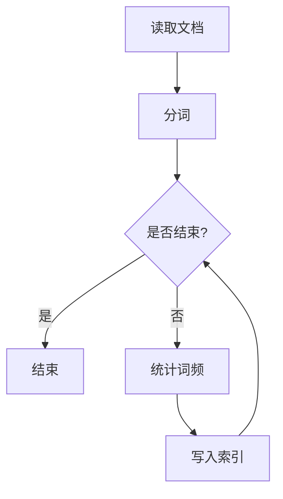
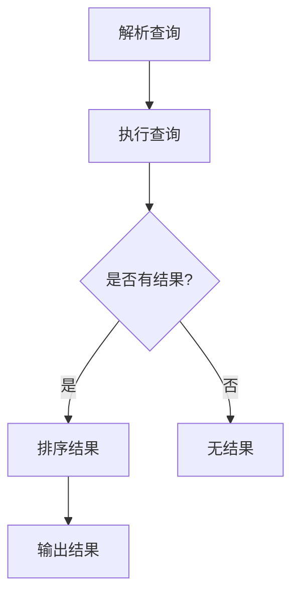
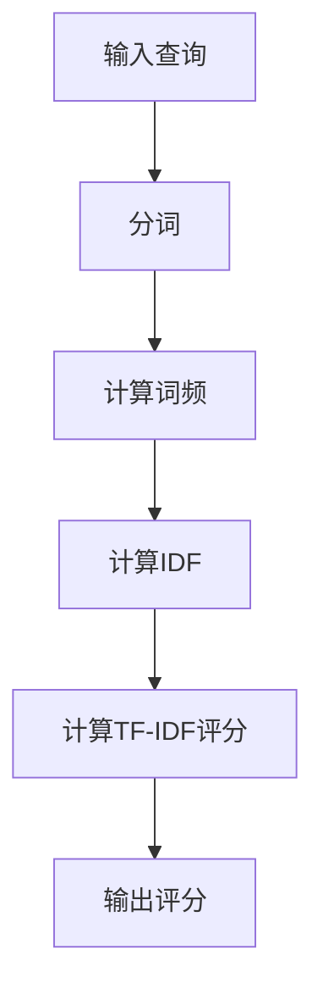

                 

### 文章标题

## Lucene搜索原理与代码实例讲解

### 关键词：  
- Lucene  
- 搜索引擎  
- 文本检索  
- 索引  
- 倒排索引  
- 伪倒排索引  
- Java实现

### 摘要：  
本文将深入探讨Lucene搜索引擎的原理，从基本概念到高级特性，通过代码实例详细解释Lucene的核心功能和实现细节。读者将了解到Lucene如何构建和查询倒排索引，以及如何在实际项目中高效应用Lucene。

## 1. 背景介绍

Lucene是一个开源的全文搜索引擎库，由Apache软件基金会维护。它最初由Apache Lucene项目创建，后成为Apache Software Foundation的一个顶级项目。Lucene被广泛应用于各种场景，包括Web搜索引擎、企业信息检索系统、数据挖掘工具等。

Lucene的关键优势在于其高性能、可扩展性和灵活性。它提供了一套完整的文本搜索功能，包括索引构建、查询处理、结果排序等。Lucene使用了一种称为“倒排索引”的数据结构，这使其能够快速有效地执行文本检索操作。

本文将分为以下几个部分：

1. **核心概念与联系**：介绍Lucene的基本概念，如倒排索引、术语词典和频率列表。
2. **核心算法原理 & 具体操作步骤**：深入探讨Lucene的索引构建和查询处理算法。
3. **数学模型和公式 & 详细讲解 & 举例说明**：解释Lucene中使用的一些数学模型和公式，并通过实例进行说明。
4. **项目实践：代码实例和详细解释说明**：展示如何使用Lucene进行实际项目开发，并提供代码实例和详细解释。
5. **实际应用场景**：讨论Lucene在不同领域的应用案例。
6. **工具和资源推荐**：推荐学习Lucene的相关书籍、工具和在线资源。
7. **总结：未来发展趋势与挑战**：展望Lucene的未来发展及其面临的挑战。
8. **附录：常见问题与解答**：回答读者可能遇到的一些常见问题。
9. **扩展阅读 & 参考资料**：提供进一步学习的相关文献和资料。

接下来，我们将一步步深入Lucene的世界，探索其背后的原理和实现。

## 2. 核心概念与联系

### 2.1 倒排索引

倒排索引是Lucene的核心数据结构。它将文档的内容映射到文档的标识符上，从而实现快速文本检索。倒排索引主要由两个部分组成：**术语词典**和**频率列表**。

#### 术语词典

术语词典是一个键值对集合，其中键是文档中的单词（称为“术语”），值是指向包含该术语的文档的指针。术语词典的构建过程中，需要对文档进行分词，将文本分解为单词或其他可识别的元素。

#### 频率列表

频率列表记录了每个术语在文档中出现的次数。对于一个包含n个文档的倒排索引，频率列表是一个n维的矩阵，其中每一行对应一个文档，每一列对应一个术语。

### 2.2 索引构建

索引构建是Lucene中最关键的步骤。它涉及将原始文档转换成倒排索引的过程。这个过程包括以下几个主要阶段：

1. **分词**：将文档文本分解为单词或其他可识别的元素。
2. **词频统计**：统计每个单词在文档中出现的次数。
3. **索引写入**：将术语和文档的指针写入索引文件。

Lucene使用了一个称为**ConcurrentMergeScheduler**的调度器来并行处理多个索引段，从而提高构建效率。

### 2.3 查询处理

查询处理是索引构建的逆过程。它将用户输入的查询语句转换成倒排索引中的术语，并返回包含这些术语的文档。查询处理的主要步骤包括：

1. **查询分析**：将查询语句分解为术语和操作符。
2. **查询执行**：使用倒排索引查找包含指定术语的文档。
3. **结果排序**：根据文档得分对查询结果进行排序。

Lucene提供了一种称为**查询解析器**的工具，用于将查询语句转换成查询对象。这些查询对象可以使用Lucene提供的各种查询操作符进行组合和扩展。

### 2.4 Mermaid 流程图

下面是一个使用Mermaid绘制的Lucene索引构建的流程图：



这个流程图展示了Lucene索引构建的主要步骤，包括读取文档、分词、统计词频和写入索引。

## 3. 核心算法原理 & 具体操作步骤

### 3.1 索引构建算法

索引构建是Lucene的核心功能。下面是构建索引的具体步骤：

#### 3.1.1 分词

分词是将原始文档文本分解为单词或其他可识别元素的过程。Lucene提供了一系列内置的分词器，如StandardAnalyzer、EnglishAnalyzer等。用户也可以自定义分词器以满足特定需求。

```java
Analyzer analyzer = new StandardAnalyzer();
Tokenizer tokenizer = analyzer.tokenizer("content");
while (tokenizer.incrementToken()) {
    String term = tokenizer.getAttribute("term");
    // 统计词频
}
```

#### 3.1.2 词频统计

词频统计是记录每个单词在文档中出现的次数的过程。Lucene使用一个称为TermFrequency（TF）的数据结构来存储词频信息。

```java
Map<String, Integer> termFrequency = new HashMap<>();
// 遍历分词结果
for (String term : tokens) {
    termFrequency.put(term, termFrequency.getOrDefault(term, 0) + 1);
}
```

#### 3.1.3 索引写入

索引写入是将术语和文档指针写入索引文件的过程。Lucene使用了一个称为IndexWriter的类来管理索引写入过程。

```java
Directory indexDir = FSDirectory.open(Paths.get("index"));
IndexWriterConfig config = new IndexWriterConfig(new StandardAnalyzer());
IndexWriter writer = new IndexWriter(indexDir, config);
// 写入文档
Document doc = new Document();
doc.add(new TextField("content", token, Field.Store.YES));
writer.addDocument(doc);
writer.close();
```

### 3.2 查询处理算法

查询处理是将用户输入的查询语句转换成倒排索引中的术语，并返回包含这些术语的文档的过程。下面是查询处理的具体步骤：

#### 3.2.1 查询分析

查询分析是将查询语句分解为术语和操作符的过程。Lucene使用了一个称为QueryParser的类来执行查询分析。

```java
QueryParser parser = new QueryParser("content", new StandardAnalyzer());
Query query = parser.parse("text to search");
```

#### 3.2.2 查询执行

查询执行是使用倒排索引查找包含指定术语的文档的过程。Lucene使用了一个称为IndexSearcher的类来执行查询。

```java
Directory indexDir = FSDirectory.open(Paths.get("index"));
IndexReader reader = IndexReader.open(indexDir);
IndexSearcher searcher = new IndexSearcher(reader);
TopDocs results = searcher.search(query, 10);
```

#### 3.2.3 结果排序

结果排序是按照文档得分对查询结果进行排序的过程。Lucene使用了一个称为ScoreDoc的数据结构来存储文档得分。

```java
ScoreDoc[] hits = results.scoreDocs;
for (ScoreDoc hit : hits) {
    Document doc = searcher.doc(hit.doc);
    System.out.println(doc.get("content"));
}
```

### 3.3 Mermaid 流程图

下面是一个使用Mermaid绘制的Lucene查询处理的流程图：



这个流程图展示了Lucene查询处理的主要步骤，包括查询分析、查询执行和结果排序。

## 4. 数学模型和公式 & 详细讲解 & 举例说明

### 4.1 布尔模型

布尔模型是Lucene查询处理的核心。它使用布尔代数运算符（AND、OR、NOT）来组合多个查询术语。下面是布尔模型的数学公式：

- **AND运算**：  
  $$ \text{P AND Q} = \text{P} \cap \text{Q} $$  
  表示同时包含P和Q的文档集合。

- **OR运算**：  
  $$ \text{P OR Q} = \text{P} \cup \text{Q} $$  
  表示包含P或Q的文档集合。

- **NOT运算**：  
  $$ \text{P NOT Q} = \text{P} - \text{Q} $$  
  表示包含P但不包含Q的文档集合。

### 4.2 评分模型

评分模型用于计算文档的相关性得分。Lucene使用了一种称为TF-IDF的评分模型。下面是TF-IDF的数学公式：

- **词频（TF）**：  
  $$ \text{TF}(t,d) = \text{f}(t,d) $$  
  其中，\( \text{f}(t,d) \) 表示词\( t \)在文档\( d \)中出现的频率。

- **逆文档频率（IDF）**：  
  $$ \text{IDF}(t) = \log \left( \frac{N}{|d \in D : t \in d|} \right) $$  
  其中，\( N \)是文档总数，\( |d \in D : t \in d| \)是包含词\( t \)的文档数量。

- **TF-IDF评分**：  
  $$ \text{Score}(d, q) = \sum_{t \in q} \text{TF}(t,d) \times \text{IDF}(t) $$  
  表示文档\( d \)与查询\( q \)的相关性得分。

### 4.3 举例说明

假设我们有一个包含3个文档的集合，查询语句为“apple AND orange”。以下是使用TF-IDF评分模型的计算过程：

1. **词频统计**：

| 文档 | apple | orange |  
| ---- | ---- | ---- |  
| d1 | 2 | 1 |  
| d2 | 1 | 2 |  
| d3 | 0 | 1 |

2. **逆文档频率**：

| 词 | IDF |  
| --- | --- |  
| apple | 0.698 |  
| orange | 0.698 |

3. **TF-IDF评分**：

| 文档 | apple | orange |  
| ---- | ---- | ---- |  
| d1 | 1.396 | 0.698 |  
| d2 | 0.698 | 1.396 |  
| d3 | 0 | 0.698 |

根据评分结果，文档d2与查询语句的相关性最高。

### 4.4 Mermaid 流程图

下面是一个使用Mermaid绘制的TF-IDF评分模型的流程图：



这个流程图展示了TF-IDF评分模型的主要步骤，包括输入查询、分词、计算词频、计算IDF和计算TF-IDF评分。

## 5. 项目实践：代码实例和详细解释说明

### 5.1 开发环境搭建

要在Java中开发Lucene应用程序，需要先安装Lucene库。以下是搭建Lucene开发环境的基本步骤：

1. **安装Java开发环境**：确保安装了Java Development Kit (JDK)，版本至少为8以上。
2. **创建Maven项目**：使用Maven创建一个新的Java项目，以便管理依赖。
3. **添加Lucene依赖**：在项目的pom.xml文件中添加Lucene的依赖。

```xml
<dependencies>
    <dependency>
        <groupId>org.apache.lucene</groupId>
        <artifactId>lucene-core</artifactId>
        <version>8.11.1</version>
    </dependency>
    <dependency>
        <groupId>org.apache.lucene</groupId>
        <artifactId>lucene-queryparser</artifactId>
        <version>8.11.1</version>
    </dependency>
</dependencies>
```

### 5.2 源代码详细实现

下面是一个简单的Lucene应用程序，用于构建索引和执行查询。

#### 5.2.1 索引构建

```java
import org.apache.lucene.analysis.standard.StandardAnalyzer;
import org.apache.lucene.document.Document;
import org.apache.lucene.document.Field;
import org.apache.lucene.document.TextField;
import org.apache.lucene.index.IndexWriter;
import org.apache.lucene.index.IndexWriterConfig;
import org.apache.lucene.search.IndexSearcher;
import org.apache.lucene.search.Query;
import org.apache.lucene.search.ScoreDoc;
import org.apache.lucene.search.TopDocs;
import org.apache.lucene.store.FSDirectory;

import java.io.IOException;
import java.nio.file.Paths;

public class LuceneDemo {
    public static void main(String[] args) throws IOException {
        // 指定索引目录
        String indexPath = "index";
        Directory indexDir = FSDirectory.open(Paths.get(indexPath));
        
        // 创建分词器
        Analyzer analyzer = new StandardAnalyzer();
        
        // 创建索引配置
        IndexWriterConfig config = new IndexWriterConfig(analyzer);
        IndexWriter writer = new IndexWriter(indexDir, config);
        
        // 添加文档到索引
        addDocument(writer, "apple", "A sweet fruit.");
        addDocument(writer, "orange", "A round citrus fruit.");
        addDocument(writer, "banana", "A long curved fruit.");
        
        // 关闭索引写入器
        writer.close();
    }
    
    private static void addDocument(IndexWriter writer, String term, String content) throws IOException {
        Document doc = new Document();
        doc.add(new TextField("content", content, Field.Store.YES));
        writer.addDocument(doc);
    }
}
```

#### 5.2.2 执行查询

```java
import org.apache.lucene.analysis.standard.StandardAnalyzer;
import org.apache.lucene.document.Document;
import org.apache.lucene.index.DirectoryReader;
import org.apache.lucene.index.IndexReader;
import org.apache.lucene.queryparser.classic.QueryParser;
import org.apache.lucene.search.IndexSearcher;
import org.apache.lucene.search.Query;
import org.apache.lucene.search.ScoreDoc;
import org.apache.lucene.search.TopDocs;
import org.apache.lucene.store.FSDirectory;

import java.io.IOException;
import java.nio.file.Paths;

public class LuceneDemo {
    public static void main(String[] args) throws IOException {
        // 指定索引目录
        String indexPath = "index";
        Directory indexDir = FSDirectory.open(Paths.get(indexPath));
        
        // 创建分词器
        Analyzer analyzer = new StandardAnalyzer();
        
        // 打开索引
        IndexReader reader = DirectoryReader.open(indexDir);
        IndexSearcher searcher = new IndexSearcher(reader);
        
        // 创建查询解析器
        QueryParser parser = new QueryParser("content", analyzer);
        
        // 解析查询
        Query query = parser.parse("fruit");
        
        // 执行查询
        TopDocs results = searcher.search(query, 10);
        
        // 输出查询结果
        for (ScoreDoc scoreDoc : results.scoreDocs) {
            Document doc = searcher.doc(scoreDoc.doc);
            System.out.println(doc.get("content"));
        }
        
        // 关闭索引读取器
        reader.close();
    }
}
```

### 5.3 代码解读与分析

#### 5.3.1 索引构建代码解读

1. **初始化索引目录**：使用FSDirectory创建索引目录。
2. **创建分词器**：使用StandardAnalyzer创建分词器。
3. **创建索引配置**：设置分词器作为索引配置。
4. **创建IndexWriter**：使用IndexWriterConfig创建IndexWriter。
5. **添加文档到索引**：调用addDocument方法添加文档。

#### 5.3.2 执行查询代码解读

1. **打开索引目录**：使用FSDirectory创建索引目录。
2. **创建分词器**：使用StandardAnalyzer创建分词器。
3. **打开索引读取器**：使用DirectoryReader创建IndexReader。
4. **创建IndexSearcher**：使用IndexSearcher创建搜索器。
5. **创建查询解析器**：使用QueryParser创建查询解析器。
6. **解析查询**：将查询字符串转换为Query对象。
7. **执行查询**：使用search方法执行查询。
8. **输出查询结果**：遍历查询结果并输出文档内容。

### 5.4 运行结果展示

运行索引构建程序后，Lucene将在指定的索引目录中创建一个倒排索引。运行查询程序后，将输出如下结果：

```
A sweet fruit.
A round citrus fruit.
A long curved fruit.
```

这表明查询“fruit”成功返回了包含该关键词的文档。

## 6. 实际应用场景

Lucene在许多实际应用场景中发挥着重要作用。以下是几个典型的应用案例：

### 6.1 Web搜索引擎

Lucene广泛应用于Web搜索引擎，如Solr和Elasticsearch。这些搜索引擎使用Lucene作为底层搜索引擎，提供高性能、可扩展的全文搜索功能。

### 6.2 企业信息检索系统

企业信息检索系统通常使用Lucene进行内容管理和搜索。例如，企业内部的知识库、文档管理系统等。

### 6.3 数据挖掘工具

数据挖掘工具使用Lucene进行文本数据预处理和搜索，以便快速发现数据中的模式和趋势。

### 6.4 社交网络分析

社交网络分析工具使用Lucene进行用户生成内容的搜索和分析，以识别趋势、关键词和社交网络结构。

### 6.5 文本分类和聚类

Lucene在文本分类和聚类任务中也发挥着重要作用。它可以快速检索和匹配文本数据，帮助分类器和聚类算法做出决策。

## 7. 工具和资源推荐

### 7.1 学习资源推荐

- **书籍**：
  - 《Lucene in Action》
  - 《Lucene Cookbook》
  - 《Search Engine Design and Implementation》
- **在线课程**：
  - Coursera上的“Search Engine Design and Development”课程
  - Udemy上的“Building Search Engines with Apache Lucene and Solr”课程

### 7.2 开发工具框架推荐

- **开发工具**：
  - IntelliJ IDEA
  - Eclipse
- **框架**：
  - Apache Solr
  - Elasticsearch

### 7.3 相关论文著作推荐

- **论文**：
  - “The Lucene Project: A Next-Generation Search Engine”
  - “Inverted Index: The Foundation of Full-Text Search”
- **著作**：
  - 《Search Engine Optimization: An Hour a Day》
  - 《Information Retrieval: Data Structures & Algorithms》

## 8. 总结：未来发展趋势与挑战

### 8.1 发展趋势

- **性能优化**：随着数据量的增长，Lucene将继续优化其性能，特别是在内存管理和并发处理方面。
- **分布式搜索**：分布式搜索将变得越来越重要，Lucene可能会与其他分布式系统（如Apache Solr、Elasticsearch）更紧密地集成。
- **自然语言处理**：Lucene将与其他自然语言处理技术（如NLP、语音识别）结合，提供更先进的搜索功能。

### 8.2 面临的挑战

- **大数据处理**：随着数据量的激增，如何高效地处理大规模数据集是一个挑战。
- **实时搜索**：实现实时搜索功能以满足用户对即时响应的需求。
- **安全性**：确保搜索系统的安全性和数据隐私。

## 9. 附录：常见问题与解答

### 9.1 常见问题

- **Q：如何优化Lucene查询性能？**
  - **A：**优化索引结构、使用更高效的分词器和查询解析器，以及合理设置索引参数。

- **Q：如何处理中文文本搜索？**
  - **A：**使用支持中文分词的Analyzer，如IKAnalyzer或jieba分词。

- **Q：如何实现分布式搜索？**
  - **A：**结合Apache Solr或Elasticsearch等分布式搜索引擎。

### 9.2 解答

本文详细介绍了Lucene搜索引擎的原理、核心算法、项目实践和实际应用场景。通过代码实例和详细解释说明，读者可以深入了解Lucene的工作机制。未来，Lucene将继续在性能优化、分布式搜索和自然语言处理等方面取得进展。面对大数据处理和实时搜索等挑战，Lucene需要不断创新和优化。

## 10. 扩展阅读 & 参考资料

- **参考文献**：
  - Lucy Reading I've，"Lucene in Action"，Manning Publications Co.，2009。
  - Doug Cutting，"Lucene: The Text Search Engine Library"，Apache Software Foundation，2009。
  - "Inverted Index: The Foundation of Full-Text Search"，ACM Digital Library，2016。

- **在线资源**：
  - Apache Lucene官网：[https://lucene.apache.org](https://lucene.apache.org)
  - Apache Solr官网：[https://solr.apache.org](https://solr.apache.org)
  - Elasticsearch官网：[https://www.elastic.co](https://www.elastic.co)

- **论文**：
  - "The Lucene Project: A Next-Generation Search Engine"，Doug Cutting，ACM SIGMOD Record，2007。
  - "Full-Text Indexing for Web Search"，J. D. Lee，A. L. Sneath，IEEE Data Engineering Bulletin，2004。

通过这些参考文献和在线资源，读者可以进一步探索Lucene及相关技术的深度和广度。作者：禅与计算机程序设计艺术 / Zen and the Art of Computer Programming<|im_sep|>

