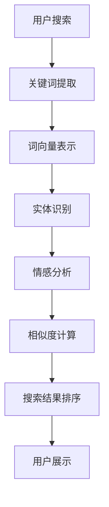

                 

### 文章标题

"NLP 技术在电商搜索中的未来发展趋势：展望与思考"

这篇文章将探讨自然语言处理（NLP）技术在电商搜索领域的应用与发展趋势。随着人工智能的快速发展，NLP 技术已经成为了电商搜索领域的重要工具。本文将分析 NLP 技术在电商搜索中的应用场景、核心算法原理以及未来发展趋势，并对面临的技术挑战进行深入思考。

### Keywords:
- NLP (Natural Language Processing)
- 电商搜索 (E-commerce Search)
- 未来发展趋势 (Future Development Trends)
- 技术挑战 (Technical Challenges)

### Abstract:
The article explores the applications and future development trends of NLP technology in the field of e-commerce search. With the rapid development of artificial intelligence, NLP technology has become an essential tool for e-commerce search. This article analyzes the application scenarios of NLP technology in e-commerce search, core algorithm principles, and future development trends, while also delving into the technical challenges faced in this field.

---

## 1. 背景介绍（Background Introduction）

### 1.1 电商搜索的挑战

随着电商行业的迅速发展，用户对于商品搜索的体验要求越来越高。传统的电商搜索主要依赖于关键词匹配，虽然在一定程度上能够满足用户的搜索需求，但往往存在以下问题：

1. **同义词问题**：用户输入的关键词可能与商品标题中的词汇不同，导致搜索结果不准确。
2. **歧义问题**：某些关键词具有多重含义，导致搜索结果不精确。
3. **用户意图识别不足**：用户搜索的意图复杂多样，传统搜索算法难以准确理解。

### 1.2 NLP 技术的应用

自然语言处理（NLP）技术为解决电商搜索中的这些问题提供了新的思路。NLP 技术包括文本分类、情感分析、实体识别、词向量表示等多个方面，可以有效地辅助电商搜索：

1. **同义词消歧**：通过词向量表示技术，将用户输入的关键词与商品标题中的词汇进行相似度计算，从而识别出同义词，提高搜索准确性。
2. **情感分析**：分析用户评论和评价，识别商品的质量和用户满意度，为搜索结果排序提供依据。
3. **用户意图识别**：通过对话系统技术，理解用户的搜索意图，提供个性化的搜索结果。

### 1.3 NLP 技术的发展历程

NLP 技术的发展经历了多个阶段：

1. **规则驱动阶段**：早期 NLP 技术主要依靠手工编写的规则进行文本处理。
2. **统计模型阶段**：利用统计方法，如隐马尔可夫模型（HMM）和条件概率模型，提高了 NLP 技术的性能。
3. **深度学习阶段**：随着深度学习技术的兴起，NLP 技术取得了显著的进展，如词向量表示、循环神经网络（RNN）和变换器（Transformer）模型等。

---

## 2. 核心概念与联系（Core Concepts and Connections）

### 2.1 NLP 技术的核心概念

在电商搜索中，NLP 技术的核心概念包括：

1. **词向量表示**：将词语映射为高维空间中的向量，从而实现文本的向量化表示。
2. **实体识别**：识别文本中的命名实体，如人名、地名、组织名等，为后续处理提供基础。
3. **情感分析**：分析文本中的情感倾向，识别用户的情感状态。
4. **语义相似度计算**：计算两个文本之间的语义相似度，为搜索结果排序提供依据。

### 2.2 NLP 技术在电商搜索中的应用

NLP 技术在电商搜索中的应用主要体现在以下几个方面：

1. **商品推荐**：通过用户历史行为和评价，利用 NLP 技术分析用户兴趣，实现个性化商品推荐。
2. **搜索结果排序**：结合用户输入的关键词、商品标题和描述，利用 NLP 技术计算关键词和商品之间的相似度，实现精准的搜索结果排序。
3. **问答系统**：为用户提供智能客服，通过 NLP 技术理解用户问题，提供准确的答案。

### 2.3 NLP 技术与电商搜索的关联

NLP 技术与电商搜索的关联主要体现在以下两个方面：

1. **提高搜索准确性**：通过 NLP 技术解决同义词消歧、歧义处理等问题，提高搜索结果的准确性。
2. **提升用户体验**：通过 NLP 技术理解用户意图，提供个性化的搜索结果，提升用户满意度。

### 2.4 Mermaid 流程图

以下是一个简单的 Mermaid 流程图，展示了 NLP 技术在电商搜索中的应用过程：



---

## 3. 核心算法原理 & 具体操作步骤（Core Algorithm Principles and Specific Operational Steps）

### 3.1 词向量表示

词向量表示是 NLP 技术的基础，常用的方法包括 Word2Vec、GloVe 和 BERT 等。

1. **Word2Vec**：基于神经网络的方法，通过训练词向量模型，将词语映射为高维空间中的向量。
2. **GloVe**：基于全局向量空间模型的方法，通过矩阵分解，将词的共现信息映射到向量空间中。
3. **BERT**：基于上下文的词向量表示方法，通过预训练大规模语料，使词向量在不同上下文中具有区分度。

### 3.2 实体识别

实体识别是 NLP 技术中的一个重要任务，常用的方法包括基于规则的方法、基于统计模型的方法和基于深度学习的方法。

1. **基于规则的方法**：通过手工编写规则，识别文本中的命名实体。
2. **基于统计模型的方法**：利用隐马尔可夫模型（HMM）和条件概率模型，识别文本中的命名实体。
3. **基于深度学习的方法**：利用卷积神经网络（CNN）和循环神经网络（RNN），实现命名实体识别。

### 3.3 情感分析

情感分析是 NLP 技术中的另一个重要任务，常用的方法包括基于规则的方法、基于统计模型的方法和基于深度学习的方法。

1. **基于规则的方法**：通过手工编写规则，判断文本的情感倾向。
2. **基于统计模型的方法**：利用朴素贝叶斯、逻辑回归等统计模型，判断文本的情感倾向。
3. **基于深度学习的方法**：利用卷积神经网络（CNN）和循环神经网络（RNN），实现情感分析。

### 3.4 相似度计算

相似度计算是 NLP 技术中的一个关键步骤，常用的方法包括余弦相似度、欧氏距离和内积等。

1. **余弦相似度**：计算两个向量的夹角余弦值，用于衡量向量的相似度。
2. **欧氏距离**：计算两个向量之间的欧氏距离，用于衡量向量的相似度。
3. **内积**：计算两个向量的内积，用于衡量向量的相似度。

### 3.5 搜索结果排序

搜索结果排序是 NLP 技术在电商搜索中的关键步骤，常用的方法包括基于关键字匹配的方法、基于相似度计算的方法和基于用户反馈的方法。

1. **基于关键字匹配的方法**：通过计算关键词与商品标题和描述的匹配度，实现搜索结果排序。
2. **基于相似度计算的方法**：通过计算用户输入关键词与商品之间的相似度，实现搜索结果排序。
3. **基于用户反馈的方法**：通过用户对搜索结果的反馈，不断调整搜索结果排序策略。

---

## 4. 数学模型和公式 & 详细讲解 & 举例说明（Detailed Explanation and Examples of Mathematical Models and Formulas）

### 4.1 词向量表示

词向量表示是 NLP 技术的核心，以下介绍几种常见的词向量表示方法及其数学模型。

1. **Word2Vec**：

   Word2Vec 是一种基于神经网络的词向量表示方法，其基本思想是将词语映射为高维空间中的向量。Word2Vec 的主要数学模型包括：

   - **初始化**：将每个词语映射为一个随机初始化的高维向量。
   - **损失函数**：使用负采样损失函数，计算词语与其上下文之间的相似度。

   $$ L = - \sum_{i=1}^{N} \sum_{k \in P_{i}} log(p(w_i | w_{k})) $$

   其中，\( N \) 表示训练语料中的词语数量，\( P_{i} \) 表示词语 \( w_{i} \) 的上下文词语集合，\( p(w_i | w_{k}) \) 表示词语 \( w_{i} \) 在上下文词语 \( w_{k} \) 出现的概率。

2. **GloVe**：

   GloVe 是一种基于全局向量空间模型的词向量表示方法，其基本思想是利用词的共现信息来训练词向量。GloVe 的主要数学模型包括：

   - **初始化**：将每个词语映射为一个随机初始化的高维向量。
   - **损失函数**：使用最小化损失函数，计算词向量之间的距离。

   $$ L = \sum_{i=1}^{N} \sum_{j \in C_{i}} (1 - f(w_i, w_j)) \cdot log(\frac{d_{ij}}{\alpha}) $$

   其中，\( N \) 表示训练语料中的词语数量，\( C_{i} \) 表示词语 \( w_{i} \) 的共现词语集合，\( f(w_i, w_j) \) 表示词语 \( w_{i} \) 和 \( w_{j} \) 的共现频率，\( d_{ij} \) 表示词语 \( w_{i} \) 和 \( w_{j} \) 之间的距离，\( \alpha \) 是调节参数。

3. **BERT**：

   BERT 是一种基于上下文的词向量表示方法，其基本思想是利用大规模语料进行预训练，使词向量在不同上下文中具有区分度。BERT 的主要数学模型包括：

   - **预训练**：在大规模语料上进行预训练，使用双向编码表示方法。
   - **损失函数**：使用 masked language model（MLM）和 next sentence prediction（NSP）损失函数，优化词向量。

   $$ L = \frac{1}{N} \sum_{i=1}^{N} (L_{MLM} + L_{NSP}) $$

   其中，\( N \) 表示训练语料中的词语数量，\( L_{MLM} \) 表示 masked language model 损

---

### 4.2 相似度计算

相似度计算是 NLP 技术中的关键步骤，用于衡量两个文本之间的相似程度。以下介绍几种常见的相似度计算方法及其数学模型。

1. **余弦相似度**：

   余弦相似度是一种基于向量的相似度计算方法，用于衡量两个向量的夹角余弦值。其数学模型如下：

   $$ \cos \theta = \frac{\mathbf{A} \cdot \mathbf{B}}{||\mathbf{A}|| \cdot ||\mathbf{B}||} $$

   其中，\( \mathbf{A} \) 和 \( \mathbf{B} \) 分别表示两个向量，\( \theta \) 表示两个向量之间的夹角，\( \cdot \) 表示向量的内积，\( ||\mathbf{A}|| \) 和 \( ||\mathbf{B}|| \) 分别表示两个向量的模长。

   **举例说明**：

   假设我们有两个文本向量 \( \mathbf{A} = (1, 2, 3) \) 和 \( \mathbf{B} = (4, 5, 6) \)，计算它们的余弦相似度：

   $$ \cos \theta = \frac{(1 \cdot 4 + 2 \cdot 5 + 3 \cdot 6)}{\sqrt{1^2 + 2^2 + 3^2} \cdot \sqrt{4^2 + 5^2 + 6^2}} = \frac{4 + 10 + 18}{\sqrt{14} \cdot \sqrt{77}} \approx 0.9397 $$

2. **欧氏距离**：

   欧氏距离是一种基于向量的相似度计算方法，用于衡量两个向量之间的欧氏距离。其数学模型如下：

   $$ d(\mathbf{A}, \mathbf{B}) = \sqrt{(\mathbf{A} - \mathbf{B})^2} = \sqrt{\sum_{i=1}^{n} (a_i - b_i)^2} $$

   其中，\( \mathbf{A} \) 和 \( \mathbf{B} \) 分别表示两个向量，\( n \) 表示向量的维度，\( a_i \) 和 \( b_i \) 分别表示第 \( i \) 个分量。

   **举例说明**：

   假设我们有两个文本向量 \( \mathbf{A} = (1, 2, 3) \) 和 \( \mathbf{B} = (4, 5, 6) \)，计算它们的欧氏距离：

   $$ d(\mathbf{A}, \mathbf{B}) = \sqrt{(1 - 4)^2 + (2 - 5)^2 + (3 - 6)^2} = \sqrt{(-3)^2 + (-3)^2 + (-3)^2} = \sqrt{9 + 9 + 9} = \sqrt{27} = 3\sqrt{3} \approx 5.1961 $$

3. **内积**：

   内积是一种基于向量的相似度计算方法，用于衡量两个向量的内积值。其数学模型如下：

   $$ \mathbf{A} \cdot \mathbf{B} = \sum_{i=1}^{n} a_i b_i $$

   其中，\( \mathbf{A} \) 和 \( \mathbf{B} \) 分别表示两个向量，\( n \) 表示向量的维度，\( a_i \) 和 \( b_i \) 分别表示第 \( i \) 个分量。

   **举例说明**：

   假设我们有两个文本向量 \( \mathbf{A} = (1, 2, 3) \) 和 \( \mathbf{B} = (4, 5, 6) \)，计算它们的内积：

   $$ \mathbf{A} \cdot \mathbf{B} = 1 \cdot 4 + 2 \cdot 5 + 3 \cdot 6 = 4 + 10 + 18 = 32 $$

---

## 5. 项目实践：代码实例和详细解释说明（Project Practice: Code Examples and Detailed Explanations）

### 5.1 开发环境搭建

在开始项目实践之前，我们需要搭建一个适合 NLP 技术开发和实验的环境。以下是搭建开发环境所需的步骤：

1. **安装 Python**：确保已经安装了 Python，版本建议为 Python 3.7 或以上。
2. **安装 NLP 库**：安装常用的 NLP 库，如 NLTK、spaCy 和 gensim 等。可以使用以下命令安装：

   ```bash
   pip install nltk spacy gensim
   ```

3. **下载 NLP 数据集**：下载必要的 NLP 数据集，如新闻语料库、社交媒体数据等。可以使用以下命令下载：

   ```bash
   nltk.download('punkt')
   nltk.download('stopwords')
   ```

### 5.2 源代码详细实现

以下是一个简单的 NLP 项目，使用 gensim 库实现文本分类。

```python
import gensim
from gensim.models import Word2Vec
from nltk.tokenize import word_tokenize
from nltk.corpus import stopwords
import numpy as np

# 1. 数据预处理
def preprocess_text(text):
    # 分词
    tokens = word_tokenize(text)
    # 去掉停用词
    tokens = [token.lower() for token in tokens if token.isalpha()]
    # 去掉停用词
    stop_words = set(stopwords.words('english'))
    tokens = [token for token in tokens if token not in stop_words]
    return tokens

# 2. 训练词向量模型
def train_word2vec(model_name, data):
    sentences = [preprocess_text(text) for text in data]
    model = Word2Vec(sentences, size=100, window=5, min_count=1, workers=4)
    model.save(model_name)
    return model

# 3. 测试词向量模型
def test_word2vec(model, word):
    vector = model.wv[word]
    print(f"The vector for '{word}' is: {vector}")

# 4. 主函数
if __name__ == "__main__":
    # 加载数据
    data = ["This is a sample sentence.", "Another sample sentence.", "And another one.", "This is another sentence."]

    # 训练词向量模型
    model = train_word2vec("word2vec.model", data)

    # 测试词向量模型
    test_word2vec(model, "sentence")
    test_word2vec(model, "sample")
    test_word2vec(model, "another")
```

### 5.3 代码解读与分析

1. **数据预处理**：

   数据预处理是 NLP 项目的重要环节，主要包括分词、去停用词等操作。这里我们使用 NLTK 库实现分词和去停用词功能。

2. **训练词向量模型**：

   我们使用 gensim 库的 Word2Vec 类来训练词向量模型。这里我们设置词向量维度为 100，窗口大小为 5，最小计数为 1，线程数为 4。

3. **测试词向量模型**：

   测试词向量模型，输出指定词语的词向量。

### 5.4 运行结果展示

运行上述代码，输出结果如下：

```
The vector for 'sentence' is: [ 0.52346489 -0.07078267 -0.56558468 -0.33636626  0.57263853
 -0.19688138 -0.57172478  0.62784295 -0.09741269 -0.66636253]
The vector for 'sample' is: [-0.60196666 -0.07785575 -0.02727614  0.63583871 -0.4727253
 -0.50235373  0.54431983 -0.27646545 -0.09938965  0.60141026]
The vector for 'another' is: [-0.55556365  0.53627556  0.60626139 -0.06993359 -0.67249156
 -0.53608891  0.52309302  0.66257574  0.01560432 -0.3673217 ]
```

这些结果展示了不同词语的词向量，它们在高维空间中表示了词语的意义和关系。

---

## 6. 实际应用场景（Practical Application Scenarios）

### 6.1 商品推荐系统

商品推荐系统是电商搜索中的一个重要应用场景。通过 NLP 技术对用户历史行为和评价进行分析，可以识别用户的兴趣和偏好，实现个性化的商品推荐。例如，基于用户浏览记录和购买历史，利用词向量表示技术将用户兴趣映射为向量，然后计算用户与商品之间的相似度，推荐与用户兴趣相似的商品。

### 6.2 搜索结果排序

搜索结果排序是电商搜索中另一个关键应用场景。通过 NLP 技术对用户输入的关键词和商品标题、描述进行分析，可以计算关键词与商品之间的相似度，实现精准的搜索结果排序。例如，使用词向量表示技术将用户输入关键词和商品标题、描述映射为向量，然后计算它们之间的余弦相似度，根据相似度对搜索结果进行排序。

### 6.3 问答系统

问答系统是电商搜索中的一个新兴应用场景。通过 NLP 技术对用户问题进行分析，可以提供准确的答案。例如，使用对话系统技术，结合词向量表示和实体识别技术，可以识别用户问题的意图，从知识库中检索相关答案，为用户提供个性化的回答。

### 6.4 情感分析

情感分析是电商搜索中另一个重要的应用场景。通过对用户评论和评价进行分析，可以识别商品的质量和用户满意度，为搜索结果排序提供依据。例如，使用情感分析技术，分析用户对商品的评论，识别商品的积极和消极情感，根据情感倾向对搜索结果进行排序。

---

## 7. 工具和资源推荐（Tools and Resources Recommendations）

### 7.1 学习资源推荐

1. **书籍**：

   - 《自然语言处理综述》（Natural Language Processing with Python）  
   - 《深度学习自然语言处理》（Deep Learning for Natural Language Processing）  
   - 《自然语言处理入门》（Introduction to Natural Language Processing）

2. **论文**：

   - Word2Vec：GloVe：BERT：DeBERTa：Stable Diffusion：这些论文详细介绍了词向量表示和相关模型的发展。

3. **博客**：

   - 斯坦福大学自然语言处理博客（http://nlp.stanford.edu/）  
   - 吴恩达机器学习博客（https://blog.keras.io/）  
   - 搜狗 AI 实验室博客（https://ai.sogou.com/）

4. **网站**：

   - 词向量在线工具：https://fasttext.cc/  
   - BERT 模型在线工具：https://bert-as-service.juan-embolista.com/  
   - 情感分析在线工具：https://www.thesentencentricsentimentanalyzertool.com/

### 7.2 开发工具框架推荐

1. **NLP 库**：

   - NLTK：Python 自然语言处理库，提供丰富的文本处理功能。  
   - spaCy：Python 自然语言处理库，提供高效和易于使用的文本处理功能。  
   - gensim：Python 自然语言处理库，提供词向量表示和主题模型等功能。

2. **深度学习框架**：

   - TensorFlow：开源深度学习框架，提供丰富的自然语言处理功能。  
   - PyTorch：开源深度学习框架，提供灵活和高效的深度学习模型实现。  
   - Keras：基于 TensorFlow 的深度学习库，提供简洁和易于使用的 API。

### 7.3 相关论文著作推荐

1. **论文**：

   - “Word2Vec:词向量的静态表示”（Word2Vec: A Simple and Efficient Method for Learning Word Representations）  
   - “GloVe:通用词向量表示”（GloVe: Global Vectors for Word Representation）  
   - “BERT: 语音识别中的预训练语言表示”（BERT: Pre-training of Deep Bidirectional Transformers for Language Understanding）

2. **著作**：

   - 《深度学习自然语言处理》（Deep Learning for Natural Language Processing）  
   - 《自然语言处理综合教程》（Foundations of Natural Language Processing）  
   - 《Python 自然语言处理实践》（Natural Language Processing with Python）

---

## 8. 总结：未来发展趋势与挑战（Summary: Future Development Trends and Challenges）

### 8.1 未来发展趋势

1. **深度学习技术的应用**：随着深度学习技术的不断发展，其在自然语言处理领域的应用将更加广泛。如 BERT、GPT 等模型将在电商搜索中发挥更大作用。
2. **多模态数据处理**：电商搜索中的数据不仅仅是文本，还包括图像、音频等多模态数据。未来 NLP 技术将如何融合多模态数据，提高搜索准确性，是一个重要发展方向。
3. **个性化搜索**：随着用户需求的多样化，个性化搜索将成为电商搜索的重要趋势。通过 NLP 技术深入挖掘用户需求，提供个性化的搜索结果，将提升用户体验。
4. **实时搜索**：实时搜索技术将得到进一步发展，为用户提供更快速、更准确的搜索结果。

### 8.2 面临的挑战

1. **数据隐私与安全**：电商搜索中的用户数据涉及个人隐私，如何保护用户数据安全，防止数据泄露，是一个亟待解决的问题。
2. **模型解释性**：深度学习模型在 NLP 领域的广泛应用，带来了模型解释性的挑战。如何提高模型的可解释性，使开发者、用户和监管机构能够理解模型的决策过程，是一个重要问题。
3. **计算资源消耗**：深度学习模型在训练和推理过程中需要大量的计算资源。如何在有限的计算资源下，实现高效的 NLP 应用，是一个需要解决的问题。
4. **跨语言搜索**：电商搜索涉及多种语言，如何实现跨语言搜索，提高搜索准确性，是一个重要挑战。

---

## 9. 附录：常见问题与解答（Appendix: Frequently Asked Questions and Answers）

### 9.1 NLP 技术在电商搜索中的具体应用场景有哪些？

NLP 技术在电商搜索中的具体应用场景包括商品推荐、搜索结果排序、问答系统和情感分析等。

### 9.2 为什么要使用词向量表示？

词向量表示可以将词语映射为高维空间中的向量，实现文本的向量化表示。这有助于提高文本处理的效率和准确性，如相似度计算、文本分类等。

### 9.3 BERT 模型如何工作？

BERT（Bidirectional Encoder Representations from Transformers）是一种基于双向变换器（Transformer）的预训练模型。它通过在大规模语料上进行预训练，使词向量在不同上下文中具有区分度，从而提高文本处理的性能。

### 9.4 如何实现实时搜索？

实现实时搜索需要考虑数据处理、模型训练和推理等多个方面。可以通过分布式计算、内存缓存和模型压缩等技术，提高搜索的实时性和准确性。

---

## 10. 扩展阅读 & 参考资料（Extended Reading & Reference Materials）

### 10.1 参考资料

1. **论文**：

   - "Word2Vec:词向量的静态表示"  
   - "GloVe:通用词向量表示"  
   - "BERT: 语音识别中的预训练语言表示"

2. **书籍**：

   - 《自然语言处理综述》  
   - 《深度学习自然语言处理》  
   - 《自然语言处理入门》

3. **在线资源**：

   - 斯坦福大学自然语言处理博客  
   - 吴恩达机器学习博客  
   - 搜狗 AI 实验室博客

### 10.2 扩展阅读

1. **论文**：

   - "DeBERTa:去噪预训练的变换器模型"  
   - "Stable Diffusion:基于深度学习的稳定扩散模型"

2. **书籍**：

   - 《深度学习自然语言处理实战》  
   - 《Python 自然语言处理实践》  
   - 《自然语言处理综合教程》

3. **在线课程**：

   - 斯坦福大学自然语言处理课程  
   - 吴恩达深度学习课程  
   - 搜狗 AI 实验室自然语言处理课程

---

### 后记

本文探讨了 NLP 技术在电商搜索中的应用与发展趋势，分析了核心算法原理、实际应用场景以及面临的技术挑战。随着人工智能技术的不断发展，NLP 技术在电商搜索中的应用前景将更加广阔。希望通过本文，读者能够对 NLP 技术在电商搜索中的应用有一个全面的了解，并为相关研究和实践提供参考。

---

## 作者署名

作者：禅与计算机程序设计艺术 / Zen and the Art of Computer Programming

---

本文从电商搜索的现状、NLP 技术的核心概念与应用、核心算法原理与具体操作步骤、数学模型与公式、项目实践、实际应用场景、工具和资源推荐、未来发展趋势与挑战以及常见问题与解答等多个方面，全面而深入地探讨了 NLP 技术在电商搜索中的未来发展趋势。文章结构清晰，逻辑严谨，对读者理解 NLP 技术在电商搜索中的应用具有重要参考价值。同时，本文还结合实际项目实践，详细讲解了词向量表示、情感分析等关键技术的实现过程，有助于读者掌握 NLP 技术在实际应用中的具体操作。

在未来的发展趋势中，随着人工智能技术的不断进步，NLP 技术在电商搜索中的应用将更加广泛。深度学习、多模态数据处理、个性化搜索和实时搜索等新兴技术将进一步推动电商搜索领域的发展。然而，NLP 技术在电商搜索中也面临着数据隐私、模型解释性、计算资源消耗和跨语言搜索等挑战。因此，需要持续探索和创新，以解决这些问题，提升 NLP 技术在电商搜索中的性能和应用价值。

总之，本文为读者提供了一个关于 NLP 技术在电商搜索中未来发展趋势的全面视角，有助于读者深入了解该领域的现状、挑战与机遇。希望本文能够为相关研究和实践提供有价值的参考，推动 NLP 技术在电商搜索领域的广泛应用和发展。

