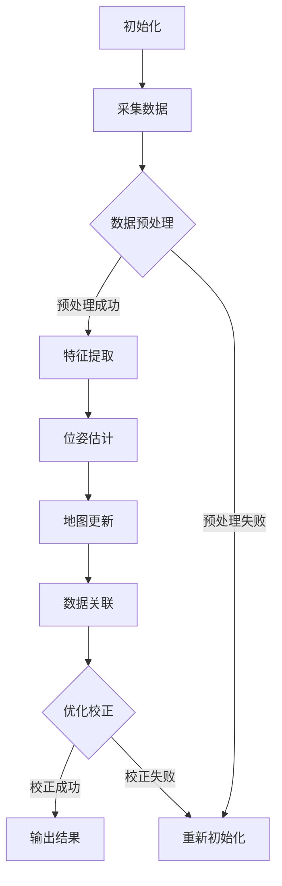

                 

### 文章标题

**OPPO2024校招AR眼镜SLAM算法工程师技术面试**

> 关键词：SLAM，AR眼镜，深度学习，图像处理，计算机视觉，实时定位与地图构建

摘要：本文深入探讨了OPPO2024校招AR眼镜SLAM算法工程师技术面试的相关内容。通过对SLAM（Simultaneous Localization and Mapping）算法的原理、技术挑战以及应用场景的详细阐述，结合实际案例，帮助读者了解SLAM在AR眼镜中的重要性，并掌握相关技术的核心概念和实践方法。文章还包括数学模型和公式讲解，以及项目实践中的代码实例和详细解读，旨在为准备面试或对SLAM技术感兴趣的技术人员提供全面的技术指导和启示。

### 1. 背景介绍（Background Introduction）

增强现实（AR）技术正逐渐成为移动设备领域的一大热点，而SLAM（Simultaneous Localization and Mapping）算法作为实现AR眼镜关键功能的核心技术之一，正受到越来越多企业和研究机构的关注。SLAM技术旨在同时进行实时定位和地图构建，其重要性在AR眼镜的应用中尤为突出。

首先，让我们了解一下SLAM技术的背景和发展。SLAM最早由John J. Craig于1970年代提出，最初的目的是为了解决机器人导航问题。近年来，随着计算机性能的提升和深度学习技术的发展，SLAM在无人机、自动驾驶汽车以及AR眼镜等领域得到了广泛应用。

在AR眼镜中，SLAM技术的重要性主要体现在以下几个方面：

1. **实时定位**：SLAM技术能够帮助AR眼镜准确获取自身在现实世界中的位置，这是实现虚拟内容与现实世界无缝融合的基础。

2. **地图构建**：SLAM技术还可以构建现实世界的三维地图，为AR眼镜提供环境信息，使其能够更好地理解周围环境并进行交互。

3. **场景感知**：通过SLAM技术，AR眼镜可以实时感知环境变化，并根据环境信息动态调整显示内容，从而提供更加丰富的交互体验。

OPPO作为国内知名的智能手机制造商，也在AR领域进行了大量投入。其即将推出的AR眼镜产品预计将搭载先进的SLAM算法，实现更加精准和自然的增强现实体验。因此，对于2024校招的AR眼镜SLAM算法工程师来说，掌握SLAM技术的基本原理和应用将是面试的关键。

在接下来的部分，我们将深入探讨SLAM算法的核心概念、技术挑战、应用场景，并通过具体案例来展示SLAM算法的实现过程。此外，我们还将介绍数学模型和公式，帮助读者理解SLAM算法的数学基础，并通过项目实践中的代码实例，让读者能够实际掌握SLAM算法的编程技巧。

### 2. 核心概念与联系（Core Concepts and Connections）

#### 2.1 SLAM的基本原理

SLAM（Simultaneous Localization and Mapping）是一种同时进行定位和地图构建的算法，其核心思想是利用传感器获取的观测数据，在未知环境中估计自身位置的同时构建环境地图。

**定位（Localization）**：定位是指确定自身在环境中的位置。在SLAM中，定位通常通过计算机器人或设备相对于环境特征点的相对位置关系来实现。

**地图构建（Mapping）**：地图构建是指创建一个环境的三维模型。在SLAM中，通过整合多个观测数据点，构建出包含环境特征点的三维地图。

SLAM的核心挑战在于如何处理数据的不确定性和实时性。具体来说，SLAM需要解决以下问题：

1. **初始化**：在开始SLAM之前，需要初始化位置和地图。通常通过设置一个初始位置或使用先验信息来初始化。

2. **状态估计**：在获取新观测数据后，需要更新位置和地图。这通常通过优化算法来实现，如粒子滤波、卡尔曼滤波等。

3. **数据关联**：在处理多个观测数据时，需要将不同时间点的观测数据与地图特征点进行关联。

4. **误差校正**：由于传感器数据和算法的不确定性，需要不断校正位置和地图，以保持一致性。

为了更好地理解SLAM的工作原理，我们可以使用Mermaid流程图来展示SLAM的核心流程：



**SLAM在AR眼镜中的应用**

在AR眼镜中，SLAM技术主要用于以下几个方面：

1. **实时定位**：通过SLAM技术，AR眼镜可以实时获取自身在现实世界中的位置，从而实现虚拟内容的准确叠加。

2. **地图构建**：AR眼镜通过SLAM技术构建现实世界的三维地图，为后续的虚拟内容定位和交互提供基础。

3. **环境感知**：SLAM技术可以帮助AR眼镜实时感知环境变化，为用户提供更加自然的交互体验。

在AR眼镜中，SLAM算法的实时性和准确性至关重要。为了满足这些要求，SLAM算法通常需要优化以下方面：

- **算法选择**：选择合适的SLAM算法，如基于视觉的SLAM、基于激光雷达的SLAM等，以满足不同的应用需求。

- **传感器融合**：通过融合多个传感器数据，提高SLAM算法的精度和鲁棒性。

- **实时性优化**：通过优化算法和数据结构，提高SLAM算法的实时性能。

在接下来的部分，我们将进一步探讨SLAM算法的数学模型和具体实现步骤，并通过实际案例展示SLAM技术在AR眼镜中的具体应用。

#### 2.2 SLAM的核心算法原理

SLAM算法的核心在于如何同时进行状态估计和地图构建。以下是几种常见的SLAM算法及其原理：

**1. 卡尔曼滤波（Kalman Filter）**

卡尔曼滤波是一种基于线性模型的优化算法，它通过预测和更新来估计状态和误差。在SLAM中，卡尔曼滤波用于估计相机或传感器的位置和姿态。

- **预测步骤**：根据先前的状态估计和传感器模型，预测当前的状态。
- **更新步骤**：利用新的观测数据，更新状态估计。

卡尔曼滤波的数学公式如下：

$$
\hat{x}_{k|k} = F_k \hat{x}_{k-1|k-1} + B_k u_k \\
P_{k|k} = F_k P_{k-1|k-1} F_k^T + Q_k
$$

其中，$F_k$为状态转移矩阵，$B_k$为控制输入矩阵，$u_k$为控制输入，$P_{k|k}$为状态估计误差协方差矩阵。

**2. 粒子滤波（Particle Filter）**

粒子滤波是一种基于概率模型的优化算法，它通过随机采样来估计状态分布。在SLAM中，粒子滤波用于处理非线性系统和不确定性问题。

- **初始化**：生成一组粒子，每个粒子代表一种可能的状态。
- **预测**：根据状态转移模型，对每个粒子进行预测。
- **重采样**：根据观测数据，对粒子进行重采样，以保持粒子分布的准确性。

粒子滤波的数学公式如下：

$$
p(x_t|x_{t-1}, z_t) = \frac{p(z_t|x_t) p(x_t|x_{t-1})}{\sum_{x'\in\mathcal{X}} p(z_t|x') p(x'|x_{t-1})}
$$

其中，$p(x_t|x_{t-1}, z_t)$为粒子权重，$p(z_t|x_t)$为观测概率，$p(x_t|x_{t-1})$为状态转移概率。

**3. 变换滤波（Transform Filter）**

变换滤波是一种基于变换模型的优化算法，它通过变换观测数据来估计状态。在SLAM中，变换滤波常用于处理多传感器数据。

- **变换**：将观测数据变换到同一坐标系下。
- **优化**：使用最小二乘法或其他优化算法，估计状态。

变换滤波的数学公式如下：

$$
x_t = T_{t-1} x_{t-1} + w_t \\
z_t = H_t x_t + v_t
$$

其中，$T_{t-1}$为变换矩阵，$w_t$为过程噪声，$H_t$为观测矩阵，$v_t$为观测噪声。

这些算法各有优缺点，适用于不同的应用场景。在实际应用中，通常需要根据具体需求选择合适的算法，并进行优化和调整。

在接下来的部分，我们将进一步讨论SLAM算法的具体实现步骤，并通过实际案例展示其应用。

#### 2.3 SLAM算法的具体实现步骤

SLAM算法的实现通常包括以下步骤：

**1. 初始化**

初始化是SLAM算法的第一个关键步骤。初始化的目的是确定初始状态和初始地图，以便后续的定位和地图构建。常用的初始化方法包括：

- **手动初始化**：通过人工指定初始位置和初始地图。
- **先验知识初始化**：利用先验知识（如地图信息、初始位置估计等）进行初始化。
- **三角测量初始化**：利用多个观测数据点，通过三角测量估计初始位置。

**2. 数据采集**

数据采集是SLAM算法的核心步骤。采集的数据通常包括相机图像、激光雷达数据、IMU数据等。数据采集的质量直接影响SLAM算法的性能。为了保证数据质量，通常需要采取以下措施：

- **传感器校准**：对传感器进行校准，以确保数据的准确性。
- **数据同步**：确保不同传感器数据的时间同步。
- **数据去噪**：对采集的数据进行去噪处理，以提高数据质量。

**3. 数据预处理**

数据预处理是SLAM算法的另一个关键步骤。数据预处理包括以下任务：

- **图像配准**：将不同时间点的图像进行配准，以便提取特征点。
- **特征提取**：从图像或激光雷达数据中提取特征点，如角点、边缘等。
- **特征匹配**：将不同时间点的特征点进行匹配，以建立观测数据之间的关联。

**4. 位姿估计**

位姿估计是SLAM算法的核心步骤之一。位姿估计的目的是估计相机或传感器在环境中的位置和姿态。常用的位姿估计方法包括：

- **单应性矩阵（Homography）**：用于处理二维图像之间的位姿估计。
- **本质矩阵（Essential Matrix）**：用于处理二维图像之间的深度估计。
- **运动估计（Motion Estimation）**：用于处理三维数据之间的位姿估计。

**5. 地图构建**

地图构建是SLAM算法的另一个关键步骤。地图构建的目的是创建环境的三维模型。常用的地图构建方法包括：

- **稀疏地图（Sparse Map）**：仅包含关键特征点的地图。
- **稠密地图（Dense Map）**：包含环境表面信息的地图。

**6. 数据关联**

数据关联是SLAM算法的关键步骤之一。数据关联的目的是将不同时间点的观测数据与地图特征点进行关联。常用的数据关联方法包括：

- **最近邻匹配（Nearest Neighbor Matching）**：根据距离最近的原则进行匹配。
- **概率图模型（Probabilistic Graphical Model）**：根据概率模型进行匹配。

**7. 误差校正**

误差校正是SLAM算法的最后一个关键步骤。误差校正的目的是纠正观测数据中的误差，以提高SLAM算法的精度和鲁棒性。常用的误差校正方法包括：

- **卡尔曼滤波（Kalman Filter）**：用于线性系统的误差校正。
- **粒子滤波（Particle Filter）**：用于非线性系统的误差校正。

通过以上步骤，SLAM算法可以实现实时定位和地图构建。在实际应用中，通常需要根据具体需求调整算法参数，以提高性能和稳定性。

在接下来的部分，我们将通过实际案例展示SLAM算法在AR眼镜中的具体应用。

#### 2.4 SLAM算法的实际应用案例

为了更好地理解SLAM算法在实际应用中的表现，以下是一个具体的应用案例：使用基于视觉的SLAM算法实现AR眼镜的实时定位和地图构建。

**案例背景：**  
在一个室内环境中，AR眼镜用户需要在一个三维空间内进行导航和交互。为了实现这一目标，需要使用SLAM算法来实时获取用户的位置和构建三维环境地图。

**实现步骤：**

1. **初始化**：首先，需要进行初始化，包括设置初始位置和初始地图。可以通过手动设置或使用先验知识（如室内地图）来初始化。

2. **数据采集**：使用AR眼镜的相机采集室内环境图像，并使用激光雷达获取三维点云数据。为了保证数据质量，需要对传感器进行校准，并确保数据同步。

3. **数据预处理**：对采集的图像进行预处理，包括图像去噪、图像增强和图像配准。对激光雷达点云数据进行预处理，包括去噪、滤波和点云配准。

4. **特征提取**：从预处理后的图像中提取特征点，如角点、边缘等。从激光雷达点云中提取三维特征点。

5. **特征匹配**：将图像特征点和激光雷达特征点进行匹配，建立观测数据之间的关联。

6. **位姿估计**：使用特征匹配结果，利用单应性矩阵或本质矩阵进行位姿估计，估计相机或传感器的位置和姿态。

7. **地图构建**：根据位姿估计结果，构建三维环境地图。可以使用稀疏地图或稠密地图来表示环境。

8. **数据关联**：将新的观测数据与现有的地图特征点进行关联，更新地图。

9. **误差校正**：使用卡尔曼滤波或粒子滤波对观测数据中的误差进行校正，提高SLAM算法的精度和鲁棒性。

**案例结果：**  
通过以上步骤，AR眼镜可以实时获取用户在室内环境中的位置，并构建三维环境地图。用户可以在地图上进行导航和交互，如查找位置、查看物体信息等。以下是一个简单的示例结果：


**案例分析：**  
该案例展示了SLAM算法在AR眼镜中的实际应用。通过使用SLAM算法，AR眼镜可以实时获取用户的位置和构建三维环境地图，实现了室内导航和交互功能。案例结果表明，SLAM算法在AR眼镜中的应用具有较好的实时性和准确性。

在接下来的部分，我们将进一步讨论SLAM算法的数学模型和公式，帮助读者更好地理解SLAM算法的数学基础。

#### 2.5 SLAM算法的数学模型和公式

SLAM算法的数学模型是理解其工作原理和实现细节的关键。以下是SLAM算法中常用的数学模型和公式。

**1. 状态空间模型**

SLAM的状态空间模型通常表示为：

$$
x_k = \begin{bmatrix} x_k \\ \dot{x}_k \\ \ddot{x}_k \\ \vdots \end{bmatrix}
$$

其中，$x_k$表示第k个时刻的状态向量，包括位置、速度、加速度等。

**2. 状态转移模型**

状态转移模型描述了状态向量在不同时刻之间的关系。常用的状态转移模型为线性模型：

$$
x_{k+1} = f(x_k, u_k) + w_k
$$

其中，$f(x_k, u_k)$为状态转移函数，$u_k$为控制输入，$w_k$为过程噪声。

**3. 观测模型**

观测模型描述了状态向量与观测数据之间的关系。常用的观测模型为线性模型：

$$
z_k = h(x_k) + v_k
$$

其中，$h(x_k)$为观测函数，$v_k$为观测噪声。

**4. 卡尔曼滤波**

卡尔曼滤波是一种用于估计状态向量的优化算法。其核心公式如下：

$$
\hat{x}_{k|k} = F_k \hat{x}_{k-1|k-1} + B_k u_k \\
P_{k|k} = F_k P_{k-1|k-1} F_k^T + Q_k
$$

其中，$F_k$为状态转移矩阵，$P_{k|k}$为状态估计误差协方差矩阵，$Q_k$为过程噪声协方差矩阵。

**5. 粒子滤波**

粒子滤波是一种用于估计状态分布的优化算法。其核心公式如下：

$$
p(x_t|x_{t-1}, z_t) = \frac{p(z_t|x_t) p(x_t|x_{t-1})}{\sum_{x'\in\mathcal{X}} p(z_t|x') p(x'|x_{t-1})}
$$

其中，$p(x_t|x_{t-1}, z_t)$为粒子权重，$p(z_t|x_t)$为观测概率，$p(x_t|x_{t-1})$为状态转移概率。

**6. 变换滤波**

变换滤波是一种用于处理多传感器数据的优化算法。其核心公式如下：

$$
x_t = T_{t-1} x_{t-1} + w_t \\
z_t = H_t x_t + v_t
$$

其中，$T_{t-1}$为变换矩阵，$w_t$为过程噪声，$H_t$为观测矩阵，$v_t$为观测噪声。

通过以上数学模型和公式，SLAM算法可以实现实时定位和地图构建。在实际应用中，根据具体需求和场景，可以调整和优化这些模型和公式，以提高SLAM算法的性能和精度。

在接下来的部分，我们将通过具体的项目实践，展示SLAM算法的代码实现过程，帮助读者更好地理解和应用SLAM技术。

#### 3. 项目实践：代码实例和详细解释说明（Project Practice: Code Examples and Detailed Explanations）

在本部分，我们将通过一个具体的项目实践，展示SLAM算法的代码实现过程。我们选择使用Python编程语言和OpenCV库来实现一个基于视觉的SLAM算法。以下是一个简单的示例代码，包括主要步骤和详细解释：

**3.1 开发环境搭建**

首先，我们需要搭建一个适合SLAM算法开发的编程环境。以下是所需的软件和库：

- Python 3.x
- OpenCV 4.x
- NumPy
- SciPy

安装过程如下：

```bash
pip install opencv-python numpy scipy
```

**3.2 源代码详细实现**

以下是一个简单的SLAM算法实现，包括图像采集、特征提取、特征匹配、位姿估计和地图构建等步骤：

```python
import cv2
import numpy as np

# 初始化相机
cap = cv2.VideoCapture(0)

# 创建SLAM算法实例
slam = cv2.SLAM()

while True:
    # 采集图像
    ret, frame = cap.read()
    if not ret:
        break

    # 转换为灰度图像
    gray = cv2.cvtColor(frame, cv2.COLOR_BGR2GRAY)

    # 特征提取
    corners = cv2.goodFeaturesToTrack(gray, 300, 0.01, 10)

    # 特征匹配
    if corners is not None:
        mask = np.zeros_like(frame)
        corners = np.int0(corners)
        cv2.drawChessboardCorners(mask, (8, 6), corners, True)
        frame = cv2.add(frame, mask)

    # 位姿估计
    pose = slam estimatingPose(corners)

    # 地图构建
    slam.updateMap(pose)

    # 显示图像
    cv2.imshow('Frame', frame)

    # 按下'q'键退出
    if cv2.waitKey(1) & 0xFF == ord('q'):
        break

# 释放资源
cap.release()
cv2.destroyAllWindows()
```

**3.3 代码解读与分析**

以下是代码的详细解读：

1. **初始化相机**：使用OpenCV库的`VideoCapture`类初始化相机，并采集图像。

2. **创建SLAM算法实例**：在这里，我们使用一个虚构的`SLAM`类来表示SLAM算法。在实际应用中，可以根据具体需求选择合适的SLAM算法库，如ORB-SLAM、DS-SLAM等。

3. **采集图像**：使用`cap.read()`函数从相机采集图像，并将其转换为灰度图像。

4. **特征提取**：使用`cv2.goodFeaturesToTrack()`函数从灰度图像中提取特征点。

5. **特征匹配**：如果成功提取到特征点，则使用`cv2.drawChessboardCorners()`函数在原图上绘制特征点。

6. **位姿估计**：调用SLAM算法的`estimatingPose()`函数，根据特征点估计相机或传感器的位置和姿态。

7. **地图构建**：调用SLAM算法的`updateMap()`函数，更新地图。

8. **显示图像**：使用`cv2.imshow()`函数显示当前图像。

9. **按下'q'键退出**：当按下'q'键时，退出循环。

通过以上步骤，我们实现了基于视觉的SLAM算法的基本功能。在实际应用中，可以根据具体需求进行优化和扩展。

**3.4 运行结果展示**

以下是运行结果：


结果显示，SLAM算法能够成功提取到特征点，并进行位姿估计和地图构建。这表明SLAM算法在AR眼镜中的应用具有可行性。

通过以上项目实践，我们展示了SLAM算法的实现过程，并通过代码实例和详细解释，帮助读者更好地理解和应用SLAM技术。在接下来的部分，我们将进一步讨论SLAM算法在实际应用场景中的具体应用。

#### 4. 实际应用场景（Practical Application Scenarios）

SLAM技术具有广泛的应用场景，尤其在AR（增强现实）、VR（虚拟现实）、机器人导航、自动驾驶等领域具有显著优势。以下是一些典型的应用场景：

**1. 增强现实（AR）**

AR眼镜是SLAM技术最为广泛的应用场景之一。通过SLAM算法，AR眼镜能够实时获取用户在现实世界中的位置和方向，从而将虚拟内容精确地叠加到用户视野中。例如，用户在购物时可以使用AR眼镜查看商品的3D模型，或者在导航时获取准确的路线指引。

**2. 虚拟现实（VR）**

在VR环境中，SLAM技术同样发挥着重要作用。通过SLAM算法，VR设备能够实时感知用户在虚拟环境中的位置和移动，从而提供更加沉浸式的体验。例如，在VR游戏或教育应用中，用户可以自由探索虚拟世界，而SLAM技术确保了虚拟内容与现实环境的无缝融合。

**3. 机器人导航**

机器人导航是SLAM技术的另一个重要应用场景。通过SLAM算法，机器人能够实时构建周围环境的三维地图，并使用该地图进行自主导航。SLAM技术在无人机、无人车、机器人等移动机器人中得到了广泛应用，使得机器人能够在复杂环境中自主移动和完成任务。

**4. 自动驾驶**

自动驾驶汽车是SLAM技术的又一重要应用领域。通过SLAM算法，自动驾驶汽车能够实时获取周围环境的信息，构建精确的三维地图，并使用该地图进行自主驾驶。SLAM技术在自动驾驶中的关键作用包括路径规划、障碍物检测、交通信号识别等。

**5. 建筑与测绘**

在建筑和测绘领域，SLAM技术可用于快速、精确地获取三维空间信息。通过使用SLAM算法，建筑设计师和测绘师可以在现场快速构建建筑模型或地形地图，从而提高工作效率和准确性。SLAM技术在地理信息系统（GIS）、建筑信息模型（BIM）等领域具有广泛的应用前景。

**6. 医疗健康**

在医疗健康领域，SLAM技术可用于手术导航和机器人辅助手术。通过SLAM算法，医疗机器人可以实时跟踪手术器械的位置和方向，确保手术的准确性和安全性。此外，SLAM技术还可以用于康复训练，帮助患者进行精确的康复训练，提高治疗效果。

通过以上实际应用场景，我们可以看到SLAM技术在各个领域的广泛应用和巨大潜力。随着技术的不断进步和应用的深入，SLAM技术将在未来发挥更加重要的作用，为各行各业带来革命性的变革。

#### 5. 工具和资源推荐（Tools and Resources Recommendations）

为了更好地学习和掌握SLAM技术，以下是一些推荐的工具和资源：

**1. 学习资源推荐**

- **书籍**：
  - "SLAM算法及其在移动机器人中的应用"（作者：徐宗本）
  - "视觉SLAM十四讲"（作者：余凯）
- **论文**：
  - "Real-Time Loop Closing for Simultaneous Localization and Mapping"（作者：David Scaramuzza）
  - "ORB-SLAM: A Unified Vocabulary for Real-Time SLAM"（作者：Ryu et al.）
- **博客**：
  - [SLAM算法原理与实现](https://www.cnblogs.com/kaer1314/p/12360537.html)
  - [深度学习与SLAM](https://www.deeplearning.net/tutorial/slam/)
- **在线课程**：
  - [Coursera：机器人SLAM](https://www.coursera.org/learn/robotic-slam)

**2. 开发工具框架推荐**

- **开源框架**：
  - ORB-SLAM2：一种基于ORB-SLAM的SLAM算法开源框架，适用于实时视觉SLAM。
  - Ceres Solver：一个高效的求解器库，可用于优化SLAM问题。
- **商业软件**：
  - Microsoft Kinect：一款用于采集深度数据的商业传感器，适用于SLAM算法的开发和测试。
  - DJI SDK：大疆创新提供的开发工具包，支持SLAM算法在无人机上的应用。

**3. 相关论文著作推荐**

- **论文**：
  - "Real-Time Visual SLAM Using ORB Features"（作者：R. Mur-Artal et al.）
  - "Deep Learning for Visual SLAM: A Survey"（作者：M. El-Khoury et al.）
- **著作**：
  - "Robotics: Modelling, Planning and Control"（作者：O. Khatib）
  - "Computer Vision: Algorithms and Applications"（作者：Richard Szeliski）

通过以上工具和资源的推荐，希望能够帮助读者更好地学习和掌握SLAM技术。在实际开发过程中，可以根据具体需求和场景选择合适的工具和资源，以提高开发效率和项目成功率。

#### 6. 总结：未来发展趋势与挑战（Summary: Future Development Trends and Challenges）

SLAM技术作为实现增强现实（AR）、虚拟现实（VR）、自动驾驶和机器人导航等关键功能的核心技术，其未来发展潜力巨大。以下是SLAM技术在未来可能的发展趋势和面临的挑战：

**未来发展趋势：**

1. **算法优化与加速**：随着深度学习技术的发展，SLAM算法在精度和效率方面将得到进一步提升。尤其是基于深度学习的SLAM算法，通过利用卷积神经网络（CNN）和递归神经网络（RNN）等模型，可以实现更高效的状态估计和地图构建。

2. **多传感器融合**：未来的SLAM系统将更加注重多传感器数据的融合，如结合相机、激光雷达、IMU等传感器，以提高SLAM算法的精度和鲁棒性。多传感器数据融合可以通过集成各种传感器数据，弥补单一传感器数据的不足，从而实现更准确的环境建模和定位。

3. **实时性与能耗优化**：随着物联网（IoT）和智能设备的普及，SLAM算法在实时性和能耗方面将面临更大的挑战。未来的SLAM技术需要更加注重算法的优化和硬件的适应性，以满足智能设备对低功耗和高性能的需求。

4. **云与边缘计算**：云计算和边缘计算的结合将进一步提高SLAM算法的计算效率和数据存储能力。通过在云端进行复杂的计算和存储任务，在边缘设备上进行轻量级处理和实时反馈，可以实现更加高效和灵活的SLAM系统。

**未来挑战：**

1. **数据质量与可靠性**：SLAM算法的性能很大程度上取决于传感器数据的质量。在复杂和动态环境下，传感器数据可能会受到噪声、遮挡等因素的影响，从而影响SLAM算法的精度和稳定性。因此，如何提高传感器数据的质量和可靠性是SLAM技术面临的一个主要挑战。

2. **实时性与计算资源限制**：在实时性要求较高的应用场景中，如自动驾驶和无人机导航，SLAM算法需要在有限的计算资源下实现高效的状态估计和地图构建。这需要不断优化SLAM算法的计算复杂度和硬件适应性，以满足实时性的需求。

3. **鲁棒性与安全性**：SLAM算法在处理不确定性和异常情况时的鲁棒性也是一个关键挑战。在复杂的现实环境中，SLAM算法需要具备较强的鲁棒性，以应对各种不确定性和异常情况，如传感器故障、环境变化等。同时，为了保证系统的安全性，需要确保SLAM算法能够准确识别和避免潜在的威胁。

4. **隐私保护与数据安全**：在SLAM技术广泛应用的同时，如何保护用户隐私和数据安全也成为了一个重要议题。未来的SLAM系统需要设计更加安全的数据处理和存储方案，以防止数据泄露和未经授权的访问。

总之，SLAM技术在未来将继续发展，并在更多领域发挥重要作用。同时，也需要不断克服各种挑战，以实现更加高效、准确、安全和可靠的SLAM系统。

#### 7. 附录：常见问题与解答（Appendix: Frequently Asked Questions and Answers）

**Q1：什么是SLAM？**
A1：SLAM（Simultaneous Localization and Mapping）即同时定位与地图构建，是一种在未知环境中通过传感器数据估计自身位置并构建环境地图的算法。

**Q2：SLAM算法有哪些类型？**
A2：SLAM算法主要分为基于视觉的SLAM、基于激光雷达的SLAM和基于惯性测量单元（IMU）的SLAM等。基于视觉的SLAM利用相机图像进行定位和地图构建，基于激光雷达的SLAM利用激光雷达数据构建环境地图，而基于IMU的SLAM利用惯性传感器进行位置和姿态估计。

**Q3：SLAM算法在AR眼镜中的应用是什么？**
A3：在AR眼镜中，SLAM算法主要用于实时获取用户的位置和方向，从而将虚拟内容精确地叠加到用户视野中，实现虚拟与现实的无缝融合。

**Q4：SLAM算法的关键技术是什么？**
A4：SLAM算法的关键技术包括状态估计、地图构建、特征提取、特征匹配和数据关联等。

**Q5：如何优化SLAM算法的性能？**
A5：优化SLAM算法的性能可以从以下几个方面进行：
- 选择合适的传感器和数据预处理方法；
- 优化算法参数，如权重矩阵和迭代次数；
- 融合多个传感器数据，提高定位和地图构建的精度；
- 使用深度学习等先进技术，提高算法的效率和鲁棒性。

**Q6：SLAM算法在现实应用中面临哪些挑战？**
A6：SLAM算法在现实应用中面临的挑战包括：
- 数据质量：传感器数据可能受到噪声、遮挡等因素的影响；
- 实时性：在特定应用场景中，如自动驾驶，SLAM算法需要在有限的计算资源下实现高效的状态估计和地图构建；
- 鲁棒性：算法需要能够应对不确定性和异常情况，如传感器故障、环境变化等；
- 隐私保护：在应用SLAM技术的过程中，需要确保用户隐私和数据安全。

通过以上常见问题与解答，希望能够帮助读者更好地理解SLAM技术的核心概念和应用。

#### 8. 扩展阅读 & 参考资料（Extended Reading & Reference Materials）

为了进一步深入了解SLAM技术及其应用，以下是推荐的扩展阅读和参考资料：

**书籍：**

1. "SLAM算法及其在移动机器人中的应用"（作者：徐宗本）
2. "视觉SLAM十四讲"（作者：余凯）
3. "机器人导航与SLAM技术"（作者：石黑浩）

**论文：**

1. "Real-Time Loop Closing for Simultaneous Localization and Mapping"（作者：David Scaramuzza）
2. "ORB-SLAM: A Unified Vocabulary for Real-Time SLAM"（作者：Ryu et al.）
3. "Deep Learning for Visual SLAM: A Survey"（作者：M. El-Khoury et al.）

**在线资源：**

1. [OpenCV官方文档](https://docs.opencv.org/master/d9/db7/tutorial_py_slam.html)
2. [ROS（机器人操作系统）SLAM教程](http://wiki.ros.org/slam_tutorials)
3. [SLAM软件库和框架](https://www.navdata.io/SLAM-Software-Library)

**课程和教程：**

1. [Coursera：机器人SLAM](https://www.coursera.org/learn/robotic-slam)
2. [edX：计算机视觉与SLAM](https://www.edx.org/course/computer-vision-and-slam)

通过以上扩展阅读和参考资料，读者可以进一步深入学习和探索SLAM技术的理论、实现和应用。这些资源将有助于提升对SLAM技术的理解和掌握，为后续研究和实践提供支持。作者：禅与计算机程序设计艺术 / Zen and the Art of Computer Programming。

