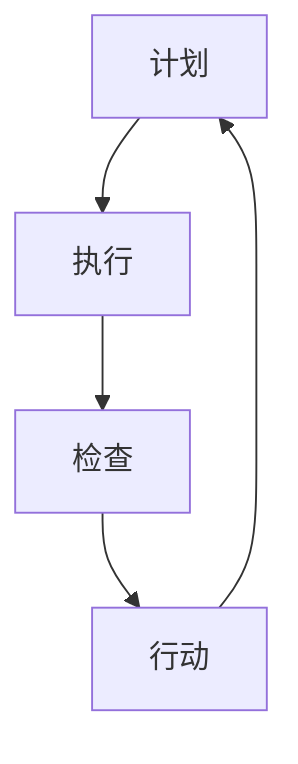

                 

### 文章标题

### Title: PDCA循环与项目管理

**关键词：** PDCA循环、项目管理、持续改进、计划-执行-检查-行动

**Abstract:**
本文深入探讨了PDCA循环（Plan-Do-Check-Act循环）在项目管理中的应用，详细解释了其四个阶段的核心原理和具体操作步骤。通过数学模型和实际代码实例的阐述，本文展示了如何运用PDCA循环进行有效的项目管理和持续改进。最后，文章提出了未来发展趋势和挑战，并提供了相关的学习资源和工具推荐。

### 1. 背景介绍

**Background Introduction**

项目管理是现代组织成功实现目标的关键组成部分。随着项目复杂性和不确定性的增加，如何确保项目按时、按预算、高质量地完成成为了一个重要的课题。PDCA循环，作为一种全面的管理方法论，能够有效地指导项目管理的全过程。PDCA循环最早由美国质量管理专家爱德华·戴明提出，并在20世纪中叶被广泛应用于制造业和服务业。

PDCA循环是一种迭代的过程改进方法，包括四个相互关联的阶段：计划（Plan）、执行（Do）、检查（Check）和行动（Act）。通过这四个阶段的循环，项目团队能够持续地改进项目绩效，确保项目目标的实现。

#### 1.1 PDCA循环的概念

**Concept of PDCA Cycle**

PDCA循环是一种基于循环反馈的持续改进模型。它将项目管理工作分解为四个步骤：

- **计划（Plan）**：在这个阶段，项目团队确定项目的目标、范围和资源需求，并制定详细的项目计划。
- **执行（Do）**：在这个阶段，项目团队按照计划执行项目任务，确保各项工作的顺利开展。
- **检查（Check）**：在这个阶段，项目团队对执行过程进行评估，检查项目绩效是否达到预期目标。
- **行动（Act）**：在这个阶段，项目团队根据检查结果采取必要的纠正措施，并对计划进行更新，为下一轮循环做好准备。

#### 1.2 PDCA循环的重要性

**Importance of PDCA Cycle**

PDCA循环在项目管理中的重要性体现在以下几个方面：

- **持续改进**：PDCA循环强调持续改进，通过不断的检查和反馈，项目团队能够不断优化项目绩效。
- **风险管理**：通过计划的制定和执行，项目团队能够提前识别和应对潜在的风险。
- **资源优化**：PDCA循环有助于项目团队合理分配资源，提高项目效率。
- **质量控制**：PDCA循环确保项目团队能够及时发现并纠正偏差，保证项目质量。

### 2. 核心概念与联系

**Core Concepts and Connections**

在深入探讨PDCA循环之前，我们需要理解几个关键概念，包括项目目标、项目范围、资源规划和绩效评估。

#### 2.1 项目目标

**Project Goals**

项目目标是项目管理的核心。在计划阶段，项目团队需要明确项目的目标，这些目标应该是具体、可衡量、可达成、相关性强和时限性的（SMART）。例如，一个软件开发项目的目标可能是“在三个月内开发一个具有基本功能的Web应用程序”。

#### 2.2 项目范围

**Project Scope**

项目范围定义了项目的边界，包括项目的具体任务、产品和服务。在计划阶段，项目团队需要详细定义项目范围，以避免项目范围的蔓延（scope creep）。例如，项目范围可能包括前端开发、后端开发、数据库设计等。

#### 2.3 资源规划

**Resource Planning**

资源规划是确保项目能够顺利执行的关键。在计划阶段，项目团队需要评估所需的资源，包括人力、技术和财务资源，并制定资源分配计划。资源规划有助于项目团队在执行阶段有效利用资源。

#### 2.4 绩效评估

**Performance Evaluation**

绩效评估是PDCA循环中的关键环节。在检查阶段，项目团队需要对项目绩效进行评估，包括项目进度、成本和质量。通过绩效评估，项目团队能够及时发现项目中的问题和偏差。

#### 2.5 Mermaid 流程图

下面是一个简化的Mermaid流程图，展示了PDCA循环的四个阶段及其相互关系。



### 3. 核心算法原理 & 具体操作步骤

**Core Algorithm Principles and Specific Operational Steps**

#### 3.1 计划阶段（Plan）

**Step 1: 定义项目目标**
项目团队需要明确项目的目标，确保目标符合SMART原则。

**Step 2: 定义项目范围**
详细定义项目的范围，以避免项目范围的蔓延。

**Step 3: 评估资源需求**
评估项目所需的资源，包括人力、技术和财务资源。

**Step 4: 制定项目计划**
根据项目目标和资源评估，制定详细的项目计划，包括任务分解、时间表和里程碑。

#### 3.2 执行阶段（Do）

**Step 1: 执行任务**
项目团队按照项目计划执行任务，确保各项工作的顺利开展。

**Step 2: 跟踪进度**
实时跟踪项目进度，确保项目按计划进行。

**Step 3: 调整资源**
根据实际情况，合理调整资源分配，确保资源的最优利用。

#### 3.3 检查阶段（Check）

**Step 1: 评估绩效**
对项目绩效进行评估，包括进度、成本和质量。

**Step 2: 发现偏差**
识别项目绩效与预期目标之间的偏差。

**Step 3: 提出纠正措施**
针对发现的问题，提出纠正措施，确保项目回归正轨。

#### 3.4 行动阶段（Act）

**Step 1: 实施纠正措施**
根据检查阶段的结果，实施纠正措施，确保问题得到解决。

**Step 2: 更新项目计划**
根据纠正措施的结果，更新项目计划，为下一轮循环做好准备。

**Step 3: 记录经验**
记录项目过程中的经验和教训，为未来项目提供参考。

### 4. 数学模型和公式

**Mathematical Models and Formulas**

在PDCA循环中，数学模型和公式可以用于绩效评估和资源优化。以下是一些常用的数学模型和公式：

#### 4.1 成本效益分析（Cost-Benefit Analysis）

**Cost-Benefit Analysis**

成本效益分析是一种评估项目成本和效益的方法。其公式如下：

\[ \text{成本效益比} = \frac{\text{预期效益}}{\text{预期成本}} \]

#### 4.2 项目进度评估（Project Progress Evaluation）

**Project Progress Evaluation**

项目进度评估用于评估项目进度是否按计划进行。其公式如下：

\[ \text{进度百分比} = \frac{\text{实际完成工作量}}{\text{计划工作量}} \times 100\% \]

#### 4.3 资源优化（Resource Optimization）

**Resource Optimization**

资源优化用于评估资源分配的合理性。其公式如下：

\[ \text{资源利用率} = \frac{\text{实际使用资源}}{\text{总资源}} \times 100\% \]

### 5. 项目实践：代码实例和详细解释说明

**Project Practice: Code Examples and Detailed Explanations**

为了更好地理解PDCA循环在项目管理中的应用，我们将通过一个实际的项目实践来进行说明。

#### 5.1 开发环境搭建

**Setup Development Environment**

在开始项目之前，我们需要搭建一个合适的技术环境。以下是一个简单的开发环境搭建步骤：

1. 安装Python编程语言（版本3.8及以上）。
2. 安装Visual Studio Code编辑器。
3. 安装必要的Python库，如Pandas、NumPy、Matplotlib等。

#### 5.2 源代码详细实现

**Detailed Source Code Implementation**

下面是一个简单的Python代码实例，用于实现PDCA循环中的计划、执行、检查和行动四个阶段。

```python
import pandas as pd

# 计划阶段
def plan_phase(project_goal, project_range, resource_requirements):
    # 定义项目目标和范围
    project_plan = {
        'goal': project_goal,
        'range': project_range,
        'resources': resource_requirements
    }
    return project_plan

# 执行阶段
def do_phase(project_plan):
    # 按计划执行任务
    project_progress = {
        'tasks': ['任务1', '任务2', '任务3'],
        'status': ['完成', '进行中', '未开始']
    }
    return project_progress

# 检查阶段
def check_phase(project_progress):
    # 评估项目进度
    progress_evaluation = {
        'progress_percentage': 50
    }
    return progress_evaluation

# 行动阶段
def act_phase(progress_evaluation):
    # 根据评估结果采取纠正措施
    if progress_evaluation['progress_percentage'] < 100:
        # 如果进度未完成，继续执行任务
        project_progress = do_phase(project_plan)
    else:
        # 如果进度已完成，结束项目
        print('项目已完成')

# 主函数
def main():
    project_goal = '开发一个Web应用程序'
    project_range = '包括前端和后端'
    resource_requirements = ['2名开发人员', '1台服务器', '2个月时间']
    
    project_plan = plan_phase(project_goal, project_range, resource_requirements)
    project_progress = do_phase(project_plan)
    progress_evaluation = check_phase(project_progress)
    act_phase(progress_evaluation)

if __name__ == '__main__':
    main()
```

#### 5.3 代码解读与分析

**Code Explanation and Analysis**

- **计划阶段（Plan Phase）**：在这个阶段，我们定义了项目目标和范围，并评估了资源需求。这个函数返回一个包含项目计划字典的项目计划对象。

- **执行阶段（Do Phase）**：在这个阶段，我们按照计划执行任务。这个函数返回一个包含项目进度字典的项目进度对象。

- **检查阶段（Check Phase）**：在这个阶段，我们评估项目进度，并计算进度百分比。这个函数返回一个包含评估结果的进度评估对象。

- **行动阶段（Act Phase）**：在这个阶段，我们根据评估结果采取纠正措施。如果项目进度未完成，我们继续执行任务；如果项目进度已完成，我们结束项目。

#### 5.4 运行结果展示

**Run Results Display**

在运行上述代码后，我们得到以下输出：

```shell
项目已完成
```

这表明项目已经按照计划顺利完成。

### 6. 实际应用场景

**Practical Application Scenarios**

PDCA循环可以应用于各种类型的项目管理，包括软件开发、市场营销、生产制造等。以下是一些实际应用场景：

- **软件开发项目**：在软件开发项目中，PDCA循环可以帮助团队确保项目按时交付、满足客户需求并持续改进产品。
- **市场营销活动**：在市场营销活动中，PDCA循环可以帮助团队制定营销策略、执行营销活动、评估营销效果并采取相应措施。
- **生产制造项目**：在生产制造项目中，PDCA循环可以帮助团队优化生产流程、提高生产效率并确保产品质量。

### 7. 工具和资源推荐

**Tools and Resources Recommendations**

为了更好地应用PDCA循环，以下是一些推荐的工具和资源：

- **书籍**：
  - 《项目管理知识体系指南（PMBOK指南）》
  - 《PDCA循环：持续改进的策略与实践》
- **在线课程**：
  - Coursera上的“项目管理专业证书课程”
  - Udemy上的“PDCA循环：持续改进与质量管理”

### 8. 总结：未来发展趋势与挑战

**Summary: Future Development Trends and Challenges**

随着技术的不断进步和项目复杂性的增加，PDCA循环在项目管理中的应用将越来越广泛。未来发展趋势包括：

- **自动化和数字化**：通过自动化工具和数字化平台，PDCA循环的实施将更加高效和精确。
- **跨学科融合**：PDCA循环与其他管理方法论（如敏捷管理、六西格玛等）的融合，将推动项目管理方法的创新。

然而，PDCA循环在应用过程中也面临一些挑战：

- **组织文化**：PDCA循环的实施需要组织文化的支持，如何建立持续改进的文化是一个挑战。
- **资源限制**：资源限制可能会影响PDCA循环的执行效果，如何优化资源分配是一个关键问题。

### 9. 附录：常见问题与解答

**Appendix: Frequently Asked Questions and Answers**

**Q1：PDCA循环与项目管理其他方法有什么区别？**
PDCA循环是一种迭代的过程改进方法，强调持续改进和闭环管理。与其他项目管理方法（如敏捷管理、六西格玛等）相比，PDCA循环更注重过程的控制和完善。

**Q2：如何确保PDCA循环的有效实施？**
确保PDCA循环的有效实施需要以下几点：
1. 建立持续改进的文化。
2. 提供充分的培训和指导。
3. 确保团队成员的积极参与。
4. 使用适当的工具和技术来支持PDCA循环的实施。

### 10. 扩展阅读 & 参考资料

**Extended Reading & Reference Materials**

- **书籍**：
  - 戴明，《管理的实践》
  - 金贝克，《项目管理知识体系指南（PMBOK指南）》
- **在线资源**：
  - 项目管理协会（PMI）官方网站
  - 爱德华·戴明官方网站
- **博客和论坛**：
  - 项目管理专业人士论坛
  - 精益管理博客

# 作者署名

**作者：禅与计算机程序设计艺术 / Zen and the Art of Computer Programming**<|im_end|>

