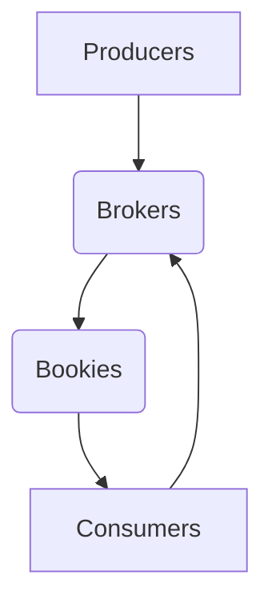

                 

### 1. 背景介绍（Background Introduction）

Pulsar 是一个开源的分布式发布-订阅消息系统，被广泛用于大数据、流处理和实时计算场景中。Pulsar 的设计目标是提供低延迟、高吞吐量、高可靠性和易扩展的消息传输解决方案。在这个系统中，生产者（Producer）和消费者（Consumer）是核心组件。

生产者负责将消息发送到 Pulsar 的主题（Topic）中，而消费者则从主题中拉取消息进行消费。在生产者与 Pulsar 集群之间的交互过程中，生产者需要了解如何正确地发送消息、如何处理消息发送过程中的异常情况、如何保证消息的可靠传输等。

本文将重点介绍 Pulsar 生产者的原理和代码实例，帮助读者深入理解 Pulsar 生产者的工作机制，以便在实际项目中更有效地使用 Pulsar。通过本文的阅读，您将了解到：

- Pulsar 的基本架构和核心概念。
- Pulsar 生产者的工作流程和关键组件。
- 如何使用 Java SDK 编写一个简单的 Pulsar 生产者应用程序。
- Pulsar 生产者中的一些高级特性和使用场景。

在接下来的章节中，我们将一步步分析并讲解这些内容。首先是 Pulsar 的基本架构和核心概念。

### Basic Architecture and Core Concepts of Pulsar

Pulsar's architecture is designed to handle high throughput, low latency, and high availability. The core components of Pulsar include Producers, Consumers, Brokers, and Bookies.

- **Producers**: Producers are responsible for publishing messages to topics in Pulsar. They send messages to the Broker, which then routes them to the appropriate Bookies for storage and processing.
- **Consumers**: Consumers are responsible for reading and processing messages from topics. They connect to the Broker to receive messages, which are then distributed to the appropriate Bookies.
- **Brokers**: Brokers are the central hub in Pulsar that routes messages between Producers and Consumers. They maintain metadata about topics and partitions, and manage the distribution of messages.
- **Bookies**: Bookies are the storage nodes in Pulsar that store messages. They receive messages from Brokers and make them available to Consumers.

### 2. 核心概念与联系（Core Concepts and Connections）

在深入探讨 Pulsar 生产者之前，我们需要了解几个核心概念：主题（Topic）、分区（Partition）、消息（Message）和批次（Batch）。

#### Topics
A **Topic** is a stream of messages with a unique identifier. It can be thought of as a logical grouping of related messages. In Pulsar, messages are published to topics and consumed from them.

#### Partitions
A **Partition** is a subset of a topic. Each partition contains a sequence of messages, and messages are distributed across partitions to balance the load across the cluster. Each partition has a unique ID within its topic.

#### Messages
A **Message** is the data unit that is published to or consumed from a topic. Each message has a unique ID (generated by the Producer) and metadata, such as the content type and schema information.

#### Batches
A **Batch** is a group of messages that are sent together as a single unit. Pulsar supports batching to improve throughput and reduce the number of network round trips.

### Mermaid Flowchart of Pulsar Components
The following Mermaid flowchart illustrates the flow of messages between Producers, Consumers, Brokers, and Bookies in Pulsar.



### 3. 核心算法原理 & 具体操作步骤（Core Algorithm Principles and Specific Operational Steps）

Pulsar 生产者的核心工作流程可以概括为以下几个步骤：

#### 1. 创建连接（Create Connection）
首先，生产者需要创建一个连接到 Pulsar 集群的连接。这个连接由 `PulsarClient` 类提供，它是生产者与 Pulsar 集群通信的桥梁。

```java
PulsarClient client = PulsarClient.builder()
    .serviceUrl("pulsar://localhost:6650")
    .build();
```

#### 2. 选择主题（Select Topic）
接下来，生产者需要选择一个主题（Topic）来发送消息。主题是消息的逻辑容器，每个主题都可以有多个分区（Partitions）。

```java
String topic = "my-topic";
```

#### 3. 发送消息（Send Message）
生产者通过调用 `producer.send()` 方法来发送消息。这个方法可以发送单个消息或消息批次。

```java
client.newProducer()
    .topic(topic)
    .send(message);
```

#### 4. 异常处理（Exception Handling）
在生产消息的过程中，可能会出现各种异常情况，如网络问题、服务器故障等。生产者需要对这些异常情况进行处理，以保证系统的健壮性。

```java
try {
    client.newProducer()
        .topic(topic)
        .send(message);
} catch (PulsarClientException e) {
    // 处理异常
}
```

#### 5. 关闭连接（Close Connection）
最后，生产者需要关闭连接，释放资源。

```java
client.close();
```

### 4. 数学模型和公式 & 详细讲解 & 举例说明（Detailed Explanation and Examples of Mathematical Models and Formulas）

Pulsar 生产者涉及到一些基本的数学模型和公式，用于计算消息发送的速度、批次大小和分区策略等。

#### 1. 消息发送速度（Message Sending Speed）

消息发送速度是指单位时间内发送的消息数量。可以用以下公式计算：

$$
速度 = \frac{消息数量}{时间}
$$

#### 2. 批次大小（Batch Size）

批次大小是指每个批次包含的消息数量。批次大小影响消息发送的效率和系统负载。通常，批次大小需要根据系统的实际需求进行调整。

#### 3. 分区策略（Partition Strategy）

分区策略是指如何将消息分布到不同的分区。Pulsar 提供了多种分区策略，如 Hash 分区、RoundRobin 分区等。

```mermaid
graph TB
A[Hash 分区] --> B({分区1})
A --> C({分区2})
A --> D({分区3})
```

### 4.1 Hash 分区（Hash Partitioning）

Hash 分区是一种常见的分区策略，它通过将消息的 ID 计算出一个哈希值，然后将哈希值映射到特定的分区。

#### 4.2 RoundRobin 分区（RoundRobin Partitioning）

RoundRobin 分区是一种简单的分区策略，它按照轮询顺序将消息分配到各个分区。

### 5. 项目实践：代码实例和详细解释说明（Project Practice: Code Examples and Detailed Explanations）

在本节中，我们将通过一个简单的 Java 代码实例，演示如何使用 Pulsar 生产者发送消息。

#### 5.1 开发环境搭建

首先，我们需要搭建一个 Pulsar 开发环境。具体步骤如下：

1. 下载并解压 Pulsar 二进制包。
2. 启动 Pulsar 集群。
3. 配置 Java 开发环境，包括引入 Pulsar SDK。

#### 5.2 源代码详细实现

下面是一个简单的 Pulsar 生产者 Java 代码示例：

```java
import org.apache.pulsar.client.api.*;

public class PulsarProducerExample {
    public static void main(String[] args) {
        try {
            // 创建连接
            PulsarClient client = PulsarClient.builder()
                .serviceUrl("pulsar://localhost:6650")
                .build();

            // 选择主题
            String topic = "my-topic";

            // 创建生产者
            Producer<String> producer = client.newProducer()
                .topic(topic)
                .create();

            // 发送消息
            for (int i = 0; i < 10; i++) {
                producer.send("Hello Pulsar " + i);
            }

            // 关闭连接
            producer.close();
            client.close();
        } catch (PulsarClientException e) {
            e.printStackTrace();
        }
    }
}
```

#### 5.3 代码解读与分析

1. **创建连接（Create Connection）**：
   ```java
   PulsarClient client = PulsarClient.builder()
       .serviceUrl("pulsar://localhost:6650")
       .build();
   ```
   这里我们使用 `PulsarClient.builder()` 方法创建一个连接到本地 Pulsar 集群的客户端。

2. **选择主题（Select Topic）**：
   ```java
   String topic = "my-topic";
   ```
   我们定义了一个主题 `my-topic`，用于接收生产者发送的消息。

3. **创建生产者（Create Producer）**：
   ```java
   Producer<String> producer = client.newProducer()
       .topic(topic)
       .create();
   ```
   这里我们使用 `client.newProducer()` 方法创建一个生产者，并指定主题为 `my-topic`。

4. **发送消息（Send Message）**：
   ```java
   for (int i = 0; i < 10; i++) {
       producer.send("Hello Pulsar " + i);
   }
   ```
   我们使用 `producer.send()` 方法向主题 `my-topic` 发送了 10 条消息，每条消息都是字符串格式。

5. **关闭连接（Close Connection）**：
   ```java
   producer.close();
   client.close();
   ```
   在完成消息发送后，我们调用 `producer.close()` 和 `client.close()` 方法关闭生产者和客户端连接，释放资源。

#### 5.4 运行结果展示

当我们运行这个示例程序时，Pulsar 生产者将向主题 `my-topic` 发送 10 条消息。我们可以通过 Pulsar 集群的 Web 界面查看这些消息的状态和详情。

### 6. 实际应用场景（Practical Application Scenarios）

Pulsar 生产者广泛应用于多种实际场景中，包括但不限于以下几种：

1. **实时数据处理**：在实时数据处理场景中，生产者可以负责将采集到的数据实时发送到 Pulsar 集群，供消费者进行实时分析和处理。
2. **日志收集和监控**：生产者可以负责将来自不同来源的日志数据发送到 Pulsar 集群，供日志分析工具或监控系统进行实时监控和报警。
3. **消息推送**：在生产消息推送场景中，生产者可以负责将推送消息发送到 Pulsar 集群，供消费者将消息推送到客户端。

### 7. 工具和资源推荐（Tools and Resources Recommendations）

#### 7.1 学习资源推荐

- **书籍**：《Pulsar实战》是一本关于 Pulsar 的入门指南，适合初学者阅读。
- **论文**：Pulsar 的核心论文《Pulsar: A Distributed Message Queue System》详细介绍了 Pulsar 的架构和设计原理。
- **博客**：Apache Pulsar 官方博客提供了大量关于 Pulsar 的教程和实践经验，是学习 Pulsar 的宝贵资源。
- **网站**：Apache Pulsar 官网（https://pulsar.apache.org/）是获取 Pulsar 相关信息和资源的最佳网站。

#### 7.2 开发工具框架推荐

- **IDE**：Eclipse 和 IntelliJ IDEA 是最常用的 Java 开发工具，都支持 Pulsar SDK。
- **Pulsar SDK**：Apache Pulsar 提供了多种语言的 SDK，包括 Java、Python、Go 等，方便开发人员使用。
- **Pulsar UI**：Pulsar UI 是一个开源的 Web 界面，用于监控和管理 Pulsar 集群。

#### 7.3 相关论文著作推荐

- **《Pulsar: A Distributed Message Queue System》**：这是 Pulsar 的核心论文，详细介绍了 Pulsar 的架构和设计原理。
- **《Data-Intensive Text Processing with MapReduce》**：这本书介绍了如何使用 MapReduce 实现大规模文本处理，其中涉及了消息队列和分布式系统的基础知识。

### 8. 总结：未来发展趋势与挑战（Summary: Future Development Trends and Challenges）

Pulsar 作为一种高性能、高可靠性的消息系统，在未来将继续得到广泛的应用和发展。以下是 Pulsar 未来发展的几个趋势和挑战：

1. **性能优化**：随着大数据和实时处理需求的不断增加，Pulsar 需要持续优化性能，提高系统的吞吐量和低延迟。
2. **功能增强**：Pulsar 需要继续增强其功能，包括支持更多的消息格式、提供更丰富的监控和报警功能、优化分区策略等。
3. **生态系统建设**：Pulsar 需要建立更加完善的生态系统，包括开源社区、商业支持、培训资源等，以促进其在各行业中的应用和普及。
4. **安全性和可靠性**：随着 Pulsar 在关键业务场景中的使用越来越多，其安全性和可靠性成为至关重要的因素。Pulsar 需要不断提升安全性和可靠性，确保系统的稳定运行。

### 9. 附录：常见问题与解答（Appendix: Frequently Asked Questions and Answers）

#### 9.1 如何选择合适的主题和分区策略？

选择合适的主题和分区策略取决于实际应用场景和需求。以下是一些常见建议：

- **主题**：根据消息类型和用途选择主题。如果消息之间具有强关联性，可以使用同一个主题；如果需要不同类型的消息共存，可以使用不同的主题。
- **分区策略**：根据系统的负载和性能要求选择分区策略。对于高吞吐量的场景，可以使用 Hash 分区；对于负载均衡和故障转移，可以使用 RoundRobin 分区。

#### 9.2 如何处理消息发送失败的情况？

处理消息发送失败的情况通常有以下几种方法：

- **重试机制**：在发送消息时设置重试次数和间隔时间，以尝试重新发送失败的消息。
- **回调函数**：在发送消息时，可以使用回调函数（Callback）来处理发送结果，包括成功和失败的情况。
- **死信队列**：将无法发送的消息存储在死信队列中，供后续分析和处理。

#### 9.3 如何保证消息的顺序性？

在 Pulsar 中，可以通过以下方法保证消息的顺序性：

- **顺序消息**：使用 Pulsar 的顺序消息功能，确保消息按顺序发送和消费。
- **序列号**：在消息中添加序列号，并根据序列号保证消息的顺序。

### 10. 扩展阅读 & 参考资料（Extended Reading & Reference Materials）

- **《Pulsar实战》**：https://www.packtpub.com/application-development/pulsar-practice
- **《Pulsar: A Distributed Message Queue System》**：https://www.usenix.org/conference/atc16/technical-sessions/pulsar-distributed-message-queue-system
- **Apache Pulsar 官网**：https://pulsar.apache.org/
- **Apache Pulsar 官方文档**：https://pulsar.apache.org/docs/

通过本文的阅读，您应该已经对 Pulsar 生产者有了深入的了解。希望本文能帮助您在实际项目中更好地使用 Pulsar，实现高效的消息传输和处理。如果您有任何疑问或建议，欢迎在评论区留言讨论。作者：禅与计算机程序设计艺术 / Zen and the Art of Computer Programming。

